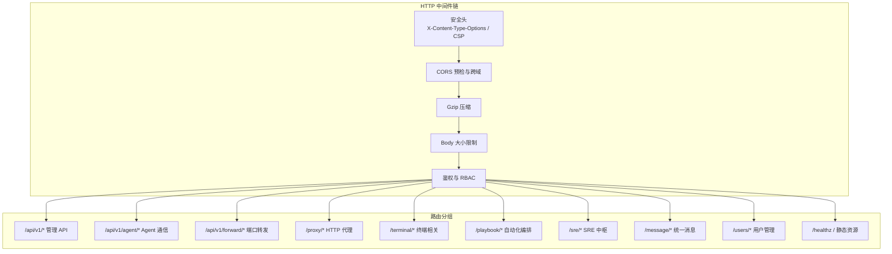
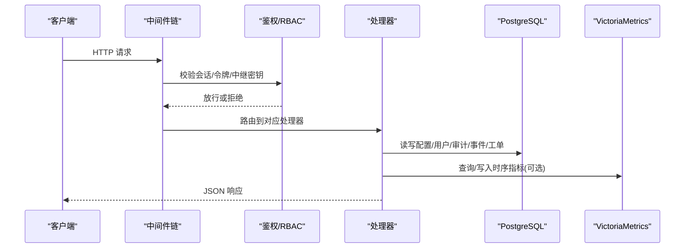
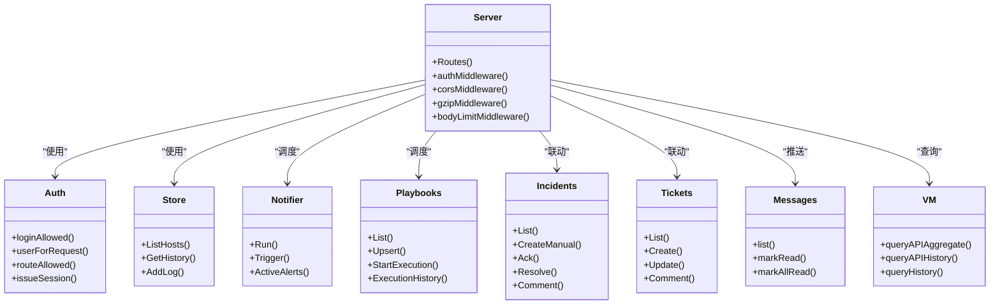

# API 参考

<cite>
**本文引用的文件**   
- [cmd/server/main.go](file://cmd/server/main.go)
- [cmd/server/auth.go](file://cmd/server/auth.go)
- [cmd/server/admin_api.go](file://cmd/server/admin_api.go)
- [cmd/server/agent_api.go](file://cmd/server/agent_api.go)
- [cmd/server/apimon_api.go](file://cmd/server/apimon_api.go)
- [cmd/server/forward_api.go](file://cmd/server/forward_api.go)
- [cmd/server/playbook_api.go](file://cmd/server/playbook_api.go)
- [cmd/server/sre_api.go](file://cmd/server/sre_api.go)
- [cmd/server/message_api.go](file://cmd/server/message_api.go)
- [cmd/server/users_api.go](file://cmd/server/users_api.go)
- [cmd/server/terminal_api.go](file://cmd/server/terminal_api.go)
</cite>

## 目录
1. [简介](#简介)
2. [项目结构](#项目结构)
3. [核心组件](#核心组件)
4. [架构总览](#架构总览)
5. [详细接口说明](#详细接口说明)
6. [依赖关系分析](#依赖关系分析)
7. [性能与限制](#性能与限制)
8. [故障排查指南](#故障排查指南)
9. [结论](#结论)
10. [附录：版本管理与迁移](#附录：版本管理与迁移)

## 简介
本参考文档面向 AIOps Monitor 服务端，系统化梳理所有对外暴露的 RESTful API、WebSocket 通道以及 Agent 通信协议。内容覆盖管理员 API、Agent 通信 API、监控数据 API、终端操作 API、自动化编排 API、API 业务拨测、统一消息中心、用户与权限等。同时给出认证授权机制、请求体/响应体规范、错误码约定、频率限制建议、WebSocket 连接与事件类型说明，以及版本管理与向后兼容策略。

## 项目结构
服务端以 Go 单二进制运行，HTTP 路由由中间件链组合（安全头、CORS、gzip、限流、鉴权），各功能域按模块拆分到独立文件中，通过 Server 实例挂载处理函数并注册路由。

图表来源
- [cmd/server/main.go:72-102](file://cmd/server/main.go#L72-L102)
- [cmd/server/main.go:113-145](file://cmd/server/main.go#L113-L145)
- [cmd/server/main.go:186-205](file://cmd/server/main.go#L186-L205)
- [cmd/server/auth.go:112-172](file://cmd/server/auth.go#L112-L172)

章节来源
- [cmd/server/main.go:227-355](file://cmd/server/main.go#L227-L355)
- [cmd/server/auth.go:112-172](file://cmd/server/auth.go#L112-L172)

## 核心组件
- 认证与授权
  - 会话 Cookie 鉴权；支持全局 MFA 强制策略；RBAC 角色控制（admin/operator/viewer）。
  - 登录流程支持用户名/手机号 + TOTP 二次验证；首次登录强制修改默认密码。
- 存储与后端
  - 关系数据持久化至 PostgreSQL；时序数据写入 VictoriaMetrics。
- 中间件与安全
  - CORS、CSP、X-Frame-Options、Referrer-Policy、Body 大小限制、gzip 压缩。
- 后台任务
  - 告警评估、自定义拨测、API 拨测、Playbook 定时触发、SLO 评估、AI 巡检、VM 推送泵。

章节来源
- [cmd/server/auth.go:176-307](file://cmd/server/auth.go#L176-L307)
- [cmd/server/main.go:286-292](file://cmd/server/main.go#L286-L292)
- [cmd/server/main.go:255-272](file://cmd/server/main.go#L255-L272)

## 架构总览
下图展示典型请求路径：浏览器或客户端 → 中间件链 → 鉴权与路由 → 具体处理器 → 存储/外部服务。

图表来源
- [cmd/server/main.go:294-303](file://cmd/server/main.go#L294-L303)
- [cmd/server/auth.go:112-172](file://cmd/server/auth.go#L112-L172)
- [cmd/server/main.go:265-267](file://cmd/server/main.go#L265-L267)

## 详细接口说明

### 通用约定
- 基础路径
  - 管理端与前端交互：`/api/v1/...`
  - Agent 通信：`/api/v1/agent/...`
  - 端口转发与 HTTP 代理：`/api/v1/forward/...` 与 `/proxy/...`
- 认证方式
  - 浏览器/控制台：Cookie 会话（`aiops_session`）
  - 代理新标签页：一次性 `proxy_token`（Cookie 或查询参数 `pt`）
  - 中继模式：可选 `X-Relay-Secret` 头部校验
- 请求/响应格式
  - 请求体：JSON（部分 Agent 上报支持 gzip 压缩）
  - 响应体：JSON，成功返回 `{ok:true}` 或领域对象；失败返回 `{error:"..."}`
- 错误码
  - 200 成功
  - 400 请求体无效/参数不合法
  - 401 未认证
  - 403 无权限/令牌无效/中继密钥不匹配
  - 404 资源不存在
  - 429 频率限制（如登录尝试过多）
  - 500 服务器内部错误
- 频率限制
  - 登录失败计数与账户级失败计数在鉴权层维护；短信验证码预留 60s 间隔（当前为占位实现）
- 版本管理
  - 所有公开 API 均以 `/api/v1/` 前缀标识 v1 版本；未来升级将新增 `/api/v2/` 并保持 v1 兼容一段时间

章节来源
- [cmd/server/auth.go:112-172](file://cmd/server/auth.go#L112-L172)
- [cmd/server/auth.go:176-206](file://cmd/server/auth.go#L176-L206)
- [cmd/server/auth.go:384-430](file://cmd/server/auth.go#L384-L430)
- [cmd/server/main.go:72-102](file://cmd/server/main.go#L72-L102)
- [cmd/server/main.go:113-145](file://cmd/server/main.go#L113-L145)
- [cmd/server/main.go:186-205](file://cmd/server/main.go#L186-L205)

### 认证与账号
- POST /api/v1/login
  - 描述：登录，支持用户名/手机号 + TOTP 二次验证
  - 请求体：{username, password, login_type?, code?}
  - 成功：{ok:true} 或 {mfa_required:true} 或 {require_mfa_setup:true, message:...}
  - 失败：401/429/400
- GET /api/v1/me
  - 描述：获取当前用户信息
  - 成功：{username, display_name, email, phone, mfa_enabled, role, must_change_password}
- POST /api/v1/logout
  - 描述：登出，清除会话
- PUT /api/v1/password
  - 描述：修改密码（需旧密码）
- PUT /api/v1/profile
  - 描述：更新个人资料（可重命名用户名）
- POST /api/v1/account/init
  - 描述：首次登录强制初始化（改用户名+密码）
- TOTP 相关
  - GET /api/v1/mfa/setup
  - POST /api/v1/mfa/enable
  - POST /api/v1/mfa/disable
  - GET /api/v1/mfa/global
  - PUT /api/v1/mfa/global
- 账号恢复（预留）
  - POST /api/v1/account/recover-send-code
  - POST /api/v1/account/recover-verify
  - POST /api/v1/account/recover-verify-mfa
  - POST /api/v1/account/recover-username
  - POST /api/v1/account/send-reset-code
  - POST /api/v1/account/reset-password

示例
- 登录成功（含 MFA）
  - 请求：{"username":"admin","password":"***"}
  - 响应：{"mfa_required":true}
  - 再次请求：{"username":"admin","password":"***","code":"123456"}
  - 响应：{"ok":true}
- 登录失败
  - 响应：{"error":"认证失败"}

章节来源
- [cmd/server/auth.go:176-307](file://cmd/server/auth.go#L176-L307)
- [cmd/server/auth.go:332-367](file://cmd/server/auth.go#L332-L367)
- [cmd/server/auth.go:469-529](file://cmd/server/auth.go#L469-L529)
- [cmd/server/auth.go:531-640](file://cmd/server/auth.go#L531-L640)
- [cmd/server/auth.go:384-430](file://cmd/server/auth.go#L384-L430)

### 管理员配置与安装脚本
- GET /api/v1/config
  - 描述：获取配置（敏感字段脱敏）
- PUT /api/v1/config
  - 描述：保存配置（合并密钥后落库，立即触发告警同步）
- POST /api/v1/config/test
  - 描述：测试通知渠道（飞书/钉钉/邮件/短信/语音）
- GET /api/v1/install/info
  - 描述：获取安装所需服务端地址与 Token
- POST /api/v1/install/token/reset
  - 描述：重置安装 Token
- GET /install.sh|/install.ps1
  - 描述：生成平台安装脚本（注入 server_url、token、category、servers_json、log_paths）
- GET /uninstall.sh|/uninstall.ps1
  - 描述：卸载脚本
- GET /healthz
  - 描述：健康检查

示例
- 保存配置
  - 请求体：包含 thresholds、feishu/dingtalk/smtp/sms/voice_call/ai 等字段
  - 响应：{"status":"ok"}

章节来源
- [cmd/server/admin_api.go:12-77](file://cmd/server/admin_api.go#L12-L77)
- [cmd/server/admin_api.go:79-151](file://cmd/server/admin_api.go#L79-L151)
- [cmd/server/admin_api.go:153-159](file://cmd/server/admin_api.go#L153-L159)

### Agent 通信 API
- POST /api/v1/agent/register
  - 描述：Agent 注册（支持指纹免 Token 重新注册用于服务端重启恢复）
  - 请求体：{host_id, hostname, token?, fingerprint}
  - 成功：{status:"ok", host_id, server_time_unix, log_key?, log_encrypt?:bool}
  - 失败：400/403
- POST /api/v1/agent/report
  - 描述：上报主机指标（支持 gzip 压缩）
  - 请求体：Report 结构（metrics/events/custom）
  - 成功：{status:"ok", host_id}
  - 失败：400/403
- POST /api/v1/agent/logs
  - 描述：日志上报（支持加密上报 X-Log-Enc）
  - 请求体：LogBatch（支持 AES-256-GCM 解密）
  - 成功：{"ok":true}
- Agent 反向通道（无需会话）
  - /api/v1/agent/terminal/{sid}
  - /api/v1/agent/forward/{ruleID}

示例
- 注册成功
  - 响应：{"status":"ok","host_id":"abc123","server_time_unix":1710000000,"log_key":"base64...","log_encrypt":true}
- 上报失败（指纹不匹配）
  - 响应：{"error":"指纹校验失败"}

章节来源
- [cmd/server/agent_api.go:30-84](file://cmd/server/agent_api.go#L30-L84)
- [cmd/server/agent_api.go:94-129](file://cmd/server/agent_api.go#L94-L129)
- [cmd/server/sre_api.go:700-738](file://cmd/server/sre_api.go#L700-L738)
- [cmd/server/auth.go:18-49](file://cmd/server/auth.go#L18-L49)

### 端口转发与 HTTP 代理
- TCP/UDP 转发规则
  - POST /api/v1/forward
    - 请求体：TCPForwardRequest{host_id, target_port, local_port?}
    - 成功：TCPForwardResponse
  - PUT /api/v1/forward/{id}/toggle
    - 请求体：{enabled}
  - PUT /api/v1/forward/{id}
    - 请求体：{host_id?, target_port, local_port?}
  - POST /api/v1/forward/{id}/copy
  - DELETE /api/v1/forward/{id}
  - 批量组操作（端口范围）
    - PUT /api/v1/forward/group/{gid}/toggle
    - POST /api/v1/forward/group/{gid}/copy
    - PUT /api/v1/forward/group/{gid}
    - DELETE /api/v1/forward/group/{gid}
- 统计与健康
  - GET /api/v1/forward/stats
  - GET /api/v1/forward/health
- HTTP 代理快捷入口
  - GET /api/v1/http-proxy
  - POST /api/v1/http-proxy
  - PUT /api/v1/http-proxy/{id}
  - DELETE /api/v1/http-proxy/{id}
  - PUT /api/v1/http-proxy/{id}/toggle
  - POST /api/v1/http-proxy/{id}/copy
- 代理访问
  - GET/POST/PUT/DELETE/PATCH /proxy/{hostID}/{port}/{path}
  - WebSocket 升级：ws://host/proxy/{hostID}/{port}/{path}
- 一次性代理令牌
  - GET /api/v1/proxy-token
    - 成功：{"token":"..."} 并设置 SameSite=Lax HttpOnly Cookie

示例
- 创建 TCP 转发
  - 请求：{"host_id":"abc123","target_port":3306,"local_port":13306}
  - 响应：{"id":"r1","listen_addr":"0.0.0.0:13306","status":"active",...}
- 启用/停用规则
  - 请求：{"enabled":false}
  - 响应：返回最新规则状态

章节来源
- [cmd/server/forward_api.go:20-98](file://cmd/server/forward_api.go#L20-L98)
- [cmd/server/forward_api.go:100-194](file://cmd/server/forward_api.go#L100-L194)
- [cmd/server/forward_api.go:295-303](file://cmd/server/forward_api.go#L295-L303)
- [cmd/server/forward_api.go:315-392](file://cmd/server/forward_api.go#L315-L392)
- [cmd/server/forward_api.go:411-602](file://cmd/server/forward_api.go#L411-L602)
- [cmd/server/forward_api.go:606-689](file://cmd/server/forward_api.go#L606-L689)

### 终端操作 API
- GET /api/v1/terminal/sessions
  - 描述：列出活跃终端会话
- GET /api/v1/terminal/replay/{id}
  - 描述：回放历史会话帧（需二次验证）
- WebSocket /api/v1/terminal/observe/{id}
  - 描述：旁观者只读接入（先发送录制历史，再实时流式输出）

示例
- 旁观接入
  - 建立 WS 连接后，服务端先发二进制帧（历史），随后持续推送二进制帧（实时）

章节来源
- [cmd/server/terminal_api.go:9-77](file://cmd/server/terminal_api.go#L9-L77)

### 自动化编排（Playbook）
- GET /api/v1/playbook
  - 描述：列出剧本
- POST /api/v1/playbook
  - 描述：新增/更新剧本
- DELETE /api/v1/playbook/{id}
  - 描述：删除剧本
- POST /api/v1/playbook/{id}/execute
  - 描述：执行剧本（异步，返回 execution_id）
- GET /api/v1/playbook/executions
  - 描述：执行历史列表
- GET /api/v1/playbook/executions/{id}
  - 描述：查看某次执行详情

执行语义
- 步骤支持 when 条件、{{变量}} 替换、register 输出缓存、ignore_exit 忽略非零退出码
- 基础设施类失败自动重试（最多 3 次，线性退避）
- 并行度上限（默认 30）

示例
- 执行剧本
  - 请求：空体
  - 响应：{"ok":true,"execution_id":12345}

章节来源
- [cmd/server/playbook_api.go:91-134](file://cmd/server/playbook_api.go#L91-L134)
- [cmd/server/playbook_api.go:161-188](file://cmd/server/playbook_api.go#L161-L188)
- [cmd/server/playbook_api.go:206-312](file://cmd/server/playbook_api.go#L206-L312)
- [cmd/server/playbook_api.go:425-443](file://cmd/server/playbook_api.go#L425-L443)

### API 监控（业务接口拨测）
- GET /api/v1/apimon/overview
  - 描述：聚合系统/接口状态与现算指标（平均/P95/可用率/吞吐）
- POST /api/v1/apimon/system
  - 描述：新增/更新业务系统与接口
- DELETE /api/v1/apimon/system/{id}
  - 描述：删除业务系统
- POST /api/v1/apimon/system/{id}/run
  - 描述：立即探测一次
- GET /api/v1/apimon/system/{id}/history
  - 描述：接口历史序列（支持 since_min 分钟）

示例
- 概览
  - 响应：{"systems":[{id,name,interval_sec,endpoints:[{id,name,url,method,ok,latency_ms,...}],...}]}

章节来源
- [cmd/server/apimon_api.go:15-60](file://cmd/server/apimon_api.go#L15-L60)
- [cmd/server/apimon_api.go:62-100](file://cmd/server/apimon_api.go#L62-L100)
- [cmd/server/apimon_api.go:102-107](file://cmd/server/apimon_api.go#L102-L107)
- [cmd/server/apimon_api.go:109-113](file://cmd/server/apimon_api.go#L109-L113)
- [cmd/server/apimon_api.go:115-133](file://cmd/server/apimon_api.go#L115-L133)

### SRE 中枢（事件/自动修复/SLO/工单/日志）
- 事件
  - GET /api/v1/sre/incidents
  - GET /api/v1/sre/incidents/{id}
  - POST /api/v1/sre/incidents
  - POST /api/v1/sre/incidents/{id}/ack
  - POST /api/v1/sre/incidents/{id}/resolve
  - POST /api/v1/sre/incidents/{id}/comment
  - POST /api/v1/sre/incidents/{id}/escalate
- 自动修复
  - GET /api/v1/sre/remediation/rules
  - POST /api/v1/sre/remediation/rules
  - DELETE /api/v1/sre/remediation/rules/{id}
  - GET /api/v1/sre/remediation/runs
  - POST /api/v1/sre/remediation/{id}/approve
  - POST /api/v1/sre/remediation/{id}/reject
- SLO
  - GET /api/v1/sre/slos
  - POST /api/v1/sre/slos
  - DELETE /api/v1/sre/slos/{id}
- 工单
  - GET /api/v1/sre/tickets
  - GET /api/v1/sre/tickets/{id}
  - POST /api/v1/sre/tickets
  - PUT /api/v1/sre/tickets/{id}
  - POST /api/v1/sre/tickets/{id}/comment
  - DELETE /api/v1/sre/tickets/{id}
- 日志
  - POST /api/v1/sre/logs/search
  - POST /api/v1/sre/logs/diagnose

示例
- 创建事件
  - 请求：{"title":"CPU 高","severity":"critical","host_id":"abc123"}
  - 响应：Incident 对象
- 升级为工单
  - 响应：Ticket 对象（含优先级 p1/p2）

章节来源
- [cmd/server/sre_api.go:341-465](file://cmd/server/sre_api.go#L341-L465)
- [cmd/server/sre_api.go:471-527](file://cmd/server/sre_api.go#L471-L527)
- [cmd/server/sre_api.go:533-559](file://cmd/server/sre_api.go#L533-L559)
- [cmd/server/sre_api.go:565-694](file://cmd/server/sre_api.go#L565-L694)
- [cmd/server/sre_api.go:740-800](file://cmd/server/sre_api.go#L740-L800)

### 统一消息中心
- GET /api/v1/messages?limit=100
  - 描述：最新消息列表 + 未读数
- POST /api/v1/messages/mark-read
  - 描述：标记已读（ids[]）
- POST /api/v1/messages/mark-all-read
  - 描述：全部已读

示例
- 读取消息
  - 响应：{"messages":[...],"unread":3}

章节来源
- [cmd/server/message_api.go:9-41](file://cmd/server/message_api.go#L9-L41)

### 用户管理（仅 admin）
- GET /api/v1/users
- POST /api/v1/users
- PUT /api/v1/users/{username}
- DELETE /api/v1/users/{username}
- PUT /api/v1/users/{username}/password
- PUT /api/v1/users/{username}/mfa/reset

示例
- 创建用户
  - 请求：{"username":"alice","password":"Strong@123","display_name":"Alice","email":"alice@example.com","role":"operator"}
  - 响应：{"ok":true}

章节来源
- [cmd/server/users_api.go:19-140](file://cmd/server/users_api.go#L19-L140)

### WebSocket 接口
- 终端旁观
  - ws://host/api/v1/terminal/observe/{id}
  - 事件：二进制帧（历史帧 + 实时帧）
- HTTP 代理
  - ws://host/proxy/{hostID}/{port}/{path}
  - 行为：透传目标 Web 服务的 WebSocket 升级与双向通信

注意
- 旁观与代理均受鉴权与 RBAC 控制；旁观需二次验证

章节来源
- [cmd/server/terminal_api.go:30-77](file://cmd/server/terminal_api.go#L30-L77)
- [cmd/server/forward_api.go:56-78](file://cmd/server/forward_api.go#L56-78)

## 依赖关系分析
- 鉴权中间件对路由进行白名单判断与角色校验，决定放行或拒绝。
- 处理器依赖配置存储、主机存储、告警引擎、Playbook 执行器、SRE 子系统、消息中心、VM 查询等。
- 关键耦合点
  - 配置变更触发告警状态同步
  - 事件变化驱动消息中心与 AI 诊断
  - Playbook 执行依赖终端通道与主机在线状态

图表来源
- [cmd/server/main.go:294-303](file://cmd/server/main.go#L294-L303)
- [cmd/server/auth.go:112-172](file://cmd/server/auth.go#L112-L172)
- [cmd/server/playbook_api.go:91-134](file://cmd/server/playbook_api.go#L91-L134)
- [cmd/server/sre_api.go:341-465](file://cmd/server/sre_api.go#L341-L465)
- [cmd/server/message_api.go:9-41](file://cmd/server/message_api.go#L9-L41)
- [cmd/server/apimon_api.go:15-60](file://cmd/server/apimon_api.go#L15-L60)

## 性能与限制
- Body 大小限制：默认最大 100 MiB（防止内存耗尽）
- Gzip 压缩：对文本/JSON 响应透明压缩，跳过终端/转发/代理流式路径
- 并发与限流
  - 登录失败计数与账户级失败计数
  - 短信验证码预留 60s 间隔（当前为占位实现）
  - Playbook 并行度上限（默认 30）
- 超时与重试
  - Playbook 执行：每步最多 3 次重试，线性退避
  - 终端/转发/代理：长连接不走固定 Read/WriteTimeout，避免中断

章节来源
- [cmd/server/main.go:104-145](file://cmd/server/main.go#L104-L145)
- [cmd/server/main.go:186-205](file://cmd/server/main.go#L186-L205)
- [cmd/server/auth.go:176-206](file://cmd/server/auth.go#L176-L206)
- [cmd/server/playbook_api.go:190-204](file://cmd/server/playbook_api.go#L190-L204)

## 故障排查指南
- 常见错误
  - 401 未认证：检查 Cookie 是否携带、是否过期
  - 403 无权限：确认角色（viewer/operator/admin）与路由要求
  - 400 请求体无效：检查 JSON 结构与必填字段
  - 429 频率限制：等待冷却时间后再试
- 日志与审计
  - 操作日志通过 Store.AddLog 记录，可在面板“审计”中查看
  - Agent 上报失败时，关注解压/解析错误日志
- 中继模式
  - 若配置了 relay_secret，请求必须携带正确 X-Relay-Secret 头部

章节来源
- [cmd/server/auth.go:112-172](file://cmd/server/auth.go#L112-L172)
- [cmd/server/agent_api.go:94-129](file://cmd/server/agent_api.go#L94-L129)

## 结论
本 API 参考覆盖了 AIOps Monitor 的核心能力面：认证授权、Agent 通信、端口转发与 HTTP 代理、终端操作、自动化编排、API 拨测、SRE 中枢与统一消息、用户管理等。通过统一的中间件链与清晰的鉴权模型，系统在安全性、可扩展性与可观测性方面提供了良好支撑。建议在生产环境启用 TLS、合理配置阈值与治理策略，并结合消息中心与 AI 诊断提升排障效率。

## 附录：版本管理与迁移
- 版本前缀
  - 当前稳定版本：/api/v1/
  - 后续版本将以 /api/v2/ 引入，v1 保持向后兼容一段时间
- 兼容性策略
  - 新增字段采用可选形式，客户端忽略未知字段
  - 废弃字段保留至少两个大版本周期
- 迁移建议
  - 逐步适配新版本字段，优先使用强类型解析
  - 对幂等接口做好重试与去重
  - 关注弃用警告与日志提示

[本节为概念性说明，不直接分析具体文件]