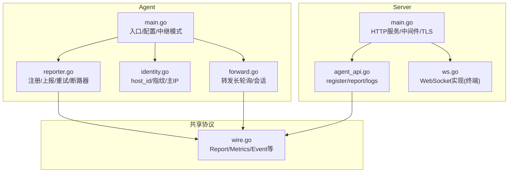
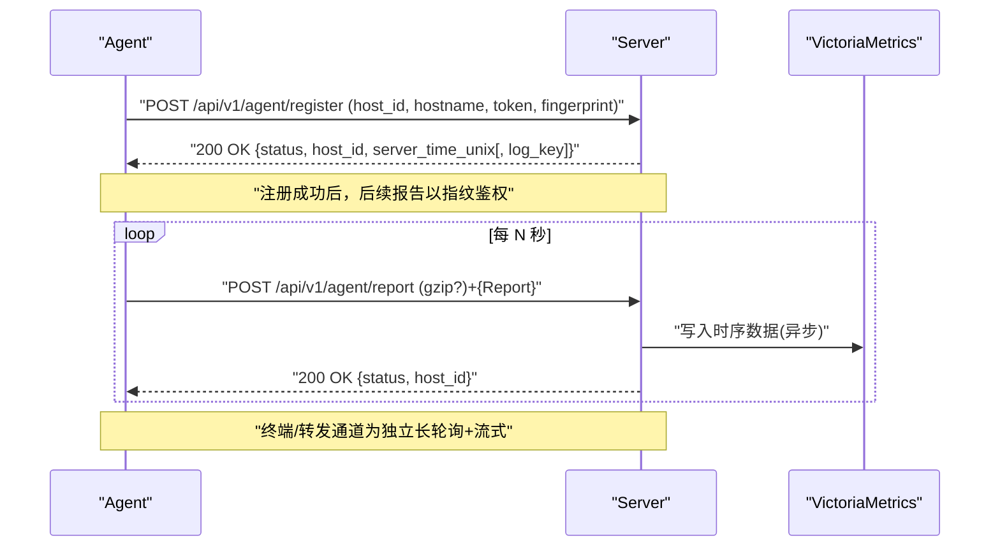
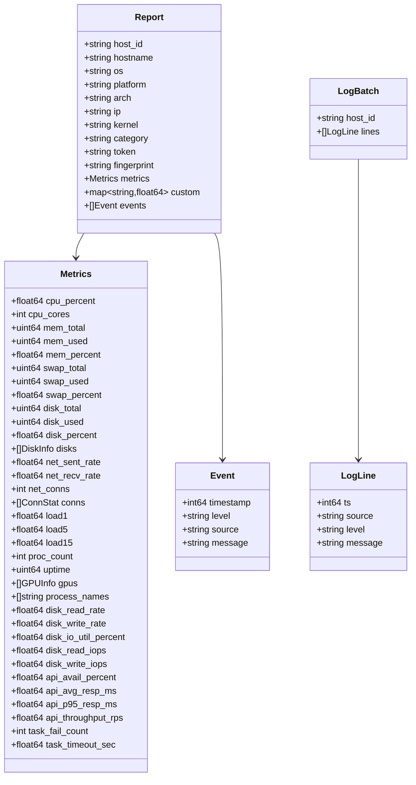

# Agent 通信 API

<cite>
**本文引用的文件**   
- [cmd/agent/main.go](file://cmd/agent/main.go)
- [cmd/agent/reporter.go](file://cmd/agent/reporter.go)
- [cmd/agent/identity.go](file://cmd/agent/identity.go)
- [cmd/agent/forward.go](file://cmd/agent/forward.go)
- [shared/wire.go](file://shared/wire.go)
- [cmd/server/main.go](file://cmd/server/main.go)
- [cmd/server/agent_api.go](file://cmd/server/agent_api.go)
- [cmd/server/ws.go](file://cmd/server/ws.go)
- [docker/nginx/nginx-frontend.conf](file://docker/nginx/nginx-frontend.conf)
- [README.md](file://README.md)
</cite>

## 目录
1. [简介](#简介)
2. [项目结构](#项目结构)
3. [核心组件](#核心组件)
4. [架构总览](#架构总览)
5. [详细组件分析](#详细组件分析)
6. [依赖关系分析](#依赖关系分析)
7. [性能与可靠性](#性能与可靠性)
8. [安全与加密](#安全与加密)
9. [故障排查指南](#故障排查指南)
10. [结论](#结论)

## 简介
本文件面向“Agent 与 Server 之间的通信协议与 API”，覆盖以下关键能力：
- 指标数据上报（基础指标、自定义指标、事件）
- 心跳与健康检查（基于上报周期与服务端离线判定）
- 命令下发（通过终端通道与转发通道实现）
- 端口转发建立（TCP/UDP/HTTP 反向代理）
- 连接建立流程、断线重连机制
- 数据传输加密（TLS、日志 AES-GCM 加密）
- 多 Agent 场景下的负载均衡与故障转移策略

## 项目结构
从代码组织看，Agent 与 Server 的通信由共享数据结构定义约束，Agent 负责采集与上报，Server 负责鉴权、存储与转发。

图表来源
- [cmd/agent/main.go:1-238](file://cmd/agent/main.go#L1-L238)
- [cmd/agent/reporter.go:1-575](file://cmd/agent/reporter.go#L1-L575)
- [cmd/agent/identity.go:1-188](file://cmd/agent/identity.go#L1-L188)
- [cmd/agent/forward.go:38-75](file://cmd/agent/forward.go#L38-L75)
- [cmd/server/main.go:1-355](file://cmd/server/main.go#L1-L355)
- [cmd/server/agent_api.go:1-130](file://cmd/server/agent_api.go#L1-L130)
- [cmd/server/ws.go:1-184](file://cmd/server/ws.go#L1-L184)
- [shared/wire.go:1-139](file://shared/wire.go#L1-L139)

章节来源
- [cmd/agent/main.go:1-238](file://cmd/agent/main.go#L1-L238)
- [cmd/server/main.go:1-355](file://cmd/server/main.go#L1-L355)
- [shared/wire.go:1-139](file://shared/wire.go#L1-L139)

## 核心组件
- 共享协议类型（Report/Metrics/Event/LogBatch 等）：统一了 Agent 与 Server 的数据契约，避免接口漂移。
- Agent 注册与上报：支持 gzip 压缩、自动重试、403 自动重注册、断路器隔离失败目标。
- 健康检查：服务端通过“最近上报时间”判定主机在线；Agent 周期性上报即心跳。
- 终端与转发通道：基于 HTTP 长轮询 + 流式传输，Agent 主动拉取任务并建立双向数据流。
- 日志上报：可选 gzip+AES-256-GCM 加密，注册阶段下发 log_key。

章节来源
- [shared/wire.go:1-139](file://shared/wire.go#L1-L139)
- [cmd/agent/reporter.go:86-200](file://cmd/agent/reporter.go#L86-L200)
- [cmd/server/agent_api.go:30-130](file://cmd/server/agent_api.go#L30-L130)

## 架构总览
Agent 与 Server 的交互包含三类通道：
- 指标与事件通道：POST /api/v1/agent/register 与 POST /api/v1/agent/report
- 终端通道：GET /api/v1/agent/terminal/wait/rx 与 POST /api/v1/agent/terminal/tx
- 转发通道：GET /api/v1/agent/forward/wait/rx 与 POST /api/v1/agent/forward/tx

图表来源
- [cmd/server/agent_api.go:30-130](file://cmd/server/agent_api.go#L30-L130)
- [cmd/agent/reporter.go:139-200](file://cmd/agent/reporter.go#L139-L200)
- [README.md:1125-1278](file://README.md#L1125-L1278)

## 详细组件分析

### 1) 注册与鉴权
- 注册接口：POST /api/v1/agent/register
  - 请求体字段：host_id、hostname、token、fingerprint
  - 响应体：status、host_id、server_time_unix，以及可选的 log_key（base64）
  - 行为：
    - 若开启强制 Token，则新主机需有效安装 Token；已知主机且指纹匹配可免 Token 重新注册（服务端重启恢复）
    - 未提供指纹或指纹不匹配将拒绝
    - 成功时下发日志加密密钥（log_key），用于后续日志上报加密
- 鉴权方式：
  - 注册阶段使用安装 Token（可选）
  - 后续上报与通道使用机器指纹（fingerprint）进行鉴权

章节来源
- [cmd/server/agent_api.go:30-84](file://cmd/server/agent_api.go#L30-L84)
- [cmd/agent/reporter.go:90-121](file://cmd/agent/reporter.go#L90-L121)
- [cmd/agent/identity.go:15-71](file://cmd/agent/identity.go#L15-L71)

### 2) 指标数据上报
- 上报接口：POST /api/v1/agent/report
  - 请求体：Report（包含 Metrics、Custom、Events 等）
  - 支持 Content-Encoding: gzip（当体积较大时启用）
  - 鉴权：通过 Report.fingerprint 校验
  - 处理：
    - 解析并去重/合并
    - 写入 VictoriaMetrics（非阻塞）
    - 返回 200 OK
- 数据模型（关键字段）：
  - Report：host_id、hostname、os、platform、arch、ip、kernel、category、token、fingerprint、metrics、custom、events
  - Metrics：CPU/内存/磁盘/网络/负载/进程/GPU/IO/IOPS 等
  - Event：timestamp、level、source、message
  - LogBatch：host_id、lines[]（用于日志上报）

章节来源
- [shared/wire.go:8-139](file://shared/wire.go#L8-L139)
- [cmd/server/agent_api.go:94-130](file://cmd/server/agent_api.go#L94-L130)
- [cmd/agent/reporter.go:139-200](file://cmd/agent/reporter.go#L139-L200)

### 3) 心跳检测与健康检查
- 心跳机制：
  - Agent 按 report_interval 定时上报即为心跳
  - 服务端根据“最近上报时间”判定主机在线/离线
- 健康检查：
  - GET /healthz 用于外部健康探针
  - 面板展示主机状态来源于上报时间与阈值配置

章节来源
- [cmd/agent/main.go:219-237](file://cmd/agent/main.go#L219-L237)
- [cmd/server/main.go:325-334](file://cmd/server/main.go#L325-L334)
- [docker/nginx/nginx-frontend.conf:157-161](file://docker/nginx/nginx-frontend.conf#L157-L161)
- [README.md:436-476](file://README.md#L436-L476)

### 4) 命令下发与远程终端
- 通道设计：
  - Agent 主动长轮询等待任务：GET /api/v1/agent/terminal/wait
  - 下行帧流：GET /api/v1/agent/terminal/rx
  - 上行输出流：POST /api/v1/agent/terminal/tx
- 浏览器侧通过 WebSocket 接入，服务端在 WS 与 Agent 之间桥接字节流
- 鉴权：
  - 浏览器需登录会话
  - Agent 侧使用 X-Agent-Fingerprint 头进行认证

章节来源
- [cmd/server/ws.go:1-184](file://cmd/server/ws.go#L1-L184)
- [cmd/agent/forward.go:38-75](file://cmd/agent/forward.go#L38-L75)
- [README.md:1158-1166](file://README.md#L1158-L1166)

### 5) 端口转发与 HTTP 代理
- TCP/UDP 转发：
  - Agent 长轮询等待任务：GET /api/v1/agent/forward/wait
  - 下行数据流：GET /api/v1/agent/forward/rx
  - 上行数据流：POST /api/v1/agent/forward/tx
  - 鉴权：X-Agent-Fingerprint 头
- HTTP 反向代理：
  - 无状态代理路径：/proxy/{hostID}/{port}/{path...}
  - 支持所有 HTTP 方法与 WebSocket 升级
- 批量端口映射：
  - 支持一次性创建连续端口范围规则（单批最多 100 个端口）

章节来源
- [cmd/agent/forward.go:51-75](file://cmd/agent/forward.go#L51-L75)
- [README.md:655-687](file://README.md#L655-L687)
- [README.md:1199-1220](file://README.md#L1199-L1220)

### 6) 日志上报与加密
- 上报接口：POST /api/v1/agent/logs
  - 请求头：X-Agent-Fingerprint（指纹鉴权）、X-Log-Enc（标识加密算法）
  - 请求体：LogBatch（可能经 gzip+AES-256-GCM 加密）
- 密钥分发：
  - 注册阶段 Server 下发 log_key（base64），Agent 据此对日志进行加密上报

章节来源
- [cmd/server/agent_api.go:30-84](file://cmd/server/agent_api.go#L30-L84)
- [cmd/agent/reporter.go:107-121](file://cmd/agent/reporter.go#L107-L121)
- [README.md:869-883](file://README.md#L869-L883)

### 7) 连接建立与断线重连
- 连接建立：
  - Agent 启动后先向各目标 Server 注册（带 token/fingerprint）
  - 成功后进入上报循环与通道长轮询
- 断线重连：
  - 上报失败（网络/5xx）：同周期内最多重试 3 次，间隔 1s
  - 403：触发重新注册后重试
  - 400 且携带 gzip：禁用该目标的 gzip，立即重试
  - 断路器：连续失败达到阈值打开断路器，冷却期内跳过该目标，并在打开时重置注册标记以便下次恢复
  - 指数退避：注册失败时使用指数退避重试

章节来源
- [cmd/agent/reporter.go:202-253](file://cmd/agent/reporter.go#L202-L253)
- [cmd/agent/reporter.go:386-403](file://cmd/agent/reporter.go#L386-L403)
- [cmd/agent/reporter.go:452-567](file://cmd/agent/reporter.go#L452-L567)

### 8) 多服务端推送与负载均衡
- 多服务端：
  - 每个目标拥有独立的 HTTP 客户端、Token、注册状态、重试与断路器
  - 一次采集结果广播到所有目标，互不影响
- 负载均衡与故障转移：
  - 断路器隔离失败目标，冷却期后尝试半开探测
  - 403 自动重注册，确保服务端重启后可恢复
  - 外网代理损坏 gzip 时自动降级

章节来源
- [cmd/agent/reporter.go:59-84](file://cmd/agent/reporter.go#L59-L84)
- [cmd/agent/reporter.go:452-567](file://cmd/agent/reporter.go#L452-L567)
- [README.md:798-800](file://README.md#L798-L800)

## 依赖关系分析
- 共享协议层 shared/wire.go 被 Agent 与 Server 共同引用，保证数据契约一致
- Agent 的 reporter.go 依赖 identity.go 生成 host_id 与 fingerprint
- Server 的 agent_api.go 依赖 store 与 vm 写入持久化与时序数据
- ws.go 提供最小化的 WebSocket 实现，供终端通道使用

图表来源
- [shared/wire.go:8-139](file://shared/wire.go#L8-L139)

章节来源
- [shared/wire.go:8-139](file://shared/wire.go#L8-L139)

## 性能与可靠性
- 连接复用与超时控制：
  - Agent 使用共享 Transport，关闭 HTTP/2 以避免服务端重启导致全连接失效
  - 合理设置 KeepAlive、IdleConnTimeout、TLSHandshakeTimeout、ResponseHeaderTimeout
- 压缩与带宽优化：
  - 大于阈值的上报启用 gzip；若服务端返回 400 则自动禁用
- 并发与隔离：
  - 多目标并行上报，单个目标失败不影响其他目标
  - 断路器防止雪崩，冷却期后试探性恢复
- 优雅关闭：
  - Server 收到停止信号后优雅关闭 HTTP 服务，刷新 PG 状态后退出

章节来源
- [cmd/agent/reporter.go:21-49](file://cmd/agent/reporter.go#L21-L49)
- [cmd/agent/reporter.go:139-200](file://cmd/agent/reporter.go#L139-L200)
- [cmd/server/main.go:305-354](file://cmd/server/main.go#L305-L354)

## 安全与加密
- 传输加密：
  - 可选 TLS（AIOPS_TLS_CERT/AIOPS_TLS_KEY），Agent 支持自签 CA 信任与跳过校验（仅测试环境）
- 静态加密：
  - 配置中的敏感信息经 AIOPS_SECRET_KEY 派生 AES-256-GCM 落库加密
- 日志加密上报：
  - 注册阶段下发 log_key，Agent 使用 gzip+AES-256-GCM 加密日志上报
- SSRF 出站防护：
  - 用户可控 URL 的出站请求经守卫，默认拒绝云元数据与链路本地地址
- 安全响应头：
  - nosniff、DENY、no-referrer 等

章节来源
- [cmd/server/main.go:335-354](file://cmd/server/main.go#L335-L354)
- [cmd/agent/main.go:122-124](file://cmd/agent/main.go#L122-L124)
- [cmd/agent/reporter.go:107-121](file://cmd/agent/reporter.go#L107-L121)
- [README.md:869-883](file://README.md#L869-L883)

## 故障排查指南
- 注册失败：
  - 检查安装 Token 是否有效；确认指纹已正确采集
  - 观察 403 错误，Agent 会自动重注册
- 上报失败：
  - 关注 400（gzip 损坏）与 5xx；Agent 会禁用 gzip 并重试
  - 断路器打开时暂停上报，冷却期后自动恢复
- 终端/转发通道不通：
  - 确认 Nginx 长轮询与流式路径的超时与缓冲配置
  - 检查 X-Agent-Fingerprint 是否正确传递
- 健康检查异常：
  - 确认 /healthz 可达，Agent 上报周期正常

章节来源
- [cmd/agent/reporter.go:202-253](file://cmd/agent/reporter.go#L202-L253)
- [docker/nginx/nginx-frontend.conf:127-161](file://docker/nginx/nginx-frontend.conf#L127-L161)
- [cmd/server/agent_api.go:94-130](file://cmd/server/agent_api.go#L94-L130)

## 结论
本方案通过统一的共享协议、健壮的重试与断路器、灵活的通道设计与完善的安全机制，实现了高可靠、可扩展的 Agent-Server 通信体系。在多服务端场景下具备天然的故障隔离与快速恢复能力，同时兼顾带宽与性能优化，满足企业级监控与运维需求。