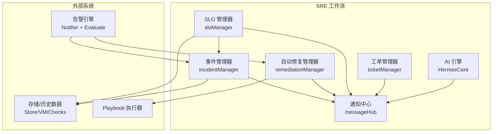
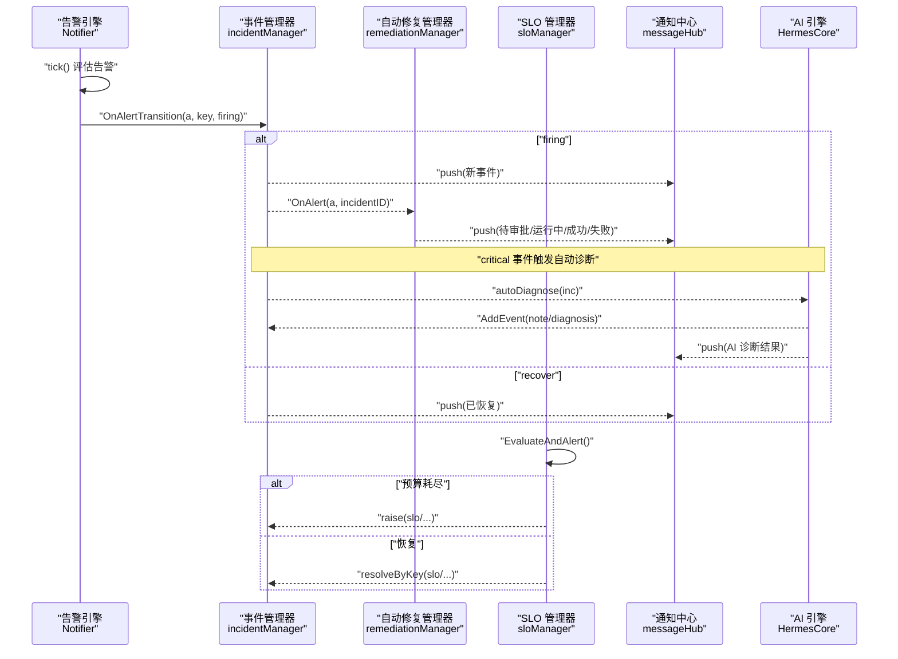
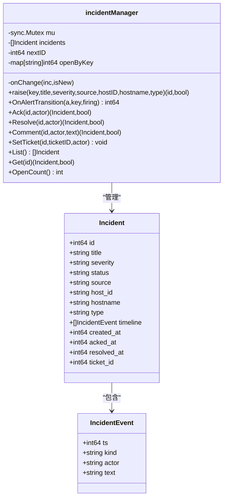
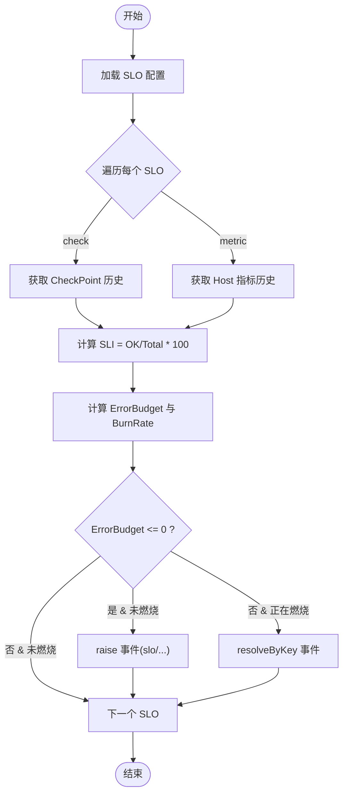
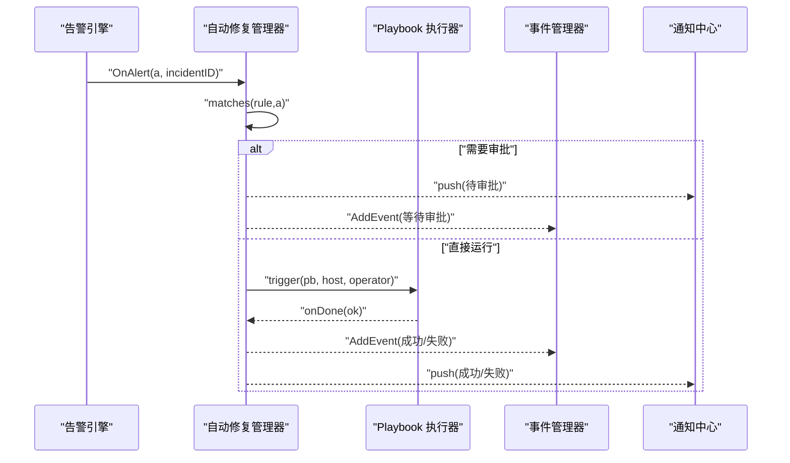
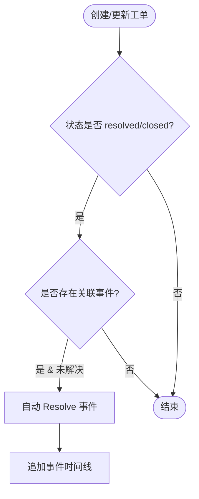
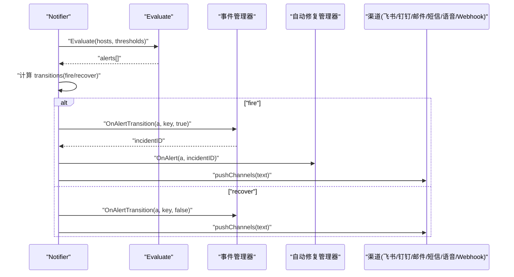
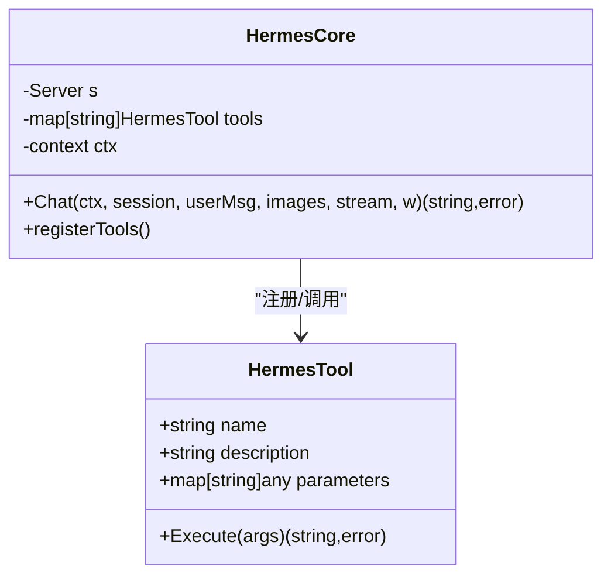
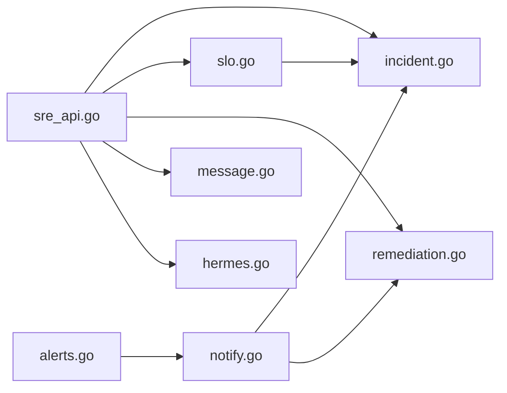

# SRE 工作流 API

<cite>
**本文引用的文件**   
- [sre_api.go](file://cmd/server/sre_api.go)
- [incident.go](file://cmd/server/incident.go)
- [slo.go](file://cmd/server/slo.go)
- [ticket.go](file://cmd/server/ticket.go)
- [alerts.go](file://cmd/server/alerts.go)
- [remediation.go](file://cmd/server/remediation.go)
- [notify.go](file://cmd/server/notify.go)
- [message.go](file://cmd/server/message.go)
- [hermes.go](file://cmd/server/hermes.go)
- [handlers.go](file://cmd/server/handlers.go)
</cite>

## 目录
1. [简介](#简介)
2. [项目结构](#项目结构)
3. [核心组件](#核心组件)
4. [架构总览](#架构总览)
5. [详细组件分析](#详细组件分析)
6. [依赖关系分析](#依赖关系分析)
7. [性能考量](#性能考量)
8. [故障排查指南](#故障排查指南)
9. [结论](#结论)
10. [附录：API 定义与示例流程](#附录api-定义与示例流程)

## 简介
本文件面向 SRE 工作流 API，覆盖事件管理、SLO 评估、自动修复闭环、工单流转、告警关联、根因分析与自动修复、团队协作与通知推送、报表生成等能力。文档以代码为依据，提供端到端业务流程说明、关键数据结构、时序图与流程图，帮助读者快速理解并集成使用。

## 项目结构
SRE 工作流由多个模块协作完成：
- 事件（Incident）：统一的问题生命周期与时间线
- 告警（Alert）：阈值与拨测指标触发
- SLO：基于检查或指标的 SLI 计算与错误预算燃烧
- 自动修复（Remediation）：规则匹配、审批与执行
- 工单（Ticket）：问题跟进与状态流转
- 通知中心（Message Hub）：跨模块消息聚合
- AI 诊断与巡检（Hermes）：观察-推理-行动循环与工具调用
- 路由与中间件：HTTP 路由注册与安全压缩

图表来源
- [sre_api.go:26-193](file://cmd/server/sre_api.go#L26-L193)
- [incident.go:47-119](file://cmd/server/incident.go#L47-L119)
- [slo.go:118-224](file://cmd/server/slo.go#L118-L224)
- [remediation.go:72-147](file://cmd/server/remediation.go#L72-L147)
- [ticket.go:44-84](file://cmd/server/ticket.go#L44-L84)
- [notify.go:102-158](file://cmd/server/notify.go#L102-L158)
- [message.go:38-76](file://cmd/server/message.go#L38-L76)
- [hermes.go:46-67](file://cmd/server/hermes.go#L46-L67)

章节来源
- [handlers.go:180-211](file://cmd/server/handlers.go#L180-L211)

## 核心组件
- 事件（Incident）：维护 open/acknowledged/resolved 状态，记录时间线，支持按去重键复用事件，避免抖动重复创建。
- SLO：支持 check/metric 两种 SLI 源，计算 SLI、剩余错误预算与燃烧率，预算耗尽时自动创建事件。
- 自动修复：规则匹配告警类型/级别/主机类别，具备冷却期与速率限制；可配置人工审批；执行后回写事件时间线与通知中心。
- 工单（Ticket）：轻量任务跟踪，支持优先级、状态流转、评论；可从事件升级而来，并在解决/关闭时联动事件自动解决。
- 通知中心：统一消息入口，承载事件、SLO、修复、AI 诊断等消息，带视图跳转与引用 ID。
- AI 引擎：提供查询指标、日志、活跃告警、相似案例检索、只读诊断命令执行、Python 动作执行等工具，支持 Function Calling。
- 告警引擎：周期评估主机与转发指标，产生 fire/recover 转换，驱动事件与自动修复。

章节来源
- [incident.go:18-119](file://cmd/server/incident.go#L18-L119)
- [slo.go:24-179](file://cmd/server/slo.go#L24-L179)
- [remediation.go:21-147](file://cmd/server/remediation.go#L21-L147)
- [ticket.go:19-84](file://cmd/server/ticket.go#L19-L84)
- [message.go:23-76](file://cmd/server/message.go#L23-L76)
- [hermes.go:30-196](file://cmd/server/hermes.go#L30-L196)
- [alerts.go:165-464](file://cmd/server/alerts.go#L165-L464)
- [notify.go:102-158](file://cmd/server/notify.go#L102-L158)

## 架构总览
SRE 工作流通过 wireSRE 将各管理器串联：
- 告警引擎在每次 tick 中计算当前告警集合，对比上一轮，产生 fire/recover 转换，分别触发事件 OnAlertTransition 与自动修复 OnAlert。
- SLO 定时评估，预算耗尽则 raise 事件，恢复则 resolveByKey。
- 事件变更回调 push 到通知中心，严重事件触发自动 AI 诊断。
- 自动修复规则匹配后进入审批队列或直接执行，结果写入事件时间线并推送通知。
- 工单从事件升级创建，更新为 resolved/closed 时联动事件自动解决。

图表来源
- [notify.go:102-158](file://cmd/server/notify.go#L102-L158)
- [incident.go:150-163](file://cmd/server/incident.go#L150-L163)
- [slo.go:195-224](file://cmd/server/slo.go#L195-L224)
- [sre_api.go:38-85](file://cmd/server/sre_api.go#L38-L85)
- [sre_api.go:218-231](file://cmd/server/sre_api.go#L218-L231)

## 详细组件分析

### 事件管理（Incident）
- 职责：统一问题入口，维护状态机与时间线，去重键复用，导出/导入持久化。
- 关键方法：
  - raise：按 key 复用或新建事件，追加 created 事件
  - OnAlertTransition：告警触发/恢复时打开/关闭事件
  - Ack/Resolve/Comment/SetTicket：人工操作与工单关联
  - List/Get/OpenCount：查询与统计
- 复杂度：内存数组 + map 索引，O(1) 查找，列表排序 O(n log n)。

图表来源
- [incident.go:18-119](file://cmd/server/incident.go#L18-L119)
- [incident.go:150-229](file://cmd/server/incident.go#L150-L229)

章节来源
- [incident.go:47-119](file://cmd/server/incident.go#L47-L119)
- [incident.go:150-229](file://cmd/server/incident.go#L150-L229)

### SLO 评估（SLO）
- 职责：根据 check 或 metric 源计算 SLI，推导错误预算与燃烧率，预算耗尽时 raise 事件。
- 关键逻辑：
  - computeStatus：窗口内统计 good/total，SLI=good/total*100
  - sloBudget：allowedBad=100-target，actualBad=100-sli，预算与燃烧率推导
  - EvaluateAndAlert：exhausted=true 且未 burning 则 raise；否则 recoverByKey
- 复杂度：遍历样本点 O(N)，N 为窗口内样本数。

图表来源
- [slo.go:134-179](file://cmd/server/slo.go#L134-L179)
- [slo.go:195-224](file://cmd/server/slo.go#L195-L224)

章节来源
- [slo.go:24-179](file://cmd/server/slo.go#L24-L179)
- [slo.go:195-224](file://cmd/server/slo.go#L195-L224)

### 自动修复（Remediation）
- 职责：将告警与修复剧本 Playbook 关联，支持冷却期、每小时上限、分类过滤、人工审批。
- 关键流程：
  - matches：匹配类型/级别/类别
  - evaluateRule：冷却期/速率限制/无剧本/需审批/直接运行
  - launch：异步执行 playbook，完成后 finish 更新状态
  - Approve/Reject：人工决策
- 安全与稳定性：per-host 冷却、per-rule 小时级限流、幂等记录、异常不阻塞主流程。

图表来源
- [remediation.go:103-147](file://cmd/server/remediation.go#L103-L147)
- [remediation.go:149-205](file://cmd/server/remediation.go#L149-L205)
- [remediation.go:207-262](file://cmd/server/remediation.go#L207-L262)
- [sre_api.go:503-527](file://cmd/server/sre_api.go#L503-L527)

章节来源
- [remediation.go:72-147](file://cmd/server/remediation.go#L72-L147)
- [remediation.go:149-205](file://cmd/server/remediation.go#L149-L205)
- [remediation.go:207-262](file://cmd/server/remediation.go#L207-L262)

### 工单流转（Ticket）
- 职责：轻量任务跟踪，支持优先级、状态、指派人与评论；可从事件升级创建；解决/关闭时联动事件自动解决。
- 关键方法：Create/Update/Comment/Delete/List/Get/OpenCount。
- 联动：当工单状态变为 resolved/closed，若存在关联事件且未解决，则自动 Resolve 事件并追加事件时间线。

图表来源
- [ticket.go:86-118](file://cmd/server/ticket.go#L86-L118)
- [sre_api.go:626-661](file://cmd/server/sre_api.go#L626-L661)

章节来源
- [ticket.go:44-118](file://cmd/server/ticket.go#L44-L118)
- [sre_api.go:626-661](file://cmd/server/sre_api.go#L626-L661)

### 告警与通知（Alerts & Notifier）
- 告警评估：对主机指标与转发指标进行阈值判断，输出 Alert 列表，支持多种类型（cpu/memory/disk/load/gpu/api/task/forward 等）。
- 通知分发：仅对 fire/recover 转换发送，支持飞书、钉钉、邮件、短信、语音、自定义 Webhook，含静默/抑制/路由策略。
- 与 SRE 联动：fire 时创建事件并触发自动修复；recover 时关闭事件。

图表来源
- [alerts.go:204-464](file://cmd/server/alerts.go#L204-L464)
- [notify.go:102-158](file://cmd/server/notify.go#L102-L158)
- [notify.go:196-276](file://cmd/server/notify.go#L196-L276)

章节来源
- [alerts.go:165-464](file://cmd/server/alerts.go#L165-L464)
- [notify.go:102-158](file://cmd/server/notify.go#L102-L158)
- [notify.go:196-276](file://cmd/server/notify.go#L196-L276)

### AI 诊断与巡检（Hermes）
- 职责：提供“观察→推理→行动”的自主运维能力，内置工具包括查询指标、搜索日志、列出活跃告警、相似案例检索、只读诊断命令执行、Python 动作执行、数据源查询等。
- 安全门控：只读诊断命令白名单+敏感路径黑名单；高风险写操作默认拒绝，需显式开启自动批准。
- 与 SRE 联动：严重事件自动诊断，结果追加到事件时间线并推送通知；巡检报告沉淀至记忆库供 RAG 复用。

图表来源
- [hermes.go:46-67](file://cmd/server/hermes.go#L46-L67)
- [hermes.go:70-196](file://cmd/server/hermes.go#L70-L196)
- [hermes.go:498-549](file://cmd/server/hermes.go#L498-L549)
- [hermes.go:551-581](file://cmd/server/hermes.go#L551-L581)

章节来源
- [hermes.go:30-196](file://cmd/server/hermes.go#L30-L196)
- [hermes.go:498-549](file://cmd/server/hermes.go#L498-L549)
- [hermes.go:551-581](file://cmd/server/hermes.go#L551-L581)

## 依赖关系分析
- 耦合与内聚：
  - sre_api.go 作为编排层，注入各管理器回调，保持低耦合高内聚。
  - notifier 与 incident/remediation 解耦，通过接口回调通信。
  - sloManager 依赖配置与历史数据源，独立于 HTTP 层。
- 外部依赖：
  - 存储/历史数据：Store/VM/Checks
  - 执行器：Playbook 执行
  - 通知渠道：飞书/钉钉/邮件/短信/语音/Webhook
  - AI 服务：LLM 与向量检索（可选）

图表来源
- [sre_api.go:26-193](file://cmd/server/sre_api.go#L26-L193)
- [notify.go:102-158](file://cmd/server/notify.go#L102-L158)
- [slo.go:195-224](file://cmd/server/slo.go#L195-L224)
- [alerts.go:204-464](file://cmd/server/alerts.go#L204-L464)

章节来源
- [sre_api.go:26-193](file://cmd/server/sre_api.go#L26-L193)
- [notify.go:102-158](file://cmd/server/notify.go#L102-L158)
- [slo.go:195-224](file://cmd/server/slo.go#L195-L224)
- [alerts.go:204-464](file://cmd/server/alerts.go#L204-L464)

## 性能考量
- 事件与工单：内存数组 + 简单索引，适合中小规模；列表返回前排序 O(n log n)。
- SLO 评估：窗口内样本遍历 O(N)，长窗口可能读取 VM 历史，注意采样频率与窗口大小。
- 自动修复：冷却期与速率限制防止风暴；异步执行避免阻塞主循环。
- 通知：仅在状态转换时发送，减少噪声；批量渠道发送并行化需注意并发与限流。
- 响应压缩：gzip 中间件对 JSON 响应压缩，降低带宽占用。

[本节为通用指导，无需具体文件分析]

## 故障排查指南
- 事件未创建：
  - 检查告警引擎是否启用、阈值配置是否正确、主机是否在线
  - 确认事件去重键是否冲突导致复用
- SLO 未触发事件：
  - 检查 window_days、目标值、比较器与阈值
  - 确认数据源（check/metric）可用且历史数据完整
- 自动修复未执行：
  - 检查规则匹配条件（类型/级别/类别）、冷却期与速率限制
  - 确认剧本存在且可执行，审批是否被拒绝
- 通知未送达：
  - 检查渠道配置与签名、网络连通性、静默/抑制/路由规则
- AI 诊断失败：
  - 检查 AI 配置、模型可用性、向量检索是否启用、权限开关

章节来源
- [sre_api.go:38-85](file://cmd/server/sre_api.go#L38-L85)
- [sre_api.go:218-231](file://cmd/server/sre_api.go#L218-L231)
- [notify.go:196-276](file://cmd/server/notify.go#L196-L276)
- [hermes.go:498-549](file://cmd/server/hermes.go#L498-L549)

## 结论
SRE 工作流 API 围绕事件为核心，整合告警、SLO、自动修复与工单，形成闭环自动化与可观测性体系。通过通知中心与 AI 能力，实现跨模块协同、智能诊断与知识沉淀。建议在生产环境合理设置阈值与窗口，启用审批与限流，结合 AI 诊断提升排障效率。

[本节为总结，无需具体文件分析]

## 附录：API 定义与示例流程

### 路由与处理器
- 概览：/api/v1/sre/overview
- 事件：GET/POST /api/v1/incidents，GET /api/v1/incidents/{id}，POST /api/v1/incidents/{id}/ack，/resolve，/comment，/ticket
- 自动修复：GET /api/v1/remediation/rules，POST /api/v1/remediation/rules，DELETE /api/v1/remediation/rules/{id}，GET /api/v1/remediation/runs，POST /api/v1/remediation/runs/{id}/approve，/reject
- SLO：GET /api/v1/slos，POST /api/v1/slos，DELETE /api/v1/slos/{id}
- 工单：GET /api/v1/tickets，POST /api/v1/tickets，GET /api/v1/tickets/{id}，POST /api/v1/tickets/{id}，POST /api/v1/tickets/{id}/comment，DELETE /api/v1/tickets/{id}
- 日志：POST /api/v1/agent/logs，GET /api/v1/logs，POST /api/v1/logs/diagnose
- 通知中心：GET /api/v1/messages，POST /api/v1/messages/read，/read-all
- AI：/api/v1/ai/*，/api/v1/incidents/{id}/diagnose，/diagnose-chat，/diagnosis-feedback
- Hermes：/api/v1/hermes/*

章节来源
- [handlers.go:180-211](file://cmd/server/handlers.go#L180-L211)

### 事件生命周期管理
- 创建：POST /api/v1/incidents
- 确认：POST /api/v1/incidents/{id}/ack
- 解决：POST /api/v1/incidents/{id}/resolve
- 评论：POST /api/v1/incidents/{id}/comment
- 升级工单：POST /api/v1/incidents/{id}/ticket

章节来源
- [sre_api.go:341-465](file://cmd/server/sre_api.go#L341-L465)
- [incident.go:174-229](file://cmd/server/incident.go#L174-L229)

### SLO 目标设定与评估
- 列表：GET /api/v1/slos
- 新增/更新：POST /api/v1/slos
- 删除：DELETE /api/v1/slos/{id}
- 评估：内部定时器 EvaluateAndAlert，预算耗尽 raise 事件，恢复 resolveByKey

章节来源
- [sre_api.go:533-559](file://cmd/server/sre_api.go#L533-L559)
- [slo.go:181-224](file://cmd/server/slo.go#L181-L224)

### 工单状态流转
- 列表/详情/创建/更新/评论/删除
- 从事件升级：POST /api/v1/incidents/{id}/ticket
- 联动解决：工单 resolved/closed → 自动 Resolve 关联事件

章节来源
- [sre_api.go:565-694](file://cmd/server/sre_api.go#L565-L694)
- [ticket.go:86-118](file://cmd/server/ticket.go#L86-L118)

### 告警关联与自动修复
- 告警评估：Evaluate(hosts, thresholds)
- 通知分发：pushChannels，支持多通道
- 自动修复：OnAlert → matches → evaluateRule → launch → finish

章节来源
- [alerts.go:204-464](file://cmd/server/alerts.go#L204-L464)
- [notify.go:102-158](file://cmd/server/notify.go#L102-L158)
- [notify.go:196-276](file://cmd/server/notify.go#L196-L276)
- [remediation.go:103-205](file://cmd/server/remediation.go#L103-L205)

### 根因分析与自动修复（AI）
- 自动诊断：critical 事件触发 autoDiagnose，结果追加事件时间线并推送通知
- 只读诊断：run_diagnostic 工具，白名单命令与敏感路径黑名单
- Python 动作：run_python_action，默认拒绝，需显式开启自动批准

章节来源
- [sre_api.go:218-231](file://cmd/server/sre_api.go#L218-L231)
- [hermes.go:498-549](file://cmd/server/hermes.go#L498-L549)
- [hermes.go:551-581](file://cmd/server/hermes.go#L551-L581)

### 团队协作、通知推送与报表
- 通知中心：统一消息聚合，支持标记已读、未读数统计
- 多渠道推送：飞书/钉钉/邮件/短信/语音/Webhook
- 报表：SLO 列表返回 SLI/预算/燃烧率；事件/工单/修复运行历史可用于报表

章节来源
- [message.go:38-76](file://cmd/server/message.go#L38-L76)
- [notify.go:196-276](file://cmd/server/notify.go#L196-L276)
- [slo.go:181-193](file://cmd/server/slo.go#L181-L193)

### 完整业务流程示例（文本描述）
- 事件创建与升级处理：
  - 告警触发 → 创建事件 → 自动诊断（critical）→ 推送通知
  - 人工确认/评论 → 升级为工单 → 工单指派与评论
  - 工单解决/关闭 → 自动解决事件
- SLA 计算与燃烧：
  - 配置 SLO（check/metric）→ 定时评估 → 预算耗尽 raise 事件 → 恢复 resolveByKey
- 自动修复闭环：
  - 告警匹配规则 → 冷却/限流 → 审批或自动执行 → 结果回写事件与通知
- 告警关联与根因分析：
  - 告警引擎评估 → 事件/修复联动 → AI 诊断与相似案例检索
- 协作与通知：
  - 通知中心聚合事件/SLO/修复/AI 消息 → 多渠道推送 → 前端查看与跳转

[本节为流程概述，无需具体文件分析]