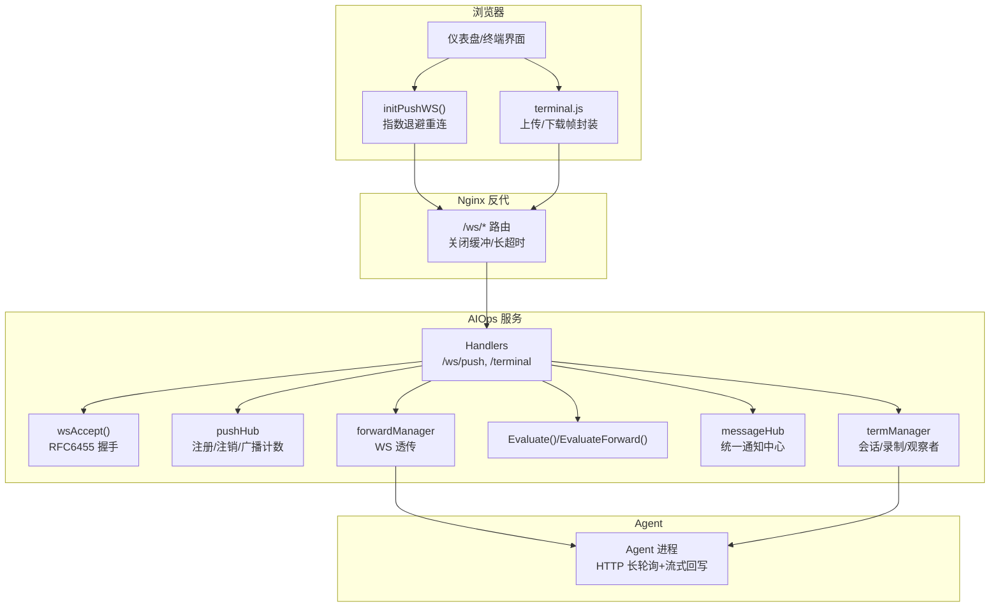
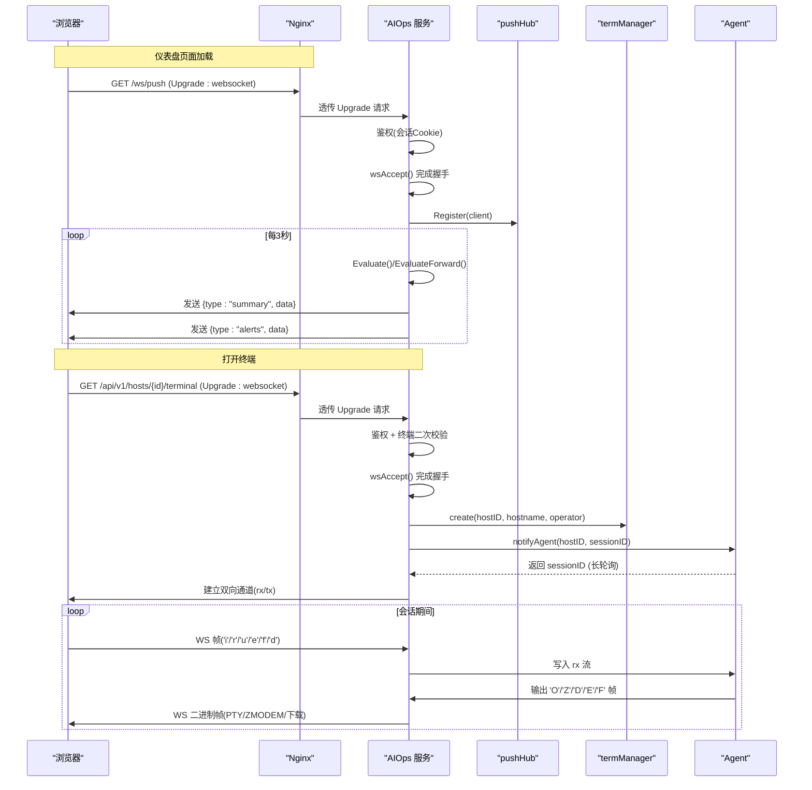
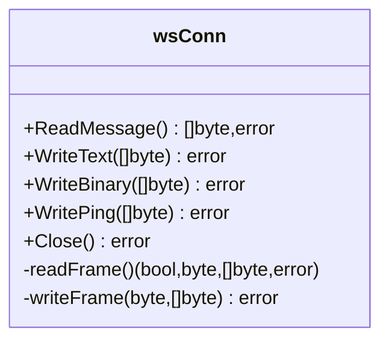
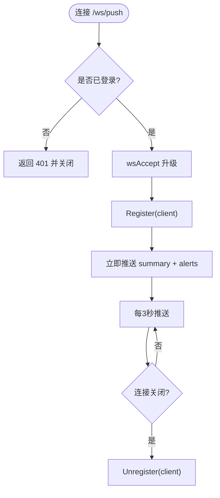
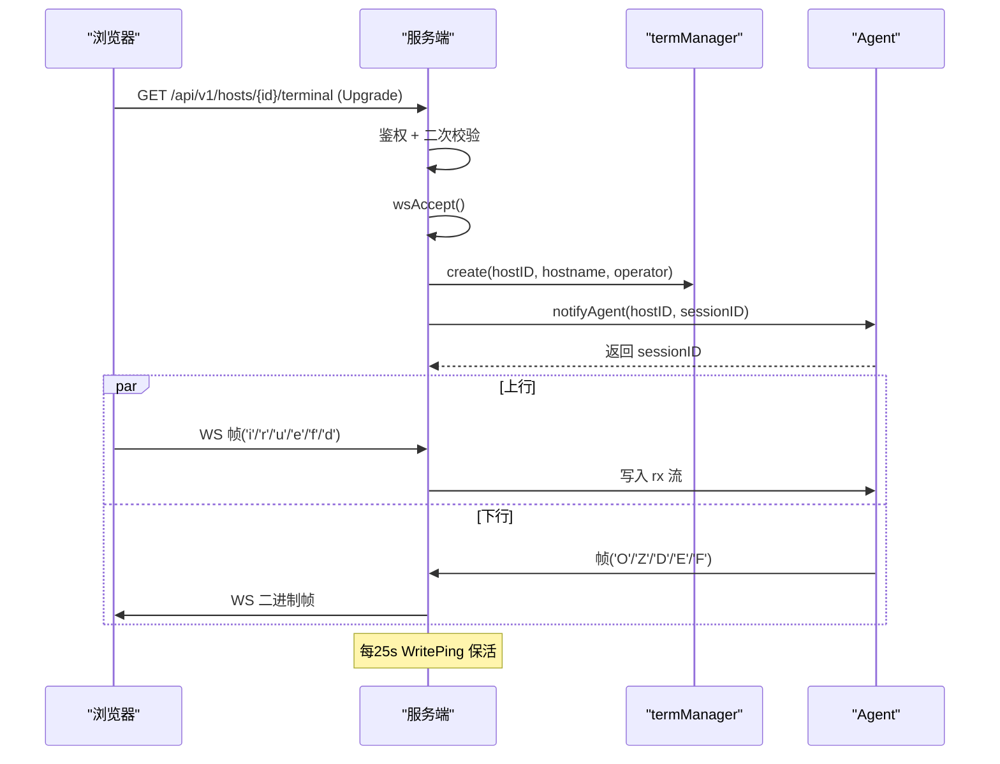
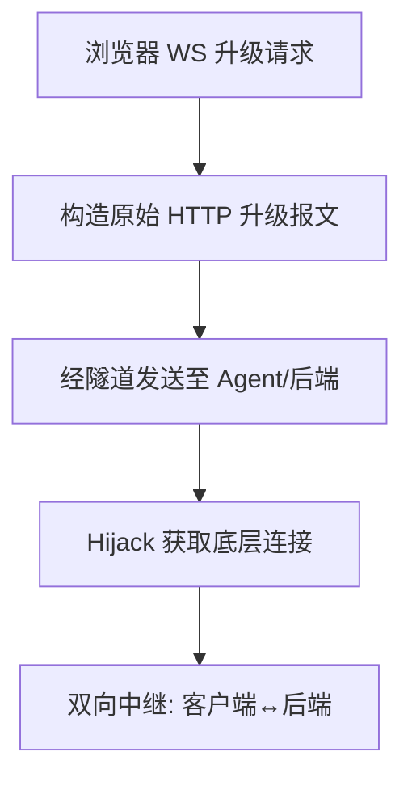
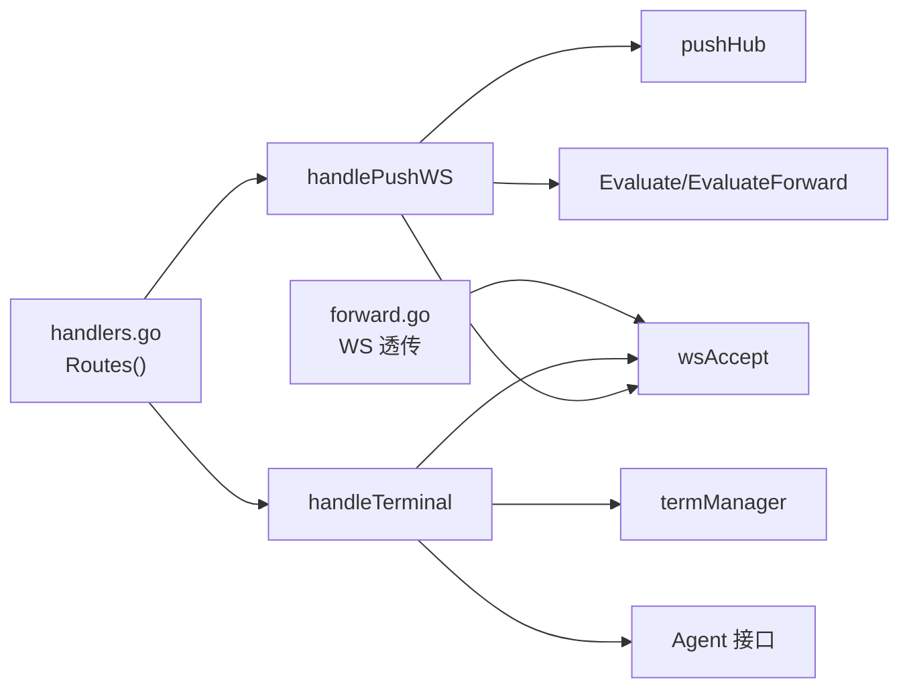

# WebSocket 实时接口

<cite>
**本文引用的文件**   
- [ws.go](file://cmd/server/ws.go)
- [handlers.go](file://cmd/server/handlers.go)
- [terminal.go](file://cmd/server/terminal.go)
- [push.go](file://cmd/server/push.go)
- [alerts.go](file://cmd/server/alerts.go)
- [message.go](file://cmd/server/message.go)
- [forward.go](file://cmd/server/forward.go)
- [nginx-frontend.conf](file://docker/nginx/nginx-frontend.conf)
- [init.js](file://cmd/server/web/js/init.js)
- [terminal.js](file://cmd/server/web/js/terminal.js)
</cite>

## 目录
1. [简介](#简介)
2. [项目结构](#项目结构)
3. [核心组件](#核心组件)
4. [架构总览](#架构总览)
5. [详细组件分析](#详细组件分析)
6. [依赖关系分析](#依赖关系分析)
7. [性能与优化](#性能与优化)
8. [故障排查指南](#故障排查指南)
9. [结论](#结论)
10. [附录：消息协议与事件枚举](#附录消息协议与事件枚举)

## 简介
本文件面向基于 WebSocket 的实时通信能力，覆盖以下场景：
- 终端会话（浏览器 ↔ 服务端 ↔ Agent）
- 实时告警推送（仪表盘摘要 + 告警列表）
- 指标实时更新（通过推送通道周期性下发）
- 端口转发中的 WebSocket 透传（HTTP 代理/WS 升级透传）

文档包含连接建立流程、认证机制、消息格式定义、事件类型枚举、客户端示例、订阅发布模式、错误处理与重连机制、连接池管理、广播机制、消息持久化、性能优化建议与调试方法。

## 项目结构
WebSocket 相关实现集中在服务端模块中，采用“纯标准库”的 RFC 6455 最小实现，避免第三方依赖；同时提供前端 JS 初始化与重连逻辑，以及 Nginx 反向代理配置以支持长连接与低延迟。

图表来源
- [handlers.go:298-300](file://cmd/server/handlers.go#L298-L300)
- [ws.go:38-70](file://cmd/server/ws.go#L38-L70)
- [push.go:27-58](file://cmd/server/push.go#L27-L58)
- [terminal.go:437-466](file://cmd/server/terminal.go#L437-L466)
- [alerts.go:204-464](file://cmd/server/alerts.go#L204-L464)
- [message.go:38-76](file://cmd/server/message.go#L38-L76)
- [forward.go:1584-1640](file://cmd/server/forward.go#L1584-L1640)
- [nginx-frontend.conf:86-104](file://docker/nginx/nginx-frontend.conf#L86-L104)
- [init.js:79-113](file://cmd/server/web/js/init.js#L79-L113)
- [terminal.js:708-742](file://cmd/server/web/js/terminal.js#L708-L742)

章节来源
- [handlers.go:100-350](file://cmd/server/handlers.go#L100-L350)
- [ws.go:1-184](file://cmd/server/ws.go#L1-L184)
- [push.go:1-134](file://cmd/server/push.go#L1-L134)
- [terminal.go:1-1074](file://cmd/server/terminal.go#L1-L1074)
- [alerts.go:1-544](file://cmd/server/alerts.go#L1-L544)
- [message.go:1-137](file://cmd/server/message.go#L1-L137)
- [forward.go:1584-1640](file://cmd/server/forward.go#L1584-L1640)
- [nginx-frontend.conf:86-104](file://docker/nginx/nginx-frontend.conf#L86-L104)
- [init.js:79-113](file://cmd/server/web/js/init.js#L79-L113)
- [terminal.js:708-742](file://cmd/server/web/js/terminal.js#L708-L742)

## 核心组件
- wsConn：基于标准库的最小 RFC 6455 实现，提供 ReadMessage/WriteText/WriteBinary/WritePing/Close 等能力，自动处理 ping/pong/close 与分片重组。
- pushHub：维护已连接的浏览器 WebSocket 客户端集合，提供 Register/Unregister/BroadcastCount，配合定时任务向每个客户端推送 summary 与 alerts。
- termManager：远程终端会话管理器，负责创建/归档/回放/观察会话，记录输入输出并持久化到本地文件或 PG，支持命令审计与密码提示脱敏。
- forwardManager：端口转发与 HTTP 代理，支持将浏览器的 WebSocket 升级请求透传到后端目标（包括转发所有 Sec-WebSocket-* 头）。
- Evaluate/EvaluateForward：阈值评估引擎，生成系统/转发类告警，供推送通道使用。
- messageHub：统一通知中心，聚合 SRE/告警/AI 等消息，持久化到 PG，供前端铃铛/收件箱展示。

章节来源
- [ws.go:32-184](file://cmd/server/ws.go#L32-L184)
- [push.go:10-134](file://cmd/server/push.go#L10-L134)
- [terminal.go:109-416](file://cmd/server/terminal.go#L109-L416)
- [forward.go:1584-1640](file://cmd/server/forward.go#L1584-L1640)
- [alerts.go:204-516](file://cmd/server/alerts.go#L204-L516)
- [message.go:38-137](file://cmd/server/message.go#L38-L137)

## 架构总览
整体采用“服务端直连 + 反代适配”的模式：
- 浏览器通过 Nginx 的 /ws/* 路径进入服务端，Nginx 关闭缓冲、设置长超时，确保实时性。
- 服务端对 /ws/push 进行鉴权后升级为 WebSocket，按固定周期推送 summary 与 alerts。
- 终端会话通过 /api/v1/hosts/{id}/terminal 建立 WebSocket，服务端在鉴权与二次校验通过后，桥接浏览器与 Agent 的两条 HTTP 流（rx/tx），并以 WS 文本/二进制帧承载交互。
- 端口转发支持将浏览器的 WS 升级请求完整透传到后端应用，便于内网服务的 WS 功能暴露。

图表来源
- [handlers.go:298-300](file://cmd/server/handlers.go#L298-L300)
- [handlers.go:109-113](file://cmd/server/handlers.go#L109-L113)
- [ws.go:38-70](file://cmd/server/ws.go#L38-L70)
- [push.go:27-58](file://cmd/server/push.go#L27-L58)
- [terminal.go:437-516](file://cmd/server/terminal.go#L437-L516)
- [terminal.go:619-696](file://cmd/server/terminal.go#L619-L696)
- [terminal.go:745-840](file://cmd/server/terminal.go#L745-L840)
- [nginx-frontend.conf:86-104](file://docker/nginx/nginx-frontend.conf#L86-L104)

## 详细组件分析

### 通用 WebSocket 层（wsConn）
- 功能要点
  - 仅实现必要的操作码：文本、二进制、关闭、ping、pong，支持分片重组。
  - 读取时自动应答 ping，遇到 close 返回 EOF，上层可据此优雅退出。
  - 写端加锁序列化，避免并发写冲突。
- 复杂度与边界
  - 单帧最大 8 MiB，防止内存膨胀。
  - 读循环持续处理控制帧，不阻塞业务数据。
- 适用场景
  - 终端会话、推送通道、转发透传均复用该实现。

图表来源
- [ws.go:32-184](file://cmd/server/ws.go#L32-L184)

章节来源
- [ws.go:1-184](file://cmd/server/ws.go#L1-L184)

### 实时推送（/ws/push）
- 连接建立
  - 要求登录态（同 REST API 的 Cookie 鉴权）。
  - 成功后注册到 pushHub，立即发送一次 summary，随后每 3 秒推送。
- 消息内容
  - type="summary"：包含主机总数、在线数、离线数、严重/警告告警计数、插件事件数、服务器时间、版本、是否启用终端等。
  - type="alerts"：当前告警列表（由 Evaluate/EvaluateForward 计算得出）。
- 客户端行为
  - 前端 initPushWS 在 HTTPS 或 localhost 下尝试 WS，失败则降级为 REST 轮询。
  - onclose 指数退避重连，最多重试 10 次。

图表来源
- [push.go:27-58](file://cmd/server/push.go#L27-L58)
- [push.go:60-108](file://cmd/server/push.go#L60-L108)
- [init.js:79-113](file://cmd/server/web/js/init.js#L79-L113)

章节来源
- [push.go:1-134](file://cmd/server/push.go#L1-L134)
- [init.js:79-113](file://cmd/server/web/js/init.js#L79-L113)

### 终端会话（/api/v1/hosts/{id}/terminal）
- 连接建立
  - 鉴权（authMiddleware）+ 终端二次校验（可选密码验证）。
  - 成功后 wsAccept 升级，创建 termSession，通知 Agent 长轮询等待。
- 上行（浏览器 → Agent）
  - 首字节标记类型：'i' 输入、'r' 窗口大小、'u' 上传数据块、'e' 结束上传、'f' 上传元数据、'd' 下载请求。
  - 服务端将其封装为自定界帧 [type:1][len:2 BE][payload] 写入 Agent 的 rx 流。
- 下行（Agent → 浏览器）
  - Agent 以 [type:1][len:4 BE][payload] 帧上报：'O' 正常输出、'Z' ZMODEM 信号、'D' 下载数据块、'E' 传输完成、'F' 文件信息。
  - 服务端转换为浏览器侧的 ZMODEM 帧 [0xFF][0xFE][type][len:4][payload] 或直接透传 PTY 输出。
- 会话增强
  - 录制：输出帧入队，限制上限，结束后落盘 JSON 文件，并可持久化到 PG。
  - 观察者：多用户可只读观察同一会话。
  - 命令审计：提取完整命令行，屏蔽密码提示后的输入，并对明文密钥做脱敏。
- 保活
  - 服务端每 25 秒发送 WS Ping，保持空闲/后台标签的连接存活。

图表来源
- [terminal.go:437-516](file://cmd/server/terminal.go#L437-L516)
- [terminal.go:619-696](file://cmd/server/terminal.go#L619-L696)
- [terminal.go:745-840](file://cmd/server/terminal.go#L745-L840)
- [terminal.go:597-616](file://cmd/server/terminal.go#L597-L616)

章节来源
- [terminal.go:1-1074](file://cmd/server/terminal.go#L1-L1074)

### 端口转发中的 WebSocket 透传
- 浏览器发起 WS 升级请求至 /proxy 或转发入口，服务端构造原始 HTTP 升级报文，将所有头部（含 Sec-WebSocket-*）透传给后端目标。
- 通过 Hijack 获取底层连接，建立双向中继，保证 WS 帧透明传输。

图表来源
- [forward.go:1584-1640](file://cmd/server/forward.go#L1584-L1640)

章节来源
- [forward.go:1584-1640](file://cmd/server/forward.go#L1584-L1640)

### 告警与指标更新（推送数据源）
- 评估引擎
  - Evaluate：根据主机最新指标与阈值配置，产出 CPU/内存/磁盘/IO/IOPS/GPU/负载/进程/连接/API/任务等告警。
  - EvaluateForward：基于转发快照，产出连接数/带宽/错误率/延迟等告警。
- 推送内容
  - summary 中包含 critical/warning 计数、在线主机数等。
  - alerts 为当前告警数组，供前端渲染。

章节来源
- [alerts.go:204-516](file://cmd/server/alerts.go#L204-L516)
- [push.go:60-108](file://cmd/server/push.go#L60-L108)

### 统一通知中心（messageHub）
- 聚合 SRE 事件、AI 诊断、自动化审批、SLO 违约、系统操作等消息。
- 环形缓冲区限长，支持未读数统计、批量已读、导出/导入（PG 持久化）。

章节来源
- [message.go:23-137](file://cmd/server/message.go#L23-L137)

## 依赖关系分析
- 路由注册
  - /ws/push 由 handlers.go 注册，调用 handlePushWS。
  - /api/v1/hosts/{id}/terminal 由 handlers.go 注册，调用 handleTerminal。
- 内部依赖
  - handlePushWS 依赖 wsAccept、pushHub.Register/Unregister、Evaluate/EvaluateForward。
  - handleTerminal 依赖 wsAccept、termManager、Agent 长轮询与流式接口。
  - forward 透传依赖 Hijacker 与原始 HTTP 构建。
- 外部依赖
  - Nginx 反代需正确转发 Upgrade 头、关闭缓冲、设置长超时。

图表来源
- [handlers.go:298-300](file://cmd/server/handlers.go#L298-L300)
- [handlers.go:109-113](file://cmd/server/handlers.go#L109-L113)
- [ws.go:38-70](file://cmd/server/ws.go#L38-L70)
- [push.go:27-58](file://cmd/server/push.go#L27-L58)
- [terminal.go:437-466](file://cmd/server/terminal.go#L437-L466)
- [forward.go:1584-1640](file://cmd/server/forward.go#L1584-L1640)

章节来源
- [handlers.go:100-350](file://cmd/server/handlers.go#L100-L350)
- [ws.go:38-70](file://cmd/server/ws.go#L38-L70)
- [push.go:27-58](file://cmd/server/push.go#L27-L58)
- [terminal.go:437-466](file://cmd/server/terminal.go#L437-L466)
- [forward.go:1584-1640](file://cmd/server/forward.go#L1584-L1640)

## 性能与优化
- 反代层
  - 关闭 proxy_buffering 与 proxy_request_buffering，避免缓冲引入延迟。
  - 设置较长的 proxy_read_timeout/proxy_send_timeout，保障长连接稳定。
- 服务端
  - gzip 中间件跳过 WS 升级与终端/转发流，避免压缩开销影响实时性。
  - pushHub 定时推送间隔 3s，兼顾实时性与负载。
  - 终端会话每 25s 发送 WS Ping，降低代理/NAT 空闲断开概率。
- 前端
  - 指数退避重连，避免雪崩。
  - 大文件上传分块与让出主线程，避免阻塞 WS 发送缓冲。

章节来源
- [nginx-frontend.conf:86-104](file://docker/nginx/nginx-frontend.conf#L86-L104)
- [main.go:186-205](file://cmd/server/main.go#L186-L205)
- [push.go:46-58](file://cmd/server/push.go#L46-L58)
- [terminal.go:597-616](file://cmd/server/terminal.go#L597-L616)
- [init.js:103-113](file://cmd/server/web/js/init.js#L103-L113)
- [terminal.js:708-742](file://cmd/server/web/js/terminal.js#L708-L742)

## 故障排查指南
- 连接无法建立
  - 检查 Nginx 是否正确转发 Upgrade 头与 Connection 头。
  - 确认服务端鉴权成功（/ws/push 需要登录态）。
- 频繁断开
  - 检查代理层超时与缓冲配置。
  - 终端会话关注服务端 Ping 是否正常发出。
- 推送无数据
  - 确认 Evaluate/EvaluateForward 能产出告警。
  - 检查 pushHub 的客户端数量与注册/注销逻辑。
- 终端无输出
  - 检查 Agent 是否成功 attach tx 流，服务端是否收到 'O' 帧。
  - 查看会话录制是否落盘，定位断点。
- 端口转发 WS 不通
  - 确认透传的 Sec-WebSocket-* 头是否完整到达后端。
  - 检查后端目标是否支持 WS 升级。

章节来源
- [nginx-frontend.conf:86-104](file://docker/nginx/nginx-frontend.conf#L86-L104)
- [push.go:27-58](file://cmd/server/push.go#L27-L58)
- [terminal.go:597-616](file://cmd/server/terminal.go#L597-L616)
- [terminal.go:745-840](file://cmd/server/terminal.go#L745-L840)
- [forward.go:1584-1640](file://cmd/server/forward.go#L1584-L1640)

## 结论
本项目采用轻量、可控的 WebSocket 实现，围绕终端会话与实时推送两大核心场景，结合 Nginx 反代优化与前端重连策略，提供了高可用、低延迟的实时通信能力。通过统一的评估引擎与通知中心，实现了告警与指标的实时可见性，并通过录制与审计增强了运维可观测性与合规性。

## 附录：消息协议与事件枚举

### 推送通道（/ws/push）
- 事件类型
  - summary：仪表盘摘要
    - data.total_hosts：主机总数
    - data.online_hosts：在线主机数
    - data.offline_hosts：离线主机数
    - data.critical_alerts：严重告警数
    - data.warning_alerts：警告告警数
    - data.plugin_events：插件事件数
    - data.server_time_unix：服务器时间戳
    - data.version：版本号
    - data.terminal_enabled：是否启用终端
  - alerts：当前告警列表
    - 元素字段参考 Alert 结构（host_id/hostname/ip/level/type/scope/since/message/value/timestamp/status 等）

章节来源
- [push.go:60-108](file://cmd/server/push.go#L60-L108)
- [alerts.go:165-178](file://cmd/server/alerts.go#L165-L178)

### 终端会话（/api/v1/hosts/{id}/terminal）
- 浏览器 → 服务端（WS 文本帧首字节）
  - i：键盘输入
  - r：终端尺寸变更（后续 payload 为 colsxrows）
  - u：上传数据块
  - e：上传结束
  - f：上传元数据（JSON，包含文件名、大小、目标路径）
  - d：下载请求
- 服务端 → 浏览器（WS 二进制帧）
  - PTY 输出：直接透传
  - ZMODEM 信号/下载数据/完成/文件信息：[0xFF][0xFE][type][len:4][payload]
- Agent → 服务端（HTTP 流帧）
  - O：正常输出
  - Z：ZMODEM 信号
  - D：下载数据块
  - E：传输完成
  - F：文件信息

章节来源
- [terminal.go:510-578](file://cmd/server/terminal.go#L510-L578)
- [terminal.go:745-840](file://cmd/server/terminal.go#L745-L840)
- [terminal.js:708-742](file://cmd/server/web/js/terminal.js#L708-L742)

### 端口转发（WS 透传）
- 透传规则
  - 保留所有请求头（含 Upgrade、Connection、Sec-WebSocket-*）。
  - 通过 Hijack 建立双向中继，WS 帧透明传输。

章节来源
- [forward.go:1584-1640](file://cmd/server/forward.go#L1584-L1640)