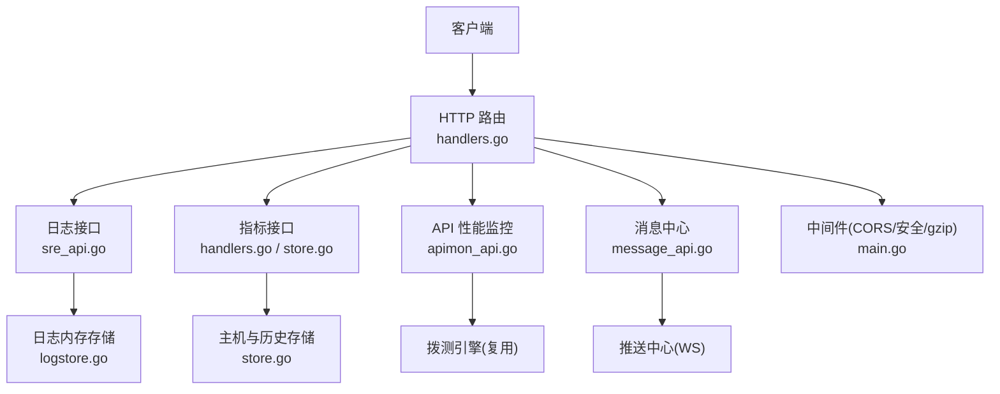
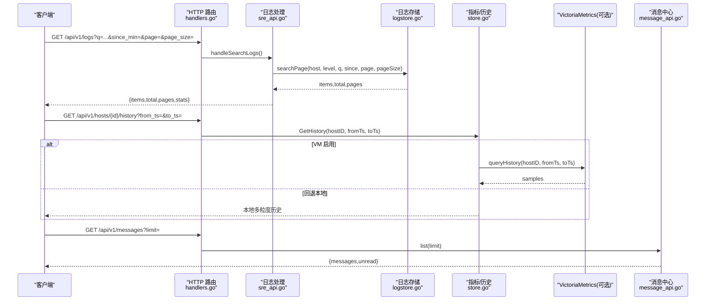
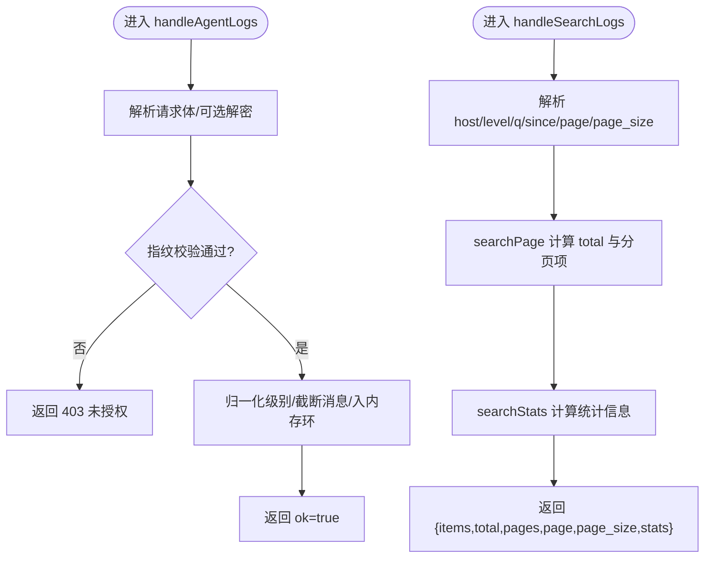
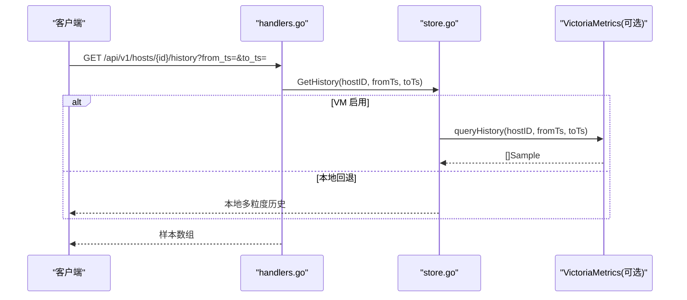
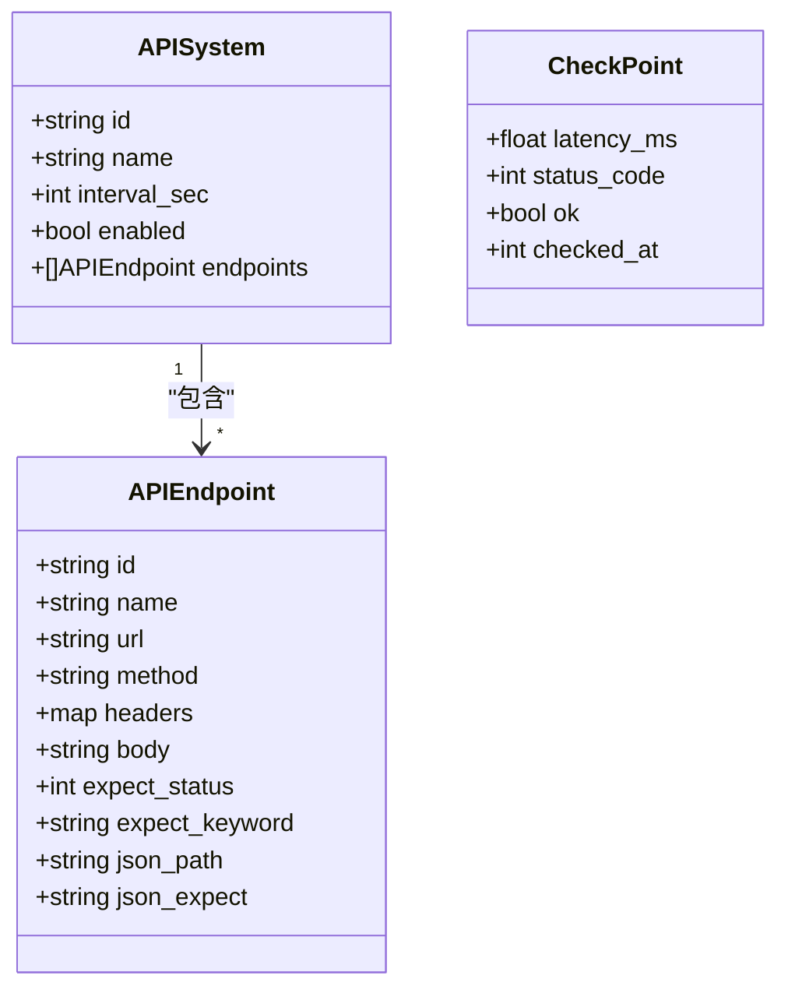
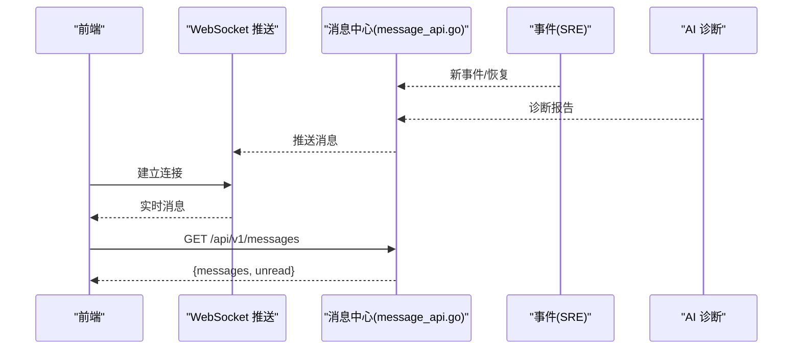
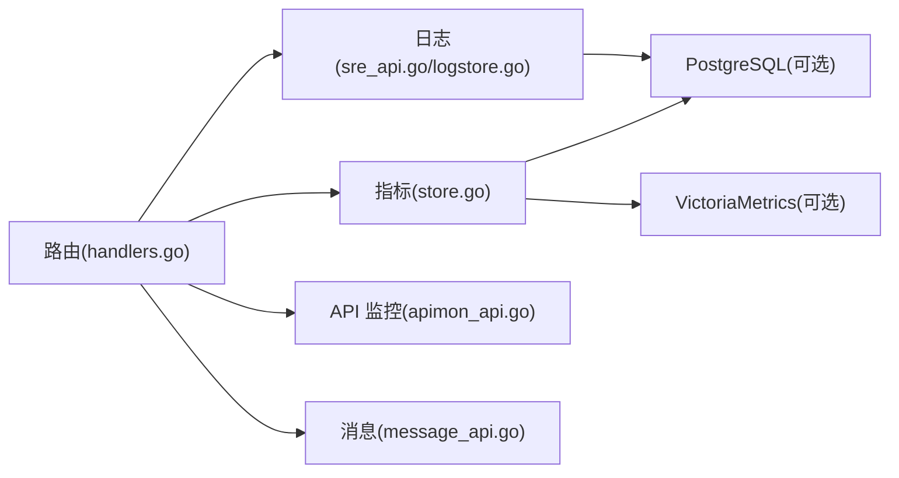

# 监控数据 API

<cite>
**本文引用的文件**   
- [handlers.go](file://cmd/server/handlers.go)
- [sre_api.go](file://cmd/server/sre_api.go)
- [logstore.go](file://cmd/server/logstore.go)
- [apimon_api.go](file://cmd/server/apimon_api.go)
- [message_api.go](file://cmd/server/message_api.go)
- [main.go](file://cmd/server/main.go)
- [store.go](file://cmd/server/store.go)
</cite>

## 目录
1. [简介](#简介)
2. [项目结构](#项目结构)
3. [核心组件](#核心组件)
4. [架构总览](#架构总览)
5. [详细组件分析](#详细组件分析)
6. [依赖关系分析](#依赖关系分析)
7. [性能与容量规划](#性能与容量规划)
8. [故障排查指南](#故障排查指南)
9. [结论](#结论)
10. [附录：接口清单与数据格式](#附录接口清单与数据格式)

## 简介
本文件面向使用 AIOps 监控系统“监控数据”能力的开发者与运维人员，系统性说明以下能力：
- 指标查询：主机指标、历史时序、聚合统计（内存环 + VM 长期存储）
- 日志检索：全文检索、分页、错误分析、趋势统计
- 消息推送：统一消息中心（告警/事件/AI 诊断结果等）
- 实时监控推送：WebSocket 实时通道（服务端推送）
- 历史数据导出：按时间范围与粒度导出
- 数据保留策略：内存环上限、持久化窗口、降采样规则

为保证可追溯性，文档在涉及具体实现细节的章节末尾提供“章节来源”，并在图示中给出“图示来源”。

## 项目结构
与监控数据 API 直接相关的后端代码集中在 cmd/server 下，关键文件职责如下：
- handlers.go：HTTP 路由注册与 Server 组装
- sre_api.go：日志采集/搜索/诊断、SRE 工作流相关接口
- logstore.go：日志内存环形缓冲、检索、分页、统计
- apimon_api.go：API 性能监控（业务系统/接口拨测）
- message_api.go：消息中心（列表、已读标记）
- main.go：通用中间件（CORS、安全头、gzip 压缩、请求体限制）
- store.go：主机状态、事件、活动日志、告警记录、历史分层存储

**图示来源**
- [handlers.go:96-200](file://cmd/server/handlers.go#L96-L200)
- [sre_api.go:699-775](file://cmd/server/sre_api.go#L699-L775)
- [logstore.go:80-166](file://cmd/server/logstore.go#L80-L166)
- [apimon_api.go:15-133](file://cmd/server/apimon_api.go#L15-L133)
- [message_api.go:9-41](file://cmd/server/message_api.go#L9-L41)
- [main.go:72-145](file://cmd/server/main.go#L72-L145)
- [store.go:29-51](file://cmd/server/store.go#L29-L51)

**章节来源**
- [handlers.go:96-200](file://cmd/server/handlers.go#L96-L200)
- [main.go:72-145](file://cmd/server/main.go#L72-L145)

## 核心组件
- 日志子系统
  - 接收 Agent 上报的日志批次，归一化级别、截断超长消息，写入内存环形缓冲
  - 支持按主机、级别、关键词、时间范围过滤；提供分页与统计（按级别、Top 主机、时间分布）
  - 提供“最近错误”和“错误计数”用于 AI 诊断与面板展示
- 指标与历史
  - 主机最新指标通过 /hosts/{id}/metrics 暴露
  - 历史数据采用多层降采样：原始(~1.5h)、1分钟(48h)、5分钟(30天)，并可选写入 VictoriaMetrics 做长期归档
- API 性能监控
  - 管理“业务系统 + 接口”的拨测任务，返回实时状态与聚合指标（平均/P95 响应、可用率、吞吐）
  - 支持按接口 ID 拉取历史序列（延迟/状态随时间）
- 消息中心
  - 提供消息列表与未读数，支持批量/全部标记已读
  - 与 SRE 工作流联动：新事件、恢复、AI 诊断、工单流转均会推送消息

**章节来源**
- [sre_api.go:699-775](file://cmd/server/sre_api.go#L699-L775)
- [logstore.go:21-166](file://cmd/server/logstore.go#L21-L166)
- [store.go:21-51](file://cmd/server/store.go#L21-L51)
- [apimon_api.go:15-133](file://cmd/server/apimon_api.go#L15-L133)
- [message_api.go:9-41](file://cmd/server/message_api.go#L9-L41)

## 架构总览
监控数据 API 的整体调用链如下：
- 客户端通过 REST 获取指标、日志、消息
- 日志由 Agent 以批形式 POST 到服务端，经指纹校验与可选解密后入库
- 指标历史优先从 VictoriaMetrics 读取（若启用），否则回退到本地多粒度缓存
- 消息中心作为统一通知出口，承载告警、事件、AI 诊断、自动化执行结果等

**图示来源**
- [handlers.go:200-201](file://cmd/server/handlers.go#L200-L201)
- [sre_api.go:740-775](file://cmd/server/sre_api.go#L740-L775)
- [logstore.go:108-166](file://cmd/server/logstore.go#L108-L166)
- [store.go:21-27](file://cmd/server/store.go#L21-L27)
- [message_api.go:9-21](file://cmd/server/message_api.go#L9-L21)

## 详细组件分析

### 日志检索与错误分析
- 采集入口
  - 路径：POST /api/v1/agent/logs
  - 认证：基于 Agent 指纹校验，支持加密上报（X-Log-Enc）
  - 行为：解析批次、归一化级别、截断超长消息、写入内存环
- 检索接口
  - 路径：GET /api/v1/logs
  - 参数：host、level、q、since_min、page、page_size
  - 返回：items、total、pages、page、page_size、stats（by_level、top_hosts、time_distribution）
- 错误分析
  - 提供“最近错误”与“错误计数”供 AI 诊断与面板使用
  - 支持对当前搜索上下文进行启发式诊断

**图示来源**
- [sre_api.go:699-738](file://cmd/server/sre_api.go#L699-L738)
- [sre_api.go:740-775](file://cmd/server/sre_api.go#L740-L775)
- [logstore.go:59-166](file://cmd/server/logstore.go#L59-L166)

**章节来源**
- [sre_api.go:699-775](file://cmd/server/sre_api.go#L699-L775)
- [logstore.go:21-166](file://cmd/server/logstore.go#L21-L166)

### 指标查询与历史数据
- 主机最新指标
  - 路径：GET /api/v1/hosts/{id}/metrics
  - 用途：获取该主机最新采集的 CPU/内存/磁盘/网络/GPU 等指标快照
- 历史数据
  - 路径：GET /api/v1/hosts/{id}/history
  - 时间范围：from_ts、to_ts（秒级 Unix 时间戳）
  - 数据来源：若启用 VictoriaMetrics，则优先从 VM 读取；否则回退到本地多粒度缓存
  - 数据粒度：原始(~1.5h)、1分钟(48h)、5分钟(30天)
- 聚合函数与时序语法
  - 本项目不内置自定义查询语言或聚合函数。如需高级聚合，建议将历史数据导出至 VictoriaMetrics 或其他时序数据库后使用其原生查询语法

**图示来源**
- [handlers.go:110-112](file://cmd/server/handlers.go#L110-L112)
- [store.go:21-27](file://cmd/server/store.go#L21-L27)

**章节来源**
- [handlers.go:110-112](file://cmd/server/handlers.go#L110-L112)
- [store.go:21-27](file://cmd/server/store.go#L21-L27)

### API 性能监控（拨测）
- 概览
  - 路径：GET /api/v1/apimon/systems
  - 返回：各业务系统及其接口的实时状态与聚合指标（avg_ms/p95_ms/avail_1h/avail_24h/samples_1h/down_since 等）
- 配置与运行
  - 新增/更新：POST /api/v1/apimon/systems
  - 立即探测：POST /api/v1/apimon/systems/{id}/run
  - 删除：DELETE /api/v1/apimon/systems/{id}
- 历史
  - 路径：GET /api/v1/apimon/endpoints/{id}/history
  - 参数：since_min（分钟数，默认 24h）
  - 返回：CheckPoint 序列（延迟/状态随时间）

**图示来源**
- [apimon_api.go:15-133](file://cmd/server/apimon_api.go#L15-L133)

**章节来源**
- [apimon_api.go:15-133](file://cmd/server/apimon_api.go#L15-L133)

### 消息推送（REST + WebSocket）
- REST 接口
  - 列表：GET /api/v1/messages?limit=
  - 标记已读：POST /api/v1/messages/read（body: ids[]）
  - 全部已读：POST /api/v1/messages/read-all
- 实时推送
  - 服务端维护推送中心（pushHub），通过 WebSocket 向客户端推送实时事件（如新告警、事件变更、AI 诊断结果等）
  - 前端订阅后即时渲染，无需轮询

**图示来源**
- [message_api.go:9-41](file://cmd/server/message_api.go#L9-L41)
- [handlers.go:204-206](file://cmd/server/handlers.go#L204-L206)

**章节来源**
- [message_api.go:9-41](file://cmd/server/message_api.go#L9-L41)
- [handlers.go:204-206](file://cmd/server/handlers.go#L204-L206)

## 依赖关系分析
- 路由层
  - handlers.go 集中注册所有 /api/v1/* 路由，并将请求分发到对应处理器
- 中间件
  - CORS、安全头、gzip 压缩、请求体大小限制等通用逻辑位于 main.go
- 存储层
  - store.go 维护主机状态、事件、活动日志、告警记录与历史分层
  - logstore.go 维护日志内存环与检索/统计
- 外部集成
  - VictoriaMetrics（可选）：长期时序数据归档与查询
  - PostgreSQL（可选）：审计日志、事件、告警状态持久化

**图示来源**
- [handlers.go:96-200](file://cmd/server/handlers.go#L96-L200)
- [main.go:72-145](file://cmd/server/main.go#L72-L145)
- [store.go:92-104](file://cmd/server/store.go#L92-L104)
- [logstore.go:38-41](file://cmd/server/logstore.go#L38-L41)

**章节来源**
- [handlers.go:96-200](file://cmd/server/handlers.go#L96-L200)
- [main.go:72-145](file://cmd/server/main.go#L72-L145)
- [store.go:92-104](file://cmd/server/store.go#L92-L104)
- [logstore.go:38-41](file://cmd/server/logstore.go#L38-L41)

## 性能与容量规划
- 请求体限制
  - 全局最大请求体 100 MiB，防止恶意或异常客户端耗尽内存
- 响应压缩
  - 自动 gzip 压缩文本/JSON 响应，跳过 WebSocket 升级与流式代理路径
- 日志容量
  - 内存环上限约 50k 条；持久化窗口约 8k 条，避免 WAL 抖动
- 指标历史
  - 原始(~1.5h)、1分钟(48h)、5分钟(30天)三层降采样；长期归档建议启用 VictoriaMetrics
- 分页与限流
  - 日志检索默认页大小 50，最大 200；内部检索上限 2000，避免全表扫描

[本节为通用指导，不涉及具体文件分析]

## 故障排查指南
- 日志上报失败
  - 检查 X-Log-Enc 是否开启且服务端已配置密钥；确认指纹校验通过
  - 参考：handleAgentLogs 的错误分支与 403 返回
- 日志检索无结果
  - 确认 since_min 与 keyword 是否正确；注意 level 过滤仅作用于列表，不影响统计口径
  - 参考：searchPage/searchStats 的过滤逻辑
- 指标历史为空
  - 若启用 VM，检查 VM 连通性与 queryHistory 返回值；否则确认本地历史是否被覆盖
- 消息未收到
  - 确认前端已建立 WebSocket 连接；检查消息中心 push 逻辑是否触发

**章节来源**
- [sre_api.go:699-738](file://cmd/server/sre_api.go#L699-L738)
- [logstore.go:80-166](file://cmd/server/logstore.go#L80-L166)
- [store.go:21-27](file://cmd/server/store.go#L21-L27)

## 结论
本监控系统提供了完整的“指标+日志+消息”三大观测面：
- 指标：最新快照 + 多粒度历史 + 可选 VM 长期归档
- 日志：内存高效检索 + 分页 + 统计 + 错误分析
- 消息：REST 列表 + WebSocket 实时推送，贯穿告警、事件与 AI 诊断

对于高级时序查询与聚合，建议结合 VictoriaMetrics 的原生查询能力；同时遵循分页与时间范围过滤的最佳实践，以获得稳定性能。

[本节为总结性内容，不涉及具体文件分析]

## 附录：接口清单与数据格式

### 日志
- POST /api/v1/agent/logs
  - 认证：Agent 指纹（可选加密上报）
  - 请求体：日志批次（含 host_id、lines[]）
  - 响应：{ok:true}
- GET /api/v1/logs
  - 查询参数：host、level、q、since_min、page、page_size
  - 响应：{items[], total, pages, page, page_size, stats:{by_level, top_hosts, time_distribution}}

**章节来源**
- [sre_api.go:699-775](file://cmd/server/sre_api.go#L699-L775)
- [logstore.go:80-166](file://cmd/server/logstore.go#L80-L166)

### 指标与历史
- GET /api/v1/hosts/{id}/metrics
  - 响应：主机最新指标快照
- GET /api/v1/hosts/{id}/history
  - 查询参数：from_ts、to_ts
  - 响应：样本数组（优先 VM，否则本地多粒度）

**章节来源**
- [handlers.go:110-112](file://cmd/server/handlers.go#L110-L112)
- [store.go:21-27](file://cmd/server/store.go#L21-L27)

### API 性能监控
- GET /api/v1/apimon/systems
- POST /api/v1/apimon/systems
- POST /api/v1/apimon/systems/{id}/run
- DELETE /api/v1/apimon/systems/{id}
- GET /api/v1/apimon/endpoints/{id}/history?since_min=

**章节来源**
- [apimon_api.go:15-133](file://cmd/server/apimon_api.go#L15-L133)

### 消息中心
- GET /api/v1/messages?limit=
- POST /api/v1/messages/read（body: {ids[]}）
- POST /api/v1/messages/read-all

**章节来源**
- [message_api.go:9-41](file://cmd/server/message_api.go#L9-L41)

### 数据格式规范
- 时间戳：Unix 秒
- 分页：page 从 1 开始；page_size 默认 50，最大 200（内部检索上限 2000）
- 级别归一化：error/warn/info/debug
- 消息字段：messages[]、unread

**章节来源**
- [logstore.go:45-57](file://cmd/server/logstore.go#L45-L57)
- [logstore.go:108-166](file://cmd/server/logstore.go#L108-L166)
- [message_api.go:9-21](file://cmd/server/message_api.go#L9-L21)

### 实时监控推送
- WebSocket 推送：由服务端推送中心驱动，前端建立连接后接收实时消息
- 触发源：告警、事件、AI 诊断、自动化执行结果等

**章节来源**
- [handlers.go:204-206](file://cmd/server/handlers.go#L204-L206)
- [message_api.go:9-41](file://cmd/server/message_api.go#L9-L41)

### 历史数据导出
- 短期：通过 /hosts/{id}/history 指定 from_ts/to_ts 拉取
- 长期：启用 VictoriaMetrics 后，可在 VM 侧按原生查询导出

**章节来源**
- [handlers.go:110-112](file://cmd/server/handlers.go#L110-L112)
- [store.go:21-27](file://cmd/server/store.go#L21-L27)

### 数据保留策略
- 日志：内存环上限 ~50k；持久化窗口 ~8k
- 指标历史：原始(~1.5h)、1分钟(48h)、5分钟(30天)
- 事件/活动日志：固定上限（事件~300、活动~1000）

**章节来源**
- [logstore.go:31-36](file://cmd/server/logstore.go#L31-L36)
- [store.go:12-27](file://cmd/server/store.go#L12-L27)