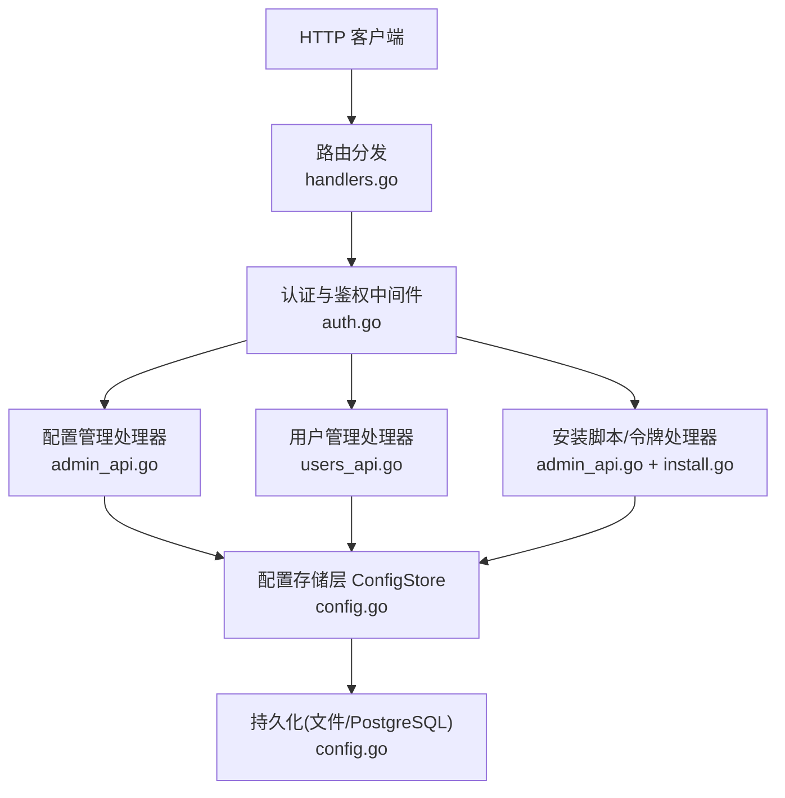
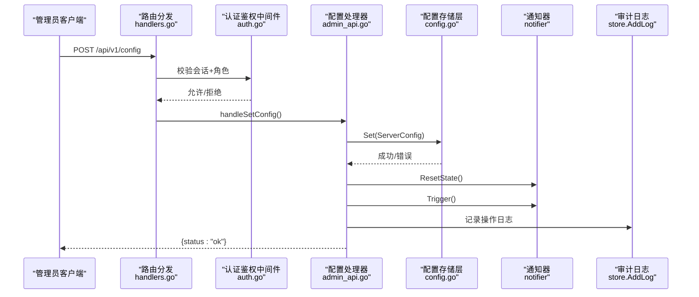
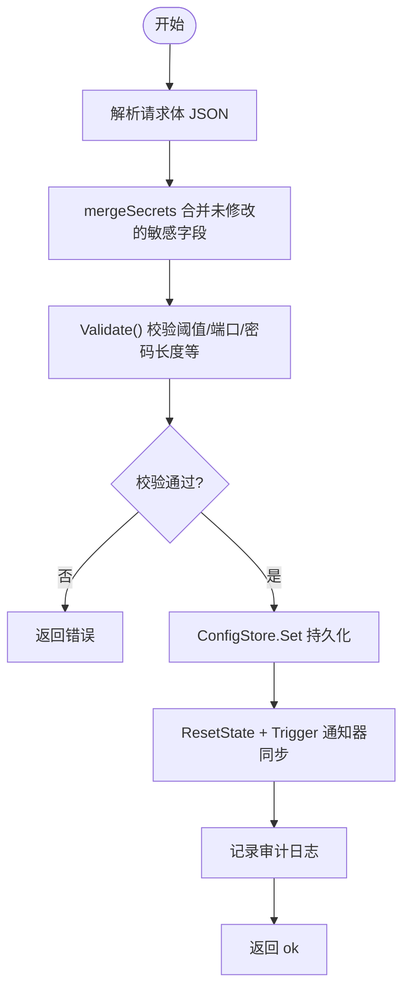
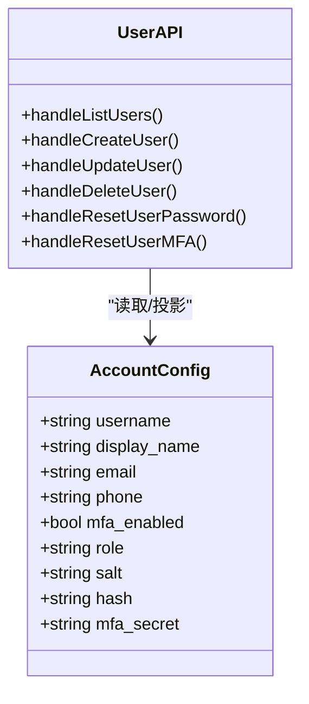
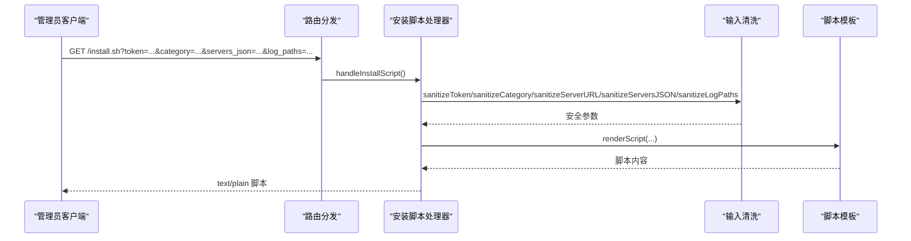
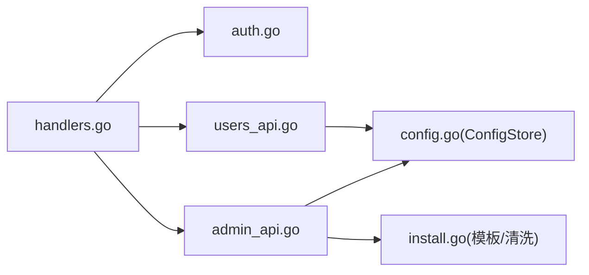

# 管理员管理 API

<cite>
**本文引用的文件**   
- [cmd/server/admin_api.go](file://cmd/server/admin_api.go)
- [cmd/server/config.go](file://cmd/server/config.go)
- [cmd/server/users_api.go](file://cmd/server/users_api.go)
- [cmd/server/install.go](file://cmd/server/install.go)
- [cmd/server/auth.go](file://cmd/server/auth.go)
- [cmd/server/handlers.go](file://cmd/server/handlers.go)
</cite>

## 目录
1. [简介](#简介)
2. [项目结构](#项目结构)
3. [核心组件](#核心组件)
4. [架构总览](#架构总览)
5. [详细组件分析](#详细组件分析)
6. [依赖关系分析](#依赖关系分析)
7. [性能与热更新](#性能与热更新)
8. [故障排查指南](#故障排查指南)
9. [结论](#结论)
10. [附录：配置结构与字段说明](#附录配置结构与字段说明)

## 简介
本文件面向系统管理员，系统化梳理“管理员管理 API”，覆盖以下能力：
- 配置获取/更新（含敏感信息脱敏、合并策略、校验与回滚）
- 用户管理（CRUD、密码重置、MFA 重置）
- 安装令牌管理与安装脚本生成（支持多服务端、日志路径注入、安全清洗）
- 批量操作与配置热更新
- 审计日志记录与权限控制（RBAC）

## 项目结构
管理员相关接口主要分布在以下文件：
- 路由注册与中间件：handlers.go、auth.go
- 配置管理：admin_api.go、config.go
- 用户管理：users_api.go
- 安装脚本与令牌：admin_api.go、install.go

图表来源
- [cmd/server/handlers.go:96-346](file://cmd/server/handlers.go#L96-L346)
- [cmd/server/auth.go:110-172](file://cmd/server/auth.go#L110-L172)
- [cmd/server/admin_api.go:11-174](file://cmd/server/admin_api.go#L11-L174)
- [cmd/server/users_api.go:1-140](file://cmd/server/users_api.go#L1-L140)
- [cmd/server/install.go:8-96](file://cmd/server/install.go#L8-L96)
- [cmd/server/config.go:533-600](file://cmd/server/config.go#L533-L600)

章节来源
- [cmd/server/handlers.go:96-346](file://cmd/server/handlers.go#L96-L346)
- [cmd/server/auth.go:110-172](file://cmd/server/auth.go#L110-L172)

## 核心组件
- 配置存储层 ConfigStore：提供线程安全的读写、默认值回填、环境变量覆盖、保存加密、回滚等。
- 配置处理器：负责获取/更新/测试配置，并在写入后触发通知器状态同步。
- 用户管理处理器：实现 RBAC 下的用户 CRUD、密码/MFA 重置。
- 安装脚本与令牌：提供安装信息、令牌轮换、平台安装脚本渲染与卸载脚本。

章节来源
- [cmd/server/config.go:533-600](file://cmd/server/config.go#L533-L600)
- [cmd/server/admin_api.go:11-174](file://cmd/server/admin_api.go#L11-L174)
- [cmd/server/users_api.go:1-140](file://cmd/server/users_api.go#L1-L140)
- [cmd/server/install.go:8-96](file://cmd/server/install.go#L8-L96)

## 架构总览
管理员 API 的请求链路如下：
- 请求进入路由分发，匹配到 /api/v1/config、/api/v1/users、/api/v1/install/* 等路径
- 通过认证与鉴权中间件（会话校验、RBAC、可选中继密钥校验）
- 调用对应处理器，读取/写入配置或执行安装脚本渲染
- 配置变更时触发通知器重同步并记录审计日志

图表来源
- [cmd/server/handlers.go:125-127](file://cmd/server/handlers.go#L125-L127)
- [cmd/server/auth.go:110-172](file://cmd/server/auth.go#L110-L172)
- [cmd/server/admin_api.go:45-62](file://cmd/server/admin_api.go#L45-L62)
- [cmd/server/config.go:949-1006](file://cmd/server/config.go#L949-L1006)

## 详细组件分析

### 配置管理 API
- 获取配置 GET /api/v1/config
  - 返回当前配置，但会进行敏感信息脱敏处理，包括 Webhook URL/Secret、SMTP 密码、SMS/VoiceCall 密钥、AI Key、DSN、InstallToken、RelaySecret、数据源密码、账户 Salt/Hash/MFASecret 等。
  - 不返回 Users 列表（该列表由 /api/v1/users 提供）。
- 更新配置 POST /api/v1/config
  - 解析请求体为 ServerConfig，使用 mergeSecrets 将未修改的敏感字段从现有配置中保留（避免前端未提交导致覆盖为空或被脱敏占位符污染）。
  - 调用 ConfigStore.Set 完成校验、回填默认阈值、保护关键开关与受管字段不被表单清零，然后持久化。
  - 成功后重置通知器状态并触发一次告警同步，确保新渠道立即生效。
  - 记录审计日志。
- 测试配置 POST /api/v1/config/test
  - 对传入的配置执行 SendTest，返回各渠道测试结果。
  - 记录审计日志。

图表来源
- [cmd/server/admin_api.go:45-77](file://cmd/server/admin_api.go#L45-L77)
- [cmd/server/config.go:504-531](file://cmd/server/config.go#L504-L531)
- [cmd/server/config.go:949-1006](file://cmd/server/config.go#L949-L1006)

章节来源
- [cmd/server/admin_api.go:11-77](file://cmd/server/admin_api.go#L11-L77)
- [cmd/server/config.go:504-531](file://cmd/server/config.go#L504-L531)
- [cmd/server/config.go:949-1006](file://cmd/server/config.go#L949-L1006)

### 用户管理 API（仅管理员）
- 列出用户 GET /api/v1/users
  - 返回用户列表的安全视图（不包含盐、哈希、MFA 密钥等）。
- 创建用户 POST /api/v1/users
  - 校验用户名格式、密码强度、角色合法性、邮箱格式；调用 CreateUser 并记录审计日志。
- 更新用户 POST /api/v1/users/{username}
  - 校验角色与邮箱；调用 UpdateUserMeta 并记录审计日志。
- 删除用户 DELETE /api/v1/users/{username}
  - 禁止删除自身；调用 DeleteUser，清理会话并记录审计日志。
- 重置用户密码 POST /api/v1/users/{username}/reset-password
  - 校验新密码强度；调用 SetUserPassword，清理会话并记录审计日志。
- 重置用户 MFA POST /api/v1/users/{username}/reset-mfa
  - 关闭 MFA 并记录审计日志。

图表来源
- [cmd/server/users_api.go:12-17](file://cmd/server/users_api.go#L12-L17)
- [cmd/server/users_api.go:19-140](file://cmd/server/users_api.go#L19-L140)
- [cmd/server/config.go:317-350](file://cmd/server/config.go#L317-L350)

章节来源
- [cmd/server/users_api.go:1-140](file://cmd/server/users_api.go#L1-L140)
- [cmd/server/config.go:317-350](file://cmd/server/config.go#L317-L350)

### 安装令牌与安装脚本
- 安装信息 GET /api/v1/install/info
  - 返回 server_url、token、require_token。
- 重置令牌 POST /api/v1/install/reset-token
  - 轮换 InstallToken，旧令牌在宽限期内仍有效，返回新令牌。
- 安装脚本 GET /install.sh | /install.ps1
  - 根据参数 token、category、servers_json、log_paths 渲染脚本，严格清洗输入防止命令注入。
  - 支持单服务端与多服务端推送（JSON 数组），以及日志采集路径注入。
- 网关中继安装脚本 GET /install-relay.sh | /install-relay.ps1
  - 以中继模式安装，监听本地端口并反向代理到上游服务器。
- 卸载脚本 GET /uninstall.sh | /uninstall.ps1
  - 静态模板，停止服务并清理相关文件。

图表来源
- [cmd/server/admin_api.go:79-151](file://cmd/server/admin_api.go#L79-L151)
- [cmd/server/install.go:8-96](file://cmd/server/install.go#L8-L96)
- [cmd/server/install.go:98-529](file://cmd/server/install.go#L98-L529)

章节来源
- [cmd/server/admin_api.go:79-151](file://cmd/server/admin_api.go#L79-L151)
- [cmd/server/install.go:8-96](file://cmd/server/install.go#L8-L96)
- [cmd/server/install.go:98-529](file://cmd/server/install.go#L98-L529)

### 权限与审计
- 权限模型（RBAC）
  - 用户管理端点仅管理员可访问；其他写操作需要 operator+；读操作 viewer+。
  - 全局 MFA 强制策略由管理员设置，影响登录后的受限会话。
- 审计日志
  - 配置更新、用户创建/更新/删除、密码重置、MFA 重置、令牌重置等操作均记录审计日志，包含操作者、IP、消息。

章节来源
- [cmd/server/auth.go:83-108](file://cmd/server/auth.go#L83-L108)
- [cmd/server/auth.go:110-172](file://cmd/server/auth.go#L110-L172)
- [cmd/server/admin_api.go:60-77](file://cmd/server/admin_api.go#L60-L77)
- [cmd/server/users_api.go:62-139](file://cmd/server/users_api.go#L62-L139)

## 依赖关系分析
- 路由与中间件
  - handlers.go 注册所有 API 路由，auth.go 提供认证与 RBAC 中间件。
- 配置存储层
  - config.go 提供 ConfigStore，封装并发安全、默认值回填、环境变量覆盖、保存加密、回滚等。
- 处理器
  - admin_api.go 与 users_api.go 分别处理配置与用户管理逻辑，依赖 ConfigStore 与审计日志。
- 安装脚本
  - install.go 提供模板与清洗函数，被 admin_api.go 的处理器调用。

图表来源
- [cmd/server/handlers.go:96-346](file://cmd/server/handlers.go#L96-L346)
- [cmd/server/auth.go:110-172](file://cmd/server/auth.go#L110-L172)
- [cmd/server/admin_api.go:11-174](file://cmd/server/admin_api.go#L11-L174)
- [cmd/server/users_api.go:1-140](file://cmd/server/users_api.go#L1-L140)
- [cmd/server/install.go:8-96](file://cmd/server/install.go#L8-L96)
- [cmd/server/config.go:533-600](file://cmd/server/config.go#L533-L600)

章节来源
- [cmd/server/handlers.go:96-346](file://cmd/server/handlers.go#L96-L346)
- [cmd/server/auth.go:110-172](file://cmd/server/auth.go#L110-L172)
- [cmd/server/admin_api.go:11-174](file://cmd/server/admin_api.go#L11-L174)
- [cmd/server/users_api.go:1-140](file://cmd/server/users_api.go#L1-L140)
- [cmd/server/install.go:8-96](file://cmd/server/install.go#L8-L96)
- [cmd/server/config.go:533-600](file://cmd/server/config.go#L533-L600)

## 性能与热更新
- 配置热更新
  - 更新配置后，处理器调用 notifier.ResetState() 与 notifier.Trigger()，使新配置的渠道立即生效，无需重启服务。
- 并发与一致性
  - ConfigStore 使用读写锁保证并发安全；Set 前快照 prev 支持 Revert 回滚。
- 阈值默认回填
  - backfillThresholdDefaults 自动修复缺失或零值的阈值，避免误报或漏报。

章节来源
- [cmd/server/admin_api.go:56-62](file://cmd/server/admin_api.go#L56-L62)
- [cmd/server/config.go:174-278](file://cmd/server/config.go#L174-L278)
- [cmd/server/config.go:949-1006](file://cmd/server/config.go#L949-L1006)

## 故障排查指南
- 配置更新失败
  - 检查 Validate 返回的错误信息（如阈值范围、SMTP 端口、密码长度等）。
  - 确认敏感字段是否被前端脱敏占位符污染，应使用 mergeSecrets 策略保留原值。
- 通知未生效
  - 确认处理器已调用 ResetState 与 Trigger；检查通知器状态与渠道连通性。
- 安装脚本注入风险
  - 确认使用了 sanitizeToken/sanitizeCategory/sanitizeServerURL/sanitizeServersJSON/sanitizeLogPaths 等清洗函数。
- 用户操作无权限
  - 检查 RBAC 中间件 routeAllowed 判定；确认当前用户角色是否为 admin。

章节来源
- [cmd/server/config.go:504-531](file://cmd/server/config.go#L504-L531)
- [cmd/server/admin_api.go:45-77](file://cmd/server/admin_api.go#L45-L77)
- [cmd/server/install.go:8-96](file://cmd/server/install.go#L8-L96)
- [cmd/server/auth.go:83-108](file://cmd/server/auth.go#L83-L108)

## 结论
管理员管理 API 围绕配置、用户与安装三大核心能力构建，具备完善的敏感信息脱敏、RBAC 权限控制、审计日志记录与配置热更新机制。通过严格的输入清洗与默认值回填，系统在易用性与安全性之间取得平衡，适合生产环境部署与管理。

## 附录：配置结构与字段说明
以下为 ServerConfig 及相关子结构的关键字段与行为要点（节选）：
- 通知渠道
  - feishu/dingtalk/custom_webhook/smtp/sms/voice_call：包含启用开关、连接参数与密钥；GET 时脱敏，POST 时若未提交则保留原值。
- 阈值 Thresholds
  - 大量 warn/crit 阈值，零值将被回填为默认值；Validate 限制百分比范围与离线超时为正数。
- 安装令牌
  - install_token、prev_install_token、prev_token_expires_at、require_token；ResetToken 支持轮换与宽限期。
- 账户与多用户
  - account 与 users 列表；account 的 salt/hash/mfa_secret 不会返回给浏览器；users 列表由专用接口提供。
- 功能开关与安全
  - terminal_disabled、forward_disabled、forward_listen、forward_port_range、allow_anonymous_agents、trust_proxy、mfa_required、cors_origins、relay_secret。
- 外部存储与 AI
  - vm、postgres_dsn、ai；ai 的 api_key/embed_api_key 在保存时若为空或脱敏则保留原值。

章节来源
- [cmd/server/config.go:407-489](file://cmd/server/config.go#L407-L489)
- [cmd/server/config.go:504-531](file://cmd/server/config.go#L504-L531)
- [cmd/server/config.go:811-851](file://cmd/server/config.go#L811-L851)
- [cmd/server/config.go:1224-1247](file://cmd/server/config.go#L1224-L1247)