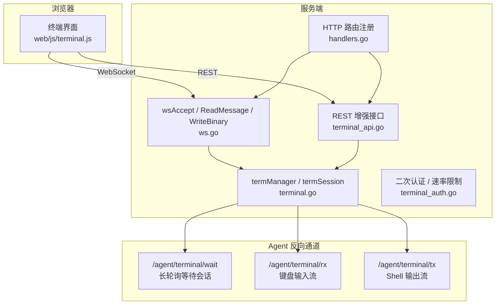
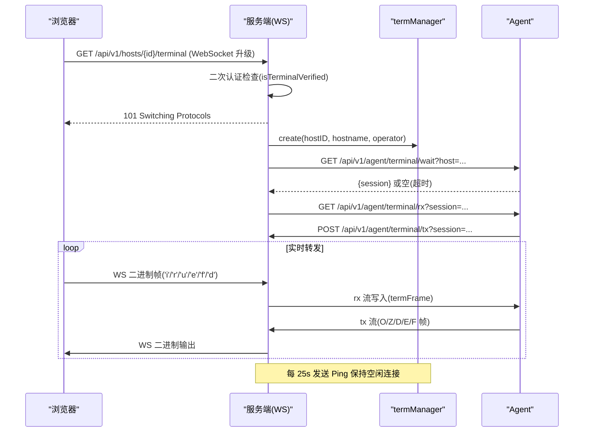
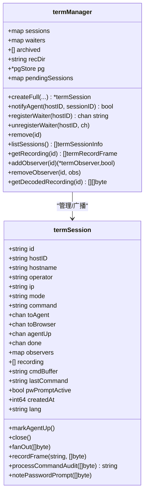
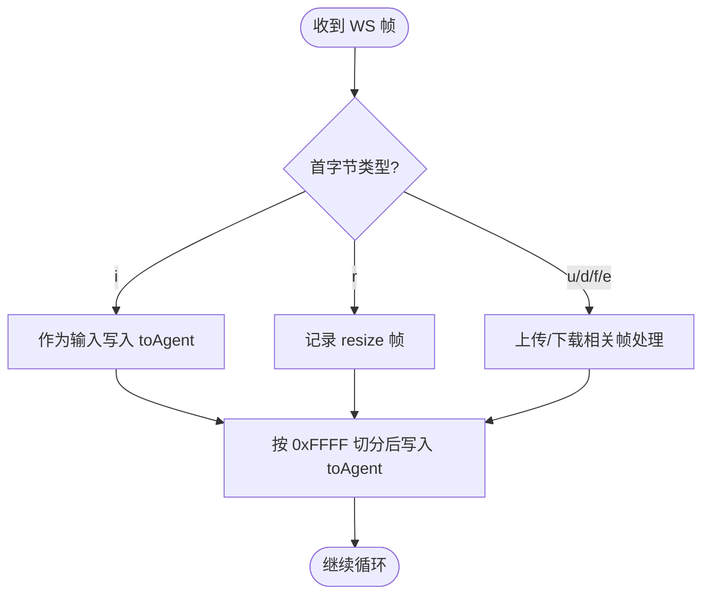
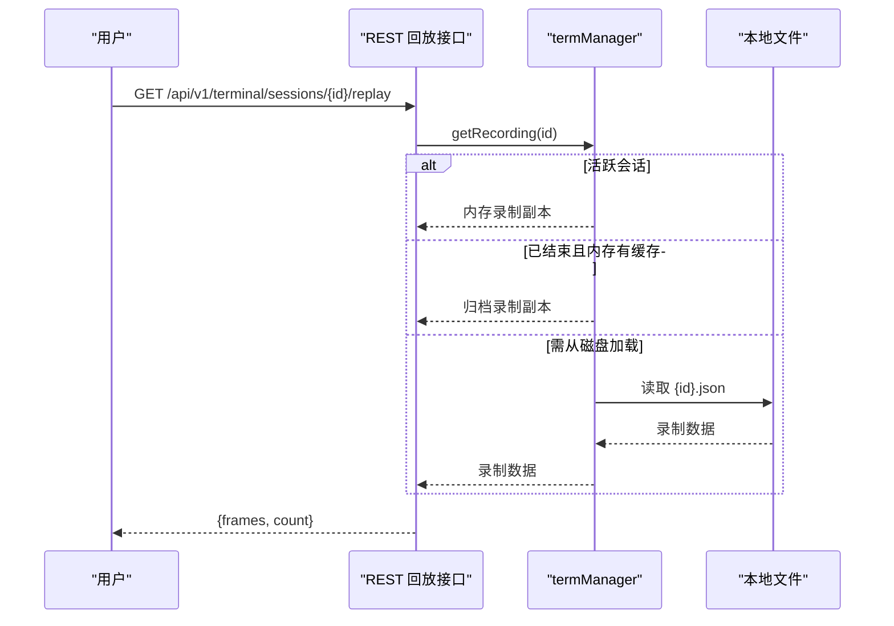
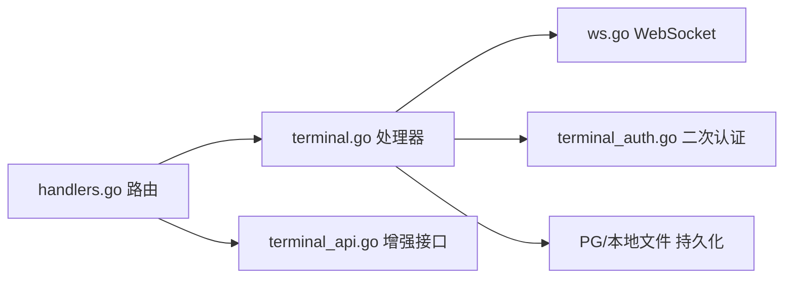

# 终端操作 API

<cite>
**本文引用的文件**   
- [cmd/server/terminal.go](file://cmd/server/terminal.go)
- [cmd/server/terminal_api.go](file://cmd/server/terminal_api.go)
- [cmd/server/terminal_auth.go](file://cmd/server/terminal_auth.go)
- [cmd/server/ws.go](file://cmd/server/ws.go)
- [cmd/server/handlers.go](file://cmd/server/handlers.go)
- [cmd/server/web/js/terminal.js](file://cmd/server/web/js/terminal.js)
</cite>

## 目录
1. [简介](#简介)
2. [项目结构](#项目结构)
3. [核心组件](#核心组件)
4. [架构总览](#架构总览)
5. [详细组件分析](#详细组件分析)
6. [依赖关系分析](#依赖关系分析)
7. [性能与并发特性](#性能与并发特性)
8. [故障排查指南](#故障排查指南)
9. [结论](#结论)
10. [附录：API 定义与消息格式](#附录api-定义与消息格式)

## 简介
本文件面向“终端操作”能力，覆盖浏览器到服务端 WebSocket 连接、命令执行、会话管理、录制回放、只读旁观、超时断开、权限控制、审计与并发限制等。该功能通过 Agent 反向通道建立，无需在 Agent 侧暴露入站端口；浏览器以 WebSocket 与服务端交互，服务端再以两条 HTTP 长轮询/流式通道与 Agent 通信（rx 下行输入、tx 上行输出）。

## 项目结构
与终端相关的后端实现集中在 server 模块中，前端交互逻辑位于 web/js/terminal.js。关键文件职责如下：
- terminal.go：终端会话模型、管理器、WebSocket 接入、Agent 双向通道、录制与归档、观察者模式、命令审计等
- terminal_api.go：增强型 REST 接口（会话列表、回放、旁观）
- terminal_auth.go：终端二次认证（协议同意、密码设置/校验、速率限制）
- ws.go：最小化 RFC 6455 WebSocket 实现（握手、帧读写、ping/pong/close）
- handlers.go：路由注册（包含终端相关路径）
- web/js/terminal.js：前端多标签终端、心跳保活、重连、右键菜单、二次认证流程等

图表来源
- [cmd/server/ws.go:38-70](file://cmd/server/ws.go#L38-L70)
- [cmd/server/terminal.go:438-617](file://cmd/server/terminal.go#L438-L617)
- [cmd/server/terminal_api.go:9-77](file://cmd/server/terminal_api.go#L9-L77)
- [cmd/server/handlers.go:96-110](file://cmd/server/handlers.go#L96-L110)

章节来源
- [cmd/server/handlers.go:96-110](file://cmd/server/handlers.go#L96-L110)

## 核心组件
- 终端会话模型 termSession：维护会话 ID、主机信息、操作者、输入/输出通道、观察者集合、录制缓冲、命令审计状态、语言偏好等
- 终端管理器 termManager：会话生命周期、通知 Agent、归档与持久化、回放数据读取、观察者管理、按主机查询会话
- WebSocket 层 wsConn：基于标准库的最小实现，支持文本/二进制帧、Ping/Pong、Close、分片重组
- 二次认证：协议同意 + 终端访问密码（强度校验、MFA/登录密码验证、失败次数限制）
- 增强 REST：会话列表、回放、旁观（只读 WebSocket）

章节来源
- [cmd/server/terminal.go:30-128](file://cmd/server/terminal.go#L30-L128)
- [cmd/server/terminal.go:234-285](file://cmd/server/terminal.go#L234-L285)
- [cmd/server/terminal.go:854-910](file://cmd/server/terminal.go#L854-L910)
- [cmd/server/terminal_api.go:9-77](file://cmd/server/terminal_api.go#L9-L77)
- [cmd/server/terminal_auth.go:17-40](file://cmd/server/terminal_auth.go#L17-L40)
- [cmd/server/ws.go:32-70](file://cmd/server/ws.go#L32-L70)

## 架构总览
终端采用“浏览器 ↔ 服务端 WebSocket ↔ 服务端 → Agent 两条 HTTP 流”的架构。服务端负责鉴权、会话编排、录制与旁观、命令审计、超时保护与保活。Agent 仅拨出，不暴露入站端口。

图表来源
- [cmd/server/handlers.go:106-109](file://cmd/server/handlers.go#L106-L109)
- [cmd/server/terminal.go:438-617](file://cmd/server/terminal.go#L438-L617)
- [cmd/server/terminal.go:619-735](file://cmd/server/terminal.go#L619-L735)
- [cmd/server/terminal.go:737-840](file://cmd/server/terminal.go#L737-L840)
- [cmd/server/ws.go:38-70](file://cmd/server/ws.go#L38-L70)

## 详细组件分析

### 终端会话与会话管理
- 会话创建：为每个浏览器打开的终端生成唯一 ID，记录操作者、主机名、客户端 IP、语言偏好，并加入活跃会话表
- 通知 Agent：优先投递到当前正在长轮询的 Agent；若无等待者则放入 pendingSessions，待下次 poll 立即取走，避免批量执行竞态
- 会话移除：归档录制（内存+本地文件），可选写入 PG 做永久审计留存；清理观察者、关闭 done 信号
- 会话列表：合并活跃会话、内存归档与 PG 历史，去重并按时间倒序返回
- 回放：从内存/归档/文件读取 frames，解码后返回给调用方
- 旁观：为活跃会话注册观察者，先推送已录制输出，再推送实时输出

图表来源
- [cmd/server/terminal.go:30-128](file://cmd/server/terminal.go#L30-L128)
- [cmd/server/terminal.go:234-285](file://cmd/server/terminal.go#L234-L285)
- [cmd/server/terminal.go:292-369](file://cmd/server/terminal.go#L292-L369)
- [cmd/server/terminal.go:371-415](file://cmd/server/terminal.go#L371-L415)
- [cmd/server/terminal.go:854-910](file://cmd/server/terminal.go#L854-L910)
- [cmd/server/terminal.go:912-945](file://cmd/server/terminal.go#L912-L945)
- [cmd/server/terminal.go:937-966](file://cmd/server/terminal.go#L937-L966)
- [cmd/server/terminal.go:1033-1045](file://cmd/server/terminal.go#L1033-L1045)

章节来源
- [cmd/server/terminal.go:234-285](file://cmd/server/terminal.go#L234-L285)
- [cmd/server/terminal.go:292-369](file://cmd/server/terminal.go#L292-L369)
- [cmd/server/terminal.go:371-415](file://cmd/server/terminal.go#L371-L415)
- [cmd/server/terminal.go:854-910](file://cmd/server/terminal.go#L854-L910)
- [cmd/server/terminal.go:912-945](file://cmd/server/terminal.go#L912-L945)
- [cmd/server/terminal.go:937-966](file://cmd/server/terminal.go#L937-L966)
- [cmd/server/terminal.go:1033-1045](file://cmd/server/terminal.go#L1033-L1045)

### WebSocket 连接与消息处理
- 握手：wsAccept 完成 RFC 6455 握手，返回可读写连接
- 读取：ReadMessage 自动应答 ping、处理 close、重组分片帧
- 写入：WriteBinary 用于原始 shell 输出；WritePing 用于保活
- 浏览器→服务端帧类型：首字节标识类型，后续 payload 为内容
  - 'i'：输入（键盘字符）
  - 'r'：终端尺寸调整（cols x rows）
  - 'u'：上传数据块
  - 'e'：上传结束
  - 'f'：上传元数据
  - 'd'：下载请求
- 服务端→Agent 帧：[type:1][len:2 BE][payload]，类型包括输入、resize、上传等
- 代理→服务端帧（tx）：[type:1][len:4 BE][payload]，类型包括 O（正常输出）、Z（ZMODEM 信号）、D（下载数据）、E（传输完成）、F（文件信息）

图表来源
- [cmd/server/terminal.go:510-579](file://cmd/server/terminal.go#L510-L579)
- [cmd/server/terminal.go:248-259](file://cmd/server/terminal.go#L248-L259)
- [cmd/server/terminal.go:737-840](file://cmd/server/terminal.go#L737-L840)
- [cmd/server/ws.go:72-97](file://cmd/server/ws.go#L72-L97)
- [cmd/server/ws.go:144-156](file://cmd/server/ws.go#L144-L156)

章节来源
- [cmd/server/terminal.go:510-579](file://cmd/server/terminal.go#L510-L579)
- [cmd/server/terminal.go:737-840](file://cmd/server/terminal.go#L737-L840)
- [cmd/server/ws.go:72-97](file://cmd/server/ws.go#L72-L97)
- [cmd/server/ws.go:144-156](file://cmd/server/ws.go#L144-L156)

### 会话录制、回放与旁观
- 录制：对输出帧进行时间戳与 base64 编码，单会话最多保留固定数量帧，防止内存膨胀
- 归档：会话结束时将录制写入本地 JSON 文件，并在内存索引中保留最近若干条
- 回放：优先内存，其次归档，最后本地文件；返回 frames 供前端重放
- 旁观：注册观察者，先回放历史输出，再订阅实时输出；观察者断开不影响主会话

图表来源
- [cmd/server/terminal_api.go:13-28](file://cmd/server/terminal_api.go#L13-L28)
- [cmd/server/terminal.go:155-187](file://cmd/server/terminal.go#L155-L187)
- [cmd/server/terminal.go:912-935](file://cmd/server/terminal.go#L912-L935)

章节来源
- [cmd/server/terminal_api.go:13-28](file://cmd/server/terminal_api.go#L13-L28)
- [cmd/server/terminal.go:155-187](file://cmd/server/terminal.go#L155-L187)
- [cmd/server/terminal.go:912-935](file://cmd/server/terminal.go#L912-L935)

### 只读旁观模式
- 入口：GET /api/v1/terminal/sessions/{id}/observe
- 前置条件：启用终端、二次认证通过
- 行为：注册观察者，先推送已录制输出，再推送实时输出；观察者退出即取消订阅

章节来源
- [cmd/server/terminal_api.go:30-77](file://cmd/server/terminal_api.go#L30-L77)
- [cmd/server/terminal.go:937-966](file://cmd/server/terminal.go#L937-L966)

### 超时断开与保活
- 等待 Agent 超时：若 Agent 未在限定时间内接入，向浏览器提示并关闭会话
- 保活：服务端每 25s 发送 Ping，浏览器自动 Pong，避免被代理/NAT 回收空闲连接
- 前端心跳：使用 Web Worker 定期发送无负载输入帧，绕过后台 Tab 节流

章节来源
- [cmd/server/terminal.go:496-508](file://cmd/server/terminal.go#L496-L508)
- [cmd/server/terminal.go:597-615](file://cmd/server/terminal.go#L597-L615)
- [cmd/server/web/js/terminal.js:6-50](file://cmd/server/web/js/terminal.js#L6-L50)

### 安全机制与权限控制
- 二次认证：
  - 协议同意：首次使用前需阅读并同意免责声明
  - 终端访问密码：独立于登录密码，要求长度≥8 且含大小写、数字、特殊字符
  - 每次登录后首次访问终端前需校验密码，成功后在当前会话内缓存
  - 修改已有密码时，若开启 MFA 需校验 TOTP，否则校验登录密码
  - 校验失败计数与锁定策略，超限返回重试间隔
- 会话级鉴权：
  - 浏览器侧：进入终端前强制二次认证检查
  - Agent 侧：通过主机指纹（注册时绑定）校验，非安装令牌
- 审计：
  - 打开/关闭终端均记录操作日志
  - 解析完整命令行并脱敏敏感参数后记录终端审计日志
  - 密码提示后的下一行输入跳过审计，避免密码落盘
- 并发限制：
  - 终端密码校验具备速率限制与锁定
  - 回放/旁观同样需要二次认证，防止未授权旁听

章节来源
- [cmd/server/terminal_auth.go:17-40](file://cmd/server/terminal_auth.go#L17-L40)
- [cmd/server/terminal_auth.go:66-122](file://cmd/server/terminal_auth.go#L66-L122)
- [cmd/server/terminal_auth.go:124-172](file://cmd/server/terminal_auth.go#L124-L172)
- [cmd/server/terminal.go:438-465](file://cmd/server/terminal.go#L438-L465)
- [cmd/server/terminal.go:417-436](file://cmd/server/terminal.go#L417-L436)
- [cmd/server/terminal.go:486-494](file://cmd/server/terminal.go#L486-L494)
- [cmd/server/terminal.go:549-553](file://cmd/server/terminal.go#L549-L553)
- [cmd/server/terminal.go:968-1031](file://cmd/server/terminal.go#L968-L1031)

## 依赖关系分析
- 路由注册：handlers.go 将所有终端相关路径挂载至 ServeMux
- 会话管理：terminal.go 中的 termManager 集中管理会话、等待队列、归档与持久化
- WebSocket：ws.go 提供最小实现，服务于终端数据面
- 二次认证：terminal_auth.go 提供密码设置/校验/状态查询
- 增强接口：terminal_api.go 提供会话列表、回放、旁观

图表来源
- [cmd/server/handlers.go:96-110](file://cmd/server/handlers.go#L96-L110)
- [cmd/server/terminal.go:438-617](file://cmd/server/terminal.go#L438-L617)
- [cmd/server/terminal_api.go:9-77](file://cmd/server/terminal_api.go#L9-L77)
- [cmd/server/terminal_auth.go:17-40](file://cmd/server/terminal_auth.go#L17-L40)
- [cmd/server/ws.go:38-70](file://cmd/server/ws.go#L38-L70)

章节来源
- [cmd/server/handlers.go:96-110](file://cmd/server/handlers.go#L96-L110)

## 性能与并发特性
- 大帧切分：浏览器→Agent 的输入/上传帧超过 0xFFFF 会被切分为多个同类型帧，避免静默截断
- 输出限速与回压：toBrowser 通道容量较大，结合 fanOut 非阻塞广播，慢观察者丢弃而非阻塞主路
- 录制上限：单会话录制帧数上限，防止无限增长
- 归档容量：内存归档条目上限，超出则淘汰最旧项
- 保活：25s Ping 降低空闲连接被回收概率
- 并发：termManager 内部使用互斥锁保护共享数据结构，确保并发安全

章节来源
- [cmd/server/terminal.go:558-577](file://cmd/server/terminal.go#L558-L577)
- [cmd/server/terminal.go:68-80](file://cmd/server/terminal.go#L68-L80)
- [cmd/server/terminal.go:95-107](file://cmd/server/terminal.go#L95-L107)
- [cmd/server/terminal.go:130-146](file://cmd/server/terminal.go#L130-L146)
- [cmd/server/terminal.go:597-615](file://cmd/server/terminal.go#L597-L615)

## 故障排查指南
- 无法建立终端通道
  - 现象：提示无可用反向通道或超时
  - 可能原因：Agent 版本过旧、主机指纹不可用、Agent 离线
  - 建议：升级 Agent、确认主机指纹采集成功、检查网络连通性
- 连接频繁断开
  - 现象：长时间空闲后断开
  - 可能原因：代理/NAT 回收空闲连接
  - 建议：确认服务端 Ping 生效，前端 Worker 心跳运行正常
- 旁观/回放无数据
  - 现象：回放为空或找不到会话
  - 可能原因：会话已结束且归档未持久化、文件缺失
  - 建议：检查本地录制目录与权限，确认归档是否写入成功
- 二次认证失败
  - 现象：提示需要设置/验证终端密码或锁定
  - 可能原因：密码不符合强度要求、错误次数过多
  - 建议：按提示设置强密码，等待锁定解除后再试

章节来源
- [cmd/server/terminal.go:492-508](file://cmd/server/terminal.go#L492-L508)
- [cmd/server/terminal.go:155-187](file://cmd/server/terminal.go#L155-L187)
- [cmd/server/terminal_auth.go:124-172](file://cmd/server/terminal_auth.go#L124-L172)

## 结论
终端操作 API 通过严格的二次认证、细粒度审计、健壮的会话管理与录制回放能力，提供了安全可控的远程 Shell 体验。其“浏览器 WebSocket + 两条 Agent 反向 HTTP 流”的架构在保证安全的同时实现了低侵入部署。配合旁观模式与回放能力，便于协作与事后复盘。

## 附录：API 定义与消息格式

### 路由与用途
- GET /api/user/terminal-password/status：查询当前用户是否已设置终端密码及本次会话是否已通过二次认证
- POST /api/user/terminal-password/set：设置或修改终端访问密码（首次设置无需二次因子；修改时根据配置要求 MFA 或登录密码）
- POST /api/user/terminal-password/verify：校验终端访问密码，通过后在当前会话内标记已验证
- GET /api/v1/hosts/{id}/terminal：浏览器侧 WebSocket 终端接入点（需二次认证）
- GET /api/v1/agent/terminal/wait：Agent 侧长轮询等待新会话
- GET /api/v1/agent/terminal/rx：Agent 侧接收键盘输入流
- POST /api/v1/agent/terminal/tx：Agent 侧上报 Shell 输出流
- GET /api/v1/terminal/sessions：列出活跃与已结束会话（含元数据）
- GET /api/v1/terminal/sessions/{id}/replay：回放指定会话的录制帧
- GET /api/v1/terminal/sessions/{id}/observe：旁观某活跃会话（只读 WebSocket）

章节来源
- [cmd/server/handlers.go:101-109](file://cmd/server/handlers.go#L101-L109)
- [cmd/server/handlers.go:239-242](file://cmd/server/handlers.go#L239-L242)
- [cmd/server/terminal_api.go:9-77](file://cmd/server/terminal_api.go#L9-L77)
- [cmd/server/terminal_auth.go:50-172](file://cmd/server/terminal_auth.go#L50-L172)

### 浏览器→服务端 WebSocket 帧
- 格式：首字节为类型，剩余为 payload
- 类型
  - i：输入（键盘字符）
  - r：终端尺寸调整（payload 为 cols×rows 字符串）
  - u：上传数据块
  - e：上传结束
  - f：上传元数据
  - d：下载请求

章节来源
- [cmd/server/terminal.go:510-579](file://cmd/server/terminal.go#L510-L579)

### 服务端→Agent 帧（rx）
- 格式：[type:1][len:2 BE][payload]
- 类型：输入、resize、上传等

章节来源
- [cmd/server/terminal.go:248-259](file://cmd/server/terminal.go#L248-L259)

### Agent→服务端帧（tx）
- 格式：[type:1][len:4 BE][payload]
- 类型
  - O：普通 PTY 输出
  - Z：ZMODEM 信号
  - D：下载数据块
  - E：传输完成
  - F：文件信息

章节来源
- [cmd/server/terminal.go:737-840](file://cmd/server/terminal.go#L737-L840)

### 录制帧结构
- 字段：ts（毫秒时间戳）、type（input/output/resize）、data（base64 编码的原始字节）
- 回放接口返回 frames 数组与总数

章节来源
- [cmd/server/terminal.go:82-87](file://cmd/server/terminal.go#L82-L87)
- [cmd/server/terminal_api.go:13-28](file://cmd/server/terminal_api.go#L13-L28)