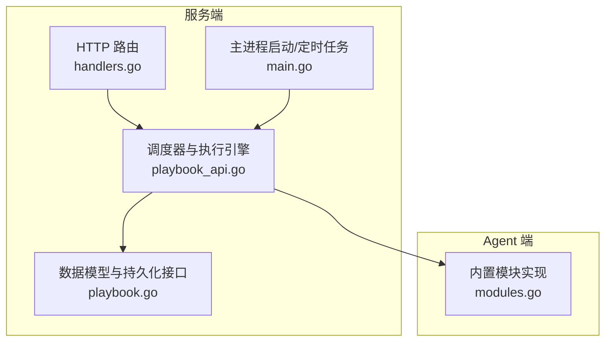
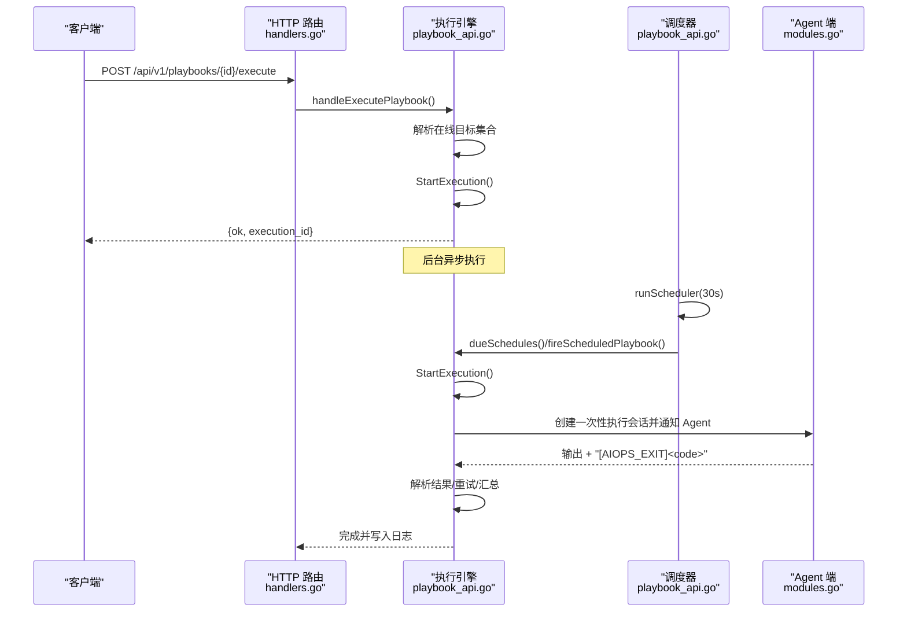
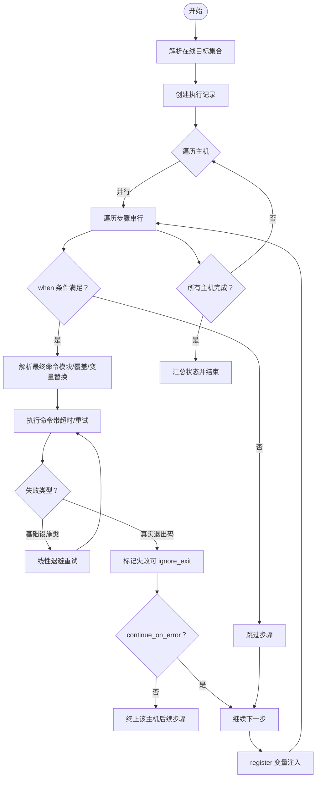
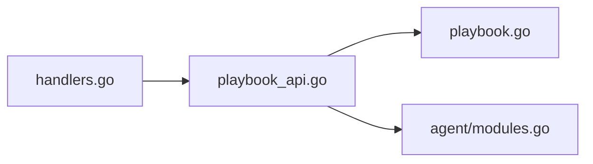

# 自动化编排 API

<cite>
**本文引用的文件**   
- [playbook.go](file://cmd/server/playbook.go)
- [playbook_api.go](file://cmd/server/playbook_api.go)
- [handlers.go](file://cmd/server/handlers.go)
- [main.go](file://cmd/server/main.go)
- [README.md](file://README.md)
- [modules.go](file://cmd/agent/modules.go)
- [modules_test.go](file://cmd/agent/modules_test.go)
</cite>

## 目录
1. [简介](#简介)
2. [项目结构](#项目结构)
3. [核心组件](#核心组件)
4. [架构总览](#架构总览)
5. [详细组件分析](#详细组件分析)
6. [依赖关系分析](#依赖关系分析)
7. [性能与并发控制](#性能与并发控制)
8. [故障排查指南](#故障排查指南)
9. [结论](#结论)
10. [附录：API 参考](#附录api-参考)

## 简介
本文件面向“自动化编排”能力，聚焦于剧本（Playbook）管理、任务调度、自动修复联动等企业级特性。内容涵盖：
- 剧本定义格式、执行条件配置、依赖关系管理
- 创建、触发执行、状态监控、结果查看的完整流程
- 批量命令执行、条件判断、错误处理等高级功能
- 执行审计、回滚机制、并发控制等企业级特性说明与实践建议

## 项目结构
自动化编排相关代码主要位于服务端模块中，包含数据模型、调度器、执行引擎与 HTTP API 路由；Agent 侧提供内置模块支持（如 gather_facts、service、package、copy），通过统一封套协议在服务端解析并下发。

图表来源
- [handlers.go:170-180](file://cmd/server/handlers.go#L170-L180)
- [playbook_api.go:160-188](file://cmd/server/playbook_api.go#L160-L188)
- [playbook.go:10-52](file://cmd/server/playbook.go#L10-L52)
- [main.go:288-289](file://cmd/server/main.go#L288-L289)
- [modules.go:35-41](file://cmd/agent/modules.go#L35-L41)

章节来源
- [handlers.go:170-180](file://cmd/server/handlers.go#L170-L180)
- [playbook_api.go:160-188](file://cmd/server/playbook_api.go#L160-L188)
- [playbook.go:10-52](file://cmd/server/playbook.go#L10-L52)
- [main.go:288-289](file://cmd/server/main.go#L288-L289)
- [modules.go:35-41](file://cmd/agent/modules.go#L35-L41)

## 核心组件
- 数据模型
  - Playbook：包含 ID、名称、描述、步骤列表、可选定时计划、时间戳
  - PlaybookStep：单步命令或内置模块调用，含目标选择、超时、失败策略、变量注册、条件判断
  - PlaybookSchedule：interval/daily/weekly 三种触发模式
  - PlaybookExecution/HostExecResult/StepResult：执行记录与主机/步骤级结果
- 管理器
  - playbookManager：内存中的剧本与执行历史管理，提供增删改查、执行生命周期、调度去重与并发保护
- 执行引擎
  - runPlaybookExecution：按主机并行、按步骤顺序执行；支持 when 条件、register 变量传递、ignore_exit、continue_on_error
  - execCommandOnHost：通过 Agent 反向通道一次性执行命令，带采集输出、退出码标记、超时与重试分类
- 调度器
  - runScheduler：每 30s 扫描一次，根据 interval/daily/weekly 规则触发到期的剧本，避免重复与堆积
- 内置模块
  - gather_facts/service/package/copy：以封套命令形式由服务端构建，Agent 端识别并执行

章节来源
- [playbook.go:10-52](file://cmd/server/playbook.go#L10-L52)
- [playbook.go:82-100](file://cmd/server/playbook.go#L82-L100)
- [playbook_api.go:206-312](file://cmd/server/playbook_api.go#L206-L312)
- [playbook_api.go:339-397](file://cmd/server/playbook_api.go#L339-L397)
- [playbook_api.go:160-188](file://cmd/server/playbook_api.go#L160-L188)
- [modules.go:35-41](file://cmd/agent/modules.go#L35-L41)

## 架构总览
自动化编排的整体交互如下：
- 用户通过 REST API 创建/更新/删除剧本，或触发执行
- 服务端维护内存中的执行历史（最近 100 条），并提供查询接口
- 定时调度器周期性扫描到期任务，构造执行上下文并异步执行
- 执行引擎对每台目标主机并行执行，逐步骤串行运行，收集输出与退出码
- Agent 通过反向通道接收一次性执行会话，返回合并输出与退出码标记

图表来源
- [handlers.go:176-179](file://cmd/server/handlers.go#L176-L179)
- [playbook_api.go:117-134](file://cmd/server/playbook_api.go#L117-L134)
- [playbook_api.go:160-188](file://cmd/server/playbook_api.go#L160-L188)
- [playbook_api.go:339-397](file://cmd/server/playbook_api.go#L339-L397)
- [modules.go:35-41](file://cmd/agent/modules.go#L35-L41)

## 详细组件分析

### 数据模型与字段语义
- Playbook
  - id/name/description：标识与元信息
  - steps：步骤数组
  - schedule：可选定时计划（enabled/kind/interval_min/at/weekday）
  - created_at/updated_at：时间戳
- PlaybookStep
  - name/command/command_win/command_mac/target/timeout_sec/continue_on_error/ignore_exit/register/when/module/args
  - target 支持 all/category:xxx/system:os/host:ID
  - module 为内置模块名（gather_facts/service/package/copy），非空时忽略 command 字段
- PlaybookSchedule
  - kind=interval：interval_min≥1
  - kind=daily：at="HH:MM"
  - kind=weekly：weekday(0=Sun..6=Sat)+at="HH:MM"
- 执行记录
  - PlaybookExecution：全局执行 ID、操作者、起止时间、总体状态
  - HostExecResult：主机维度状态与步骤明细
  - StepResult：步骤名、状态、输出、耗时

章节来源
- [playbook.go:10-52](file://cmd/server/playbook.go#L10-L52)
- [playbook.go:54-80](file://cmd/server/playbook.go#L54-L80)
- [playbook.go:22-33](file://cmd/server/playbook.go#L22-L33)

### 目标选择与依赖关系
- 目标解析
  - ResolveTargets 将 step.target 展开为在线主机集合
  - category 匹配使用“有效分类”，优先采用管理员覆盖值，避免被不可信 Agent 上报的分类误导
  - system 匹配基于运行时 OS（linux/windows/darwin），macos 映射到 darwin
- 依赖关系管理
  - 当前版本未提供显式步骤间依赖图；可通过 register 变量与 when 条件实现逻辑依赖
  - 跨步骤变量通过 register 注入 vars，后续步骤在 when 或命令中引用 {{变量}}

章节来源
- [playbook.go:255-304](file://cmd/server/playbook.go#L255-L304)
- [playbook_api.go:18-35](file://cmd/server/playbook_api.go#L18-L35)
- [playbook_api.go:37-51](file://cmd/server/playbook_api.go#L37-L51)

### 执行条件与变量系统
- 变量预置
  - playbookHostVars 提供 host_id/hostname/ip/os/category 等事实
- 变量替换
  - substitutePlaybookVars 支持 {{name}} 语法，未知变量替换为空串
- 条件判断
  - evalPlaybookWhen 支持 a==b/a!=b 与真值判定（空/false/0/no/off 为假）
- 变量传播
  - register 将某步输出存入 vars，供后续步骤引用

章节来源
- [playbook_api.go:18-35](file://cmd/server/playbook_api.go#L18-L35)
- [playbook_api.go:37-51](file://cmd/server/playbook_api.go#L37-L51)
- [playbook_api.go:53-71](file://cmd/server/playbook_api.go#L53-L71)

### 内置模块与命令解析
- 模块封套
  - buildModuleCommand 将模块调用编码为 __AIOPS_MODULE__ {"module":"...","args":{...}}
- 命令解析优先级
  - 模块 > 分系统覆盖（command_win/command_mac）> 默认命令
  - 最终进行 {{变量}} 替换
- 内置模块
  - gather_facts/service/package/copy（Agent 端实现）

章节来源
- [playbook_api.go:73-85](file://cmd/server/playbook_api.go#L73-L85)
- [playbook_api.go:53-71](file://cmd/server/playbook_api.go#L53-L71)
- [modules.go:35-41](file://cmd/agent/modules.go#L35-L41)

### 执行流程与错误处理
- 执行入口
  - handleExecutePlaybook 校验存在性、计算在线目标、创建执行记录并异步执行
- 并行与顺序
  - 主机间并行（受并发上限限制），主机内步骤串行
- 重试与分类
  - 基础设施类失败（无拾取/超时/异常结束）可重试；真实非零退出码不重试
  - 线性退避与最大尝试次数
- 结果聚合
  - 所有主机完成后汇总整体状态（completed/failed）

图表来源
- [playbook_api.go:117-134](file://cmd/server/playbook_api.go#L117-L134)
- [playbook_api.go:206-312](file://cmd/server/playbook_api.go#L206-L312)
- [playbook_api.go:339-397](file://cmd/server/playbook_api.go#L339-L397)

章节来源
- [playbook_api.go:117-134](file://cmd/server/playbook_api.go#L117-L134)
- [playbook_api.go:206-312](file://cmd/server/playbook_api.go#L206-L312)
- [playbook_api.go:339-397](file://cmd/server/playbook_api.go#L339-L397)

### 定时调度与去重
- 调度周期
  - 每 30 秒扫描一次
- 触发规则
  - interval：相对上次运行时间间隔
  - daily/weekly：基于服务器本地时间的 HH:MM 窗口
- 去重与防堆积
  - lastRun 记录上次触发时间
  - schedBusy 防止同一剧本同时多次运行
  - clearSchedBusy 在执行结束后释放

章节来源
- [playbook_api.go:160-188](file://cmd/server/playbook_api.go#L160-L188)
- [playbook.go:151-198](file://cmd/server/playbook.go#L151-L198)
- [main.go:288-289](file://cmd/server/main.go#L288-L289)

### 执行审计与日志
- 关键操作均写入操作日志（保存/删除/执行/完成等）
- 执行历史保留最近 100 条，支持分页查询与详情查看

章节来源
- [playbook_api.go:106-114](file://cmd/server/playbook_api.go#L106-L114)
- [playbook_api.go:131-134](file://cmd/server/playbook_api.go#L131-L134)
- [playbook.go:306-342](file://cmd/server/playbook.go#L306-L342)

### 自动修复联动
- 自动修复规则可在事件驱动下触发剧本执行（审批通过后）
- 通过统一的执行引擎复用幂等性与重试机制

章节来源
- [README.md:1232-1238](file://README.md#L1232-L1238)

## 依赖关系分析
- 路由层
  - handlers.go 将 /api/v1/playbooks/* 映射到具体处理器
- 业务层
  - playbook_api.go 实现调度、执行、结果聚合
- 数据层
  - playbook.go 提供数据结构与内存管理（执行历史持久化由上层存储负责）
- 外部依赖
  - Agent 内置模块通过封套协议协作

图表来源
- [handlers.go:174-179](file://cmd/server/handlers.go#L174-L179)
- [playbook_api.go:160-188](file://cmd/server/playbook_api.go#L160-L188)
- [playbook.go:82-100](file://cmd/server/playbook.go#L82-L100)
- [modules.go:35-41](file://cmd/agent/modules.go#L35-L41)

章节来源
- [handlers.go:174-179](file://cmd/server/handlers.go#L174-L179)
- [playbook_api.go:160-188](file://cmd/server/playbook_api.go#L160-L188)
- [playbook.go:82-100](file://cmd/server/playbook.go#L82-L100)
- [modules.go:35-41](file://cmd/agent/modules.go#L35-L41)

## 性能与并发控制
- 并发上限
  - 主机级并发上限（默认 30），避免大规模集群“惊群”效应
- 重试策略
  - 仅基础设施类失败重试，真实命令失败不重试
  - 线性退避（attempt × 2s），最多 3 次尝试
- 资源保护
  - 单次执行输出上限（约 512KB），防止大输出阻塞
- 调度开销
  - 30s 轮询，最小化 CPU 占用

章节来源
- [playbook_api.go:201-204](file://cmd/server/playbook_api.go#L201-L204)
- [playbook_api.go:246-262](file://cmd/server/playbook_api.go#L246-L262)
- [playbook_api.go:376-379](file://cmd/server/playbook_api.go#L376-L379)

## 故障排查指南
- 常见问题定位
  - 无目标主机：检查主机在线状态与离线阈值
  - 无 Agent 拾取：确认 Agent 长轮询正常，关注 no-pickup 重试
  - 超时：适当增大 timeout_sec，或拆分复杂命令
  - 退出码非零：结合 ignore_exit 与 continue_on_error 调整策略
- 诊断手段
  - 查看执行历史与主机/步骤级输出
  - 利用 gather_facts 获取主机事实，辅助 when 条件设计
  - 使用内置模块简化服务/包/文件操作

章节来源
- [playbook_api.go:139-159](file://cmd/server/playbook_api.go#L139-L159)
- [playbook_api.go:339-397](file://cmd/server/playbook_api.go#L339-L397)
- [modules_test.go:10-21](file://cmd/agent/modules_test.go#L10-L21)

## 结论
自动化编排 API 提供了轻量但强大的批量执行能力：
- 清晰的剧本定义与灵活的执行条件
- 可靠的调度与重试机制
- 完善的执行审计与结果可视化
- 与自动修复、事件闭环无缝衔接

在生产环境中，建议结合 RBAC 与审批流，谨慎使用 write 操作，并通过 register+when 实现可控的依赖关系。

## 附录：API 参考
- 剧本管理
  - GET /api/v1/playbooks
  - POST /api/v1/playbooks
  - DELETE /api/v1/playbooks/{id}
- 执行与历史
  - POST /api/v1/playbooks/{id}/execute
  - GET /api/v1/playbooks/executions
  - GET /api/v1/playbooks/executions/{id}

章节来源
- [README.md:1152-1157](file://README.md#L1152-L1157)
- [handlers.go:174-179](file://cmd/server/handlers.go#L174-L179)