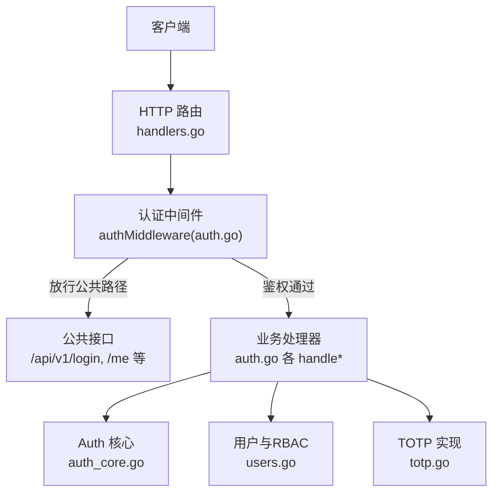
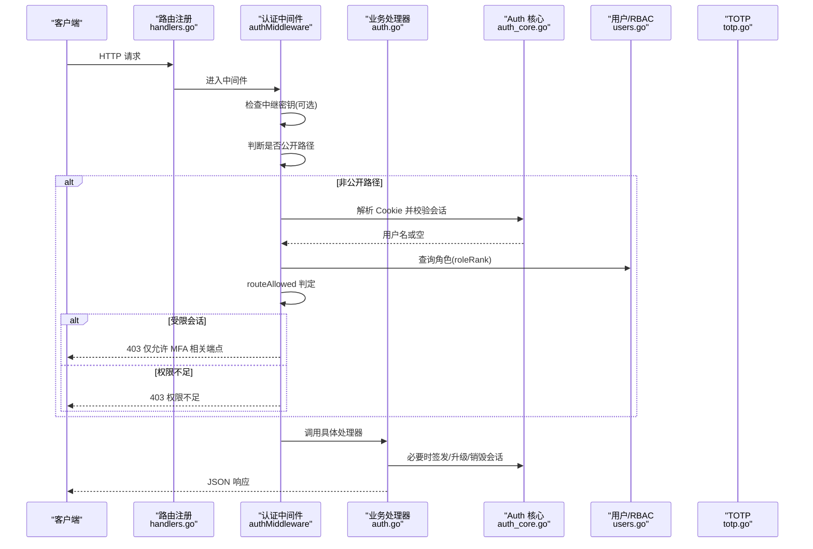
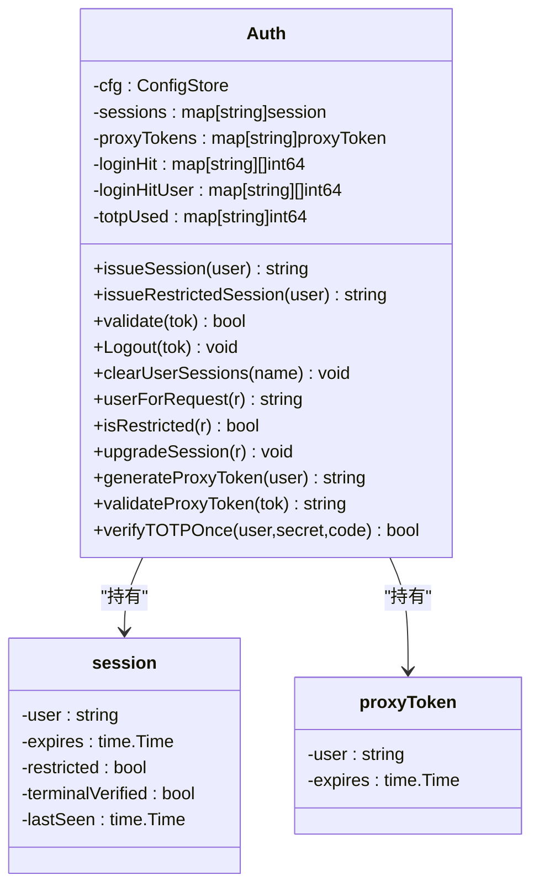
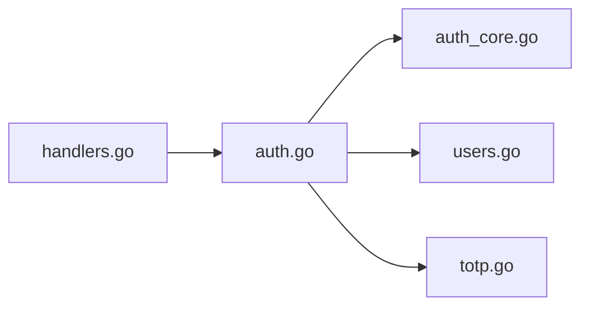

# 认证授权 API

<cite>
**本文引用的文件**   
- [auth.go](file://cmd/server/auth.go)
- [auth_core.go](file://cmd/server/auth_core.go)
- [totp.go](file://cmd/server/totp.go)
- [users.go](file://cmd/server/users.go)
- [handlers.go](file://cmd/server/handlers.go)
</cite>

## 更新摘要
**所做更改**   
- 密码哈希算法从单轮 SHA-256 升级到 PBKDF2-HMAC-SHA256（60万次迭代）
- 实现向后兼容机制，自动迁移旧格式哈希
- 增强会话管理机制，添加滑动空闲超时和受限会话功能
- 实施 TOTP 一次性验证防止重放攻击
- 新增账号维度登录限流保护分布式暴力破解
- 完善终端二次验证和代理令牌安全机制

## 目录
1. [简介](#简介)
2. [项目结构](#项目结构)
3. [核心组件](#核心组件)
4. [架构总览](#架构总览)
5. [详细组件分析](#详细组件分析)
6. [依赖关系分析](#依赖关系分析)
7. [性能与安全考量](#性能与安全考量)
8. [故障排查指南](#故障排查指南)
9. [结论](#结论)
10. [附录：API 规范与示例](#附录api-规范与示例)

## 简介
本文件面向使用 AIOps Monitor 服务端 RESTful 接口的开发者与集成方，系统化说明认证、授权与会话管理相关能力，包括：
- 用户登录/登出、获取当前用户信息、修改个人资料与密码
- MFA（TOTP）两步验证的启用、禁用与全局策略
- RBAC 权限模型与路由级访问控制
- 会话机制（基于 Cookie 的会话令牌）、滑动空闲超时与受限会话
- 错误码与典型场景响应示例

注意：本项目未采用 JWT Token。认证采用"随机会话令牌 + HttpOnly Cookie"的会话机制；MFA 采用 TOTP（RFC 6238）。

## 项目结构
与认证授权相关的核心代码位于 cmd/server 目录下：
- handlers.go：HTTP 路由注册与通用响应工具
- auth.go：认证中间件、登录/登出、资料与密码、MFA 端点实现
- auth_core.go：会话管理、限流、PBKDF2 密码哈希、代理令牌等
- totp.go：TOTP 算法与二维码生成辅助
- users.go：多用户与 RBAC 角色定义及配置存储访问

图表来源
- [handlers.go:100-145](file://cmd/server/handlers.go#L100-L145)
- [auth.go:110-172](file://cmd/server/auth.go#L110-L172)
- [auth_core.go:107-180](file://cmd/server/auth_core.go#L107-L180)
- [users.go:19-41](file://cmd/server/users.go#L19-L41)
- [totp.go:16-24](file://cmd/server/totp.go#L16-L24)

章节来源
- [handlers.go:100-145](file://cmd/server/handlers.go#L100-L145)
- [auth.go:110-172](file://cmd/server/auth.go#L110-L172)

## 核心组件
- 认证中间件 authMiddleware：统一拦截非公开路径，校验中继密钥（可选）、会话 Cookie、受限会话策略与 RBAC 路由权限。
- 会话管理 Auth：维护内存中的会话表（支持持久化导入导出），提供签发、校验、注销、按用户清理、受限会话与升级等功能；内置 IP 与账号维度的登录失败限流。
- **密码哈希**：**PBKDF2-HMAC-SHA256（60万次迭代）**，兼容旧版单轮 SHA-256 并自动升级。
- **MFA（TOTP）**：RFC 6238 兼容，6 位验证码，30 秒时间步长，支持 ±1 步时钟偏差容忍与**一次性校验防重放**。
- RBAC：三种角色 admin/operator/viewer，路由级最小权限控制。

章节来源
- [auth.go:110-172](file://cmd/server/auth.go#L110-L172)
- [auth_core.go:107-180](file://cmd/server/auth_core.go#L107-L180)
- [auth_core.go:22-88](file://cmd/server/auth_core.go#L22-L88)
- [totp.go:16-90](file://cmd/server/totp.go#L16-90)
- [users.go:19-41](file://cmd/server/users.go#L19-L41)

## 架构总览
下图展示一次受保护的 API 请求从进入路由到完成鉴权的流程。

图表来源
- [handlers.go:100-145](file://cmd/server/handlers.go#L100-L145)
- [auth.go:110-172](file://cmd/server/auth.go#L110-L172)
- [auth_core.go:331-362](file://cmd/server/auth_core.go#L331-L362)
- [users.go:25-37](file://cmd/server/users.go#L25-L37)

## 详细组件分析

### 认证中间件与路由权限
- 公开路径白名单：包含登录、健康检查、静态资源、安装脚本、Agent 上报与部分恢复端点等。
- 中继密钥校验：当配置了中继共享密钥时，携带 X-Relay-Secret 的请求必须匹配，否则拒绝。
- 会话校验：读取 aiops_session Cookie，校验有效期与滑动空闲超时。
- 受限会话：全局强制 MFA 策略下，仅允许访问 MFA 设置/启用与登出。
- RBAC 路由规则：
  - 自身账户服务（登出、改密、资料、MFA 个人开关）：任意已登录角色
  - 用户管理与全局 MFA 策略：admin
  - 远程终端/端口转发/代理：operator+
  - GET 读操作：viewer+
  - 其他写操作：operator+

章节来源
- [auth.go:18-49](file://cmd/server/auth.go#L18-L49)
- [auth.go:110-172](file://cmd/server/auth.go#L110-L172)
- [auth.go:83-108](file://cmd/server/auth.go#L83-L108)
- [users.go:25-37](file://cmd/server/users.go#L25-L37)

### 会话管理（Auth）
- 会话令牌：随机字节序列，以 SHA-256 摘要作为键存储，避免泄露可重放。
- **过期策略**：**绝对过期时间 + 滑动空闲超时（默认 7 天绝对，24 小时空闲）**。
- 受限会话：用于全局 MFA 强制策略，仅开放 MFA 相关端点。
- 按用户清理：改密后失效该用户所有会话。
- 代理令牌：短生命周期的一次性令牌，用于跨上下文打开新窗口等场景。
- **登录限流**：**IP 维度滑动窗口 + 账号维度滑动窗口，防止暴力破解**。

图表来源
- [auth_core.go:96-156](file://cmd/server/auth_core.go#L96-L156)
- [auth_core.go:178-180](file://cmd/server/auth_core.go#L178-L180)
- [auth_core.go:331-362](file://cmd/server/auth_core.go#L331-L362)
- [auth_core.go:380-432](file://cmd/server/auth_core.go#L380-432)
- [auth_core.go:157-176](file://cmd/server/auth_core.go#L157-L176)

章节来源
- [auth_core.go:17-20](file://cmd/server/auth_core.go#L17-L20)
- [auth_core.go:331-362](file://cmd/server/auth_core.go#L331-L362)
- [auth_core.go:380-432](file://cmd/server/auth_core.go#L380-432)
- [auth_core.go:157-176](file://cmd/server/auth_core.go#L157-L176)
- [auth_core.go:182-260](file://cmd/server/auth_core.go#L182-L260)

### 密码哈希与迁移
- **新格式**：**pbkdf2$sha256$迭代次数$十六进制摘要**（60万次迭代）
- **旧格式**：单轮 salted SHA-256（64 位十六进制）仍被接受，并在首次成功登录后自动升级为 PBKDF2
- **常量时间比较**，抵御时序侧信道
- **向后兼容**：无缝迁移现有用户数据

**更新** 密码哈希算法已从单轮 SHA-256 升级到 PBKDF2-HMAC-SHA256，提供更强的安全性。

章节来源
- [auth_core.go:22-88](file://cmd/server/auth_core.go#L22-L88)
- [auth_core.go:297-321](file://cmd/server/auth_core.go#L297-L321)
- [users.go:210-228](file://cmd/server/users.go#L210-L228)

### MFA（TOTP）
- 标准：RFC 6238，6 位数字，30 秒时间步长，HMAC-SHA1
- 容错：±1 步时钟偏差
- **一次性校验**：**同一时间步在用户维度不可重复使用（防重放）**
- 流程：
  - 生成密钥与 otpauth URL、二维码
  - 启用前需提交一次有效验证码
  - 登录时若开启 MFA，需在首次凭据通过后提交 code
  - 全局策略可强制要求所有用户启用 MFA

**更新** TOTP 验证现在支持一次性使用，防止重放攻击。

章节来源
- [totp.go:16-90](file://cmd/server/totp.go#L16-90)
- [auth.go:531-585](file://cmd/server/auth.go#L531-585)
- [auth.go:261-307](file://cmd/server/auth.go#L261-307)
- [auth_core.go:262-285](file://cmd/server/auth_core.go#L262-285)

### RBAC 权限模型
- 角色：admin（全部）、operator（除用户管理外的写操作）、viewer（只读）
- 路由级最小权限：由 routeAllowed 根据方法与路径决定最低角色等级

章节来源
- [users.go:19-41](file://cmd/server/users.go#L19-L41)
- [auth.go:83-108](file://cmd/server/auth.go#L83-L108)

## 依赖关系分析
- handlers.go 负责将 HTTP 方法+路径绑定到具体处理器函数
- auth.go 的处理器依赖 auth_core.go 的 Auth 实例进行会话与限流
- totp.go 为 MFA 提供算法与二维码生成
- users.go 提供用户列表、角色查询与配置变更

图表来源
- [handlers.go:100-145](file://cmd/server/handlers.go#L100-L145)
- [auth.go:176-307](file://cmd/server/auth.go#L176-L307)
- [auth_core.go:178-180](file://cmd/server/auth_core.go#L178-L180)
- [users.go:78-136](file://cmd/server/users.go#L78-L136)
- [totp.go:16-90](file://cmd/server/totp.go#L16-90)

章节来源
- [handlers.go:100-145](file://cmd/server/handlers.go#L100-L145)
- [auth.go:176-307](file://cmd/server/auth.go#L176-L307)

## 性能与安全考量
- **登录限流**：**IP 维度 5 分钟最多 8 次失败；账号维度 15 分钟最多 10 次失败，降低分布式爆破风险**
- **会话安全**：Cookie 标记 HttpOnly、SameSite=Lax，HTTPS 下 Secure；令牌以摘要形式存储
- **密码强度策略**：至少 8 位且包含大小写字母、数字与特殊字符
- **默认凭证检测**：首次登录检测到 admin/admin 会强制改密
- **全局 MFA 策略**：管理员可强制要求所有用户启用 MFA，未启用者仅能访问受限端点
- **代理令牌**：短生命周期、一次性使用，缓解跨上下文打开新窗口的认证问题
- **密码哈希升级**：PBKDF2 60万次迭代，符合 OWASP 2023 指导原则

**更新** 新增了账号维度限流和更强的密码哈希算法。

[本节为通用指导，不直接分析具体文件]

## 故障排查指南
- 401 Unauthorized：未登录或会话无效（Cookie 缺失/过期）
- 403 Forbidden：权限不足、中继密钥不匹配、受限会话访问非 MFA 端点
- 429 Too Many Requests：触发登录失败限流（IP 或账号维度）
- 常见原因：
  - 浏览器未发送 Cookie（跨域/新标签页）：可使用代理令牌或确保同源 Cookie 策略
  - 服务器重启导致会话丢失：会话支持持久化导入导出，但重启后滑动空闲时间重置
  - MFA 验证码错误：确认设备时间与服务器时间偏差在 ±1 步内
  - **重放攻击防护**：TOTP 验证码在同一时间步内只能使用一次

**更新** 增加了重放攻击防护相关的故障排查说明。

章节来源
- [auth.go:110-172](file://cmd/server/auth.go#L110-L172)
- [auth_core.go:182-260](file://cmd/server/auth_core.go#L182-L260)
- [auth_core.go:262-285](file://cmd/server/auth_core.go#L262-285)

## 结论
本系统采用"会话令牌 + RBAC + TOTP"的组合方案，兼顾易用性与安全性。通过中间件集中鉴权、细粒度路由权限控制与严格的限流策略，满足企业级运维平台的安全需求。**最新的更新包括更强的密码哈希算法、防重放攻击的 TOTP 验证和增强的会话管理机制**。建议在生产环境开启 HTTPS、启用全局 MFA 策略，并定期审计登录日志与会话状态。

[本节为总结，不直接分析具体文件]

## 附录：API 规范与示例

### 通用约定
- 内容类型：application/json; charset=utf-8
- 会话标识：Cookie 名称 aiops_session（HttpOnly、SameSite=Lax，HTTPS 下 Secure）
- 错误响应体：{"error": "..."}
- 成功响应体：{"ok": true} 或带业务字段

### 认证相关接口

#### 登录 POST /api/v1/login
- 用途：用户名/手机号 + 密码登录；若启用 MFA，返回 mfa_required 提示二次验证
- 请求体
  - username: string（用户名）
  - password: string（密码）
  - login_type: string（可选，默认 "username"；支持 "phone"）
  - code: string（可选，MFA 启用时需要）
- 成功响应
  - {"ok": true}
  - 若全局强制 MFA 且用户未启用：{"require_mfa_setup": true, "message": "..."}
  - 若首次登录强制改密：{"ok": true, "must_change_password": true}
- 失败响应
  - 401 {"error": "invalid_credentials"}
  - 401 {"error": "totp_error"}（MFA 验证码错误）
  - 429 {"error": "too_many_attempts"}（触发限流）
- 示例
  - 成功登录（无 MFA）
    - 请求：{"username":"alice","password":"Str0ng!Pass"}
    - 响应：{"ok":true}
  - 需要 MFA
    - 请求：{"username":"alice","password":"Str0ng!Pass"}
    - 响应：{"mfa_required":true}
  - 提交 MFA 后成功
    - 请求：{"username":"alice","password":"Str0ng!Pass","code":"123456"}
    - 响应：{"ok":true}
  - 权限不足（示例：非登录态访问受保护接口）
    - 响应：{"error":"unauthorized"}

章节来源
- [auth.go:176-206](file://cmd/server/auth.go#L176-L206)
- [auth.go:250-307](file://cmd/server/auth.go#L250-L307)
- [auth.go:110-172](file://cmd/server/auth.go#L110-L172)

#### 登出 POST /api/v1/logout
- 用途：清除服务端会话并清空 Cookie
- 成功响应：{"ok": true}
- 示例
  - 请求：无
  - 响应：{"ok":true}

章节来源
- [auth.go:309-315](file://cmd/server/auth.go#L309-L315)

#### 获取当前用户 GET /api/v1/me
- 用途：返回当前登录用户的基本信息与角色
- 成功响应
  - {"username":"...","display_name":"...","email":"...","phone":"...","mfa_enabled":true/false,"role":"viewer|operator|admin","must_change_password":true/false}
- 失败响应
  - 401 {"error":"unauthorized"}
- 示例
  - 响应：{"username":"alice","display_name":"Alice","email":"alice@example.com","phone":"+8613800001111","mfa_enabled":true,"role":"operator","must_change_password":false}

章节来源
- [auth.go:317-330](file://cmd/server/auth.go#L317-L330)

#### 修改个人资料 POST /api/v1/profile
- 用途：更新显示名、邮箱、手机号；支持自改名（内部重映射会话）
- 请求体
  - username: string（可选，自改名）
  - display_name: string
  - email: string
  - phone: string
- 成功响应：{"ok": true, "username":"..."}
- 失败响应
  - 400 {"error":"invalid_username_format"}
  - 401 {"error":"unauthorized"}
  - 400 {"error":"common.invalid_json"}

章节来源
- [auth.go:332-367](file://cmd/server/auth.go#L332-L367)

#### 修改密码 POST /api/v1/password
- 用途：验证旧密码后设置新密码；成功后刷新会话并关闭同用户其他会话
- 请求体
  - old: string（旧密码）
  - new: string（新密码，需满足强度策略）
- 成功响应：{"ok": true}
- 失败响应
  - 400 {"error":"wrong_old_password"}
  - 400 {"error":"password_policy"}
  - 401 {"error":"unauthorized"}

章节来源
- [auth.go:432-467](file://cmd/server/auth.go#L432-L467)

#### 首次强制初始化 POST /api/v1/account/init
- 用途：在 MustChangePassword 标志存在时，一次性设置用户名与密码，随后强制重新登录
- 请求体
  - username: string（可选，自改名）
  - password: string（新密码，需满足强度策略）
- 成功响应：{"ok": true, "username":"...", "relogin": true}
- 失败响应
  - 403 {"error":"init_not_required"}
  - 400 {"error":"password_policy"}
  - 401 {"error":"unauthorized"}

章节来源
- [auth.go:469-529](file://cmd/server/auth.go#L469-L529)

### MFA 相关接口

#### 生成 MFA 密钥与二维码 POST /api/v1/mfa/setup
- 用途：为当前用户生成新的 TOTP 密钥与 otpauth URL、二维码数据 URI
- 成功响应
  - {"secret":"...","otpauth_url":"otpauth://...","qr_datauri":"data:..."}
- 失败响应
  - 401 {"error":"unauthorized"}
  - 500 {"error":"gen_secret_failed"} 或 {"error":"gen_qr_failed"}

章节来源
- [auth.go:531-558](file://cmd/server/auth.go#L531-558)

#### 启用 MFA POST /api/v1/mfa/enable
- 用途：提交 secret 与一次有效的 TOTP 验证码以启用 MFA；若为受限会话则升级为完整会话
- 请求体
  - secret: string
  - code: string（6 位）
- 成功响应：{"ok": true}
- 失败响应
  - 400 {"error":"totp_verify_failed"}
  - 401 {"error":"unauthorized"}

章节来源
- [auth.go:560-585](file://cmd/server/auth.go#L560-585)

#### 禁用 MFA POST /api/v1/mfa/disable
- 用途：输入当前密码后关闭 MFA
- 请求体
  - password: string
- 成功响应：{"ok": true}
- 失败响应
  - 400 {"error":"wrong_password"}
  - 401 {"error":"unauthorized"}

章节来源
- [auth.go:617-639](file://cmd/server/auth.go#L617-L639)

#### 全局 MFA 策略 GET/POST /api/v1/mfa/global
- 用途：管理员获取/切换全局强制 MFA 策略
- GET 成功响应：{"mfa_required": true/false}
- POST 请求体：{"required": true/false}
- POST 成功响应：{"ok": true, "mfa_required": true/false}
- 失败响应
  - 400 {"error":"common.invalid_json"}
  - 500 {"error":"save_failed"}
  - 401/403 取决于 RBAC（仅 admin）

章节来源
- [auth.go:587-615](file://cmd/server/auth.go#L587-L615)

### 错误码速查
- 200 OK：成功
- 400 Bad Request：参数错误或密码策略不满足
- 401 Unauthorized：未登录或凭据/MFA 错误
- 403 Forbidden：权限不足、中继密钥不匹配、受限会话越权
- 429 Too Many Requests：触发登录失败限流
- 500 Internal Server Error：内部错误（如生成密钥失败）

章节来源
- [auth.go:110-172](file://cmd/server/auth.go#L110-L172)
- [auth.go:176-307](file://cmd/server/auth.go#L176-L307)

### 典型场景示例

- 成功登录（无 MFA）
  - 请求：POST /api/v1/login
  - 请求体：{"username":"alice","password":"Str0ng!Pass"}
  - 响应：{"ok":true}
  - 说明：服务端下发 aiops_session Cookie

- 需要 MFA 二次验证
  - 第一次请求：{"username":"alice","password":"Str0ng!Pass"}
  - 响应：{"mfa_required":true}
  - 第二次请求：{"username":"alice","password":"Str0ng!Pass","code":"123456"}
  - 响应：{"ok":true}

- 权限不足
  - 请求：GET /api/v1/users（viewer 角色）
  - 响应：{"error":"insufficient_permission"}

- Token 过期/未登录
  - 请求：GET /api/v1/me
  - 响应：{"error":"unauthorized"}

- 全局强制 MFA 未启用
  - 登录成功后响应：{"require_mfa_setup":true,"message":"..."}
  - 后续仅允许访问 /api/v1/mfa/setup、/api/v1/mfa/enable、/api/v1/logout

- **重放攻击防护**
  - 同一时间步内的 TOTP 验证码只能使用一次
  - 重复提交相同验证码将返回 401 {"error":"totp_error"}

章节来源
- [auth.go:176-307](file://cmd/server/auth.go#L176-L307)
- [auth.go:110-172](file://cmd/server/auth.go#L110-L172)
- [auth_core.go:262-285](file://cmd/server/auth_core.go#L262-285)

### 安全最佳实践
- 始终使用 HTTPS，确保 Cookie 的 Secure 标志生效
- 启用全局 MFA 策略，限制未启用 MFA 用户的访问范围
- 合理配置中继密钥（X-Relay-Secret），避免未授权代理访问
- 定期审查登录失败日志与会话状态，关注异常 IP 与账号
- 对敏感操作（如禁用 MFA、改密）保持强密码策略与审计记录
- **利用 PBKDF2 哈希升级**：系统会自动将旧格式哈希升级到更安全的 PBKDF2 格式
- **防范重放攻击**：TOTP 验证码的一次性使用机制有效防止验证码重用

**更新** 新增了关于密码哈希升级和重放攻击防护的安全建议。

[本节为通用指导，不直接分析具体文件]