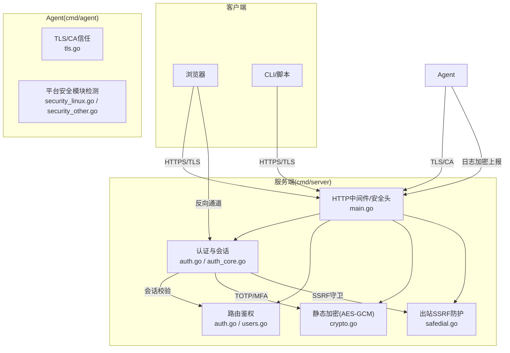
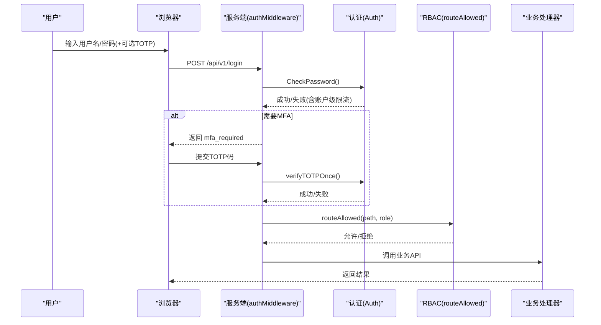
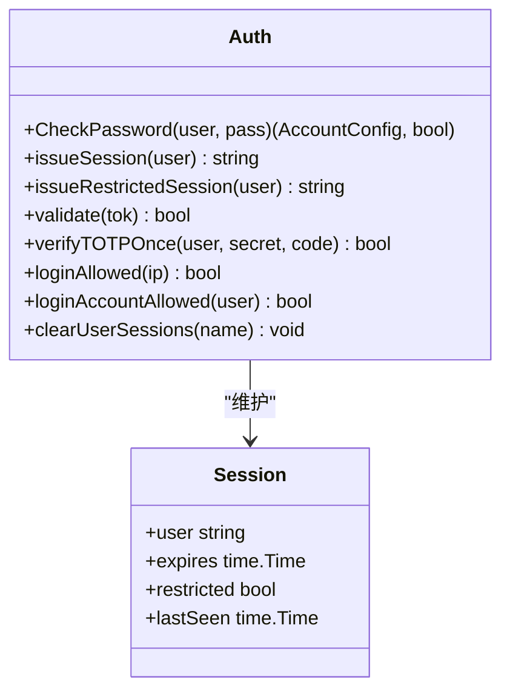
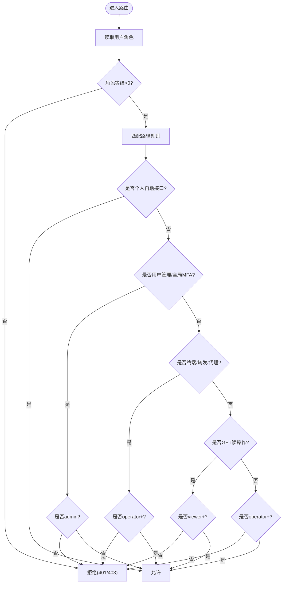
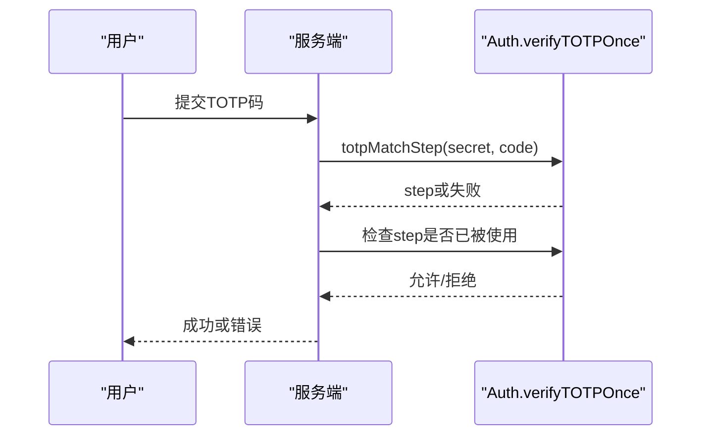
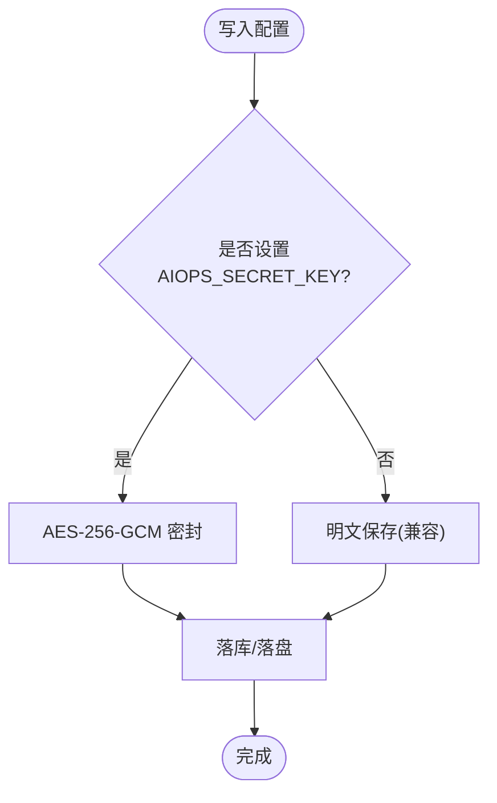
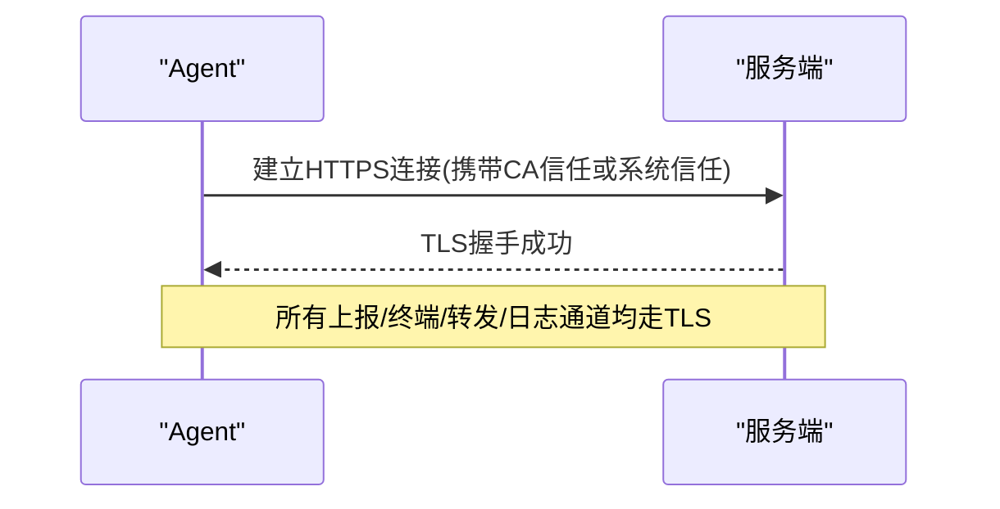
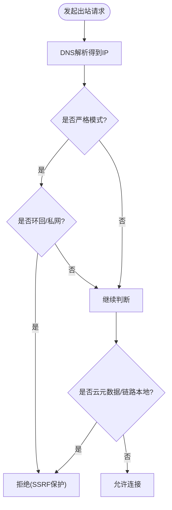
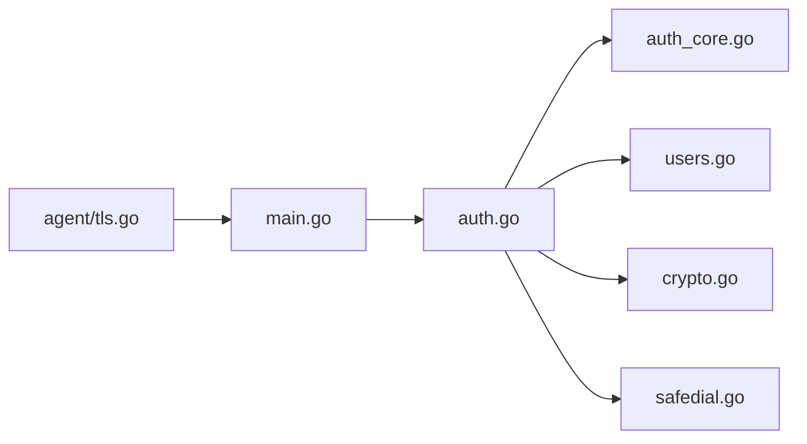

# 安全指南

<cite>
**本文引用的文件**   
- [cmd/server/auth.go](file://cmd/server/auth.go)
- [cmd/server/auth_core.go](file://cmd/server/auth_core.go)
- [cmd/server/totp.go](file://cmd/server/totp.go)
- [cmd/server/crypto.go](file://cmd/server/crypto.go)
- [cmd/server/safedial.go](file://cmd/server/safedial.go)
- [cmd/server/main.go](file://cmd/server/main.go)
- [cmd/server/users.go](file://cmd/server/users.go)
- [cmd/agent/tls.go](file://cmd/agent/tls.go)
- [cmd/agent/security_linux.go](file://cmd/agent/security_linux.go)
- [cmd/agent/security_other.go](file://cmd/agent/security_other.go)
- [server_config.example.json](file://server_config.example.json)
- [config.example.json](file://config.example.json)
- [README.md](file://README.md)
</cite>

## 目录
1. [引言](#引言)
2. [项目结构](#项目结构)
3. [核心组件](#核心组件)
4. [架构总览](#架构总览)
5. [详细组件分析](#详细组件分析)
6. [依赖关系分析](#依赖关系分析)
7. [性能与安全权衡](#性能与安全权衡)
8. [故障排查与常见问题](#故障排查与常见问题)
9. [结论](#结论)
10. [附录：配置清单与加固建议](#附录配置清单与加固建议)

## 引言
本指南面向生产环境部署与运维人员，系统性梳理 AIOps Monitor 的安全架构与实现，覆盖身份认证（RBAC、MFA）、访问控制、传输加密（TLS）、静态数据加密（AES-256-GCM）、SSRF 防护、审计日志、密钥管理、网络安全、合规要求、渗透测试建议与安全事件响应流程等。文档同时提供可操作的安全配置清单与加固建议，帮助快速落地企业级安全基线。

## 项目结构
本项目采用“服务端 + Agent”的双端架构：
- 服务端：提供 Web 面板、REST API、会话与权限控制、存储与告警、终端转发、代理通道等。
- Agent：采集指标、上报日志、建立反向连接以支持远程终端与端口转发，并支持 TLS 与日志加密上报。

图表来源
- [cmd/server/auth.go:110-172](file://cmd/server/auth.go#L110-L172)
- [cmd/server/auth_core.go:107-150](file://cmd/server/auth_core.go#L107-L150)
- [cmd/server/crypto.go:18-103](file://cmd/server/crypto.go#L18-L103)
- [cmd/server/safedial.go:14-96](file://cmd/server/safedial.go#L14-L96)
- [cmd/server/main.go:113-136](file://cmd/server/main.go#L113-L136)
- [cmd/agent/tls.go:13-73](file://cmd/agent/tls.go#L13-L73)

章节来源
- [README.md:19-21](file://README.md#L19-L21)
- [README.md:159-176](file://README.md#L159-L176)

## 核心组件
- 身份认证与会话
  - 用户名+密码登录，支持手机号登录分支；失败计数与账户级限流；会话 Cookie 带 HttpOnly/SameSite，HTTPS 下自动 Secure。
  - 全局 MFA 策略：管理员可强制用户启用 TOTP，未启用前仅允许受限会话访问 MFA 相关接口。
- 多角色访问控制（RBAC）
  - 三角色：admin/operator/viewer；按路径与方法进行最小授权判定。
- 两步验证（MFA）
  - 基于 RFC 6238 的 TOTP，兼容 Google Authenticator；支持一次性校验与防重放。
- 静态数据加密（AES-256-GCM）
  - 通过环境变量 AIOPS_SECRET_KEY 派生主密钥，对敏感配置字段（MFA 种子、SMTP/AI/Webhook/Relay 密钥等）落库加密；向后兼容明文迁移。
- 传输加密（TLS）
  - 服务端可选 HTTPS；Agent 支持自定义 CA 证书链与跳过校验开关（仅实验室/临时使用）。
- SSRF 出站防护
  - 针对“用户可影响 URL”的出站请求（AI 端点、通知 Webhook），在 DNS 解析后、connect 前校验实际 IP，默认拒绝云元数据与链路本地地址；严格模式额外拒绝环回与私网。
- 安全响应头与请求体限制
  - 统一设置 X-Content-Type-Options、X-Frame-Options、Referrer-Policy、CSP；限制最大请求体大小，避免内存耗尽攻击。

章节来源
- [cmd/server/auth.go:110-172](file://cmd/server/auth.go#L110-L172)
- [cmd/server/auth.go:83-108](file://cmd/server/auth.go#L83-L108)
- [cmd/server/users.go:19-41](file://cmd/server/users.go#L19-L41)
- [cmd/server/auth_core.go:17-28](file://cmd/server/auth_core.go#L17-L28)
- [cmd/server/totp.go:16-24](file://cmd/server/totp.go#L16-L24)
- [cmd/server/crypto.go:18-103](file://cmd/server/crypto.go#L18-L103)
- [cmd/server/safedial.go:14-96](file://cmd/server/safedial.go#L14-L96)
- [cmd/server/main.go:113-136](file://cmd/server/main.go#L113-L136)
- [cmd/server/main.go:104-145](file://cmd/server/main.go#L104-L145)

## 架构总览
下图展示关键安全路径：登录→MFA→会话→RBAC→资源访问；以及 Agent 侧 TLS 与日志加密上报、服务端 SSRF 出站防护。

图表来源
- [cmd/server/auth.go:176-307](file://cmd/server/auth.go#L176-L307)
- [cmd/server/auth_core.go:297-321](file://cmd/server/auth_core.go#L297-L321)
- [cmd/server/auth_core.go:262-285](file://cmd/server/auth_core.go#L262-L285)
- [cmd/server/auth.go:83-108](file://cmd/server/auth.go#L83-L108)

## 详细组件分析

### 身份认证与会话（Auth）
- 密码哈希
  - 当前实现使用 PBKDF2-HMAC-SHA256（迭代次数可配置），并对旧格式（加盐 SHA-256）做兼容与透明升级。
- 会话管理
  - 会话令牌随机生成，内部以 SHA-256 摘要索引，持久化到数据库；支持绝对过期与滑动空闲超时；支持受限会话（仅允许 MFA 注册/启用/登出）。
- 登录限流
  - 按 IP 滑动窗口限制失败次数；另增加按账户维度的失败计数，抵御分布式爆破。
- 代理令牌（proxy_token）
  - 用于无状态代理场景的一次性短生命周期令牌；命中后仍应执行 RBAC 复核，防止越权。

图表来源
- [cmd/server/auth_core.go:96-150](file://cmd/server/auth_core.go#L96-L150)
- [cmd/server/auth_core.go:297-321](file://cmd/server/auth_core.go#L297-L321)
- [cmd/server/auth_core.go:331-354](file://cmd/server/auth_core.go#L331-L354)
- [cmd/server/auth_core.go:262-285](file://cmd/server/auth_core.go#L262-L285)

章节来源
- [cmd/server/auth_core.go:17-28](file://cmd/server/auth_core.go#L17-L28)
- [cmd/server/auth_core.go:178-180](file://cmd/server/auth_core.go#L178-L180)
- [cmd/server/auth_core.go:182-260](file://cmd/server/auth_core.go#L182-L260)
- [cmd/server/auth_core.go:331-354](file://cmd/server/auth_core.go#L331-L354)
- [cmd/server/auth.go:110-172](file://cmd/server/auth.go#L110-L172)

### 多角色访问控制（RBAC）
- 角色与等级
  - admin > operator > viewer；未知角色视为无权。
- 路由规则
  - 个人账号自助接口任意已登录角色可用；用户管理与全局 MFA 策略仅 admin；终端/转发/代理相关需 operator+；其余写操作需 operator+，读操作 viewer+。
- 代理令牌复核
  - 代理令牌命中后仍需按当前用户角色执行 routeAllowed，防止签发后被降权导致越权。

图表来源
- [cmd/server/auth.go:83-108](file://cmd/server/auth.go#L83-L108)
- [cmd/server/users.go:19-41](file://cmd/server/users.go#L19-L41)

章节来源
- [cmd/server/auth.go:83-108](file://cmd/server/auth.go#L83-L108)
- [cmd/server/users.go:19-41](file://cmd/server/users.go#L19-L41)

### 两步验证（MFA，TOTP）
- 标准与兼容性
  - 遵循 RFC 6238，6 位动态码，30 秒时间步长，Base32 密钥，兼容 Google Authenticator。
- 一次性校验与防重放
  - 通过记录“用户:时间步”的使用情况，在时钟偏差窗口内禁止重复使用同一代码。
- 全局策略
  - 管理员可强制开启全局 MFA；未启用的用户登录后进入受限会话，仅允许完成 MFA 绑定。

图表来源
- [cmd/server/totp.go:57-90](file://cmd/server/totp.go#L57-L90)
- [cmd/server/auth_core.go:262-285](file://cmd/server/auth_core.go#L262-L285)

章节来源
- [cmd/server/totp.go:16-24](file://cmd/server/totp.go#L16-L24)
- [cmd/server/totp.go:57-90](file://cmd/server/totp.go#L57-L90)
- [cmd/server/auth.go:252-307](file://cmd/server/auth.go#L252-L307)

### 静态数据加密（AES-256-GCM）
- 主密钥派生
  - 从环境变量 AIOPS_SECRET_KEY 派生 32 字节 AES 密钥；未设置时不启用加密，保持向后兼容。
- 加密范围
  - 对可逆敏感字段（MFA 种子、SMTP/AI/Webhook/Relay 密钥等）进行 AES-256-GCM 密封写入；密码哈希为单向，不加密。
- 日志传输加密
  - Agent 日志上报采用 gzip + AES-256-GCM，每批独立 nonce，服务端按指纹派生相同 key 解密。

图表来源
- [cmd/server/crypto.go:28-67](file://cmd/server/crypto.go#L28-L67)
- [cmd/server/crypto.go:175-204](file://cmd/server/crypto.go#L175-L204)
- [cmd/server/crypto.go:120-173](file://cmd/server/crypto.go#L120-L173)

章节来源
- [cmd/server/crypto.go:18-103](file://cmd/server/crypto.go#L18-L103)
- [cmd/server/crypto.go:175-204](file://cmd/server/crypto.go#L175-L204)
- [cmd/server/crypto.go:120-173](file://cmd/server/crypto.go#L120-L173)

### 传输加密（TLS）
- 服务端
  - 可通过配置项启用 HTTPS；建议置于 TLS 终止代理之后或使用内置证书参数。
- Agent 侧
  - 支持指定自定义 CA 证书用于校验服务端证书；提供跳过校验开关（仅实验室/临时使用，存在 MITM 风险）。

图表来源
- [cmd/agent/tls.go:13-73](file://cmd/agent/tls.go#L13-L73)

章节来源
- [cmd/agent/tls.go:13-73](file://cmd/agent/tls.go#L13-L73)
- [README.md:563-564](file://README.md#L563-L564)

### SSRF 出站防护
- 设计目标
  - 针对“用户可影响 URL”的出站请求（AI 端点、通知 Webhook），在 DNS 解析后、connect 前校验实际 IP，天然覆盖 30x 重定向与 DNS rebinding。
- 默认策略
  - 拒绝云实例元数据地址与链路本地地址；严格模式（AIOPS_SSRF_STRICT=true）额外拒绝环回与 RFC1918 私网。
- 实现方式
  - 通过 net.Dialer.Control 钩子拦截真实连接，结合白名单/黑名单策略判断。

图表来源
- [cmd/server/safedial.go:29-78](file://cmd/server/safedial.go#L29-L78)
- [cmd/server/safedial.go:80-96](file://cmd/server/safedial.go#L80-L96)

章节来源
- [cmd/server/safedial.go:14-96](file://cmd/server/safedial.go#L14-L96)

### 安全响应头与请求体限制
- 安全响应头
  - 统一设置 nosniff、DENY、no-referrer、CSP（排除 /proxy/ 路径），降低点击劫持、XSS、信息泄露风险。
- 请求体限制
  - 限制最大请求体大小，避免恶意或异常客户端造成内存耗尽。

章节来源
- [cmd/server/main.go:113-136](file://cmd/server/main.go#L113-L136)
- [cmd/server/main.go:104-145](file://cmd/server/main.go#L104-L145)

### 平台安全模块检测（Agent）
- Linux
  - 检测 kysec、SELinux、AppArmor、firewalld 等模块状态，并提供临时切换宽容模式与自动恢复能力，便于排障与合规。
- Windows/macOS
  - 检测 Defender、受控文件夹访问、防火墙、SIP、TCC 等，给出诊断与建议。

章节来源
- [cmd/agent/security_linux.go:143-264](file://cmd/agent/security_linux.go#L143-L264)
- [cmd/agent/security_other.go:81-197](file://cmd/agent/security_other.go#L81-L197)

## 依赖关系分析
- 认证与 RBAC
  - auth.go 负责中间件与路由权限判定；auth_core.go 提供会话、限流、TOTP 校验；users.go 定义角色与等级映射。
- 加密与传输
  - crypto.go 提供静态加密与日志加密；agent tls.go 提供 TLS 配置与 CA 信任。
- 出站防护
  - safedial.go 提供 SSRF 防护的 Dialer 钩子与 HTTP Client 构建。
- 通用安全中间件
  - main.go 提供安全响应头与请求体限制。

图表来源
- [cmd/server/auth.go:110-172](file://cmd/server/auth.go#L110-L172)
- [cmd/server/auth_core.go:107-150](file://cmd/server/auth_core.go#L107-L150)
- [cmd/server/users.go:19-41](file://cmd/server/users.go#L19-L41)
- [cmd/server/crypto.go:18-103](file://cmd/server/crypto.go#L18-L103)
- [cmd/server/safedial.go:14-96](file://cmd/server/safedial.go#L14-L96)
- [cmd/server/main.go:113-136](file://cmd/server/main.go#L113-L136)
- [cmd/agent/tls.go:13-73](file://cmd/agent/tls.go#L13-L73)

## 性能与安全权衡
- 压缩与流式
  - 非流式接口启用 gzip 压缩提升带宽效率；WebSocket/转发/代理隧道禁用缓冲以保证实时性。
- 会话空闲超时
  - 滑动空闲超时与绝对过期并存，兼顾用户体验与安全性。
- SSRF 防护开销
  - 每次真实连接前进行 IP 校验，开销极低但有效阻断高危出站。

[本节为通用指导，无需列出具体文件来源]

## 故障排查与常见问题
- 无法登录或频繁被限流
  - 检查 IP 与账户级失败计数；确认是否触发全局 MFA 策略。
- MFA 验证码无效
  - 核对设备时间与服务器时间偏差；确认 TOTP 密钥正确且未被复用。
- 代理令牌无法访问
  - 确认代理令牌仍在有效期内；确认当前用户角色满足 RBAC 要求。
- 静态加密不可用
  - 确认 AIOPS_SECRET_KEY 已设置；若密文无法解密，检查密钥是否一致或数据是否损坏。
- TLS 连接失败
  - 检查服务端证书与 CA 链；Agent 侧是否正确配置 ca_cert 或误用了 tls_skip_verify。
- SSRF 拦截
  - 检查目标是否为云元数据/链路本地/私网地址；必要时调整严格模式策略。

章节来源
- [cmd/server/auth.go:176-307](file://cmd/server/auth.go#L176-L307)
- [cmd/server/auth_core.go:182-260](file://cmd/server/auth_core.go#L182-L260)
- [cmd/server/totp.go:57-90](file://cmd/server/totp.go#L57-L90)
- [cmd/server/crypto.go:73-103](file://cmd/server/crypto.go#L73-L103)
- [cmd/agent/tls.go:13-73](file://cmd/agent/tls.go#L13-L73)
- [cmd/server/safedial.go:45-78](file://cmd/server/safedial.go#L45-L78)

## 结论
本系统在企业级安全方面提供了较为完备的能力：强化的认证与会话管理、细粒度 RBAC、TOTP 两步验证、静态数据与日志传输加密、严格的出站 SSRF 防护、安全响应头与请求体限制，以及跨平台安全模块检测与修复指引。配合合理的密钥管理与网络隔离策略，可满足多数企业合规与审计要求。

[本节为总结性内容，无需列出具体文件来源]

## 附录：配置清单与加固建议

### 安全配置清单
- 身份与访问
  - 启用全局 MFA 策略（mfa_required=true）；定期轮换安装 Token；为每个用户分配最小必要角色。
  - 参考配置键：
    - [server_config.example.json](file://server_config.example.json)
- 静态加密
  - 设置 AIOPS_SECRET_KEY；妥善备份主密钥；确保敏感字段经 AES-256-GCM 加密落库。
  - 参考说明：
    - [README.md:563-564](file://README.md#L563-L564)
- 传输加密
  - 启用 HTTPS（AIOPS_TLS_CERT/AIOPS_TLS_KEY）；Agent 侧配置 ca_cert 或仅在实验室使用 tls_skip_verify。
  - 参考说明：
    - [README.md:563-564](file://README.md#L563-L564)
    - [cmd/agent/tls.go:13-73](file://cmd/agent/tls.go#L13-L73)
- SSRF 防护
  - 根据业务需求决定是否启用严格模式（AIOPS_SSRF_STRICT=true）。
  - 参考实现：
    - [cmd/server/safedial.go:40-43](file://cmd/server/safedial.go#L40-L43)
- 安全响应头与请求体限制
  - 保留默认安全响应头；根据业务调整 maxBodyBytes。
  - 参考实现：
    - [cmd/server/main.go:113-136](file://cmd/server/main.go#L113-L136)
    - [cmd/server/main.go:104-145](file://cmd/server/main.go#L104-L145)

### 安全加固建议
- 密钥管理
  - 使用高熵随机主密钥；集中化管理与轮换；禁止将密钥硬编码至镜像或配置仓库。
- 证书配置
  - 使用可信 CA 签发的证书；Agent 侧优先使用自定义 CA 信任而非跳过校验。
- 网络安全
  - 将服务置于 TLS 终止代理之后；限制公网暴露面；按需开放端口；启用防火墙与入侵检测。
- 审计日志
  - 开启登录、MFA、密码修改、用户管理等关键操作的审计；集中收集与留存。
- 合规要求
  - 满足等保与数据安全相关要求：最小权限、可追溯、可审计、加密存储与传输。
- 渗透测试建议
  - 重点测试：登录爆破与账户锁定、TOTP 重放、RBAC 越权（尤其是代理令牌路径）、SSRF 出站、CSP/XSS、CSRF、请求体超限、TLS 降级与证书绕过。
- 安全事件响应流程
  - 发现异常登录/越权访问 → 立即吊销会话与代理令牌 → 重置受影响账户密码与 MFA → 审查审计日志与网络流量 → 修复漏洞并发布补丁 → 复盘与加固。

章节来源
- [server_config.example.json:1-36](file://server_config.example.json#L1-L36)
- [config.example.json:1-16](file://config.example.json#L1-L16)
- [README.md:563-564](file://README.md#L563-L564)
- [cmd/server/safedial.go:40-43](file://cmd/server/safedial.go#L40-L43)
- [cmd/server/main.go:113-136](file://cmd/server/main.go#L113-L136)
- [cmd/server/main.go:104-145](file://cmd/server/main.go#L104-L145)
- [cmd/agent/tls.go:13-73](file://cmd/agent/tls.go#L13-L73)