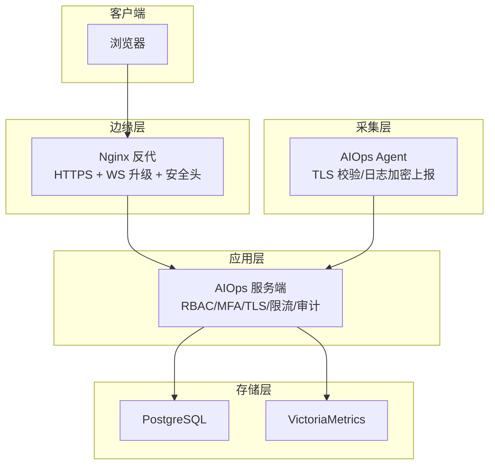
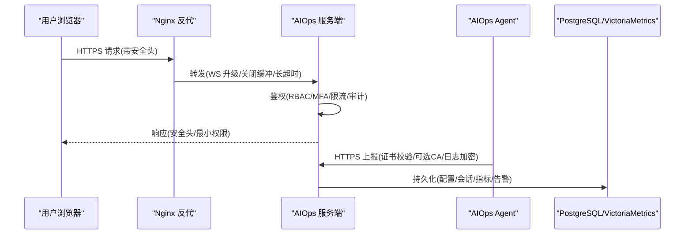
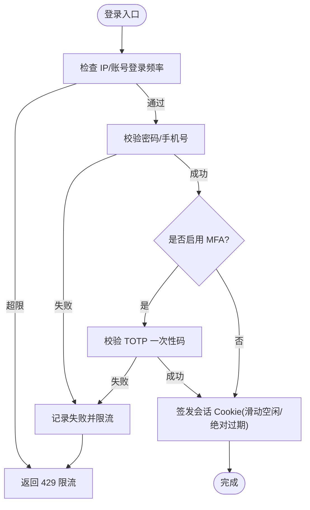
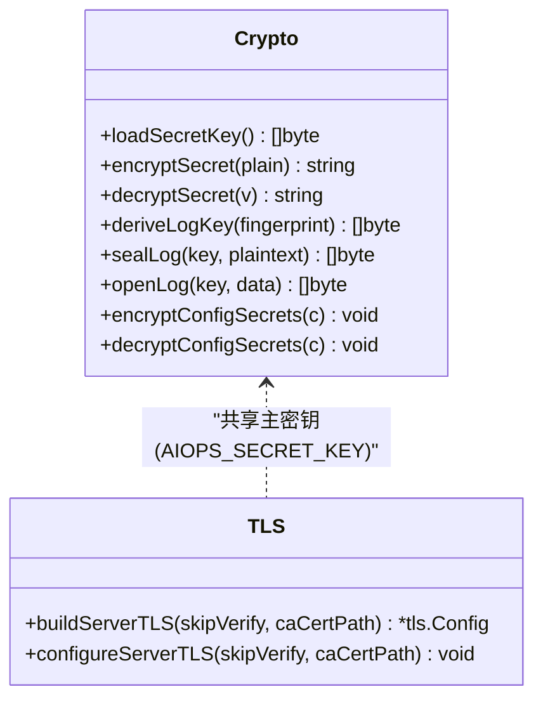
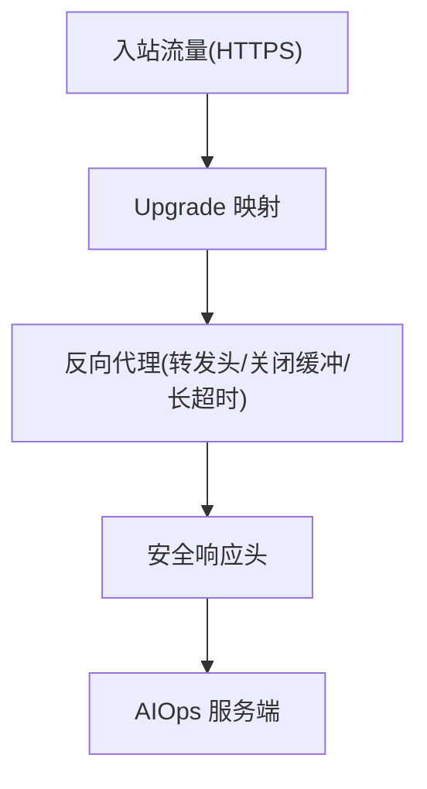
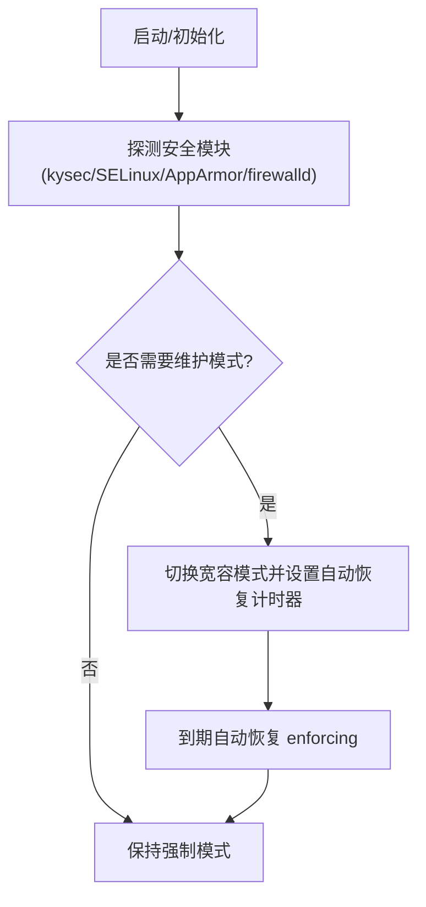
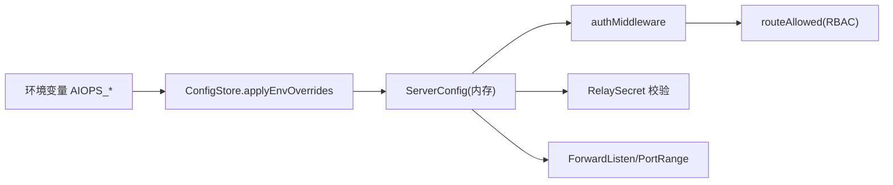

# 安全配置清单

<cite>
**本文引用的文件**   
- [config.example.json](file://config.example.json)
- [server_config.example.json](file://server_config.example.json)
- [cmd/server/auth.go](file://cmd/server/auth.go)
- [cmd/server/auth_core.go](file://cmd/server/auth_core.go)
- [cmd/server/config.go](file://cmd/server/config.go)
- [cmd/server/crypto.go](file://cmd/server/crypto.go)
- [cmd/agent/tls.go](file://cmd/agent/tls.go)
- [cmd/agent/security_linux.go](file://cmd/agent/security_linux.go)
- [deploy/nginx-aiops.conf](file://deploy/nginx-aiops.conf)
- [docker/nginx/nginx-frontend.conf](file://docker/nginx/nginx-frontend.conf)
- [docker/Dockerfile](file://docker/Dockerfile)
- [scripts/secure-compose.sh](file://scripts/secure-compose.sh)
- [README.md](file://README.md)
</cite>

## 目录
1. [简介](#简介)
2. [项目结构](#项目结构)
3. [核心组件](#核心组件)
4. [架构总览](#架构总览)
5. [详细组件分析](#详细组件分析)
6. [依赖关系分析](#依赖关系分析)
7. [性能与安全权衡](#性能与安全权衡)
8. [故障排查指南](#故障排查指南)
9. [结论](#结论)
10. [附录：部署环境模板与合规检查](#附录部署环境模板与合规检查)

## 简介
本文件面向生产环境，提供一套可落地的“安全配置清单”，覆盖环境变量、认证授权、传输加密、静态数据加密、反向代理、容器化、系统级安全（MAC/防火墙）、Agent 侧 TLS 校验、以及自动化脚本与合规检查。文档同时给出不同环境（开发/测试/生产）的配置模板与最佳实践，并包含变更影响评估与回滚策略建议。

## 项目结构
本项目为 AIOps 监控平台，包含服务端、Agent、Nginx 反代示例、Docker 构建与一键安全编排脚本等关键组件。安全相关的关键位置如下：
- 服务端配置与鉴权：cmd/server/*
- Agent 侧 TLS 与 Linux 安全模块探测：cmd/agent/*
- Nginx 反代示例（含 WebSocket 与长连接）：deploy/*, docker/nginx/*
- 容器镜像与构建：docker/*
- 一键生成强随机密钥的编排脚本：scripts/*
- 示例配置文件：根目录 *.json

图表来源
- [deploy/nginx-aiops.conf:18-60](file://deploy/nginx-aiops.conf#L18-L60)
- [docker/nginx/nginx-frontend.conf:27-125](file://docker/nginx/nginx-frontend.conf#L27-L125)
- [cmd/server/auth.go:112-171](file://cmd/server/auth.go#L112-L171)
- [cmd/agent/tls.go:19-39](file://cmd/agent/tls.go#L19-L39)

章节来源
- [README.md:556-573](file://README.md#L556-L573)

## 核心组件
- 认证与授权
  - 会话 Cookie、滑动空闲超时、绝对过期时间
  - 登录失败频率限制（IP 维度 + 账号维度）
  - RBAC 角色控制（admin/operator/viewer）
  - 全局 MFA 强制策略与用户级 TOTP 二次验证
  - 终端二次密码与会话内标记
- 传输与静态数据加密
  - Agent→Server HTTPS 校验（支持自定义 CA、可选跳过校验仅用于临时场景）
  - 配置项静态加密（AES-256-GCM），由主密钥 AIOPS_SECRET_KEY 驱动
  - 日志传输加密（gzip + AES-256-GCM，按指纹派生 per-agent 密钥）
- 网络与边界安全
  - Nginx 反代：WebSocket 升级、关闭缓冲、长超时、安全响应头
  - 端口转发监听地址默认仅本地暴露，需显式放开
  - 中继共享密钥校验（X-Relay-Secret）
- 系统级安全（Linux）
  - 自动检测 kysec/SELinux/AppArmor/firewalld 状态
  - 维护模式（宽容模式）自动恢复计时器
  - 权限错误诊断与修复命令输出

章节来源
- [cmd/server/auth.go:112-171](file://cmd/server/auth.go#L112-L171)
- [cmd/server/auth_core.go:17-20](file://cmd/server/auth_core.go#L17-L20)
- [cmd/server/auth_core.go:137-150](file://cmd/server/auth_core.go#L137-L150)
- [cmd/server/config.go:717-724](file://cmd/server/config.go#L717-L724)
- [cmd/server/crypto.go:18-24](file://cmd/server/crypto.go#L18-L24)
- [cmd/server/crypto.go:120-130](file://cmd/server/crypto.go#L120-L130)
- [cmd/agent/tls.go:19-39](file://cmd/agent/tls.go#L19-L39)
- [cmd/agent/security_linux.go:143-165](file://cmd/agent/security_linux.go#L143-L165)
- [cmd/agent/security_linux.go:324-352](file://cmd/agent/security_linux.go#L324-L352)

## 架构总览
下图展示从浏览器到后端服务、Agent 上报、以及 Nginx 边界的端到端安全路径。

图表来源
- [deploy/nginx-aiops.conf:18-60](file://deploy/nginx-aiops.conf#L18-L60)
- [cmd/server/auth.go:112-171](file://cmd/server/auth.go#L112-L171)
- [cmd/agent/tls.go:41-73](file://cmd/agent/tls.go#L41-L73)

## 详细组件分析

### 认证与授权（登录、会话、RBAC、MFA）
- 登录流程
  - 用户名/手机号登录，统一走鉴权中间件
  - 失败计数：IP 维度 + 账号维度双限流，防止分布式爆破
  - 首次登录强制改密（默认 admin/admin）
  - 可选 TOTP 二次验证；全局 MFA 策略可强制未启用用户进入受限会话
- 会话管理
  - Cookie 名称固定，HttpOnly、Secure（HTTPS 时）、SameSite=Lax
  - 绝对过期 7 天；滑动空闲超时 24 小时
  - 令牌哈希索引，避免泄露直接重放
- RBAC
  - 角色：admin/operator/viewer
  - 路由级别控制：用户管理仅 admin；终端/转发 operator+；其余写操作 operator+；读 viewer+
- 终端二次密码
  - 会话内标记，失败次数限制与锁定窗口

图表来源
- [cmd/server/auth.go:176-206](file://cmd/server/auth.go#L176-L206)
- [cmd/server/auth.go:252-307](file://cmd/server/auth.go#L252-L307)
- [cmd/server/auth_core.go:137-150](file://cmd/server/auth_core.go#L137-L150)
- [cmd/server/auth_core.go:331-354](file://cmd/server/auth_core.go#L331-L354)

章节来源
- [cmd/server/auth.go:112-171](file://cmd/server/auth.go#L112-L171)
- [cmd/server/auth.go:176-206](file://cmd/server/auth.go#L176-L206)
- [cmd/server/auth.go:252-307](file://cmd/server/auth.go#L252-L307)
- [cmd/server/auth_core.go:17-20](file://cmd/server/auth_core.go#L17-L20)
- [cmd/server/auth_core.go:137-150](file://cmd/server/auth_core.go#L137-L150)
- [cmd/server/auth_core.go:331-354](file://cmd/server/auth_core.go#L331-L354)

### 传输与静态数据加密
- Agent→Server TLS
  - 默认最小版本 TLS1.2
  - 支持自定义 CA 信任链；仅在临时/自签场景可跳过校验（存在 MITM 风险）
  - 所有 HTTP 客户端统一注入 TLS 配置
- 配置静态加密（AIOPS_SECRET_KEY）
  - 使用 AES-256-GCM 对敏感字段进行密封存储（如 SMTP/AI/webhook/relay/MFA 等）
  - 无主密钥时透明兼容明文加载，写入时再加密
- 日志传输加密
  - 基于主密钥 + Agent 指纹派生 per-agent 密钥
  - gzip 压缩后 AES-256-GCM 加密，服务端按指纹派生解密

图表来源
- [cmd/server/crypto.go:32-39](file://cmd/server/crypto.go#L32-39)
- [cmd/server/crypto.go:47-67](file://cmd/server/crypto.go#L47-67)
- [cmd/server/crypto.go:120-130](file://cmd/server/crypto.go#L120-130)
- [cmd/server/crypto.go:175-204](file://cmd/server/crypto.go#L175-204)
- [cmd/agent/tls.go:19-39](file://cmd/agent/tls.go#L19-39)
- [cmd/agent/tls.go:41-73](file://cmd/agent/tls.go#L41-73)

章节来源
- [cmd/server/crypto.go:18-24](file://cmd/server/crypto.go#L18-24)
- [cmd/server/crypto.go:32-39](file://cmd/server/crypto.go#L32-39)
- [cmd/server/crypto.go:120-130](file://cmd/server/crypto.go#L120-130)
- [cmd/server/crypto.go:175-204](file://cmd/server/crypto.go#L175-204)
- [cmd/agent/tls.go:19-39](file://cmd/agent/tls.go#L19-39)
- [cmd/agent/tls.go:41-73](file://cmd/agent/tls.go#L41-73)

### 反向代理与边界安全（Nginx）
- 必须开启 WebSocket 升级映射、关闭缓冲、设置长超时
- 统一添加安全响应头（X-Frame-Options/X-Content-Type-Options/X-XSS-Protection/Referrer-Policy）
- 大文件上传/终端粘贴/端口转发需对齐 maxBodySize
- 将真实客户端 IP 透传至后端，并在可信反代下开启 trust_proxy

图表来源
- [deploy/nginx-aiops.conf:13-16](file://deploy/nginx-aiops.conf#L13-16)
- [deploy/nginx-aiops.conf:30-58](file://deploy/nginx-aiops.conf#L30-L58)
- [docker/nginx/nginx-frontend.conf:187-192](file://docker/nginx/nginx-frontend.conf#L187-L192)

章节来源
- [deploy/nginx-aiops.conf:18-60](file://deploy/nginx-aiops.conf#L18-L60)
- [docker/nginx/nginx-frontend.conf:27-125](file://docker/nginx/nginx-frontend.conf#L27-L125)
- [docker/nginx/nginx-frontend.conf:187-192](file://docker/nginx/nginx-frontend.conf#L187-L192)

### 系统级安全（Linux MAC/防火墙）
- 自动检测 kysec/SELinux/AppArmor/firewalld 状态
- 维护模式（permissive）自动恢复计时器，避免长期放宽
- 诊断 /proc 访问与修复命令输出

图表来源
- [cmd/agent/security_linux.go:143-165](file://cmd/agent/security_linux.go#L143-165)
- [cmd/agent/security_linux.go:324-352](file://cmd/agent/security_linux.go#L324-352)
- [cmd/agent/security_linux.go:410-421](file://cmd/agent/security_linux.go#L410-L421)

章节来源
- [cmd/agent/security_linux.go:143-165](file://cmd/agent/security_linux.go#L143-L165)
- [cmd/agent/security_linux.go:324-352](file://cmd/agent/security_linux.go#L324-L352)
- [cmd/agent/security_linux.go:410-421](file://cmd/agent/security_linux.go#L410-L421)

### 环境变量与配置覆盖
- 关键环境变量（优先级高于 server_config.json）
  - AIOPS_POSTGRES_DSN（必填）
  - AIOPS_VM_URL（必填）
  - AIOPS_SECRET_KEY（强烈建议）
  - AIOPS_TLS_CERT / AIOPS_TLS_KEY（可选）
  - AIOPS_FORWARD_LISTEN / AIOPS_FORWARD_PORT_RANGE
  - AIOPS_RELAY_SECRET
  - AIOPS_TERMINAL_DISABLED / AIOPS_FORWARD_DISABLED
  - AIOPS_ALLOW_ANONYMOUS_AGENTS / AIOPS_TRUST_PROXY / AIOPS_REQUIRE_TOKEN

章节来源
- [cmd/server/config.go:616-651](file://cmd/server/config.go#L616-L651)
- [README.md:556-573](file://README.md#L556-L573)

### 示例配置要点
- 服务端示例配置（server_config.example.json）
  - 安装 Token、是否要求 Token、MFA 强制开关
  - 账户初始信息（盐/哈希占位）
  - 阈值、通知渠道、转发监听与端口范围
- Agent 示例配置（config.example.json）
  - 服务器地址、Token、插件目录、状态文件等

章节来源
- [server_config.example.json:1-36](file://server_config.example.json#L1-L36)
- [config.example.json:1-16](file://config.example.json#L1-L16)

## 依赖关系分析
- 配置与环境变量
  - ConfigStore 在启动时加载 JSON/PG，解密敏感字段，回填阈值默认值，迁移单账户到多账户，应用环境变量覆盖，最后执行 Validate
- 鉴权与中间件
  - authMiddleware 串联：CORS → Gzip → BodyLimit → Auth → Routes
  - routeAllowed 基于角色与路径前缀做细粒度控制
- 代理与中继
  - RelaySecret 校验用于上游网关中继请求，防止未授权中继
- 端口转发
  - ForwardListen 默认 127.0.0.1，外部访问需显式设为 0.0.0.0（Docker 场景）

图表来源
- [cmd/server/config.go:616-651](file://cmd/server/config.go#L616-L651)
- [cmd/server/auth.go:112-171](file://cmd/server/auth.go#L112-L171)
- [cmd/server/config.go:717-724](file://cmd/server/config.go#L717-L724)

章节来源
- [cmd/server/config.go:543-599](file://cmd/server/config.go#L543-L599)
- [cmd/server/auth.go:112-171](file://cmd/server/auth.go#L112-L171)
- [cmd/server/config.go:717-724](file://cmd/server/config.go#L717-L724)

## 性能与安全权衡
- 关闭缓冲与长超时有利于实时性（终端/转发），但会增加资源占用，应配合合理的并发与连接池上限
- 登录限流保护安全，但可能误伤高并发合法登录，建议结合可信代理与白名单策略
- 静态加密增加 CPU 开销，建议仅在需要时开启 AIOPS_SECRET_KEY，并确保密钥备份与轮换流程完善

[本节为通用指导，不直接分析具体文件]

## 故障排查指南
- 无法登录或频繁被限流
  - 检查是否设置了 AIOPS_TRUST_PROXY，确保真实 IP 透传正确
  - 查看登录失败计数与账号维度限流
- 终端/转发连不上
  - 确认 Nginx 已配置 Upgrade 映射、关闭缓冲、长超时
  - 检查服务端 ForwardListen 是否为 0.0.0.0（容器环境）
- Agent 无法上报或证书校验失败
  - 确认 Agent 是否配置了正确的 CA 证书路径，或临时跳过校验仅用于排障
- 配置静态加密不可用
  - 确认 AIOPS_SECRET_KEY 已设置且未被篡改；若丢失，已加密字段将无法解密

章节来源
- [cmd/server/config.go:766-770](file://cmd/server/config.go#L766-L770)
- [deploy/nginx-aiops.conf:30-58](file://deploy/nginx-aiops.conf#L30-L58)
- [cmd/agent/tls.go:19-39](file://cmd/agent/tls.go#L19-39)
- [cmd/server/crypto.go:73-103](file://cmd/server/crypto.go#L73-L103)

## 结论
通过“环境变量优先 + 配置静态加密 + 严格鉴权与 RBAC + 传输加密 + 边界加固 + 系统级安全”的组合，可在生产环境中获得较高的安全基线。建议在 CI/CD 中集成自动化安全检查与合规校验，并对关键变更实施影响评估与回滚预案。

[本节为总结，不直接分析具体文件]

## 附录：部署环境模板与合规检查

### 环境模板与最佳实践
- 开发环境
  - 允许匿名 Agent：AIOPS_ALLOW_ANONYMOUS_AGENTS=true（便于快速联调）
  - 禁用 MFA 强制：mfa_required=false
  - 可临时跳过 TLS 校验（仅限本地自签），尽快切换到自定义 CA
  - 端口转发监听 127.0.0.1，避免外网暴露
- 测试环境
  - 启用 AIOPS_SECRET_KEY（至少测试库）
  - 开启全局 MFA 强制（mfa_required=true）
  - 启用中继共享密钥（AIOPS_RELAY_SECRET）
  - 端口转发监听 0.0.0.0（容器内可达），并通过反向代理限制来源
- 生产环境
  - 必填：AIOPS_POSTGRES_DSN、AIOPS_VM_URL
  - 强烈建议：AIOPS_SECRET_KEY（妥善备份）
  - 强制 MFA、禁止匿名 Agent、启用中继密钥
  - 反向代理强制 HTTPS，开启安全响应头
  - 端口转发监听 0.0.0.0 仅在内网/受控网络暴露，配合 ACL

章节来源
- [README.md:556-573](file://README.md#L556-L573)
- [cmd/server/config.go:717-724](file://cmd/server/config.go#L717-L724)
- [cmd/server/crypto.go:18-24](file://cmd/server/crypto.go#L18-L24)

### 安全配置检查清单（生产）
- 身份与访问
  - 已启用全局 MFA 强制；管理员账号非默认口令；最小权限原则（viewer/operator/admin 分离）
  - 登录失败限流生效（IP + 账号维度）
  - 终端二次密码已启用并按需限制
- 传输与静态数据
  - 对外 HTTPS（或经可信反代终止 TLS）
  - 已配置 AIOPS_SECRET_KEY 并备份；敏感字段已加密
  - Agent 使用自定义 CA 或系统信任库校验服务端证书
- 边界与网络
  - Nginx 已配置 WS 升级、关闭缓冲、长超时、安全响应头
  - 端口转发监听地址符合预期（默认 127.0.0.1，容器需 0.0.0.0）
  - 中继共享密钥已配置并校验
- 系统与主机
  - kysec/SELinux/AppArmor 处于 enforcing 或已纳入白名单
  - firewalld 放行必要端口
  - 进程以最小权限运行，文件/目录权限收敛

章节来源
- [cmd/server/auth.go:112-171](file://cmd/server/auth.go#L112-L171)
- [cmd/server/crypto.go:18-24](file://cmd/server/crypto.go#L18-L24)
- [cmd/agent/tls.go:19-39](file://cmd/agent/tls.go#L19-39)
- [deploy/nginx-aiops.conf:30-58](file://deploy/nginx-aiops.conf#L30-L58)
- [cmd/agent/security_linux.go:143-165](file://cmd/agent/security_linux.go#L143-L165)

### 自动化安全检查与合规脚本
- 一键安全编排脚本
  - 自动生成 AIOPS_SECRET_KEY 与 PostgreSQL 密码，并注入 docker-compose.yml
  - 适用于快速拉起具备基础安全能力的测试/预发环境
- 建议集成的自动化检查
  - 启动后调用健康检查接口 /healthz
  - 校验环境变量是否缺失（AIOPS_POSTGRES_DSN/AIOPS_VM_URL）
  - 校验 AIOPS_SECRET_KEY 是否存在（生产必检）
  - 校验 Nginx 安全头与 WS 配置是否生效（可通过 curl 抓取响应头）
  - 校验端口转发监听地址是否符合预期

章节来源
- [scripts/secure-compose.sh:40-51](file://scripts/secure-compose.sh#L40-L51)
- [scripts/secure-compose.sh:67-91](file://scripts/secure-compose.sh#L67-L91)
- [docker/Dockerfile:55](file://docker/Dockerfile#L55)

### 配置变更的安全影响评估与回滚策略
- 变更前
  - 识别受影响面：鉴权（MFA/RBAC）、传输（TLS/CA）、静态加密（AIOPS_SECRET_KEY）、网络（ForwardListen/RelaySecret）
  - 准备回滚包：旧版二进制、旧版配置快照、密钥备份
- 变更后
  - 灰度发布：先小流量验证，观察登录/上报/终端/转发链路
  - 监控告警：关注鉴权失败、TLS 握手失败、端口转发异常
- 回滚
  - 立即恢复环境变量与配置文件至上一稳定版本
  - 重启服务并验证健康检查与关键路径
  - 若涉及 AIOPS_SECRET_KEY 变更，需提前规划密钥轮换与数据解密策略

[本节为通用流程建议，不直接分析具体文件]