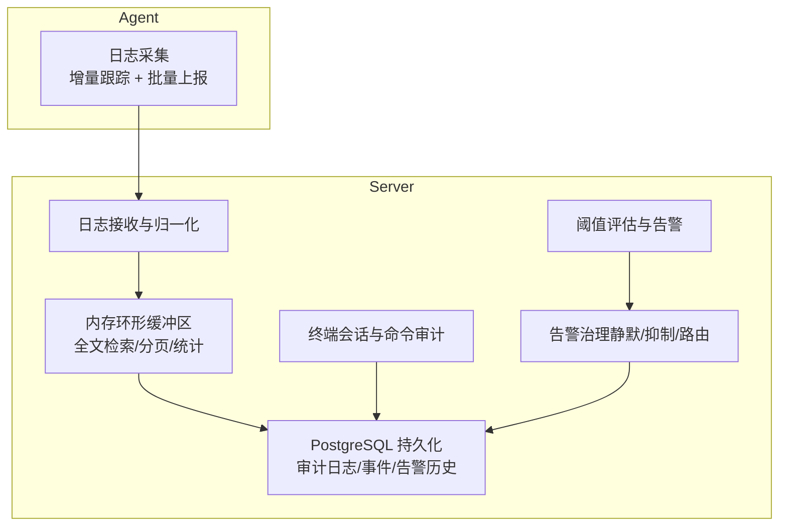
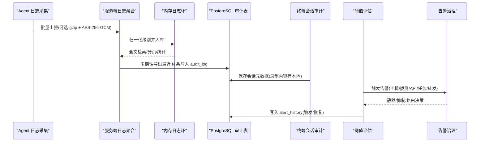
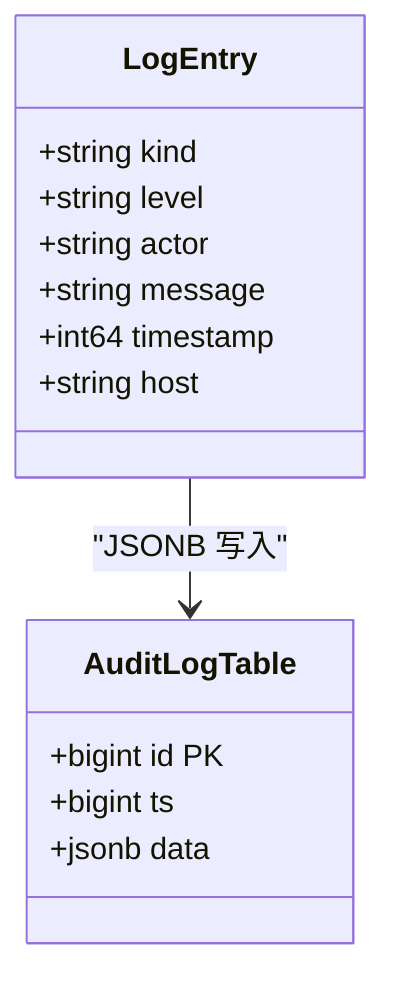
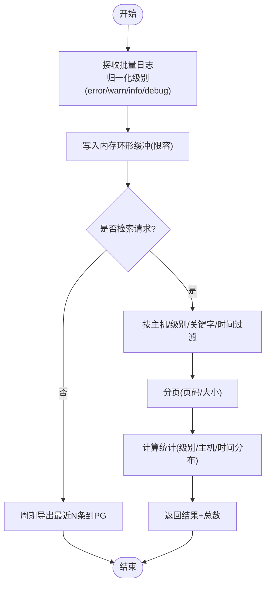
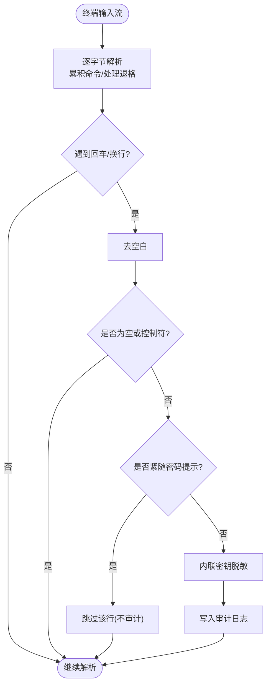
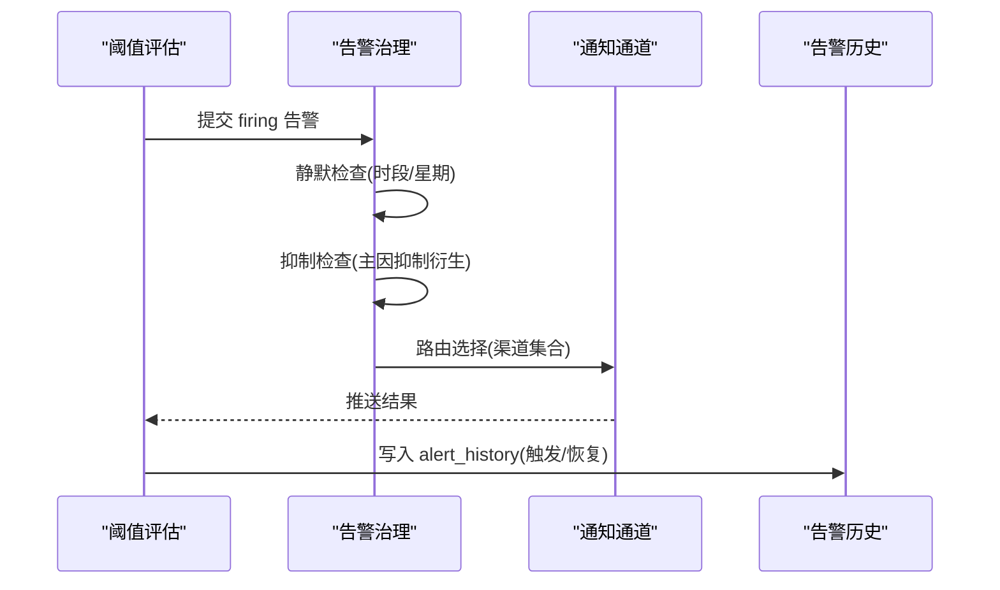
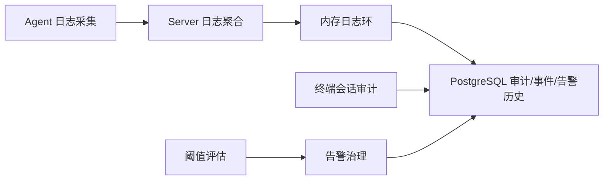

# 审计日志与安全监控

<cite>
**本文引用的文件**   
- [cmd/server/logstore.go](file://cmd/server/logstore.go)
- [cmd/server/pgstore.go](file://cmd/server/pgstore.go)
- [cmd/server/terminal.go](file://cmd/server/terminal.go)
- [cmd/server/alerts.go](file://cmd/server/alerts.go)
- [cmd/server/alertgov.go](file://cmd/server/alertgov.go)
- [cmd/agent/logcollect.go](file://cmd/agent/logcollect.go)
- [README.md](file://README.md)
</cite>

## 目录
1. [引言](#引言)
2. [项目结构](#项目结构)
3. [核心组件](#核心组件)
4. [架构总览](#架构总览)
5. [详细组件分析](#详细组件分析)
6. [依赖关系分析](#依赖关系分析)
7. [性能与容量规划](#性能与容量规划)
8. [故障排查指南](#故障排查指南)
9. [结论](#结论)
10. [附录：数据模型与字段说明](#附录数据模型与字段说明)

## 引言
本文件面向“审计日志与安全监控”主题，系统性梳理 AIOps Monitor 在以下方面的实现与能力：
- 审计日志记录机制：用户操作、系统事件、安全事件的分类与格式
- 日志采集、存储、检索与分析：全文搜索、时间范围过滤、用户行为分析
- 安全监控告警配置：异常登录检测、权限滥用告警、安全事件响应流程
- 日志安全保护：完整性验证、敏感信息脱敏、访问控制
- 合规性报告生成、安全态势感知、威胁情报集成等高级能力（基于现有能力的扩展建议）

## 项目结构
围绕审计与安全相关的关键代码位置如下：
- 服务端日志聚合与检索：cmd/server/logstore.go
- 持久化层（PostgreSQL）：cmd/server/pgstore.go
- 终端会话与命令审计：cmd/server/terminal.go
- 阈值告警与治理：cmd/server/alerts.go、cmd/server/alertgov.go
- Agent 侧日志采集与加密上报：cmd/agent/logcollect.go
- 功能概览与部署参考：README.md

图表来源
- [cmd/server/logstore.go:1-120](file://cmd/server/logstore.go#L1-L120)
- [cmd/server/pgstore.go:98-112](file://cmd/server/pgstore.go#L98-L112)
- [cmd/server/terminal.go:1002-1031](file://cmd/server/terminal.go#L1002-L1031)
- [cmd/server/alerts.go:1-120](file://cmd/server/alerts.go#L1-L120)
- [cmd/server/alertgov.go:1-90](file://cmd/server/alertgov.go#L1-L90)
- [cmd/agent/logcollect.go:1-84](file://cmd/agent/logcollect.go#L1-L84)

章节来源
- [cmd/server/logstore.go:1-120](file://cmd/server/logstore.go#L1-L120)
- [cmd/server/pgstore.go:98-112](file://cmd/server/pgstore.go#L98-L112)
- [cmd/server/terminal.go:1002-1031](file://cmd/server/terminal.go#L1002-L1031)
- [cmd/server/alerts.go:1-120](file://cmd/server/alerts.go#L1-L120)
- [cmd/server/alertgov.go:1-90](file://cmd/server/alertgov.go#L1-L90)
- [cmd/agent/logcollect.go:1-84](file://cmd/agent/logcollect.go#L1-L84)
- [README.md:721-755](file://README.md#L721-L755)

## 核心组件
- 日志采集器（Agent）
  - 增量跟踪指定路径，按批次上报；支持 gzip 压缩与 AES-256-GCM 加密传输（注册阶段下发 per-agent log_key）。
- 日志聚合与检索（Server）
  - 内存环形缓冲，提供按主机/级别/关键字/时间的全文检索与分页；同时输出统计（级别分布、Top 主机、时间分布）。
- 审计日志持久化（PG）
  - audit_log 表追加写入，ts 索引用于高效查询；终端会话录制元数据持久化，内容留本地文件。
- 终端命令审计
  - 输入流解析完成命令，自动脱敏内联密钥，跳过密码提示行，避免敏感信息落库。
- 告警与治理
  - 阈值评估产生告警；治理层支持静默（时段/星期）、抑制（主因抑制衍生）、通知路由（按级别/主机/类型分流）。

章节来源
- [cmd/agent/logcollect.go:1-84](file://cmd/agent/logcollect.go#L1-L84)
- [cmd/server/logstore.go:1-120](file://cmd/server/logstore.go#L1-L120)
- [cmd/server/pgstore.go:302-332](file://cmd/server/pgstore.go#L302-L332)
- [cmd/server/terminal.go:1002-1031](file://cmd/server/terminal.go#L1002-L1031)
- [cmd/server/alerts.go:1-120](file://cmd/server/alerts.go#L1-L120)
- [cmd/server/alertgov.go:1-90](file://cmd/server/alertgov.go#L1-L90)

## 架构总览
审计与安全监控的整体数据流如下：

图表来源
- [cmd/agent/logcollect.go:1-84](file://cmd/agent/logcollect.go#L1-L84)
- [cmd/server/logstore.go:59-166](file://cmd/server/logstore.go#L59-L166)
- [cmd/server/pgstore.go:302-332](file://cmd/server/pgstore.go#L302-L332)
- [cmd/server/terminal.go:1002-1031](file://cmd/server/terminal.go#L1002-L1031)
- [cmd/server/alerts.go:205-464](file://cmd/server/alerts.go#L205-L464)
- [cmd/server/alertgov.go:147-194](file://cmd/server/alertgov.go#L147-L194)

## 详细组件分析

### 审计日志记录机制（分类与格式）
- 分类
  - 用户操作审计：登录、改密、终端打开/关闭、命令执行等
  - 系统事件审计：插件事件、AI 诊断向量记忆、告警历史等
  - 安全事件审计：默认凭据登录强制改密、二次认证、SSRF 出站防护等
- 格式
  - 统一为 JSONB 的 LogEntry，包含 kind、level、actor、message、timestamp 等字段；audit_log 表以 ts 建索引便于时间范围检索。
- 示例（来自数据库样例）
  - 登录成功、修改密码、设置终端密码、打开/关闭远程终端、终端命令执行等条目。

图表来源
- [cmd/server/pgstore.go:98-112](file://cmd/server/pgstore.go#L98-L112)
- [pg-backup-vectorfix.sql:160-176](file://pg-backup-vectorfix.sql#L160-L176)

章节来源
- [cmd/server/pgstore.go:302-332](file://cmd/server/pgstore.go#L302-L332)
- [pg-backup-vectorfix.sql:160-176](file://pg-backup-vectorfix.sql#L160-L176)

### 日志采集、存储、检索与分析
- 采集（Agent）
  - 增量跟踪 --log-paths 指定的文件或目录，仅采集新增行；每 10s 轮询，批量上限 500 行；支持 gzip + AES-256-GCM 加密上报。
- 存储（Server）
  - 内存环形缓冲（固定容量），重启后从 PG 恢复最近 N 条作为热尾；不长期持久化全部日志，降低 WAL 压力。
- 检索与分析
  - 全文检索：按 host_id、level、keyword、since 过滤，返回 newest-first；支持分页与总数统计。
  - 统计分析：级别分布、Top 主机、近 1h/6h/24h 时间分布。
  - AI 巡检上下文：可拉取近期 error/warn 日志供 AI 分析。

图表来源
- [cmd/server/logstore.go:59-166](file://cmd/server/logstore.go#L59-L166)
- [cmd/server/logstore.go:182-254](file://cmd/server/logstore.go#L182-L254)
- [cmd/server/logstore.go:292-317](file://cmd/server/logstore.go#L292-L317)
- [cmd/agent/logcollect.go:1-84](file://cmd/agent/logcollect.go#L1-L84)

章节来源
- [cmd/server/logstore.go:59-166](file://cmd/server/logstore.go#L59-L166)
- [cmd/server/logstore.go:182-254](file://cmd/server/logstore.go#L182-L254)
- [cmd/server/logstore.go:292-317](file://cmd/server/logstore.go#L292-L317)
- [cmd/agent/logcollect.go:1-84](file://cmd/agent/logcollect.go#L1-L84)

### 终端命令审计与敏感信息脱敏
- 命令提取：识别回车换行，累积命令行；忽略控制字符与退格。
- 密码提示抑制：检测到 sudo/password 提示后的首行输入不进入审计。
- 内联密钥脱敏：对 mysql -p、token=、export DB_PASSWORD= 等常见模式进行脱敏替换。
- 审计落库：命令经脱敏后写入审计日志，终端会话元数据持久化，录制内容保留本地文件。

图表来源
- [cmd/server/terminal.go:1002-1031](file://cmd/server/terminal.go#L1002-L1031)

章节来源
- [cmd/server/terminal.go:1002-1031](file://cmd/server/terminal.go#L1002-L1031)

### 安全监控告警配置与治理
- 阈值评估
  - 覆盖 CPU/内存/磁盘/IO/IOPS/GPU/负载/进程数/连接数/离线判定；拨测（Ping/TCP/HTTP/进程）；API 业务指标（可用率/平均/P95/吞吐）；编排任务失败/超时；端口转发活跃连接/带宽/错误率/延迟。
- 告警治理
  - 静默规则：按主机/类型/级别匹配，支持时段（HH:MM，可跨天）与星期；夜间静默典型场景。
  - 抑制规则：源告警活跃时抑制目标告警（如主机离线抑制其自身指标告警）。
  - 通知路由：按匹配条件选择渠道（飞书/钉钉/邮件/自定义 Webhook），支持 Continue 继续命中后续路由。
  - 恢复通知一律照发，不受静默影响。

图表来源
- [cmd/server/alerts.go:205-516](file://cmd/server/alerts.go#L205-L516)
- [cmd/server/alertgov.go:147-194](file://cmd/server/alertgov.go#L147-L194)
- [cmd/server/pgstore.go:411-448](file://cmd/server/pgstore.go#L411-L448)

章节来源
- [cmd/server/alerts.go:205-516](file://cmd/server/alerts.go#L205-L516)
- [cmd/server/alertgov.go:147-194](file://cmd/server/alertgov.go#L147-L194)
- [cmd/server/pgstore.go:411-448](file://cmd/server/pgstore.go#L411-L448)
- [README.md:721-755](file://README.md#L721-L755)

### 日志安全保护措施
- 传输安全
  - Agent 端日志批量上报采用 gzip + AES-256-GCM 加密（注册阶段下发 per-agent log_key），可通过参数禁用加密用于调试。
- 静态加密
  - 服务端配置密钥（MFA/SMTP/AI/webhook/relay 等）使用 AES-256-GCM 静态加密落库（AIOPS_SECRET_KEY）。
- 敏感信息脱敏
  - 终端命令审计对常见内联密钥进行脱敏；密码提示行不进入审计。
- 访问控制
  - 多用户 RBAC、MFA 两步验证、首次登录强制安全初始化、终端二次认证、SSRF 出站防护等。

章节来源
- [cmd/agent/logcollect.go:1-84](file://cmd/agent/logcollect.go#L1-L84)
- [README.md:157-176](file://README.md#L157-L176)
- [cmd/server/terminal.go:1002-1031](file://cmd/server/terminal.go#L1002-L1031)

### 合规性报告、安全态势感知与威胁情报集成（扩展建议）
- 合规性报告
  - 基于 audit_log 的时间范围检索与导出，结合告警历史与终端录制元数据，定期生成审计报告（操作轨迹、变更、异常事件）。
- 安全态势感知
  - 利用日志统计（级别分布、Top 主机、时间分布）与告警趋势，构建仪表盘展示整体安全态势。
- 威胁情报集成
  - 将外部威胁情报（IP/域名/哈希）与审计/告警数据进行关联匹配，提升异常检测能力（当前仓库未内置，可作为扩展方向）。

[本节为概念性扩展建议，不直接分析具体源码文件]

## 依赖关系分析
- 组件耦合
  - 日志采集（Agent）→ 日志聚合（Server）→ 内存检索 → PG 持久化
  - 终端审计 → PG 持久化（元数据）
  - 阈值评估 → 告警治理 → PG 告警历史
- 外部依赖
  - PostgreSQL（审计日志、事件、告警历史、终端录制索引、AI 向量记忆）
  - VictoriaMetrics（时序指标，非审计范畴）

图表来源
- [cmd/agent/logcollect.go:1-84](file://cmd/agent/logcollect.go#L1-L84)
- [cmd/server/logstore.go:1-120](file://cmd/server/logstore.go#L1-L120)
- [cmd/server/pgstore.go:98-112](file://cmd/server/pgstore.go#L98-L112)
- [cmd/server/terminal.go:1002-1031](file://cmd/server/terminal.go#L1002-L1031)
- [cmd/server/alerts.go:205-516](file://cmd/server/alerts.go#L205-L516)
- [cmd/server/alertgov.go:147-194](file://cmd/server/alertgov.go#L147-L194)

章节来源
- [cmd/agent/logcollect.go:1-84](file://cmd/agent/logcollect.go#L1-L84)
- [cmd/server/logstore.go:1-120](file://cmd/server/logstore.go#L1-L120)
- [cmd/server/pgstore.go:98-112](file://cmd/server/pgstore.go#L98-L112)
- [cmd/server/terminal.go:1002-1031](file://cmd/server/terminal.go#L1002-L1031)
- [cmd/server/alerts.go:205-516](file://cmd/server/alerts.go#L205-L516)
- [cmd/server/alertgov.go:147-194](file://cmd/server/alertgov.go#L147-L194)

## 性能与容量规划
- 内存日志环
  - 容量固定（约 5 万条），重启后从 PG 恢复最近 8000 条作为热尾，兼顾检索性能与 WAL 压力。
- 检索复杂度
  - 线性扫描 + 过滤，限制最大返回数量（默认 500，上限 2000）；分页通过 offset/skip 控制。
- 持久化策略
  - 审计日志追加写入，ts 索引优化时间范围查询；终端录制内容存本地文件，PG 仅存元数据索引。
- 告警治理
  - 静默/抑制/路由均为轻量匹配，不影响高吞吐告警处理。

[本节为通用性能讨论，不直接分析具体源码文件]

## 故障排查指南
- 审计日志缺失
  - 检查 Agent 日志采集是否启用（--log-paths、加密开关）、网络连通性与 per-agent log_key 是否正确下发。
- 检索无结果
  - 确认时间范围 since 是否过短；关键字是否区分大小写（内部已转小写匹配）；host_id/level 过滤是否过于严格。
- 终端命令未审计
  - 确认命令是否被识别为完整行；是否处于密码提示后首行（会被抑制）；是否存在大量控制字符导致解析失败。
- 告警风暴
  - 配置静默规则（夜间/周末）；启用抑制规则（主机离线抑制衍生告警）；合理设置通知路由。

章节来源
- [cmd/agent/logcollect.go:1-84](file://cmd/agent/logcollect.go#L1-L84)
- [cmd/server/logstore.go:81-166](file://cmd/server/logstore.go#L81-L166)
- [cmd/server/terminal.go:1002-1031](file://cmd/server/terminal.go#L1002-L1031)
- [cmd/server/alertgov.go:147-194](file://cmd/server/alertgov.go#L147-L194)

## 结论
AIOps Monitor 在审计日志与安全监控方面提供了端到端的闭环能力：Agent 增量采集与加密上报、服务端内存检索与 PG 持久化、终端命令审计与敏感信息脱敏、阈值告警与治理策略。在此基础上，可进一步扩展合规性报告、安全态势感知与威胁情报集成，以满足更严格的合规与运营需求。

[本节为总结性内容，不直接分析具体源码文件]

## 附录：数据模型与字段说明
- 审计日志表（audit_log）
  - id: 自增主键
  - ts: 时间戳（BIGINT）
  - data: JSONB（LogEntry）
  - 索引：audit_log_ts(ts)
- 终端录制索引（terminal_recordings）
  - id: 文本主键
  - ts: 时间戳
  - info: JSONB（会话元数据）
  - 索引：terminal_recordings_ts(ts DESC)
- 告警历史（alert_history）
  - id: 自增主键
  - key: 告警键
  - fired_at: 触发时间
  - resolved_at: 恢复时间
  - data: JSONB（告警详情）
  - 索引：alert_history_key(key)、alert_history_fired(fired_at DESC)

章节来源
- [cmd/server/pgstore.go:98-112](file://cmd/server/pgstore.go#L98-L112)
- [cmd/server/pgstore.go:118-127](file://cmd/server/pgstore.go#L118-L127)
- [cmd/server/pgstore.go:200-210](file://cmd/server/pgstore.go#L200-L210)