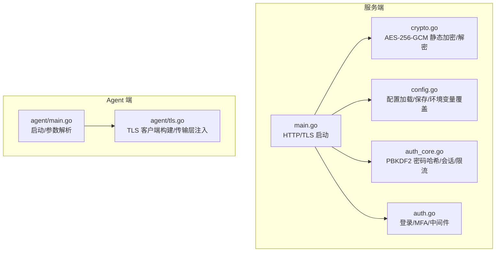
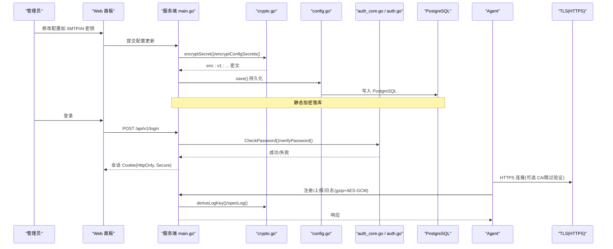
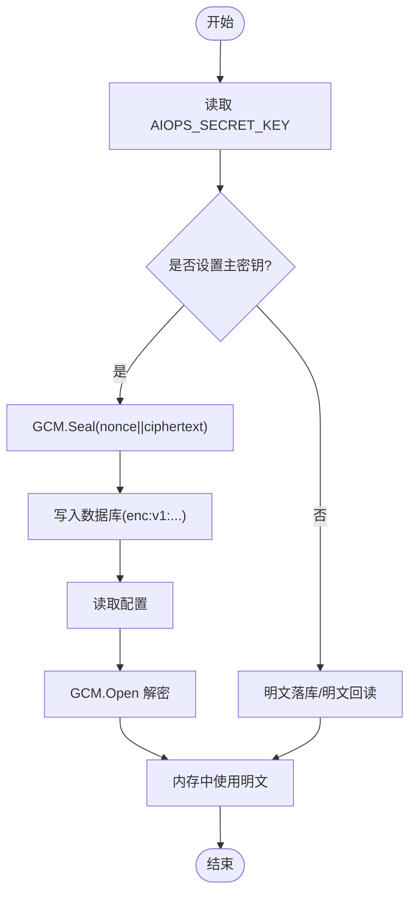
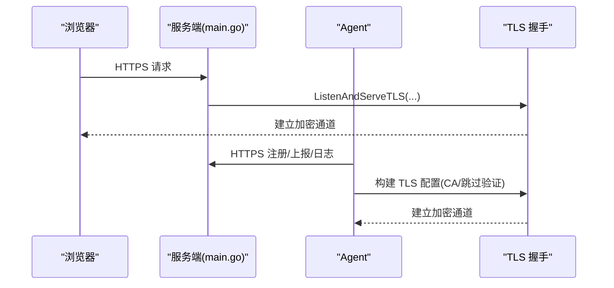
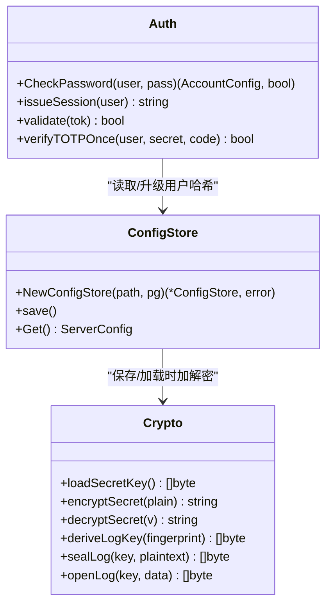
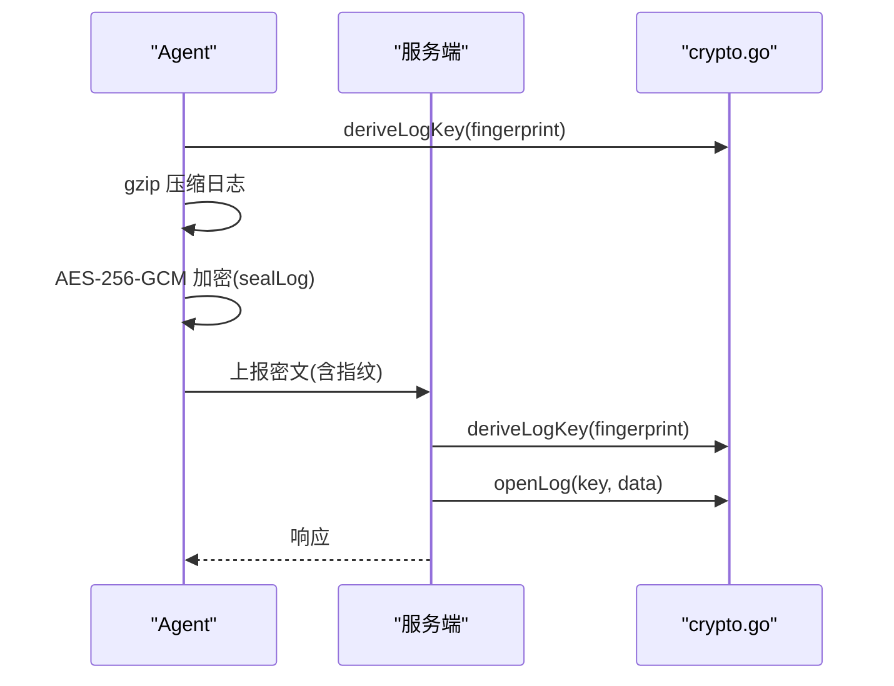
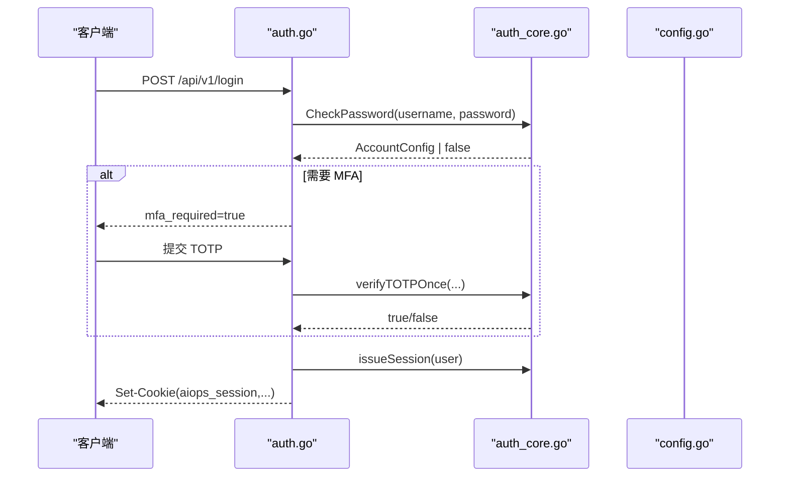
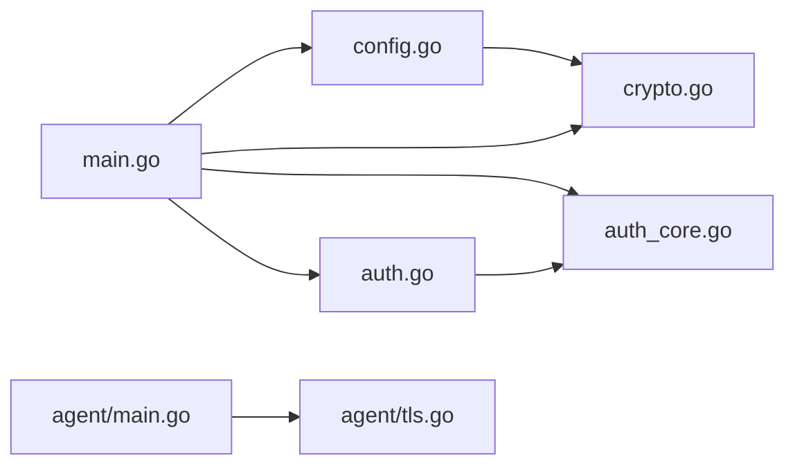

# 数据加密与安全存储

<cite>
**本文引用的文件**   
- [cmd/server/crypto.go](file://cmd/server/crypto.go)
- [cmd/server/auth_core.go](file://cmd/server/auth_core.go)
- [cmd/server/auth.go](file://cmd/server/auth.go)
- [cmd/server/config.go](file://cmd/server/config.go)
- [cmd/server/main.go](file://cmd/server/main.go)
- [cmd/agent/tls.go](file://cmd/agent/tls.go)
- [cmd/agent/main.go](file://cmd/agent/main.go)
- [docker-compose.yml](file://docker-compose.yml)
</cite>

## 目录
1. [简介](#简介)
2. [项目结构](#项目结构)
3. [核心组件](#核心组件)
4. [架构总览](#架构总览)
5. [详细组件分析](#详细组件分析)
6. [依赖关系分析](#依赖关系分析)
7. [性能考虑](#性能考虑)
8. [故障排查指南](#故障排查指南)
9. [结论](#结论)
10. [附录](#附录)

## 简介
本文件聚焦于 AIOps Monitor 的数据加密与安全存储实现，覆盖以下关键主题：
- 静态数据加密：AES-256-GCM 配置密钥落库、主密钥管理、兼容迁移策略
- 数据传输加密：TLS/HTTPS 服务端与 Agent 侧证书校验、CA 信任链与跳过验证的边界
- 敏感数据处理：密码哈希（PBKDF2-HMAC-SHA256）、随机数生成、安全比较函数
- 日志传输加密：Agent→Server 的 gzip + AES-256-GCM 上报流程
- 最佳实践：密钥轮换、备份加密、日志脱敏
- 性能优化、兼容性考量与安全审计要求

## 项目结构
围绕“加密与安全”的核心代码主要分布在服务端与 Agent 端：
- 服务端
  - 配置与静态加密：crypto.go、config.go
  - 认证与口令哈希：auth_core.go、auth.go
  - 启动与 TLS 监听：main.go
- Agent 端
  - TLS 客户端配置：tls.go
  - 启动参数与默认行为：main.go
- 部署与环境变量：docker-compose.yml

图表来源
- [cmd/server/main.go:227-355](file://cmd/server/main.go#L227-L355)
- [cmd/server/crypto.go:1-205](file://cmd/server/crypto.go#L1-L205)
- [cmd/server/config.go:543-599](file://cmd/server/config.go#L543-L599)
- [cmd/server/auth_core.go:1-120](file://cmd/server/auth_core.go#L1-L120)
- [cmd/server/auth.go:110-172](file://cmd/server/auth.go#L110-L172)
- [cmd/agent/main.go:74-136](file://cmd/agent/main.go#L74-L136)
- [cmd/agent/tls.go:1-74](file://cmd/agent/tls.go#L1-L74)

章节来源
- [cmd/server/main.go:227-355](file://cmd/server/main.go#L227-L355)
- [cmd/server/crypto.go:1-205](file://cmd/server/crypto.go#L1-L205)
- [cmd/server/config.go:543-599](file://cmd/server/config.go#L543-L599)
- [cmd/server/auth_core.go:1-120](file://cmd/server/auth_core.go#L1-L120)
- [cmd/server/auth.go:110-172](file://cmd/server/auth.go#L110-L172)
- [cmd/agent/main.go:74-136](file://cmd/agent/main.go#L74-L136)
- [cmd/agent/tls.go:1-74](file://cmd/agent/tls.go#L1-L74)

## 核心组件
- 静态加密（AES-256-GCM）
  - 主密钥派生：从环境变量 AIOPS_SECRET_KEY 经 SHA-256 派生 32 字节 AES 密钥
  - 可逆凭据加密：MFA 种子、SMTP/AI/Webhook/中继密钥等字段在落库前进行 GCM 密封
  - 向后兼容：未设置主密钥时明文落库；已加密值无主密钥则返回空串并告警
- 密码哈希（PBKDF2-HMAC-SHA256）
  - 迭代次数 600k，自描述格式，支持旧版单轮 SHA-256 无缝升级
  - 使用常量时间比较避免时序攻击
- 随机数与安全比较
  - 会话令牌、TOTP 相关随机源来自 crypto/rand
  - 所有敏感比较使用 subtle.ConstantTimeCompare
- 日志传输加密（gzip + AES-256-GCM）
  - 基于 Agent 指纹与服务端主密钥派生 per-agent 日志密钥
  - Agent 压缩后加密上报，服务端按指纹重算同一密钥解密

章节来源
- [cmd/server/crypto.go:28-103](file://cmd/server/crypto.go#L28-L103)
- [cmd/server/crypto.go:120-173](file://cmd/server/crypto.go#L120-L173)
- [cmd/server/auth_core.go:22-88](file://cmd/server/auth_core.go#L22-L88)
- [cmd/server/auth_core.go:287-295](file://cmd/server/auth_core.go#L287-L295)

## 架构总览
下图展示“静态加密 + 传输加密 + 敏感处理”的整体链路。

图表来源
- [cmd/server/main.go:227-355](file://cmd/server/main.go#L227-L355)
- [cmd/server/crypto.go:44-103](file://cmd/server/crypto.go#L44-L103)
- [cmd/server/config.go:543-599](file://cmd/server/config.go#L543-L599)
- [cmd/server/auth_core.go:297-321](file://cmd/server/auth_core.go#L297-L321)
- [cmd/server/auth.go:176-206](file://cmd/server/auth.go#L176-L206)
- [cmd/agent/tls.go:17-39](file://cmd/agent/tls.go#L17-L39)
- [cmd/agent/main.go:122-136](file://cmd/agent/main.go#L122-L136)

## 详细组件分析

### 静态数据加密（AES-256-GCM）
- 主密钥派生与开关
  - 通过 AIOPS_SECRET_KEY 派生 32 字节 AES 密钥；未设置则关闭静态加密
- 可逆凭据加密/解密
  - 以 enc:v1: 为前缀标记密文；无主密钥或无法解密时返回空串并记录错误
- 配置保存/加载
  - 内存中保持明文以便运行期使用；持久化时对副本执行加密
  - 加载后对内存配置执行解密，保证向后兼容（明文值直接可用）

图表来源
- [cmd/server/crypto.go:28-103](file://cmd/server/crypto.go#L28-L103)
- [cmd/server/crypto.go:175-205](file://cmd/server/crypto.go#L175-L205)
- [cmd/server/config.go:543-599](file://cmd/server/config.go#L543-L599)

章节来源
- [cmd/server/crypto.go:28-103](file://cmd/server/crypto.go#L28-L103)
- [cmd/server/crypto.go:175-205](file://cmd/server/crypto.go#L175-L205)
- [cmd/server/config.go:543-599](file://cmd/server/config.go#L543-L599)

### 密钥管理策略与轮换
- 主密钥来源
  - 环境变量 AIOPS_SECRET_KEY；生产环境建议长随机串并妥善备份
- 影响范围
  - MFA 种子、SMTP/AI/Webhook/中继密钥、短信/语音电话鉴权信息等
- 轮换策略建议
  - 新主密钥启用后，下次保存配置即自动重新加密；旧值仍可读但不再被重写
  - 若丢失主密钥，已加密凭据不可恢复；需提前离线备份主密钥
  - 建议将主密钥纳入企业密钥管理系统（KMS），定期轮换并保留历史版本用于解密历史数据

章节来源
- [cmd/server/crypto.go:28-43](file://cmd/server/crypto.go#L28-L43)
- [cmd/server/crypto.go:175-205](file://cmd/server/crypto.go#L175-L205)
- [docker-compose.yml:64-78](file://docker-compose.yml#L64-L78)

### 配置文件加密存储
- 落库路径
  - 统一持久化至 PostgreSQL（关系数据），同时支持 JSON 文件作为兼容路径
- 加密时机
  - 保存时对配置副本执行 encryptConfigSecrets；加载后对内存配置执行 decryptConfigSecrets
- 兼容性与回退
  - 未设置主密钥时，明文值仍可读写；存在密文但未设置主密钥时，解密失败返回空串并告警

章节来源
- [cmd/server/config.go:543-599](file://cmd/server/config.go#L543-L599)
- [cmd/server/crypto.go:175-205](file://cmd/server/crypto.go#L175-L205)

### 数据传输加密（TLS/HTTPS）
- 服务端
  - 当提供 AIOPS_TLS_CERT/AIOPS_TLS_KEY 时以 HTTPS 提供服务；否则明文 HTTP（建议置于反向代理之后）
  - isHTTPS(r) 控制 Cookie Secure 标志
- Agent 端
  - 支持自定义 CA 证书与跳过校验（仅临时/内网自签场景）
  - 全局注入 http.Transport 的 TLSClientConfig，确保所有出站请求均受控

图表来源
- [cmd/server/main.go:335-355](file://cmd/server/main.go#L335-L355)
- [cmd/agent/tls.go:17-39](file://cmd/agent/tls.go#L17-L39)
- [cmd/agent/tls.go:41-73](file://cmd/agent/tls.go#L41-L73)
- [cmd/agent/main.go:122-136](file://cmd/agent/main.go#L122-L136)

章节来源
- [cmd/server/main.go:335-355](file://cmd/server/main.go#L335-L355)
- [cmd/agent/tls.go:17-39](file://cmd/agent/tls.go#L17-L39)
- [cmd/agent/tls.go:41-73](file://cmd/agent/tls.go#L41-L73)
- [cmd/agent/main.go:122-136](file://cmd/agent/main.go#L122-L136)

### 敏感数据处理（密码哈希、随机数、安全比较）
- 密码哈希
  - PBKDF2-HMAC-SHA256，迭代 600k；自描述格式便于未来升级
  - 旧版单轮 SHA-256 在首次成功登录后透明升级为 PBKDF2
- 随机数
  - 会话令牌、验证码等使用 crypto/rand，失败直接 panic，避免弱随机
- 安全比较
  - verifyPassword 使用 subtle.ConstantTimeCompare 防止时序侧信道

图表来源
- [cmd/server/auth_core.go:297-321](file://cmd/server/auth_core.go#L297-L321)
- [cmd/server/auth_core.go:287-295](file://cmd/server/auth_core.go#L287-L295)
- [cmd/server/crypto.go:28-103](file://cmd/server/crypto.go#L28-L103)
- [cmd/server/config.go:543-599](file://cmd/server/config.go#L543-L599)

章节来源
- [cmd/server/auth_core.go:22-88](file://cmd/server/auth_core.go#L22-L88)
- [cmd/server/auth_core.go:297-321](file://cmd/server/auth_core.go#L297-L321)
- [cmd/server/crypto.go:28-103](file://cmd/server/crypto.go#L28-L103)
- [cmd/server/config.go:543-599](file://cmd/server/config.go#L543-L599)

### 日志传输加密（Agent→Server）
- 密钥派生
  - 基于服务端主密钥 + Agent 指纹，每 Agent 独立密钥，无需在服务端持久化 per-agent 密钥
- 上报流程
  - Agent 先 gzip 压缩，再 AES-256-GCM 加密；携带指纹头供服务端重算密钥
  - 服务端 openLog 解密并解压，限制最大体积

图表来源
- [cmd/server/crypto.go:120-173](file://cmd/server/crypto.go#L120-L173)
- [cmd/agent/main.go:107-120](file://cmd/agent/main.go#L107-L120)

章节来源
- [cmd/server/crypto.go:120-173](file://cmd/server/crypto.go#L120-L173)
- [cmd/agent/main.go:107-120](file://cmd/agent/main.go#L107-L120)

### 登录与会话安全（含 MFA）
- 登录流程
  - 用户名/手机号登录 → 密码校验（PBKDF2）→ TOTP 二次校验（如启用）→ 签发会话 Cookie
- 会话保护
  - HttpOnly + SameSite=Lax；HTTPS 下自动 Secure；滑动空闲超时与绝对过期双重保护
- 限流与防暴力破解
  - IP 维度与账号维度双限流；终端二次密码尝试锁定

图表来源
- [cmd/server/auth.go:176-206](file://cmd/server/auth.go#L176-L206)
- [cmd/server/auth_core.go:297-321](file://cmd/server/auth_core.go#L297-L321)
- [cmd/server/auth_core.go:380-402](file://cmd/server/auth_core.go#L380-L402)

章节来源
- [cmd/server/auth.go:176-206](file://cmd/server/auth.go#L176-L206)
- [cmd/server/auth_core.go:297-321](file://cmd/server/auth_core.go#L297-L321)
- [cmd/server/auth_core.go:380-402](file://cmd/server/auth_core.go#L380-L402)

## 依赖关系分析
- 模块耦合
  - main.go 负责启动、中间件链与 TLS 监听，依赖 config.go、crypto.go、auth_core.go、auth.go
  - config.go 在保存/加载时调用 crypto.go 的加解密函数
  - auth_core.go 提供密码哈希与会话管理，被 auth.go 的登录流程调用
  - agent/tls.go 为 Agent 所有出站 HTTP 请求注入 TLS 配置
- 外部依赖
  - PostgreSQL（关系数据）、VictoriaMetrics（时序数据）
  - 操作系统 CSPRNG（crypto/rand）

图表来源
- [cmd/server/main.go:227-355](file://cmd/server/main.go#L227-L355)
- [cmd/server/config.go:543-599](file://cmd/server/config.go#L543-L599)
- [cmd/server/crypto.go:1-205](file://cmd/server/crypto.go#L1-L205)
- [cmd/server/auth_core.go:1-120](file://cmd/server/auth_core.go#L1-L120)
- [cmd/server/auth.go:110-172](file://cmd/server/auth.go#L110-L172)
- [cmd/agent/main.go:74-136](file://cmd/agent/main.go#L74-L136)
- [cmd/agent/tls.go:1-74](file://cmd/agent/tls.go#L1-L74)

章节来源
- [cmd/server/main.go:227-355](file://cmd/server/main.go#L227-L355)
- [cmd/server/config.go:543-599](file://cmd/server/config.go#L543-L599)
- [cmd/server/crypto.go:1-205](file://cmd/server/crypto.go#L1-L205)
- [cmd/server/auth_core.go:1-120](file://cmd/server/auth_core.go#L1-L120)
- [cmd/server/auth.go:110-172](file://cmd/server/auth.go#L110-L172)
- [cmd/agent/main.go:74-136](file://cmd/agent/main.go#L74-L136)
- [cmd/agent/tls.go:1-74](file://cmd/agent/tls.go#L1-L74)

## 性能考虑
- 静态加密
  - AES-256-GCM 计算开销低；仅在配置保存/加载时触发，对热路径影响可忽略
- 日志传输加密
  - gzip 压缩在前，显著降低带宽；GCM 加解密在 CPU 上高效
- 密码哈希
  - PBKDF2 迭代 600k 带来一定 CPU 成本，但提升抗暴力破解能力；登录频率可控
- TLS
  - 启用 HTTPS 会增加握手开销，但可通过会话复用与反向代理终止优化

[本节为通用指导，不直接分析具体文件]

## 故障排查指南
- 未设置 AIOPS_SECRET_KEY
  - 现象：配置中的密文字段无法解密，相关凭据不可用
  - 处理：设置 AIOPS_SECRET_KEY 并确保与历史一致；必要时恢复备份
- 主密钥变更导致无法解密
  - 现象：已有密文无法打开
  - 处理：恢复旧主密钥或使用 KMS 多版本密钥；重新保存配置以迁移到新密钥
- TLS 证书问题
  - 现象：Agent 无法连接服务端
  - 处理：检查 CA 证书路径与格式；谨慎使用跳过验证选项
- 登录失败过多
  - 现象：IP/账号维度被限流
  - 处理：等待窗口过期或调整策略；确认是否存在异常流量

章节来源
- [cmd/server/crypto.go:73-103](file://cmd/server/crypto.go#L73-L103)
- [cmd/server/main.go:335-355](file://cmd/server/main.go#L335-L355)
- [cmd/agent/tls.go:17-39](file://cmd/agent/tls.go#L17-L39)
- [cmd/server/auth_core.go:182-253](file://cmd/server/auth_core.go#L182-L253)

## 结论
本项目实现了完善的静态加密与传输加密体系：
- 静态加密：AES-256-GCM + 主密钥管理，兼容迁移与失败安全
- 传输加密：服务端可选 HTTPS，Agent 侧支持自定义 CA 与严格校验
- 敏感处理：PBKDF2 高强度哈希、强随机源、常量时间比较
- 日志加密：per-agent 密钥派生，压缩后加密上报
建议在生产环境中强制启用 HTTPS、妥善保管主密钥、定期轮换并纳入企业密钥管理体系。

[本节为总结性内容，不直接分析具体文件]

## 附录

### 环境变量与配置项速查
- AIOPS_SECRET_KEY：配置密钥落库主密钥（强烈建议）
- AIOPS_TLS_CERT / AIOPS_TLS_KEY：TLS 证书/私钥路径（可选）
- docker-compose.yml 示例包含上述变量的占位与注释说明

章节来源
- [docker-compose.yml:64-78](file://docker-compose.yml#L64-L78)