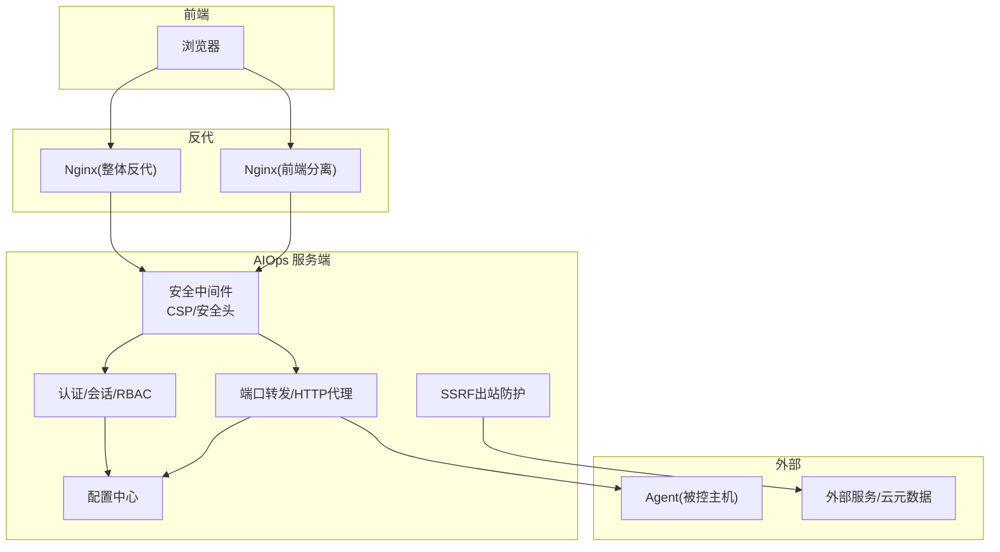
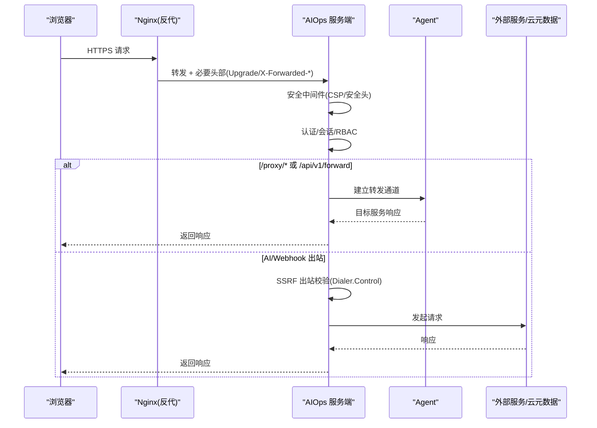
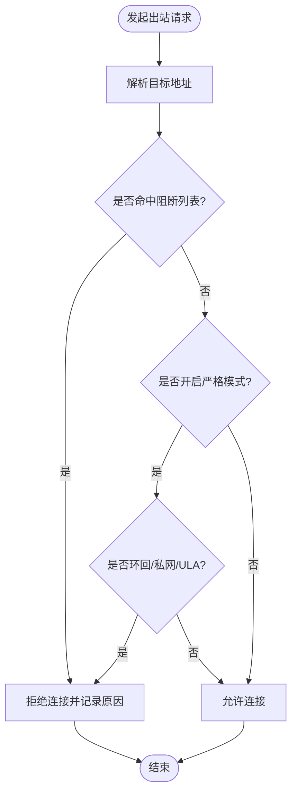
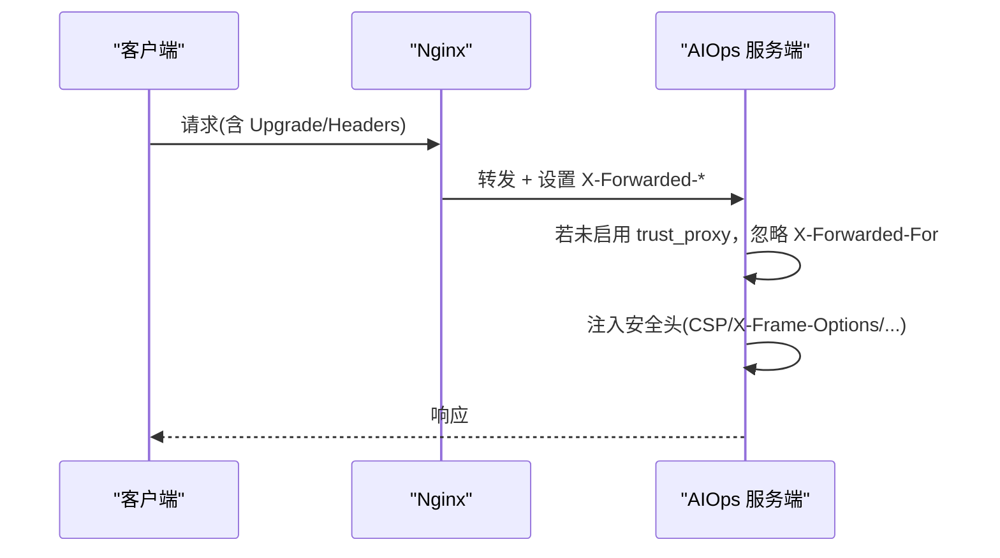
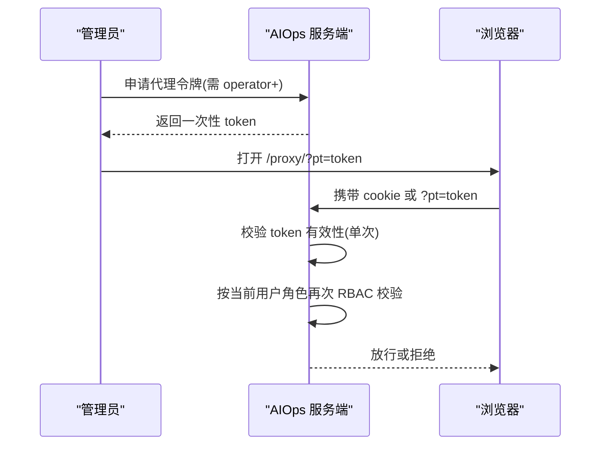
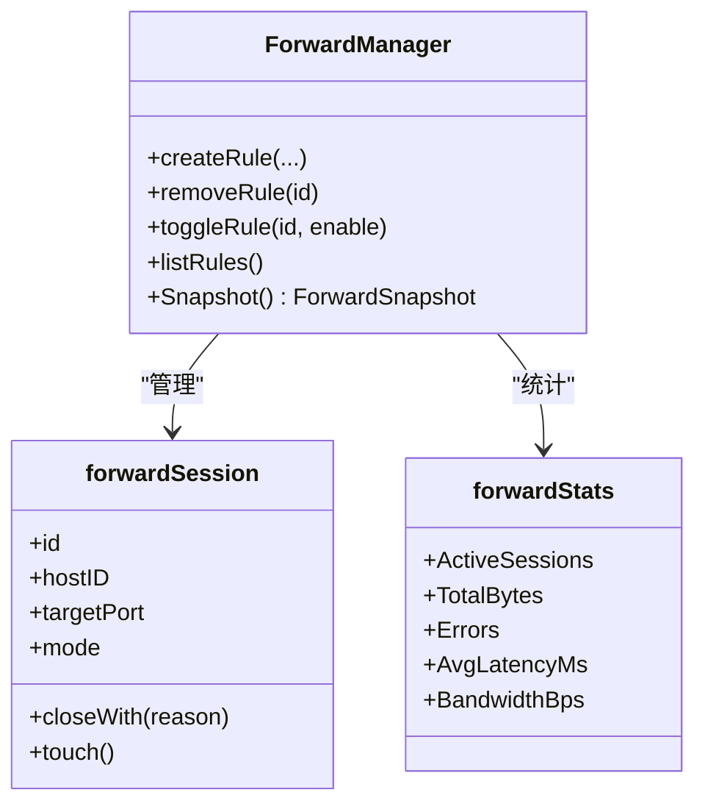
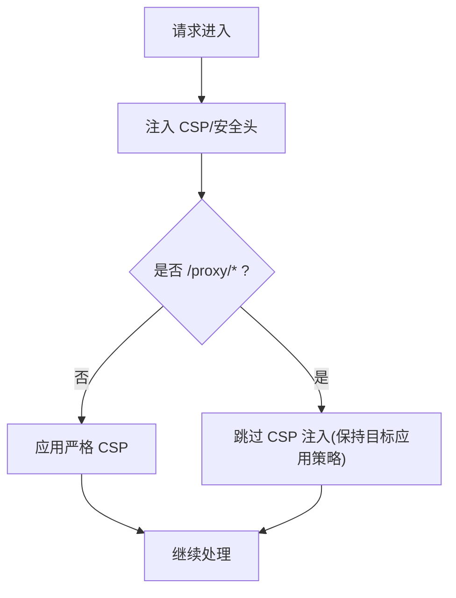
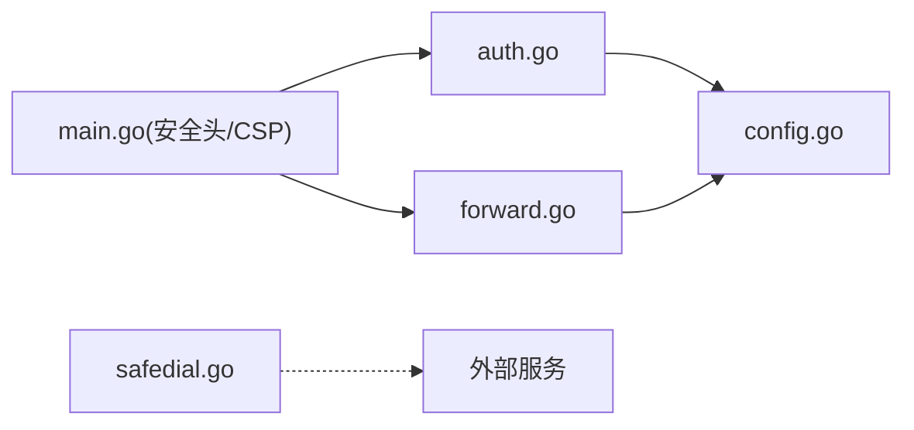

# 网络安全与防护

<cite>
**本文引用的文件**   
- [safedial.go](file://cmd/server/safedial.go)
- [auth.go](file://cmd/server/auth.go)
- [auth_core.go](file://cmd/server/auth_core.go)
- [forward.go](file://cmd/server/forward.go)
- [config.go](file://cmd/server/config.go)
- [nginx-aiops.conf](file://deploy/nginx-aiops.conf)
- [nginx-frontend.conf](file://docker/nginx/nginx-frontend.conf)
- [helpers.go](file://cmd/server/helpers.go)
- [main.go](file://cmd/server/main.go)
- [README.md](file://README.md)
</cite>

## 目录
1. [简介](#简介)
2. [项目结构](#项目结构)
3. [核心组件](#核心组件)
4. [架构总览](#架构总览)
5. [详细组件分析](#详细组件分析)
6. [依赖关系分析](#依赖关系分析)
7. [性能与安全权衡](#性能与安全权衡)
8. [故障排查指南](#故障排查指南)
9. [结论](#结论)
10. [附录](#附录)

## 简介
本文件面向 AIOps Monitor 的网络安全与防护实践，聚焦以下主题：
- SSRF（服务器端请求伪造）出站防护：白名单/黑名单策略、内网地址检测、端口限制思路
- 反向代理安全配置：X-Forwarded-For 处理、来源 IP 验证、代理令牌机制
- 端口转发安全控制：指纹/会话校验、连接限制、访问审计
- Web 安全防护：CORS、CSRF、XSS 加固
- 系统级安全加固：网络层、防火墙规则、入侵检测建议

## 项目结构
围绕安全能力的相关代码主要分布在服务端模块中：
- 出站 SSRF 防护：基于 Dialer.Control 在真实连接前对目标 IP 进行拦截
- 认证与会话：登录、MFA、RBAC、代理令牌、限流
- 端口转发与 HTTP 代理：TCP/UDP 映射、HTTP 无状态代理、WebSocket 透传
- 反向代理示例：Nginx 配置模板，含 WebSocket 升级与安全头
- 配置中心：信任代理、CORS、转发监听地址与端口范围等

图表来源
- [main.go:109-136](file://cmd/server/main.go#L109-L136)
- [auth.go:112-172](file://cmd/server/auth.go#L112-L172)
- [forward.go:1210-1553](file://cmd/server/forward.go#L1210-L1553)
- [config.go:702-770](file://cmd/server/config.go#L702-L770)
- [safedial.go:1-96](file://cmd/server/safedial.go#L1-L96)

章节来源
- [README.md:556-573](file://README.md#L556-L573)

## 核心组件
- SSRF 出站防护：通过自定义 Dialer.Control 钩子，在 DNS 解析后、connect 前对实际目标 IP 做阻断，默认拒绝云元数据与链路本地地址；支持严格模式额外拒绝环回与私网段。
- 认证与会话：登录限流、TOTP MFA、全局 MFA 强制、RBAC 路由授权、一次性代理令牌（proxy_token）。
- 端口转发与 HTTP 代理：TCP/UDP 长连接隧道、HTTP 无状态代理、WebSocket 透传；内置会话上限、空闲超时、带宽/延迟统计与审计日志。
- 反向代理配置：Nginx 模板提供 Upgrade 头、关闭缓冲、长超时、安全响应头等关键配置。
- 配置项：trust_proxy、CORSOrigins、forward_listen、forward_port_range、relay_secret 等。

章节来源
- [safedial.go:1-96](file://cmd/server/safedial.go#L1-L96)
- [auth.go:112-172](file://cmd/server/auth.go#L112-L172)
- [auth_core.go:178-204](file://cmd/server/auth_core.go#L178-L204)
- [forward.go:32-41](file://cmd/server/forward.go#L32-L41)
- [config.go:702-770](file://cmd/server/config.go#L702-L770)

## 架构总览
下图展示从浏览器到后端、再到 Agent 与外部服务的典型路径，以及各安全控制点的位置。

图表来源
- [nginx-aiops.conf:30-58](file://deploy/nginx-aiops.conf#L30-L58)
- [main.go:109-136](file://cmd/server/main.go#L109-L136)
- [auth.go:112-172](file://cmd/server/auth.go#L112-L172)
- [forward.go:1210-1553](file://cmd/server/forward.go#L1210-L1553)
- [safedial.go:67-96](file://cmd/server/safedial.go#L67-L96)

## 详细组件分析

### SSRF 出站防护
- 设计要点
  - 拦截点：net.Dialer.Control，DNS 解析后、connect 前对实际 IP 校验，天然覆盖重定向与 DNS Rebinding。
  - 默认策略：拒绝云元数据地址与链路本地地址（含 IPv6 fe80::/10），避免 IAM 凭据泄露。
  - 严格模式：AIOPS_SSRF_STRICT=true 时，额外拒绝环回与 RFC1918 私网/ULA，适合强隔离场景。
  - 适用范围：仅用于“用户可影响 URL”的出站（如 AI Endpoint、通知 Webhook）。
- 实现要点
  - 使用原子变量缓存严格模式开关，减少环境读取开销。
  - 为出站请求构造专用 http.Client，复用连接池并设置合理超时。

图表来源
- [safedial.go:40-78](file://cmd/server/safedial.go#L40-L78)
- [safedial.go:80-96](file://cmd/server/safedial.go#L80-L96)

章节来源
- [safedial.go:1-96](file://cmd/server/safedial.go#L1-L96)

### 反向代理安全配置
- X-Forwarded-For 与来源 IP 验证
  - Nginx 模板会设置 Host、X-Real-IP、X-Forwarded-For、X-Forwarded-Proto 等头部。
  - 服务端默认忽略这些 IP 头以防伪造；仅在显式启用 trust_proxy 后才采信，用于登录限流与审计。
- WebSocket 升级与长连接
  - 必须转发 Upgrade 与 Connection 头，关闭缓冲，拉长超时，否则终端/实时推送不可用。
- 安全响应头
  - 服务端统一添加 X-Content-Type-Options、X-Frame-Options、Referrer-Policy、CSP 等。

图表来源
- [nginx-aiops.conf:30-58](file://deploy/nginx-aiops.conf#L30-L58)
- [nginx-frontend.conf:73-125](file://docker/nginx/nginx-frontend.conf#L73-L125)
- [helpers.go:41-61](file://cmd/server/helpers.go#L41-L61)
- [main.go:109-136](file://cmd/server/main.go#L109-L136)
- [config.go:763-770](file://cmd/server/config.go#L763-L770)

章节来源
- [nginx-aiops.conf:30-58](file://deploy/nginx-aiops.conf#L30-L58)
- [nginx-frontend.conf:73-125](file://docker/nginx/nginx-frontend.conf#L73-L125)
- [helpers.go:41-61](file://cmd/server/helpers.go#L41-L61)
- [main.go:109-136](file://cmd/server/main.go#L109-L136)
- [config.go:763-770](file://cmd/server/config.go#L763-L770)

### 代理令牌机制（/proxy/ 一次性鉴权）
- 适用场景：新标签页 window.open() 打开 /proxy/ 链接时，无需依赖跨上下文 Cookie。
- 机制要点
  - 服务端签发一次性 proxy_token（短 TTL），优先从 Cookie 读取，其次从查询参数 pt 回退。
  - 校验通过后仍按当前用户角色执行 RBAC 复核，防止签发后被降权越权。
  - 令牌单次使用，校验后立即失效。

图表来源
- [auth.go:130-152](file://cmd/server/auth.go#L130-L152)
- [auth_core.go:157-176](file://cmd/server/auth_core.go#L157-L176)

章节来源
- [auth.go:130-152](file://cmd/server/auth.go#L130-L152)
- [auth_core.go:157-176](file://cmd/server/auth_core.go#L157-L176)

### 端口转发安全控制
- 功能概览
  - TCP/UDP 端口映射：持久化规则、自动分配端口、组管理（批量端口）、启停/编辑/复制/删除。
  - HTTP 反向代理：/proxy/{hostID}/{port}/{path}，支持 WebSocket 升级。
- 安全控制
  - 全局开关：可通过配置或环境变量禁用转发。
  - 监听地址：默认绑定 127.0.0.1，避免对外暴露；Docker 部署需显式设为 0.0.0.0 并通过防火墙限制来源。
  - 连接限制：最大并发会话数、空闲超时、请求体大小限制、响应体大小限制。
  - 审计日志：创建/删除/连接建立与关闭均记录操作者、主机、端口、原因等。
  - 健康检查：/api/v1/forward/health 返回启用状态与限制信息。

图表来源
- [forward.go:234-258](file://cmd/server/forward.go#L234-L258)
- [forward.go:137-183](file://cmd/server/forward.go#L137-L183)
- [forward.go:56-135](file://cmd/server/forward.go#L56-L135)

章节来源
- [forward.go:32-41](file://cmd/server/forward.go#L32-L41)
- [forward.go:567-641](file://cmd/server/forward.go#L567-L641)
- [forward.go:1054-1159](file://cmd/server/forward.go#L1054-L1159)
- [forward.go:1210-1553](file://cmd/server/forward.go#L1210-L1553)
- [config.go:702-770](file://cmd/server/config.go#L702-L770)

### CORS、CSRF、XSS 防护
- CORS
  - 支持配置受信源列表；为空时兼容旧版通配行为。
- CSRF
  - 服务端未实现传统表单 CSRF Token；通过严格的 CSP 与同源策略降低风险。
- XSS
  - 服务端统一注入 CSP，限制脚本来源为 'self'，禁止 object/base/form-action/frame-ancestors 等危险特性。
  - 前端将内联事件处理器迁移为事件委托，避免拼接 JS 字符串导致的 DOM XSS。
  - 静态资源与 SW 缓存策略配合，减少恶意注入面。

图表来源
- [main.go:109-136](file://cmd/server/main.go#L109-L136)
- [config.go:772-778](file://cmd/server/config.go#L772-L778)
- [init.js:772-792](file://cmd/server/web/js/init.js#L772-L792)

章节来源
- [main.go:109-136](file://cmd/server/main.go#L109-L136)
- [config.go:772-778](file://cmd/server/config.go#L772-L778)
- [init.js:772-792](file://cmd/server/web/js/init.js#L772-L792)

## 依赖关系分析
- 组件耦合
  - auth.go 依赖 config.go 的角色与全局策略（MFARequired、TrustProxy、RelaySecret）。
  - forward.go 依赖 config.go 的转发开关、监听地址与端口范围。
  - safedial.go 独立于业务逻辑，作为通用出站防护工具被调用。
- 外部依赖
  - Nginx 模板作为前置反代，负责 TLS 终止、WebSocket 升级与安全头。
  - 可选中继模式通过 X-Relay-Secret 校验上游可信性。

图表来源
- [auth.go:112-172](file://cmd/server/auth.go#L112-L172)
- [forward.go:1210-1553](file://cmd/server/forward.go#L1210-L1553)
- [config.go:702-770](file://cmd/server/config.go#L702-L770)
- [main.go:109-136](file://cmd/server/main.go#L109-L136)
- [safedial.go:67-96](file://cmd/server/safedial.go#L67-L96)

章节来源
- [auth.go:112-172](file://cmd/server/auth.go#L112-L172)
- [forward.go:1210-1553](file://cmd/server/forward.go#L1210-L1553)
- [config.go:702-770](file://cmd/server/config.go#L702-L770)
- [main.go:109-136](file://cmd/server/main.go#L109-L136)
- [safedial.go:67-96](file://cmd/server/safedial.go#L67-L96)

## 性能与安全权衡
- 会话与连接
  - 最大并发会话数限制与空闲超时，避免资源耗尽；HTTP 代理请求体/响应体大小限制防 OOM。
- 传输与缓冲
  - 反代侧关闭缓冲以保障实时性；服务端对上行/下行分别设置超时，兼顾吞吐与稳定性。
- 审计与观测
  - 转发统计包含活跃会话、累计字节、错误率、平均延迟与带宽滑动窗口，便于容量规划与异常定位。

章节来源
- [forward.go:32-41](file://cmd/server/forward.go#L32-L41)
- [forward.go:56-135](file://cmd/server/forward.go#L56-L135)
- [nginx-aiops.conf:44-58](file://deploy/nginx-aiops.conf#L44-L58)

## 故障排查指南
- 终端无法连接
  - 检查 Nginx 是否正确转发 Upgrade/Connection 头、关闭缓冲、设置长超时。
- 登录限流触发
  - 确认是否启用 trust_proxy；若经可信反代，需在配置中开启，以便基于真实 IP 限流。
- 转发不可用
  - 检查全局开关、监听地址与端口范围；确认防火墙放行对应端口且来源受限。
- 代理响应异常
  - 查看代理审计日志中的原始响应预览与错误原因；注意请求体/响应体大小限制。

章节来源
- [nginx-aiops.conf:44-58](file://deploy/nginx-aiops.conf#L44-L58)
- [config.go:763-770](file://cmd/server/config.go#L763-L770)
- [forward.go:1210-1553](file://cmd/server/forward.go#L1210-L1553)

## 结论
本项目在 SSRF 出站防护、认证与会话、端口转发与 HTTP 代理、反向代理配置、Web 安全加固等方面提供了较为完善的安全基线。生产部署建议：
- 严格启用 SSRF 严格模式（如不需要内网出站）
- 谨慎开启 trust_proxy，并确保仅由可信反代传入 X-Forwarded-*
- 转发监听默认 127.0.0.1，必要时通过防火墙限制来源
- 结合 Nginx 模板正确配置 WebSocket 与安全头
- 定期审查转发规则与审计日志，收敛最小暴露面

## 附录
- 相关环境变量与配置项参考
  - AIOPS_TRUST_PROXY、AIOPS_FORWARD_LISTEN、AIOPS_FORWARD_PORT_RANGE、AIOPS_RELAY_SECRET、AIOPS_REQUIRE_TOKEN、AIOPS_TERMINAL_DISABLED、AIOPS_FORWARD_DISABLED 等
  - CORSOrigins、MFARequired、RelaySecret 等

章节来源
- [README.md:556-573](file://README.md#L556-L573)
- [config.go:616-651](file://cmd/server/config.go#L616-L651)
- [config.go:772-805](file://cmd/server/config.go#L772-L805)