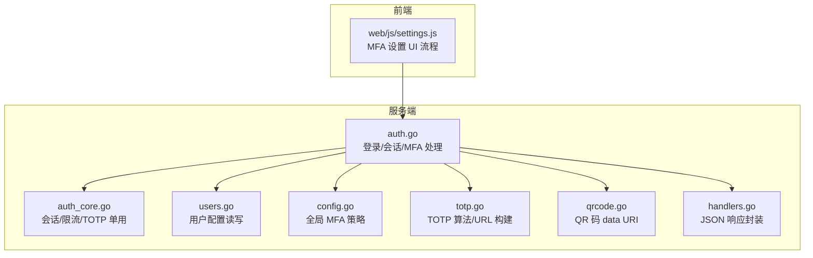
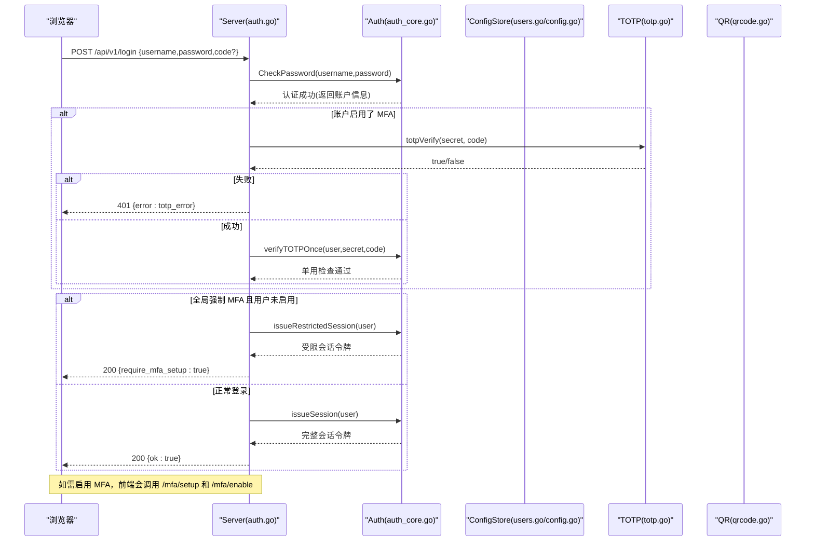
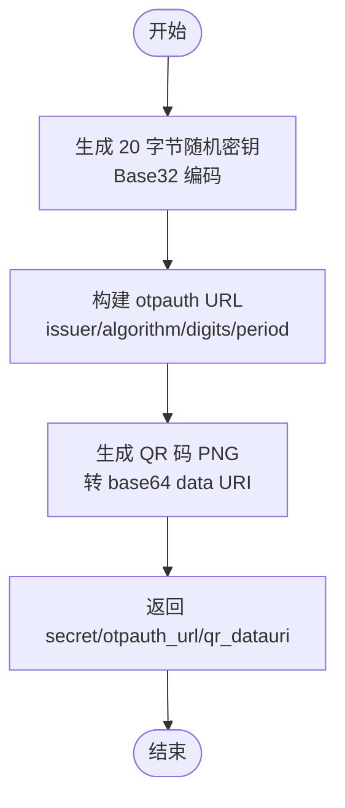
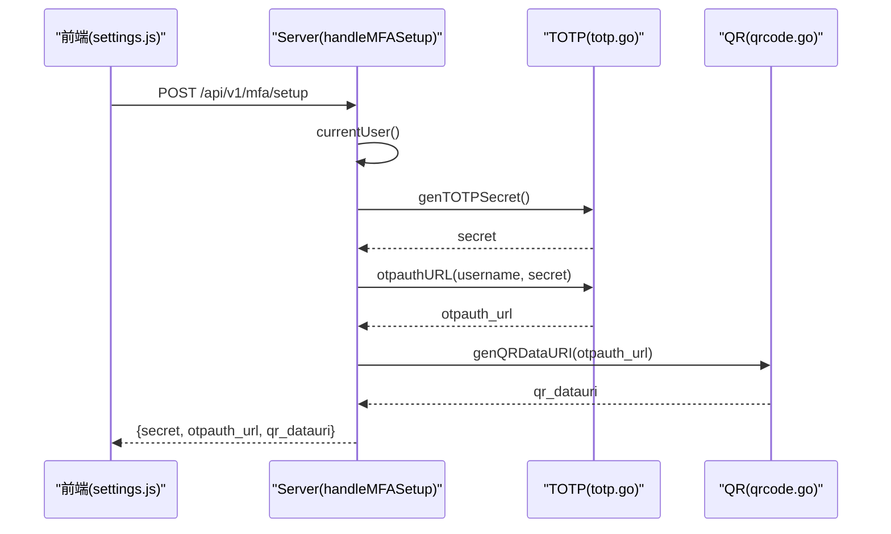
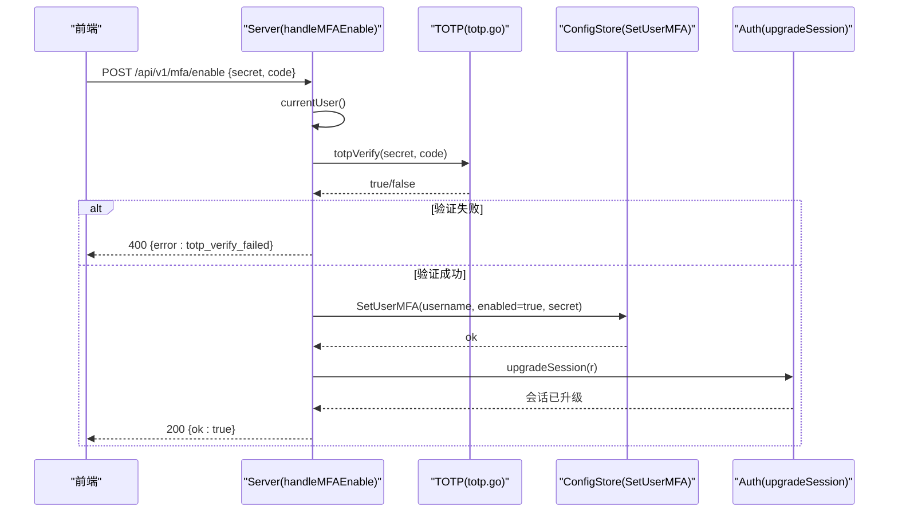
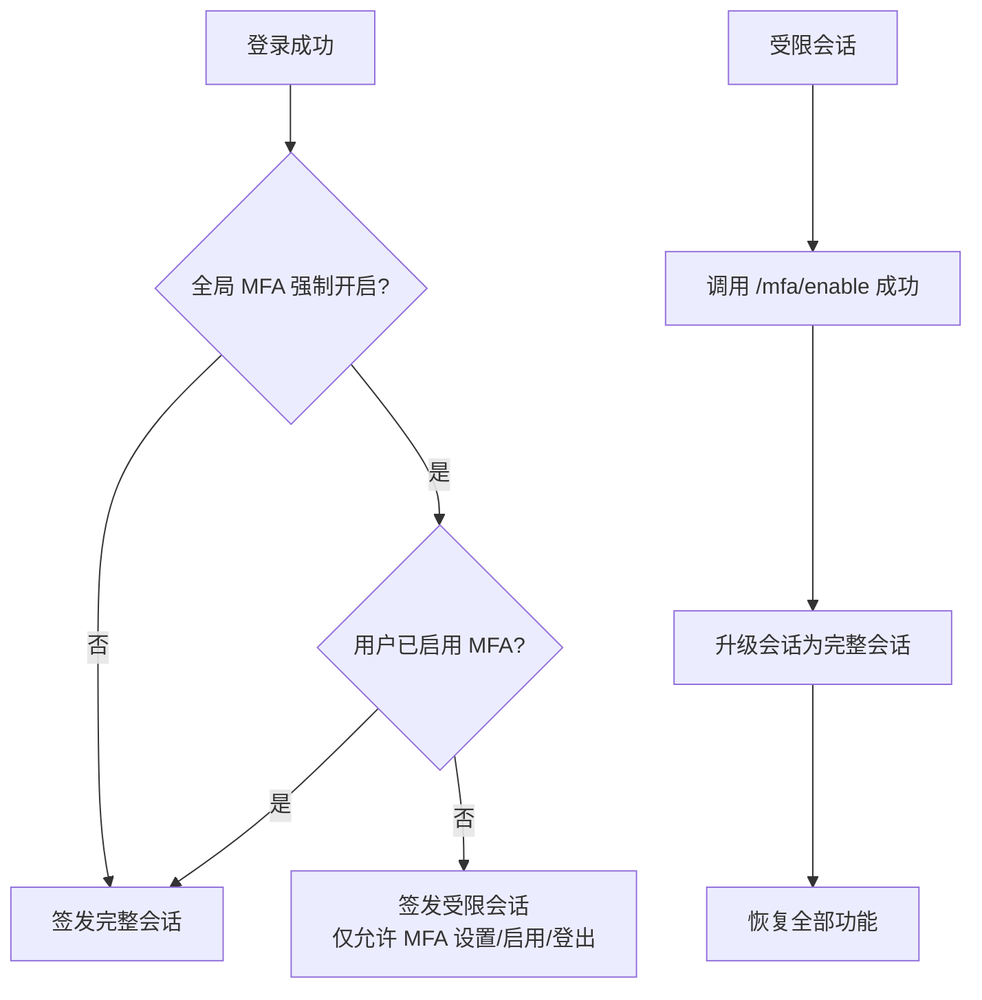
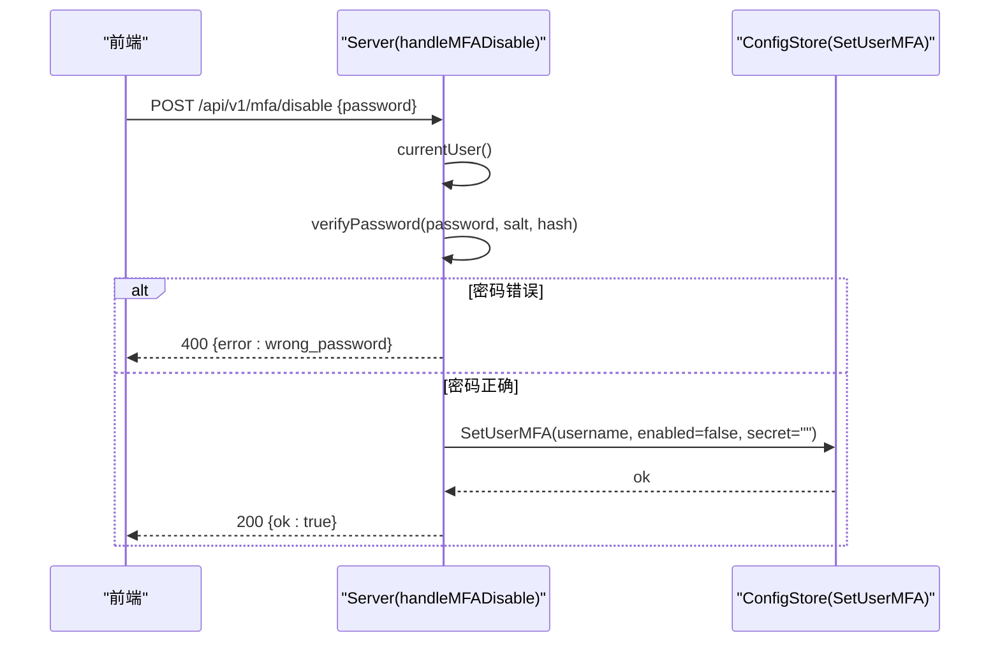
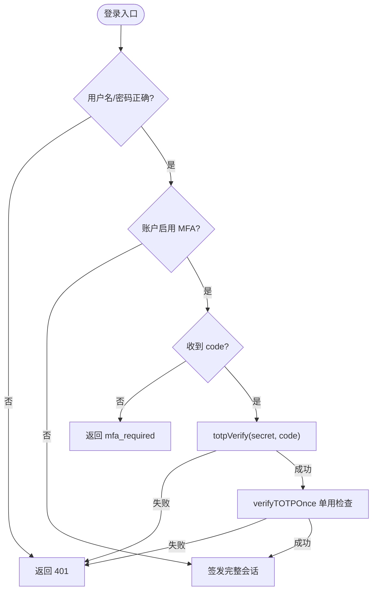
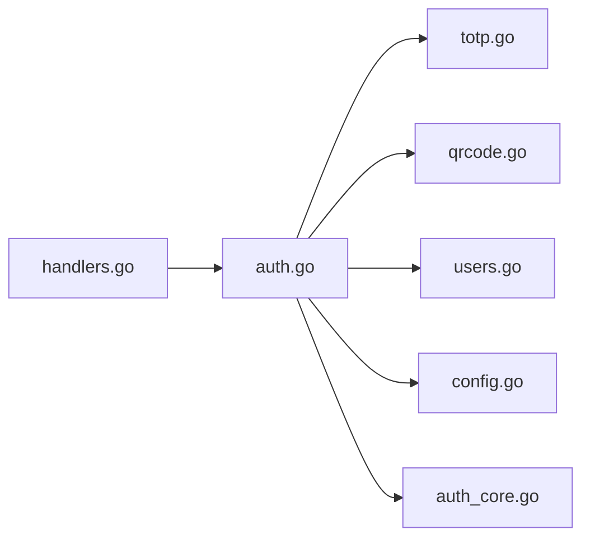

# MFA 双因素认证

<cite>
**本文引用的文件**   
- [cmd/server/totp.go](file://cmd/server/totp.go)
- [cmd/server/auth.go](file://cmd/server/auth.go)
- [cmd/server/auth_core.go](file://cmd/server/auth_core.go)
- [cmd/server/users.go](file://cmd/server/users.go)
- [cmd/server/config.go](file://cmd/server/config.go)
- [cmd/server/qrcode.go](file://cmd/server/qrcode.go)
- [cmd/server/handlers.go](file://cmd/server/handlers.go)
- [cmd/server/web/js/settings.js](file://cmd/server/web/js/settings.js)
</cite>

## 目录
1. [简介](#简介)
2. [项目结构](#项目结构)
3. [核心组件](#核心组件)
4. [架构总览](#架构总览)
5. [详细组件分析](#详细组件分析)
6. [依赖关系分析](#依赖关系分析)
7. [性能与安全考量](#性能与安全考量)
8. [故障排查指南](#故障排查指南)
9. [结论](#结论)
10. [附录：API 接口与错误码](#附录api-接口与错误码)

## 简介
本文件面向 AIOps Monitor 的 MFA（多因素认证）能力，聚焦 TOTP（基于时间的一次性密码）算法实现、密钥与二维码生成、登录二次校验、全局强制策略与会话限制模式，以及禁用流程的安全设计。文档同时提供关键流程图与时序图，帮助读者快速理解端到端交互与数据流。

## 项目结构
MFA 相关逻辑主要分布在以下模块：
- TOTP 算法与工具函数：生成密钥、计算一次性码、验证、构建 otpauth URL
- 认证中间件与会话管理：登录流程、受限会话、单用保护
- 用户配置存储：用户级 MFA 开关与密钥持久化
- 全局策略：管理员可强制所有未启用 MFA 的用户完成绑定
- QR 码生成：将 otpauth URL 编码为前端可直接渲染的 data URI
- 前端设置页：引导用户扫码或手动输入密钥并完成启用

图表来源
- [cmd/server/auth.go:531-615](file://cmd/server/auth.go#L531-L615)
- [cmd/server/auth_core.go:391-432](file://cmd/server/auth_core.go#L391-L432)
- [cmd/server/users.go:335-350](file://cmd/server/users.go#L335-L350)
- [cmd/server/config.go:783-800](file://cmd/server/config.go#L783-L800)
- [cmd/server/totp.go:31-108](file://cmd/server/totp.go#L31-L108)
- [cmd/server/qrcode.go:16-22](file://cmd/server/qrcode.go#L16-L22)
- [cmd/server/handlers.go:352-356](file://cmd/server/handlers.go#L352-L356)
- [cmd/server/web/js/settings.js:1061-1082](file://cmd/server/web/js/settings.js#L1061-L1082)

章节来源
- [cmd/server/auth.go:531-615](file://cmd/server/auth.go#L531-L615)
- [cmd/server/auth_core.go:391-432](file://cmd/server/auth_core.go#L391-L432)
- [cmd/server/users.go:335-350](file://cmd/server/users.go#L335-L350)
- [cmd/server/config.go:783-800](file://cmd/server/config.go#L783-L800)
- [cmd/server/totp.go:31-108](file://cmd/server/totp.go#L31-L108)
- [cmd/server/qrcode.go:16-22](file://cmd/server/qrcode.go#L16-L22)
- [cmd/server/handlers.go:352-356](file://cmd/server/handlers.go#L352-L356)
- [cmd/server/web/js/settings.js:1061-1082](file://cmd/server/web/js/settings.js#L1061-L1082)

## 核心组件
- TOTP 算法与工具
  - 密钥生成：使用系统安全随机源生成 20 字节（160 位）密钥，并以 Base32（无填充）编码输出
  - 一次性码计算：按 RFC 6238/4226，HMAC-SHA1 对时间步长进行动态截断，生成 6 位数字
  - 容错窗口：验证时允许当前及前后各一个时间步（±30s），以容忍设备时钟偏差
  - 单用保护：在登录等敏感路径上，通过“用户+时间步”键记录已使用的代码，防止重放
  - otpauth URL：构造标准 provisioning URL，包含 issuer、algorithm、digits、period 等参数
- 认证与会话
  - 登录流程：先校验用户名/密码，再根据账户是否启用 MFA 决定是否要求 TOTP；成功后签发完整会话
  - 全局强制策略：若开启且用户未启用 MFA，则签发“受限会话”，仅允许访问 MFA 设置/启用与登出
  - 受限会话升级：用户成功启用 MFA 后，将受限会话升级为完整会话
- 用户配置与全局策略
  - 用户级：保存 MFAEnabled 标志与 MFASecret
  - 全局级：MFARequired 控制是否强制所有未启用 MFA 的用户完成绑定
- QR 码生成
  - 将 otpauth URL 编码为 PNG，并返回 base64 data URI，供前端直接渲染
- 前端交互
  - 设置页自动发起 /mfa/setup 获取密钥与二维码，引导用户完成绑定，随后调用 /mfa/enable 提交一次有效验证码完成启用

章节来源
- [cmd/server/totp.go:31-108](file://cmd/server/totp.go#L31-L108)
- [cmd/server/auth.go:250-307](file://cmd/server/auth.go#L250-L307)
- [cmd/server/auth_core.go:262-285](file://cmd/server/auth_core.go#L262-L285)
- [cmd/server/users.go:335-350](file://cmd/server/users.go#L335-L350)
- [cmd/server/config.go:783-800](file://cmd/server/config.go#L783-L800)
- [cmd/server/qrcode.go:16-22](file://cmd/server/qrcode.go#L16-L22)
- [cmd/server/web/js/settings.js:1061-1082](file://cmd/server/web/js/settings.js#L1061-L1082)

## 架构总览
下图展示了从登录到 MFA 校验、再到全局策略与受限会话的整体交互。

图表来源
- [cmd/server/auth.go:176-307](file://cmd/server/auth.go#L176-L307)
- [cmd/server/auth_core.go:262-285](file://cmd/server/auth_core.go#L262-L285)
- [cmd/server/totp.go:59-72](file://cmd/server/totp.go#L59-L72)

## 详细组件分析

### TOTP 算法与工具
- 密钥生成
  - 使用系统 CSPRNG 生成 20 字节随机数，Base32 编码（无填充）作为共享密钥
- 一次性码计算
  - 时间步长 = floor(unix_time / 30)，对 key 做 HMAC-SHA1，动态截断取 4 字节，模 10^6 得到 6 位数字
- 验证与容错
  - 支持当前及前后各一个时间步（±30s），并使用常量时间比较避免时序侧信道
- 单用保护
  - 在登录等敏感路径，维护“user:step -> expiry”表，同一时间步在同一窗口内不可重复使用
- otpauth URL
  - 构造标准格式，包含 issuer、algorithm=SHA1、digits=6、period=30，label 采用 PathEscape 保证冒号分隔符不被误解码

图表来源
- [cmd/server/totp.go:31-37](file://cmd/server/totp.go#L31-L37)
- [cmd/server/totp.go:99-108](file://cmd/server/totp.go#L99-L108)
- [cmd/server/qrcode.go:16-22](file://cmd/server/qrcode.go#L16-L22)

章节来源
- [cmd/server/totp.go:31-108](file://cmd/server/totp.go#L31-L108)
- [cmd/server/qrcode.go:16-22](file://cmd/server/qrcode.go#L16-L22)

### MFA 设置流程：handleMFASetup
- 入口：POST /api/v1/mfa/setup
- 行为：
  - 校验当前登录用户
  - 生成临时 TOTP 密钥
  - 构建 otpauth URL 并生成 QR 码 data URI
  - 返回 secret、otpauth_url、qr_datauri
- 注意：此接口不立即启用 MFA，需后续 /mfa/enable 提交一次有效验证码才真正生效，避免误扫导致锁定

图表来源
- [cmd/server/auth.go:536-558](file://cmd/server/auth.go#L536-L558)
- [cmd/server/totp.go:31-37](file://cmd/server/totp.go#L31-L37)
- [cmd/server/totp.go:99-108](file://cmd/server/totp.go#L99-L108)
- [cmd/server/qrcode.go:16-22](file://cmd/server/qrcode.go#L16-L22)
- [cmd/server/web/js/settings.js:1061-1082](file://cmd/server/web/js/settings.js#L1061-L1082)

章节来源
- [cmd/server/auth.go:536-558](file://cmd/server/auth.go#L536-L558)
- [cmd/server/web/js/settings.js:1061-1082](file://cmd/server/web/js/settings.js#L1061-L1082)

### MFA 启用流程：handleMFAEnable
- 入口：POST /api/v1/mfa/enable
- 行为：
  - 校验当前登录用户
  - 解析请求体中的 secret 与 code
  - 使用 totpVerify 验证 code 是否为当前或相邻时间步的有效值
  - 验证通过后，持久化用户 MFAEnabled=true 与 MFASecret
  - 若当前是受限会话，则升级为完整会话
- 安全要点：
  - 仅在验证通过后写入配置，避免错误绑定导致无法登录
  - 升级会话确保全局强制策略下用户能继续正常使用

图表来源
- [cmd/server/auth.go:562-585](file://cmd/server/auth.go#L562-L585)
- [cmd/server/totp.go:59-72](file://cmd/server/totp.go#L59-L72)
- [cmd/server/users.go:335-350](file://cmd/server/users.go#L335-L350)
- [cmd/server/auth_core.go:420-432](file://cmd/server/auth_core.go#L420-L432)

章节来源
- [cmd/server/auth.go:562-585](file://cmd/server/auth.go#L562-L585)
- [cmd/server/users.go:335-350](file://cmd/server/users.go#L335-L350)
- [cmd/server/auth_core.go:420-432](file://cmd/server/auth_core.go#L420-L432)

### 全局 MFA 策略与受限会话
- 全局策略字段
  - ServerConfig.MFARequired：当为真时，所有未启用 MFA 的用户下次登录将被强制进入绑定流程
- 登录时的策略执行
  - 若 MFARequired 为真且用户未启用 MFA，则签发受限会话，仅允许访问 /mfa/setup、/mfa/enable、/logout
- 受限会话升级
  - 用户在受限会话中完成 MFA 启用后，服务器将该会话标记为非受限，恢复正常访问

图表来源
- [cmd/server/auth.go:278-293](file://cmd/server/auth.go#L278-L293)
- [cmd/server/auth.go:158-165](file://cmd/server/auth.go#L158-L165)
- [cmd/server/auth_core.go:391-432](file://cmd/server/auth_core.go#L391-L432)
- [cmd/server/config.go:783-800](file://cmd/server/config.go#L783-L800)

章节来源
- [cmd/server/auth.go:158-165](file://cmd/server/auth.go#L158-L165)
- [cmd/server/auth.go:278-293](file://cmd/server/auth.go#L278-L293)
- [cmd/server/auth_core.go:391-432](file://cmd/server/auth_core.go#L391-L432)
- [cmd/server/config.go:783-800](file://cmd/server/config.go#L783-L800)

### MFA 禁用流程与安全考虑
- 入口：POST /api/v1/mfa/disable
- 行为：
  - 校验当前登录用户
  - 必须重新输入并验证当前密码，方可关闭 MFA
  - 成功后清除 MFASecret 并记录操作日志
- 安全设计：
  - 仅凭会话不足以关闭 MFA，防止会话劫持后直接移除第二因素
  - 关闭后立即清空密钥，避免残留密钥被复用

图表来源
- [cmd/server/auth.go:617-639](file://cmd/server/auth.go#L617-L639)
- [cmd/server/users.go:335-350](file://cmd/server/users.go#L335-L350)

章节来源
- [cmd/server/auth.go:617-639](file://cmd/server/auth.go#L617-L639)
- [cmd/server/users.go:335-350](file://cmd/server/users.go#L335-L350)

### 登录中的 TOTP 校验与单用保护
- 登录流程在密码校验通过后，若账户启用了 MFA，则要求提供 code
- 使用 totpVerify 进行 ±1 步容错验证
- 使用 verifyTOTPOnce 进行单用保护，防止同一时间步内的代码被重放

图表来源
- [cmd/server/auth.go:250-307](file://cmd/server/auth.go#L250-L307)
- [cmd/server/totp.go:59-72](file://cmd/server/totp.go#L59-L72)
- [cmd/server/auth_core.go:262-285](file://cmd/server/auth_core.go#L262-L285)

章节来源
- [cmd/server/auth.go:250-307](file://cmd/server/auth.go#L250-L307)
- [cmd/server/totp.go:59-72](file://cmd/server/totp.go#L59-L72)
- [cmd/server/auth_core.go:262-285](file://cmd/server/auth_core.go#L262-L285)

## 依赖关系分析
- 组件耦合
  - auth.go 依赖 totp.go 的算法与 URL 构建、qrcode.go 的 QR 生成、users.go 的配置写入、auth_core.go 的会话与单用保护
  - users.go 与 config.go 负责用户级与全局级 MFA 配置的读写
- 外部依赖
  - QR 码生成使用第三方库 go-qrcode
- 潜在循环依赖
  - 当前实现为单向依赖，未见循环引用

图表来源
- [cmd/server/auth.go:531-615](file://cmd/server/auth.go#L531-L615)
- [cmd/server/totp.go:31-108](file://cmd/server/totp.go#L31-L108)
- [cmd/server/qrcode.go:16-22](file://cmd/server/qrcode.go#L16-L22)
- [cmd/server/users.go:335-350](file://cmd/server/users.go#L335-L350)
- [cmd/server/config.go:783-800](file://cmd/server/config.go#L783-L800)
- [cmd/server/handlers.go:352-356](file://cmd/server/handlers.go#L352-L356)

章节来源
- [cmd/server/auth.go:531-615](file://cmd/server/auth.go#L531-L615)
- [cmd/server/totp.go:31-108](file://cmd/server/totp.go#L31-L108)
- [cmd/server/qrcode.go:16-22](file://cmd/server/qrcode.go#L16-L22)
- [cmd/server/users.go:335-350](file://cmd/server/users.go#L335-L350)
- [cmd/server/config.go:783-800](file://cmd/server/config.go#L783-L800)
- [cmd/server/handlers.go:352-356](file://cmd/server/handlers.go#L352-L356)

## 性能与安全考量
- 性能
  - TOTP 计算开销低（HMAC-SHA1 + 小数组运算），单次验证成本极小
  - 单用保护表定期清理过期条目，避免内存无限增长
- 安全
  - 使用系统 CSPRNG 生成密钥与会话令牌
  - 验证使用常量时间比较，降低时序攻击风险
  - 登录失败计数与账号维度限流，缓解暴力破解
  - 禁用 MFA 需要重新验证密码，防止会话劫持直接降级安全等级
  - 全局强制策略配合受限会话，确保未绑定用户无法访问业务资源

[本节为通用指导，无需具体文件引用]

## 故障排查指南
- 常见问题
  - 客户端时间与服务器偏差过大导致验证码无效：建议校准设备时间或使用网络时间同步
  - 扫描失败或二维码损坏：尝试手动输入 secret 或重新生成二维码
  - 全局强制策略导致登录后只能访问 MFA 页面：确认已完成 /mfa/enable 并成功升级会话
- 定位方法
  - 查看登录与 MFA 相关日志（如 enable/disable、global policy 变更、TOTP 失败等）
  - 检查会话状态是否为受限会话，必要时重新登录或完成 MFA 绑定

章节来源
- [cmd/server/auth.go:262-276](file://cmd/server/auth.go#L262-L276)
- [cmd/server/auth.go:596-615](file://cmd/server/auth.go#L596-L615)

## 结论
AIOps Monitor 的 MFA 实现遵循业界标准，具备密钥安全生成、兼容主流 Authenticator 应用、登录二次校验、全局强制策略与受限会话、以及禁用前二次验证等关键特性。整体设计在保证可用性的同时兼顾了安全性与可运维性。

[本节为总结，无需具体文件引用]

## 附录：API 接口与错误码
- 登录
  - POST /api/v1/login
    - 请求体：{username, password, login_type?, code?}
    - 成功：200 {ok:true} 或 {must_change_password:true}
    - 需要 MFA：200 {mfa_required:true}
    - 全局强制未绑定：200 {require_mfa_setup:true, message:...}
    - 失败：401 {error:...}
- MFA 设置
  - POST /api/v1/mfa/setup
    - 成功：200 {secret, otpauth_url, qr_datauri}
    - 失败：401/500 {error:...}
- MFA 启用
  - POST /api/v1/mfa/enable
    - 请求体：{secret, code}
    - 成功：200 {ok:true}
    - 失败：400 {error: totp_verify_failed}
- MFA 禁用
  - POST /api/v1/mfa/disable
    - 请求体：{password}
    - 成功：200 {ok:true}
    - 失败：400 {error: wrong_password}
- 全局策略
  - GET /api/v1/mfa/global
    - 成功：200 {mfa_required: bool}
  - POST /api/v1/mfa/global
    - 请求体：{required: bool}
    - 成功：200 {ok:true, mfa_required: bool}
    - 失败：500 {error: save_failed}

章节来源
- [cmd/server/auth.go:176-307](file://cmd/server/auth.go#L176-L307)
- [cmd/server/auth.go:536-558](file://cmd/server/auth.go#L536-L558)
- [cmd/server/auth.go:562-585](file://cmd/server/auth.go#L562-L585)
- [cmd/server/auth.go:617-639](file://cmd/server/auth.go#L617-L639)
- [cmd/server/auth.go:589-615](file://cmd/server/auth.go#L589-L615)
- [cmd/server/handlers.go:352-356](file://cmd/server/handlers.go#L352-L356)