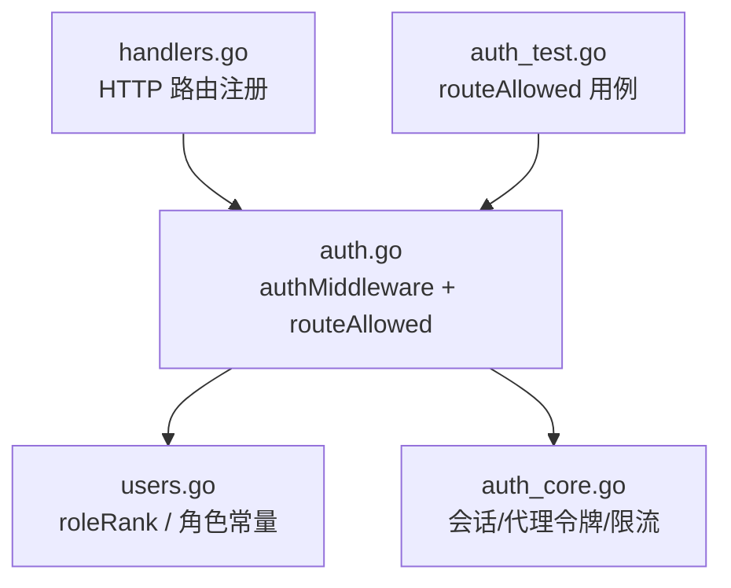
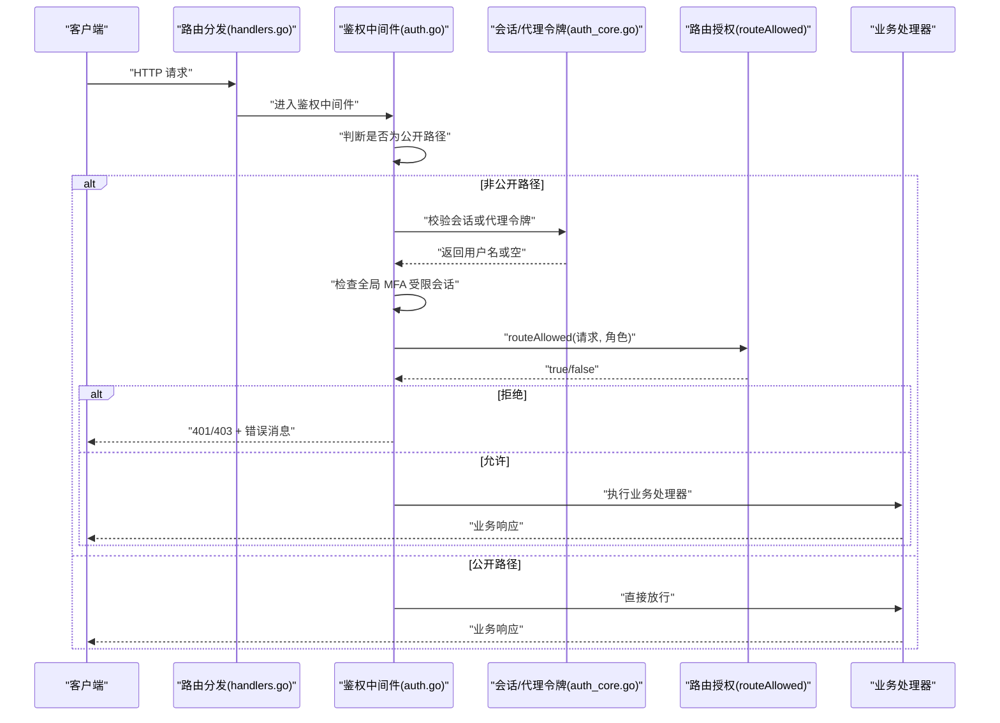
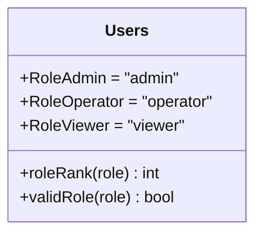
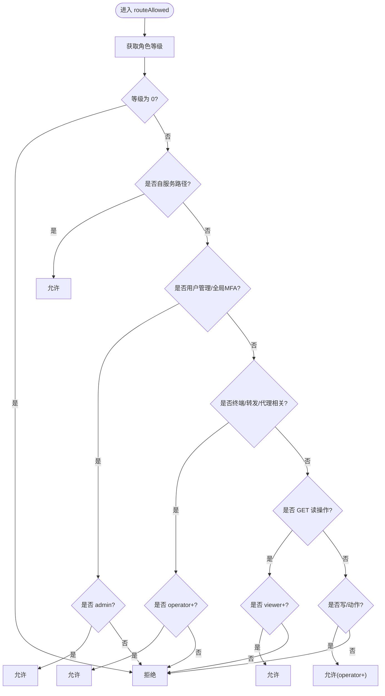
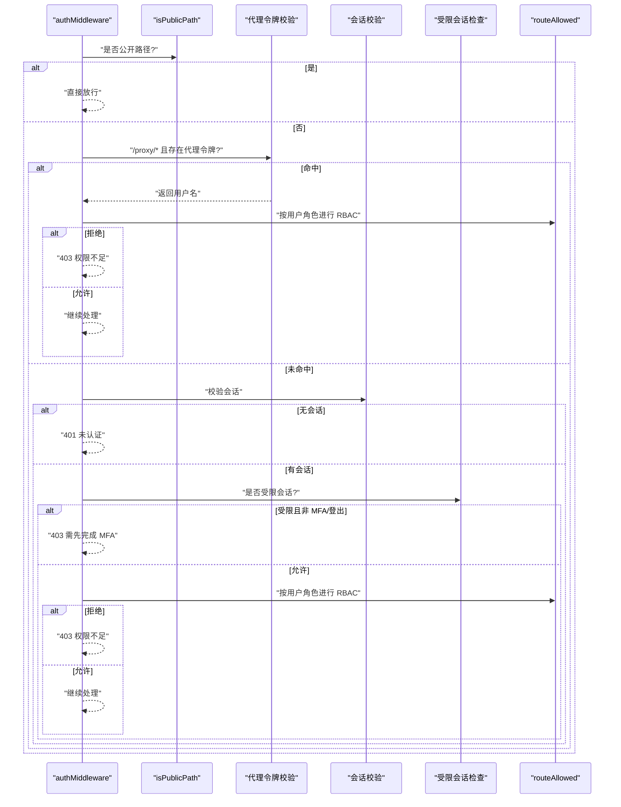
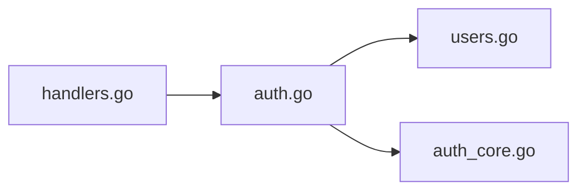

# RBAC 权限模型

<cite>
**本文引用的文件**   
- [auth.go](file://cmd/server/auth.go)
- [auth_core.go](file://cmd/server/auth_core.go)
- [users.go](file://cmd/server/users.go)
- [handlers.go](file://cmd/server/handlers.go)
- [auth_test.go](file://cmd/server/auth_test.go)
</cite>

## 目录
1. [简介](#简介)
2. [项目结构](#项目结构)
3. [核心组件](#核心组件)
4. [架构总览](#架构总览)
5. [详细组件分析](#详细组件分析)
6. [依赖关系分析](#依赖关系分析)
7. [性能与可扩展性](#性能与可扩展性)
8. [故障排查指南](#故障排查指南)
9. [结论](#结论)
10. [附录：权限矩阵与路由清单](#附录权限矩阵与路由清单)

## 简介
本文件系统性梳理并说明该项目的基于角色的访问控制（RBAC）模型，覆盖三种角色（Viewer、Operator、Admin）的职责边界、可访问资源与路由策略；深入解析路由级鉴权函数 routeAllowed 的实现逻辑、角色等级比较、读写操作区分；明确用户自服务接口对所有已登录用户的开放策略；并提供完整的权限矩阵表格与错误处理、日志记录机制说明。

## 项目结构
RBAC 相关实现集中在服务端认证与授权模块中，关键文件如下：
- 路由注册与中间件：handlers.go、auth.go
- 角色定义与等级映射：users.go
- 会话、代理令牌与限流等安全能力：auth_core.go
- 路由级鉴权测试用例：auth_test.go

图表来源
- [handlers.go:100-350](file://cmd/server/handlers.go#L100-L350)
- [auth.go:110-172](file://cmd/server/auth.go#L110-L172)
- [users.go:19-41](file://cmd/server/users.go#L19-L41)
- [auth_core.go:178-180](file://cmd/server/auth_core.go#L178-L180)
- [auth_test.go:203-244](file://cmd/server/auth_test.go#L203-L244)

章节来源
- [handlers.go:100-350](file://cmd/server/handlers.go#L100-L350)
- [auth.go:110-172](file://cmd/server/auth.go#L110-L172)
- [users.go:19-41](file://cmd/server/users.go#L19-L41)
- [auth_core.go:178-180](file://cmd/server/auth_core.go#L178-L180)
- [auth_test.go:203-244](file://cmd/server/auth_test.go#L203-L244)

## 核心组件
- 角色与等级
  - 角色常量：admin、operator、viewer
  - 等级映射：admin=3、operator=2、viewer=1，未知角色=0
- 路由级鉴权
  - routeAllowed：根据请求路径与方法判定是否允许当前角色访问
- 认证中间件
  - authMiddleware：校验公开路径、会话、受限会话（MFA）、代理令牌、最终调用 routeAllowed
- 会话与安全能力
  - 会话创建/验证/过期、滑动空闲超时
  - 代理令牌（proxy token）用于跨上下文场景的二次鉴权
  - 登录失败频率限制、账户维度暴力破解防护、TOTP 单用保护

章节来源
- [users.go:19-41](file://cmd/server/users.go#L19-L41)
- [auth.go:83-108](file://cmd/server/auth.go#L83-L108)
- [auth.go:110-172](file://cmd/server/auth.go#L110-L172)
- [auth_core.go:331-354](file://cmd/server/auth_core.go#L331-L354)
- [auth_core.go:157-176](file://cmd/server/auth_core.go#L157-L176)
- [auth_core.go:182-260](file://cmd/server/auth_core.go#L182-L260)

## 架构总览
下图展示了从 HTTP 请求进入，到认证、授权、业务处理的完整流程，以及 RBAC 在其中的作用点。

图表来源
- [handlers.go:100-350](file://cmd/server/handlers.go#L100-L350)
- [auth.go:110-172](file://cmd/server/auth.go#L110-L172)
- [auth_core.go:331-354](file://cmd/server/auth_core.go#L331-L354)
- [auth.go:83-108](file://cmd/server/auth.go#L83-L108)

## 详细组件分析

### 角色与等级
- 角色常量与有效性校验
  - 支持的角色：admin、operator、viewer
  - 未知角色视为无效（等级为 0），将被拒绝
- 等级映射
  - admin=3、operator=2、viewer=1
  - 通过等级比较决定“是否满足某条路由的最小等级要求”

图表来源
- [users.go:19-41](file://cmd/server/users.go#L19-L41)

章节来源
- [users.go:19-41](file://cmd/server/users.go#L19-L41)

### 路由级鉴权：routeAllowed
- 设计要点
  - 任何已登录角色均可管理自己的账户（自服务接口）
  - 除特殊路径外，GET 读操作 viewer+ 即可
  - 远程终端、端口转发、HTTP 代理相关路径需要 operator+
  - 用户管理与全局 MFA 配置仅 admin 可操作
  - 其他写/动作类请求默认需要 operator+
- 执行顺序
  1) 校验角色等级是否为 0（未知角色直接拒绝）
  2) 匹配自服务白名单路径（任意已登录角色）
  3) 匹配用户管理/全局 MFA（仅 admin）
  4) 匹配终端/转发/代理相关（operator+）
  5) 按方法区分：GET 读操作（viewer+），其余写/动作（operator+）

图表来源
- [auth.go:83-108](file://cmd/server/auth.go#L83-L108)

章节来源
- [auth.go:83-108](file://cmd/server/auth.go#L83-L108)

### 认证中间件：authMiddleware
- 公开路径放行：静态资源、安装脚本、登录/查询自身信息、Agent 上报通道等
- 代理令牌优先：对 /proxy/* 路径，若携带有效 proxy_token，则先校验令牌，再按令牌所属用户当前角色再次走 routeAllowed
- 会话校验：无会话返回未认证
- 全局 MFA 受限会话：仅允许 MFA 设置/启用/登出
- 最终 RBAC 判定：调用 routeAllowed，不通过则返回权限不足

图表来源
- [auth.go:110-172](file://cmd/server/auth.go#L110-L172)
- [auth.go:83-108](file://cmd/server/auth.go#L83-L108)

章节来源
- [auth.go:110-172](file://cmd/server/auth.go#L110-L172)

### 会话与代理令牌
- 会话
  - 使用 cookie 传递，包含绝对过期时间与滑动空闲超时
  - 提供受限会话模式（仅允许 MFA 设置/启用/登出）
- 代理令牌
  - 短生命周期，单次使用，用于跨上下文场景（如新标签页打开）
  - 校验后仍会按用户当前角色进行 RBAC 复核，防止降权后越权

章节来源
- [auth_core.go:331-354](file://cmd/server/auth_core.go#L331-L354)
- [auth_core.go:157-176](file://cmd/server/auth_core.go#L157-L176)
- [auth_core.go:391-432](file://cmd/server/auth_core.go#L391-L432)

### 用户自服务接口开放策略
以下接口对所有已登录用户开放（无论角色），包括登出、修改密码、个人资料、强制首次初始化、个人 MFA 设置/启用/禁用、邮箱解绑等：
- /api/v1/logout
- /api/v1/password
- /api/v1/profile
- /api/v1/account/init
- /api/v1/mfa/setup
- /api/v1/mfa/enable
- /api/v1/mfa/disable
- /api/v1/mfa/unbind-via-email

这些路径在 routeAllowed 中被显式放行，确保任何已登录角色均可管理自身账户与 MFA。

章节来源
- [auth.go:92-96](file://cmd/server/auth.go#L92-L96)
- [handlers.go:134-145](file://cmd/server/handlers.go#L134-L145)

### 路由与资源访问规则
- 用户管理（/api/v1/users/*）与全局 MFA（/api/v1/mfa/global）：仅 admin
- 终端与转发（含 /terminal、/api/v1/forward/*、/proxy/*、/api/v1/proxy-token）：operator+
- 读操作（GET）：viewer+
- 其他写/动作（POST/PUT/DELETE/PATCH）：operator+

章节来源
- [auth.go:98-107](file://cmd/server/auth.go#L98-L107)
- [handlers.go:155-283](file://cmd/server/handlers.go#L155-L283)

## 依赖关系分析
- handlers.go 负责将具体 API 路由绑定到 Server 的方法上
- auth.go 的中间件在每个非公开请求上统一执行认证与授权
- users.go 提供角色常量与等级映射
- auth_core.go 提供会话、代理令牌、限流等底层安全能力

图表来源
- [handlers.go:100-350](file://cmd/server/handlers.go#L100-L350)
- [auth.go:110-172](file://cmd/server/auth.go#L110-L172)
- [users.go:19-41](file://cmd/server/users.go#L19-L41)
- [auth_core.go:178-180](file://cmd/server/auth_core.go#L178-L180)

章节来源
- [handlers.go:100-350](file://cmd/server/handlers.go#L100-L350)
- [auth.go:110-172](file://cmd/server/auth.go#L110-L172)
- [users.go:19-41](file://cmd/server/users.go#L19-L41)
- [auth_core.go:178-180](file://cmd/server/auth_core.go#L178-L180)

## 性能与可扩展性
- 会话校验采用内存表 + 哈希索引，避免泄露原始 token
- 登录失败频率限制与账户维度限流降低暴力破解风险
- TOTP 单用保护避免验证码重放
- 代理令牌一次性使用，减少长期凭证暴露面
- 滑动空闲超时提升用户体验同时保障安全性

[本节为通用指导，无需源码引用]

## 故障排查指南
- 常见错误码与含义
  - 401 Unauthorized：未登录或会话无效
  - 403 Forbidden：权限不足、需先完成 MFA、或代理令牌权限不足
- 定位步骤
  - 确认请求路径是否在公开路径白名单内
  - 检查是否携带有效会话 cookie 或代理令牌
  - 若为受限会话，确认是否仅访问 MFA 相关端点
  - 核对 routeAllowed 的路径匹配与方法判定是否符合预期
- 日志记录
  - 登录失败、TOTP 失败、默认凭据检测、密码变更、MFA 开关等关键事件均记录系统日志，便于审计与排障

章节来源
- [auth.go:110-172](file://cmd/server/auth.go#L110-L172)
- [auth.go:176-307](file://cmd/server/auth.go#L176-L307)
- [auth.go:432-529](file://cmd/server/auth.go#L432-L529)
- [auth.go:531-639](file://cmd/server/auth.go#L531-L639)

## 结论
本项目采用清晰的分层 RBAC 模型：以角色等级为基础，结合路径与方法进行细粒度授权；通过中间件统一拦截，配合会话与代理令牌机制，既保证安全又兼顾可用性。自服务接口对所有已登录用户开放，用户管理、终端与转发等高敏感能力严格限定于更高权限角色，整体职责划分明确、扩展性强。

[本节为总结性内容，无需源码引用]

## 附录：权限矩阵与路由清单

### 角色职责概览
- Viewer（观察者）
  - 只读访问大部分功能
  - 可管理自身账户与 MFA
- Operator（运维员）
  - 具备所有读操作权限
  - 可进行写/动作操作（除用户管理）
  - 可使用远程终端、端口转发、HTTP 代理
- Admin（管理员）
  - 拥有全部权限，包括用户管理与全局 MFA 策略

章节来源
- [users.go:12-17](file://cmd/server/users.go#L12-L17)
- [auth.go:83-108](file://cmd/server/auth.go#L83-L108)

### 权限矩阵（按功能域）
- 账户与身份
  - 登录/登出：所有已登录用户
  - 修改密码：所有已登录用户
  - 个人资料：所有已登录用户
  - 强制首次初始化：所有已登录用户（仅在 MustChangePassword 时可用）
  - 个人 MFA 设置/启用/禁用/邮箱解绑：所有已登录用户
  - 用户管理（增删改查、重置密码/MFA）：仅 admin
  - 全局 MFA 策略：仅 admin
- 主机与告警
  - 主机列表/详情/历史/指标：viewer+
  - 主机分类/删除：operator+
  - 告警列表/历史/确认/静默/清理：viewer+（部分写操作可能为 operator+，遵循默认写操作规则）
- 终端与转发
  - 远程终端：operator+
  - 端口转发（TCP/HTTP）：operator+
  - HTTP 代理（/proxy/*）：operator+
- 自动化与 SRE
  - 检查项、剧本、SLO、工单、自动修复等：遵循默认读写规则（GET 读 viewer+，其余写/动作 operator+）
- 日志与 AI
  - 日志检索/诊断、AI 配置/对话/巡检：遵循默认读写规则

章节来源
- [auth.go:92-107](file://cmd/server/auth.go#L92-L107)
- [handlers.go:114-283](file://cmd/server/handlers.go#L114-L283)

### 关键路由清单（节选）
- 自服务（所有已登录用户）
  - POST /api/v1/logout
  - POST /api/v1/password
  - POST /api/v1/profile
  - POST /api/v1/account/init
  - POST /api/v1/mfa/setup
  - POST /api/v1/mfa/enable
  - POST /api/v1/mfa/disable
  - POST /api/v1/mfa/unbind-via-email
- 用户管理（仅 admin）
  - GET/POST /api/v1/users
  - POST /api/v1/users/{username}
  - DELETE /api/v1/users/{username}
  - POST /api/v1/users/{username}/reset-password
  - POST /api/v1/users/{username}/reset-mfa
  - POST /api/v1/mfa/global
- 终端与转发（operator+）
  - GET /api/v1/hosts/{id}/terminal
  - GET/POST/PUT/DELETE/PATCH /api/v1/forward/*
  - GET/POST/PUT/DELETE/PATCH /proxy/{hostID}/{port}/{path...}
  - GET /api/v1/proxy-token

章节来源
- [handlers.go:134-283](file://cmd/server/handlers.go#L134-L283)
- [auth.go:92-107](file://cmd/server/auth.go#L92-L107)

### 路由级鉴权测试要点
- 自服务接口对 viewer 开放
- 读操作对 viewer 开放
- 写操作对 operator 开放
- 用户管理对 admin 开放
- 终端对 operator 开放，对 viewer 拒绝

章节来源
- [auth_test.go:203-244](file://cmd/server/auth_test.go#L203-L244)