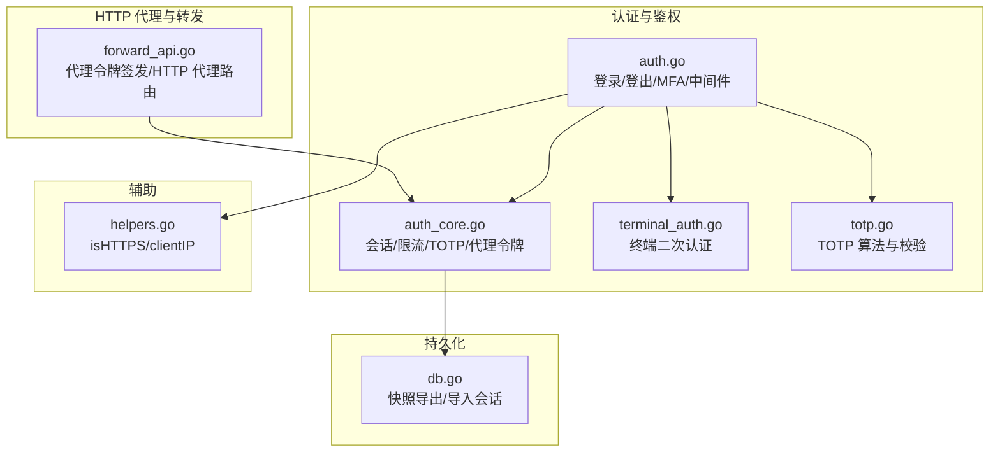
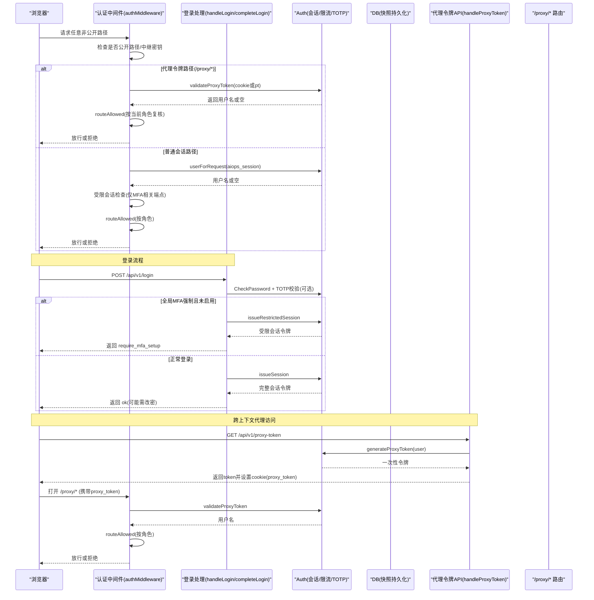
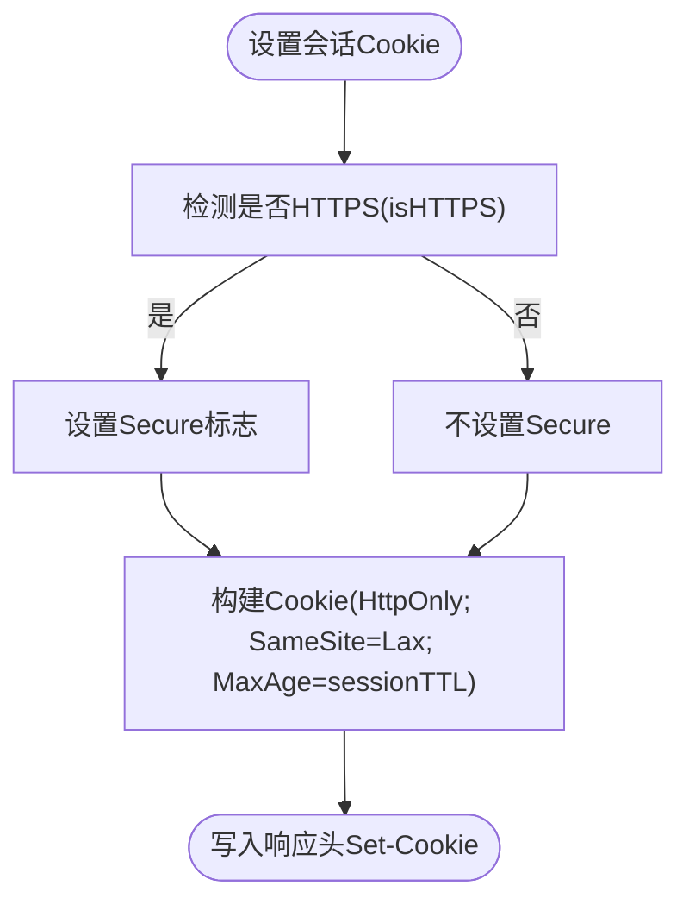
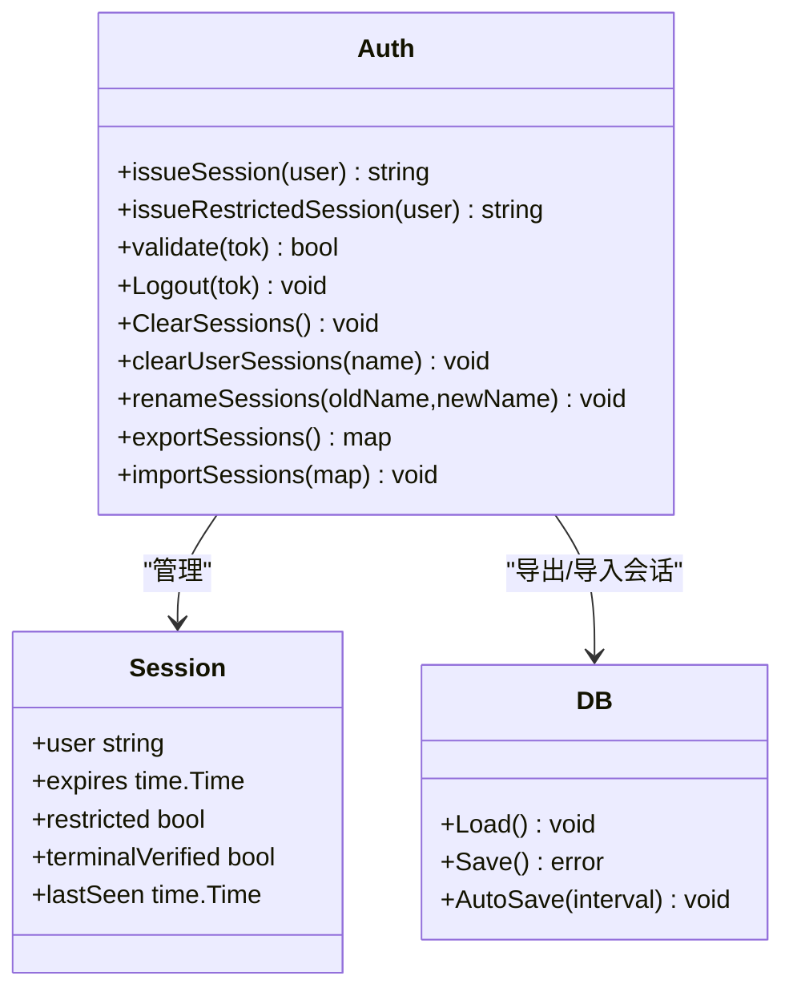
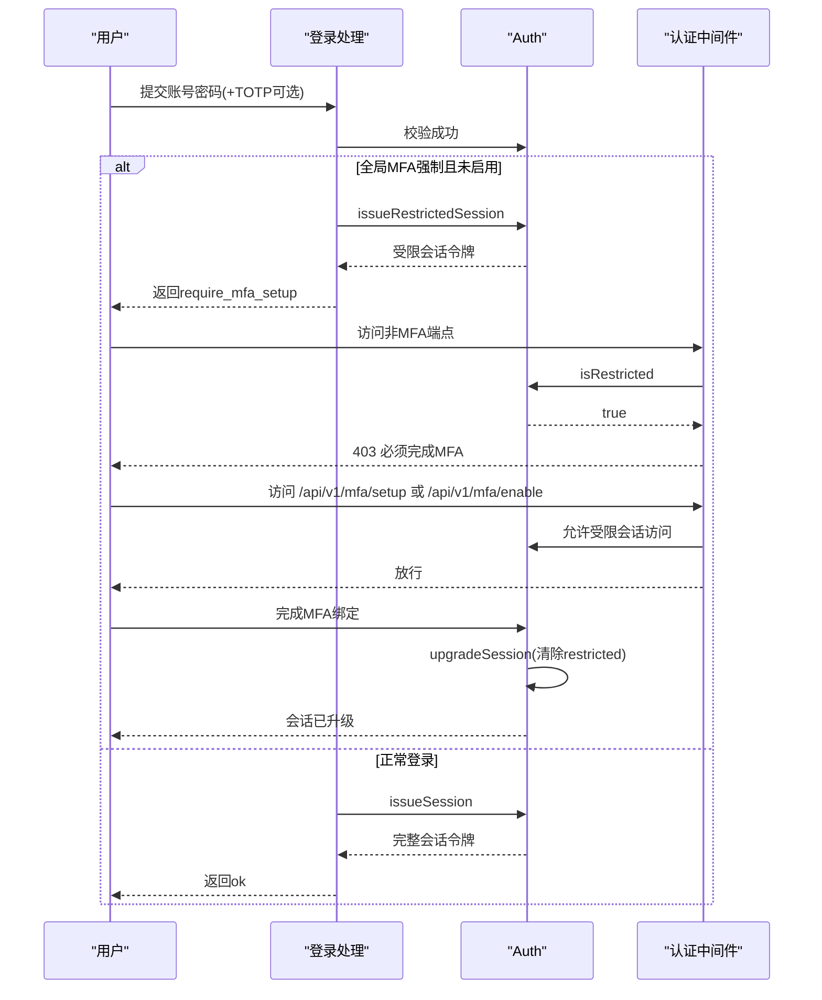
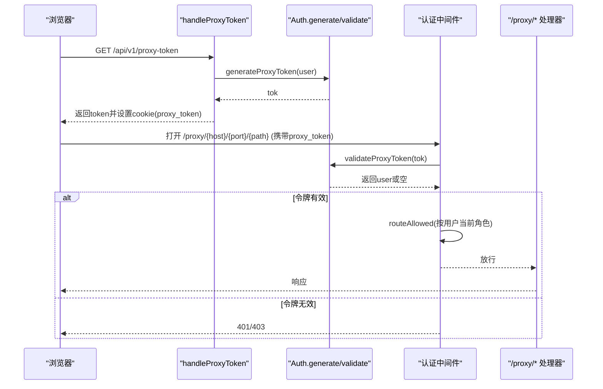
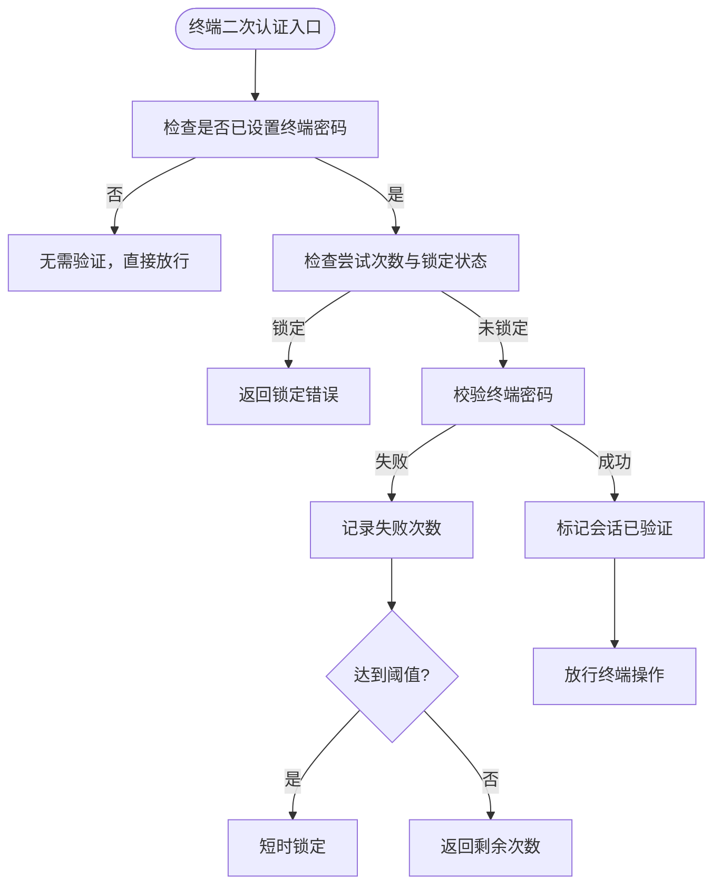
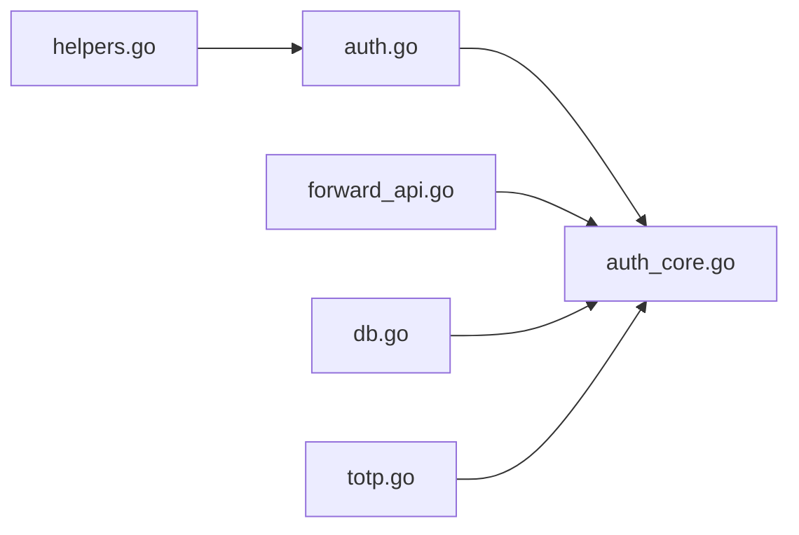

# 会话管理

<cite>
**本文引用的文件列表**
- [auth.go](file://cmd/server/auth.go)
- [auth_core.go](file://cmd/server/auth_core.go)
- [db.go](file://cmd/server/db.go)
- [helpers.go](file://cmd/server/helpers.go)
- [terminal_auth.go](file://cmd/server/terminal_auth.go)
- [forward_api.go](file://cmd/server/forward_api.go)
- [totp.go](file://cmd/server/totp.go)
</cite>

## 目录
1. [简介](#简介)
2. [项目结构](#项目结构)
3. [核心组件](#核心组件)
4. [架构总览](#架构总览)
5. [详细组件分析](#详细组件分析)
6. [依赖关系分析](#依赖关系分析)
7. [性能考量](#性能考量)
8. [故障排查指南](#故障排查指南)
9. [结论](#结论)

## 简介
本文件聚焦于系统的会话管理机制，覆盖以下关键主题：
- Cookie 安全配置（HttpOnly、Secure、SameSite）的设置与作用
- 会话生命周期管理（令牌生成、过期控制、存储机制）
- 受限会话模式（全局 MFA 强制策略下的降级与升级流程）
- 代理令牌（proxy token）机制（跨上下文访问、令牌验证、权限复核）
- 高级功能（会话清理、批量失效、重命名会话等）的实现原理

## 项目结构
与会话相关的实现主要位于服务端认证与中间件层，以及持久化层。核心文件包括：
- 认证与中间件：auth.go、auth_core.go
- 终端二次认证：terminal_auth.go
- 代理令牌与 HTTP 代理 API：forward_api.go
- TOTP 双因子：totp.go
- 嵌入数据库快照与会话持久化：db.go
- 辅助工具（HTTPS 判定、客户端 IP 解析等）：helpers.go

图表来源
- [auth.go:110-172](file://cmd/server/auth.go#L110-L172)
- [auth_core.go:110-180](file://cmd/server/auth_core.go#L110-L180)
- [terminal_auth.go:1-172](file://cmd/server/terminal_auth.go#L1-L172)
- [forward_api.go:369-392](file://cmd/server/forward_api.go#L369-L392)
- [db.go:47-73](file://cmd/server/db.go#L47-L73)
- [helpers.go:84-97](file://cmd/server/helpers.go#L84-L97)

章节来源
- [auth.go:110-172](file://cmd/server/auth.go#L110-L172)
- [auth_core.go:110-180](file://cmd/server/auth_core.go#L110-L180)
- [terminal_auth.go:1-172](file://cmd/server/terminal_auth.go#L1-L172)
- [forward_api.go:369-392](file://cmd/server/forward_api.go#L369-L392)
- [db.go:47-73](file://cmd/server/db.go#L47-L73)
- [helpers.go:84-97](file://cmd/server/helpers.go#L84-L97)

## 核心组件
- 会话 Cookie 与安全属性
  - 名称：aiops_session
  - 默认 TTL：7 天；滑动空闲超时：24 小时
  - 安全属性：HttpOnly=true；Secure 根据 isHTTPS 判定；SameSite=Lax
- 会话存储
  - 内存 map，键为令牌的 SHA-256 哈希值，避免泄露后可被直接重放
  - 通过嵌入数据库快照周期性持久化，重启后恢复未过期会话
- 受限会话
  - 当全局 MFA 强制开启且用户未启用 MFA 时，签发受限会话，仅允许 MFA 设置/启用与登出
  - 完成 MFA 绑定后升级为完整会话
- 代理令牌
  - 短生命周期、单次使用的临时令牌，用于跨上下文（如新标签页 window.open）访问 /proxy/*
  - 支持从 cookie 或查询参数获取，但推荐优先使用 cookie
  - 命中代理令牌后仍进行 RBAC 复核，防止角色降权后的越权
- 终端二次认证
  - 独立于登录会话的“终端密码”，在会话内缓存一次验证状态
  - 提供速率限制与锁定机制，失败多次后短时锁定

章节来源
- [auth_core.go:17-20](file://cmd/server/auth_core.go#L17-L20)
- [auth_core.go:331-354](file://cmd/server/auth_core.go#L331-L354)
- [auth_core.go:381-402](file://cmd/server/auth_core.go#L381-L402)
- [auth_core.go:419-432](file://cmd/server/auth_core.go#L419-L432)
- [auth_core.go:477-505](file://cmd/server/db.go#L477-L505)
- [auth.go:133-152](file://cmd/server/auth.go#L133-L152)
- [forward_api.go:369-392](file://cmd/server/forward_api.go#L369-L392)
- [terminal_auth.go:124-172](file://cmd/server/terminal_auth.go#L124-L172)

## 架构总览
下图展示了登录到受控访问的关键流程，包括受限会话与代理令牌路径。

图表来源
- [auth.go:110-172](file://cmd/server/auth.go#L110-L172)
- [auth.go:176-307](file://cmd/server/auth.go#L176-L307)
- [auth_core.go:331-354](file://cmd/server/auth_core.go#L331-L354)
- [auth_core.go:381-402](file://cmd/server/auth_core.go#L381-L402)
- [auth_core.go:419-432](file://cmd/server/auth_core.go#L419-L432)
- [forward_api.go:369-392](file://cmd/server/forward_api.go#L369-L392)

## 详细组件分析

### Cookie 安全配置
- 名称与路径
  - 名称：aiops_session
  - 路径：/
- 安全属性
  - HttpOnly：true，禁止前端脚本读取
  - Secure：当 isHTTPS(r) 为真时设置，isHTTPS 优先判断 TLS，其次在信任代理模式下接受 X-Forwarded-Proto=https
  - SameSite：Lax，缓解 CSRF 风险
  - MaxAge：基于 sessionTTL（7 天）换算
- 相关逻辑位置
  - 登录成功后设置 Cookie
  - 修改密码后重新签发 Cookie
  - 强制初始化账户后清空 Cookie 并强制重新登录

图表来源
- [auth.go:283-307](file://cmd/server/auth.go#L283-L307)
- [auth.go:460-467](file://cmd/server/auth.go#L460-L467)
- [auth.go:523-529](file://cmd/server/auth.go#L523-L529)
- [helpers.go:84-97](file://cmd/server/helpers.go#L84-L97)

章节来源
- [auth.go:283-307](file://cmd/server/auth.go#L283-L307)
- [auth.go:460-467](file://cmd/server/auth.go#L460-L467)
- [auth.go:523-529](file://cmd/server/auth.go#L523-L529)
- [helpers.go:84-97](file://cmd/server/helpers.go#L84-L97)

### 会话生命周期管理
- 令牌生成
  - 使用系统 CSPRNG 生成随机字节，编码为十六进制字符串
  - 若 RNG 不可用则直接 panic，避免回退到可预测值
- 存储与索引
  - 内存 map 以令牌的 SHA-256 哈希作为键，避免泄露后可被直接重放
  - 会话对象包含用户、过期时间、受限标记、终端二次认证标记、最后活动时间
- 过期与空闲滑动
  - 绝对过期：expires 时间点
  - 滑动空闲：lastSeen 超过 sessionIdleTimeout（24 小时）即失效
  - 每次有效请求更新 lastSeen
- 持久化与恢复
  - 导出：仅导出未过期的会话到快照
  - 导入：启动时加载快照，恢复未过期会话（保留 terminalVerified 与 restricted 状态）
- 清理与批量失效
  - Logout：删除单个会话
  - ClearSessions：清空所有会话（例如管理员重置后）
  - clearUserSessions：按用户名批量失效该用户的所有会话（修改密码后）
- 重命名会话
  - renameSessions：将某用户的所有会话指向新用户名，保持现有 Cookie 有效

图表来源
- [auth_core.go:287-295](file://cmd/server/auth_core.go#L287-L295)
- [auth_core.go:331-354](file://cmd/server/auth_core.go#L331-L354)
- [auth_core.go:381-402](file://cmd/server/auth_core.go#L381-L402)
- [auth_core.go:450-475](file://cmd/server/auth_core.go#L450-L475)
- [auth_core.go:477-505](file://cmd/server/auth_core.go#L477-L505)
- [db.go:151-179](file://cmd/server/db.go#L151-L179)
- [db.go:234-255](file://cmd/server/db.go#L234-L255)

章节来源
- [auth_core.go:287-295](file://cmd/server/auth_core.go#L287-L295)
- [auth_core.go:331-354](file://cmd/server/auth_core.go#L331-L354)
- [auth_core.go:381-402](file://cmd/server/auth_core.go#L381-L402)
- [auth_core.go:450-475](file://cmd/server/auth_core.go#L450-L475)
- [auth_core.go:477-505](file://cmd/server/auth_core.go#L477-L505)
- [db.go:151-179](file://cmd/server/db.go#L151-L179)
- [db.go:234-255](file://cmd/server/db.go#L234-L255)

### 受限会话模式（全局 MFA 强制）
- 触发条件
  - 全局 MFA 强制策略开启（MFARequired=true），且当前用户未启用 MFA
- 行为
  - 签发受限会话（restricted=true），仅允许访问 MFA 设置/启用与登出端点
  - 其他端点返回“必须先完成 MFA”的错误
- 升级流程
  - 用户完成 MFA 绑定后，调用 upgradeSession 将当前会话的 restricted 标记清除，转为完整会话

图表来源
- [auth.go:279-307](file://cmd/server/auth.go#L279-L307)
- [auth.go:158-165](file://cmd/server/auth.go#L158-L165)
- [auth_core.go:391-402](file://cmd/server/auth_core.go#L391-L402)
- [auth_core.go:419-432](file://cmd/server/auth_core.go#L419-L432)

章节来源
- [auth.go:279-307](file://cmd/server/auth.go#L279-L307)
- [auth.go:158-165](file://cmd/server/auth.go#L158-L165)
- [auth_core.go:391-402](file://cmd/server/auth_core.go#L391-L402)
- [auth_core.go:419-432](file://cmd/server/auth_core.go#L419-L432)

### 代理令牌（proxy token）机制
- 目的
  - 解决跨上下文（如新标签页 window.open）无法自动携带会话 Cookie 的问题
- 签发
  - 通过 /api/v1/proxy-token 接口，由已登录用户申请
  - 返回一次性令牌，同时设置 proxy_token Cookie（HttpOnly、SameSite=Lax、Secure 视 HTTPS 而定）
- 验证
  - 对 /proxy/* 路径，优先从 cookie 读取，其次回退到查询参数 pt
  - 验证通过后，按令牌所属用户的当前角色再次执行 RBAC 复核
  - 令牌为单次使用，验证后立即删除
- 权限复核
  - 即使代理令牌有效，仍需满足 routeAllowed 的角色要求，防止签发后被降权的用户越权

图表来源
- [forward_api.go:369-392](file://cmd/server/forward_api.go#L369-L392)
- [auth_core.go:157-176](file://cmd/server/auth_core.go#L157-L176)
- [auth.go:133-152](file://cmd/server/auth.go#L133-L152)

章节来源
- [forward_api.go:369-392](file://cmd/server/forward_api.go#L369-L392)
- [auth_core.go:157-176](file://cmd/server/auth_core.go#L157-L176)
- [auth.go:133-152](file://cmd/server/auth.go#L133-L152)

### 终端二次认证与会话状态
- 终端密码
  - 独立于登录口令，强度要求更高（≥8位，含大小写、数字、特殊字符）
  - 首次设置无需二次验证；变更时需 MFA 或登录口令复核
- 会话内验证状态
  - 一旦在当前会话中验证成功，后续访问终端相关功能无需重复输入
  - 验证状态随会话持久化（重启后保留）
- 速率限制与锁定
  - 连续失败达到阈值后短时锁定，降低暴力破解风险

图表来源
- [terminal_auth.go:17-40](file://cmd/server/terminal_auth.go#L17-L40)
- [terminal_auth.go:124-172](file://cmd/server/terminal_auth.go#L124-L172)
- [auth_core.go:515-553](file://cmd/server/auth_core.go#L515-L553)
- [auth_core.go:555-585](file://cmd/server/auth_core.go#L555-L585)

章节来源
- [terminal_auth.go:17-40](file://cmd/server/terminal_auth.go#L17-L40)
- [terminal_auth.go:124-172](file://cmd/server/terminal_auth.go#L124-L172)
- [auth_core.go:515-553](file://cmd/server/auth_core.go#L515-L553)
- [auth_core.go:555-585](file://cmd/server/auth_core.go#L555-L585)

### 高级功能：清理、批量失效、重命名
- 清理与批量失效
  - Logout：删除当前会话
  - ClearSessions：清空全部会话（例如管理员重置后）
  - clearUserSessions：按用户名批量失效（修改密码后）
- 重命名会话
  - renameSessions：将某用户的所有会话指向新用户名，使当前 Cookie 在新用户名下继续有效
- 相关场景
  - 修改自身密码后，失效同用户其他会话并重新签发当前会话
  - 强制初始化账户后，清空该用户所有会话并强制重新登录

章节来源
- [auth_core.go:364-378](file://cmd/server/auth_core.go#L364-L378)
- [auth_core.go:450-475](file://cmd/server/auth_core.go#L450-L475)
- [auth.go:457-467](file://cmd/server/auth.go#L457-L467)
- [auth.go:518-529](file://cmd/server/auth.go#L518-L529)

## 依赖关系分析
- 组件耦合
  - auth.go 依赖 auth_core.go 提供的会话与限流能力
  - forward_api.go 依赖 auth_core.go 的代理令牌签发与验证
  - db.go 依赖 auth_core.go 的导出/导入接口，实现会话持久化
  - helpers.go 提供 isHTTPS 等辅助方法供认证与中间件使用
- 外部依赖
  - TOTP 标准库实现（HMAC-SHA1、Base32）
  - 系统 CSPRNG 用于令牌与 TOTP 密钥生成

图表来源
- [auth.go:110-172](file://cmd/server/auth.go#L110-L172)
- [forward_api.go:369-392](file://cmd/server/forward_api.go#L369-L392)
- [db.go:234-255](file://cmd/server/db.go#L234-L255)
- [helpers.go:84-97](file://cmd/server/helpers.go#L84-L97)
- [totp.go:1-109](file://cmd/server/totp.go#L1-L109)

章节来源
- [auth.go:110-172](file://cmd/server/auth.go#L110-L172)
- [forward_api.go:369-392](file://cmd/server/forward_api.go#L369-L392)
- [db.go:234-255](file://cmd/server/db.go#L234-L255)
- [helpers.go:84-97](file://cmd/server/helpers.go#L84-L97)
- [totp.go:1-109](file://cmd/server/totp.go#L1-L109)

## 性能考量
- 令牌生成使用系统 CSPRNG，失败直接 panic，避免回退到可预测值
- 会话验证采用哈希索引，避免泄露后可被直接重放
- 滑动空闲超时减少长期活跃会话的资源占用
- 导出/导入仅处理未过期会话，降低快照体积
- 代理令牌单次使用，验证后立即删除，降低重放风险

[本节为通用指导，不涉及具体文件分析]

## 故障排查指南
- 登录失败与限流
  - 检查 IP 级与账号级失败计数窗口与阈值
  - 查看日志中的登录失败与 TOTP 失败条目
- 受限会话无法访问业务端点
  - 确认全局 MFA 强制策略是否开启
  - 检查用户是否已完成 MFA 绑定并成功升级会话
- 代理令牌无效
  - 确认是否通过 /api/v1/proxy-token 正确获取并设置 cookie
  - 检查 /proxy/* 路径是否仍通过 RBAC 复核
- 终端二次认证锁定
  - 查看终端密码验证失败次数与锁定时间
  - 等待锁定解除或重置失败计数

章节来源
- [auth_core.go:182-260](file://cmd/server/auth_core.go#L182-L260)
- [auth.go:176-248](file://cmd/server/auth.go#L176-L248)
- [terminal_auth.go:124-172](file://cmd/server/terminal_auth.go#L124-L172)

## 结论
本会话管理体系围绕安全与可用性展开：
- 通过严格的 Cookie 安全属性与哈希索引保护会话令牌
- 结合绝对过期与滑动空闲超时平衡安全性与用户体验
- 受限会话模式确保全局 MFA 强制策略落地，并在完成后平滑升级
- 代理令牌机制解决跨上下文访问问题，同时维持 RBAC 复核
- 高级功能（清理、批量失效、重命名）保障运维灵活性与安全性

[本节为总结性内容，不涉及具体文件分析]