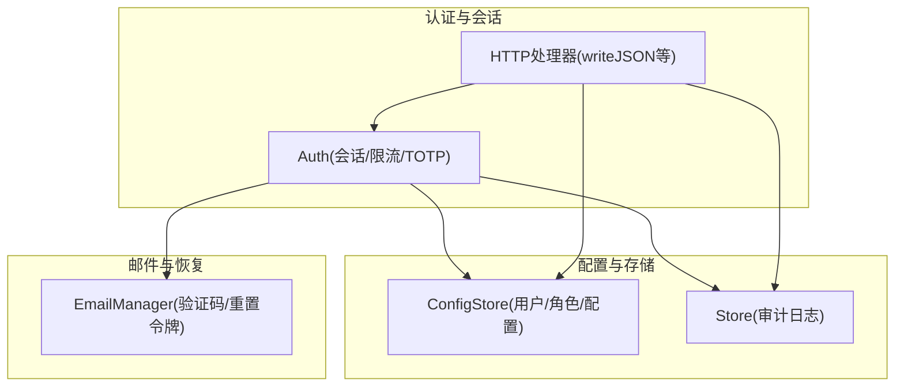
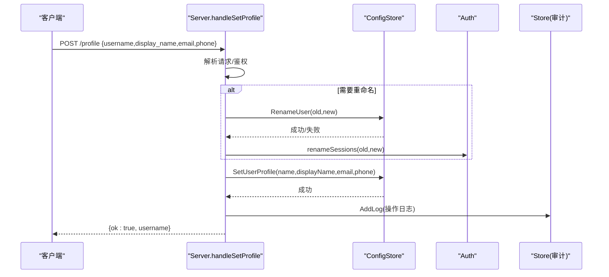
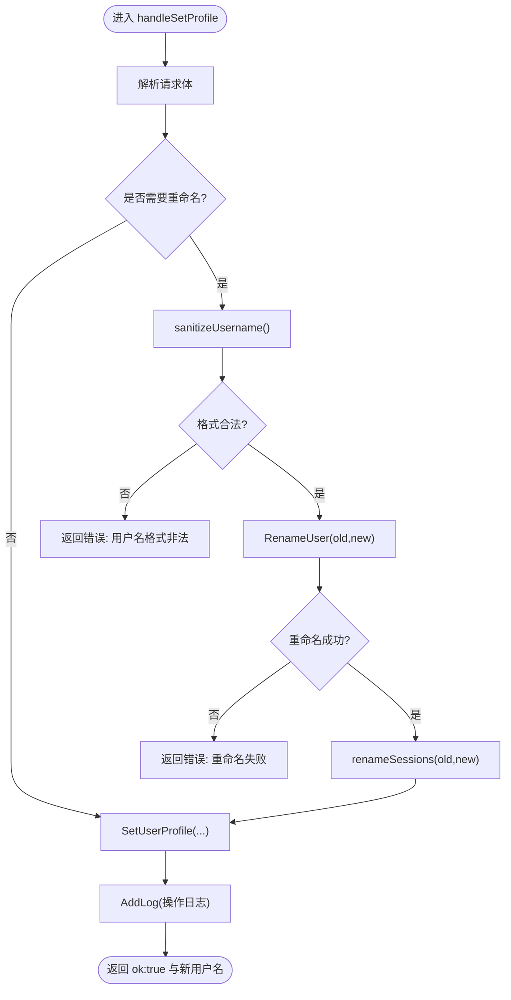
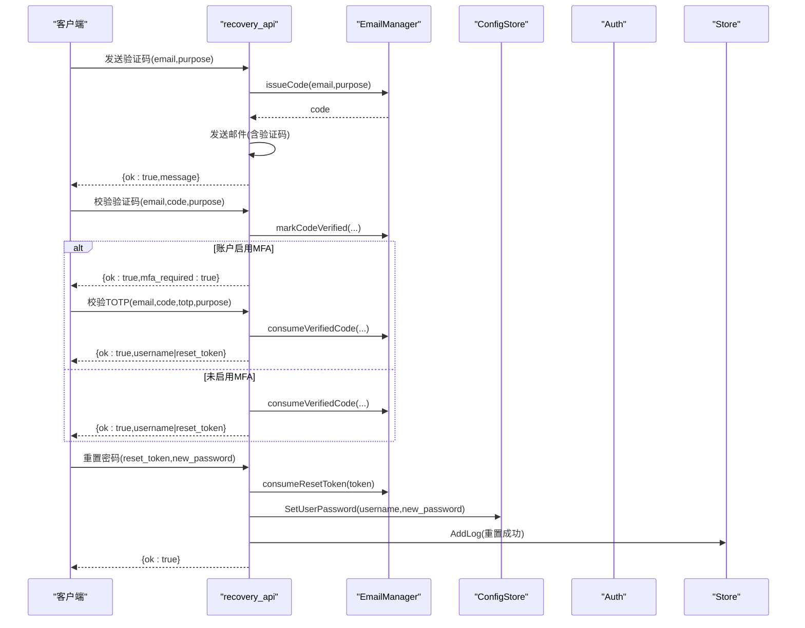
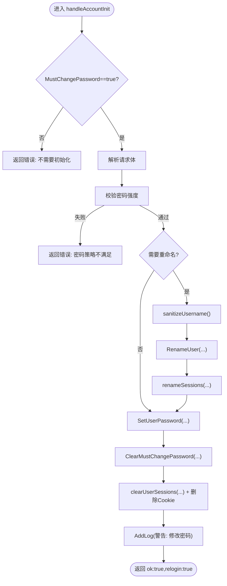
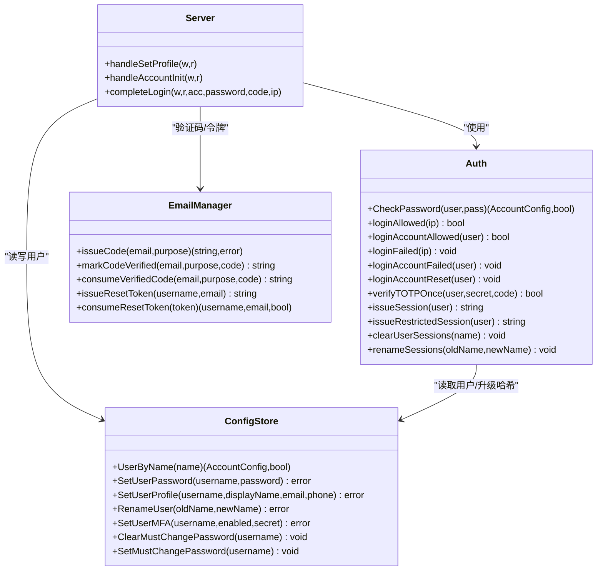
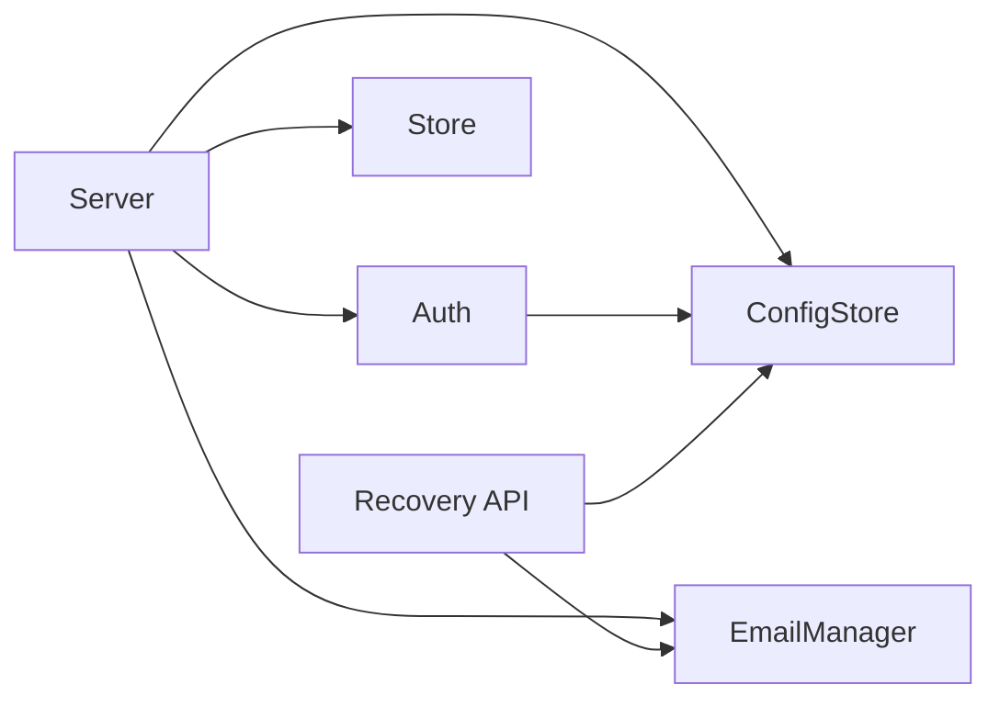

# 用户账户管理

<cite>
**本文引用的文件**   
- [config.go](file://cmd/server/config.go)
- [users.go](file://cmd/server/users.go)
- [auth.go](file://cmd/server/auth.go)
- [auth_core.go](file://cmd/server/auth_core.go)
- [recovery_api.go](file://cmd/server/recovery_api.go)
- [email.go](file://cmd/server/email.go)
- [handlers.go](file://cmd/server/handlers.go)
- [store.go](file://cmd/server/store.go)
</cite>

## 目录
1. [简介](#简介)
2. [项目结构](#项目结构)
3. [核心组件](#核心组件)
4. [架构总览](#架构总览)
5. [详细组件分析](#详细组件分析)
6. [依赖关系分析](#依赖关系分析)
7. [性能与安全考量](#性能与安全考量)
8. [故障排查指南](#故障排查指南)
9. [结论](#结论)

## 简介
本文件面向系统管理员与开发者，系统性说明 AIOps Monitor 的用户账户管理能力，包括：
- 用户信息结构体 AccountConfig 的字段定义、数据类型与用途
- 用户资料更新流程（handleSetProfile）与用户名重命名的原子性处理
- 密码管理功能：强度校验规则、重置流程、首次登录强制改密机制
- 账户初始化流程（handleAccountInit）的安全设计
- 用户状态管理与账户锁定/恢复机制的实现原理

## 项目结构
与用户账户管理相关的核心代码集中在 cmd/server 目录下，关键文件职责如下：
- config.go：定义 AccountConfig 等配置结构体，提供默认账户与全局配置
- users.go：多用户与 RBAC、用户元数据操作、密码与 MFA 设置、用户重命名等
- auth.go：登录认证、会话签发、MFA 策略、个人资料修改、账户初始化入口
- auth_core.go：密码哈希、会话管理、速率限制、TOTP 单用保护等基础能力
- recovery_api.go：账号找回与密码重置的公开接口（邮箱验证码 + TOTP 二次验证）
- email.go：一次性验证码与重置令牌的生命周期管理
- handlers.go：通用响应封装
- store.go：审计日志写入

图表来源
- [auth.go:332-367](file://cmd/server/auth.go#L332-L367)
- [auth_core.go:107-135](file://cmd/server/auth_core.go#L107-L135)
- [users.go:158-171](file://cmd/server/users.go#L158-L171)
- [recovery_api.go:28-92](file://cmd/server/recovery_api.go#L28-L92)
- [email.go:124-140](file://cmd/server/email.go#L124-L140)
- [handlers.go:352-356](file://cmd/server/handlers.go#L352-L356)
- [store.go:703-707](file://cmd/server/store.go#L703-L707)

章节来源
- [config.go:320-353](file://cmd/server/config.go#L320-L353)
- [users.go:1-41](file://cmd/server/users.go#L1-L41)
- [auth.go:332-367](file://cmd/server/auth.go#L332-L367)
- [auth_core.go:107-135](file://cmd/server/auth_core.go#L107-L135)
- [recovery_api.go:1-22](file://cmd/server/recovery_api.go#L1-L22)
- [email.go:124-140](file://cmd/server/email.go#L124-L140)
- [handlers.go:352-356](file://cmd/server/handlers.go#L352-L356)
- [store.go:63-71](file://cmd/server/store.go#L63-L71)

## 核心组件
本节聚焦 AccountConfig 的结构与含义，以及与之关联的关键方法。

- AccountConfig 字段概览
  - username：登录名，唯一标识
  - display_name：显示名称
  - email：绑定邮箱，用于找回与通知
  - phone：可选手机号
  - salt/hash：登录密码的盐值与 PBKDF2-HMAC-SHA256 哈希（或兼容旧格式）
  - mfa_enabled/mfa_secret：是否启用 TOTP 及共享密钥（不返回给浏览器）
  - role：RBAC 角色（admin/operator/viewer）
  - terminal_password_hash/salt：终端二次密码（独立于登录密码）
  - must_change_password：首次登录强制改密标志

- 相关方法与行为
  - SetUserPassword/SetUserProfile/RenameUser/SetUserMFA/ClearMustChangePassword 等对用户数据的变更均加锁并持久化
  - CheckPassword 支持旧哈希透明升级到 PBKDF2
  - loginAllowed/loginAccountAllowed 实现 IP 级与账号级双重限流
  - verifyTOTPOnce 保证 TOTP 一次有效，防重放

章节来源
- [config.go:322-342](file://cmd/server/config.go#L322-L342)
- [users.go:195-208](file://cmd/server/users.go#L195-L208)
- [users.go:256-268](file://cmd/server/users.go#L256-L268)
- [users.go:318-332](file://cmd/server/users.go#L318-L332)
- [users.go:334-350](file://cmd/server/users.go#L334-L350)
- [users.go:245-253](file://cmd/server/users.go#L245-L253)
- [auth_core.go:301-321](file://cmd/server/auth_core.go#L301-L321)
- [auth_core.go:184-204](file://cmd/server/auth_core.go#L184-L204)
- [auth_core.go:217-241](file://cmd/server/auth_core.go#L217-L241)
- [auth_core.go:262-285](file://cmd/server/auth_core.go#L262-L285)

## 架构总览
下图展示用户资料更新与用户名重命名的端到端调用链，体现“先重命名、再更新资料”的原子性与会话重定向。

图表来源
- [auth.go:332-367](file://cmd/server/auth.go#L332-L367)
- [users.go:318-332](file://cmd/server/users.go#L318-L332)
- [users.go:256-268](file://cmd/server/users.go#L256-L268)
- [auth_core.go:465-475](file://cmd/server/auth_core.go#L465-L475)
- [store.go:703-707](file://cmd/server/store.go#L703-L707)

## 详细组件分析

### 用户信息结构体 AccountConfig
- 字段类型与约束
  - username/display_name/email/phone：字符串；phone 可空
  - salt/hash：字符串；hash 为 PBKDF2 自描述格式，兼容旧 SHA-256
  - mfa_enabled：布尔；mfa_secret：Base32 共享密钥（不返回前端）
  - role：枚举型字符串（admin/operator/viewer）
  - terminal_password_hash/salt：字符串；为空表示未设置
  - must_change_password：布尔；控制首次登录强制改密窗口

- 安全要点
  - 所有敏感字段（salt/hash/mfa_secret/terminal_*）不在对外视图返回
  - 迁移时自动升级旧哈希至 PBKDF2，无需人工干预

章节来源
- [config.go:322-342](file://cmd/server/config.go#L322-L342)
- [auth_core.go:301-321](file://cmd/server/auth_core.go#L301-L321)

### 用户资料更新流程（handleSetProfile）
- 输入参数
  - username（可选，允许自我重命名）
  - display_name/email/phone（可选，留空则不清除已有值）
- 处理逻辑
  - 若提交新用户名且与当前不同：
    - 校验用户名格式（长度、字符集）
    - 执行重命名（检查冲突）
    - 同步更新会话中的用户名映射，确保 Cookie 继续生效
  - 更新显示名、邮箱、手机
  - 记录审计日志并返回新的 username

- 原子性与一致性
  - 重命名与资料更新分两步完成，但同一请求内顺序执行，避免中间态暴露
  - 会话重命名在内存中即时生效，保证后续请求使用新用户名

图表来源
- [auth.go:332-367](file://cmd/server/auth.go#L332-L367)
- [helpers.go:256-269](file://cmd/server/helpers.go#L256-L269)
- [users.go:318-332](file://cmd/server/users.go#L318-L332)
- [users.go:256-268](file://cmd/server/users.go#L256-L268)
- [auth_core.go:465-475](file://cmd/server/auth_core.go#L465-L475)
- [store.go:703-707](file://cmd/server/store.go#L703-L707)

章节来源
- [auth.go:332-367](file://cmd/server/auth.go#L332-L367)
- [users.go:318-332](file://cmd/server/users.go#L318-L332)
- [users.go:256-268](file://cmd/server/users.go#L256-L268)
- [auth_core.go:465-475](file://cmd/server/auth_core.go#L465-L475)
- [store.go:703-707](file://cmd/server/store.go#L703-L707)

### 密码管理功能
- 密码强度验证规则
  - 最小长度：至少 8 个字符
  - 必须包含：大写字母、小写字母、数字、特殊字符（非字母数字即视为特殊字符）
  - 任一条件不满足即拒绝

- 密码重置流程（公开接口，无会话）
  - 步骤一：发送验证码
    - 校验邮箱格式与 SMTP 可用性
    - 生成 6 位验证码，按目的（找回用户名/重置密码）发送邮件
    - 防止邮箱枚举：无论是否存在该邮箱，返回一致的成功消息
  - 步骤二：校验验证码
    - 校验邮箱与 6 位验证码
    - 若账户启用了 MFA，返回需输入 TOTP 的提示，不消耗验证码
    - 否则直接消费验证码并返回用户名或一次性重置令牌
  - 步骤三（可选）：校验 TOTP
    - 对已标记“邮箱已验证”的记录再次校验 TOTP
    - 通过后消费验证码并返回最终结果
  - 步骤四：重置密码
    - 使用一次性重置令牌设置新密码，并清除强制改密标志

- 首次登录强制改密机制
  - 触发条件：检测到默认 admin/admin 登录或管理员通过工具重置密码后设置 MustChangePassword=true
  - 行为：登录成功后返回 must_change_password=true，引导用户进入初始化页面
  - 初始化页面（handleAccountInit）：
    - 仅当 MustChangePassword=true 时允许访问
    - 校验新密码强度，支持同时重命名用户名
    - 设置新密码、清除强制改密标志、清空该用户全部会话并强制重新登录

图表来源
- [recovery_api.go:28-92](file://cmd/server/recovery_api.go#L28-L92)
- [recovery_api.go:99-141](file://cmd/server/recovery_api.go#L99-L141)
- [recovery_api.go:146-186](file://cmd/server/recovery_api.go#L146-L186)
- [recovery_api.go:190-206](file://cmd/server/recovery_api.go#L190-L206)
- [email.go:192-229](file://cmd/server/email.go#L192-L229)
- [email.go:289-320](file://cmd/server/email.go#L289-L320)
- [users.go:195-208](file://cmd/server/users.go#L195-L208)
- [store.go:703-707](file://cmd/server/store.go#L703-L707)

章节来源
- [auth.go:63-81](file://cmd/server/auth.go#L63-L81)
- [auth.go:476-529](file://cmd/server/auth.go#L476-L529)
- [recovery_api.go:28-92](file://cmd/server/recovery_api.go#L28-L92)
- [recovery_api.go:99-141](file://cmd/server/recovery_api.go#L99-L141)
- [recovery_api.go:146-186](file://cmd/server/recovery_api.go#L146-L186)
- [recovery_api.go:190-206](file://cmd/server/recovery_api.go#L190-L206)
- [email.go:192-229](file://cmd/server/email.go#L192-L229)
- [email.go:289-320](file://cmd/server/email.go#L289-L320)
- [users.go:195-208](file://cmd/server/users.go#L195-L208)
- [store.go:703-707](file://cmd/server/store.go#L703-L707)

### 账户初始化流程（handleAccountInit）
- 前置条件
  - 当前用户 MustChangePassword=true（由默认凭证检测或管理员重置触发）
- 处理步骤
  - 校验请求体与密码强度
  - 可选重命名用户名（同 profile 流程）
  - 设置新密码并清除强制改密标志
  - 清空该用户所有会话并删除 Cookie，强制重新登录
- 安全考虑
  - 仅在强制改密窗口开放，正常路径仍需旧密码校验
  - 重命名与会话重定向在同一请求内完成，避免不一致
  - 强制登出确保任何旧会话失效，确认新凭据有效

图表来源
- [auth.go:476-529](file://cmd/server/auth.go#L476-L529)
- [auth.go:63-81](file://cmd/server/auth.go#L63-L81)
- [users.go:318-332](file://cmd/server/users.go#L318-L332)
- [users.go:195-208](file://cmd/server/users.go#L195-L208)
- [users.go:245-253](file://cmd/server/users.go#L245-L253)
- [auth_core.go:452-461](file://cmd/server/auth_core.go#L452-L461)
- [store.go:703-707](file://cmd/server/store.go#L703-L707)

章节来源
- [auth.go:476-529](file://cmd/server/auth.go#L476-L529)
- [auth.go:63-81](file://cmd/server/auth.go#L63-L81)
- [users.go:318-332](file://cmd/server/users.go#L318-L332)
- [users.go:195-208](file://cmd/server/users.go#L195-L208)
- [users.go:245-253](file://cmd/server/users.go#L245-L253)
- [auth_core.go:452-461](file://cmd/server/auth_core.go#L452-L461)
- [store.go:703-707](file://cmd/server/store.go#L703-L707)

### 用户状态管理与账户锁定/恢复机制
- 登录失败限流（IP 维度）
  - 滑动时间窗内累计失败次数超过阈值则拒绝登录
  - 成功登录后不清除 IP 计数，但会清理账号维度的计数

- 登录失败限流（账号维度）
  - 针对每个账号独立统计失败次数，不受源 IP 轮换影响
  - 达到阈值后返回“尝试过多”，直到窗口过期或成功登录重置

- 会话生命周期
  - 绝对过期时间与滑动空闲超时共同决定会话有效性
  - 支持受限会话（仅允许 MFA 注册/启用/登出），用于全局 MFA 策略

- TOTP 单用保护
  - 基于时间步长的 TOTP 在一次使用后，在偏斜窗口内不可重复使用
  - 应用于登录、找回、终端密码变更等场景

- 账户恢复与解锁
  - 通过邮箱验证码 + TOTP 二次验证完成找回/重置
  - 验证码有尝试次数上限与 TTL，重置令牌一次性且短期有效
  - 成功重置后清除强制改密标志，必要时强制重新登录

图表来源
- [auth_core.go:301-321](file://cmd/server/auth_core.go#L301-L321)
- [auth_core.go:184-204](file://cmd/server/auth_core.go#L184-L204)
- [auth_core.go:217-241](file://cmd/server/auth_core.go#L217-L241)
- [auth_core.go:262-285](file://cmd/server/auth_core.go#L262-L285)
- [auth_core.go:380-399](file://cmd/server/auth_core.go#L380-L399)
- [auth_core.go:452-461](file://cmd/server/auth_core.go#L452-L461)
- [auth_core.go:465-475](file://cmd/server/auth_core.go#L465-L475)
- [users.go:195-208](file://cmd/server/users.go#L195-L208)
- [users.go:256-268](file://cmd/server/users.go#L256-L268)
- [users.go:318-332](file://cmd/server/users.go#L318-L332)
- [users.go:334-350](file://cmd/server/users.go#L334-L350)
- [users.go:245-253](file://cmd/server/users.go#L245-L253)
- [email.go:192-229](file://cmd/server/email.go#L192-L229)
- [email.go:289-320](file://cmd/server/email.go#L289-L320)
- [auth.go:332-367](file://cmd/server/auth.go#L332-L367)
- [auth.go:476-529](file://cmd/server/auth.go#L476-L529)
- [auth.go:252-307](file://cmd/server/auth.go#L252-L307)

章节来源
- [auth_core.go:184-204](file://cmd/server/auth_core.go#L184-L204)
- [auth_core.go:217-241](file://cmd/server/auth_core.go#L217-L241)
- [auth_core.go:262-285](file://cmd/server/auth_core.go#L262-L285)
- [auth_core.go:380-399](file://cmd/server/auth_core.go#L380-L399)
- [auth_core.go:452-461](file://cmd/server/auth_core.go#L452-L461)
- [auth_core.go:465-475](file://cmd/server/auth_core.go#L465-L475)
- [users.go:195-208](file://cmd/server/users.go#L195-L208)
- [users.go:256-268](file://cmd/server/users.go#L256-L268)
- [users.go:318-332](file://cmd/server/users.go#L318-L332)
- [users.go:334-350](file://cmd/server/users.go#L334-L350)
- [users.go:245-253](file://cmd/server/users.go#L245-L253)
- [email.go:192-229](file://cmd/server/email.go#L192-L229)
- [email.go:289-320](file://cmd/server/email.go#L289-L320)
- [auth.go:332-367](file://cmd/server/auth.go#L332-L367)
- [auth.go:476-529](file://cmd/server/auth.go#L476-L529)
- [auth.go:252-307](file://cmd/server/auth.go#L252-L307)

## 依赖关系分析
- 模块耦合
  - Server 层依赖 Auth、ConfigStore、EmailManager、Store
  - Auth 依赖 ConfigStore 进行用户查询与哈希升级
  - Recovery 流程依赖 EmailManager 的验证码与令牌管理
- 外部依赖
  - SMTP 服务用于发送验证码与重置邮件
  - 操作系统 CSPRNG 用于生成会话与令牌

图表来源
- [auth.go:332-367](file://cmd/server/auth.go#L332-L367)
- [auth.go:476-529](file://cmd/server/auth.go#L476-L529)
- [recovery_api.go:28-92](file://cmd/server/recovery_api.go#L28-L92)
- [email.go:124-140](file://cmd/server/email.go#L124-L140)
- [store.go:703-707](file://cmd/server/store.go#L703-L707)

章节来源
- [auth.go:332-367](file://cmd/server/auth.go#L332-L367)
- [auth.go:476-529](file://cmd/server/auth.go#L476-L529)
- [recovery_api.go:28-92](file://cmd/server/recovery_api.go#L28-L92)
- [email.go:124-140](file://cmd/server/email.go#L124-L140)
- [store.go:703-707](file://cmd/server/store.go#L703-L707)

## 性能与安全考量
- 密码哈希
  - 采用 PBKDF2-HMAC-SHA256，迭代次数遵循 OWASP 建议，兼顾安全性与性能
  - 旧哈希在首次成功登录时透明升级，不影响用户体验
- 会话管理
  - 会话 Token 以哈希形式存储，泄露快照不可直接复用
  - 绝对过期与滑动空闲超时结合，降低长期活跃风险
- 暴力破解防护
  - IP 维度与账号维度双重限流，抵御分布式撞库
  - TOTP 单用保护，防止验证码被重放
- 邮箱验证码
  - 单次有效、尝试次数上限、发送频率限制，减少枚举与爆破风险
- 审计日志
  - 关键操作（登录、改密、MFA 开关、重置）均记录审计日志，便于追溯

[本节为通用指导，不直接分析具体文件]

## 故障排查指南
- 无法修改个人资料
  - 检查是否已登录（currentUser 返回 false）
  - 检查用户名重命名是否冲突或格式非法
  - 查看审计日志确认 SetUserProfile 是否成功
- 强制改密失败
  - 确认 MustChangePassword 是否为 true
  - 检查新密码是否符合强度要求
  - 确认 clearUserSessions 是否执行成功，导致需要重新登录
- 邮箱验证码无效
  - 检查验证码是否过期或被消耗
  - 检查发送频率限制是否触发
  - 若账户启用 MFA，需完成 TOTP 二次验证
- 账户被锁定
  - 检查 IP 维度与账号维度失败次数是否超限
  - 等待滑动窗口过期或成功登录以重置计数

章节来源
- [auth.go:332-367](file://cmd/server/auth.go#L332-L367)
- [auth.go:476-529](file://cmd/server/auth.go#L476-L529)
- [recovery_api.go:28-92](file://cmd/server/recovery_api.go#L28-L92)
- [recovery_api.go:99-141](file://cmd/server/recovery_api.go#L99-L141)
- [auth_core.go:184-204](file://cmd/server/auth_core.go#L184-L204)
- [auth_core.go:217-241](file://cmd/server/auth_core.go#L217-L241)
- [store.go:703-707](file://cmd/server/store.go#L703-L707)

## 结论
本系统围绕 AccountConfig 构建了完善的用户账户管理体系：
- 结构清晰：字段覆盖身份、认证、权限与二次验证
- 流程严谨：资料更新与重命名原子化处理，强制改密窗口严格受控
- 安全加固：PBKDF2 哈希、双维度限流、TOTP 单用、验证码与令牌生命周期管理
- 可观测性：关键操作全量审计，便于问题定位与合规审计