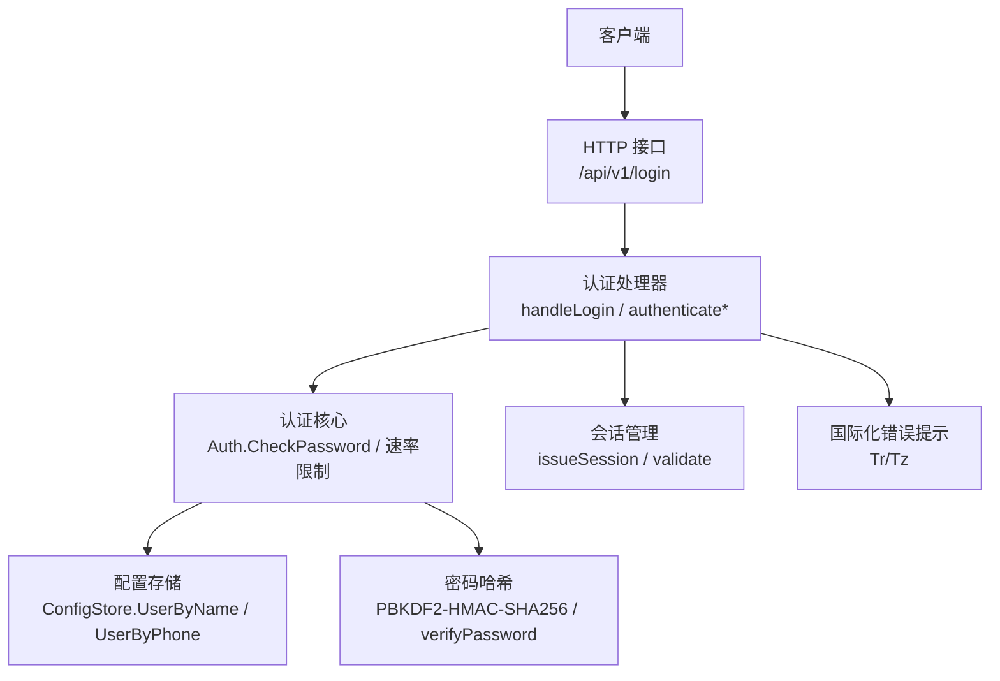
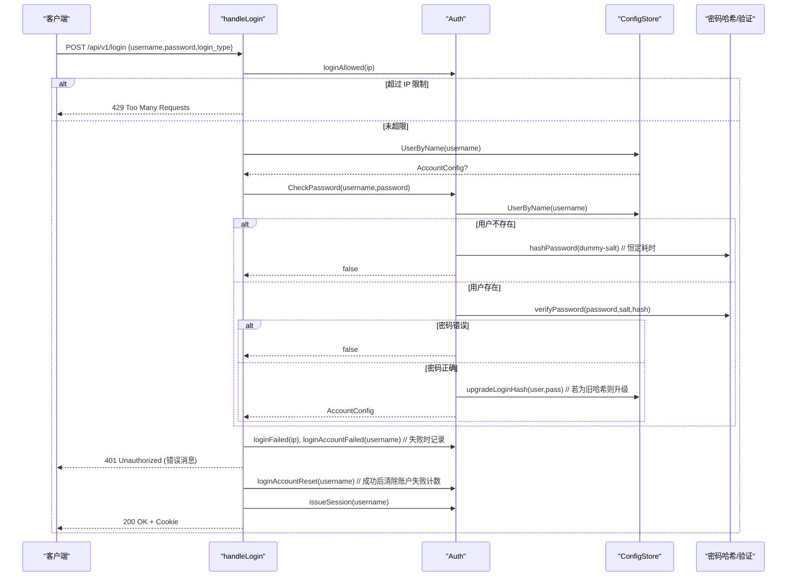
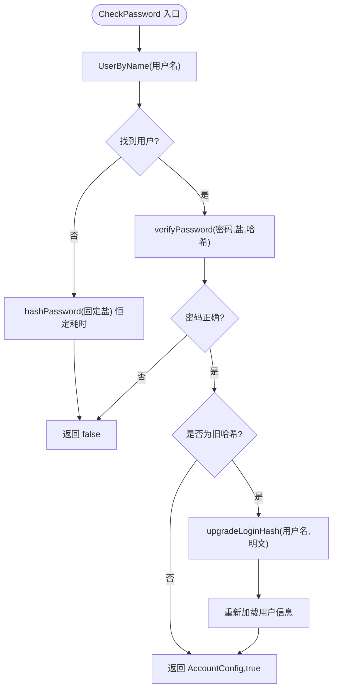
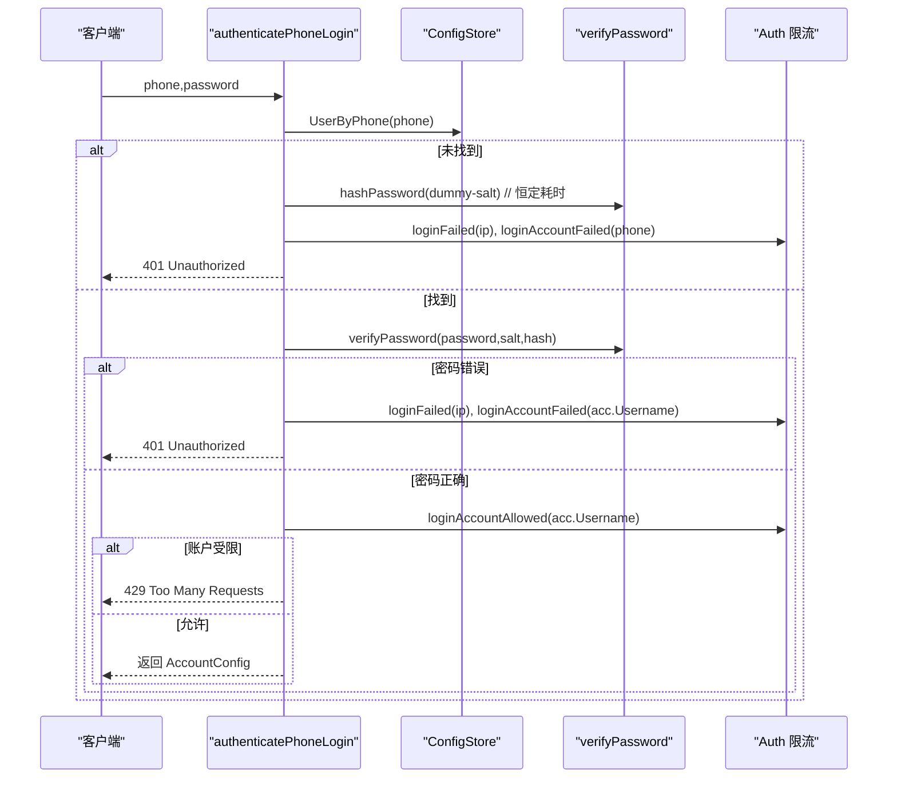
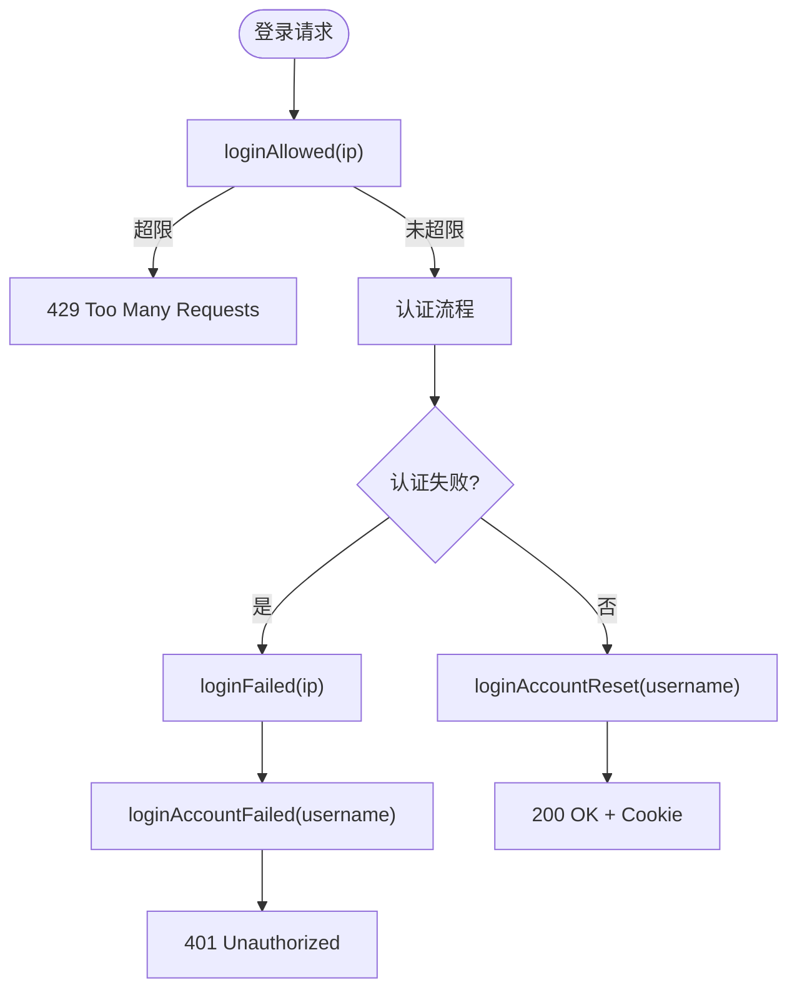
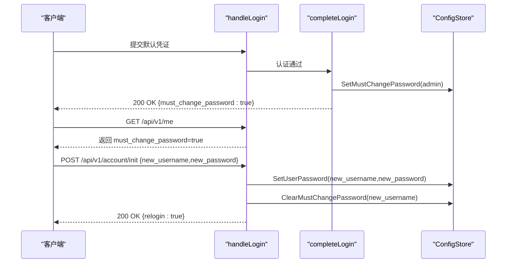
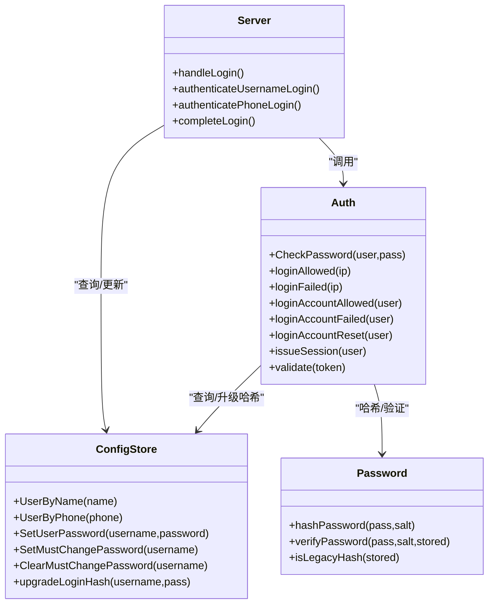

# 认证方式

<cite>
**本文引用的文件**   
- [auth_core.go](file://cmd/server/auth_core.go)
- [auth.go](file://cmd/server/auth.go)
- [users.go](file://cmd/server/users.go)
- [i18n-dashboard.zh-CN.json](file://cmd/server/i18n/zh-CN.json)
</cite>

## 目录
1. [简介](#简介)
2. [项目结构](#项目结构)
3. [核心组件](#核心组件)
4. [架构总览](#架构总览)
5. [详细组件分析](#详细组件分析)
6. [依赖关系分析](#依赖关系分析)
7. [性能与安全考量](#性能与安全考量)
8. [故障排查指南](#故障排查指南)
9. [结论](#结论)
10. [附录：错误码与提示](#附录错误码与提示)

## 简介
本文件系统性梳理并说明系统的认证机制，覆盖以下关键主题：
- 用户名/密码认证流程与 CheckPassword 工作原理
- PBKDF2 密码哈希升级机制（从旧版 SHA-256 平滑迁移）
- 时间常量比较防止时序攻击
- 手机号认证实现细节（UserByPhone、独立密码验证、防枚举的时间延迟）
- 登录失败防护（IP 级别与账户级别的尝试次数限制、暴力破解防护策略）
- 完整认证流程图与错误码说明
- 默认凭证检测与安全强制修改机制的实现原理

## 项目结构
认证相关逻辑主要分布在服务端模块中：
- 认证核心与速率限制、会话管理：auth_core.go
- 认证路由、处理器与 MFA 流程：auth.go
- 用户配置存储与账号查询接口：users.go
- 国际化错误提示：i18n-dashboard.zh-CN.json

图表来源
- [auth.go:176-206](file://cmd/server/auth.go#L176-L206)
- [auth_core.go:300-321](file://cmd/server/auth_core.go#L300-L321)
- [users.go:90-124](file://cmd/server/users.go#L90-L124)

章节来源
- [auth.go:176-206](file://cmd/server/auth.go#L176-L206)
- [auth_core.go:300-321](file://cmd/server/auth_core.go#L300-L321)
- [users.go:90-124](file://cmd/server/users.go#L90-L124)

## 核心组件
- 认证核心 Auth：负责密码校验、会话创建与校验、登录失败计数与限流、TOTP 一次性校验等。
- 配置存储 ConfigStore：提供按用户名、邮箱、手机号查找用户的接口，以及密码更新、MFA 设置、强制改密标志管理等。
- 密码哈希与验证：基于 PBKDF2-HMAC-SHA256，兼容旧版单轮 salted SHA-256，并在首次成功登录后自动升级为 PBKDF2。
- 认证处理器：统一入口 handleLogin，根据 login_type 分支到用户名或手机号认证路径，随后进入 completeLogin 完成 MFA、会话签发与响应。

章节来源
- [auth_core.go:107-150](file://cmd/server/auth_core.go#L107-L150)
- [auth_core.go:300-321](file://cmd/server/auth_core.go#L300-L321)
- [auth.go:176-206](file://cmd/server/auth.go#L176-L206)
- [users.go:90-124](file://cmd/server/users.go#L90-L124)

## 架构总览
下图展示一次完整的“用户名+密码”登录流程，包括失败防护、MFA 与强制改密检测。

图表来源
- [auth.go:176-206](file://cmd/server/auth.go#L176-L206)
- [auth.go:208-221](file://cmd/server/auth.go#L208-L221)
- [auth_core.go:300-321](file://cmd/server/auth_core.go#L300-L321)
- [users.go:90-100](file://cmd/server/users.go#L90-L100)

章节来源
- [auth.go:176-206](file://cmd/server/auth.go#L176-L206)
- [auth.go:208-221](file://cmd/server/auth.go#L208-L221)
- [auth_core.go:300-321](file://cmd/server/auth_core.go#L300-L321)
- [users.go:90-100](file://cmd/server/users.go#L90-L100)

## 详细组件分析

### 用户名/密码认证与 CheckPassword 工作原理
- 查找用户：通过 UserByName 精确匹配用户名。
- 未知用户防御：当用户不存在时，仍执行一次完整的 KDF（hashPassword），使响应时间近似恒定，避免侧信道泄露用户是否存在。
- 密码验证：verifyPassword 支持两种格式：
  - 当前格式：pbkdf2$sha256$迭代数$十六进制摘要
  - 旧格式：64 位十六进制的单轮 salted SHA-256
  - 使用 subtle.ConstantTimeCompare 进行时间常量比较，防止时序攻击。
- 透明升级：若检测到旧哈希，在认证成功后调用 upgradeLoginHash 将密码以 PBKDF2 重新计算并持久化，后续登录直接使用新格式。

图表来源
- [auth_core.go:300-321](file://cmd/server/auth_core.go#L300-L321)
- [auth_core.go:68-94](file://cmd/server/auth_core.go#L68-L94)
- [users.go:214-228](file://cmd/server/users.go#L214-L228)

章节来源
- [auth_core.go:300-321](file://cmd/server/auth_core.go#L300-L321)
- [auth_core.go:68-94](file://cmd/server/auth_core.go#L68-L94)
- [users.go:214-228](file://cmd/server/users.go#L214-L228)

### PBKDF2 密码哈希与升级机制
- 算法：PBKDF2-HMAC-SHA256，迭代次数 pbkdf2Iter 采用 OWASP 建议值，兼顾安全性与性能。
- 存储格式：自描述字符串，包含算法、迭代数与密钥材料，便于未来演进。
- 兼容旧哈希：verifyPassword 对旧格式进行兼容；isLegacyHash 用于判断是否需要升级。
- 升级时机：仅在认证成功且持有明文后触发，确保不会泄露明文。

章节来源
- [auth_core.go:22-28](file://cmd/server/auth_core.go#L22-L28)
- [auth_core.go:58-63](file://cmd/server/auth_core.go#L58-L63)
- [auth_core.go:68-94](file://cmd/server/auth_core.go#L68-L94)
- [users.go:214-228](file://cmd/server/users.go#L214-L228)

### 时间常量比较与防时序攻击
- 对比函数：subtle.ConstantTimeCompare 用于比对派生密钥与存储摘要，避免基于时间的差异泄露。
- 未知用户处理：即使用户名不存在，也执行完整 KDF，使响应时间不暴露用户是否存在。

章节来源
- [auth_core.go:68-88](file://cmd/server/auth_core.go#L68-L88)
- [auth_core.go:300-306](file://cmd/server/auth_core.go#L300-L306)

### 手机号认证实现细节
- 入口：handleLogin 根据 login_type=phone 分支到 authenticatePhoneLogin。
- 用户查找：UserByPhone 精确匹配手机号。
- 独立密码验证：由于 CheckPassword 基于用户名查找，手机号路径直接调用 verifyPassword 进行密码校验。
- 防枚举：当手机号不存在时，同样执行 hashPassword(dummy-salt) 保持恒定耗时，避免枚举。
- 失败防护：失败时同时记录 IP 与账户维度的失败次数；成功时检查账户级限制并放行。

图表来源
- [auth.go:223-248](file://cmd/server/auth.go#L223-L248)
- [users.go:114-124](file://cmd/server/users.go#L114-L124)
- [auth_core.go:184-212](file://cmd/server/auth_core.go#L184-L212)

章节来源
- [auth.go:223-248](file://cmd/server/auth.go#L223-L248)
- [users.go:114-124](file://cmd/server/users.go#L114-L124)
- [auth_core.go:184-212](file://cmd/server/auth_core.go#L184-L212)

### 登录失败防护机制（IP 与账户级别）
- IP 级别限流：
  - 滑动窗口：loginWindowSec（秒）内累计失败次数超过 loginMaxFailures 则拒绝。
  - 清理过期条目，防止内存无限增长。
- 账户级别限流：
  - 独立于 IP，针对用户名（大小写无关）统计失败次数，防止分布式 IP 轮换绕过。
  - 窗口 loginAccountWindowSec，阈值 loginAccountMaxFail。
- 成功后的重置：completeLogin 成功后调用 loginAccountReset 清零账户失败计数。

图表来源
- [auth_core.go:184-212](file://cmd/server/auth_core.go#L184-L212)
- [auth_core.go:214-260](file://cmd/server/auth_core.go#L214-L260)
- [auth.go:208-221](file://cmd/server/auth.go#L208-L221)
- [auth.go:250-307](file://cmd/server/auth.go#L250-L307)

章节来源
- [auth_core.go:184-212](file://cmd/server/auth_core.go#L184-L212)
- [auth_core.go:214-260](file://cmd/server/auth_core.go#L214-L260)
- [auth.go:208-221](file://cmd/server/auth.go#L208-L221)
- [auth.go:250-307](file://cmd/server/auth.go#L250-L307)

### 默认凭证检测与安全强制修改机制
- 检测条件：当用户名与密码均为默认值（例如 admin/admin）且 MustChangePassword 尚未设置时，系统会在首次登录时标记 MustChangePassword=true。
- 强制改密：completeLogin 返回 must_change_password 字段，前端引导用户进入安全初始化流程。
- 安全初始化：handleAccountInit 要求用户提供新的用户名与符合策略的密码，完成后清除 MustChangePassword 并强制重新登录。
- 日志审计：记录“检测到默认凭据登录，强制用户改密”的操作日志。

图表来源
- [auth.go:250-307](file://cmd/server/auth.go#L250-L307)
- [auth.go:469-529](file://cmd/server/auth.go#L469-L529)
- [users.go:230-253](file://cmd/server/users.go#L230-L253)

章节来源
- [auth.go:250-307](file://cmd/server/auth.go#L250-L307)
- [auth.go:469-529](file://cmd/server/auth.go#L469-L529)
- [users.go:230-253](file://cmd/server/users.go#L230-L253)

## 依赖关系分析
- 认证处理器依赖认证核心与配置存储。
- 认证核心依赖密码哈希与验证函数、会话管理、限流数据结构。
- 配置存储提供用户查询与密码/MFA/强制改密标志的管理。

图表来源
- [auth.go:176-206](file://cmd/server/auth.go#L176-L206)
- [auth_core.go:300-321](file://cmd/server/auth_core.go#L300-L321)
- [users.go:90-124](file://cmd/server/users.go#L90-L124)
- [auth_core.go:58-94](file://cmd/server/auth_core.go#L58-L94)

章节来源
- [auth.go:176-206](file://cmd/server/auth.go#L176-L206)
- [auth_core.go:300-321](file://cmd/server/auth_core.go#L300-L321)
- [users.go:90-124](file://cmd/server/users.go#L90-L124)
- [auth_core.go:58-94](file://cmd/server/auth_core.go#L58-L94)

## 性能与安全考量
- 性能
  - PBKDF2 迭代次数较高，单次验证有一定 CPU 开销，但可抵御离线爆破。
  - 限流数据结构定期清理过期条目，防止内存膨胀。
- 安全
  - 时间常量比较防止时序攻击。
  - 未知用户/手机号路径均执行恒定耗时操作，避免枚举。
  - 双维度限流（IP 与账户）有效缓解暴力破解与分布式攻击。
  - 默认凭证检测与强制改密降低初始风险。
  - TOTP 一次性校验防止重放。

[本节为通用指导，无需具体文件引用]

## 故障排查指南
- 登录频繁被拒（429）
  - 检查是否达到 IP 或账户级失败阈值，等待滑动窗口过期或联系管理员解锁。
- 用户名或密码错误（401）
  - 确认密码是否符合策略；检查是否启用了全局 MFA 并要求二次验证。
- 必须修改密码
  - 首次登录或管理员重置后会返回 must_change_password，需进入安全初始化流程。
- 终端二次验证失败
  - 检查终端密码是否已设置；多次失败会触发临时锁定。

章节来源
- [auth.go:176-206](file://cmd/server/auth.go#L176-L206)
- [auth.go:250-307](file://cmd/server/auth.go#L250-L307)
- [auth_core.go:555-585](file://cmd/server/auth_core.go#L555-L585)

## 结论
本认证体系以 PBKDF2 为核心，结合时间常量比较、双维度限流、默认凭证检测与强制改密、TOTP 一次性校验等机制，构建了较为完善的安全防线。手机号认证路径与用户名路径保持一致的安全策略，确保在不同入口下具备同等抗枚举与抗暴力破解能力。

[本节为总结性内容，无需具体文件引用]

## 附录：错误码与提示
以下为常见认证相关错误提示键名及中文含义（来自国际化资源）：
- auth.invalid_credentials：用户名或密码错误
- auth.totp_error：动态验证码错误
- auth.too_many_attempts：登录尝试过于频繁，请 5 分钟后再试
- auth.mfa_required_first：请先完成两步验证绑定
- auth.insufficient_permission：权限不足，该操作需要更高权限
- auth.invalid_username_format：用户名仅限字母/数字/-_.，长度 2–32 位
- auth.wrong_old_password：原密码错误
- auth.password_policy：密码至少 8 位，且需同时包含大写字母、小写字母、数字和特殊字符
- auth.gen_secret_failed：生成密钥失败
- auth.gen_qr_failed：生成二维码失败
- auth.totp_verify_failed：验证码不正确，请确认手机时间已同步后重试
- auth.wrong_password：密码不正确
- auth.save_failed：保存失败
- auth.global_mfa_required：管理员已启用全局两步验证策略，请完成绑定后登入
- auth.unauthorized：未授权
- auth.relay_unauthorized：中继密钥验证失败
- auth.must_change_password：管理员已重置您的密码，请立即修改密码
- auth.init_not_required：无需初始化：账户已完成安全设置

章节来源
- [i18n-dashboard.zh-CN.json:1-314](file://cmd/server/i18n/zh-CN.json#L1-L314)