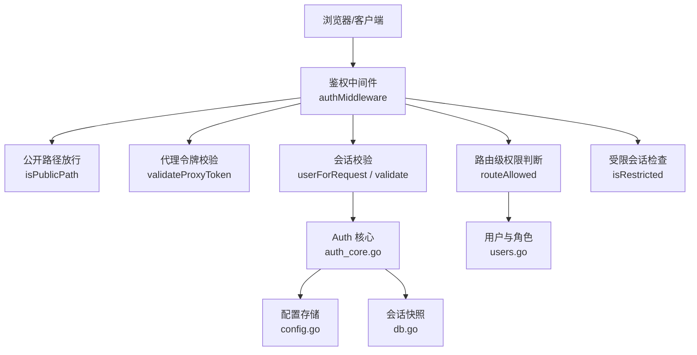
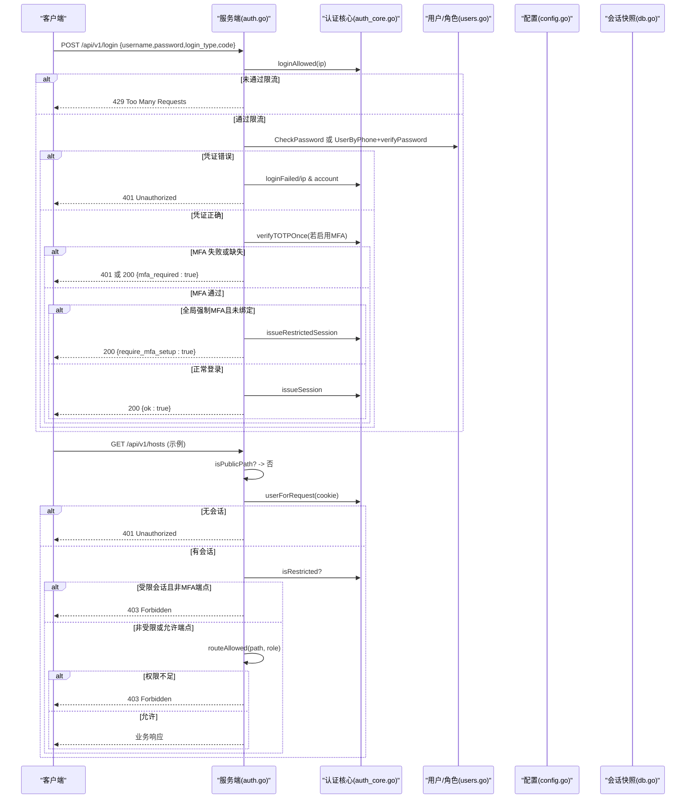
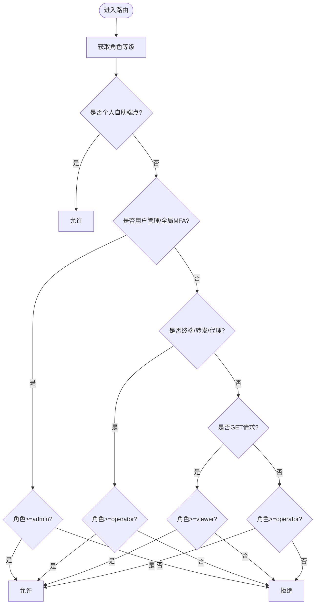
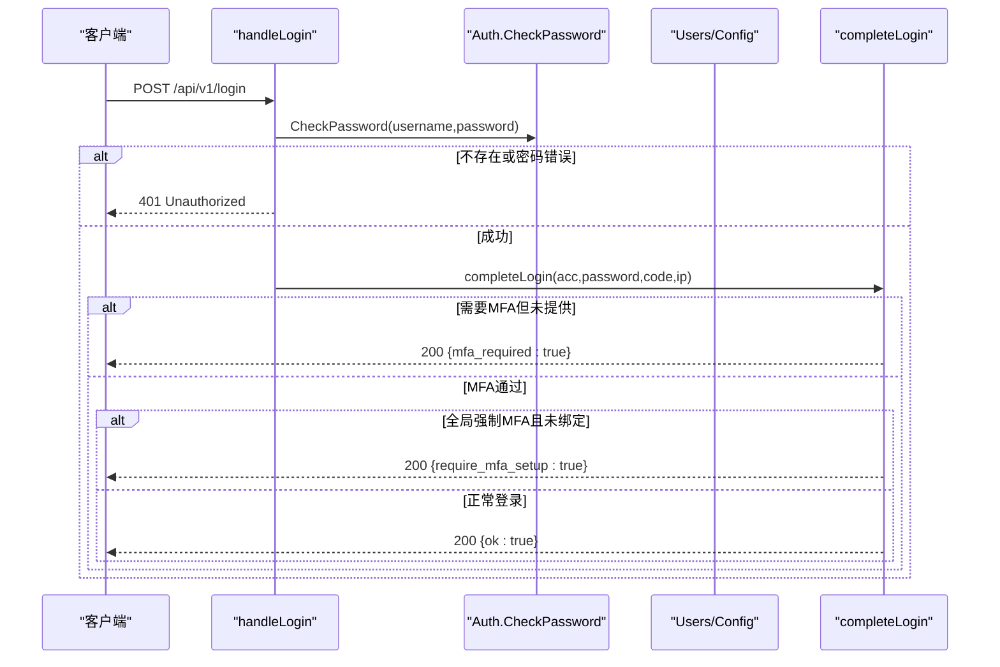
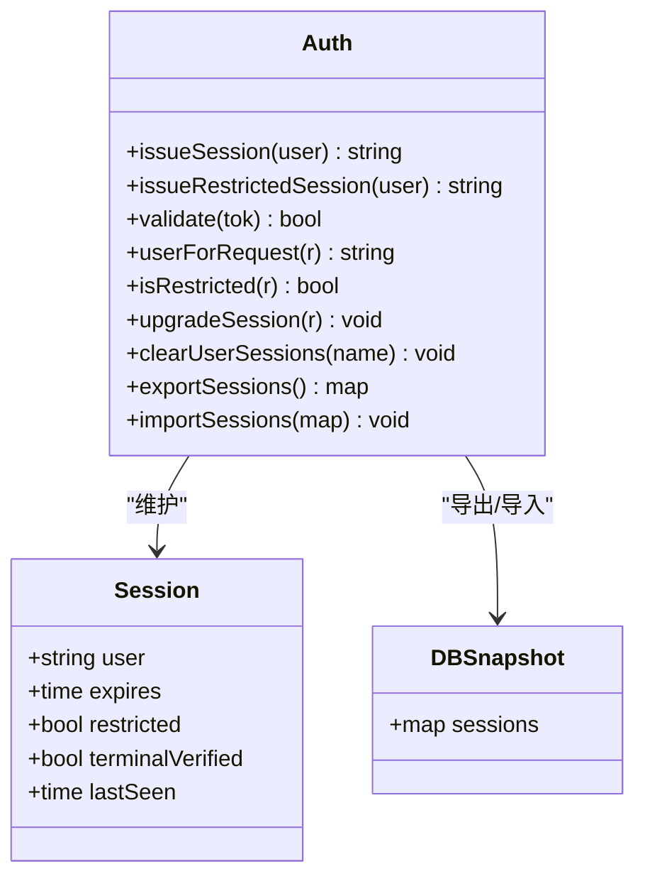
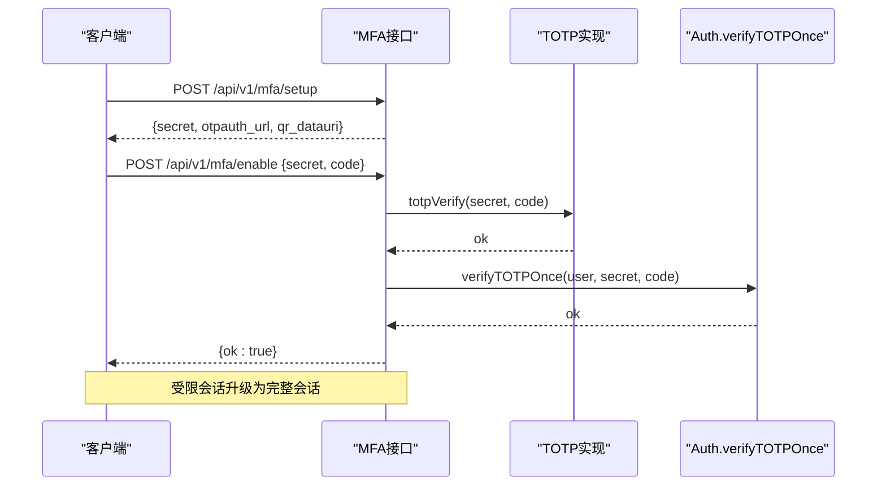
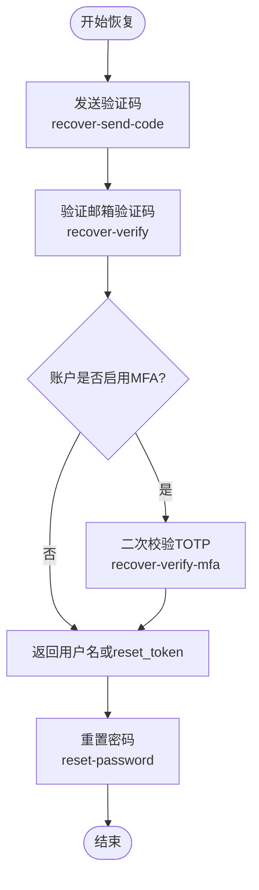
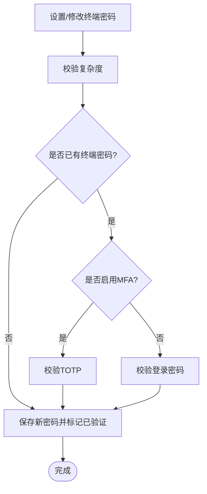
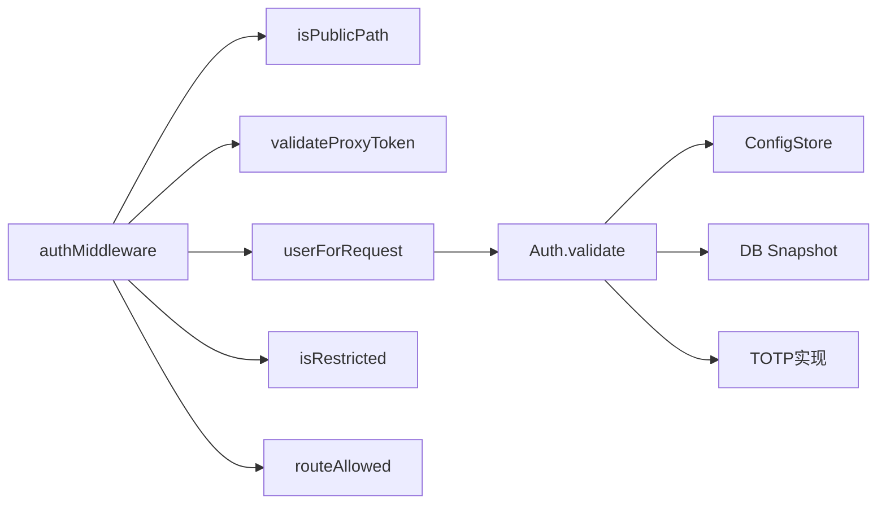

# 身份认证与授权

<cite>
**本文引用的文件**   
- [auth.go](file://cmd/server/auth.go)
- [auth_core.go](file://cmd/server/auth_core.go)
- [totp.go](file://cmd/server/totp.go)
- [users.go](file://cmd/server/users.go)
- [config.go](file://cmd/server/config.go)
- [recovery_api.go](file://cmd/server/recovery_api.go)
- [terminal_auth.go](file://cmd/server/terminal_auth.go)
- [db.go](file://cmd/server/db.go)
</cite>

## 目录
1. [简介](#简介)
2. [项目结构](#项目结构)
3. [核心组件](#核心组件)
4. [架构总览](#架构总览)
5. [详细组件分析](#详细组件分析)
6. [依赖关系分析](#依赖关系分析)
7. [性能与安全特性](#性能与安全特性)
8. [故障排查指南](#故障排查指南)
9. [结论](#结论)
10. [附录](#附录)

## 简介
本文件系统性梳理 AIOps Monitor 服务端的身份认证与授权机制，重点覆盖：
- RBAC（基于角色的访问控制）权限模型与路由级访问控制
- 用户认证流程：用户名/密码、手机号、TOTP 双因素
- 会话管理：Cookie 安全配置、会话生命周期、受限会话模式
- MFA 配置：TOTP 设置、全局 MFA 策略、账户恢复流程
- 安全机制：密码策略验证、登录失败防护、暴力破解防护等

## 项目结构
与认证授权相关的核心代码位于 cmd/server 目录下，关键文件职责如下：
- auth.go：登录/登出、RBAC 路由校验、MFA 接口、账号初始化与资料修改
- auth_core.go：会话管理、令牌生成、登录限流、TOTP 一次性校验、终端二次认证状态
- totp.go：TOTP 算法实现与二维码生成
- users.go：多用户与 RBAC 角色定义、用户元数据与密码管理
- config.go：全局配置（含 MFARequired、CORS、TrustProxy 等）、持久化与加密
- recovery_api.go：账户恢复（邮箱验证码 + TOTP）与密码重置
- terminal_auth.go：远程终端的二次密码策略与验证
- db.go：会话快照持久化（重启后保持会话状态）

**图表来源**
- [auth.go:112-172](file://cmd/server/auth.go#L112-L172)
- [auth_core.go:331-354](file://cmd/server/auth_core.go#L331-L354)
- [users.go:25-37](file://cmd/server/users.go#L25-L37)
- [config.go:780-800](file://cmd/server/config.go#L780-L800)
- [db.go:38-73](file://cmd/server/db.go#L38-L73)

**章节来源**
- [auth.go:18-49](file://cmd/server/auth.go#L18-L49)
- [auth.go:112-172](file://cmd/server/auth.go#L112-L172)
- [auth_core.go:17-20](file://cmd/server/auth_core.go#L17-L20)
- [users.go:19-41](file://cmd/server/users.go#L19-L41)
- [config.go:780-800](file://cmd/server/config.go#L780-L800)
- [db.go:38-73](file://cmd/server/db.go#L38-L73)

## 核心组件
- 认证与授权中间件：统一拦截非公开请求，完成会话校验、代理令牌校验、受限会话检查与 RBAC 判定。
- 会话管理器：负责会话创建、校验、过期、滑动空闲超时、受限会话标记、导出导入与清理。
- 密码与哈希：PBKDF2-HMAC-SHA256 强哈希，兼容旧格式并在首次成功登录时自动升级。
- TOTP 双因素：RFC 6238 兼容实现，支持 ±1 步时钟偏差与一次性使用防重放。
- RBAC 角色与路由控制：admin/operator/viewer 三级角色，按路径与方法进行细粒度控制。
- 账户恢复：邮箱验证码 + 可选 TOTP 二次校验，支持用户名找回与密码重置。
- 终端二次认证：独立于登录口令的“守护口令”，配合速率限制与锁定策略。

**章节来源**
- [auth.go:83-108](file://cmd/server/auth.go#L83-L108)
- [auth_core.go:96-135](file://cmd/server/auth_core.go#L96-L135)
- [auth_core.go:30-88](file://cmd/server/auth_core.go#L30-L88)
- [totp.go:16-24](file://cmd/server/totp.go#L16-L24)
- [users.go:19-41](file://cmd/server/users.go#L19-L41)
- [recovery_api.go:11-22](file://cmd/server/recovery_api.go#L11-L22)
- [terminal_auth.go:1-8](file://cmd/server/terminal_auth.go#L1-L8)

## 架构总览
下图展示一次典型登录到受控资源访问的完整流程，包括 MFA 与受限会话分支。

**图表来源**
- [auth.go:176-307](file://cmd/server/auth.go#L176-L307)
- [auth_core.go:331-354](file://cmd/server/auth_core.go#L331-L354)
- [auth_core.go:380-402](file://cmd/server/auth_core.go#L380-L402)
- [auth.go:83-108](file://cmd/server/auth.go#L83-L108)
- [db.go:38-73](file://cmd/server/db.go#L38-L73)

## 详细组件分析

### RBAC 权限模型与路由控制
- 角色等级：admin=3、operator=2、viewer=1；未知角色视为 0（拒绝）。
- 路由规则：
  - 个人自助：任何已登录角色均可访问自身资料、密码、MFA 相关端点。
  - 用户管理与全局 MFA：仅 admin。
  - 远程终端与端口转发：operator+。
  - 读操作（GET）：viewer+。
  - 其他写/动作：operator+。
- 代理令牌路径：即使通过 proxy token 校验，仍会再次执行 routeAllowed，防止越权。

**图表来源**
- [auth.go:83-108](file://cmd/server/auth.go#L83-L108)
- [users.go:25-37](file://cmd/server/users.go#L25-L37)

**章节来源**
- [auth.go:83-108](file://cmd/server/auth.go#L83-L108)
- [users.go:19-41](file://cmd/server/users.go#L19-L41)

### 用户认证流程
- 用户名/密码认证：
  - 调用 CheckPassword，内部使用 PBKDF2 对比，并自动将旧 SHA-256 哈希升级为 PBKDF2。
  - 失败记录 IP 与账号维度的失败次数，用于后续限流。
- 手机号认证：
  - 通过 UserByPhone 解析账号，再单独验证密码，避免枚举时序差异。
  - 失败同样记录 IP 与账号维度计数。
- 默认凭据检测与强制改密：
  - 首次以默认 admin/admin 登录时，服务端强制设置 MustChangePassword 标志，要求下次登录完成改密。
- 会话签发：
  - 成功后签发 Cookie，包含 HttpOnly、Secure（HTTPS 下）、SameSite=Lax、MaxAge=sessionTTL。
  - 若全局强制 MFA 且用户未绑定，则签发受限会话，仅允许 MFA 注册与登出。

**图表来源**
- [auth.go:176-206](file://cmd/server/auth.go#L176-L206)
- [auth_core.go:297-321](file://cmd/server/auth_core.go#L297-L321)
- [auth.go:252-307](file://cmd/server/auth.go#L252-L307)

**章节来源**
- [auth.go:208-248](file://cmd/server/auth.go#L208-L248)
- [auth.go:252-307](file://cmd/server/auth.go#L252-L307)
- [auth_core.go:297-321](file://cmd/server/auth_core.go#L297-L321)

### 会话管理机制
- Cookie 安全配置：
  - Name: aiops_session；HttpOnly=true；Secure 在 HTTPS 下启用；SameSite=Lax；MaxAge=sessionTTL（7天）。
- 会话生命周期：
  - 绝对过期：expires（7天）。
  - 滑动空闲超时：lastSeen 每请求更新，超过 sessionIdleTimeout（24小时）即失效。
  - 重启恢复：会话表导出/导入至快照，保留 terminalVerified 与 restricted 状态。
- 受限会话模式：
  - 当全局强制 MFA 且用户未绑定时，签发 restricted=true 的会话，仅允许 /api/v1/mfa/setup、/api/v1/mfa/enable、/api/v1/logout。
  - 完成 MFA 绑定后，可提升为完整会话。

**图表来源**
- [auth_core.go:380-432](file://cmd/server/auth_core.go#L380-L432)
- [auth_core.go:477-505](file://cmd/server/auth_core.go#L477-L505)
- [db.go:38-73](file://cmd/server/db.go#L38-L73)

**章节来源**
- [auth_core.go:17-20](file://cmd/server/auth_core.go#L17-L20)
- [auth_core.go:331-354](file://cmd/server/auth_core.go#L331-L354)
- [auth_core.go:391-432](file://cmd/server/auth_core.go#L391-L432)
- [db.go:38-73](file://cmd/server/db.go#L38-L73)

### MFA（TOTP）配置与验证
- 设置流程：
  - 调用 /api/v1/mfa/setup 生成 secret、otpauth_url 与 QR 码。
  - 客户端扫码后，调用 /api/v1/mfa/enable 提交当前 code 完成绑定。
  - 绑定成功后，可将受限会话升级为完整会话。
- 禁用流程：
  - 需重新输入登录密码验证，成功后清除 MFASecret。
- 全局策略：
  - 管理员可通过 /api/v1/mfa/global 开启/关闭全局强制 MFA。
  - 开启后，未绑定用户下次登录将被引导至受限会话并完成绑定。
- 一次性校验：
  - verifyTOTPOnce 基于时间步长记录已使用的 step，防止在 ±1 步窗口内重放。

**图表来源**
- [auth.go:536-585](file://cmd/server/auth.go#L536-L585)
- [totp.go:57-90](file://cmd/server/totp.go#L57-L90)
- [auth_core.go:262-285](file://cmd/server/auth_core.go#L262-L285)

**章节来源**
- [auth.go:536-639](file://cmd/server/auth.go#L536-L639)
- [totp.go:16-109](file://cmd/server/totp.go#L16-L109)
- [auth_core.go:262-285](file://cmd/server/auth_core.go#L262-L285)

### 账户恢复流程
- 发送验证码：
  - /api/v1/account/recover-send-code，根据 purpose 区分“找回用户名”或“重置密码”。
  - 无论邮箱是否存在，均返回相同响应，防止枚举。
- 验证验证码：
  - /api/v1/account/recover-verify，若账户启用了 MFA，返回 mfa_required=true，需继续 /recover-verify-mfa。
- 二次因子校验：
  - /api/v1/account/recover-verify-mfa，校验 TOTP 后消费邮箱验证码并返回用户名或一次性 reset_token。
- 重置密码：
  - 使用 reset_token 或直接走旧流程（username+email+code），均需满足密码策略；若账户启用 MFA，需额外提供 TOTP。
- 解除 MFA（邮箱）：
  - 已登录用户可通过 /api/v1/mfa/unbind-via-email 发送验证码并验证，从而解绑 MFA。

**图表来源**
- [recovery_api.go:24-92](file://cmd/server/recovery_api.go#L24-L92)
- [recovery_api.go:94-186](file://cmd/server/recovery_api.go#L94-L186)
- [recovery_api.go:208-284](file://cmd/server/recovery_api.go#L208-L284)

**章节来源**
- [recovery_api.go:24-92](file://cmd/server/recovery_api.go#L24-L92)
- [recovery_api.go:94-186](file://cmd/server/recovery_api.go#L94-L186)
- [recovery_api.go:208-284](file://cmd/server/recovery_api.go#L208-L284)

### 密码策略与终端二次认证
- 登录密码策略：
  - 至少 8 位，同时包含大写字母、小写字母、数字与特殊字符。
  - 变更密码时需验证旧密码，成功后刷新会话并清除 MustChangePassword。
- 终端二次密码策略：
  - 独立于登录口令，强度要求一致（≥8 位，大小写+数字+特殊字符）。
  - 首次设置无需二次因子；修改时需要 MFA 或登录密码验证。
  - 每次连接前需二次验证，失败触发速率限制与锁定。

**图表来源**
- [auth.go:60-81](file://cmd/server/auth.go#L60-L81)
- [terminal_auth.go:17-40](file://cmd/server/terminal_auth.go#L17-L40)
- [terminal_auth.go:66-122](file://cmd/server/terminal_auth.go#L66-L122)

**章节来源**
- [auth.go:60-81](file://cmd/server/auth.go#L60-L81)
- [terminal_auth.go:17-40](file://cmd/server/terminal_auth.go#L17-L40)
- [terminal_auth.go:66-122](file://cmd/server/terminal_auth.go#L66-L122)

## 依赖关系分析
- 中间件依赖：
  - authMiddleware 依赖 isPublicPath、validateProxyToken、userForRequest、isRestricted、routeAllowed。
- 认证核心依赖：
  - Auth 依赖 ConfigStore（用户查询、MFA 策略）、DB 快照（会话持久化）、TOTP 工具。
- 配置项影响：
  - MFARequired：全局强制 MFA 开关。
  - TrustProxy：是否信任反向代理的 X-Real-IP/X-Forwarded-For（影响登录限流与审计日志）。
  - RelaySecret：网关中继共享密钥，用于代理请求鉴权。

**图表来源**
- [auth.go:112-172](file://cmd/server/auth.go#L112-L172)
- [auth_core.go:331-354](file://cmd/server/auth_core.go#L331-L354)
- [config.go:780-800](file://cmd/server/config.go#L780-L800)
- [db.go:38-73](file://cmd/server/db.go#L38-L73)

**章节来源**
- [auth.go:112-172](file://cmd/server/auth.go#L112-L172)
- [auth_core.go:331-354](file://cmd/server/auth_core.go#L331-L354)
- [config.go:780-800](file://cmd/server/config.go#L780-L800)
- [db.go:38-73](file://cmd/server/db.go#L38-L73)

## 性能与安全特性
- 暴力破解防护：
  - 基于 IP 的滑动窗口限流：固定窗口时长与最大失败次数，超限返回 429。
  - 基于账号维度的滑动窗口限流：防止分布式 IP 轮换攻击同一账号。
  - 终端二次密码验证：失败次数阈值与锁定时间，返回剩余尝试次数。
- 密码哈希：
  - PBKDF2-HMAC-SHA256，迭代次数符合 OWASP 建议；旧格式自动升级。
- 会话安全：
  - Cookie 安全属性：HttpOnly、Secure（HTTPS）、SameSite=Lax。
  - 滑动空闲超时与绝对过期双重保护。
  - 受限会话模式强制 MFA 绑定。
- 代理令牌：
  - 短生命周期、单次使用；校验后仍执行 RBAC，防止越权。
- 配置安全：
  - 配置文件权限 0o600；敏感字段支持静态加密；环境变量覆盖。

[本节为通用指导，不直接分析具体文件]

## 故障排查指南
- 登录被限流：
  - 检查 IP 与账号维度的失败计数；确认 TrustProxy 配置是否正确，避免误计真实客户端 IP。
- 无法访问受限端点：
  - 确认是否为受限会话且访问非 MFA 端点；完成 MFA 绑定后重试。
- TOTP 校验失败：
  - 检查设备时间与服务器时间偏差；确认 OTP 应用与服务器使用相同算法与周期。
- 终端二次密码锁定：
  - 等待锁定时间结束后重试；确保密码复杂度符合要求。
- 账户恢复失败：
  - 检查 SMTP 配置与可用性；确认邮箱验证码未过期；若启用 MFA，需提供 TOTP。

**章节来源**
- [auth_core.go:182-241](file://cmd/server/auth_core.go#L182-L241)
- [auth_core.go:555-585](file://cmd/server/auth_core.go#L555-L585)
- [recovery_api.go:24-92](file://cmd/server/recovery_api.go#L24-L92)

## 结论
该系统的认证与授权设计遵循最小权限原则与纵深防御理念：
- RBAC 精细到路由级别，结合代理令牌与受限会话，有效降低越权风险。
- 强密码哈希与多通道限流抵御暴力破解与枚举攻击。
- TOTP 双因素与一次性校验增强账户安全性。
- 会话管理兼顾可用性与安全性，支持平滑重启与空闲超时。
- 账户恢复流程考虑了 MFA 场景与防枚举策略，保障用户体验与安全平衡。

[本节为总结性内容，不直接分析具体文件]

## 附录
- 关键常量与默认值：
  - 会话 Cookie 名称与 TTL：aiops_session、7 天。
  - 滑动空闲超时：24 小时。
  - 登录限流窗口与阈值：300 秒、8 次（IP）；900 秒、10 次（账号）。
  - 终端二次密码锁定：3 次失败、5 分钟锁定。
- 配置项参考：
  - MFARequired：全局强制 MFA。
  - TrustProxy：是否信任反向代理头。
  - RelaySecret：网关中继共享密钥。

**章节来源**
- [auth_core.go:17-20](file://cmd/server/auth_core.go#L17-L20)
- [auth_core.go:137-150](file://cmd/server/auth_core.go#L137-L150)
- [config.go:780-800](file://cmd/server/config.go#L780-L800)