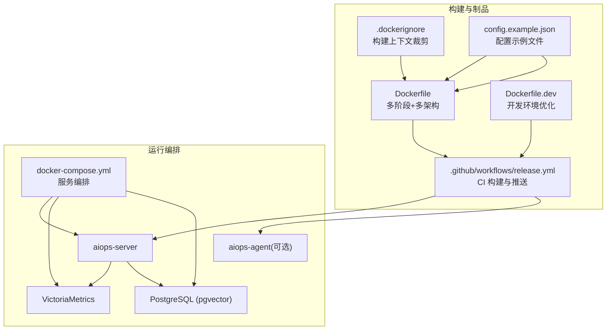
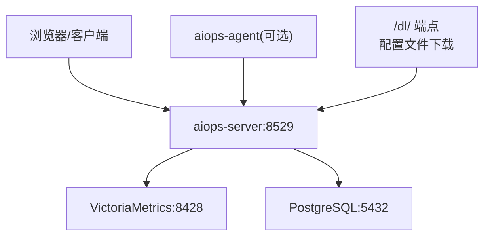
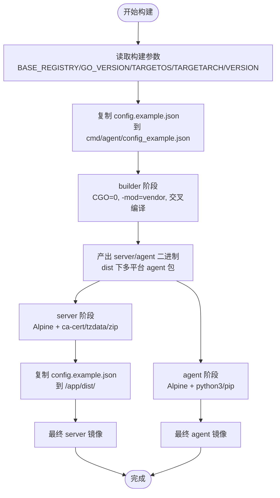
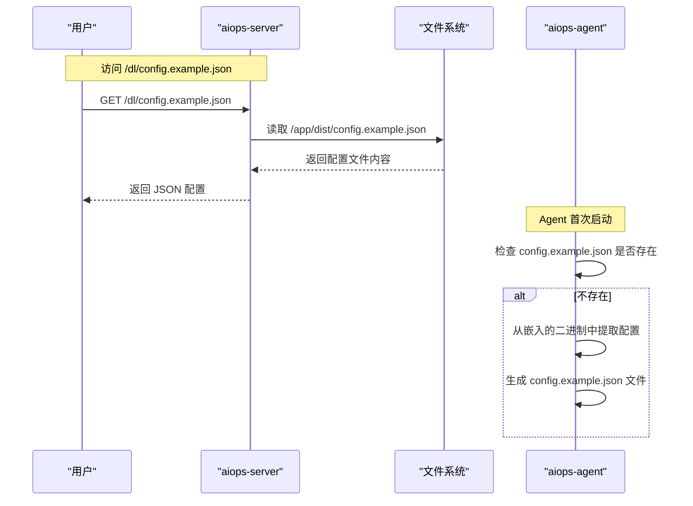
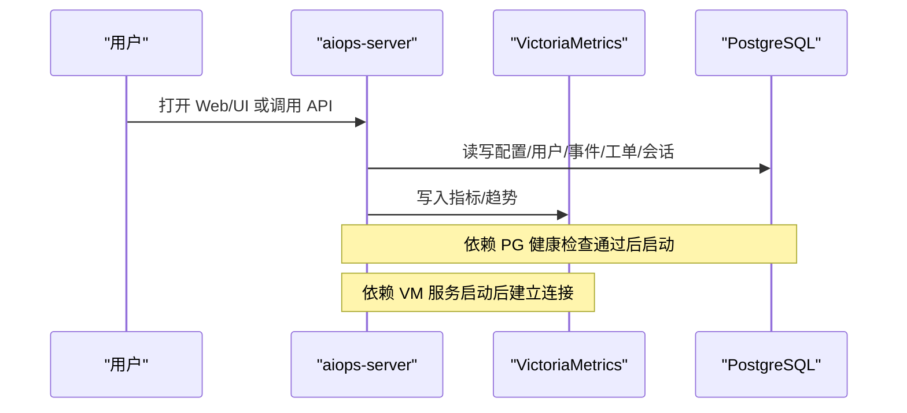
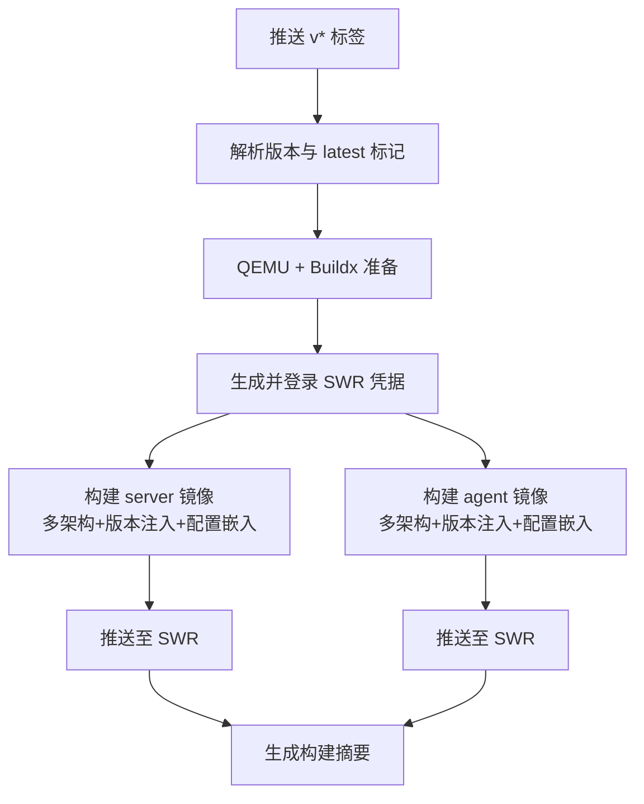
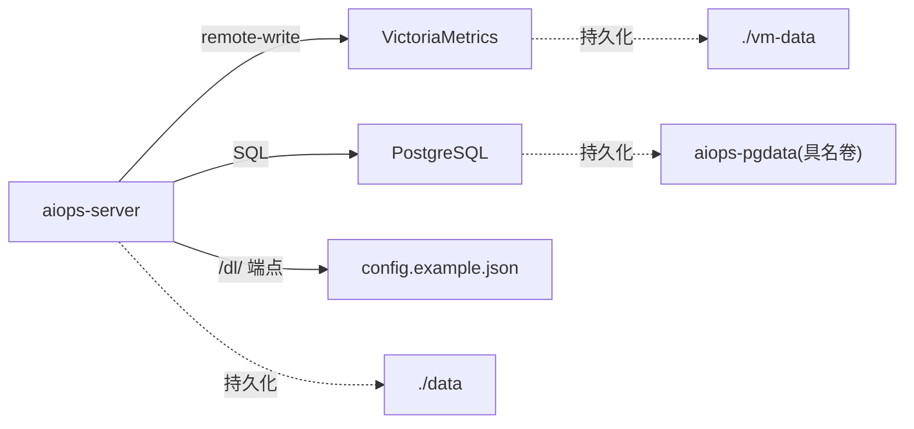

# Docker 容器化部署

<cite>
**本文引用的文件**
- [docker/Dockerfile](file://docker/Dockerfile)
- [docker/Dockerfile.dev](file://docker/Dockerfile.dev)
- [.dockerignore](file://.dockerignore)
- [config.example.json](file://config.example.json)
- [cmd/agent/embed.go](file://cmd/agent/embed.go)
- [cmd/server/handlers.go](file://cmd/server/handlers.go)
- [.github/workflows/release.yml](file://.github/workflows/release.yml)
- [README.md](file://README.md)
- [DEPLOY_GUIDE.md](file://DEPLOY_GUIDE.md)
</cite>

## 更新摘要
**所做更改**
- 更新了镜像构建章节，详细说明 config.example.json 的嵌入机制和 /dl/ 端点支持
- 新增了配置示例文件嵌入的技术实现说明
- 完善了生产环境构建失败的故障排除指南
- 增强了多架构构建的配置要求说明

## 目录
1. [简介](#简介)
2. [项目结构](#项目结构)
3. [核心组件](#核心组件)
4. [架构总览](#架构总览)
5. [详细组件分析](#详细组件分析)
6. [依赖关系分析](#依赖关系分析)
7. [性能与资源建议](#性能与资源建议)
8. [生产环境最佳实践](#生产环境最佳实践)
9. [故障排除指南](#故障排除指南)
10. [结论](#结论)

## 简介
本指南面向使用 Docker 与 Docker Compose 部署 AIOps Monitor 的读者，覆盖镜像构建（多架构、多阶段、版本注入）、编排配置（服务依赖、数据卷、网络、环境变量）、生产安全与可观测性要点，以及常见问题排查。仓库已提供完整的多架构构建流水线与一键编排示例，可直接用于本地测试与生产部署。

## 项目结构
与容器化相关的核心文件与职责：
- docker/Dockerfile：多阶段构建，支持 linux/amd64 与 linux/arm64；通过 ldflags 注入版本号；分别产出 server 与 agent 镜像。
- docker/Dockerfile.dev：开发环境专用构建文件，跳过交叉编译以加速构建过程。
- .dockerignore：精简构建上下文，避免将运行时数据、文档与生成文件打入镜像。
- config.example.json：Agent 配置文件示例，通过 go:embed 机制内嵌到二进制中。
- cmd/agent/embed.go：实现配置示例文件的嵌入和自动生成功能。
- .github/workflows/release.yml：CI/CD 自动构建并推送多架构镜像至华为云 SWR。
- README.md：包含快速开始、环境变量说明、镜像加速器配置等。
- DEPLOY_GUIDE.md：HTTP 代理"unexpected EOF"问题修复与部署步骤。

图表来源
- [docker/Dockerfile:1-76](file://docker/Dockerfile#L1-L76)
- [docker/Dockerfile.dev:1-50](file://docker/Dockerfile.dev#L1-50)
- [.github/workflows/release.yml:1-130](file://.github/workflows/release.yml#L1-L130)
- [.dockerignore:1-41](file://.dockerignore#L1-L41)
- [config.example.json:1-96](file://config.example.json#L1-96)

章节来源
- [docker/Dockerfile:1-76](file://docker/Dockerfile#L1-76)
- [docker/Dockerfile.dev:1-50](file://docker/Dockerfile.dev#L1-50)
- [.dockerignore:1-41](file://.dockerignore#L1-L41)
- [config.example.json:1-96](file://config.example.json#L1-96)
- [.github/workflows/release.yml:1-130](file://.github/workflows/release.yml#L1-L130)

## 核心组件
- 服务端镜像（server）
  - 基于 Alpine，仅包含运行时依赖（ca-certificates、tzdata、zip），暴露 8529 端口，声明健康检查与健康探针路径 /healthz，挂载 /app/data 持久化。
  - 启动参数默认监听 :8529，加载配置文件与 dist 包（内含各平台 Agent 二进制）。
  - **新增**：内置 config.example.json 配置文件示例，可通过 /dl/config.example.json 端点下载。
- Agent 镜像（agent）
  - 基于 Alpine，安装 Python3 及必要库，内置 aiops-agent 二进制，默认连接 aiops-server:8529。
  - **新增**：首次启动时自动生成 config.example.json 参考配置文件。
- 时序数据库（VictoriaMetrics）
  - 以命令参数指定存储路径、保留周期与监听地址；数据持久化到 /vmdata。
- 关系数据库（PostgreSQL + pgvector）
  - 使用官方 pgvector 镜像，设置用户/密码/数据库名；健康检查使用 pg_isready；数据使用具名卷 aiops-pgdata 持久化。

章节来源
- [docker/Dockerfile:47-62](file://docker/Dockerfile#L47-L62)
- [docker/Dockerfile:64-76](file://docker/Dockerfile#L64-L76)
- [cmd/agent/embed.go:11-39](file://cmd/agent/embed.go#L11-L39)
- [cmd/server/handlers.go:357-359](file://cmd/server/handlers.go#L357-L359)

## 架构总览
AIOps Monitor 在容器中由三部分组成：
- aiops-server：Web/API 入口，负责指标接收、配置管理、事件与工单、远程终端、转发与代理等。
- VictoriaMetrics：时序数据存储，接收来自 server 的指标写入。
- PostgreSQL：关系型存储，承载配置、用户、审计、事件、工单、会话等数据。

图表来源
- [docker-compose.yml:49-121](file://docker-compose.yml#L49-L121)
- [cmd/server/handlers.go:357-359](file://cmd/server/handlers.go#L357-L359)

## 详细组件分析

### 镜像构建（Dockerfile）
- 多架构支持
  - 使用 buildx 与 QEMU，在 CI 中同时构建 linux/amd64 与 linux/arm64 镜像。
  - 构建阶段固定为 BUILDPLATFORM，交叉编译 GOOS/GOARCH，避免在 arm64 上执行慢速 Go 编译。
- 多阶段构建优化
  - builder 阶段：复制源码与 vendor，关闭 CGO，使用 -mod=vendor 进行静态链接，减小最终镜像体积。
  - server 阶段：仅拷贝编译产物与插件打包 zip，最小化运行时依赖。
  - agent 阶段：仅拷贝 agent 二进制与插件，按需安装 Python 依赖。
- 版本注入机制
  - 通过 --build-arg VERSION 注入 main.appVersion，并在 ldflags 中传入，使二进制内嵌版本号。
  - CI 从 Git tag 解析版本号并作为构建参数传入。
- 构建上下文裁剪
  - .dockerignore 排除 .git、node_modules、预编译二进制、日志、数据目录与文档，显著减少构建上下文大小。
- **新增**：配置示例文件嵌入机制
  - 在构建阶段将 config.example.json 复制到 cmd/agent/config_example.json，供 go:embed 指令使用。
  - 在 server 阶段将 config.example.json 放入 /app/dist/ 目录，通过 /dl/ 端点提供服务。
  - 确保 Agent 首次启动时能够自动生成配置示例文件，Server 能够提供配置文件下载服务。

图表来源
- [docker/Dockerfile:28-53](file://docker/Dockerfile#L28-L53)
- [docker/Dockerfile.dev:15-33](file://docker/Dockerfile.dev#L15-33)

章节来源
- [docker/Dockerfile:1-76](file://docker/Dockerfile#L1-76)
- [docker/Dockerfile.dev:1-50](file://docker/Dockerfile.dev#L1-50)
- [.dockerignore:1-41](file://.dockerignore#L1-L41)
- [cmd/agent/embed.go:11-39](file://cmd/agent/embed.go#L11-L39)

### 配置示例文件嵌入机制
- **go:embed 指令实现**
  - 在 cmd/agent/embed.go 中使用 `//go:embed config_example.json` 将配置示例文件嵌入到二进制中。
  - 通过 `//go:generate cp ../../config.example.json config_example.json` 在构建前复制配置文件。
- **自动生成功能**
  - Agent 首次启动时调用 ensureConfigExample() 函数，在配置文件目录下生成 config.example.json。
  - 如果用户已存在自定义配置文件，则不会覆盖现有文件。
- **/dl/ 端点支持**
  - Server 通过 http.FileServer 提供 /dl/ 端点，允许下载 dist 目录下的所有文件。
  - 包括各平台 Agent 二进制文件和 config.example.json 配置文件。
  - 支持一键安装脚本直接下载所需文件。

图表来源
- [cmd/agent/embed.go:19-39](file://cmd/agent/embed.go#L19-L39)
- [cmd/server/handlers.go:357-359](file://cmd/server/handlers.go#L357-L359)
- [docker/Dockerfile:53](file://docker/Dockerfile#L53)

章节来源
- [cmd/agent/embed.go:1-40](file://cmd/agent/embed.go#L1-40)
- [cmd/server/handlers.go:357-359](file://cmd/server/handlers.go#L357-L359)
- [docker/Dockerfile:28-53](file://docker/Dockerfile#L28-L53)

### 编排配置（docker-compose.yml）
- 服务依赖关系
  - aiops-server 依赖 victoriametrics（service_started）与 postgres（service_healthy），确保数据库就绪后再启动。
- 数据卷挂载
  - ./data:/app/data：存放终端录制与可选 TLS 证书；关系数据与配置落 PG。
  - ./vm-data:/vmdata：VictoriaMetrics 数据持久化。
  - 具名卷 aiops-pgdata:/var/lib/postgresql：PostgreSQL 数据持久化，避免 Windows/Mac 绑定挂载 fsync 不可靠导致 WAL 损坏。
- 网络与端口
  - 8529：Web UI 与 API。
  - 10100-10300：TCP 转发监听范围，需与 AIOPS_FORWARD_LISTEN/AIOPS_FORWARD_PORT_RANGE 一致。
  - 8428：VM 的 UI/PromQL（默认注释，仅内网建议开放）。
- 环境变量
  - AIOPS_VM_URL：指向 VictoriaMetrics。
  - AIOPS_POSTGRES_DSN：PG 连接串，未配置拒绝启动。
  - AIOPS_SECRET_KEY：配置密钥主密钥，对敏感字段做 AES-256-GCM 静态加密。
  - AIOPS_FORWARD_LISTEN/AIOPS_FORWARD_PORT_RANGE：控制转发监听与端口范围。
  - TZ：时区设置。
- 健康检查
  - server：wget 访问 /healthz。
  - postgres：pg_isready 探测。

图表来源
- [docker-compose.yml:49-121](file://docker-compose.yml#L49-L121)

章节来源
- [docker-compose.yml:49-121](file://docker-compose.yml#L49-L121)

### CI/CD 多架构构建与发布
- 触发条件：推送 v* 标签或手动触发 workflow_dispatch。
- 关键步骤：
  - 解析版本号与是否更新 latest。
  - 设置 QEMU 与 Buildx。
  - 生成 SWR 登录凭据并登录。
  - 构建并推送 server 与 agent 镜像，目标平台 linux/amd64,linux/arm64。
  - 注入构建参数 VERSION 与 BASE_REGISTRY=docker.io。
- 输出产物：
  - 华为云 SWR 上的 aiops-server 与 aiops-agent 镜像，带具体版本与 latest 标签。

图表来源
- [.github/workflows/release.yml:1-130](file://.github/workflows/release.yml#L1-L130)

章节来源
- [.github/workflows/release.yml:1-130](file://.github/workflows/release.yml#L1-L130)

### Agent 镜像与插件
- Agent 镜像包含 aiops-agent 二进制与 plugins 目录，默认连接 aiops-server:8529。
- 插件以 Python 脚本形式存在，按周期执行并向 stdout 输出 JSON 指标与事件。
- 可通过 command 参数启用日志采集（--log-paths），或调整采集间隔与分类。
- **新增**：首次启动自动生成 config.example.json 参考配置文件，便于用户了解所有可用配置选项。

章节来源
- [docker/Dockerfile:64-76](file://docker/Dockerfile#L64-L76)
- [docker-compose.yml:123-138](file://docker-compose.yml#L123-L138)
- [cmd/agent/embed.go:19-39](file://cmd/agent/embed.go#L19-L39)

## 依赖关系分析
- 服务间依赖
  - aiops-server → victoria-metrics（服务启动即连）
  - aiops-server → postgres（健康检查通过后启动）
- 外部依赖
  - 镜像源：aiops-server/aiops-agent 使用华为云 SWR；postgres/victoriametrics 默认使用 Docker Hub 官方镜像（ARM64 兼容）。
  - 网络：8529 对外暴露；10100-10300 用于 TCP 转发；8428 可选暴露 VM 控制台。
- 数据持久化
  - ./data：终端录制与可选 TLS 证书。
  - ./vm-data：VM 数据。
  - aiops-pgdata：PG 数据（具名卷）。
- **新增**：配置示例文件依赖
  - config.example.json 文件必须在构建上下文中可用，否则会导致 go:embed 构建失败。
  - /dl/ 端点需要 config.example.json 文件存在于 /app/dist/ 目录。

图表来源
- [docker-compose.yml:49-121](file://docker-compose.yml#L49-L121)
- [cmd/server/handlers.go:357-359](file://cmd/server/handlers.go#L357-L359)

章节来源
- [docker-compose.yml:49-121](file://docker-compose.yml#L49-L121)
- [cmd/server/handlers.go:357-359](file://cmd/server/handlers.go#L357-L359)

## 性能与资源建议
- 镜像体积优化
  - 多阶段构建与静态链接（CGO=0）显著减小镜像体积。
  - .dockerignore 剔除无关文件，降低构建上下文大小。
- 运行时资源限制
  - 建议在宿主机或编排层为容器设置 CPU/内存上限，避免争用。
- 存储选择
  - PostgreSQL 建议使用具名卷或原生文件系统挂载，避免 Windows/Mac 绑定挂载导致的 fsync 可靠性问题。
- 网络与端口
  - 合理设置 AIOPS_FORWARD_LISTEN 与 AIOPS_FORWARD_PORT_RANGE，并确保与 ports 映射一致。

[本节为通用指导，不直接分析具体文件]

## 生产环境最佳实践
- 镜像安全扫描
  - 在 CI 中集成镜像扫描（如 Trivy、Clair），阻断高危漏洞镜像入库。
  - 定期升级基础镜像与依赖，关注 CVE 公告。
- 资源限制
  - 为每个容器设置 CPU/内存限制与重启策略（restart: unless-stopped）。
- 健康检查
  - 利用 Docker HEALTHCHECK 与 Compose depends_on condition 确保服务就绪顺序。
- 日志收集
  - 使用 Docker 日志驱动（json-file 或 journald）集中收集，结合 ELK/Loki 统一检索。
- 密钥与证书
  - 使用 AIOPS_SECRET_KEY 对敏感配置做静态加密；妥善保管主密钥。
  - 如需 HTTPS，挂载证书与私钥并通过 AIOPS_TLS_CERT/AIOPS_TLS_KEY 启用。
- 备份与恢复
  - 定期备份 PG 与 VM 数据；制定回滚策略与演练计划。
- 网络与安全
  - 仅暴露必要端口；在生产环境中置于反向代理之后，启用 WAF 与访问控制。
- 版本锁定
  - 生产环境锁定镜像版本标签（如 v5.5.5），避免 latest 漂移。
- **新增**：配置示例文件管理
  - 确保 config.example.json 文件在构建上下文中可用，避免构建失败。
  - 定期检查配置示例文件的完整性，确保 /dl/ 端点正常工作。

[本节为通用指导，不直接分析具体文件]

## 故障排除指南
- 无法拉取 Docker Hub 镜像
  - 配置 Docker 镜像加速器或在 compose 中将 postgres/victoriametrics 替换为 SWR 镜像（注意 SWR 仅 amd64）。
- 首次登录与密钥
  - 默认凭据 admin/admin，首次登录强制安全初始化；务必修改用户名与密码，并设置 AIOPS_SECRET_KEY。
- 端口转发不可达
  - 确认 AIOPS_FORWARD_LISTEN=0.0.0.0 且 ports 映射包含 10100-10300。
- 数据库连接失败
  - 检查 AIOPS_POSTGRES_DSN 与 POSTGRES_PASSWORD 一致性；确认 PG 健康检查通过。
- HTTP 代理"unexpected EOF"
  - 参考修复指南，增加超时与错误信息改进；必要时升级服务端与 Agent。
- 日志与调试
  - 使用 docker compose logs -f 查看服务日志；根据错误提示定位问题。
- **新增**：生产环境构建失败
  - 错误现象：构建过程中出现 "pattern cmd/agent/config_example.json: no matching files" 错误。
  - 解决方案：确保 config.example.json 文件存在于项目根目录，并且没有被 .dockerignore 排除。
  - 预防措施：在构建前验证配置文件存在性，或在 CI 流程中添加文件存在性检查。
- **新增**：/dl/ 端点无法访问
  - 错误现象：访问 /dl/config.example.json 返回 404 错误。
  - 解决方案：检查 Dockerfile 是否正确复制 config.example.json 到 /app/dist/ 目录。
  - 验证方法：进入容器执行 `ls -la /app/dist/config.example.json` 确认文件存在。
- **新增**：Agent 无法生成配置示例
  - 错误现象：Agent 启动后没有生成 config.example.json 文件。
  - 解决方案：检查 Agent 是否有写入配置目录的权限，查看日志中的相关警告信息。
  - 手动解决：从 /dl/config.example.json 下载配置文件并放置在正确位置。

章节来源
- [README.md:104-122](file://README.md#L104-L122)
- [README.md:180-226](file://README.md#L180-L226)
- [DEPLOY_GUIDE.md:1-107](file://DEPLOY_GUIDE.md#L1-L107)
- [docker/Dockerfile:28-53](file://docker/Dockerfile#L28-L53)
- [cmd/agent/embed.go:34-38](file://cmd/agent/embed.go#L34-L38)

## 结论
本项目提供了完善的多架构构建与一键编排能力，适合快速落地与生产部署。通过合理的镜像优化、健康检查、数据持久化与密钥管理，可在不同平台上稳定运行。新增的配置示例文件嵌入机制确保了 Agent 和 Server 的功能完整性，提高了用户体验和部署便利性。建议在生产环境引入镜像扫描、资源限制、日志集中与版本锁定等最佳实践，持续提升系统的安全性与可运维性。