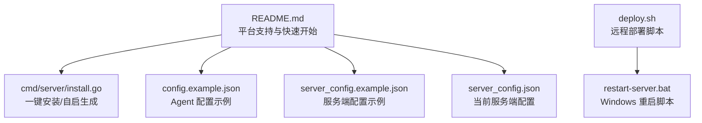
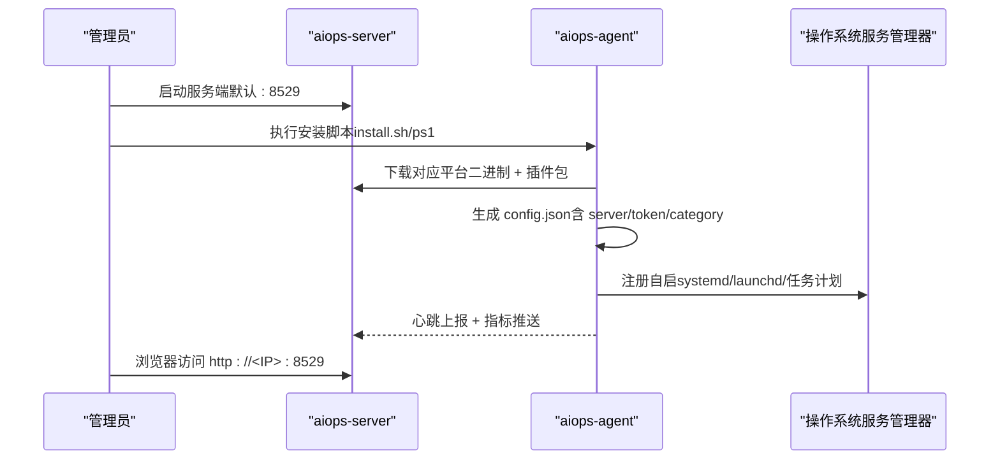
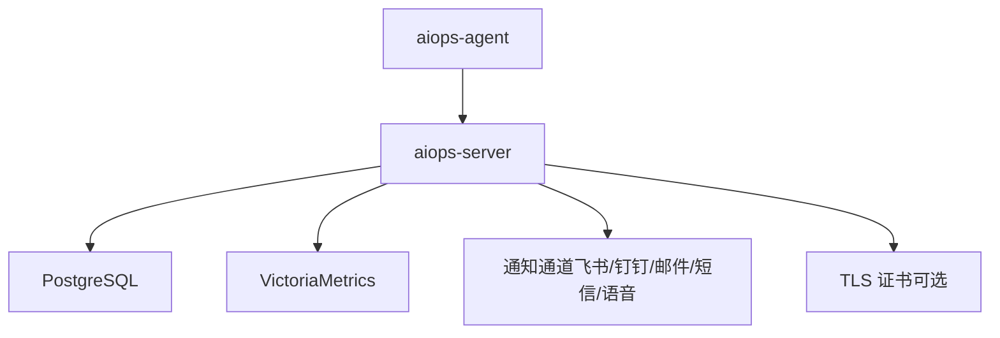

# 二进制直接部署

<cite>
**本文引用的文件列表**
- [README.md](file://README.md)
- [config.example.json](file://config.example.json)
- [server_config.example.json](file://server_config.example.json)
- [server_config.json](file://server_config.json)
- [cmd/server/install.go](file://cmd/server/install.go)
- [deploy.sh](file://deploy.sh)
- [restart-server.bat](file://restart-server.bat)
- [DEPLOY_GUIDE.md](file://DEPLOY_GUIDE.md)
</cite>

## 目录
1. [简介](#简介)
2. [项目结构](#项目结构)
3. [核心组件](#核心组件)
4. [架构总览](#架构总览)
5. [详细组件分析](#详细组件分析)
6. [依赖关系分析](#依赖关系分析)
7. [性能与容量规划](#性能与容量规划)
8. [故障排查指南](#故障排查指南)
9. [结论](#结论)
10. [附录](#附录)

## 简介
本指南面向“二进制直接部署”场景，覆盖以下目标：
- 下载并运行预编译的二进制（Linux/Windows/macOS）
- 配置文件结构与选项说明（服务端与 Agent）
- Linux systemd 服务配置、Windows 服务注册方法
- 端口、防火墙、用户权限等系统级配置
- 服务启动、停止、重启脚本使用方法
- 性能调优参数与安全加固建议

## 项目结构
仓库包含服务端与 Agent 的源码、示例配置、安装脚本与文档。与二进制部署相关的关键位置如下：
- 服务端入口与安装脚本生成：cmd/server/*
- Agent 安装脚本与自启逻辑：cmd/server/install.go
- 示例配置：config.example.json、server_config.example.json、server_config.json
- 部署辅助脚本：deploy.sh、restart-server.bat
- 总体使用说明与平台支持：README.md

图表来源
- [README.md:124-136](file://README.md#L124-L136)
- [cmd/server/install.go:108-195](file://cmd/server/install.go#L108-L195)
- [config.example.json:1-16](file://config.example.json#L1-L16)
- [server_config.example.json:1-36](file://server_config.example.json#L1-L36)
- [server_config.json:1-107](file://server_config.json#L1-L107)
- [deploy.sh:1-48](file://deploy.sh#L1-L48)
- [restart-server.bat:1-40](file://restart-server.bat#L1-L40)

章节来源
- [README.md:124-136](file://README.md#L124-L136)
- [config.example.json:1-16](file://config.example.json#L1-L16)
- [server_config.example.json:1-36](file://server_config.example.json#L1-L36)
- [server_config.json:1-107](file://server_config.json#L1-L107)
- [cmd/server/install.go:108-195](file://cmd/server/install.go#L108-L195)
- [deploy.sh:1-48](file://deploy.sh#L1-L48)
- [restart-server.bat:1-40](file://restart-server.bat#L1-L40)

## 核心组件
- 服务端二进制：aiops-server（Go 单二进制，内嵌前端资源）
- Agent 二进制：aiops-agent（跨平台，零第三方依赖采集）
- 配置文件：
  - Agent：config.example.json（可复制为 config.json 使用）
  - 服务端：server_config.example.json（可复制为 server_config.json 使用）
- 安装与自启：
  - 通过服务端提供的 install.sh / install.ps1 自动下载对应平台二进制并写入配置
  - 自动生成 systemd 或 Windows 自启项

章节来源
- [README.md:124-136](file://README.md#L124-L136)
- [README.md:285-313](file://README.md#L285-L313)
- [cmd/server/install.go:108-195](file://cmd/server/install.go#L108-L195)

## 架构总览
二进制部署的核心流程：
- 从仓库发布页或镜像中获取 aiops-server 与 aiops-agent 二进制
- 准备配置文件（服务端与 Agent）
- 启动服务端，暴露 Web 管理界面与 API
- 在目标主机上安装并运行 Agent，向服务端上报指标
- 通过 systemd（Linux）或任务计划/NSSM（Windows）实现开机自启与崩溃重启

图表来源
- [README.md:124-136](file://README.md#L124-L136)
- [cmd/server/install.go:108-195](file://cmd/server/install.go#L108-L195)

## 详细组件分析

### 服务端二进制部署（Linux/Windows/macOS）
- 下载地址与产物
  - 服务端：aiops-server（单二进制，跨平台）
  - Agent：按平台提供 aiops-agent-linux-amd64、aiops-agent-linux-arm64、aiops-agent-darwin-amd64、aiops-agent-darwin-arm64、aiops-agent.exe
- 启动方式
  - Linux/macOS：./bin/aiops-server
  - Windows：双击或在命令行运行 aiops-server.exe
- 常用参数
  - -addr：监听地址（如 0.0.0.0:9000）
  - -config：指定配置文件路径
  - -dist：Agent 下载目录（用于分发多平台二进制）
- 首次登录
  - 默认账号 admin/admin，首次登录强制安全初始化（修改用户名与密码）

章节来源
- [README.md:124-136](file://README.md#L124-L136)
- [README.md:548-555](file://README.md#L548-L555)
- [README.md:100-103](file://README.md#L100-L103)

### Agent 二进制部署（Linux/Windows/macOS）
- 下载方式
  - 手动：根据平台选择对应二进制放入 bin 目录
  - 自动：通过服务端 install.sh/ps1 自动下载并生成配置
- 启动方式
  - Linux/macOS：./bin/aiops-agent --server http://<IP>:8529 --category 生产
  - Windows：.\bin\aiops-agent.exe --server http://<IP>:8529 --category 生产
- 多服务端推送
  - 可在配置中设置 servers 数组，同时向多个服务端推送数据

章节来源
- [README.md:285-313](file://README.md#L285-L313)
- [config.example.json:1-16](file://config.example.json#L1-L16)

### 配置文件详解

#### Agent 配置（config.example.json）
关键字段说明：
- server：单服务端地址（当 servers 为空时回退到此）
- servers：多服务端列表，每项含 server 与 token；非空时优先使用
- report_interval：基础指标上报间隔（秒）
- plugin_interval：插件执行周期（秒）
- disk_path：主磁盘路径（概览用）
- plugins_dir：插件目录（可用绝对路径）
- python：Python 解释器（Windows 为 python）
- state_file：Agent 状态文件（含 host_id）
- category：主机分类（面板按此分组）
- token：安装 Token（可选）

章节来源
- [config.example.json:1-16](file://config.example.json#L1-L16)
- [README.md:385-416](file://README.md#L385-L416)

#### 服务端配置（server_config.example.json 与 server_config.json）
关键模块与字段（节选）：
- alerts_enabled：启用告警推送
- feishu/dingtalk/custom_webhook/smtp：通知渠道开关与连接信息
- thresholds：阈值配置（CPU/内存/磁盘/IO/IOPS/GPU/负载/进程变化/离线判定等）
- categories：主机分类映射
- install_token：Agent 安装 Token
- require_token：是否强制 Agent Token
- terminal_disabled：全局禁用远程终端
- forward_disabled：全局禁用端口转发
- allow_anonymous_agents：允许无 Token Agent
- trust_proxy：反代后设 true，采信 X-Real-IP 做限流
- forward_listen：TCP 转发监听地址（Docker 需设为 0.0.0.0）
- forward_port_range：TCP 转发端口范围（需与 Docker ports 映射一致）
- relay_secret：中继节点共享密钥
- account/users：初始账户与用户列表（含 MFA 开关、角色等）
- checks/playbooks：拨测与自动化剧本

环境变量覆盖（优先级高于配置文件）：
- AIOPS_POSTGRES_DSN：PostgreSQL 连接串（必填）
- AIOPS_VM_URL：VictoriaMetrics 地址（必填）
- AIOPS_SECRET_KEY：静态加密主密钥（强烈建议）
- AIOPS_TLS_CERT/AIOPS_TLS_KEY：TLS 证书/私钥路径
- AIOPS_FORWARD_LISTEN/AIOPS_FORWARD_PORT_RANGE：转发监听与端口范围
- AIOPS_RELAY_SECRET：中继共享密钥
- AIOPS_FORWARD_DISABLED/AIOPS_TERMINAL_DISABLED/AIOPS_ALLOW_ANONYMOUS_AGENTS/AIOPS_TRUST_PROXY/AIOPS_REQUIRE_TOKEN：功能开关与策略

章节来源
- [server_config.example.json:1-36](file://server_config.example.json#L1-L36)
- [server_config.json:1-107](file://server_config.json#L1-L107)
- [README.md:436-576](file://README.md#L436-L576)

### 开机自启与服务管理

#### Linux（systemd）
- 安装脚本会自动检测 root+systemd 环境，生成 aiops-agent.service 并 enable/start
- 若未检测到 systemd，则后台 nohup 启动并尝试 crontab @reboot 自启
- 注意 SELinux 与 kysec 白名单提示

章节来源
- [cmd/server/install.go:165-195](file://cmd/server/install.go#L165-L195)
- [cmd/server/install.go:225-236](file://cmd/server/install.go#L225-L236)

#### Windows（任务计划/NSSM）
- 推荐 NSSM 注册服务，设置工作目录与启动参数
- 或使用任务计划创建 ONSTART 触发器，以 SYSTEM 高权限运行
- 安装脚本也支持用户级自启（HKCU Run + VBS 守护），无需管理员权限

章节来源
- [README.md:352-368](file://README.md#L352-L368)
- [cmd/server/install.go:239-335](file://cmd/server/install.go#L239-L335)

### 端口、防火墙与用户权限
- 默认监听端口：8529（可通过 -addr 调整）
- TCP 转发监听地址：forward_listen（默认 127.0.0.1，Docker 需 0.0.0.0）
- 转发端口范围：forward_port_range（Docker 需与 ports 映射一致）
- 防火墙规则：放行 8529 及转发端口范围（如需对外访问）
- 用户权限：
  - Linux：建议使用普通用户运行，必要时 sudo 仅用于安装/自启阶段
  - Windows：NSSM 或任务计划可使用 SYSTEM 或专用服务账户

章节来源
- [README.md:548-555](file://README.md#L548-L555)
- [README.md:482-486](file://README.md#L482-L486)
- [README.md:556-576](file://README.md#L556-L576)

### 服务启动、停止、重启脚本
- Linux 远程部署脚本：deploy.sh（上传新二进制、停止旧服务、替换并启动）
- Windows 重启脚本：restart-server.bat（终止旧进程、后台启动、检查状态）

章节来源
- [deploy.sh:1-48](file://deploy.sh#L1-L48)
- [restart-server.bat:1-40](file://restart-server.bat#L1-L40)

## 依赖关系分析
- 运行时依赖
  - PostgreSQL：全部关系数据（配置/用户/审计/事件/工单/会话）
  - VictoriaMetrics：全部时序数据（指标/趋势）
- 构建与分发
  - Go 1.22+ 编译服务端与 Agent
  - 多架构交叉编译（linux/amd64、linux/arm64、darwin/amd64、darwin/arm64、windows/amd64）
- 外部集成
  - 飞书/钉钉/邮件/短信/语音电话等通知通道
  - TLS 证书（可选）
  - 反向代理（Nginx）与 WebSocket 升级头透传

图表来源
- [README.md:19-21](file://README.md#L19-L21)
- [README.md:556-576](file://README.md#L556-L576)

章节来源
- [README.md:19-21](file://README.md#L19-L21)
- [README.md:556-576](file://README.md#L556-L576)

## 性能与容量规划
- 存储与查询
  - 关系数据落 PG，时序数据落 VM；合理设置 PG 连接池与 VM 保留策略
- 指标上报频率
  - Agent report_interval 与 plugin_interval 可按规模调整（默认 10s/15s）
- 网络与压缩
  - 启用 gzip 压缩，降低带宽占用
- 转发与代理
  - 控制 forward_port_range 大小，避免过多监听端口
  - HTTP 代理与 WebSocket 需在 Nginx 正确透传 Upgrade 头
- 安全与稳定性
  - 开启 TLS 传输加密
  - 配置 AIOPS_SECRET_KEY 对敏感配置进行静态加密
  - 限制匿名 Agent 接入（require_token=true）

章节来源
- [README.md:163-166](file://README.md#L163-L166)
- [README.md:436-576](file://README.md#L436-L576)

## 故障排查指南
- 常见问题
  - HTTP 代理“unexpected EOF”：已修复超时与错误信息，升级后应显示友好提示
  - 日志定位：服务端与 Agent 均输出详细日志，便于诊断
- 临时缓解
  - 增加重试、检查上游服务响应、优化网络配置
- 验证步骤
  - 访问之前失败的代理链接，确认不再出现 unexpected EOF

章节来源
- [DEPLOY_GUIDE.md:1-107](file://DEPLOY_GUIDE.md#L1-L107)

## 结论
二进制直接部署适合快速上线与最小化依赖的场景。通过合理的配置与系统级加固（TLS、静态加密、RBAC、MFA），可在保证安全的前提下获得良好的性能与可维护性。

## 附录

### 下载与安装清单
- 服务端二进制：aiops-server
- Agent 二进制：
  - Linux AMD64：aiops-agent-linux-amd64
  - Linux ARM64：aiops-agent-linux-arm64
  - macOS Intel：aiops-agent-darwin-amd64
  - macOS Apple Silicon：aiops-agent-darwin-arm64
  - Windows AMD64：aiops-agent.exe
- 配置文件：
  - Agent：config.example.json → config.json
  - 服务端：server_config.example.json → server_config.json

章节来源
- [README.md:61-71](file://README.md#L61-L71)
- [README.md:285-313](file://README.md#L285-L313)
- [config.example.json:1-16](file://config.example.json#L1-L16)
- [server_config.example.json:1-36](file://server_config.example.json#L1-L36)