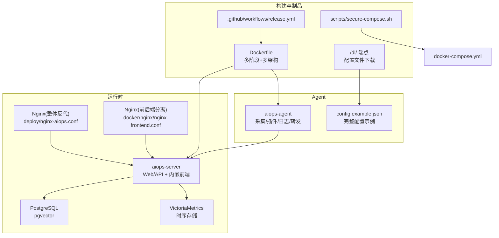
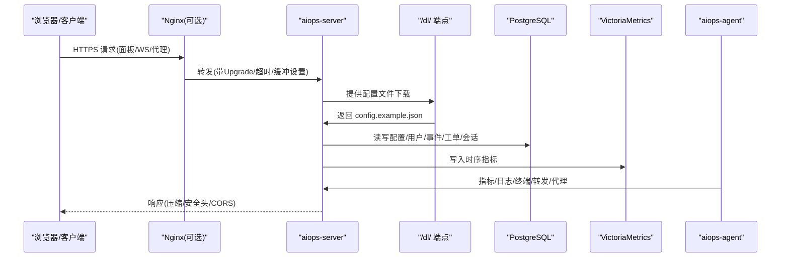
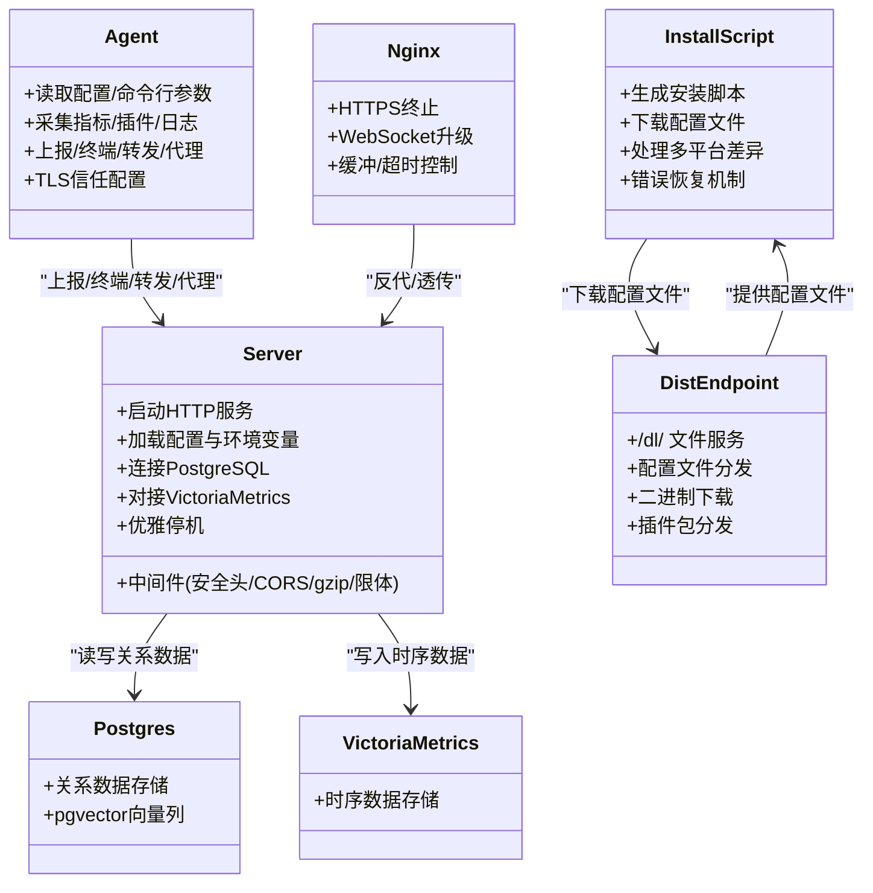

# 安装部署

<cite>
**本文引用的文件列表**
- [README.md](file://README.md)
- [DEPLOY_GUIDE.md](file://DEPLOY_GUIDE.md)
- [config.example.json](file://config.example.json)
- [server_config.example.json](file://server_config.example.json)
- [docker/Dockerfile](file://docker/Dockerfile)
- [.github/workflows/release.yml](file:.github/workflows/release.yml)
- [scripts/secure-compose.sh](file://scripts/secure-compose.sh)
- [deploy/nginx-aiops.conf](file://deploy/nginx-aiops.conf)
- [docker/nginx/nginx-frontend.conf](file://docker/nginx/nginx-frontend.conf)
- [cmd/server/main.go](file://cmd/server/main.go)
- [cmd/server/handlers.go](file://cmd/server/handlers.go)
- [cmd/server/install.go](file://cmd/server/install.go)
- [cmd/agent/main.go](file://cmd/agent/main.go)
</cite>

## 更新摘要
**变更内容**
- 更新了 Linux/macOS 和 Windows 安装脚本的配置文件下载机制
- 新增自动从服务器 /dl/ 端点下载 config.example.json 配置示例文件的功能
- 改进了安装体验，确保用户通过脚本安装时获得完整的配置示例文件

## 目录
1. [简介](#简介)
2. [项目结构](#项目结构)
3. [核心组件](#核心组件)
4. [架构总览](#架构总览)
5. [详细部署指南](#详细部署指南)
6. [依赖与关系分析](#依赖与关系分析)
7. [性能与安全调优](#性能与安全调优)
8. [故障排除指南](#故障排除指南)
9. [结论](#结论)
10. [附录：环境模板与最佳实践](#附录环境模板与最佳实践)

## 简介
本指南面向生产与多环境（开发、测试、生产）的 AIOps Monitor 安装部署，覆盖以下部署方式：
- Docker 容器化部署（推荐）
- 二进制直接运行
- 源码编译构建
- Kubernetes 集群部署（概念性说明）

每种方式均包含步骤、配置示例、环境变量、网络与防火墙要点，并给出生产安全加固、性能调优、备份恢复、监控告警等注意事项。

## 项目结构
仓库提供多架构镜像构建、Compose 编排、Nginx 反代示例、CI/CD 流水线脚本以及服务端/Agent 入口代码，便于快速落地与扩展。

图示来源
- [docker/Dockerfile:1-73](file://docker/Dockerfile#L1-L73)
- [docker-compose.yml:1-144](file://docker-compose.yml#L1-L144)
- [deploy/nginx-aiops.conf:1-68](file://deploy/nginx-aiops.conf#L1-L68)
- [docker/nginx/nginx-frontend.conf:1-193](file://docker/nginx/nginx-frontend.conf#L1-193)
- [.github/workflows/release.yml:1-130](file:.github/workflows/release.yml#L1-L130)
- [scripts/secure-compose.sh:1-100](file://scripts/secure-compose.sh#L1-L100)
- [cmd/server/handlers.go:357-359](file://cmd/server/handlers.go#L357-L359)

章节来源
- [README.md:179-380](file://README.md#L179-L380)
- [docker/Dockerfile:1-73](file://docker/Dockerfile#L1-L73)
- [docker-compose.yml:1-144](file://docker-compose.yml#L1-L144)

## 核心组件
- aiops-server：Go 单二进制，内嵌前端，提供 Web/UI、API、终端、转发、代理、告警、SRE 中枢、AI 巡检等能力；统一使用 PostgreSQL（关系数据）与 VictoriaMetrics（时序数据）。
- aiops-agent：跨平台采集器，支持指标、拨测、日志采集、端口转发、HTTP 代理、中继模式等。
- 外部依赖：PostgreSQL（含 pgvector）、VictoriaMetrics。
- 反向代理：Nginx（可选），用于 HTTPS 终止、WebSocket 升级、静态资源缓存等。

章节来源
- [cmd/server/main.go:227-355](file://cmd/server/main.go#L227-L355)
- [cmd/agent/main.go:74-238](file://cmd/agent/main.go#L74-L238)
- [docker-compose.yml:49-144](file://docker-compose.yml#L49-L144)

## 架构总览
AIOps Monitor 采用"服务端 + 双后端"的统一存储架构：
- 关系数据（用户、配置、审计、事件、工单、会话）→ PostgreSQL
- 时序数据（指标、趋势、拨测结果）→ VictoriaMetrics
- 可选 Nginx 作为 TLS 终止与 WebSocket 透传网关
- Agent 通过 HTTP/WebSocket 上报数据、建立终端通道、执行转发/代理

图示来源
- [deploy/nginx-aiops.conf:18-60](file://deploy/nginx-aiops.conf#L18-L60)
- [docker/nginx/nginx-frontend.conf:72-155](file://docker/nginx/nginx-frontend.conf#L72-L155)
- [cmd/server/handlers.go:357-359](file://cmd/server/handlers.go#L357-L359)
- [cmd/server/main.go:294-355](file://cmd/server/main.go#L294-L355)
- [docker-compose.yml:49-144](file://docker-compose.yml#L49-L144)

## 详细部署指南

### 一、Docker 容器化部署（推荐）
适用场景：快速上线、多架构兼容、一键拉起全栈。

- 前置准备
  - 主机具备 Docker 与 docker compose 能力
  - 如需访问 Docker Hub 受限，参考 README 中「Docker Hub 镜像加速器配置」或替换为 SWR 镜像（仅 AMD64）

- 一键启动（自动生成强随机密钥）
  - 使用脚本自动下载编排文件并注入 AIOPS_SECRET_KEY 与 POSTGRES_PASSWORD，随后直接启动
  - 默认监听 8529，TCP 转发端口范围 10100-10300

- 指定版本（生产建议锁定版本）
  - 在编排文件中将 :latest 替换为具体版本号后启动

- 关键环境变量
  - AIOPS_POSTGRES_DSN：必填，PostgreSQL 连接串
  - AIOPS_VM_URL：必填，VictoriaMetrics 地址
  - AIOPS_SECRET_KEY：强烈建议，AES-256-GCM 静态加密主密钥
  - AIOPS_TLS_CERT/AIOPS_TLS_KEY：可选，启用 HTTPS/TLS
  - AIOPS_FORWARD_LISTEN：Docker 下需设为 0.0.0.0
  - AIOPS_FORWARD_PORT_RANGE：与 ports 映射一致

- 数据持久化
  - ./data：服务端数据（配置、录制等）
  - ./vm-data：VictoriaMetrics 数据
  - 具名卷 aiops-pgdata：PostgreSQL 数据（Windows/Mac 上更可靠）

- 端口与网络
  - 8529：Web UI / API
  - 8428：VictoriaMetrics（可选，仅内网）
  - 10100-10300：TCP 转发监听范围

- 防火墙规则
  - 开放 8529（对外访问）
  - 若启用 8428 暴露，仅限内网
  - 开放 10100-10300（如使用 TCP 转发）

- 健康检查
  - 容器内置 /healthz 健康检查

- 停止与清理
  - docker compose down（保留数据）
  - docker compose down -v（删除数据卷）

章节来源
- [README.md:179-226](file://README.md#L179-L226)
- [docker-compose.yml:1-144](file://docker-compose.yml#L1-L144)
- [scripts/secure-compose.sh:1-100](file://scripts/secure-compose.sh#L1-L100)
- [docker/Dockerfile:44-60](file://docker/Dockerfile#L44-L60)

### 二、二进制直接运行
适用场景：最小依赖、快速验证、无容器环境。

- 启动服务端
  - 默认监听 :8529
  - 可通过参数指定监听地址与配置文件路径

- 启动 Agent
  - 从仓库根目录运行以找到 plugins/
  - 指定 --server 指向服务端地址

- 开机自启
  - Linux：systemd
  - Windows：NSSM 或任务计划
  - macOS：launchd

- 注意
  - 必须配置 AIOPS_POSTGRES_DSN 与 AIOPS_VM_URL，否则拒绝启动
  - 生产建议启用 TLS 或置于 HTTPS 终止代理之后

章节来源
- [README.md:285-379](file://README.md#L285-L379)
- [cmd/server/main.go:227-266](file://cmd/server/main.go#L227-L266)
- [cmd/agent/main.go:74-120](file://cmd/agent/main.go#L74-L120)

### 三、源码编译构建
适用场景：自定义功能、本地调试、离线构建。

- 服务端与 Agent 构建
  - Go 1.22+
  - 可交叉编译各平台 Agent 产物
  - Windows 提供一键构建脚本，支持注入 Git tag 版本号

- 多架构镜像构建
  - 使用 Dockerfile 多阶段构建，支持 linux/amd64 + linux/arm64
  - 构建时注入版本号到二进制

- 分发包
  - 服务端镜像内嵌所有平台 Agent 二进制，供一键安装下载

章节来源
- [README.md:314-340](file://README.md#L314-L340)
- [docker/Dockerfile:17-43](file://docker/Dockerfile#L17-L43)
- [docker/Dockerfile:44-60](file://docker/Dockerfile#L44-L60)

### 四、Kubernetes 集群部署（概念性说明）
说明：仓库未提供官方 K8s 清单，但可按如下思路落地：
- Deployment
  - aiops-server：挂载 ConfigMap/Secret（AIOPS_* 环境变量）、Volume（/app/data）
  - aiops-agent：DaemonSet 或 Deployment，按节点部署
- Service
  - 暴露 8529（Ingress/Nginx Ingress 或 LoadBalancer）
  - 可选暴露 8428（仅内网）
- StatefulSet
  - postgres（pgvector）：PVC 持久化
  - victoriametrics：PVC 持久化
- Ingress
  - 配置 HTTPS、WebSocket 升级、长超时、关闭缓冲
- 安全
  - Secret 管理 AIOPS_SECRET_KEY、数据库密码
  - NetworkPolicy 限制访问来源
- 运维
  - Liveness/Readiness 探针
  - HPA 基于 CPU/内存或自定义指标
  - 日志收集至集中式日志系统

[本节为概念性说明，不直接分析具体源码文件]

### 五、安装脚本增强功能

#### 自动配置文件下载
**更新** 改进了 Linux/macOS 和 Windows 安装脚本，现在会自动从服务器 /dl/ 端点下载 config.example.json 配置文件。

- **Linux/macOS 安装脚本**
  - 在安装过程中自动执行 `curl -fsSL "$SERVER/dl/config.example.json" -o config.example.json`
  - 如果下载失败，脚本会继续执行但不影响安装过程
  - 生成的 config.example.json 包含完整的配置示例和注释

- **Windows 安装脚本**
  - 使用 `Invoke-WebRequest "$Server/dl/config.example.json"` 下载配置文件
  - 错误处理更加健壮，下载失败不会中断安装流程
  - 配置文件保存在 `%LOCALAPPDATA%\aiops-agent\config.example.json`

- **配置文件内容**
  - 包含基础配置、多服务端上报、网关中继模式、TLS 安全配置
  - 端口转发、日志采集、Redfish 硬件状态采集、NetFlow 网络流量接收
  - 五元组包报文采集等高级功能的详细说明和示例

章节来源
- [cmd/server/install.go:137](file://cmd/server/install.go#L137)
- [cmd/server/install.go:258](file://cmd/server/install.go#L258)
- [config.example.json:1-96](file://config.example.json#L1-L96)

## 依赖与关系分析

图示来源
- [cmd/server/main.go:227-355](file://cmd/server/main.go#L227-L355)
- [cmd/server/install.go:101-238](file://cmd/server/install.go#L101-L238)
- [cmd/server/handlers.go:357-359](file://cmd/server/handlers.go#L357-L359)
- [cmd/agent/main.go:74-238](file://cmd/agent/main.go#L74-L238)
- [docker-compose.yml:49-144](file://docker-compose.yml#L49-L144)
- [deploy/nginx-aiops.conf:18-60](file://deploy/nginx-aiops.conf#L18-L60)

章节来源
- [cmd/server/main.go:227-355](file://cmd/server/main.go#L227-L355)
- [cmd/server/install.go:101-238](file://cmd/server/install.go#L101-L238)
- [cmd/server/handlers.go:357-359](file://cmd/server/handlers.go#L357-L359)
- [cmd/agent/main.go:74-238](file://cmd/agent/main.go#L74-L238)
- [docker-compose.yml:49-144](file://docker-compose.yml#L49-L144)

## 性能与安全调优

- 性能
  - 启用 gzip 压缩（服务端已内置），降低带宽占用
  - 合理设置 VictoriaMetrics 保留期与存储路径
  - 调整 Agent 上报间隔与插件周期，平衡实时性与负载
  - 反向代理关闭缓冲、拉长超时，保障终端/转发/代理流式传输

- 安全
  - 启用 TLS（AIOPS_TLS_CERT/AIOPS_TLS_KEY）或在 Nginx 终止
  - 设置 AIOPS_SECRET_KEY 启用 AES-256-GCM 静态加密
  - 严格配置 CORSOrigins（服务端支持）
  - 限制 forward_listen 与端口范围，按需开放
  - 启用 require_token、禁用匿名 Agent（根据策略）
  - 配置 trust_proxy 仅在可信反代后开启

- 备份恢复
  - PostgreSQL：使用 pg_dump/pg_restore 或云厂商快照
  - VictoriaMetrics：备份 /vmdata 目录
  - 服务端数据：备份 /app/data（含 recordings/、TLS 证书等）
  - 密钥：妥善备份 AIOPS_SECRET_KEY，丢失将无法解密库中凭据

章节来源
- [cmd/server/main.go:147-205](file://cmd/server/main.go#L147-L205)
- [docker-compose.yml:86-121](file://docker-compose.yml#L86-L121)
- [deploy/nginx-aiops.conf:44-58](file://deploy/nginx-aiops.conf#L44-L58)
- [docker/nginx/nginx-frontend.conf:86-155](file://docker/nginx/nginx-frontend.conf#L86-L155)

## 故障排除指南

- 常见错误与定位
  - 未配置 AIOPS_POSTGRES_DSN 或 AIOPS_VM_URL：服务端启动失败，需在环境变量中配置
  - 终端无法连接：确认 Nginx 已正确配置 Upgrade 头、关闭缓冲、设置长超时
  - HTTP 代理出现 unexpected EOF：参考修复指南，增加超时与改进错误信息
  - 大文件上传/代理被截断：确保 Nginx client_max_body_size 与服务端 maxBodyBytes 对齐（100MB）
  - 配置文件下载失败：检查 /dl/ 端点是否正常，确认 dist 目录存在 config.example.json

- 临时缓解
  - 遇到上游响应慢导致中断：重试或刷新页面
  - 目标服务异常：先排查上游服务状态与网络质量
  - 安装脚本下载失败：手动下载 config.example.json 并复制到安装目录

- 日志与诊断
  - 服务端记录详细的代理/转发/终端相关日志
  - Agent 端记录连接与读取失败的详细信息
  - 安装脚本输出详细的下载和配置信息

章节来源
- [cmd/server/main.go:255-266](file://cmd/server/main.go#L255-L266)
- [DEPLOY_GUIDE.md:1-107](file://DEPLOY_GUIDE.md#L1-L107)
- [deploy/nginx-aiops.conf:26-58](file://deploy/nginx-aiops.conf#L26-L58)
- [docker/nginx/nginx-frontend.conf:31-31](file://docker/nginx/nginx-frontend.conf#L31-L31)

## 结论
通过 Docker Compose 可快速完成生产级部署，结合 Nginx 实现 HTTPS 与 WebSocket 稳定传输；服务端强制依赖 PostgreSQL 与 VictoriaMetrics，确保数据一致性与可扩展性。生产环境务必启用 TLS、配置 AIOPS_SECRET_KEY、合理设置转发与代理策略，并做好备份与监控。

安装脚本的增强功能显著提升了用户体验，自动下载完整的配置示例文件，帮助用户快速理解和配置各种高级功能。

## 附录：环境模板与最佳实践

- 开发环境
  - 使用默认密钥与明文 HTTP（仅内网）
  - 缩短保留期，减少磁盘占用
  - 放宽阈值，减少误报

- 测试环境
  - 固定镜像版本，避免漂移
  - 启用必要告警渠道（飞书/钉钉/邮件）
  - 开启日志采集与检索

- 生产环境
  - 锁定镜像版本，启用 TLS 与静态加密
  - 严格网络隔离与最小权限原则
  - 配置告警治理（静默/抑制/路由）
  - 定期演练备份恢复流程

- 配置参考
  - Agent 配置：config.example.json（安装脚本自动下载）
  - 服务端配置：server_config.example.json
  - 环境变量覆盖：详见 README 环境变量表

章节来源
- [config.example.json:1-96](file://config.example.json#L1-L96)
- [server_config.example.json:1-36](file://server_config.example.json#L1-L36)
- [README.md:436-576](file://README.md#L436-L576)