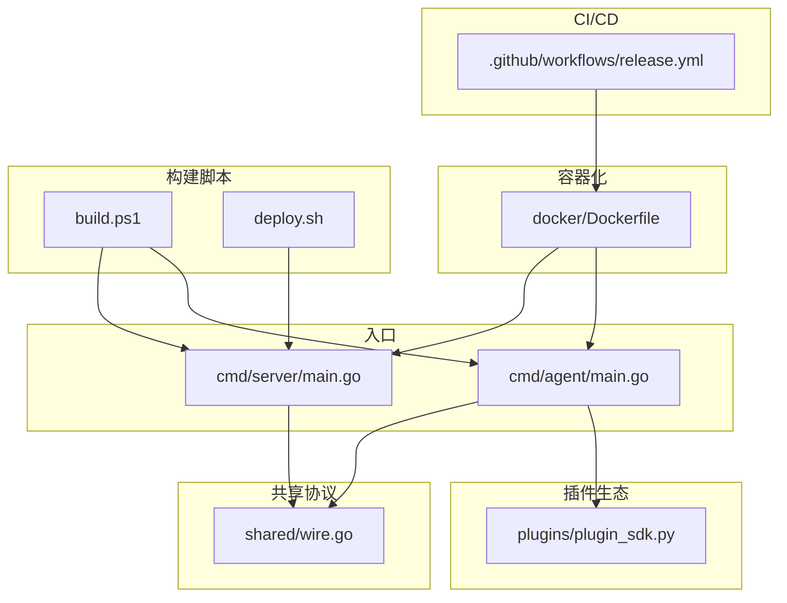
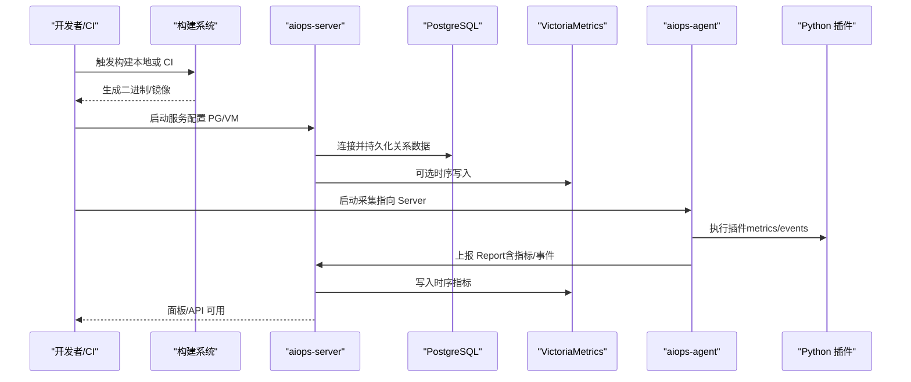
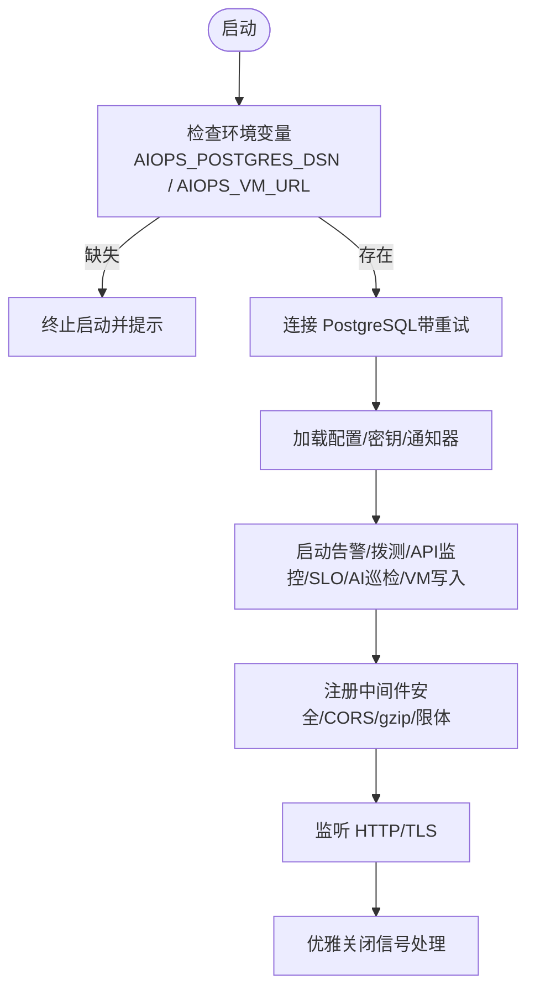
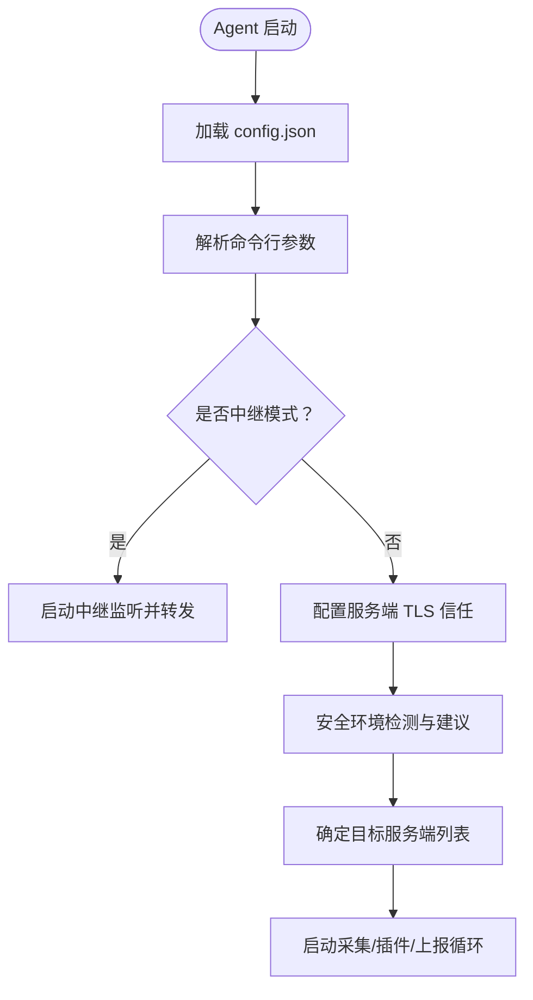
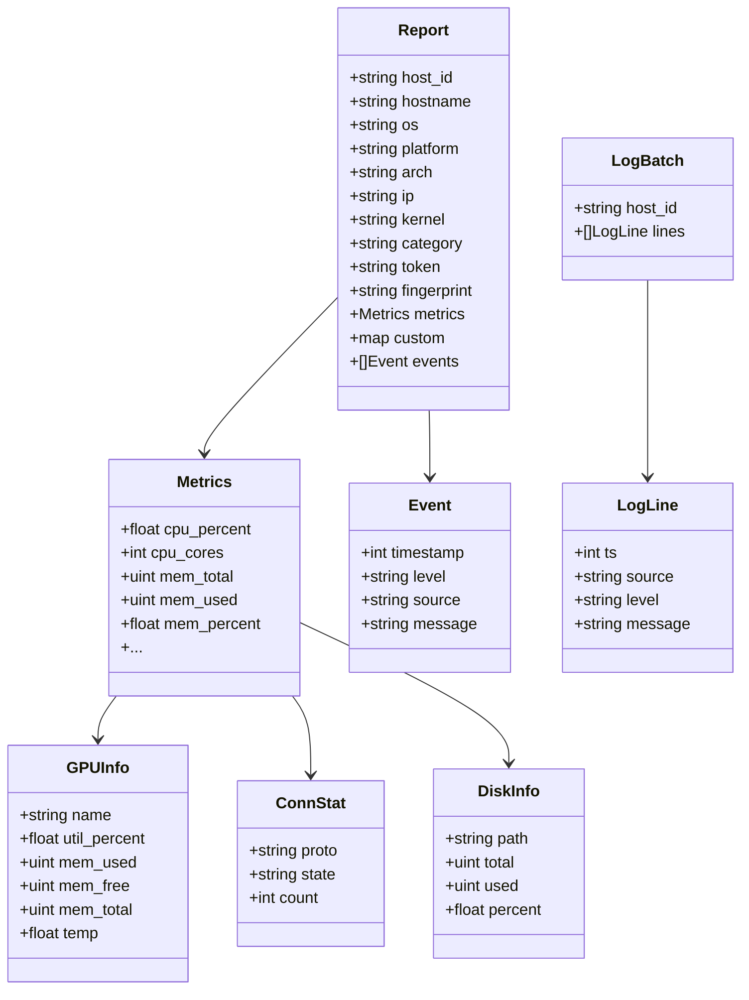
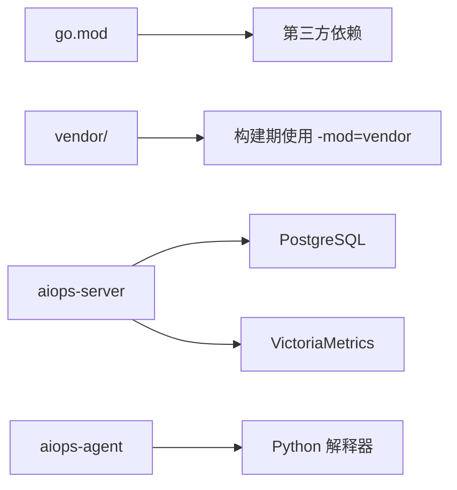

# 源码编译构建

<cite>
**本文引用的文件**   
- [README.md](file://README.md)
- [go.mod](file://go.mod)
- [build.ps1](file://build.ps1)
- [deploy.sh](file://deploy.sh)
- [.github/workflows/release.yml](file://.github/workflows/release.yml)
- [cmd/server/main.go](file://cmd/server/main.go)
- [cmd/agent/main.go](file://cmd/agent/main.go)
- [shared/wire.go](file://shared/wire.go)
- [plugins/plugin_sdk.py](file://plugins/plugin_sdk.py)
- [docker/Dockerfile](file://docker/Dockerfile)
- [config.example.json](file://config.example.json)
- [server_config.example.json](file://server_config.example.json)
</cite>

## 目录
1. [简介](#简介)
2. [项目结构](#项目结构)
3. [核心组件](#核心组件)
4. [架构总览](#架构总览)
5. [详细组件分析](#详细组件分析)
6. [依赖分析](#依赖分析)
7. [性能与构建优化](#性能与构建优化)
8. [故障排查](#故障排查)
9. [结论](#结论)
10. [附录](#附录)

## 简介
本指南面向需要在本地或 CI 环境中从零构建 AIOps Monitor 的开发者与运维工程师，覆盖以下内容：
- 开发环境要求（Go、Python、PostgreSQL、VictoriaMetrics）
- 模块结构与依赖关系（cmd/server、cmd/agent、shared、plugins 等）
- 本地与交叉编译命令、版本注入、静态链接、Docker 多架构构建
- vendor 目录使用策略与依赖管理
- 常见编译错误排查
- CI/CD 配置示例（GitHub Actions）

## 项目结构
仓库采用“按功能分层 + 入口程序”的组织方式：
- cmd/server：服务端主程序与 Web API、存储适配、调度器等
- cmd/agent：采集端主程序，负责指标采集、插件执行、日志上报、中继转发等
- shared：Agent 与服务端共享的数据模型（协议层）
- plugins：Python 插件 SDK 与示例插件
- docker：多阶段 Dockerfile，支持多架构构建与产物分发
- .github/workflows：CI 工作流，自动构建镜像并推送至华为云 SWR
- 根脚本：Windows 一键构建、Linux 部署脚本等

图表来源
- [cmd/server/main.go:1-355](file://cmd/server/main.go#L1-L355)
- [cmd/agent/main.go:1-238](file://cmd/agent/main.go#L1-L238)
- [shared/wire.go:1-139](file://shared/wire.go#L1-L139)
- [plugins/plugin_sdk.py:1-58](file://plugins/plugin_sdk.py#L1-L58)
- [docker/Dockerfile:1-73](file://docker/Dockerfile#L1-L73)
- [.github/workflows/release.yml:1-130](file://.github/workflows/release.yml#L1-L130)
- [build.ps1:1-56](file://build.ps1#L1-L56)
- [deploy.sh:1-49](file://deploy.sh#L1-L49)

章节来源
- [README.md:314-340](file://README.md#L314-L340)
- [docker/Dockerfile:18-42](file://docker/Dockerfile#L18-L42)

## 核心组件
- 服务端（cmd/server）
  - 启动流程：解析参数与环境变量 → 校验并连接 PostgreSQL 与 VictoriaMetrics → 初始化配置、告警、调度、API 监控、SLO、AI 巡检、VM 写入 → 注册中间件与安全头 → 监听 HTTP/TLS → 优雅关闭
  - 关键特性：CORS、安全头、请求体大小限制、gzip 压缩、TLS 可选、dist 目录自动探测（用于提供 Agent 下载）
- 采集端（cmd/agent）
  - 启动流程：加载配置文件 → 解析命令行参数 → 可选中继模式 → 初始化采集器与插件运行器 → 安全环境检测与修复建议 → 选择目标服务端列表 → 周期性上报指标与事件
  - 关键特性：多服务端广播、日志采集与加密上报、TLS 信任链配置、跨平台 TTY/转发通道复用
- 共享协议（shared）
  - 定义 Metrics、GPUInfo、ConnStat、DiskInfo、Report、Event、LogBatch 等数据结构，确保 Agent 与服务端契约一致
- 插件体系（plugins）
  - Python SDK 简化插件编写，输出 metrics/events/base JSON；Agent 定时执行并按周期收集结果

章节来源
- [cmd/server/main.go:227-355](file://cmd/server/main.go#L227-L355)
- [cmd/agent/main.go:74-238](file://cmd/agent/main.go#L74-L238)
- [shared/wire.go:1-139](file://shared/wire.go#L1-L139)
- [plugins/plugin_sdk.py:1-58](file://plugins/plugin_sdk.py#L1-L58)

## 架构总览
下图展示服务端与 Agent 的核心交互及外部依赖。

图表来源
- [cmd/server/main.go:255-292](file://cmd/server/main.go#L255-L292)
- [cmd/agent/main.go:219-237](file://cmd/agent/main.go#L219-L237)
- [shared/wire.go:120-139](file://shared/wire.go#L120-L139)
- [docker/Dockerfile:44-59](file://docker/Dockerfile#L44-L59)

## 详细组件分析

### 服务端构建与运行
- 环境变量强制校验
  - AIOPS_POSTGRES_DSN：必须配置，否则拒绝启动
  - AIOPS_VM_URL：必须配置，否则拒绝启动
- 启动参数
  - -addr：监听地址
  - -config：配置文件路径
  - -dist：Agent 下载目录（自动探测 dist/ 或可执行目录）
- 版本注入
  - 通过 ldflags 注入 main.appVersion，便于在面板显示真实版本
- TLS 支持
  - 提供 AIOPS_TLS_CERT/AIOPS_TLS_KEY 时以 HTTPS 提供服务

图表来源
- [cmd/server/main.go:255-292](file://cmd/server/main.go#L255-L292)
- [cmd/server/main.go:294-355](file://cmd/server/main.go#L294-L355)

章节来源
- [cmd/server/main.go:227-355](file://cmd/server/main.go#L227-L355)
- [README.md:556-576](file://README.md#L556-L576)

### 采集端构建与运行
- 配置文件优先级：命令行 > 配置文件 > 默认值
- 多服务端上报：servers 非空优先于单 server+token
- 中继模式：作为网关代理所有请求到上游服务端
- 日志采集：支持多路径、压缩与 AES-256-GCM 加密上报
- TLS 信任：支持跳过校验（仅内网/自签）或指定 CA 证书

图表来源
- [cmd/agent/main.go:74-136](file://cmd/agent/main.go#L74-L136)
- [cmd/agent/main.go:138-237](file://cmd/agent/main.go#L138-L237)

章节来源
- [cmd/agent/main.go:74-238](file://cmd/agent/main.go#L74-L238)
- [config.example.json:1-16](file://config.example.json#L1-L16)

### 共享协议与插件
- 共享协议（shared）
  - 统一 Metrics/GPU/连接/磁盘/进程名等字段，保证前后端一致性
- 插件 SDK（Python）
  - 通过 metric()/event()/base() 构造输出，emit() 输出 JSON 供 Go 核心读取

图表来源
- [shared/wire.go:1-139](file://shared/wire.go#L1-L139)

章节来源
- [shared/wire.go:1-139](file://shared/wire.go#L1-L139)
- [plugins/plugin_sdk.py:1-58](file://plugins/plugin_sdk.py#L1-L58)

## 依赖分析
- Go 版本与模块
  - go.mod 声明 go 1.22，包含二维码、PDF、PostgreSQL 驱动等依赖
- 第三方依赖管理
  - 仓库提供 vendor 目录占位，Dockerfile 构建时使用 -mod=vendor 进行离线构建
  - 若需更新依赖，可在本地执行 go mod tidy 后同步 vendor
- 运行时依赖
  - 服务端：PostgreSQL（关系数据）、VictoriaMetrics（时序数据）
  - 采集端：Python 解释器（默认 python3），可选安装 psutil 等库

图表来源
- [go.mod:1-10](file://go.mod#L1-L10)
- [docker/Dockerfile:24-33](file://docker/Dockerfile#L24-L33)
- [docker/Dockerfile:62-73](file://docker/Dockerfile#L62-L73)

章节来源
- [go.mod:1-10](file://go.mod#L1-L10)
- [docker/Dockerfile:24-42](file://docker/Dockerfile#L24-L42)

## 性能与构建优化
- 静态链接与体积优化
  - Dockerfile 使用 CGO_ENABLED=0 与 -ldflags="-s -w" 实现静态链接与去除调试信息，减小镜像体积
- 多架构构建
  - 使用 buildx 与 QEMU 同时构建 linux/amd64 与 linux/arm64 镜像
- 版本注入
  - 通过 -X main.appVersion=${VERSION} 将 Git tag 注入二进制，便于识别版本
- 本地快速构建
  - Windows 下可使用 build.ps1 自动注入版本号并构建服务端与 Agent
  - Linux/macOS 可直接使用 go build 命令

章节来源
- [docker/Dockerfile:30-42](file://docker/Dockerfile#L30-L42)
- [build.ps1:20-35](file://build.ps1#L20-L35)
- [README.md:314-340](file://README.md#L314-L340)

## 故障排查
- 启动失败：未配置必要环境变量
  - 现象：服务端启动即退出，提示缺少 AIOPS_POSTGRES_DSN 或 AIOPS_VM_URL
  - 解决：在环境变量中正确设置 PostgreSQL DSN 与 VictoriaMetrics 地址
- 无法连接数据库
  - 现象：PostgreSQL 连接失败，多次重试后终止
  - 解决：确认网络可达、账号密码正确、PG 已就绪（Compose 冷启动有短暂延迟）
- 插件执行异常
  - 现象：插件崩溃/超时/输出非法 JSON，仅记录并跳过
  - 解决：检查插件逻辑与输出格式，确保遵循 SDK 约定
- 日志采集不生效
  - 现象：未看到日志上报
  - 解决：确认 --log-paths 配置正确、路径可读、加密开关符合预期
- 端口转发不可用
  - 现象：转发规则创建成功但无法访问
  - 解决：确认 forward_listen 与端口范围映射一致，必要时设为 0.0.0.0（Docker 场景）

章节来源
- [cmd/server/main.go:255-272](file://cmd/server/main.go#L255-L272)
- [cmd/server/main.go:211-225](file://cmd/server/main.go#L211-L225)
- [plugins/plugin_sdk.py:1-58](file://plugins/plugin_sdk.py#L1-L58)
- [cmd/agent/main.go:114-124](file://cmd/agent/main.go#L114-L124)
- [README.md:627-685](file://README.md#L627-L685)

## 结论
本项目采用清晰的模块化设计与统一的共享协议，结合 Docker 多架构构建与 CI 自动化发布，提供了从本地开发到生产部署的完整链路。通过严格的环境变量校验、静态链接与版本注入，确保了构建产物的一致性与可追溯性。建议在正式环境启用 TLS 与密钥静态加密，并合理配置阈值与告警治理策略，以获得稳定高效的监控体验。

## 附录

### 开发环境搭建
- Go 1.22+
- Python 3（用于插件执行）
- PostgreSQL（关系数据存储）
- VictoriaMetrics（时序数据存储）

章节来源
- [README.md:50-60](file://README.md#L50-L60)
- [README.md:556-576](file://README.md#L556-L576)

### 编译命令与构建参数
- 本地构建
  - 服务端：go build -o bin/aiops-server ./cmd/server
  - 采集端：go build -o bin/aiops-agent ./cmd/agent
- 版本注入
  - go build -ldflags "-X main.appVersion=$(git describe --tags)" ./cmd/server ./cmd/agent
- 交叉编译（示例）
  - GOOS=linux GOARCH=amd64 go build -o bin/aiops-agent-linux-amd64 ./cmd/agent
  - GOOS=darwin GOARCH=arm64 go build -o bin/aiops-agent-darwin-arm64 ./cmd/agent
  - GOOS=windows GOARCH=amd64 go build -o bin/aiops-agent.exe ./cmd/agent
- Windows 一键构建
  - powershell -File build.ps1
  - powershell -File build.ps1 -CrossCompile

章节来源
- [README.md:314-340](file://README.md#L314-L340)
- [build.ps1:20-55](file://build.ps1#L20-L55)

### 依赖管理与 vendor
- 使用 -mod=vendor 进行离线构建
- 更新依赖后需同步 vendor 目录

章节来源
- [docker/Dockerfile:24-33](file://docker/Dockerfile#L24-L33)

### CI/CD 配置示例
- GitHub Actions 工作流
  - 触发条件：推送 v* 标签或手动触发
  - 步骤：检出代码、解析版本、设置 QEMU 与 buildx、登录 SWR、构建并推送 server/agent 镜像
  - 所需 Secrets：HW_ACCESS_KEY、HW_SECRET_KEY

章节来源
- [.github/workflows/release.yml:1-130](file://.github/workflows/release.yml#L1-L130)

### 配置参考
- Agent 配置示例（config.example.json）
- 服务端配置示例（server_config.example.json）

章节来源
- [config.example.json:1-16](file://config.example.json#L1-L16)
- [server_config.example.json:1-36](file://server_config.example.json#L1-L36)