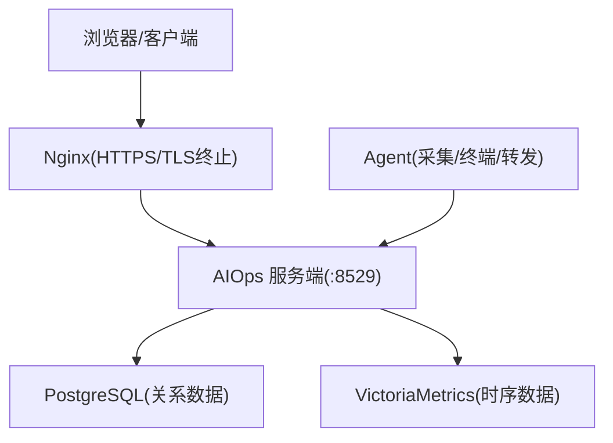
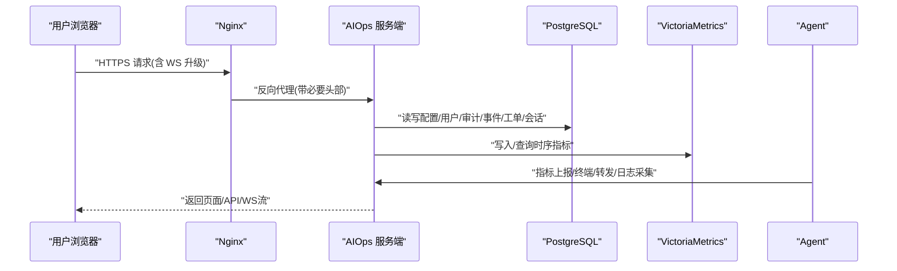
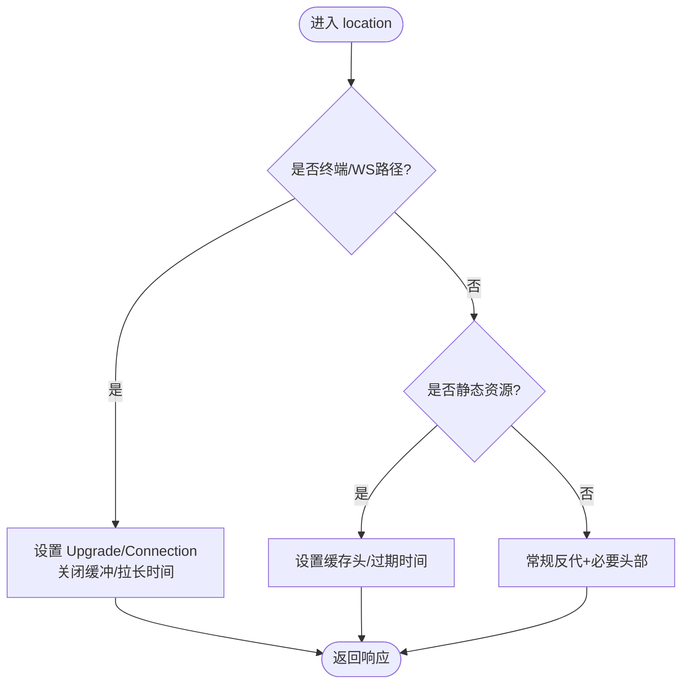
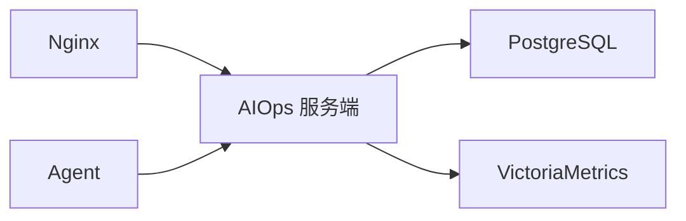

# 生产环境配置

<cite>
**本文引用的文件**   
- [README.md](file://README.md)
- [DEPLOY_GUIDE.md](file://DEPLOY_GUIDE.md)
- [deploy/nginx-aiops.conf](file://deploy/nginx-aiops.conf)
- [docker/nginx/nginx-frontend.conf](file://docker/nginx/nginx-frontend.conf)
- [cmd/server/main.go](file://cmd/server/main.go)
- [cmd/server/config.go](file://cmd/server/config.go)
- [cmd/agent/main.go](file://cmd/agent/main.go)
- [cmd/agent/tls.go](file://cmd/agent/tls.go)
- [config.example.json](file://config.example.json)
- [server_config.example.json](file://server_config.example.json)
</cite>

## 目录
1. [简介](#简介)
2. [项目结构](#项目结构)
3. [核心组件](#核心组件)
4. [架构总览](#架构总览)
5. [详细组件分析](#详细组件分析)
6. [依赖关系分析](#依赖关系分析)
7. [性能与容量规划](#性能与容量规划)
8. [安全加固指南](#安全加固指南)
9. [高可用与故障转移](#高可用与故障转移)
10. [监控与告警](#监控与告警)
11. [备份恢复与灾难恢复](#备份恢复与灾难恢复)
12. [故障排查](#故障排查)
13. [结论](#结论)

## 简介
本指南聚焦于 AIOps Monitor 在生产环境的部署与运维，重点覆盖：
- Nginx 反向代理（HTTPS、WebSocket、缓存与安全头）
- TLS/SSL 端到端加密与证书管理
- 访问控制与审计日志
- 网络安全与出站防护
- 高可用部署（数据库主从、负载均衡、故障转移）
- 监控与告警体系
- 备份恢复策略与灾难恢复预案
- 容量规划建议

## 项目结构
AIOps Monitor 采用“单二进制服务端 + Agent”的架构，前端已内嵌至服务端二进制。生产环境通常通过 Nginx 终止 HTTPS，并转发到后端服务。关键配置文件与示例如下：
- Nginx 整体反代示例（含 WebSocket 升级与长超时）：deploy/nginx-aiops.conf
- 前端分离场景下的 Nginx 示例（静态资源 + API/WebSocket 反代）：docker/nginx/nginx-frontend.conf
- 服务端启动与 TLS 支持：cmd/server/main.go
- 服务端配置与环境变量覆盖：cmd/server/config.go
- Agent 启动与 TLS 信任配置：cmd/agent/main.go, cmd/agent/tls.go
- 示例配置：config.example.json, server_config.example.json

图表来源
- [deploy/nginx-aiops.conf:18-60](file://deploy/nginx-aiops.conf#L18-L60)
- [cmd/server/main.go:294-354](file://cmd/server/main.go#L294-L354)
- [cmd/server/config.go:616-651](file://cmd/server/config.go#L616-L651)
- [cmd/agent/main.go:122-136](file://cmd/agent/main.go#L122-L136)

章节来源
- [deploy/nginx-aiops.conf:1-68](file://deploy/nginx-aiops.conf#L1-L68)
- [docker/nginx/nginx-frontend.conf:1-193](file://docker/nginx/nginx-frontend.conf#L1-L193)
- [cmd/server/main.go:227-354](file://cmd/server/main.go#L227-L354)
- [cmd/server/config.go:556-651](file://cmd/server/config.go#L556-L651)
- [cmd/agent/main.go:74-136](file://cmd/agent/main.go#L74-L136)
- [cmd/agent/tls.go:13-73](file://cmd/agent/tls.go#L13-L73)
- [config.example.json:1-16](file://config.example.json#L1-L16)
- [server_config.example.json:1-36](file://server_config.example.json#L1-L36)

## 核心组件
- Nginx 反向代理
  - 负责 HTTPS 终止、WebSocket 升级、请求缓冲控制、安全响应头注入、静态资源缓存等。
- AIOps 服务端
  - 提供 Web 面板、API、远程终端、端口转发、HTTP 代理、告警引擎、SLO/事件/工单等能力；支持可选内置 TLS 或置于 Nginx 之后。
- 存储层
  - PostgreSQL：配置、用户、审计、事件、工单、会话等关系数据。
  - VictoriaMetrics：指标与时序数据。
- Agent
  - 采集主机指标、执行插件、建立终端通道、端口转发、日志采集上报；支持自定义 CA 校验与服务端 TLS 跳过校验（仅临时/自签）。

章节来源
- [deploy/nginx-aiops.conf:18-60](file://deploy/nginx-aiops.conf#L18-L60)
- [docker/nginx/nginx-frontend.conf:27-193](file://docker/nginx/nginx-frontend.conf#L27-L193)
- [cmd/server/main.go:251-354](file://cmd/server/main.go#L251-L354)
- [cmd/server/config.go:407-489](file://cmd/server/config.go#L407-L489)
- [cmd/agent/main.go:74-136](file://cmd/agent/main.go#L74-L136)
- [cmd/agent/tls.go:13-73](file://cmd/agent/tls.go#L13-L73)

## 架构总览
生产推荐拓扑：
- 外部流量经 Nginx 终止 HTTPS，统一设置安全头与缓存策略。
- Nginx 将 API 与 WebSocket 请求转发到 AIOps 服务端（默认 :8529）。
- 服务端连接 PostgreSQL 与 VictoriaMetrics 进行持久化与查询。
- Agent 通过 HTTPS 或 HTTP（在可信网络中）上报数据与建立终端通道。

图表来源
- [deploy/nginx-aiops.conf:18-60](file://deploy/nginx-aiops.conf#L18-L60)
- [cmd/server/main.go:294-354](file://cmd/server/main.go#L294-L354)
- [cmd/server/config.go:616-651](file://cmd/server/config.go#L616-L651)
- [cmd/agent/main.go:122-136](file://cmd/agent/main.go#L122-L136)

## 详细组件分析

### Nginx 反向代理配置（HTTPS、WebSocket、缓存、安全头）
- HTTPS 与证书
  - 监听 443 SSL，启用 HTTP/2，配置证书与私钥路径。
  - 可选 80→443 强制跳转。
- WebSocket 支持
  - 全局 map 映射 Upgrade 头，location 中设置 Upgrade 与 Connection 头。
  - 关闭缓冲与请求缓冲，避免实时流被截断。
  - 设置长超时以匹配终端会话上限。
- 大文件与上传
  - client_max_body_size 与服务端 maxBodyBytes 对齐，避免 413 错误。
- 安全响应头
  - X-Frame-Options、X-Content-Type-Options、X-XSS-Protection、Referrer-Policy 等。
- 缓存策略
  - 静态资源按类型设置 Cache-Control 与 expires；Service Worker 禁用缓存确保更新及时。
- 健康检查与下载
  - /healthz 健康检查；/dl/ 大文件下载拉长超时。

图表来源
- [deploy/nginx-aiops.conf:11-60](file://deploy/nginx-aiops.conf#L11-L60)
- [docker/nginx/nginx-frontend.conf:6-193](file://docker/nginx/nginx-frontend.conf#L6-L193)

章节来源
- [deploy/nginx-aiops.conf:1-68](file://deploy/nginx-aiops.conf#L1-L68)
- [docker/nginx/nginx-frontend.conf:1-193](file://docker/nginx/nginx-frontend.conf#L1-L193)

### 服务端 TLS/HTTPS 与运行参数
- 环境变量
  - AIOPS_TLS_CERT/AIOPS_TLS_KEY：启用内置 TLS（直接对外 HTTPS）。
  - 若未配置，则以明文 HTTP 提供服务（建议置于 Nginx 之后）。
- 中间件与安全头
  - 安全头中间件：X-Content-Type-Options、X-Frame-Options、Referrer-Policy、CSP（除 /proxy/）。
  - CORS 中间件：可限制允许的 Origin。
  - gzip 压缩：对非 WS/非流式路径启用，提升带宽效率。
  - 请求体大小限制：防止超大 JSON 导致内存耗尽。
- 优雅关闭
  - 捕获 SIGINT/SIGTERM，停止接受新连接，等待活跃请求完成，刷新状态后退出。

章节来源
- [cmd/server/main.go:227-354](file://cmd/server/main.go#L227-L354)

### 服务端配置与环境变量覆盖
- 环境变量优先级高于配置文件，便于容器编排与密钥注入。
- 关键环境变量
  - AIOPS_POSTGRES_DSN、AIOPS_VM_URL：必填，否则拒绝启动。
  - AIOPS_SECRET_KEY：配置密钥落库 AES-256-GCM 静态加密。
  - AIOPS_FORWARD_LISTEN、AIOPS_FORWARD_PORT_RANGE：TCP 转发监听地址与端口范围。
  - AIOPS_RELAY_SECRET：中继共享密钥。
  - AIOPS_TRUST_PROXY：信任反代真实 IP（用于限流与审计）。
  - AIOPS_REQUIRE_TOKEN、AIOPS_ALLOW_ANONYMOUS_AGENTS：Agent 鉴权策略。
  - AIOPS_TERMINAL_DISABLED、AIOPS_FORWARD_DISABLED：功能开关。
- 阈值回退机制
  - 任何阈值为 0 将被自动回填为标准默认值，避免误报。

章节来源
- [cmd/server/config.go:556-651](file://cmd/server/config.go#L556-L651)
- [cmd/server/config.go:174-278](file://cmd/server/config.go#L174-L278)
- [README.md:556-573](file://README.md#L556-L573)

### Agent 启动与 TLS 信任
- 启动流程
  - 加载配置文件与命令行参数；支持多服务端推送。
  - 支持中继模式（Relay），作为网关代理所有请求到上游服务器。
- TLS 信任
  - 支持自定义 CA 证书链（ca_cert）与 tls_skip_verify（仅临时/自签）。
  - 对所有 HTTP 客户端传输应用统一的 TLS 配置。
- 安全环境检测
  - 启动时探测 kysec/SELinux/AppArmor/firewalld/Defender/SIP 等模块，输出诊断与建议修复命令。

章节来源
- [cmd/agent/main.go:74-136](file://cmd/agent/main.go#L74-L136)
- [cmd/agent/tls.go:13-73](file://cmd/agent/tls.go#L13-L73)

### 示例配置参考
- Agent 配置（config.example.json）
  - 支持单服务端与多服务端列表；包含报告间隔、插件目录、Python 解释器、分类、Token 等。
- 服务端配置（server_config.example.json）
  - 告警渠道、阈值、账户、转发监听地址与端口范围等。

章节来源
- [config.example.json:1-16](file://config.example.json#L1-L16)
- [server_config.example.json:1-36](file://server_config.example.json#L1-L36)

## 依赖关系分析
- 外部依赖
  - PostgreSQL：关系型数据存储（配置/用户/审计/事件/工单/会话）。
  - VictoriaMetrics：时序数据存储（指标/趋势/SLO）。
- 内部依赖
  - Nginx → AIOps 服务端（HTTPS 终止与反代）。
  - Agent → AIOps 服务端（指标上报、终端、转发、日志采集）。

图表来源
- [cmd/server/main.go:251-272](file://cmd/server/main.go#L251-L272)
- [cmd/server/config.go:616-651](file://cmd/server/config.go#L616-L651)

章节来源
- [cmd/server/main.go:251-272](file://cmd/server/main.go#L251-L272)
- [cmd/server/config.go:616-651](file://cmd/server/config.go#L616-L651)

## 性能与容量规划
- 带宽优化
  - 服务端 gzip 压缩，多主机轮询 JSON 可压 8-10 倍；Nginx 可对静态资源开启 gzip 与缓存。
- 上报吞吐
  - 典型规模：3000 台 × 每 10s ≈ 300 次/s，Upsert 短暂持写锁。
- 内存占用
  - 每台主机三层历史约 1-2 MB，3000 台约需 4-7 GB（可按保留常量调整）。
- 渲染与交互
  - 主机列表分页（每页 9），DOM 只渲染当前页。
- 调优建议
  - 主机较多时增大上报间隔（如 10-15s）以降低上报与带宽压力。
  - Nginx 静态资源缓存与 Service Worker 无缓存策略结合，保证更新及时性。

章节来源
- [README.md:1096-1117](file://README.md#L1096-L1117)
- [docker/nginx/nginx-frontend.conf:12-25](file://docker/nginx/nginx-frontend.conf#L12-L25)

## 安全加固指南
- TLS/SSL 配置
  - 推荐 Nginx 终止 HTTPS，服务端以 HTTP 暴露于可信网络；如需直出 HTTPS，配置 AIOPS_TLS_CERT/AIOPS_TLS_KEY。
  - Agent 侧支持自定义 CA 证书链，避免使用 tls_skip_verify（仅临时/自签）。
- 访问控制
  - 强制 Agent Token 校验（require_token=true），禁止匿名 Agent（allow_anonymous_agents=false）。
  - 中继模式使用 relay_secret 校验上游请求。
  - 信任反代真实 IP（trust_proxy=true）配合登录限流与审计。
- 安全响应头
  - 服务端中间件设置 X-Content-Type-Options、X-Frame-Options、Referrer-Policy、CSP（排除 /proxy/）。
  - Nginx 增加 X-Frame-Options、X-Content-Type-Options、X-XSS-Protection、Referrer-Policy。
- 网络安全
  - SSRF 出站防护：AI/Webhook 等出站请求守卫，默认拒云元数据·链路本地，严格模式拒私网。
  - 日志加密上报：Agent 日志 gzip + AES-256-GCM 加密传输。
- 审计日志
  - 操作与介入日志、终端命令审计、插件事件入 PG，便于追溯。

章节来源
- [cmd/server/main.go:113-136](file://cmd/server/main.go#L113-L136)
- [docker/nginx/nginx-frontend.conf:187-192](file://docker/nginx/nginx-frontend.conf#L187-L192)
- [cmd/server/config.go:465-475](file://cmd/server/config.go#L465-L475)
- [cmd/agent/tls.go:13-39](file://cmd/agent/tls.go#L13-L39)
- [README.md:174-176](file://README.md#L174-L176)

## 高可用与故障转移
- 数据库主从复制
  - PostgreSQL 主从复制（异步/同步取决于业务容忍度），读写分离由上层代理或应用层实现。
  - 使用连接池与重试机制，冷启动时服务端会重试连接 PG。
- 负载均衡器配置
  - Nginx 多实例 + 健康检查，或使用云负载均衡（ALB/CLB/K8s Ingress）需支持 WebSocket、关闭缓冲、空闲超时 ≥ 1h。
- 故障转移机制
  - 服务端优雅关闭，等待活跃请求完成并刷新状态。
  - Agent 具备重连与重试逻辑，保障上报与终端通道稳定。
  - 中继模式（Relay）可作为内网出口网关，减少跨网段风险。

章节来源
- [cmd/server/main.go:305-323](file://cmd/server/main.go#L305-L323)
- [cmd/agent/main.go:126-136](file://cmd/agent/main.go#L126-L136)
- [README_EN.md:792-823](file://README_EN.md#L792-L823)

## 监控与告警
- 系统指标采集
  - CPU/内存/磁盘/网络/TCP/负载/进程/GPU 等，三平台原生采集。
- 应用性能监控
  - API 业务监控：批量黑盒拨测接口可用性、时延、P95、吞吐。
- 告警规则设置
  - 27 组细粒度阈值（warn/crit），覆盖主机资源、拨测、API、任务、转发五大维度。
  - 零值自动兜底默认，避免误报。
- 通知渠道
  - 飞书/钉钉 Webhook、邮件 SMTP、多云短信与语音电话（阿里云/华为云/腾讯云）。
- 告警治理
  - 静默（时段/星期）、抑制（主因抑衍生）、路由（按级别/主机分流渠道）。

章节来源
- [README.md:514-547](file://README.md#L514-L547)
- [README.md:721-741](file://README.md#L721-L741)
- [cmd/server/config.go:75-172](file://cmd/server/config.go#L75-L172)

## 备份恢复与灾难恢复
- 备份策略
  - PostgreSQL：定期全量 + WAL 增量备份，保留周期按合规要求设定。
  - VictoriaMetrics：按保留策略与副本数配置，确保时序数据可恢复。
  - 服务端配置与密钥：AIOPS_SECRET_KEY 必须妥善备份，丢失将无法解密已存密钥。
- 恢复流程
  - 先恢复 PG 与 VM，再启动服务端；验证配置与用户、审计、事件、工单、会话一致性。
  - 校验 Agent 注册与上报链路，确认终端与转发功能正常。
- 灾难恢复预案
  - 定义 RTO/RPO 目标，演练切换流程；准备备用 Nginx 与负载均衡器。
  - 中继节点与 Agent 白名单/密钥轮换策略，确保快速恢复。

章节来源
- [cmd/server/main.go:268-272](file://cmd/server/main.go#L268-L272)
- [README.md:556-573](file://README.md#L556-L573)

## 故障排查
- HTTP 代理 “unexpected EOF”
  - 原因：Agent 端连接目标服务缺乏超时控制，导致挂起或被意外关闭。
  - 修复：添加连接/读写超时，改进错误信息与诊断日志。
  - 部署：重新编译服务端与 Agent，替换二进制并重启服务。
- 终端无法连接
  - 检查 Nginx 是否配置 WebSocket 升级、关闭缓冲与长超时。
  - 确认服务端 trust_proxy 与真实 IP 头设置一致。
- 大文件上传/下载失败
  - 核对 Nginx client_max_body_size 与服务端 maxBodyBytes 对齐。
- 日志与诊断
  - 服务端记录详细错误提示（如“上游服务响应超时”）；Agent 端记录上下文与详情。

章节来源
- [DEPLOY_GUIDE.md:1-107](file://DEPLOY_GUIDE.md#L1-L107)
- [deploy/nginx-aiops.conf:44-58](file://deploy/nginx-aiops.conf#L44-L58)
- [docker/nginx/nginx-frontend.conf:157-185](file://docker/nginx/nginx-frontend.conf#L157-L185)

## 结论
生产环境应以 Nginx 终止 HTTPS，统一安全头与缓存策略；服务端启用必要的中间件与优雅关闭；Agent 侧强化 TLS 信任与超时控制；存储层采用 PG + VM 双后端；通过环境变量与配置中心化管理；完善监控告警与治理；制定备份恢复与灾难恢复预案，确保系统在高可用与安全性方面达到生产标准。