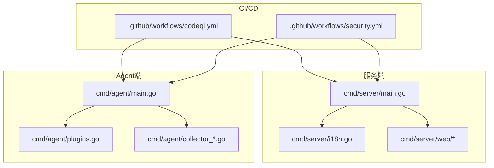
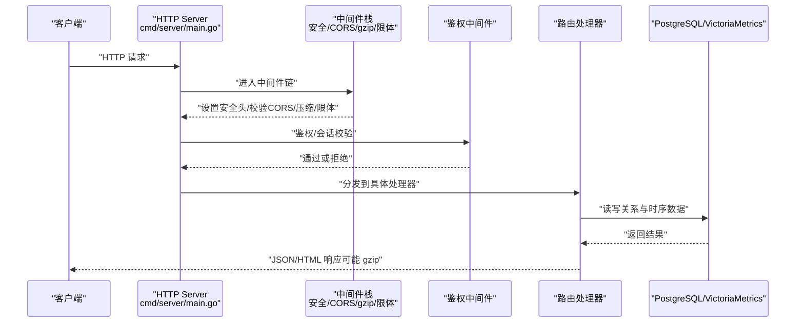
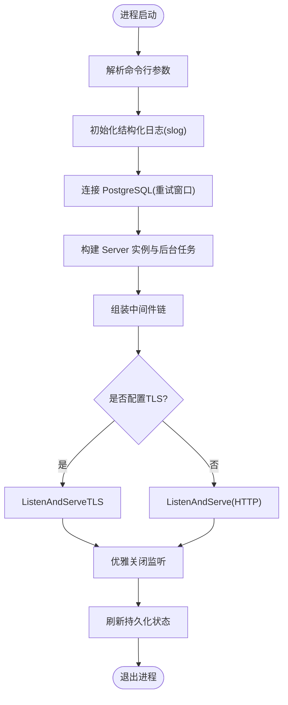
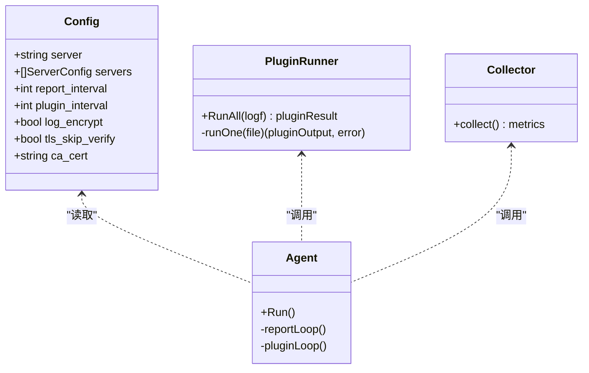
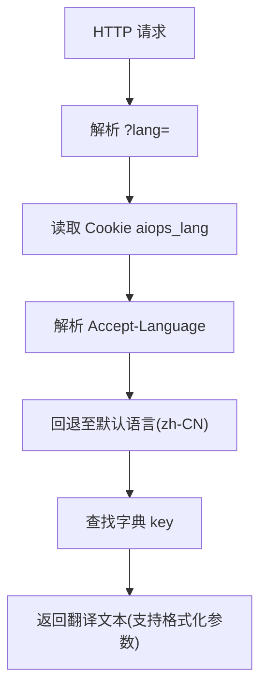
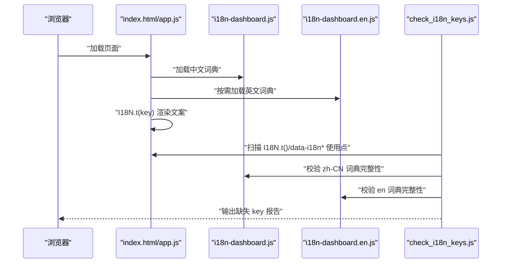
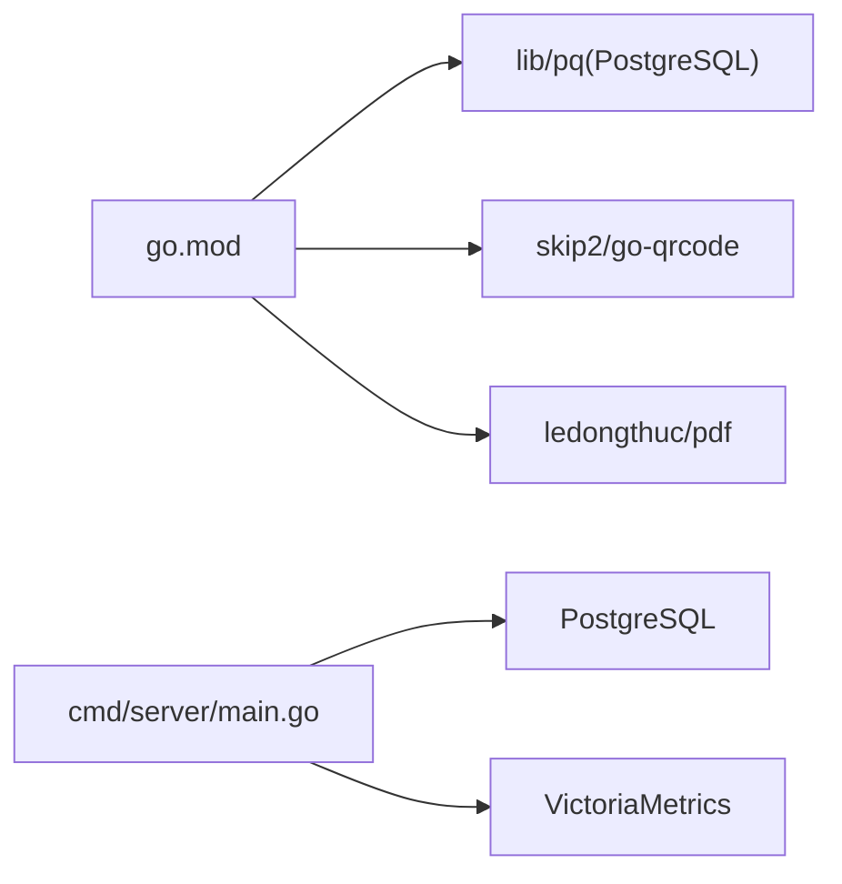

# 代码贡献规范

<cite>
**本文引用的文件**   
- [README.md](file://README.md)
- [go.mod](file://go.mod)
- [cmd/server/main.go](file://cmd/server/main.go)
- [cmd/agent/main.go](file://cmd/agent/main.go)
- [cmd/server/i18n.go](file://cmd/server/i18n.go)
- [scripts/check_i18n_keys.js](file://scripts/check_i18n_keys.js)
- [cmd/server/web/i18n-dashboard.en.js](file://cmd/server/web/i18n-dashboard.en.js)
- [cmd/server/web/i18n-dashboard.js](file://cmd/server/web/i18n-dashboard.js)
- [cmd/server/web/index.html](file://cmd/server/web/index.html)
- [cmd/agent/plugins.go](file://cmd/agent/plugins.go)
- [cmd/agent/collector_darwin.go](file://cmd/agent/collector_darwin.go)
- [cmd/server/sre_api.go](file://cmd/server/sre_api.go)
- [cmd/server/logstore_test.go](file://cmd/server/logstore_test.go)
- [.github/workflows/codeql.yml](file://.github/workflows/codeql.yml)
- [.github/workflows/security.yml](file://.github/workflows/security.yml)
</cite>

## 目录
1. [引言](#引言)
2. [项目结构](#项目结构)
3. [核心组件](#核心组件)
4. [架构总览](#架构总览)
5. [详细组件分析](#详细组件分析)
6. [依赖分析](#依赖分析)
7. [性能与并发考量](#性能与并发考量)
8. [测试与覆盖率要求](#测试与覆盖率要求)
9. [代码质量与安全工具链](#代码质量与安全工具链)
10. [提交信息与分支策略](#提交信息与分支策略)
11. [代码审查流程](#代码审查流程)
12. [国际化（i18n）维护规范](#国际化i18n维护规范)
13. [故障排查指南](#故障排查指南)
14. [结论](#结论)

## 引言
本规范面向 AIOps Monitor 项目的贡献者，统一编码风格、命名约定、错误处理与并发实践；定义提交信息格式与分支策略；明确代码审查流程与合并标准；给出 i18n 键值管理、多语言同步检查方法；并规定测试覆盖率与质量检查工具的使用。目标是提升协作效率、降低回归风险、保障生产可用性与可维护性。

## 项目结构
仓库采用双二进制 C/S 架构：服务端（Go）与 Agent（Go），共享层位于 shared/，前端面板内嵌于服务端二进制中，Python 插件由 Agent 执行。关键入口与职责如下：
- 服务端入口：cmd/server/main.go
- Agent 入口：cmd/agent/main.go
- 国际化后端：cmd/server/i18n.go
- 前端面板资源：cmd/server/web/*
- 插件运行器：cmd/agent/plugins.go
- 平台采集实现：cmd/agent/collector_*.go
- 工作流与 CI：.github/workflows/*

**图示来源** 
- [cmd/server/main.go:1-355](file://cmd/server/main.go#L1-L355)
- [cmd/agent/main.go:1-238](file://cmd/agent/main.go#L1-L238)
- [cmd/server/i18n.go:1-157](file://cmd/server/i18n.go#L1-L157)
- [.github/workflows/codeql.yml:1-38](file://.github/workflows/codeql.yml#L1-L38)
- [.github/workflows/security.yml:38-83](file://.github/workflows/security.yml#L38-L83)

**章节来源**
- [README.md:1-120](file://README.md#L1-L120)
- [go.mod:1-10](file://go.mod#L1-L10)

## 核心组件
- 服务端主循环与中间件：安全头、CORS、gzip、请求体限制、优雅关闭、TLS 启动等。
- Agent 主循环：配置加载、Relay 模式、插件并发执行、日志采集与加密上报。
- 国际化后端：语言探测、字典嵌入、翻译函数族 T/Tr/Tz。
- 前端面板：内嵌静态资源，使用 data-i18n 属性与 I18N.t() 进行本地化渲染。
- 插件系统：并发调度、超时保护、结果聚合。
- 平台采集：按平台实现指标采集，带超时与容错。

**章节来源**
- [cmd/server/main.go:72-205](file://cmd/server/main.go#L72-L205)
- [cmd/agent/main.go:74-136](file://cmd/agent/main.go#L74-L136)
- [cmd/server/i18n.go:68-129](file://cmd/server/i18n.go#L68-L129)
- [cmd/agent/plugins.go:102-151](file://cmd/agent/plugins.go#L102-L151)
- [cmd/agent/collector_darwin.go:199-245](file://cmd/agent/collector_darwin.go#L199-L245)

## 架构总览
下图展示一次典型 API 请求在服务端的处理链路，包括中间件栈、鉴权、路由与响应压缩。

**图示来源** 
- [cmd/server/main.go:72-205](file://cmd/server/main.go#L72-L205)

## 详细组件分析

### 服务端主程序与中间件
- 启动流程：解析参数 → 初始化 slog → 连接 PG → 构建服务 → 注册后台任务（告警评估、拨测、SLO、AI 巡检、VM 推送）→ 启动 HTTP 服务器（支持 TLS）。
- 中间件顺序：安全头 → CORS → gzip → 请求体限制 → 鉴权 → 路由。
- 优雅关闭：捕获 SIGINT/SIGTERM，停止接受新连接，等待活跃请求完成，刷新持久化后退出。

**图示来源** 
- [cmd/server/main.go:227-355](file://cmd/server/main.go#L227-L355)

**章节来源**
- [cmd/server/main.go:227-355](file://cmd/server/main.go#L227-L355)

### Agent 主程序与插件并发
- 配置优先级：默认 → 配置文件 → 命令行参数覆盖。
- Relay 模式：作为网关反向代理上游服务端。
- 插件执行：并发上限控制、超时保护、结果聚合。
- 日志采集：可选加密上报（gzip + AES-256-GCM）。

**图示来源** 
- [cmd/agent/main.go:24-62](file://cmd/agent/main.go#L24-L62)
- [cmd/agent/plugins.go:102-151](file://cmd/agent/plugins.go#L102-L151)

**章节来源**
- [cmd/agent/main.go:74-136](file://cmd/agent/main.go#L74-L136)
- [cmd/agent/plugins.go:102-151](file://cmd/agent/plugins.go#L102-L151)

### 国际化（i18n）后端机制
- 语言探测优先级：URL 查询参数 > Cookie > Accept-Language > 默认 zh-CN。
- 字典嵌入：编译期嵌入 JSON 字典，运行时只读访问。
- 翻译函数：T(lang,key,args)、Tr(r,key,args)、Tz(key,args)。

**图示来源** 
- [cmd/server/i18n.go:68-129](file://cmd/server/i18n.go#L68-L129)

**章节来源**
- [cmd/server/i18n.go:1-157](file://cmd/server/i18n.go#L1-L157)

### 前端面板与 i18n 集成
- 前端词典：中文词典与英文词典分别导出，供 I18N.t() 使用。
- 模板标记：data-i18n / data-i18n-placeholder / data-i18n-title 驱动文案替换。
- 校验脚本：扫描 app.js 与 index.html 中的 key，确保在 zh-CN 与 en 词典中均存在。

**图示来源** 
- [cmd/server/web/index.html:551-575](file://cmd/server/web/index.html#L551-L575)
- [cmd/server/web/i18n-dashboard.js:822-859](file://cmd/server/web/i18n-dashboard.js#L822-L859)
- [cmd/server/web/i18n-dashboard.en.js:213-923](file://cmd/server/web/i18n-dashboard.en.js#L213-L923)
- [scripts/check_i18n_keys.js:1-41](file://scripts/check_i18n_keys.js#L1-L41)

**章节来源**
- [cmd/server/web/index.html:551-575](file://cmd/server/web/index.html#L551-L575)
- [cmd/server/web/i18n-dashboard.js:822-859](file://cmd/server/web/i18n-dashboard.js#L822-L859)
- [cmd/server/web/i18n-dashboard.en.js:213-923](file://cmd/server/web/i18n-dashboard.en.js#L213-L923)
- [scripts/check_i18n_keys.js:1-41](file://scripts/check_i18n_keys.js#L1-L41)

## 依赖分析
- Go 版本：1.22+（go.mod 指定）。
- 外部依赖：仅少量第三方库（如二维码生成、PostgreSQL 驱动、PDF 生成），其余功能基于标准库实现。
- 存储依赖：统一使用 PostgreSQL（关系数据）与 VictoriaMetrics（时序数据），未配置将拒绝启动。

**图示来源** 
- [go.mod:1-10](file://go.mod#L1-L10)
- [cmd/server/main.go:255-272](file://cmd/server/main.go#L255-L272)

**章节来源**
- [go.mod:1-10](file://go.mod#L1-L10)
- [cmd/server/main.go:255-272](file://cmd/server/main.go#L255-L272)

## 性能与并发考量
- 并发模型：
  - 插件执行：并发上限为 4，避免过多子进程导致 CPU/内存尖峰。
  - 采集与上报：独立 goroutine 周期执行，互不阻塞。
- 资源限制：
  - 请求体大小限制（MaxBytesReader）防止内存耗尽。
  - gzip 响应复用 writer pool，减少分配开销。
- 平台采集：
  - 平台特定命令执行带超时上下文，避免卡死采集循环。

**章节来源**
- [cmd/agent/plugins.go:102-151](file://cmd/agent/plugins.go#L102-L151)
- [cmd/server/main.go:104-205](file://cmd/server/main.go#L104-L205)
- [cmd/agent/collector_darwin.go:199-245](file://cmd/agent/collector_darwin.go#L199-L245)

## 测试与覆盖率要求
- 单元测试：
  - 服务端已包含若干测试用例（例如日志存储持久化往返、过滤统计等）。
  - 建议优先补充核心模块测试：认证、告警阈值边界、采集解析、插件执行路径。
- 覆盖率目标：
  - 短期提升至 60%+，重点覆盖关键路径与边界条件。
- 测试命令：
  - go test ./...（含竞态检测 -race，建议在 CI 中启用）。

**章节来源**
- [cmd/server/logstore_test.go:46-92](file://cmd/server/logstore_test.go#L46-L92)
- [.github/workflows/security.yml:38-47](file://.github/workflows/security.yml#L38-L47)

## 代码质量与安全工具链
- CodeQL（SAST）：对 Go 进行深度静态安全分析，结果上传至 Security 页。
- govulncheck：依赖与标准库漏洞扫描（硬门槛）。
- gitleaks：全历史密钥泄露扫描（硬门槛）。
- gosec：SAST 扫描，输出 SARIF 至 CodeQL。
- 建议本地执行：
  - go vet ./...
  - go build ./cmd/server ./cmd/agent
  - go test -race ./...

**章节来源**
- [.github/workflows/codeql.yml:1-38](file://.github/workflows/codeql.yml#L1-L38)
- [.github/workflows/security.yml:49-83](file://.github/workflows/security.yml#L49-L83)

## 提交信息与分支策略
- 分支命名：
  - feature/xxx：新功能开发
  - fix/xxx：缺陷修复
  - docs/xxx：文档更新
  - i18n/xxx：国际化相关改动
  - chore/xxx：工程化、依赖升级、脚本优化
- 提交信息格式（Conventional Commits）：
  - type(scope): subject
  - type 示例：feat、fix、docs、style、refactor、test、chore、i18n
  - scope 示例：server、agent、web、i18n、plugins
  - 示例：
    - feat(server): 新增端口转发批量映射
    - fix(agent): 修复插件并发上限导致的资源占用
    - i18n(web): 补齐英文词典缺失的 key
- 分支合并：
  - 主干分支（master/main）需通过所有 CI 检查项后方可合并。
  - 禁止直接推送至主干分支。

[本节为通用规范说明，不直接分析具体文件]

## 代码审查流程
- PR 模板要点：
  - 变更概述与动机
  - 影响范围（前后端/Agent/插件/配置）
  - 自测步骤与截图/日志
  - 风险与回滚方案
- 审查检查项：
  - 命名与风格：遵循 Go 惯用风格，函数名清晰表达意图
  - 错误处理：普遍使用 if err != nil，关键路径有日志
  - 并发安全：共享状态使用 Mutex/RWMutex，goroutine 生命周期清晰
  - 安全性：无明文密钥、输入校验、CSP/安全头正确
  - i18n：新增 key 需在 zh-CN 与 en 词典中同步
  - 测试：新增/修改逻辑需配套单测或集成测试
- 合并标准：
  - CI 全部通过（CodeQL、govulncheck、gitleaks、gosec、go test -race）
  - 至少一名 reviewer 批准
  - 无遗留高危问题

[本节为通用流程说明，不直接分析具体文件]

## 国际化（i18n）维护规范
- 键值管理：
  - 后端：cmd/server/i18n/{zh-CN,zh-TW,en}.json，三语 key 完全齐平。
  - 前端：cmd/server/web/i18n-dashboard.js（zh-CN）与 cmd/server/web/i18n-dashboard.en.js（en）。
- 命名规范：
  - 采用“模块.属性”点分风格，前后端保持一致。
- 同步检查：
  - 使用 scripts/check_i18n_keys.js 扫描 app.js 与 index.html 中的 key，确保在 zh-CN 与 en 词典中均存在。
- 接入方式：
  - 后端：Tr/T/Tz 函数族，自动从请求或默认语言选择字典。
  - 前端：I18N.t(key) 与 data-i18n* 属性配合渲染。

**章节来源**
- [cmd/server/i18n.go:1-157](file://cmd/server/i18n.go#L1-L157)
- [scripts/check_i18n_keys.js:1-41](file://scripts/check_i18n_keys.js#L1-L41)
- [cmd/server/web/i18n-dashboard.js:822-859](file://cmd/server/web/i18n-dashboard.js#L822-L859)
- [cmd/server/web/i18n-dashboard.en.js:213-923](file://cmd/server/web/i18n-dashboard.en.js#L213-L923)
- [cmd/server/web/index.html:551-575](file://cmd/server/web/index.html#L551-L575)

## 故障排查指南
- 常见启动失败：
  - 未配置 AIOPS_POSTGRES_DSN 或 AIOPS_VM_URL：服务端拒绝启动，请检查环境变量。
  - TLS 证书未配置：以明文 HTTP 提供服务，生产环境建议启用 TLS。
- 插件异常：
  - 插件执行失败会被记录并跳过，不影响核心；检查插件超时与输出格式。
- 终端与转发：
  - WebSocket 升级路径被 gzip 中间件排除，确保代理配置正确。
- 日志检索：
  - 日志级别过滤与统计一致性已在测试中验证，可按需调整过滤条件。

**章节来源**
- [cmd/server/main.go:255-272](file://cmd/server/main.go#L255-L272)
- [cmd/server/main.go:186-205](file://cmd/server/main.go#L186-L205)
- [cmd/agent/plugins.go:102-151](file://cmd/agent/plugins.go#L102-L151)
- [cmd/server/logstore_test.go:46-92](file://cmd/server/logstore_test.go#L46-L92)

## 结论
本规范明确了 AIOps Monitor 的编码风格、命名约定、错误处理与并发实践，定义了提交信息与分支策略，完善了代码审查流程与合并标准，并给出了 i18n 键值管理与多语言同步检查方法。结合 CI 中的 CodeQL、govulncheck、gitleaks、gosec 与 go test -race，可有效提升代码质量与安全性。建议持续完善测试覆盖，强化关键路径的单测与集成测试，确保长期可维护性与稳定性。