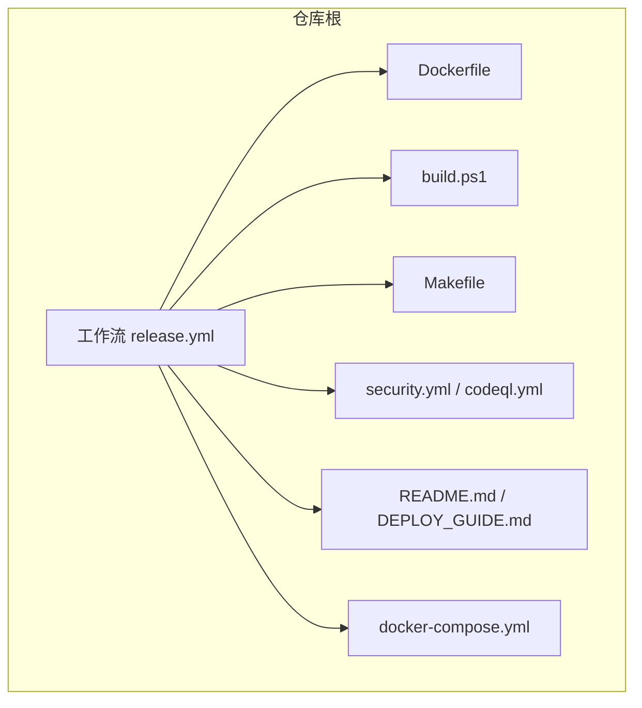
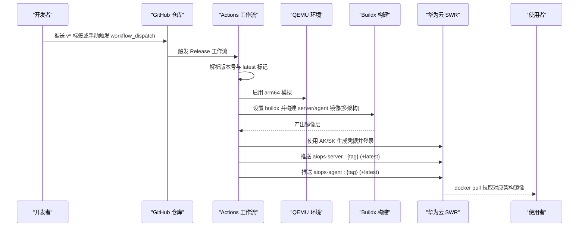
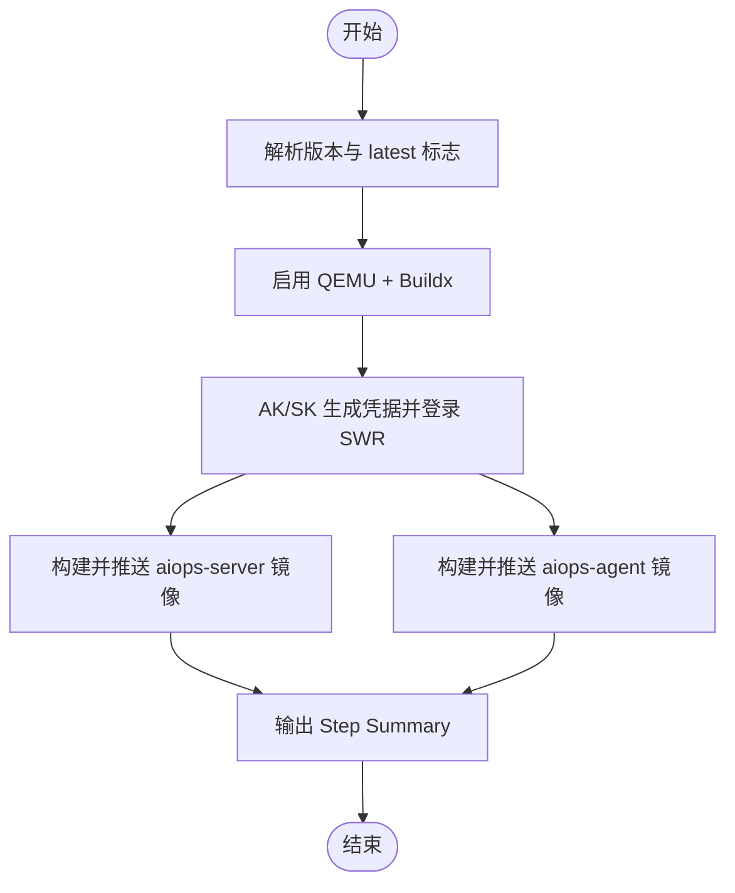
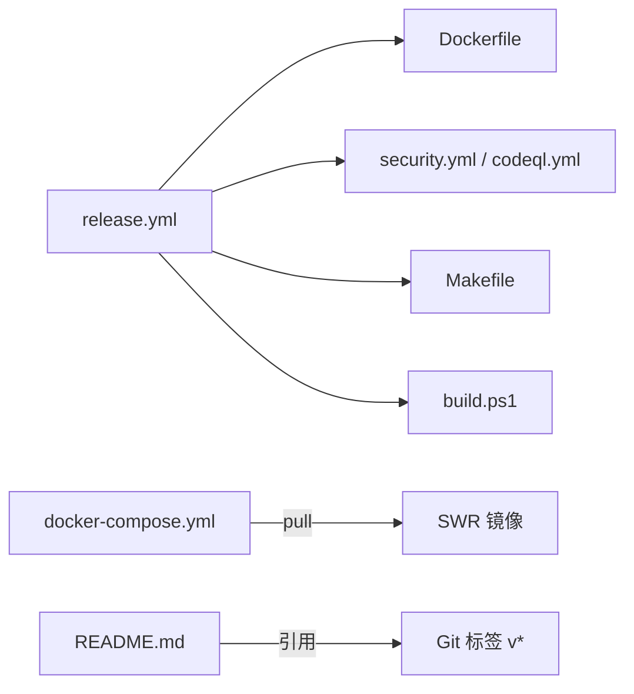

# 发布流程

<cite>
**本文引用的文件列表**
- [release.yml](file://.github/workflows/release.yml)
- [Dockerfile](file://docker/Dockerfile)
- [build.ps1](file://build.ps1)
- [Makefile](file://Makefile)
- [security.yml](file://.github/workflows/security.yml)
- [codeql.yml](file://.github/workflows/codeql.yml)
- [README.md](file://README.md)
- [DEPLOY_GUIDE.md](file://DEPLOY_GUIDE.md)
- [docker-compose.yml](file://docker-compose.yml)
</cite>

## 目录
1. [简介](#简介)
2. [项目结构](#项目结构)
3. [核心组件](#核心组件)
4. [架构总览](#架构总览)
5. [详细组件分析](#详细组件分析)
6. [依赖关系分析](#依赖关系分析)
7. [性能与构建特性](#性能与构建特性)
8. [发布前检查清单](#发布前检查清单)
9. [发布后验证与回滚](#发布后验证与回滚)
10. [热更新与灰度发布](#热更新与灰度发布)
11. [结论](#结论)

## 简介
本文件面向 AIOps Monitor 的发布与版本管理，覆盖以下主题：
- Git 标签管理与语义化版本控制规范
- 自动化发布流水线（GitHub Actions）：多架构镜像构建、推送至华为云 SWR
- 本地与 CI 构建产物（Go 二进制、Docker 镜像）
- 发布前检查清单（代码审查、测试、文档、安全扫描）
- 发布后验证步骤（部署测试、功能验证、回滚预案）
- 热更新与灰度发布实施方案（服务重启策略、配置热加载、数据迁移处理）

## 项目结构
与发布相关的核心位置如下：
- GitHub Actions 工作流：.github/workflows/release.yml
- Docker 多阶段构建：docker/Dockerfile
- Windows 本地构建脚本：build.ps1
- 本地安全门与工具链：Makefile
- 安全门禁工作流：.github/workflows/security.yml、.github/workflows/codeql.yml
- 用户文档与部署说明：README.md、DEPLOY_GUIDE.md
- 编排与默认镜像来源：docker-compose.yml

图表来源
- [release.yml:1-130](file://.github/workflows/release.yml#L1-L130)
- [Dockerfile:1-73](file://docker/Dockerfile#L1-L73)
- [build.ps1:1-38](file://build.ps1#L1-L38)
- [Makefile:1-43](file://Makefile#L1-L43)
- [security.yml:1-36](file://.github/workflows/security.yml#L1-L36)
- [codeql.yml:1-38](file://.github/workflows/codeql.yml#L1-L38)
- [README.md:227-251](file://README.md#L227-L251)
- [DEPLOY_GUIDE.md:1-107](file://DEPLOY_GUIDE.md#L1-L107)
- [docker-compose.yml:1-144](file://docker-compose.yml#L1-L144)

章节来源
- [release.yml:1-130](file://.github/workflows/release.yml#L1-L130)
- [Dockerfile:1-73](file://docker/Dockerfile#L1-L73)
- [build.ps1:1-38](file://build.ps1#L1-L38)
- [Makefile:1-43](file://Makefile#L1-L43)
- [security.yml:1-36](file://.github/workflows/security.yml#L1-L36)
- [codeql.yml:1-38](file://.github/workflows/codeql.yml#L1-L38)
- [README.md:227-251](file://README.md#L227-L251)
- [DEPLOY_GUIDE.md:1-107](file://DEPLOY_GUIDE.md#L1-L107)
- [docker-compose.yml:1-144](file://docker-compose.yml#L1-L144)

## 核心组件
- 触发与版本解析：基于 Git 标签 v* 或手动指定 tag；自动推导是否打 latest。
- 多架构构建：QEMU + Buildx 支持 linux/amd64 与 linux/arm64。
- 镜像登录与推送：通过 AK/SK 生成 SWR 登录凭据并推送 aiops-server 与 aiops-agent 镜像。
- 构建参数注入：VERSION 注入 main.appVersion，便于运行时显示版本。
- 本地构建与安全门：Windows 一键构建脚本与 Makefile 提供 vet/test/vuln/sec/staticcheck/sbom。

章节来源
- [release.yml:15-55](file://.github/workflows/release.yml#L15-L55)
- [release.yml:57-76](file://.github/workflows/release.yml#L57-L76)
- [release.yml:78-116](file://.github/workflows/release.yml#L78-L116)
- [Dockerfile:17-42](file://docker/Dockerfile#L17-L42)
- [build.ps1:12-31](file://build.ps1#L12-L31)
- [Makefile:18-43](file://Makefile#L18-L43)

## 架构总览
下图展示从“打标签”到“镜像可用”的端到端流程，以及本地/CI 构建路径。

图表来源
- [release.yml:15-55](file://.github/workflows/release.yml#L15-L55)
- [release.yml:57-76](file://.github/workflows/release.yml#L57-L76)
- [release.yml:78-116](file://.github/workflows/release.yml#L78-L116)

## 详细组件分析

### Git 标签与语义化版本控制
- 标签命名：采用 vX.Y.Z 形式（例如 v5.5.5），由 README 中版本徽章与示例体现。
- 版本注入：
  - CI：release.yml 将 GITHUB_REF_NAME 作为 VERSION 传入 Docker 构建。
  - Dockerfile：在 Go 构建时通过 ldflags 注入 main.appVersion。
  - 本地：build.ps1 通过 git describe --tags 获取 tag 并注入。
- 建议规范：遵循 SemVer（主版本=破坏性变更，次版本=新功能，修订=修复）。

章节来源
- [release.yml:43-55](file://.github/workflows/release.yml#L43-L55)
- [Dockerfile:30-33](file://docker/Dockerfile#L30-L33)
- [build.ps1:12-21](file://build.ps1#L12-L21)
- [README.md:6-8](file://README.md#L6-L8)

### 自动化发布流程（GitHub Actions）
- 触发条件：push 匹配 v* 标签；或 workflow_dispatch 指定 tag 与是否更新 latest。
- 关键步骤：
  - 解析版本与 latest 标志
  - 启用 QEMU 与 Buildx
  - 使用 AK/SK 生成 SWR 登录凭据并登录
  - 构建并推送 server/agent 双目标镜像（多架构）
  - 输出 Step Summary 汇总镜像地址与标签
- 所需 Secrets：HW_ACCESS_KEY、HW_SECRET_KEY（用于 HMAC-SHA256 生成密码）。

图表来源
- [release.yml:15-55](file://.github/workflows/release.yml#L15-L55)
- [release.yml:57-76](file://.github/workflows/release.yml#L57-L76)
- [release.yml:78-116](file://.github/workflows/release.yml#L78-L116)

章节来源
- [release.yml:1-130](file://.github/workflows/release.yml#L1-L130)

### 多平台二进制与镜像构建
- Dockerfile 多阶段构建：
  - builder 阶段：按 TARGETOS/TARGETARCH 交叉编译 server 与 agent 二进制，并打包全平台 Agent 分发包。
  - server 镜像：仅包含服务端二进制与 dist 包。
  - agent 镜像：包含 agent 二进制与 Python 插件运行环境。
- 构建参数：
  - BASE_REGISTRY：可切换为官方源以规避镜像加速问题。
  - GO_VERSION：当前默认 1.22（注释提示存在 EOL 风险，建议升级至官方补丁版）。
  - VERSION：注入 main.appVersion。

章节来源
- [Dockerfile:1-73](file://docker/Dockerfile#L1-L73)

### 本地构建与安全检查
- Windows 构建脚本：build.ps1 自动读取最新 tag 并通过 ldflags 注入版本号，支持交叉编译开关。
- Makefile 安全门：
  - vet、test、race、govulncheck、gosec、staticcheck、sbom 等目标
  - tools 目标安装必要工具
- 建议：提交前执行 make audit 或等效命令，确保本地质量门通过。

章节来源
- [build.ps1:1-38](file://build.ps1#L1-L38)
- [Makefile:1-43](file://Makefile#L1-L43)

### 安全门禁与静态分析
- security.yml：go vet、单测、漏洞扫描、密钥扫描、SBOM 等，结果上传 Security 页。
- codeql.yml：CodeQL 深度 SAST，定期与 PR 触发。
- 建议：将 gosec/staticcheck 逐步提升为硬门槛，持续收敛安全问题。

章节来源
- [security.yml:1-36](file://.github/workflows/security.yml#L1-L36)
- [codeql.yml:1-38](file://.github/workflows/codeql.yml#L1-L38)

## 依赖关系分析
- 工作流对 Dockerfile 的依赖：构建 target、平台、构建参数。
- 工作流对 Secrets 的依赖：HW_ACCESS_KEY/HW_SECRET_KEY。
- 编排对镜像版本的依赖：docker-compose.yml 默认使用 :latest，生产应锁定具体版本。
- 文档对版本号的引用：README.md 中的版本徽章与示例。

图表来源
- [release.yml:1-130](file://.github/workflows/release.yml#L1-L130)
- [Dockerfile:1-73](file://docker/Dockerfile#L1-L73)
- [docker-compose.yml:1-144](file://docker-compose.yml#L1-L144)
- [README.md:227-251](file://README.md#L227-L251)

章节来源
- [release.yml:1-130](file://.github/workflows/release.yml#L1-L130)
- [Dockerfile:1-73](file://docker/Dockerfile#L1-L73)
- [docker-compose.yml:1-144](file://docker-compose.yml#L1-L144)
- [README.md:227-251](file://README.md#L227-L251)

## 性能与构建特性
- 多架构并行构建：利用 Buildx 同时产出 amd64/arm64 镜像，减少跨平台适配成本。
- 缓存优化：GHA cache-from/cache-to 加速重复构建。
- 构建体积优化：ldflags -s -w 去除调试信息，减小镜像体积。
- 基础镜像选择：可通过 BASE_REGISTRY 切换为官方源，避免镜像加速带来的不一致。

章节来源
- [release.yml:78-116](file://.github/workflows/release.yml#L78-L116)
- [Dockerfile:17-42](file://docker/Dockerfile#L17-L42)

## 发布前检查清单
建议在每次打标签前完成以下检查：
- 代码审查完成
  - 至少两名 reviewer 批准
  - 涉及敏感逻辑（鉴权、网络、存储）需专项评审
- 测试通过
  - 本地执行 make test 与 race 检测
  - CI 单测与竞态检测全部通过
- 文档更新
  - 更新 README 中与版本相关说明（如镜像标签、环境变量变更）
  - 若涉及部署差异，更新部署指南
- 安全扫描
  - 本地执行 make vuln / sec / staticcheck
  - 确认 security.yml 与 codeql.yml 无新增高优问题
- 构建验证
  - 本地使用 build.ps1 或 docker build 验证多架构产物
  - 确认版本号注入正确（main.appVersion）

章节来源
- [Makefile:18-43](file://Makefile#L18-L43)
- [security.yml:1-36](file://.github/workflows/security.yml#L1-L36)
- [codeql.yml:1-38](file://.github/workflows/codeql.yml#L1-L38)
- [build.ps1:12-31](file://build.ps1#L12-L31)
- [README.md:227-251](file://README.md#L227-L251)

## 发布后验证与回滚
- 部署测试
  - 使用 docker-compose.yml 拉起最小环境，验证健康检查与健康端点
  - 校验 AIOPS_POSTGRES_DSN 与 AIOPS_VM_URL 连通性
- 功能验证
  - 访问 Web UI 与 API，确认版本信息与基本功能正常
  - 验证端口转发、远程终端、拨测等关键能力
- 回滚预案
  - 镜像层面：将 compose 中 image 版本回退至上一个稳定 tag
  - 二进制层面：保留旧二进制备份，替换为新版本后可快速回滚
  - 数据层面：PG 与 VM 数据持久化，回滚镜像不影响数据

章节来源
- [docker-compose.yml:50-84](file://docker-compose.yml#L50-L84)
- [DEPLOY_GUIDE.md:25-74](file://DEPLOY_GUIDE.md#L25-L74)
- [README.md:209-226](file://README.md#L209-L226)

## 热更新与灰度发布
- 服务重启策略
  - 容器化部署：滚动替换镜像版本，配合 healthcheck 与 depends_on 保证启动顺序
  - 二进制部署：先停止旧进程，再启动新进程，注意保留日志与状态文件
- 配置热加载
  - 服务端支持通过环境变量覆盖配置项（优先级高于配置文件），可在不重建镜像的情况下调整行为
  - 建议：对关键配置变更进行小流量验证后再全量生效
- 数据迁移处理
  - 关系数据与时序数据分别落 PG 与 VM，镜像回滚不影响数据
  - 若涉及数据库 schema 变更，需在发布前准备迁移脚本并在低峰期执行，具备回滚方案
- 灰度发布实施
  - 按主机维度分批接入新版本 Agent
  - 服务端侧通过反向代理或入口网关进行流量切分，观察指标与告警后再全量切换
  - 结合统一消息中心与告警治理，监控异常并及时回滚

章节来源
- [docker-compose.yml:64-84](file://docker-compose.yml#L64-L84)
- [README.md:556-576](file://README.md#L556-L576)
- [DEPLOY_GUIDE.md:25-74](file://DEPLOY_GUIDE.md#L25-L74)

## 结论
本项目已具备完善的自动化发布能力：基于 Git 标签触发 CI，构建多架构镜像并推送至企业私有镜像仓库；配套本地构建与安全门，保障交付质量。建议在生产环境中严格遵循语义化版本控制，完善发布前检查清单与发布后验证流程，并结合灰度与回滚策略降低上线风险。对于热更新场景，优先采用容器化滚动更新与配置热加载，确保业务连续性与可观测性。