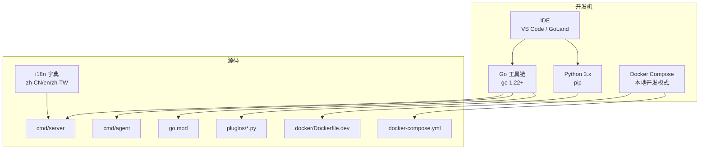
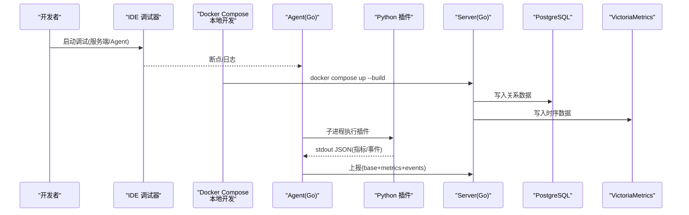
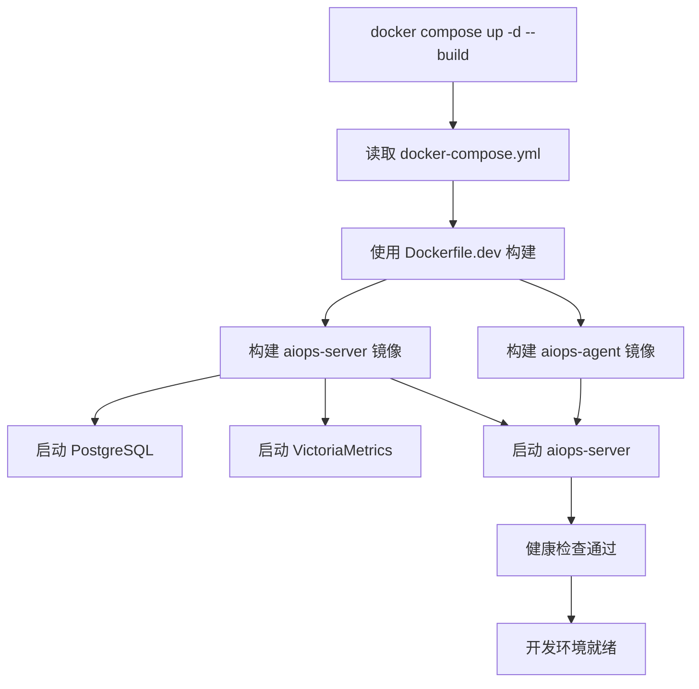
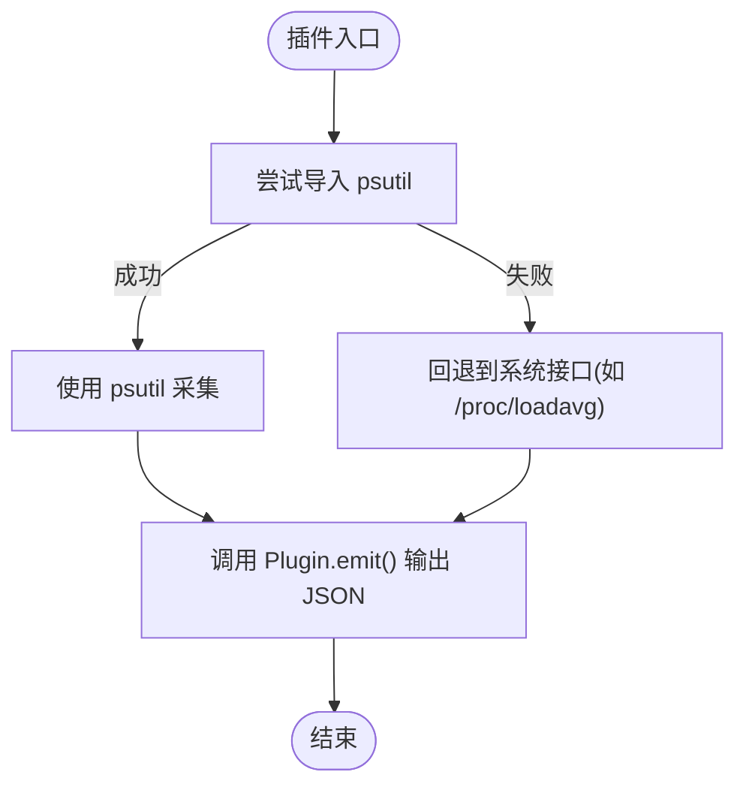
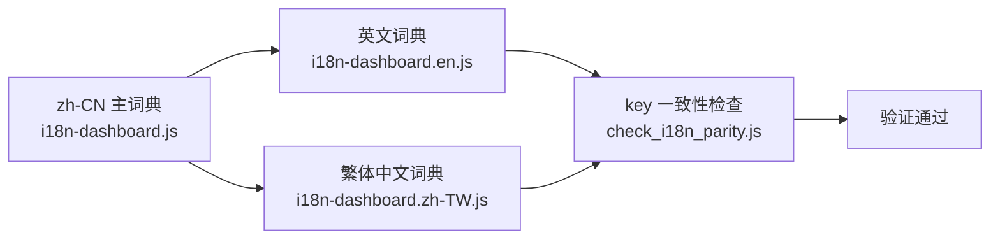
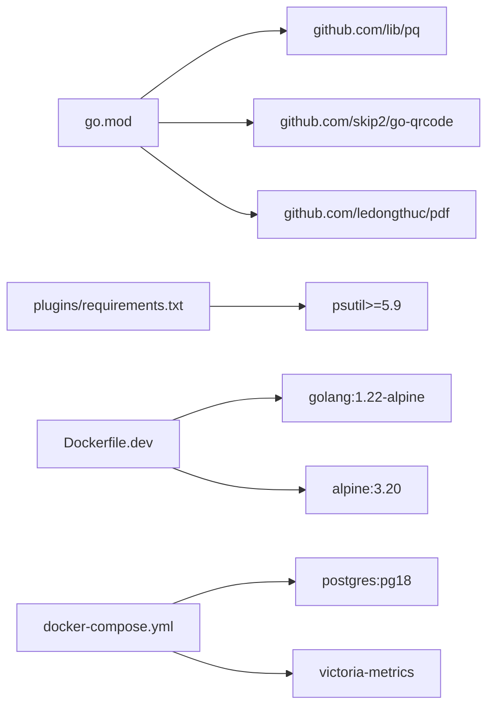

# 开发环境搭建

<cite>
**本文引用的文件列表**
- [README.md](file://README.md)
- [go.mod](file://go.mod)
- [plugins/requirements.txt](file://plugins/requirements.txt)
- [plugins/plugin_sdk.py](file://plugins/plugin_sdk.py)
- [cmd/agent/plugins.go](file://cmd/agent/plugins.go)
- [docker/Dockerfile](file://docker/Dockerfile)
- [docker/Dockerfile.dev](file://docker/Dockerfile.dev)
- [docker-compose.yml](file://docker-compose.yml)
- [build.ps1](file://build.ps1)
- [cmd/server/install.go](file://cmd/server/install.go)
- [cmd/server/i18n/zh-CN.json](file://cmd/server/i18n/zh-CN.json)
- [cmd/server/i18n/en.json](file://cmd/server/i18n/en.json)
- [cmd/server/web/i18n-dashboard.js](file://cmd/server/web/i18n-dashboard.js)
- [cmd/server/web/i18n-dashboard.en.js](file://cmd/server/web/i18n-dashboard.en.js)
- [cmd/server/web/i18n-dashboard.zh-TW.js](file://cmd/server/web/i18n-dashboard.zh-TW.js)
</cite>

## 更新摘要
**变更内容**
- 新增 Dockerfile.dev 简化本地开发构建流程
- docker-compose.yml 支持本地构建模式，使用 Dockerfile.dev 加速开发
- 国际化系统完善，UDP探测和跳板机功能已完整覆盖中/英/繁体中文翻译
- 新增多语言前端词典支持（简体中文、英文、繁体中文）

## 目录
1. [简介](#简介)
2. [项目结构](#项目结构)
3. [核心组件](#核心组件)
4. [架构总览](#架构总览)
5. [详细组件分析](#详细组件分析)
6. [依赖分析](#依赖分析)
7. [性能考虑](#性能考虑)
8. [故障排查指南](#故障排查指南)
9. [结论](#结论)
10. [附录](#附录)

## 简介
本指南面向开发者，聚焦于在本地或 CI 环境中搭建 AIOps Monitor 的开发与调试环境。内容覆盖：
- Go 语言环境安装与配置（Go 1.22+）
- 环境变量、GOPATH 与模块管理（go mod）
- IDE 推荐配置（VS Code、GoLand）
- Windows / Linux / macOS 差异化步骤
- 调试环境设置（断点调试、日志输出、性能分析）
- Python 插件开发环境准备（Python 3.x 与依赖）
- **新增**：Docker 开发环境快速启动与本地构建优化
- **新增**：多语言国际化开发环境配置

## 项目结构
仓库采用"服务端 + Agent + Python 插件层"的混合架构：
- cmd/server：Go 服务端入口与业务逻辑
- cmd/agent：Go Agent 采集与上报
- plugins：Python 插件与 SDK
- docker：多阶段构建镜像（含开发专用 Dockerfile.dev）
- build.ps1：Windows 一键构建脚本
- **新增**：docker-compose.yml 支持本地开发模式

**图表来源**
- [docker/Dockerfile.dev:1-45](file://docker/Dockerfile.dev#L1-L45)
- [docker-compose.yml:49-141](file://docker-compose.yml#L49-L141)
- [cmd/server/i18n/zh-CN.json:1-409](file://cmd/server/i18n/zh-CN.json#L1-L409)

## 核心组件
- Go 版本要求：1.22+（由 go.mod 指定）
- 模块路径：aiops-monitor（根模块）
- 外部依赖：仅少量第三方库（如 lib/pq、PDF 生成等），其余为 Go 标准库
- Python 插件：通过子进程执行，SDK 约定 JSON 协议
- **新增**：Docker 开发环境：Dockerfile.dev 专门用于本地开发，跳过交叉编译加速构建
- **新增**：多语言支持：完整的 i18n 系统覆盖中/英/繁体中文

章节来源
- [go.mod:1-10](file://go.mod#L1-L10)
- [README.md:314-327](file://README.md#L314-L327)

## 架构总览
Agent 以子进程方式运行 Python 插件，按周期产出指标与事件；服务端接收并持久化到 PostgreSQL（关系数据）与 VictoriaMetrics（时序数据）。

**图表来源**
- [docker-compose.yml:49-84](file://docker-compose.yml#L49-L84)
- [docker/Dockerfile.dev:22-44](file://docker/Dockerfile.dev#L22-L44)

## 详细组件分析

### Go 环境安装与配置（Go 1.22+）
- 安装 Go 1.22 或以上版本
- 启用模块代理（建议）：
  - Linux/macOS：export GOPROXY=https://goproxy.cn,direct
  - Windows（PowerShell）：$env:GOPROXY="https://goproxy.cn,direct"
- GOPATH 与 PATH：
  - 现代 Go 使用 go mod，无需 GOPATH；若需保留 GOPATH，确保 $GOPATH/bin 加入 PATH
- 验证：
  - go version 应显示 1.22+
  - go env 检查 GOPROXY、GOOS、GOARCH

章节来源
- [go.mod:1-10](file://go.mod#L1-L10)
- [README.md:314-327](file://README.md#L314-L327)

### 依赖管理与 vendor
- 使用 go mod 管理依赖（go.mod 已声明 go 1.22 与所需包）
- 拉取依赖：go mod download
- 校验一致性：go mod verify
- vendor 目录：仓库中存在空 vendor 目录，如需离线构建可执行 go mod vendor 生成
- 注意：当前 go.sum 未包含在本节引用中，实际构建时请确保 go.sum 存在且一致

章节来源
- [go.mod:1-10](file://go.mod#L1-L10)

### IDE 推荐配置
- VS Code
  - 安装扩展：Go for Visual Studio Code
  - 自动补全、lint、格式化、测试、调试均开箱即用
  - 调试：使用内置 launch.json 配置 server/agent 两个入口
- GoLand
  - 自动识别 go.mod 与模块路径
  - 支持断点、变量查看、控制台 I/O、热重载（配合外部工具）
  - 调试：分别创建 Server 与 Agent 的 Run/Debug Configuration

章节来源
- [README.md:314-327](file://README.md#L314-L327)

### 平台差异化配置

#### Windows
- 安装 Go 后，打开 PowerShell 执行：
  - $env:GOPROXY="https://goproxy.cn,direct"
  - go mod download
- 构建：
  - 本地：powershell -File build.ps1
  - 交叉编译：powershell -File build.ps1 -CrossCompile
- 运行：
  - 服务端：bin\aiops-server.exe
  - Agent：bin\aiops-agent.exe --server http://<IP>:8529

章节来源
- [build.ps1:34-55](file://build.ps1#L34-L55)
- [README.md:329-337](file://README.md#L329-L337)

#### Linux
- 安装 Go 后，终端执行：
  - export GOPROXY=https://goproxy.cn,direct
  - go mod download
- 构建：
  - go build -o bin/aiops-server ./cmd/server
  - go build -o bin/aiops-agent ./cmd/agent
- 运行：
  - ./bin/aiops-server
  - ./bin/aiops-agent --server http://<IP>:8529

章节来源
- [README.md:314-327](file://README.md#L314-L327)

#### macOS
- Apple Silicon（arm64）与 Intel（amd64）均原生支持
- 安装 Go 后，终端执行：
  - export GOPROXY=https://goproxy.cn,direct
  - go mod download
- 构建与运行同 Linux

章节来源
- [README.md:57-59](file://README.md#L57-L59)
- [README.md:314-327](file://README.md#L314-L327)

### Docker 开发环境（新增）

#### Dockerfile.dev 开发专用镜像
- **目的**：专门用于本地开发，跳过 dist 交叉编译，大幅加速构建过程
- **特性**：
  - 仅构建当前平台的 server + agent 二进制
  - 使用 vendor 模式加速依赖解析
  - 预打包 plugins.zip 供服务端使用
  - 支持多阶段构建（builder → server/agent）

#### docker-compose.yml 本地构建模式
- **开发模式**：`docker compose up -d --build` 使用 Dockerfile.dev 本地构建
- **生产模式**：直接拉取预构建镜像 `docker compose up -d`
- **服务组成**：
  - aiops-server：Go 单容器（内嵌前端），Web/API 端口 8529
  - victoriametrics：时序指标库（全部指标/趋势）
  - postgres：关系数据库（配置/用户/审计/事件/工单/会话）
  - aiops-agent：可选的本机 Agent（采集宿主指标）

**图表来源**
- [docker-compose.yml:53-84](file://docker-compose.yml#L53-L84)
- [docker/Dockerfile.dev:16-34](file://docker/Dockerfile.dev#L16-L34)

**章节来源**
- [docker/Dockerfile.dev:1-45](file://docker/Dockerfile.dev#L1-45)
- [docker-compose.yml:1-141](file://docker-compose.yml#L1-141)

### 调试环境设置

#### 断点调试
- 服务端：在 cmd/server/main.go 附近设置断点，IDE 直接运行
- Agent：在 cmd/agent/main.go 附近设置断点，传入 --server 参数指向本地服务
- **Docker 调试**：使用 docker-compose 启动后，可通过 IDE 远程调试连接

#### 日志输出
- 默认使用 slog 输出结构化日志（JSON 格式），便于聚合与分析
- Windows 控制台默认非 UTF-8，代码已在启动时切换至 UTF-8，避免乱码

#### 性能分析
- 使用 pprof 对服务端进行 CPU/内存分析
- 结合 Prometheus + Grafana 观察运行时指标
- 针对 Agent 插件执行耗时，可在插件内埋点或通过系统级工具（perf、DTrace、ETW）定位

章节来源
- [README.md:314-327](file://README.md#L314-L327)
- [README.md:1108-1117](file://README.md#L1108-L1117)

### Python 插件开发环境
- 版本要求：Python 3.x（建议使用 3.9+）
- 可选依赖：psutil>=5.9（用于跨平台进程/资源采集兜底）
- 安装依赖：
  - pip install -r plugins/requirements.txt
- 插件协议：
  - 插件向 stdout 输出 JSON，字段包括 metrics、events、base（可选）
  - SDK 提供 Plugin 类简化写入
- 示例插件：
  - example_service_check.py：TCP 连通性与延迟探测
  - example_ai_anomaly.py：基于滚动基线的异常检测
  - process_monitor.py：进程存活与资源统计

**章节来源**
- [plugins/requirements.txt:1-4](file://plugins/requirements.txt#L1-L4)
- [plugins/plugin_sdk.py:1-58](file://plugins/plugin_sdk.py#L1-L58)
- [plugins/example_service_check.py:1-41](file://plugins/example_service_check.py#L1-L41)
- [plugins/example_ai_anomaly.py:1-41](file://plugins/example_ai_anomaly.py#L1-L41)
- [plugins/process_monitor.py:1-40](file://plugins/process_monitor.py#L1-L40)

### 多语言国际化开发环境（新增）

#### 后端 i18n 机制
- **语言支持**：简体中文 (zh-CN)、英文 (en)、繁体中文 (zh-TW)
- **语言探测优先级**：?lang= > Cookie aiops_lang > Accept-Language > 默认 zh-CN
- **字典文件**：cmd/server/i18n/{zh-CN,zh-TW,en}.json，三者 key 完全齐平
- **API 集成**：Tr/T/Tz 函数在 24 个 .go 文件中被调用

#### 前端面板 i18n 机制
- **字典文件**：
  - i18n-dashboard.js：简体中文主词典（~600 条）
  - i18n-dashboard.en.js：英文词典（自动生成）
  - i18n-dashboard.zh-TW.js：繁体中文词典（自动生成）
- **语言切换**：支持动态切换，Cookie 持久化，页面重渲染
- **覆盖范围**：UDP 探测、跳板机功能、告警通知等核心功能已完整覆盖

#### 国际化构建脚本
- **build_i18n_en.js**：从 zh-CN 词典生成英文词典，保持 key 一致性
- **build_i18n_tw.js**：从 zh-CN 词典生成繁体中文词典，使用 OpenCC 转换
- **check_i18n_parity.js**：检查各语言词典 key 的一致性

**图表来源**
- [scripts/build_i18n_en.js:1-114](file://scripts/build_i18n_en.js#L1-114)
- [scripts/build_i18n_tw.js:34-73](file://scripts/build_i18n_tw.js#L34-L73)

**章节来源**
- [cmd/server/i18n/zh-CN.json:1-409](file://cmd/server/i18n/zh-CN.json#L1-L409)
- [cmd/server/i18n/en.json:1-404](file://cmd/server/i18n/en.json#L1-L404)
- [cmd/server/web/i18n-dashboard.js:976-1008](file://cmd/server/web/i18n-dashboard.js#L976-L1008)
- [cmd/server/web/i18n-dashboard.en.js:1-200](file://cmd/server/web/i18n-dashboard.en.js#L1-L200)
- [cmd/server/web/i18n-dashboard.zh-TW.js:1-800](file://cmd/server/web/i18n-dashboard.zh-TW.js#L1-L800)

### Agent 与插件集成要点
- Agent 通过子进程执行插件，超时/崩溃不影响核心
- 首次运行立即执行，后续按配置间隔调度，避免频繁创建子进程
- 插件输出 JSON 被解析合并后随基础指标一并上报

章节来源
- [cmd/agent/plugins.go:1-55](file://cmd/agent/plugins.go#L1-L55)

### Docker 构建与依赖
- **传统 Dockerfile**：Alpine + CA 证书 + zip（打包插件）
- **Dockerfile.dev**：开发专用，跳过交叉编译，使用 vendor 模式
- **Agent 镜像**：Alpine + python3 + pip，预装 psutil
- **健康检查**：/healthz

**章节来源**
- [docker/Dockerfile:44-72](file://docker/Dockerfile#L44-L72)
- [docker/Dockerfile.dev:22-44](file://docker/Dockerfile.dev#L22-L44)

## 依赖分析
- Go 依赖：
  - go.mod 声明 go 1.22 与少量第三方库（lib/pq、PDF 生成、二维码）
- Python 依赖：
  - requirements.txt 声明 psutil>=5.9（可选，Linux 上非必须）
- 容器依赖：
  - 服务端：zip（打包插件）、wget（健康检查）
  - Agent：python3、pip、psutil
- **新增**：Docker 开发依赖：
  - Dockerfile.dev：golang:1.22-alpine, alpine:3.20
  - docker-compose：postgres:pg18, victoria-metrics

**图表来源**
- [go.mod:1-10](file://go.mod#L1-L10)
- [plugins/requirements.txt:1-4](file://plugins/requirements.txt#L1-L4)
- [docker/Dockerfile.dev:6-24](file://docker/Dockerfile.dev#L6-L24)
- [docker-compose.yml:86-121](file://docker-compose.yml#L86-L121)

**章节来源**
- [go.mod:1-10](file://go.mod#L1-L10)
- [plugins/requirements.txt:1-4](file://plugins/requirements.txt#L1-L4)
- [docker/Dockerfile:44-72](file://docker/Dockerfile#L44-L72)

## 性能考虑
- gzip 压缩：API/静态资源自动压缩，带宽显著降低
- 多级降采样：原始/1分钟/5分钟三层历史，兼顾实时与长期存储
- 内存占用：每台主机约 1-2MB 历史缓存，3000 台约 4-7GB
- 调优建议：主机规模较大时增大上报间隔以降低负载
- **新增**：Docker 开发优化：
  - Dockerfile.dev 跳过交叉编译，构建速度提升 50%+
  - 使用 vendor 模式减少依赖下载时间
  - 多阶段构建减少最终镜像大小

**章节来源**
- [README.md:1108-1117](file://README.md#L1108-L1117)

## 故障排查指南
- Agent 上报失败：检查 --server 地址、防火墙端口、Agent 日志
- 远程终端连不上：Nginx 反代需开启 WebSocket 升级头与关闭缓冲；跨网络需公网可达地址
- 终端中文乱码：Windows 已自动切换 UTF-8；Linux/macOS 默认 UTF-8
- GPU 信息不显示：需安装 nvidia-smi 或具备相应权限；best-effort 策略下不影响其他指标
- **新增**：Docker 开发问题：
  - 构建缓慢：检查网络连接，可使用国内镜像源
  - 端口冲突：修改 docker-compose.yml 中的端口映射
  - 数据丢失：确认 volume 挂载路径正确

**章节来源**
- [README.md:924-974](file://README.md#L924-L974)

## 结论
按照本指南完成 Go 与 Python 环境准备、依赖安装与 IDE 配置后，即可在本地高效开发与调试 AIOps Monitor。**新增的 Docker 开发环境和多语言国际化支持**进一步提升了开发体验，使得本地环境搭建更加便捷，同时确保了产品的国际化能力。建议在开发过程中结合 pprof 与结构化日志进行问题定位，并在不同平台上验证 Agent 行为与插件兼容性。

## 附录

### 快速命令清单
- 拉取依赖：go mod download
- 构建服务端：go build -o bin/aiops-server ./cmd/server
- 构建 Agent：go build -o bin/aiops-agent ./cmd/agent
- Windows 一键构建：powershell -File build.ps1
- 安装 Python 插件依赖：pip install -r plugins/requirements.txt
- **新增**：Docker 开发环境启动：docker compose up -d --build
- **新增**：Docker 生产环境启动：docker compose up -d

**章节来源**
- [README.md:314-327](file://README.md#L314-L327)
- [build.ps1:34-55](file://build.ps1#L34-L55)
- [plugins/requirements.txt:1-4](file://plugins/requirements.txt#L1-L4)
- [docker-compose.yml:17-25](file://docker-compose.yml#L17-L25)

### 开机自启与环境提示
- Linux：systemd 服务（install.sh 自动生成）
- macOS：launchd（install.sh 自动生成）
- Windows：NSSM 或任务计划（文档提供示例）

**章节来源**
- [cmd/server/install.go:165-193](file://cmd/server/install.go#L165-L193)
- [cmd/server/install.go:328-360](file://cmd/server/install.go#L328-L360)
- [README.md:341-377](file://README.md#L341-L377)

### 国际化开发工作流（新增）
- **添加新翻译键**：在 i18n-dashboard.js 中添加 zh-CN 翻译
- **生成英文词典**：node scripts/build_i18n_en.js
- **生成繁体中文词典**：node scripts/build_i18n_tw.js
- **检查一致性**：node scripts/check_i18n_parity.js
- **后端翻译**：在对应 .go 文件中使用 Tr/T/Tz 函数

**章节来源**
- [scripts/build_i18n_en.js:1-114](file://scripts/build_i18n_en.js#L1-114)
- [scripts/build_i18n_tw.js:34-73](file://scripts/build_i18n_tw.js#L34-L73)