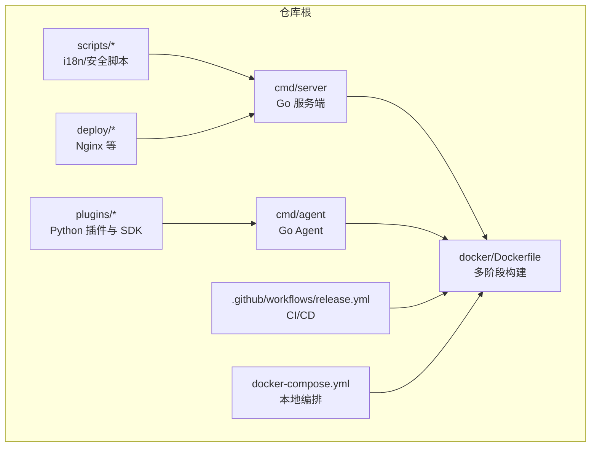
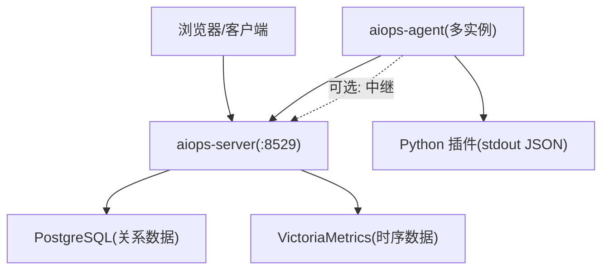
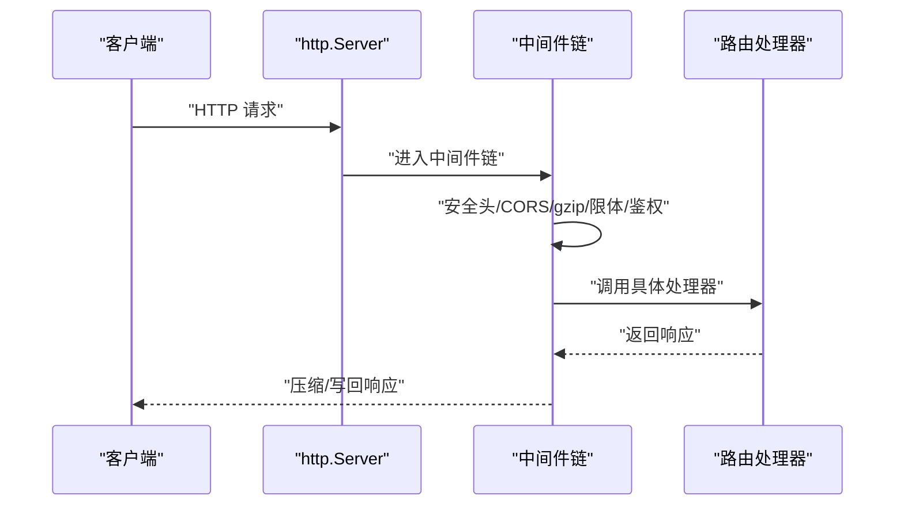
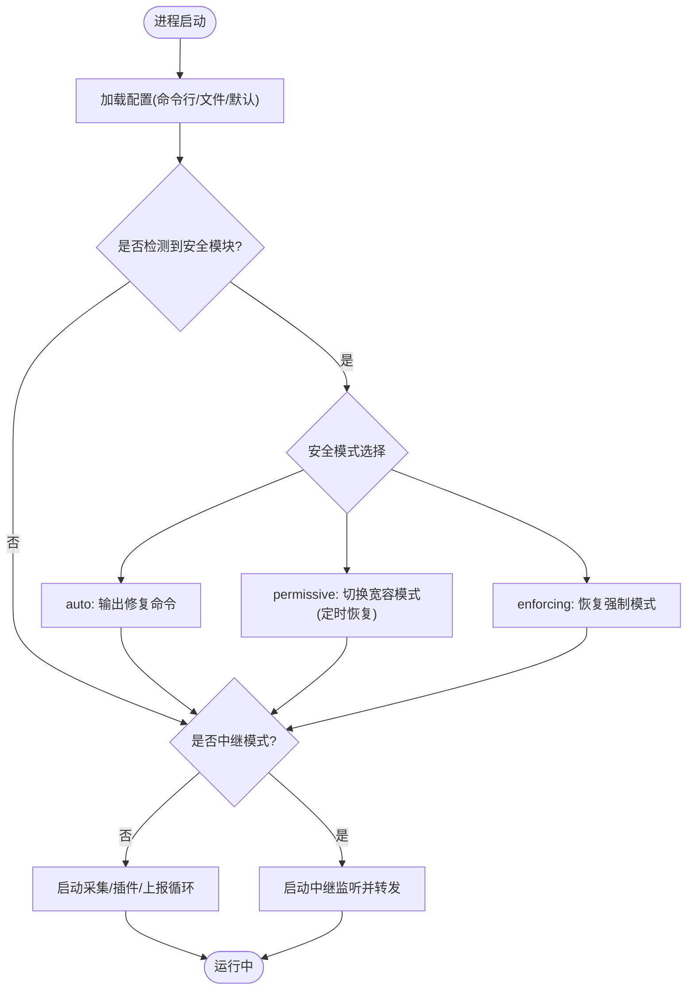
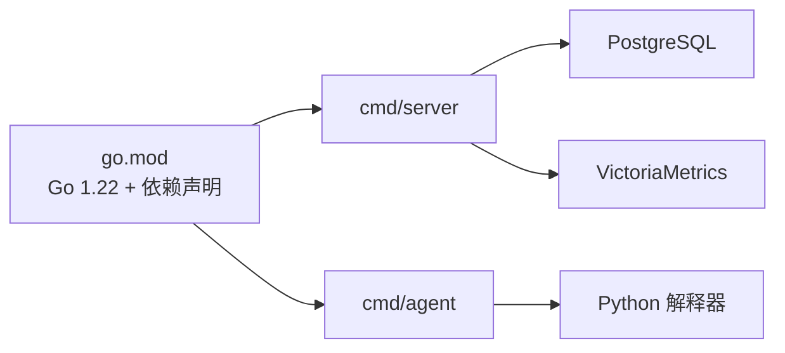

# 开发者指南

<cite>
**本文引用的文件**   
- [README.md](file://README.md)
- [go.mod](file://go.mod)
- [cmd/server/main.go](file://cmd/server/main.go)
- [cmd/agent/main.go](file://cmd/agent/main.go)
- [.github/workflows/release.yml](file://.github/workflows/release.yml)
- [docker-compose.yml](file://docker-compose.yml)
- [config.example.json](file://config.example.json)
- [server_config.example.json](file://server_config.example.json)
- [build.ps1](file://build.ps1)
</cite>

## 目录
1. [简介](#简介)
2. [项目结构](#项目结构)
3. [核心组件](#核心组件)
4. [架构总览](#架构总览)
5. [详细组件分析](#详细组件分析)
6. [依赖分析](#依赖分析)
7. [性能考虑](#性能考虑)
8. [故障排查指南](#故障排查指南)
9. [结论](#结论)
10. [附录](#附录)

## 简介
本指南面向贡献者与二次开发者，覆盖开发环境搭建、编码与提交规范、构建与测试策略、持续集成与发布流程、新功能开发与测试方法、工具链与效率技巧等。项目采用 Go 双二进制 C/S 架构：服务端提供 Web/API、告警、SRE 中枢、AI 巡检诊断、日志采集检索、端口转发与 HTTP 代理；Agent 负责跨平台指标采集、插件执行与日志上报。存储统一为 PostgreSQL（关系数据）+ VictoriaMetrics（时序数据）。

## 项目结构
- cmd/server：服务端入口与路由、中间件、鉴权、配置、告警、终端、转发、API 监控、SLO、AI 助手等
- cmd/agent：Agent 入口、采集器、插件运行器、中继模式、日志采集与加密上报
- docker：Dockerfile 多阶段构建（server/agent）
- .github/workflows：Release 工作流（多架构镜像构建与推送）
- scripts：国际化脚本与安全编排脚本
- plugins：Python 插件示例与 SDK
- deploy：部署辅助配置（如 Nginx）
- 根目录：配置文件示例、构建脚本、Docker Compose、文档

图表来源
- [cmd/server/main.go:1-355](file://cmd/server/main.go#L1-L355)
- [cmd/agent/main.go:1-238](file://cmd/agent/main.go#L1-L238)
- [.github/workflows/release.yml:1-130](file://.github/workflows/release.yml#L1-L130)
- [docker-compose.yml:1-144](file://docker-compose.yml#L1-L144)

章节来源
- [README.md:1-800](file://README.md#L1-L800)
- [docker-compose.yml:1-144](file://docker-compose.yml#L1-L144)

## 核心组件
- 服务端（aiops-server）
  - 启动参数与环境变量：监听地址、配置文件路径、dist 目录、TLS 证书/私钥、PostgreSQL DSN、VictoriaMetrics URL、密钥主密钥等
  - 中间件链：安全头 → CORS → gzip → 请求体大小限制 → 鉴权
  - 后台任务：告警评估、拨测、API 监控、剧本调度、SLO 评估、AI 巡检、VM 写入
  - 优雅关闭：信号处理、HTTP 服务停止、PG 状态刷新
- Agent（aiops-agent）
  - 配置优先级：命令行 > 配置文件 > 默认值
  - 功能：采集、插件执行、多服务端广播、中继模式、日志采集与加密上报、TLS 信任配置
  - 安全环境检测：麒麟 kysec / SELinux / AppArmor / firewalld / Defender / SIP 等提示与修复建议
- 存储与外部依赖
  - PostgreSQL：关系数据持久化（配置/用户/审计/事件/工单/会话）
  - VictoriaMetrics：时序数据（指标/趋势）
  - Python：插件执行（stdout JSON 协议）

章节来源
- [cmd/server/main.go:227-355](file://cmd/server/main.go#L227-L355)
- [cmd/agent/main.go:74-238](file://cmd/agent/main.go#L74-L238)
- [README.md:556-573](file://README.md#L556-L573)

## 架构总览
系统采用“双二进制 + 统一存储”的 C/S 架构。服务端通过环境变量强制要求 PG + VM，未配置则拒绝启动；Agent 支持多服务端广播与中继模式。前端 SPA 内嵌至服务端二进制，便于一键部署。

图表来源
- [cmd/server/main.go:255-272](file://cmd/server/main.go#L255-L272)
- [cmd/agent/main.go:210-227](file://cmd/agent/main.go#L210-L227)
- [docker-compose.yml:49-84](file://docker-compose.yml#L49-L84)

## 详细组件分析

### 服务端启动与中间件链
- 启动流程
  - 解析命令行参数与环境变量
  - 校验并连接 PostgreSQL（带重试窗口），失败则终止
  - 初始化配置存储、通知器、Server 实例
  - 启动后台协程：告警、拨测、API 监控、剧本调度、SLO、AI 巡检、VM 写入
  - 组装中间件链并启动 HTTP 服务（支持 TLS）
  - 优雅关闭：捕获信号、停止服务、刷新 PG 状态后退出
- 中间件职责
  - 安全头：防嗅探、点击劫持、CSP 等
  - CORS：按白名单或兼容模式设置
  - gzip：对文本/JSON 响应压缩，跳过 WS/代理/转发流式路径
  - 请求体限制：防止超大负载耗尽内存
  - 鉴权：基于 RBAC 的路由保护

图表来源
- [cmd/server/main.go:72-145](file://cmd/server/main.go#L72-L145)
- [cmd/server/main.go:186-205](file://cmd/server/main.go#L186-L205)
- [cmd/server/main.go:294-303](file://cmd/server/main.go#L294-L303)
- [cmd/server/main.go:305-323](file://cmd/server/main.go#L305-L323)

章节来源
- [cmd/server/main.go:227-355](file://cmd/server/main.go#L227-L355)

### Agent 启动与采集上报
- 配置加载顺序：命令行参数 > 配置文件 > 默认值
- 安全环境检测：输出 OS 发行版与安全模块状态，必要时给出修复命令或自动切换宽容模式
- 中继模式：作为网关反向代理到上游服务端，仅该机器需具备外网访问能力
- 多服务端广播：同时向多个服务端上报，采集一次、结果广播
- 日志采集：支持指定路径增量采集，可启用 gzip + AES-256-GCM 加密上报
- TLS 信任：支持跳过校验（仅自签/临时）或指定 CA 证书

图表来源
- [cmd/agent/main.go:74-124](file://cmd/agent/main.go#L74-L124)
- [cmd/agent/main.go:129-136](file://cmd/agent/main.go#L129-L136)
- [cmd/agent/main.go:142-208](file://cmd/agent/main.go#L142-L208)
- [cmd/agent/main.go:210-227](file://cmd/agent/main.go#L210-L227)

章节来源
- [cmd/agent/main.go:74-238](file://cmd/agent/main.go#L74-L238)

### 插件体系（Python）
- 插件以独立脚本形式存在，向 stdout 输出 JSON 对象
- Agent 周期性执行插件，崩溃/超时/坏 JSON 不影响核心
- 可通过 SDK 快速编写自定义指标与事件

章节来源
- [README.md:702-718](file://README.md#L702-L718)

### 远程终端与会话录制
- 基于 WebSocket 的全 TTY 终端，经 Agent 反向通道免开端口
- 支持多标签、只读旁观、命令审计、会话录制与回放
- 录制数据持久化到文件系统与 PG，重启不丢

章节来源
- [README.md:688-699](file://README.md#L688-L699)

### 端口转发与 HTTP 代理
- TCP/UDP 端口映射：支持范围批量转发，共享组 ID 整组启停
- HTTP 反向代理：无状态代理，支持 WebSocket 升级
- 监听地址与端口范围可通过环境变量覆盖

章节来源
- [README.md:627-685](file://README.md#L627-L685)
- [README.md:556-573](file://README.md#L556-L573)

## 依赖分析
- Go 版本与第三方依赖
  - Go 1.22+
  - 关键依赖：lib/pq（PostgreSQL）、二维码生成、PDF 生成等
- 运行时依赖
  - PostgreSQL（关系数据）
  - VictoriaMetrics（时序数据）
  - Python（插件执行）

图表来源
- [go.mod:1-10](file://go.mod#L1-L10)
- [cmd/server/main.go:255-272](file://cmd/server/main.go#L255-L272)
- [cmd/agent/main.go:44-62](file://cmd/agent/main.go#L44-L62)

章节来源
- [go.mod:1-10](file://go.mod#L1-L10)
- [README.md:556-573](file://README.md#L556-L573)

## 性能考虑
- 响应压缩：gzip 中间件复用 Writer 池，显著降低带宽占用（主机轮询场景尤为明显）
- 请求体限制：MaxBytesReader 防止超大负载导致内存膨胀
- 流式路径豁免：WebSocket、转发、代理路径不走缓冲压缩，避免阻塞
- 存储分离：关系与时序数据分别落库，读写互不干扰
- 并发任务：告警、拨测、API 监控、调度、SLO、AI 巡检、VM 写入并行运行

章节来源
- [cmd/server/main.go:147-205](file://cmd/server/main.go#L147-L205)
- [cmd/server/main.go:286-292](file://cmd/server/main.go#L286-L292)

## 故障排查指南
- 启动失败
  - 未配置 AIOPS_POSTGRES_DSN 或 AIOPS_VM_URL：服务端将拒绝启动
  - PostgreSQL 连接失败：有重试窗口，仍失败则终止
  - 未配置 TLS 证书：将以明文 HTTP 提供服务（生产建议启用 TLS 或置于 HTTPS 终止代理之后）
- 端口转发不可用
  - Docker 部署需设置 AIOPS_FORWARD_LISTEN=0.0.0.0，并确保端口范围映射一致
- Agent 无法上报
  - 检查 --server 或 servers 配置、Token、TLS 信任配置（CA 或跳过校验）
  - 安全模块拦截：根据日志提示调整 kysec/SELinux/AppArmor/firewalld/Defender/SIP
- 终端/转发/代理异常
  - 确认 WebSocket 升级头在反向代理正确透传
  - 检查防火墙与端口范围映射

章节来源
- [cmd/server/main.go:255-272](file://cmd/server/main.go#L255-L272)
- [cmd/server/main.go:341-351](file://cmd/server/main.go#L341-L351)
- [README.md:556-573](file://README.md#L556-L573)
- [cmd/agent/main.go:122-136](file://cmd/agent/main.go#L122-L136)
- [cmd/agent/main.go:142-208](file://cmd/agent/main.go#L142-L208)

## 结论
本项目以“双二进制 + 统一存储”为核心，兼顾易用性与可扩展性。通过完善的中间件、后台任务与插件体系，满足企业级主机监控与 SRE 运维需求。建议在贡献过程中遵循统一的构建与 CI 流程，完善测试覆盖，持续提升可维护性与稳定性。

## 附录

### 开发环境搭建
- 安装 Go 1.22+
- 克隆仓库并准备依赖
- 本地数据库与指标库
  - 使用 docker-compose 拉起 PostgreSQL 与 VictoriaMetrics
  - 或通过官方镜像单独部署
- 配置环境变量
  - AIOPS_POSTGRES_DSN、AIOPS_VM_URL、AIOPS_SECRET_KEY、AIOPS_TLS_CERT/AIOPS_TLS_KEY 等
- 首次运行
  - 直接运行服务端二进制或容器
  - 浏览器访问 :8529，完成安全初始化

章节来源
- [README.md:314-340](file://README.md#L314-L340)
- [README.md:556-573](file://README.md#L556-L573)
- [docker-compose.yml:49-84](file://docker-compose.yml#L49-L84)

### 依赖管理与 IDE 配置
- 依赖管理
  - go.mod 声明 Go 版本与依赖
  - 建议使用 go mod tidy 同步依赖
- IDE 建议
  - VS Code：Go 扩展、gopls、delve 调试
  - Goland：内置 Go 工具链与调试支持
  - 开启 go vet、静态检查与格式化

章节来源
- [go.mod:1-10](file://go.mod#L1-L10)

### 调试环境设置
- 服务端
  - 使用 delve 附加进程或启动时调试
  - 关注中间件链与后台任务日志
- Agent
  - 使用 --log-paths 指定日志路径进行验证
  - 使用 --security-mode 控制安全模块行为（auto/permissive/enforcing）
  - 使用 --tls-skip-verify 或 --ca-cert 配置 TLS 信任

章节来源
- [cmd/agent/main.go:105-112](file://cmd/agent/main.go#L105-L112)
- [cmd/agent/main.go:167-196](file://cmd/agent/main.go#L167-L196)

### 代码贡献规范
- 编码风格
  - 遵循 Go 惯用风格与命名约定
  - 平台特定代码使用 //go:build 标签分离
- 提交信息格式
  - 简洁明了，包含变更范围与动机
  - 涉及配置项变更需说明影响面
- 分支管理策略
  - 主干保护，特性分支开发，PR 合并前通过 CI
- 代码审查流程
  - 至少一名 reviewer 批准
  - 关注中间件、鉴权、存储、并发安全与错误处理

[本节为通用规范说明，无需源码引用]

### 构建流程
- 本地构建
  - Windows：powershell -File build.ps1（含交叉编译选项）
  - 手动：go build ./cmd/server ./cmd/agent
- 版本号注入
  - 通过 ldflags 注入 main.appVersion
- 产物
  - bin/aiops-server.exe、bin/aiops-agent.exe（Windows）
  - 交叉编译产物：linux/macOS

章节来源
- [build.ps1:1-56](file://build.ps1#L1-L56)
- [README.md:314-340](file://README.md#L314-L340)

### 测试策略
- 单元测试
  - 使用 go test 运行现有用例
  - 优先补充核心模块（store/auth/alerts/collector/ws）
- 集成测试
  - 启动 Server + Agent，验证上报→告警→通知链路
  - 验证终端/转发/代理端到端连通性
- 前端 JS 语法检查
  - 使用 node -c 检查关键脚本

章节来源
- [evaluation-report-v2.html:86-99](file://evaluation-report-v2.html#L86-L99)
- [evaluation-report.html:498-501](file://evaluation-report.html#L498-L501)

### 持续集成与发布流程
- 触发条件
  - 推送 v* 标签或手动触发 workflow_dispatch
- 步骤
  - 检出代码、解析版本
  - 设置 QEMU 与 Buildx
  - 生成 SWR 登录凭证并登录
  - 构建 server/agent 多架构镜像并推送
- 所需 Secrets
  - HW_ACCESS_KEY、HW_SECRET_KEY

章节来源
- [.github/workflows/release.yml:1-130](file://.github/workflows/release.yml#L1-L130)
- [README.md:227-251](file://README.md#L227-L251)

### 新功能开发指导
- 新增 API
  - 在对应处理器文件中注册路由，遵循鉴权与中间件链
  - 增加权限控制与输入校验
- 新增采集指标
  - 在平台特定采集器中添加指标解析与上报
  - 更新阈值配置与面板展示
- 新增插件
  - 在 plugins/ 下添加 Python 脚本，遵循 stdout JSON 协议
  - 使用 SDK 简化指标与事件输出

章节来源
- [README.md:702-718](file://README.md#L702-L718)
- [README.md:514-547](file://README.md#L514-L547)

### 配置参考
- Agent 配置示例
  - config.example.json
- 服务端配置示例
  - server_config.example.json
- 环境变量覆盖
  - AIOPS_POSTGRES_DSN、AIOPS_VM_URL、AIOPS_SECRET_KEY、AIOPS_TLS_CERT/AIOPS_TLS_KEY、AIOPS_FORWARD_*、AIOPS_RELAY_SECRET 等

章节来源
- [config.example.json:1-16](file://config.example.json#L1-L16)
- [server_config.example.json:1-36](file://server_config.example.json#L1-L36)
- [README.md:556-573](file://README.md#L556-L573)

### 工具链与效率提升技巧
- 构建脚本
  - build.ps1 自动注入版本号与交叉编译
- Docker Compose
  - 一键拉起全栈，支持本地构建与镜像拉取
- 日志与调试
  - 使用 slog 结构化日志，结合中间件与后台任务日志定位问题
- 安全加固
  - 启用 TLS、配置 CSP、限制请求体大小、RBAC 与 MFA

章节来源
- [build.ps1:1-56](file://build.ps1#L1-L56)
- [docker-compose.yml:1-144](file://docker-compose.yml#L1-L144)
- [cmd/server/main.go:113-145](file://cmd/server/main.go#L113-L145)