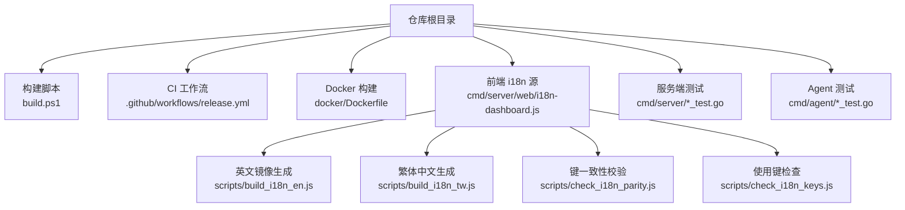
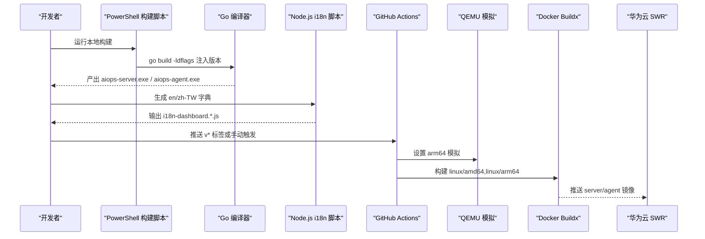
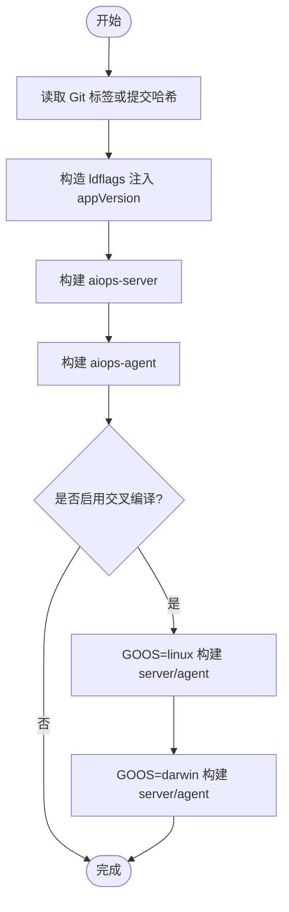
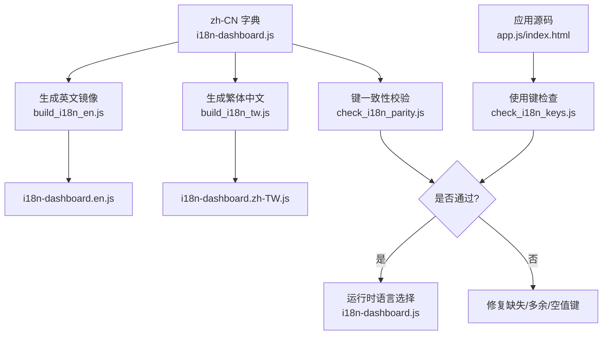
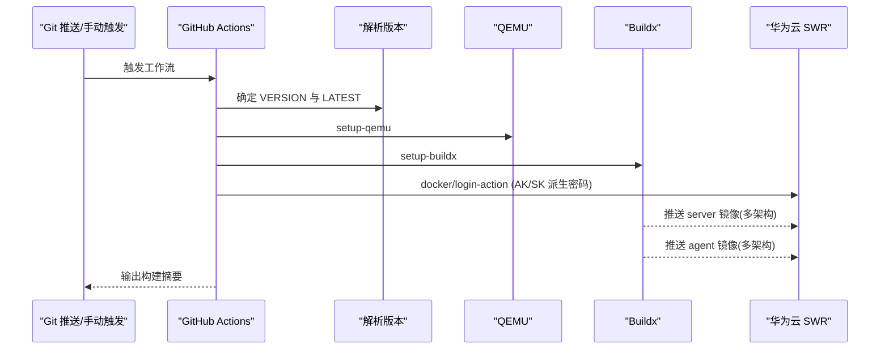
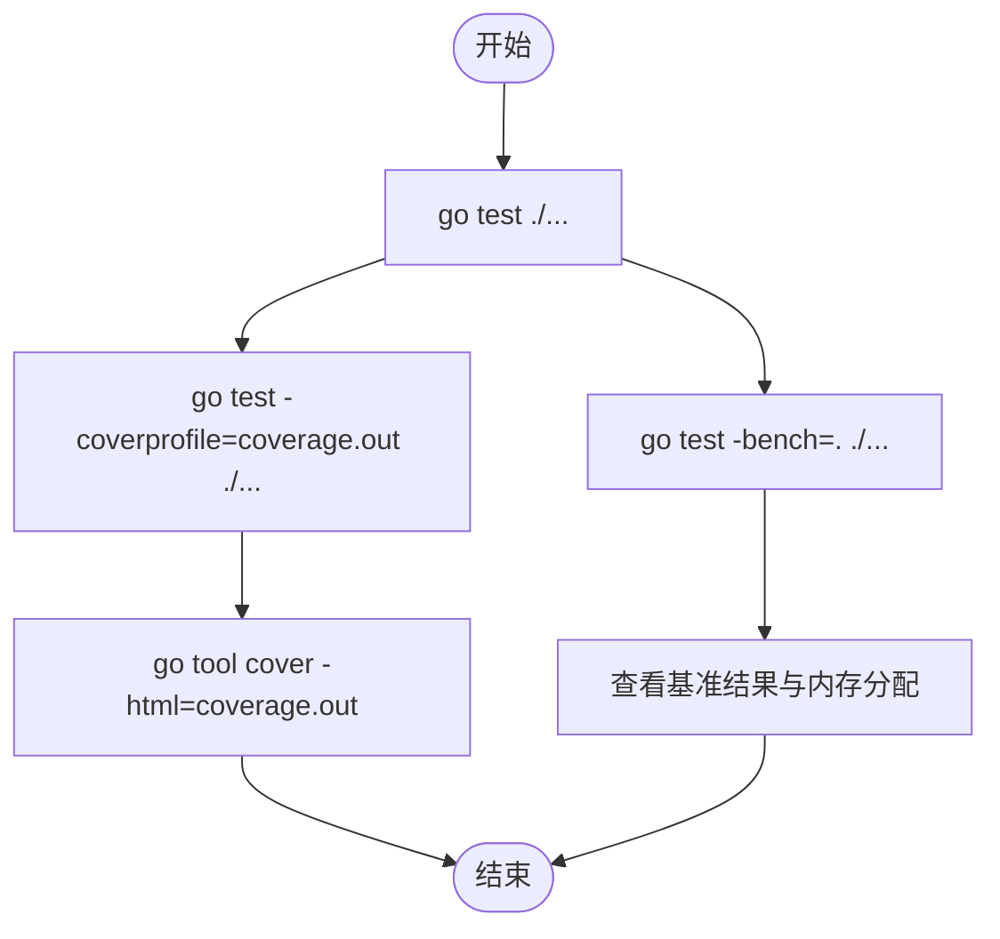
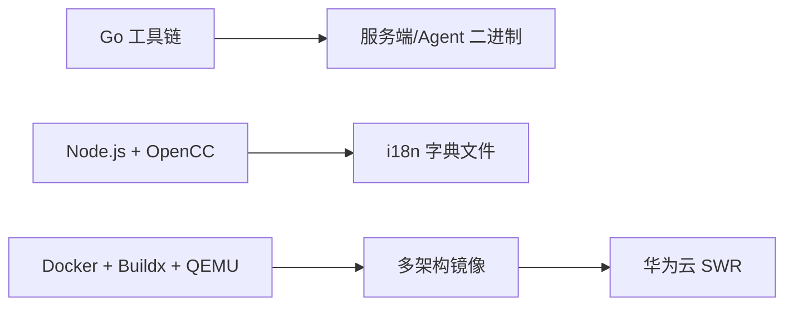

# 构建与测试

<cite>
**本文引用的文件**   
- [build.ps1](file://build.ps1)
- [release.yml](file://.github/workflows/release.yml)
- [Dockerfile](file://docker/Dockerfile)
- [i18n-dashboard.js](file://cmd/server/web/i18n-dashboard.js)
- [i18n-dashboard.en.js](file://cmd/server/web/i18n-dashboard.en.js)
- [i18n-dashboard.zh-TW.js](file://cmd/server/web/i18n-dashboard.zh-TW.js)
- [build_i18n_en.js](file://scripts/build_i18n_en.js)
- [build_i18n_tw.js](file://scripts/build_i18n_tw.js)
- [check_i18n_keys.js](file://scripts/check_i18n_keys.js)
- [check_i18n_parity.js](file://scripts/check_i18n_parity.js)
- [store_test.go](file://cmd/server/store_test.go)
- [auth_test.go](file://cmd/server/auth_test.go)
- [alerts_test.go](file://cmd/server/alerts_test.go)
- [agent_handshake_test.go](file://cmd/server/agent_handshake_test.go)
- [logcollect_test.go](file://cmd/agent/logcollect_test.go)
- [modules_test.go](file://cmd/agent/modules_test.go)
</cite>

## 目录
1. [简介](#简介)
2. [项目结构](#项目结构)
3. [核心组件](#核心组件)
4. [架构总览](#架构总览)
5. [详细组件分析](#详细组件分析)
6. [依赖关系分析](#依赖关系分析)
7. [性能考虑](#性能考虑)
8. [故障排查指南](#故障排查指南)
9. [结论](#结论)
10. [附录](#附录)

## 简介
本文件聚焦于项目的构建流程与测试策略，覆盖以下主题：
- 本地构建与交叉编译（PowerShell 脚本）
- 版本号注入机制（ldflags）
- 前端资源构建流程（国际化字典生成、静态资源打包）
- 测试体系（单元测试规范、集成测试方法、测试数据准备）
- 测试执行命令、覆盖率报告、性能基准
- 持续集成配置（GitHub Actions 工作流、触发条件、产物管理）

## 项目结构
与构建和测试相关的核心位置如下：
- 构建脚本：根目录 build.ps1
- 前端 i18n 资源与脚本：cmd/server/web 与 scripts
- CI 流水线：.github/workflows/release.yml
- Docker 多阶段构建：docker/Dockerfile
- 测试用例：cmd/server 与 cmd/agent 下的 *_test.go

**图表来源** 
- [build.ps1:1-56](file://build.ps1#L1-L56)
- [release.yml:1-130](file://.github/workflows/release.yml#L1-L130)
- [i18n-dashboard.js:1-1121](file://cmd/server/web/i18n-dashboard.js#L1-L1121)
- [build_i18n_en.js:1-114](file://scripts/build_i18n_en.js#L1-L114)
- [build_i18n_tw.js:1-82](file://scripts/build_i18n_tw.js#L1-L82)
- [check_i18n_keys.js:1-41](file://scripts/check_i18n_keys.js#L1-L41)
- [check_i18n_parity.js:1-52](file://scripts/check_i18n_parity.js#L1-L52)

**章节来源**
- [build.ps1:1-56](file://build.ps1#L1-L56)
- [release.yml:1-130](file://.github/workflows/release.yml#L1-L130)
- [i18n-dashboard.js:1-1121](file://cmd/server/web/i18n-dashboard.js#L1-L1121)
- [build_i18n_en.js:1-114](file://scripts/build_i18n_en.js#L1-L114)
- [build_i18n_tw.js:1-82](file://scripts/build_i18n_tw.js#L1-L82)
- [check_i18n_keys.js:1-41](file://scripts/check_i18n_keys.js#L1-L41)
- [check_i18n_parity.js:1-52](file://scripts/check_i18n_parity.js#L1-L52)

## 核心组件
- 本地构建脚本：负责获取 Git 版本、注入 ldflags、构建服务端与 Agent，并支持交叉编译。
- 前端 i18n 生成器：以 zh-CN 为权威源，自动生成 en 与 zh-TW 的字典文件，并提供键一致性与使用性检查。
- CI 流水线：在推送 v* 标签或手动触发时，构建多架构镜像并推送到华为云 SWR。
- 测试套件：覆盖服务端与 Agent 的核心逻辑，包含边界条件、端到端握手等。

**章节来源**
- [build.ps1:1-56](file://build.ps1#L1-L56)
- [build_i18n_en.js:1-114](file://scripts/build_i18n_en.js#L1-L114)
- [build_i18n_tw.js:1-82](file://scripts/build_i18n_tw.js#L1-L82)
- [check_i18n_keys.js:1-41](file://scripts/check_i18n_keys.js#L1-L41)
- [check_i18n_parity.js:1-52](file://scripts/check_i18n_parity.js#L1-L52)
- [release.yml:1-130](file://.github/workflows/release.yml#L1-L130)

## 架构总览
下图展示了从代码到制品的端到端路径：本地构建、前端 i18n 生成、CI 多架构镜像构建与推送。

**图表来源** 
- [build.ps1:1-56](file://build.ps1#L1-L56)
- [build_i18n_en.js:1-114](file://scripts/build_i18n_en.js#L1-L114)
- [build_i18n_tw.js:1-82](file://scripts/build_i18n_tw.js#L1-L82)
- [release.yml:1-130](file://.github/workflows/release.yml#L1-L130)

## 详细组件分析

### 本地构建与交叉编译（build.ps1）
- 功能要点
  - 自动获取最新 Git tag；若无 tag，则回退为 dev-短提交哈希或 dev。
  - 通过 -X main.appVersion=... 将版本号注入二进制。
  - 分别构建服务端与 Agent，输出至 bin 目录。
  - 可选参数 -CrossCompile 启用 GOOS/GOARCH 交叉编译，产出 Linux/macOS 目标。
- 使用方法
  - 本地构建：powershell -File build.ps1
  - 交叉编译：powershell -File build.ps1 -CrossCompile
- 注意事项
  - 需要安装 Go 工具链且 GOPATH/PATH 正确。
  - 交叉编译需确保目标平台工具链可用（Go 默认支持）。

**图表来源** 
- [build.ps1:1-56](file://build.ps1#L1-L56)

**章节来源**
- [build.ps1:1-56](file://build.ps1#L1-L56)

### 前端国际化资源构建流程
- 权威源
  - zh-CN 字典位于 i18n-dashboard.js，作为唯一事实来源。
- 生成规则
  - 英文镜像：scripts/build_i18n_en.js 基于 zh-CN 生成 i18n-dashboard.en.js，处理键重命名与人工修正映射。
  - 繁体中文：scripts/build_i18n_tw.js 基于 zh-CN 使用 OpenCC cn→twp 转换，并支持术语级修正。
- 一致性校验
  - check_i18n_parity.js：校验各语言字典键集合与空值情况，保证 parity。
  - check_i18n_keys.js：扫描 app.js 与 index.html 中使用的 key，确保在 zh-CN 与 en 中均存在。
- 运行时选择
  - i18n-dashboard.js 提供语言解析优先级：URL ?lang > Cookie > 默认 zh-CN，并在页面内动态切换，无需刷新。

**图表来源** 
- [i18n-dashboard.js:1-1121](file://cmd/server/web/i18n-dashboard.js#L1-L1121)
- [build_i18n_en.js:1-114](file://scripts/build_i18n_en.js#L1-L114)
- [build_i18n_tw.js:1-82](file://scripts/build_i18n_tw.js#L1-L82)
- [check_i18n_keys.js:1-41](file://scripts/check_i18n_keys.js#L1-L41)
- [check_i18n_parity.js:1-52](file://scripts/check_i18n_parity.js#L1-L52)

**章节来源**
- [i18n-dashboard.js:1-1121](file://cmd/server/web/i18n-dashboard.js#L1-L1121)
- [build_i18n_en.js:1-114](file://scripts/build_i18n_en.js#L1-L114)
- [build_i18n_tw.js:1-82](file://scripts/build_i18n_tw.js#L1-L82)
- [check_i18n_keys.js:1-41](file://scripts/check_i18n_keys.js#L1-L41)
- [check_i18n_parity.js:1-52](file://scripts/check_i18n_parity.js#L1-L52)

### 持续集成与制品发布（GitHub Actions）
- 触发条件
  - 推送 v* 标签自动触发；也支持 workflow_dispatch 手动触发并可指定 tag 与是否打 latest。
- 关键步骤
  - 解析版本与 latest 标记
  - 设置 QEMU 与 Docker Buildx
  - 生成 SWR 登录凭据（基于 AK/SK HMAC-SHA256）
  - 登录华为云 SWR
  - 构建并推送 server 与 agent 镜像（多架构 linux/amd64, linux/arm64）
  - 缓存利用（GHA cache）
- 产物管理
  - 镜像仓库：aiops-server 与 aiops-agent
  - 标签策略：v* 与可选 latest
  - 平台：多架构并行构建

**图表来源** 
- [release.yml:1-130](file://.github/workflows/release.yml#L1-L130)

**章节来源**
- [release.yml:1-130](file://.github/workflows/release.yml#L1-L130)

### 测试体系与执行策略
- 单元测试
  - 服务端：覆盖存储层、认证、告警评估、API 适配等。
  - Agent：日志采集、模块分发与参数校验等。
- 集成测试
  - 示例：Agent 与服务端握手、安装脚本健壮性等端到端场景。
- 测试数据准备
  - 表驱动测试、Mock 系统接口（如 /proc）、构造边界输入。
- 执行命令（通用）
  - 运行全部测试：go test ./...
  - 指定包：go test ./cmd/server/...
  - 指定函数：go test -run TestXXX ./cmd/server/...
  - 并发与超时：go test -p N -timeout T ./...
- 覆盖率报告
  - 生成覆盖率：go test -coverprofile=coverage.out ./...
  - 生成 HTML：go tool cover -html=coverage.out
- 性能基准
  - 使用 go test -bench=. 对热点函数进行基准测试，结合 -benchmem 统计内存分配。

**图表来源** 
- [store_test.go](file://cmd/server/store_test.go)
- [auth_test.go](file://cmd/server/auth_test.go)
- [alerts_test.go](file://cmd/server/alerts_test.go)
- [agent_handshake_test.go](file://cmd/server/agent_handshake_test.go)
- [logcollect_test.go](file://cmd/agent/logcollect_test.go)
- [modules_test.go](file://cmd/agent/modules_test.go)

**章节来源**
- [store_test.go](file://cmd/server/store_test.go)
- [auth_test.go](file://cmd/server/auth_test.go)
- [alerts_test.go](file://cmd/server/alerts_test.go)
- [agent_handshake_test.go](file://cmd/server/agent_handshake_test.go)
- [logcollect_test.go](file://cmd/agent/logcollect_test.go)
- [modules_test.go](file://cmd/agent/modules_test.go)

## 依赖关系分析
- 构建期依赖
  - Go 工具链：用于编译服务端与 Agent。
  - Node.js：用于 i18n 脚本执行（OpenCC 依赖由环境变量或 npm 包管理）。
  - Docker + Buildx + QEMU：CI 中用于多架构镜像构建。
- 运行时依赖
  - 浏览器：加载 i18n 字典与前端逻辑。
  - 华为云 SWR：CI 产物推送目标。

**图表来源** 
- [build.ps1:1-56](file://build.ps1#L1-L56)
- [build_i18n_tw.js:1-82](file://scripts/build_i18n_tw.js#L1-L82)
- [release.yml:1-130](file://.github/workflows/release.yml#L1-L130)

**章节来源**
- [build.ps1:1-56](file://build.ps1#L1-L56)
- [build_i18n_tw.js:1-82](file://scripts/build_i18n_tw.js#L1-L82)
- [release.yml:1-130](file://.github/workflows/release.yml#L1-L130)

## 性能考虑
- 构建优化
  - 使用 Go 模块缓存与 Docker Buildx 缓存减少重复构建时间。
  - 交叉编译按需启用，避免不必要的平台构建。
- 前端资源
  - i18n 字典生成仅在变更时执行，避免全量重建。
  - 运行时语言切换无刷新，降低用户交互开销。
- 测试与基准
  - 合理设置并发与超时，平衡速度与稳定性。
  - 基准测试聚焦热点路径，关注 CPU 与内存指标。

[本节为通用指导，不直接分析具体文件]

## 故障排查指南
- 构建失败
  - 检查 Go 环境、GOPATH/PATH、网络代理与模块下载。
  - 交叉编译失败时确认目标平台 GOOS/GOARCH 组合有效。
- i18n 不一致
  - 运行 check_i18n_parity.js 与 check_i18n_keys.js，定位缺失/多余/空值键。
  - 根据提示补充或修正对应字典项。
- CI 推送失败
  - 确认华为云 AK/SK Secret 配置正确。
  - 检查 SWR 仓库是否存在及权限。
  - 查看 GitHub Actions 日志中的登录与构建步骤错误。

**章节来源**
- [check_i18n_parity.js:1-52](file://scripts/check_i18n_parity.js#L1-L52)
- [check_i18n_keys.js:1-41](file://scripts/check_i18n_keys.js#L1-L41)
- [release.yml:1-130](file://.github/workflows/release.yml#L1-L130)

## 结论
本项目提供了完善的本地构建与 CI 流水线，支持跨平台构建与多架构镜像发布。前端国际化以 zh-CN 为权威源，配合自动化生成与校验脚本，保障多语言一致性。测试体系覆盖核心逻辑与端到端场景，建议持续提升覆盖率并引入基准测试以监控性能回归。

[本节为总结性内容，不直接分析具体文件]

## 附录
- 常用命令速查
  - 本地构建：powershell -File build.ps1
  - 交叉编译：powershell -File build.ps1 -CrossCompile
  - 运行测试：go test ./...
  - 覆盖率：go test -coverprofile=coverage.out ./... && go tool cover -html=coverage.out
  - 基准测试：go test -bench=. ./...
- 相关工件
  - 二进制：bin/aiops-server.exe、bin/aiops-agent.exe（Windows）
  - 镜像：aiops-server、aiops-agent（多架构）
  - 前端 i18n：i18n-dashboard.*.js

[本节为参考信息，不直接分析具体文件]