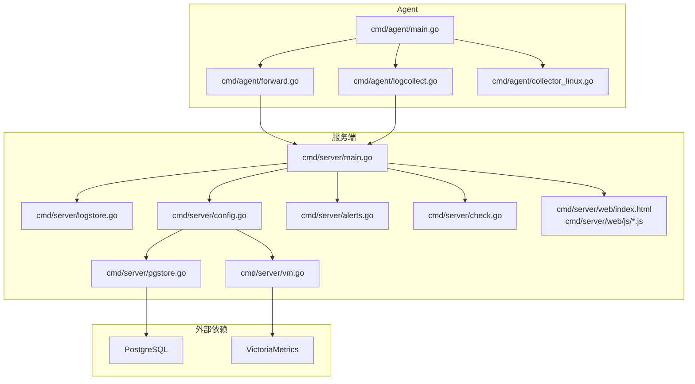
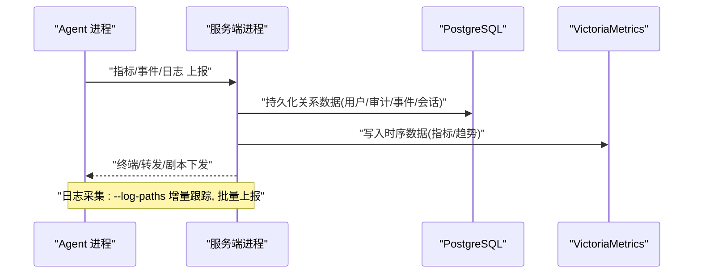
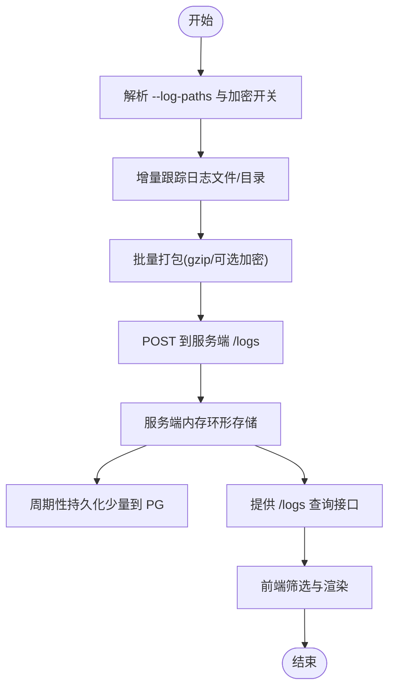
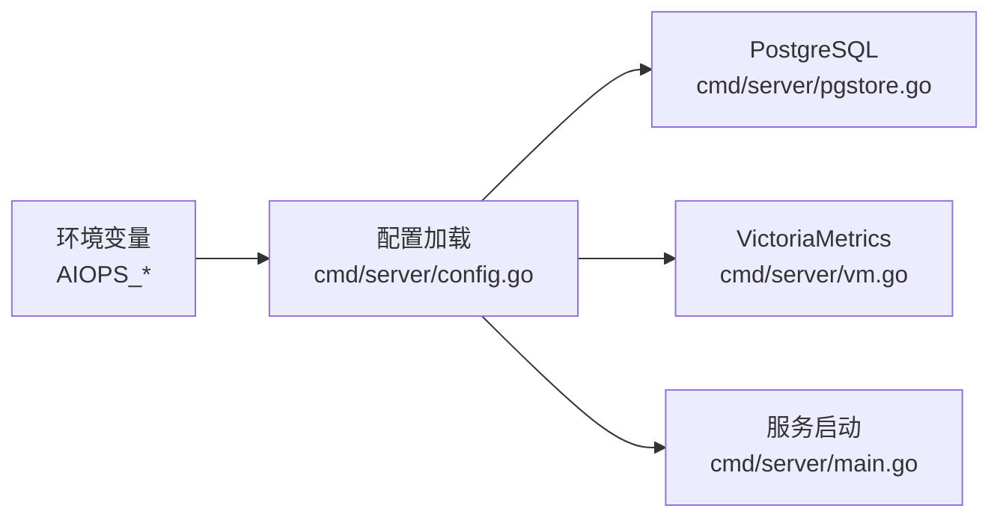

# 调试与问题诊断

<cite>
**本文引用的文件**   
- [cmd/server/main.go](file://cmd/server/main.go)
- [cmd/agent/main.go](file://cmd/agent/main.go)
- [config.example.json](file://config.example.json)
- [server_config.example.json](file://server_config.example.json)
- [cmd/server/logstore.go](file://cmd/server/logstore.go)
- [cmd/server/web/index.html](file://cmd/server/web/index.html)
- [cmd/server/web/js/core.js](file://cmd/server/web/js/core.js)
- [cmd/server/web/js/nav.js](file://cmd/server/web/js/nav.js)
- [cmd/server/web/js/sre.js](file://cmd/server/web/js/sre.js)
- [cmd/server/config.go](file://cmd/server/config.go)
- [cmd/server/pgstore.go](file://cmd/server/pgstore.go)
- [cmd/server/vm.go](file://cmd/server/vm.go)
- [cmd/server/alerts.go](file://cmd/server/alerts.go)
- [cmd/server/check.go](file://cmd/server/check.go)
- [cmd/server/sre_api.go](file://cmd/server/sre_api.go)
- [cmd/agent/forward.go](file://cmd/agent/forward.go)
- [cmd/agent/logcollect.go](file://cmd/agent/logcollect.go)
- [cmd/agent/collector_linux.go](file://cmd/agent/collector_linux.go)
- [docker-compose.yml](file://docker-compose.yml)
</cite>

## 目录
1. [简介](#简介)
2. [项目结构](#项目结构)
3. [核心组件](#核心组件)
4. [架构总览](#架构总览)
5. [详细组件分析](#详细组件分析)
6. [依赖关系分析](#依赖关系分析)
7. [性能与可观测性](#性能与可观测性)
8. [常见问题排查](#常见问题排查)
9. [日志分析方法](#日志分析方法)
10. [生产环境排障最佳实践](#生产环境排障最佳实践)
11. [结论](#结论)

## 简介
本指南聚焦于 AIOps Monitor 服务端与 Agent 的调试与问题诊断，覆盖启动参数、日志级别配置、调试模式启用方法；结合 Go 生态工具（delve、pprof）给出实操建议；并针对网络连接、数据库连接异常、权限配置等常见问题提供系统化排查流程。同时提供结构化日志解析、关键日志字段说明、日志聚合查询方法，以及生产环境应急处理流程。

## 项目结构
- 服务端入口与 HTTP 中间件、优雅关闭、TLS 启动逻辑位于 cmd/server/main.go
- Agent 入口、命令行参数、安全模块检测、中继模式位于 cmd/agent/main.go
- 日志采集与内存环形存储位于 cmd/server/logstore.go
- 前端日志筛选 UI 与交互逻辑位于 cmd/server/web/index.html、cmd/server/web/js/*.js
- 环境变量覆盖与存储后端初始化位于 cmd/server/config.go、cmd/server/pgstore.go、cmd/server/vm.go
- 告警阈值定义与拨测自检位于 cmd/server/alerts.go、cmd/server/check.go
- 转发通道与日志上报在 Agent 端实现：cmd/agent/forward.go、cmd/agent/logcollect.go
- 示例配置：config.example.json、server_config.example.json
- Docker Compose 中 PG/VM 环境变量注入：docker-compose.yml

图表来源
- [cmd/server/main.go:227-355](file://cmd/server/main.go#L227-L355)
- [cmd/agent/main.go:74-237](file://cmd/agent/main.go#L74-L237)
- [cmd/server/logstore.go:1-43](file://cmd/server/logstore.go#L1-L43)
- [cmd/server/config.go:617-623](file://cmd/server/config.go#L617-L623)
- [cmd/server/pgstore.go:16-32](file://cmd/server/pgstore.go#L16-L32)
- [cmd/server/vm.go:19](file://cmd/server/vm.go#L19)
- [cmd/server/alerts.go:10-58](file://cmd/server/alerts.go#L10-L58)
- [cmd/server/check.go:655-698](file://cmd/server/check.go#L655-L698)
- [cmd/agent/forward.go:55-183](file://cmd/agent/forward.go#L55-L183)
- [cmd/agent/logcollect.go:40](file://cmd/agent/logcollect.go#L40)
- [cmd/agent/collector_linux.go:76-92](file://cmd/agent/collector_linux.go#L76-L92)
- [cmd/server/web/index.html:408-422](file://cmd/server/web/index.html#L408-L422)
- [cmd/server/web/js/core.js:102-129](file://cmd/server/web/js/core.js#L102-L129)
- [cmd/server/web/js/nav.js:438-482](file://cmd/server/web/js/nav.js#L438-L482)
- [cmd/server/web/js/sre.js:994-1126](file://cmd/server/web/js/sre.js#L994-L1126)
- [docker-compose.yml:68-71](file://docker-compose.yml#L68-L71)

章节来源
- [cmd/server/main.go:227-355](file://cmd/server/main.go#L227-L355)
- [cmd/agent/main.go:74-237](file://cmd/agent/main.go#L74-L237)
- [cmd/server/logstore.go:1-43](file://cmd/server/logstore.go#L1-L43)
- [cmd/server/web/index.html:408-422](file://cmd/server/web/index.html#L408-L422)
- [cmd/server/web/js/core.js:102-129](file://cmd/server/web/js/core.js#L102-L129)
- [cmd/server/web/js/nav.js:438-482](file://cmd/server/web/js/nav.js#L438-L482)
- [cmd/server/web/js/sre.js:994-1126](file://cmd/server/web/js/sre.js#L994-L1126)
- [cmd/server/config.go:617-623](file://cmd/server/config.go#L617-L623)
- [cmd/server/pgstore.go:16-32](file://cmd/server/pgstore.go#L16-L32)
- [cmd/server/vm.go:19](file://cmd/server/vm.go#L19)
- [cmd/server/alerts.go:10-58](file://cmd/server/alerts.go#L10-L58)
- [cmd/server/check.go:655-698](file://cmd/server/check.go#L655-L698)
- [cmd/agent/forward.go:55-183](file://cmd/agent/forward.go#L55-L183)
- [cmd/agent/logcollect.go:40](file://cmd/agent/logcollect.go#L40)
- [cmd/agent/collector_linux.go:76-92](file://cmd/agent/collector_linux.go#L76-L92)
- [docker-compose.yml:68-71](file://docker-compose.yml#L68-L71)

## 核心组件
- 服务端主进程
  - 解析命令行参数、加载配置、初始化存储（PG + VM）、注册中间件与安全头、优雅关闭、TLS 监听
  - 默认日志级别为 Info，输出到标准错误
- Agent 主进程
  - 解析配置文件与命令行参数、安全模块检测与修复提示、中继模式、多服务端推送、日志采集与加密上报
  - 默认日志级别为 Info，输出到标准错误
- 日志采集与检索
  - Agent 增量采集指定路径日志，批量压缩上报；服务端内存环形存储，支持按主机/级别/关键字/时间检索
- 告警与拨测
  - 内置阈值模型与拨测自检，生成告警事件
- 前端日志界面
  - 提供级别、时间范围、分页、搜索等交互能力

章节来源
- [cmd/server/main.go:227-355](file://cmd/server/main.go#L227-L355)
- [cmd/agent/main.go:74-237](file://cmd/agent/main.go#L74-L237)
- [cmd/server/logstore.go:1-43](file://cmd/server/logstore.go#L1-L43)
- [cmd/server/alerts.go:10-58](file://cmd/server/alerts.go#L10-L58)
- [cmd/server/check.go:655-698](file://cmd/server/check.go#L655-L698)
- [cmd/server/web/index.html:408-422](file://cmd/server/web/index.html#L408-L422)
- [cmd/server/web/js/core.js:102-129](file://cmd/server/web/js/core.js#L102-L129)
- [cmd/server/web/js/nav.js:438-482](file://cmd/server/web/js/nav.js#L438-L482)
- [cmd/server/web/js/sre.js:994-1126](file://cmd/server/web/js/sre.js#L994-L1126)

## 架构总览
下图展示服务端与 Agent 的关键交互、存储与日志流。

图表来源
- [cmd/server/main.go:227-355](file://cmd/server/main.go#L227-L355)
- [cmd/agent/main.go:74-237](file://cmd/agent/main.go#L74-L237)
- [cmd/server/logstore.go:1-43](file://cmd/server/logstore.go#L1-L43)
- [cmd/server/pgstore.go:16-32](file://cmd/server/pgstore.go#L16-L32)
- [cmd/server/vm.go:19](file://cmd/server/vm.go#L19)

## 详细组件分析

### 服务端启动与调试要点
- 启动参数
  - -addr：监听地址
  - -config：配置文件路径
  - -dist：Agent 下载目录
  - -reset-admin / -reset-admin-api：管理员密码重置辅助
- 日志级别
  - 使用 slog 文本处理器，默认 LevelInfo，输出至标准错误
- 存储依赖
  - 强制要求 AIOPS_POSTGRES_DSN 与 AIOPS_VM_URL 环境变量，缺失则拒绝启动
  - 连接 PG 带重试窗口，失败后终止
- TLS
  - 通过 AIOPS_TLS_CERT/AIOPS_TLS_KEY 启用 HTTPS；未配置时以明文 HTTP 运行并警告
- 优雅关闭
  - 捕获 SIGINT/SIGTERM，停止接受新连接，等待请求完成，刷新 PG 状态后退出

章节来源
- [cmd/server/main.go:227-355](file://cmd/server/main.go#L227-L355)
- [cmd/server/config.go:617-623](file://cmd/server/config.go#L617-L623)
- [cmd/server/pgstore.go:16-32](file://cmd/server/pgstore.go#L16-L32)

### Agent 启动与调试要点
- 启动参数
  - --server：服务端地址
  - --interval / --plugin-interval：上报与插件周期
  - --plugins-dir / --python：插件目录与解释器
  - --disk-path / --category / --token：磁盘路径、分类、安装 Token
  - --relay / --listen / --relay-secret：网关中继模式
  - --config：配置文件路径
  - --log-paths：逗号分隔的日志文件或目录
  - --log-encrypt：是否开启日志加密上报（默认开启）
  - --tls-skip-verify / --ca-cert：服务端证书校验策略
  - --security-mode：安全模块模式（auto/permissive/enforcing）
- 日志级别
  - 使用 slog 文本处理器，默认 LevelInfo，输出至标准错误
- 安全与环境
  - 启动时检测麒麟 kysec、SELinux、AppArmor、firewalld、Defender、SIP 等，输出诊断与建议命令
  - 主动检查 /proc 访问受限情况并告警
- 中继模式
  - 作为内网网关反向代理所有请求到云端监控中心

章节来源
- [cmd/agent/main.go:74-237](file://cmd/agent/main.go#L74-L237)
- [cmd/agent/forward.go:55-183](file://cmd/agent/forward.go#L55-L183)
- [cmd/agent/logcollect.go:40](file://cmd/agent/logcollect.go#L40)
- [cmd/agent/collector_linux.go:76-92](file://cmd/agent/collector_linux.go#L76-L92)

### 日志采集与检索
- Agent 侧
  - 通过 --log-paths 指定采集源，增量跟踪，批量上报，支持 gzip+AES-256-GCM 加密
- 服务端侧
  - 内存环形存储，限制容量，周期性持久化少量最近日志到 PG
  - 提供 API 供前端按 host_id、level、since_min、q 分页检索
- 前端交互
  - 提供级别、时间范围、分页、搜索等控件，渲染统计面板与结果列表

图表来源
- [cmd/agent/logcollect.go:40](file://cmd/agent/logcollect.go#L40)
- [cmd/server/logstore.go:1-43](file://cmd/server/logstore.go#L1-L43)
- [cmd/server/web/index.html:408-422](file://cmd/server/web/index.html#L408-L422)
- [cmd/server/web/js/sre.js:994-1126](file://cmd/server/web/js/sre.js#L994-L1126)

章节来源
- [cmd/agent/logcollect.go:40](file://cmd/agent/logcollect.go#L40)
- [cmd/server/logstore.go:1-43](file://cmd/server/logstore.go#L1-L43)
- [cmd/server/web/index.html:408-422](file://cmd/server/web/index.html#L408-L422)
- [cmd/server/web/js/core.js:102-129](file://cmd/server/web/js/core.js#L102-L129)
- [cmd/server/web/js/nav.js:438-482](file://cmd/server/web/js/nav.js#L438-L482)
- [cmd/server/web/js/sre.js:994-1126](file://cmd/server/web/js/sre.js#L994-L1126)

### 告警与拨测自检
- 阈值模型
  - 包含 CPU/内存/磁盘/IO/IOPS/GPU/负载/进程变化/离线判定，以及拨测 Ping/TCP/HTTP/进程存活、API 业务监控、编排任务、端口转发等多维度阈值
- 拨测自检
  - 内置自检项，失败时生成 critical 级别告警
  - 进程存活检查基于 Agent 上报的进程名集合进行子串匹配

章节来源
- [cmd/server/alerts.go:10-58](file://cmd/server/alerts.go#L10-L58)
- [cmd/server/check.go:655-698](file://cmd/server/check.go#L655-L698)

## 依赖关系分析
- 环境变量优先级
  - 环境变量 > server_config.json 文件 > 默认值
  - 关键环境变量：AIOPS_POSTGRES_DSN、AIOPS_VM_URL、AIOPS_SECRET_KEY、AIOPS_TLS_CERT/AIOPS_TLS_KEY、AIOPS_FORWARD_*、AIOPS_TERMINAL_DISABLED、AIOPS_ALLOW_ANONYMOUS_AGENTS、AIOPS_TRUST_PROXY、AIOPS_REQUIRE_TOKEN
- 存储后端
  - 统一 PostgreSQL（关系数据）+ VictoriaMetrics（时序数据），缺少任一将拒绝启动
- Docker Compose 注入
  - 通过 docker-compose.yml 设置 AIOPS_VM_URL 与 AIOPS_POSTGRES_DSN

图表来源
- [cmd/server/config.go:617-623](file://cmd/server/config.go#L617-L623)
- [cmd/server/pgstore.go:16-32](file://cmd/server/pgstore.go#L16-L32)
- [cmd/server/vm.go:19](file://cmd/server/vm.go#L19)
- [cmd/server/main.go:227-355](file://cmd/server/main.go#L227-L355)
- [docker-compose.yml:68-71](file://docker-compose.yml#L68-L71)

章节来源
- [cmd/server/config.go:617-623](file://cmd/server/config.go#L617-L623)
- [cmd/server/pgstore.go:16-32](file://cmd/server/pgstore.go#L16-L32)
- [cmd/server/vm.go:19](file://cmd/server/vm.go#L19)
- [cmd/server/main.go:227-355](file://cmd/server/main.go#L227-L355)
- [docker-compose.yml:68-71](file://docker-compose.yml#L68-L71)

## 性能与可观测性
- 响应压缩
  - 服务端对非 WebSocket/代理/转发的文本/JSON 响应启用 gzip，减少带宽占用
- 请求体限制
  - 全局 MaxBytesReader 限制请求体大小，防止内存耗尽
- 安全头
  - 统一添加 X-Content-Type-Options、X-Frame-Options、Referrer-Policy、CSP 等
- 优雅关闭
  - 收到停止信号后，停止接受新连接，等待活跃请求完成，刷新 PG 状态后退出

章节来源
- [cmd/server/main.go:147-205](file://cmd/server/main.go#L147-L205)
- [cmd/server/main.go:104-146](file://cmd/server/main.go#L104-L146)
- [cmd/server/main.go:113-136](file://cmd/server/main.go#L113-L136)
- [cmd/server/main.go:305-324](file://cmd/server/main.go#L305-L324)

## 常见问题排查

### 网络连接问题（Agent ↔ 服务端）
- 现象
  - Agent 无法连接服务端、转发通道未就绪、目标连接失败或超时
- 定位步骤
  - 查看 Agent 启动日志，确认已加载配置、TLS 信任策略、中继模式是否正确
  - 检查 --server 地址可达性与防火墙规则
  - 若启用自签名证书，确认 --tls-skip-verify 或 --ca-cert 配置正确
  - 转发通道相关日志包括“未启用”“目标连接失败”“会话超时”等
- 参考日志位置
  - Agent 启动与 TLS 配置：[cmd/agent/main.go:74-124](file://cmd/agent/main.go#L74-L124)
  - 转发通道日志：[cmd/agent/forward.go:55-183](file://cmd/agent/forward.go#L55-L183)

章节来源
- [cmd/agent/main.go:74-124](file://cmd/agent/main.go#L74-L124)
- [cmd/agent/forward.go:55-183](file://cmd/agent/forward.go#L55-L183)

### 数据库连接异常（PostgreSQL）
- 现象
  - 服务端启动失败，提示未配置 DSN 或连接失败
- 定位步骤
  - 确认 AIOPS_POSTGRES_DSN 已设置且格式正确
  - 检查网络连通性与认证信息
  - 观察启动重试日志，超过重试次数后终止
- 参考位置
  - 环境变量读取与启动校验：[cmd/server/main.go:254-266](file://cmd/server/main.go#L254-L266)
  - PG 连接封装：[cmd/server/pgstore.go:16-32](file://cmd/server/pgstore.go#L16-L32)

章节来源
- [cmd/server/main.go:254-266](file://cmd/server/main.go#L254-L266)
- [cmd/server/pgstore.go:16-32](file://cmd/server/pgstore.go#L16-L32)

### 权限配置错误（Agent 数据采集受限）
- 现象
  - 部分 /proc 路径无法读取，数据采集不完整
- 定位步骤
  - 查看 Agent 启动时的安全模块检测与 /proc 访问检查结果
  - 根据提示以 root 身份运行或配置安全模块白名单
- 参考位置
  - 安全模块检测与 /proc 检查：[cmd/agent/main.go:145-208](file://cmd/agent/main.go#L145-L208)
  - Linux 采集器权限错误记录：[cmd/agent/collector_linux.go:76-92](file://cmd/agent/collector_linux.go#L76-L92)

章节来源
- [cmd/agent/main.go:145-208](file://cmd/agent/main.go#L145-L208)
- [cmd/agent/collector_linux.go:76-92](file://cmd/agent/collector_linux.go#L76-L92)

### 日志采集未生效
- 现象
  - 前端日志页面无数据或提示未被控端配置 --log-paths
- 定位步骤
  - 确认 Agent 是否以 --log-paths 指定了正确的文件或目录
  - 检查 Agent 日志中“日志采集已启用”条目
  - 服务端内存存储容量有限，重启后仅保留少量最近日志
- 参考位置
  - Agent 日志采集启用日志：[cmd/agent/logcollect.go:40](file://cmd/agent/logcollect.go#L40)
  - 服务端日志存储与持久化策略：[cmd/server/logstore.go:1-43](file://cmd/server/logstore.go#L1-L43)
  - 前端提示信息：[cmd/server/web/js/sre.js:1008](file://cmd/server/web/js/sre.js#L1008-L1008)

章节来源
- [cmd/agent/logcollect.go:40](file://cmd/agent/logcollect.go#L40)
- [cmd/server/logstore.go:1-43](file://cmd/server/logstore.go#L1-L43)
- [cmd/server/web/js/sre.js:994-1126](file://cmd/server/web/js/sre.js#L994-L1126)

### 拨测与进程存活检查异常
- 现象
  - 进程存活检查失败或拨测指标异常
- 定位步骤
  - 确认 Agent 上报的进程名集合是否包含目标进程（不区分大小写子串匹配）
  - 检查拨测阈值配置与网络连通性
- 参考位置
  - 进程存活匹配逻辑：[cmd/server/check.go:655-666](file://cmd/server/check.go#L655-L666)
  - 阈值模型定义：[cmd/server/alerts.go:10-58](file://cmd/server/alerts.go#L10-L58)

章节来源
- [cmd/server/check.go:655-666](file://cmd/server/check.go#L655-L666)
- [cmd/server/alerts.go:10-58](file://cmd/server/alerts.go#L10-L58)

## 日志分析方法

### 结构化日志解析
- 服务端与 Agent 均使用 slog 文本处理器，默认输出到标准错误
- 关键日志字段
  - ts：时间戳
  - host_id：主机标识
  - hostname：主机名
  - source：日志来源
  - level：级别（info/warn/error/critical）
  - message：消息内容
- 建议
  - 在生产环境收集标准错误输出，按进程与主机维度归档
  - 结合时间范围与关键字快速定位问题

章节来源
- [cmd/server/main.go:245-246](file://cmd/server/main.go#L245-L246)
- [cmd/agent/main.go:74-76](file://cmd/agent/main.go#L74-L76)
- [cmd/server/logstore.go:22-29](file://cmd/server/logstore.go#L22-L29)

### 关键日志字段说明
- 存储与启动
  - “PostgreSQL 已连接”“配置密钥落库加密已启用”“未配置 TLS”等
- Agent 启动
  - “已加载配置文件”“检测到操作系统”“安全模块切换/恢复”“部分 /proc 路径无法读取”
- 转发与会话
  - “转发通道未启用”“转发会话开始/结束”“目标连接失败/超时”
- 日志采集
  - “日志采集已启用”

章节来源
- [cmd/server/main.go:266-351](file://cmd/server/main.go#L266-L351)
- [cmd/agent/main.go:87-208](file://cmd/agent/main.go#L87-L208)
- [cmd/agent/forward.go:55-183](file://cmd/agent/forward.go#L55-L183)
- [cmd/agent/logcollect.go:40](file://cmd/agent/logcollect.go#L40)

### 日志聚合查询
- 前端筛选
  - 级别筛选：全部/严重/警告/信息
  - 时间范围：全部/最近1小时/最近6小时/最近24小时
  - 分页：每页条数选择与翻页
  - 关键字搜索：按 message 内容过滤
- 查询参数
  - host、level、since_min、q、page、page_size
- 参考位置
  - 前端控件与交互：[cmd/server/web/index.html:408-422](file://cmd/server/web/index.html#L408-L422)、[cmd/server/web/js/nav.js:438-482](file://cmd/server/web/js/nav.js#L438-L482)
  - 查询构建与渲染：[cmd/server/web/js/sre.js:994-1126](file://cmd/server/web/js/sre.js#L994-L1126)

章节来源
- [cmd/server/web/index.html:408-422](file://cmd/server/web/index.html#L408-L422)
- [cmd/server/web/js/nav.js:438-482](file://cmd/server/web/js/nav.js#L438-L482)
- [cmd/server/web/js/sre.js:994-1126](file://cmd/server/web/js/sre.js#L994-L1126)

## 生产环境排障最佳实践
- 启动前检查清单
  - 确认 AIOPS_POSTGRES_DSN 与 AIOPS_VM_URL 已配置
  - 确认 AIOPS_TLS_CERT/AIOPS_TLS_KEY 已配置或在反向代理后运行
  - 确认 Agent 的 --server 地址与证书策略正确
- 运行时监控
  - 关注“PostgreSQL 连接未就绪，重试中…”、“未配置 TLS”等关键日志
  - 关注 Agent 安全模块检测与 /proc 访问受限提示
- 应急响应
  - 使用优雅关闭流程避免数据丢失
  - 通过管理员密码重置辅助功能恢复账户访问
  - 临时放宽安全策略（如 permissive 模式）并设置自动恢复

章节来源
- [cmd/server/main.go:254-266](file://cmd/server/main.go#L254-L266)
- [cmd/server/main.go:305-324](file://cmd/server/main.go#L305-L324)
- [cmd/agent/main.go:168-196](file://cmd/agent/main.go#L168-L196)

## 结论
通过对服务端与 Agent 的启动参数、日志级别、调试模式与关键日志的分析，结合存储依赖、转发通道与日志采集链路，可以系统性地定位与解决常见故障。建议在部署阶段完善环境变量与证书配置，在运行期关注关键日志与阈值告警，并在生产环境中遵循优雅关闭与最小权限原则，确保稳定性与可观测性。