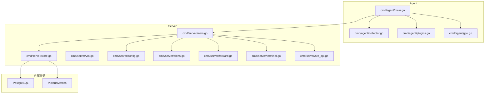
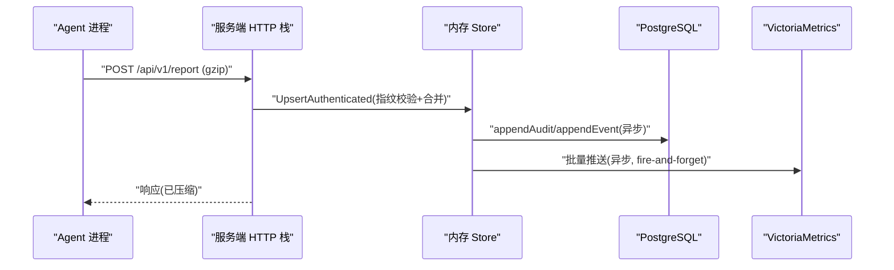
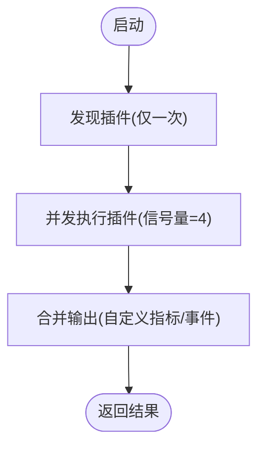
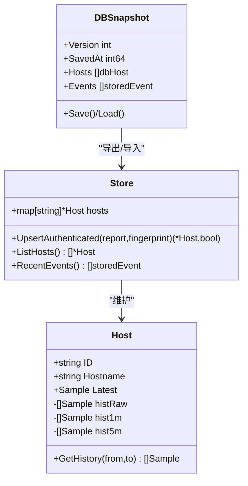
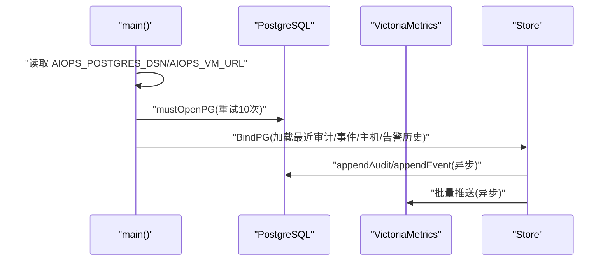
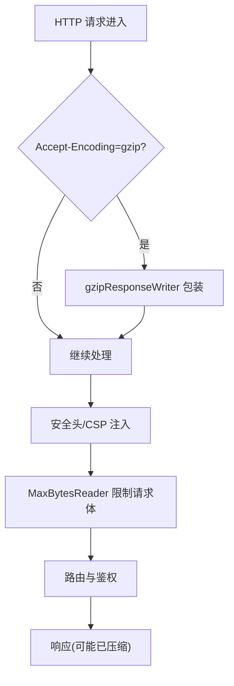
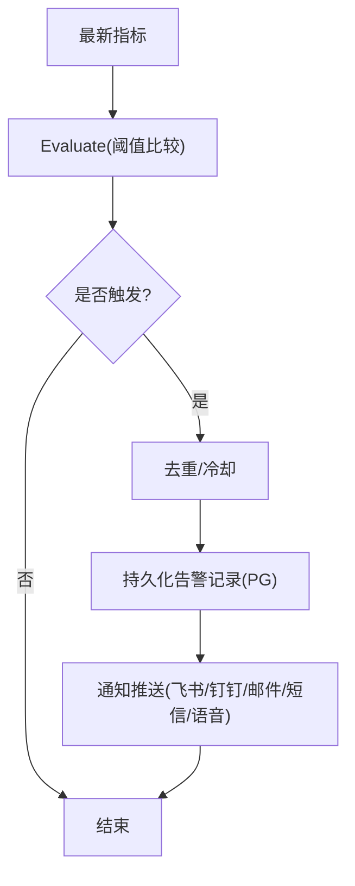
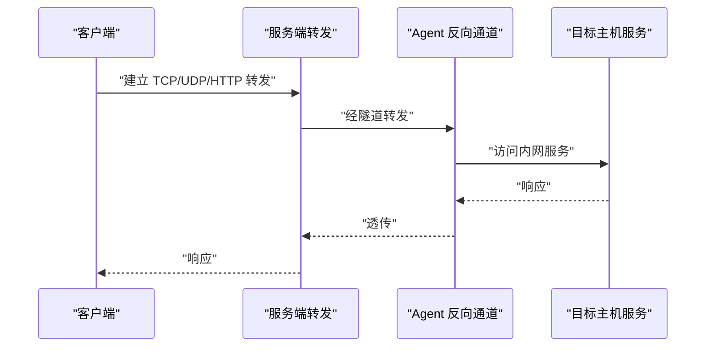
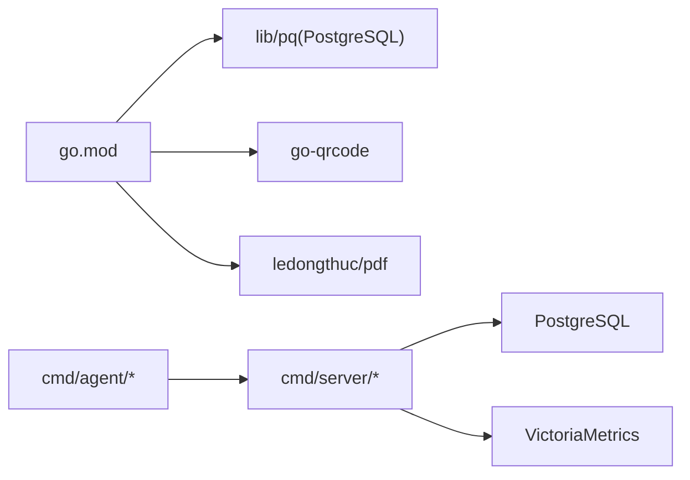

# 性能优化

<cite>
**本文引用的文件**   
- [README.md](file://README.md)
- [go.mod](file://go.mod)
- [cmd/server/main.go](file://cmd/server/main.go)
- [cmd/agent/main.go](file://cmd/agent/main.go)
- [cmd/server/store.go](file://cmd/server/store.go)
- [cmd/server/db.go](file://cmd/server/db.go)
- [cmd/server/vm.go](file://cmd/server/vm.go)
- [cmd/server/config.go](file://cmd/server/config.go)
- [cmd/server/alerts.go](file://cmd/server/alerts.go)
- [cmd/server/forward.go](file://cmd/server/forward.go)
- [cmd/server/terminal.go](file://cmd/server/terminal.go)
- [cmd/server/sre_api.go](file://cmd/server/sre_api.go)
- [cmd/agent/collector.go](file://cmd/agent/collector.go)
- [cmd/agent/plugins.go](file://cmd/agent/plugins.go)
- [cmd/agent/gpu.go](file://cmd/agent/gpu.go)
- [shared/wire.go](file://shared/wire.go)
</cite>

## 目录
1. [引言](#引言)
2. [项目结构](#项目结构)
3. [核心组件](#核心组件)
4. [架构总览](#架构总览)
5. [详细组件分析](#详细组件分析)
6. [依赖分析](#依赖分析)
7. [性能考虑](#性能考虑)
8. [故障排查指南](#故障排查指南)
9. [结论](#结论)
10. [附录](#附录)

## 引言
本指南聚焦于 AIOps Monitor 的性能优化，覆盖并发处理、内存管理、数据库与存储优化、网络传输优化、监控指标与瓶颈分析方法、容量规划与扩容策略。文档基于仓库源码与配置说明，提供可落地的调优建议与可视化图示，帮助在不同规模部署下获得稳定高效的运行表现。

## 项目结构
系统由服务端（Go）与 Agent（Go）组成，采用“统一存储”的架构：关系数据持久化到 PostgreSQL，时序数据写入 VictoriaMetrics；同时保留内存中的多级降采样历史用于内置面板展示。Agent 负责采集与上报，服务端负责接收、聚合、告警、存储与对外服务。

图表来源
- [cmd/server/main.go:227-355](file://cmd/server/main.go#L227-L355)
- [cmd/agent/main.go:74-238](file://cmd/agent/main.go#L74-L238)
- [cmd/server/store.go:92-146](file://cmd/server/store.go#L92-L146)
- [cmd/server/vm.go:1-40](file://cmd/server/vm.go#L1-L40)

章节来源
- [README.md:1096-1118](file://README.md#L1096-L1118)
- [cmd/server/main.go:227-355](file://cmd/server/main.go#L227-L355)
- [cmd/agent/main.go:74-238](file://cmd/agent/main.go#L74-L238)

## 核心组件
- 服务端 HTTP 栈与中间件：安全头、CORS、gzip 压缩、请求体大小限制、认证、优雅关闭等。
- 存储层：内存 Store（多级降采样历史）、PostgreSQL（关系数据与审计日志）、VictoriaMetrics（时序数据）。
- Agent 采集与插件：原生采集器、Python 插件并发执行、GPU 缓存。
- 告警与治理：阈值评估、静默/抑制/路由、SLO 与自动修复。
- 转发与终端：TCP/UDP/HTTP 转发、WebSocket 终端会话录制与审计。

章节来源
- [cmd/server/main.go:72-205](file://cmd/server/main.go#L72-L205)
- [cmd/server/store.go:92-146](file://cmd/server/store.go#L92-L146)
- [cmd/server/vm.go:1-40](file://cmd/server/vm.go#L1-L40)
- [cmd/agent/plugins.go:102-147](file://cmd/agent/plugins.go#L102-L147)
- [cmd/agent/gpu.go:14-37](file://cmd/agent/gpu.go#L14-L37)
- [cmd/server/alerts.go:1-34](file://cmd/server/alerts.go#L1-L34)
- [cmd/server/forward.go:609-641](file://cmd/server/forward.go#L609-L641)
- [cmd/server/terminal.go:330-369](file://cmd/server/terminal.go#L330-L369)

## 架构总览
下图展示了从 Agent 采集到服务端处理、存储与对外服务的完整链路，以及关键性能点（压缩、并发、缓存、异步写入）。

图表来源
- [cmd/server/main.go:294-303](file://cmd/server/main.go#L294-L303)
- [cmd/server/store.go:230-340](file://cmd/server/store.go#L230-L340)
- [cmd/server/vm.go:1-40](file://cmd/server/vm.go#L1-L40)

## 详细组件分析

### 并发处理与资源控制
- 插件并发上限：通过信号量限制 Python 插件子进程并发数，避免 CPU/内存尖峰。
- GPU 采集缓存：对昂贵的外部工具调用进行 TTL 缓存，降低周期开销。
- 告警与记忆任务并发保护：使用信号量限制并发，防止突发写入导致 API 限流或下游压力过大。
- 服务端协程：定时任务（检查、API 拨测、调度、SLO、AI 巡检、VM 推送）以独立协程运行，互不阻塞。

图表来源
- [cmd/agent/plugins.go:102-147](file://cmd/agent/plugins.go#L102-L147)
- [cmd/agent/gpu.go:14-37](file://cmd/agent/gpu.go#L14-L37)
- [cmd/server/sre_api.go:1805-1850](file://cmd/server/sre_api.go#L1805-L1850)
- [cmd/server/main.go:286-292](file://cmd/server/main.go#L286-L292)

章节来源
- [cmd/agent/plugins.go:102-147](file://cmd/agent/plugins.go#L102-L147)
- [cmd/agent/gpu.go:14-37](file://cmd/agent/gpu.go#L14-L37)
- [cmd/server/sre_api.go:1805-1850](file://cmd/server/sre_api.go#L1805-L1850)
- [cmd/server/main.go:286-292](file://cmd/server/main.go#L286-L292)

### 内存管理与数据结构
- 多级降采样历史：原始（~1.5h）、1分钟聚合（48h）、5分钟聚合（30天），按时间跨度选择合适层级，减少内存占用并提升查询效率。
- 列表接口瘦身：主机列表返回时剥离进程名等大字段，按需获取。
- 去重与冷却：插件事件去重与冷却窗口，避免风暴式写入。
- 快照持久化：内存状态定期导出为 gzip JSON 快照，原子写入，保证重启恢复。

图表来源
- [cmd/server/store.go:29-51](file://cmd/server/store.go#L29-L51)
- [cmd/server/store.go:230-340](file://cmd/server/store.go#L230-L340)
- [cmd/server/db.go:49-60](file://cmd/server/db.go#L49-L60)
- [cmd/server/db.go:151-179](file://cmd/server/db.go#L151-L179)

章节来源
- [cmd/server/store.go:230-340](file://cmd/server/store.go#L230-L340)
- [cmd/server/store.go:575-648](file://cmd/server/store.go#L575-L648)
- [cmd/server/db.go:151-179](file://cmd/server/db.go#L151-L179)

### 数据库与存储优化
- PostgreSQL 连接重试与强制依赖：启动阶段重试连接，失败则终止，确保无本地回退路径，避免数据不一致。
- 异步写入：审计日志与事件写入 PG 使用 goroutine 异步追加，降低主路径延迟。
- VictoriaMetrics 集成：将指标以 Prometheus 文本格式批量推送，fire-and-forget，不阻塞上报路径。
- 环境变量覆盖：DSN 与 VM URL 必须配置，未配置拒绝启动，保障生产一致性。

图表来源
- [cmd/server/main.go:207-272](file://cmd/server/main.go#L207-L272)
- [cmd/server/store.go:106-146](file://cmd/server/store.go#L106-L146)
- [cmd/server/vm.go:1-40](file://cmd/server/vm.go#L1-L40)

章节来源
- [cmd/server/main.go:207-272](file://cmd/server/main.go#L207-L272)
- [cmd/server/store.go:106-146](file://cmd/server/store.go#L106-L146)
- [cmd/server/vm.go:1-40](file://cmd/server/vm.go#L1-L40)

### 网络传输优化
- gzip 压缩：对非 WebSocket/代理/转发的文本/JSON 响应启用 gzip，多主机轮询场景带宽显著下降。
- 安全头与 CSP：默认设置严格的安全头，减少攻击面与额外开销。
- 请求体限制：MaxBytesReader 限制请求体大小，防止内存耗尽。
- TLS 支持：可选 HTTPS/TLS 加密传输，生产环境建议启用。

图表来源
- [cmd/server/main.go:147-205](file://cmd/server/main.go#L147-L205)
- [cmd/server/main.go:113-145](file://cmd/server/main.go#L113-L145)
- [cmd/server/main.go:294-303](file://cmd/server/main.go#L294-L303)

章节来源
- [cmd/server/main.go:147-205](file://cmd/server/main.go#L147-L205)
- [cmd/server/main.go:113-145](file://cmd/server/main.go#L113-L145)
- [cmd/server/main.go:294-303](file://cmd/server/main.go#L294-L303)

### 告警与治理
- 阈值评估：CPU/内存/磁盘/GPU/负载/进程变化/离线判定等多维度阈值，支持保守/标准/宽松三档预设。
- 告警历史与状态：持久化告警生命周期记录，支持确认/静默状态，结合 PG 持久化。
- 治理规则：静默时段/星期、抑制衍生告警、路由分流渠道，抑制告警风暴。

图表来源
- [cmd/server/alerts.go:1-34](file://cmd/server/alerts.go#L1-L34)
- [cmd/server/store.go:756-800](file://cmd/server/store.go#L756-L800)

章节来源
- [cmd/server/alerts.go:1-34](file://cmd/server/alerts.go#L1-L34)
- [cmd/server/store.go:756-800](file://cmd/server/store.go#L756-L800)

### 端口转发与终端
- 端口转发：TCP/UDP/HTTP 三种协议，支持端口范围批量映射，监听地址可配，Docker 部署需绑定 0.0.0.0。
- 终端会话：WebSocket 升级跳过压缩，支持多标签、会话录制回放、只读旁观、命令审计；录制内容归档至文件与 PG。

图表来源
- [cmd/server/forward.go:609-641](file://cmd/server/forward.go#L609-L641)
- [cmd/server/main.go:190-205](file://cmd/server/main.go#L190-L205)
- [cmd/server/terminal.go:330-369](file://cmd/server/terminal.go#L330-L369)

章节来源
- [cmd/server/forward.go:609-641](file://cmd/server/forward.go#L609-L641)
- [cmd/server/main.go:190-205](file://cmd/server/main.go#L190-L205)
- [cmd/server/terminal.go:330-369](file://cmd/server/terminal.go#L330-L369)

## 依赖分析
- Go 版本与第三方库：Go 1.22，依赖 lib/pq（PostgreSQL 驱动）、PDF 生成、二维码生成等。
- 运行时依赖：PostgreSQL（关系数据）、VictoriaMetrics（时序数据）。
- 构建产物：单二进制服务端与零依赖 Agent，跨平台编译。

图表来源
- [go.mod:1-10](file://go.mod#L1-L10)
- [cmd/server/main.go:255-272](file://cmd/server/main.go#L255-L272)

章节来源
- [go.mod:1-10](file://go.mod#L1-L10)
- [cmd/server/main.go:255-272](file://cmd/server/main.go#L255-L272)

## 性能考虑
- 并发与吞吐
  - 插件并发上限设为 4，避免大量 Python 子进程造成抖动。
  - 服务端定时任务并行运行，互不阻塞。
  - 参考：[cmd/agent/plugins.go:102-147](file://cmd/agent/plugins.go#L102-L147)、[cmd/server/main.go:286-292](file://cmd/server/main.go#L286-L292)
- 内存与缓存
  - GPU 采集缓存 TTL 约 12s，减少频繁 fork 与外部工具调用。
  - 多级降采样历史降低内存占用，按时间跨度选择层级。
  - 参考：[cmd/agent/gpu.go:14-37](file://cmd/agent/gpu.go#L14-L37)、[cmd/server/store.go:21-27](file://cmd/server/store.go#L21-L27)
- 网络与 I/O
  - gzip 压缩显著降低带宽，WebSocket/代理/转发路径跳过压缩。
  - MaxBytesReader 限制请求体，防止内存耗尽。
  - 参考：[cmd/server/main.go:147-205](file://cmd/server/main.go#L147-L205)、[cmd/server/main.go:138-145](file://cmd/server/main.go#L138-L145)
- 存储与持久化
  - PG 连接重试与强制依赖，确保一致性与可靠性。
  - 异步写入审计与事件，降低主路径延迟。
  - VM 批量推送 fire-and-forget，不阻塞上报。
  - 参考：[cmd/server/main.go:207-272](file://cmd/server/main.go#L207-L272)、[cmd/server/vm.go:1-40](file://cmd/server/vm.go#L1-L40)
- 前端渲染与交互
  - 差量更新与分页渲染，减少 DOM 重建成本。
  - 参考：[evaluation-report.html:1014-1034](file://evaluation-report.html#L1014-L1034)、[fix-summary.html:107-130](file://fix-summary.html#L107-L130)

章节来源
- [cmd/agent/plugins.go:102-147](file://cmd/agent/plugins.go#L102-L147)
- [cmd/agent/gpu.go:14-37](file://cmd/agent/gpu.go#L14-L37)
- [cmd/server/store.go:21-27](file://cmd/server/store.go#L21-L27)
- [cmd/server/main.go:147-205](file://cmd/server/main.go#L147-L205)
- [cmd/server/main.go:138-145](file://cmd/server/main.go#L138-L145)
- [cmd/server/main.go:207-272](file://cmd/server/main.go#L207-L272)
- [cmd/server/vm.go:1-40](file://cmd/server/vm.go#L1-L40)
- [evaluation-report.html:1014-1034](file://evaluation-report.html#L1014-L1034)
- [fix-summary.html:107-130](file://fix-summary.html#L107-L130)

## 故障排查指南
- 启动失败
  - 检查 AIOPS_POSTGRES_DSN 与 AIOPS_VM_URL 是否配置，未配置将拒绝启动。
  - 参考：[cmd/server/main.go:255-272](file://cmd/server/main.go#L255-L272)
- 告警风暴
  - 调整阈值与静默/抑制规则，避免重复告警刷屏。
  - 参考：[cmd/server/alerts.go:1-34](file://cmd/server/alerts.go#L1-L34)
- 端口转发暴露风险
  - 监听在非回环地址时需防火墙/网络隔离，避免直接暴露内网服务。
  - 参考：[cmd/server/forward.go:609-641](file://cmd/server/forward.go#L609-L641)
- 终端录制与审计
  - 录制归档至文件与 PG，便于回溯与合规审计。
  - 参考：[cmd/server/terminal.go:330-369](file://cmd/server/terminal.go#L330-L369)

章节来源
- [cmd/server/main.go:255-272](file://cmd/server/main.go#L255-L272)
- [cmd/server/alerts.go:1-34](file://cmd/server/alerts.go#L1-L34)
- [cmd/server/forward.go:609-641](file://cmd/server/forward.go#L609-L641)
- [cmd/server/terminal.go:330-369](file://cmd/server/terminal.go#L330-L369)

## 结论
AIOps Monitor 在架构层面通过“统一存储”（PG + VM）与“多级降采样”实现高吞吐与低内存占用；在网络层通过 gzip 与安全头增强传输效率与安全性；在并发与资源控制上通过信号量与缓存避免抖动。配合合理的阈值与治理策略，可在不同规模下保持稳定的性能表现。

## 附录

### 性能基准与规模
- 带宽：gzip 压缩 ~8-10 倍，3000 台每 3s 轮询下行降至百 KB/s 级。
- 上报吞吐：3000 台 × 每 10s ≈ 300 次/s，Upsert 仅短暂持写锁。
- 内存：每台三层历史 ~1-2 MB，3000 台约需 4-7 GB（可调保留常量换取更低内存）。
- 渲染：主机列表分页（每页 9），DOM 只渲染当前页。
- 结论：单实例可稳定支撑约 3000 台；万级建议历史外接 VictoriaMetrics 等时序库。

章节来源
- [README.md:1108-1118](file://README.md#L1108-L1118)

### 容量规划与扩容策略
- 水平扩展
  - 增加服务端实例，前置负载均衡（如 Nginx），注意会话与状态共享（PG 持久化）。
  - 分片或分区：按主机分类或地域划分实例，降低单实例负载。
- 垂直扩展
  - 增大 CPU/内存以提升并发与历史容量；调整历史保留常量与降采样间隔。
- 存储扩展
  - PG 读写分离与索引优化；VM 集群化与远端写入。
- 网络优化
  - 启用 TLS 终止于反代；合理设置 KeepAlive 与连接池；开启 gzip。
- 监控与压测
  - 使用 Prometheus/VictoriaMetrics 采集服务端与 Agent 指标；使用 wrk/ab 压测 API；观察 P95/P99 延迟与错误率。

章节来源
- [cmd/server/config.go:625-651](file://cmd/server/config.go#L625-L651)
- [cmd/server/vm.go:1-40](file://cmd/server/vm.go#L1-L40)
- [README.md:1108-1118](file://README.md#L1108-L1118)