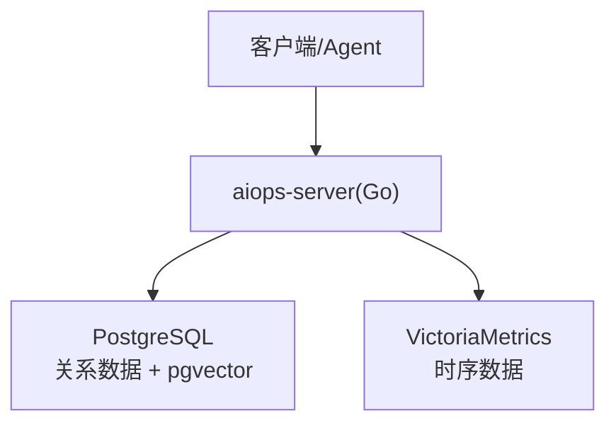
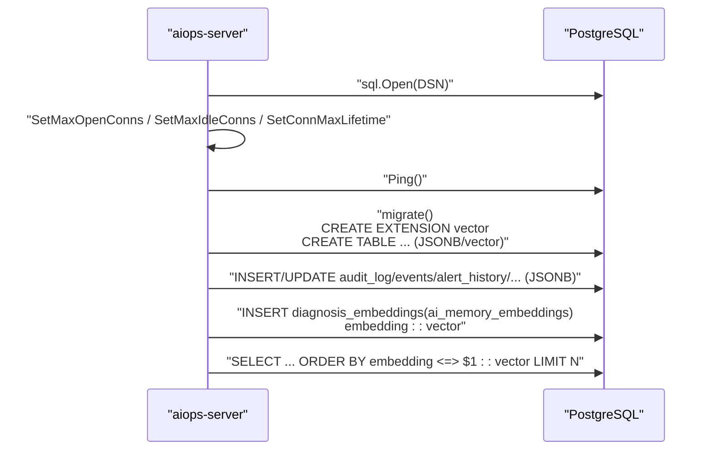
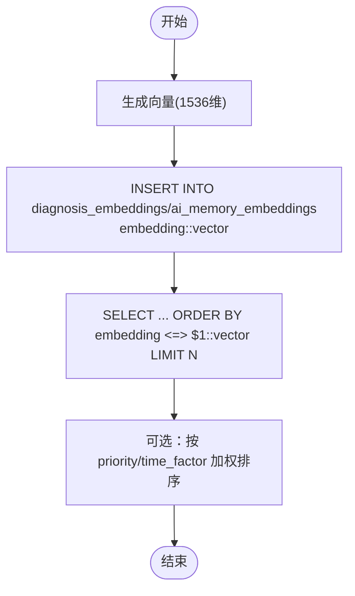
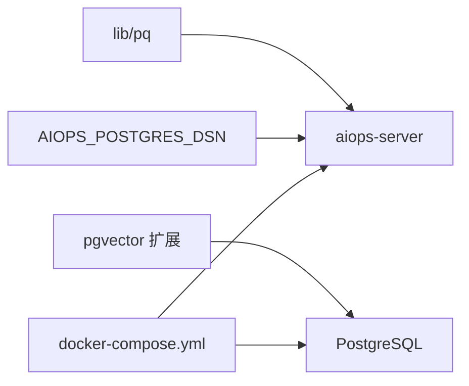

# PostgreSQL 优化

<cite>
**本文引用的文件**   
- [cmd/server/pgstore.go](file://cmd/server/pgstore.go)
- [cmd/server/main.go](file://cmd/server/main.go)
- [docker-compose.yml](file://docker-compose.yml)
- [fresh-test-prev-backup.sql](file://fresh-test-prev-backup.sql)
</cite>

## 目录
1. [简介](#简介)
2. [项目结构](#项目结构)
3. [核心组件](#核心组件)
4. [架构总览](#架构总览)
5. [详细组件分析](#详细组件分析)
6. [依赖关系分析](#依赖关系分析)
7. [性能与容量规划](#性能与容量规划)
8. [监控与慢查询治理](#监控与慢查询治理)
9. [备份恢复策略](#备份恢复策略)
10. [高可用架构设计](#高可用架构设计)
11. [结论](#结论)

## 简介
本指南面向使用 AIOps Monitor 的生产环境，聚焦于其 PostgreSQL 存储层的优化实践。内容覆盖连接池参数调优、JSONB 字段设计与索引策略、表结构与分区建议、pgvector 向量检索优化、监控与慢查询分析方法，以及备份恢复与高可用方案。所有建议均结合仓库中实际实现与迁移脚本进行说明，确保可落地执行。

## 项目结构
AIOps Monitor 在 v5.5.0 起统一采用“PostgreSQL（全部关系数据）+ VictoriaMetrics（全部时序数据）”的存储架构，服务端启动时强制要求配置 PG DSN，未配置则拒绝启动。PG 负责配置、用户、审计、事件、工单、会话等结构化/半结构化数据的持久化；向量检索通过 pgvector 扩展完成。

图表来源
- [cmd/server/main.go:251-272](file://cmd/server/main.go#L251-L272)
- [docker-compose.yml:64-84](file://docker-compose.yml#L64-L84)

章节来源
- [cmd/server/main.go:251-272](file://cmd/server/main.go#L251-L272)
- [docker-compose.yml:64-84](file://docker-compose.yml#L64-L84)

## 核心组件
- 连接层：基于 lib/pq 驱动建立数据库连接，并在应用侧设置连接池上限、空闲数与生命周期。
- 迁移与建表：启动时自动创建必要扩展与表结构，包含 JSONB 列与 pgvector 向量列。
- 业务写入：审计日志、事件、告警历史、终端录制元数据、AI 诊断记忆与通用 AI 记忆等均落库为 JSONB 或 vector 类型。
- 向量检索：使用余弦距离运算符 <=> 进行相似度检索，并配合排序与权重因子提升召回质量。

章节来源
- [cmd/server/pgstore.go:49-75](file://cmd/server/pgstore.go#L49-L75)
- [cmd/server/pgstore.go:77-212](file://cmd/server/pgstore.go#L77-L212)
- [cmd/server/pgstore.go:536-723](file://cmd/server/pgstore.go#L536-L723)

## 架构总览
下图展示了服务端与 PG 的关键交互路径：连接初始化、迁移建表、JSONB 读写、向量写入与检索。

图表来源
- [cmd/server/pgstore.go:49-75](file://cmd/server/pgstore.go#L49-L75)
- [cmd/server/pgstore.go:77-212](file://cmd/server/pgstore.go#L77-L212)
- [cmd/server/pgstore.go:536-723](file://cmd/server/pgstore.go#L536-L723)

## 详细组件分析

### 连接池配置与调优
- 当前默认值
  - MaxOpenConns=8
  - MaxIdleConns=2
  - ConnMaxLifetime=30 分钟
- 适用场景与调优建议
  - 低并发（单机/小规模）：保持默认即可，避免过多空闲连接占用资源。
  - 中高并发（多 Agent 轮询、批量写入）：根据 QPS 与平均响应时间逐步提高 MaxOpenConns，同时适当提升 MaxIdleConns 以降低冷启动开销。
  - 长事务/批处理：若存在较长事务或批量导入，可适当缩短 ConnMaxLifetime，促使连接定期回收，避免长时间持有锁或内存占用。
  - 外部代理/云托管：注意中间件（如云厂商连接池、负载均衡器）的连接超时与最大连接数限制，避免与服务端设置冲突。
- 注意事项
  - 连接数需与 PG 的 max_connections 和 shared_buffers 等内核参数协同评估，避免连接风暴导致 CPU/IO 抖动。
  - 连接池并非越大越好，应结合压测结果与 PG 负载曲线综合确定。

章节来源
- [cmd/server/pgstore.go:49-75](file://cmd/server/pgstore.go#L49-L75)

### JSONB 字段的使用与优化
- 现状
  - 大量表采用 JSONB 存储复杂/易变字段，例如 app_config、audit_log、events、incidents、tickets、hosts、kv_state、hermes_rules/templates/sessions 等。
  - 对部分列建立了 B-Tree 索引以支持常见过滤条件（如 status、ts、enabled、active）。
- 索引设计建议
  - 针对高频过滤键路径创建 GIN 或表达式索引，例如 data->>'key' 的等值/范围查询。
  - 对时间序列类表（如 audit_log、events、alert_history）保留 ts 列上的 B-Tree 索引，便于按时间窗口查询。
  - 对状态类列（status、enabled、active）维持现有 B-Tree 索引，利于快速筛选。
- 查询性能优化
  - 优先使用 JSONB 操作符（@>、?、?&、?|）与 jsonb_path_ops 索引，减少全表扫描。
  - 将热点查询中的 JSONB 提取为物化列或冗余字段，必要时用触发器维护一致性。
  - 控制 JSONB 体积，避免单次写入过大对象；必要时拆分到独立表。
- 数据压缩策略
  - 对于大文本/历史快照，可在应用层先行 gzip 后再存入 JSONB，降低 IO 与存储成本。
  - 对只读归档数据，考虑冷热分层：热数据留在 PG，冷数据转存对象存储。

章节来源
- [cmd/server/pgstore.go:77-212](file://cmd/server/pgstore.go#L77-L212)
- [fresh-test-prev-backup.sql:44-323](file://fresh-test-prev-backup.sql#L44-L323)

### 表结构优化建议
- 主键选择
  - 自增 BIGSERIAL 主键适用于审计/事件/规则/模板等增长型表，保证插入顺序与索引效率。
  - 短文本主键（如 hosts.id、terminal_recordings.id）适合用于关联与去重场景。
- 复合索引设计
  - 对“时间+状态”组合查询（如 alert_history 的 fired_at + key），可考虑复合索引以提升范围过滤性能。
  - 对“kind + created_at”这类常用检索模式，已存在复合索引 ai_mem_kind_created，建议沿用类似模式。
- 分区表策略
  - 审计日志、事件、告警历史等随时间增长的表，可按时间范围（月/周）进行分区，降低索引膨胀与维护成本。
  - 分区后配合 VACUUM/ANALYZE 与统计信息更新，保障查询计划稳定。
- 空间与 I/O
  - 对频繁更新的 JSONB 列，关注 TOAST 膨胀，定期 VACUUM FULL 或在线重构表。
  - 合理设置 fillfactor，为热点行预留更新空间，减少页分裂。

章节来源
- [cmd/server/pgstore.go:77-212](file://cmd/server/pgstore.go#L77-L212)
- [fresh-test-prev-backup.sql:44-323](file://fresh-test-prev-backup.sql#L44-L323)

### pgvector 向量搜索优化
- 维度设置
  - 诊断记忆与通用记忆均采用 vector(1536)，与应用侧嵌入模型维度保持一致。
  - 变更维度需同步迁移向量列，避免写入失败。
- 相似度计算
  - 使用余弦距离运算符 <=> 进行排序，返回 distance 越小越相似。
  - 检索时可引入优先级与时间衰减因子，平衡新旧知识与命中热度。
- 索引类型选择
  - 当前迁移脚本仅启用 vector 扩展，未显式创建 HNSW/IVFFlat 索引。建议在数据量较大时按需创建：
    - HNSW：适合高维向量、近似最近邻，构建较慢但查询快。
    - IVFFlat：适合中等规模数据，构建较快，查询精度略逊。
  - 索引参数（如 m、ef_construction、ef_search）需依据数据分布与延迟目标调优。
- 写入与检索流程
  - 写入：将 float64 数组格式化为 pgvector 字面量字符串后插入。
  - 检索：ORDER BY embedding <=> $1::vector LIMIT N，并结合 priority/time_factor 加权排序。

图表来源
- [cmd/server/pgstore.go:536-723](file://cmd/server/pgstore.go#L536-L723)
- [fresh-test-prev-backup.sql:84-93](file://fresh-test-prev-backup.sql#L84-L93)

章节来源
- [cmd/server/pgstore.go:536-723](file://cmd/server/pgstore.go#L536-L723)
- [fresh-test-prev-backup.sql:84-93](file://fresh-test-prev-backup.sql#L84-L93)

## 依赖关系分析
- 驱动与扩展
  - Go 驱动：lib/pq（版本固定于 go.sum）。
  - PG 扩展：vector（pgvector），用于向量类型与索引方法。
- 启动依赖
  - 环境变量 AIOPS_POSTGRES_DSN 必须配置，否则服务拒绝启动。
  - docker-compose 中 postgres 作为依赖服务，健康检查通过后才启动 server。

图表来源
- [go.sum:3-4](file://go.sum#L3-L4)
- [cmd/server/main.go:251-272](file://cmd/server/main.go#L251-L272)
- [docker-compose.yml:64-84](file://docker-compose.yml#L64-L84)

章节来源
- [go.sum:3-4](file://go.sum#L3-L4)
- [cmd/server/main.go:251-272](file://cmd/server/main.go#L251-L272)
- [docker-compose.yml:64-84](file://docker-compose.yml#L64-L84)

## 性能与容量规划
- 连接池与吞吐
  - 默认连接池较小，适合轻量部署；随着主机规模与上报频率增加，需评估并上调 MaxOpenConns/MaxIdleConns。
- 索引与查询
  - 对 JSONB 热点键路径建立合适索引，避免全表扫描。
  - 对时间序列表保留 ts 索引，并按需添加复合索引。
- 向量检索
  - 在数据量增长后，评估 HNSW/IVFFlat 索引的收益与代价，选择合适的参数。
- 存储与 I/O
  - JSONB 大对象可能导致 TOAST 膨胀，定期维护。
  - 对增长型表实施分区与归档策略，控制单表大小。

[本节为通用指导，不直接分析具体文件]

## 监控与慢查询治理
- 指标收集
  - 利用 PG 内置视图（如 pg_stat_statements、pg_stat_activity、pg_stat_user_tables/indexes）采集慢查询、锁等待、索引命中率等关键指标。
  - 结合 Prometheus + postgres_exporter 将指标接入统一监控平台。
- 慢查询分析
  - 开启 pg_stat_statements，定位 Top-N 慢查询，结合 EXPLAIN/EXPLAIN ANALYZE 分析执行计划。
  - 关注全表扫描、临时文件、回表次数、索引失效等异常点。
- 执行计划解读
  - 关注 Seq Scan vs Index Scan、Nested Loop vs Hash Join、Sort 成本等。
  - 对 JSONB 查询，确认是否命中 GIN/jsonb_path_ops 索引。
  - 对向量检索，确认是否命中 HNSW/IVFFlat 索引，观察 ef_search/m 参数影响。

[本节为通用指导，不直接分析具体文件]

## 备份恢复策略
- 逻辑备份
  - 使用 pg_dump 导出 schema 与数据，适用于跨版本迁移与选择性恢复。
  - 示例参考仓库提供的 SQL 导出文件，包含扩展、表结构、约束与索引定义。
- 物理备份
  - 使用 pg_basebackup 或云厂商快照，结合 WAL 归档实现 PITR（时间点恢复）。
- 增量与差异
  - 结合 WAL 归档与连续归档，实现近实时恢复能力。
- 恢复演练
  - 定期在隔离环境执行恢复演练，验证 RPO/RTO 目标达成。
- 安全与合规
  - 备份文件加密传输与静态加密，权限最小化，留存审计日志。

章节来源
- [fresh-test-prev-backup.sql:1-33](file://fresh-test-prev-backup.sql#L1-L33)

## 高可用架构设计
- 主从复制
  - 使用流复制（Streaming Replication）搭建一主多从，提升读取能力与容灾能力。
- 自动故障转移
  - 借助 Patroni + etcd/Consul 实现自动切换与脑裂防护。
- 连接路由
  - 通过 PgBouncer 做连接池与路由，屏蔽后端拓扑变化，保护 PG 实例。
- 读写分离
  - 写请求走主库，读请求路由至从库，结合应用层重试与幂等设计。
- 备份与容灾
  - 异地多活或同城双活，结合逻辑/物理备份与演练，满足 RPO/RTO 要求。

[本节为通用指导，不直接分析具体文件]

## 结论
通过对连接池、JSONB 索引与查询、表结构与分区、pgvector 向量检索、监控与慢查询治理、备份恢复与高可用等方面的系统化优化，可显著提升 AIOps Monitor 在 PostgreSQL 上的稳定性与性能。建议在生产环境中结合压测与真实负载持续迭代调优，并建立完善的监控与演练机制，确保系统长期稳健运行。