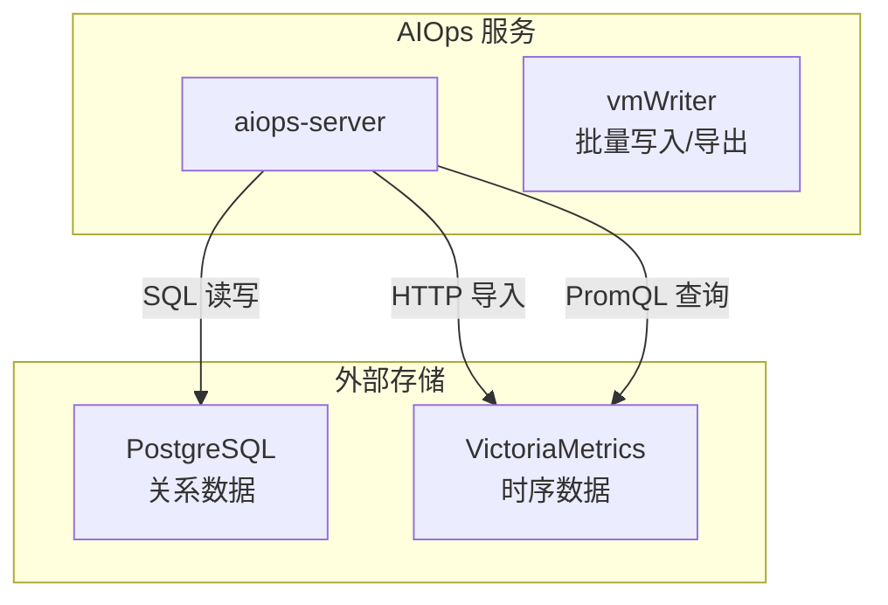
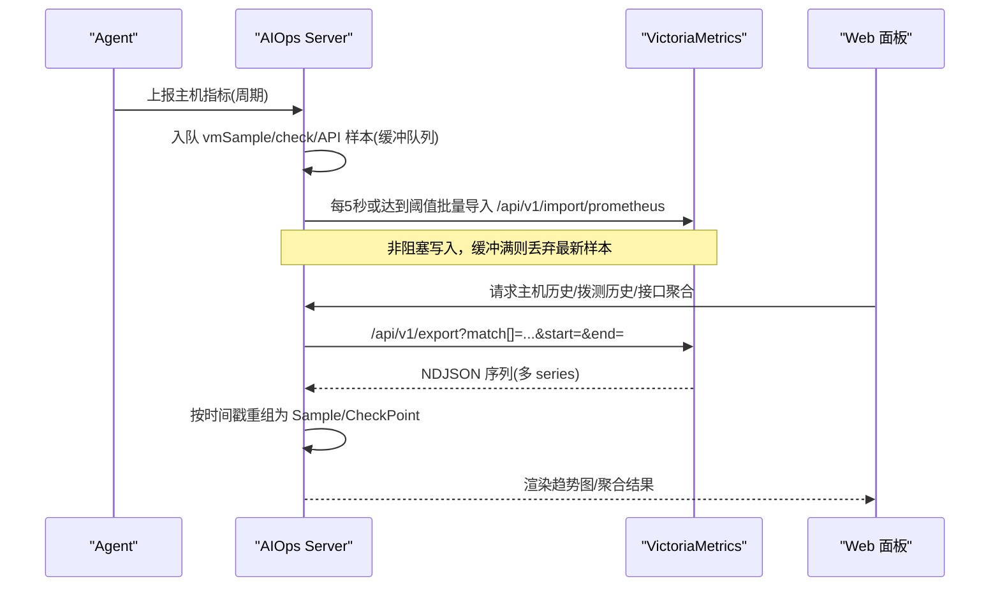
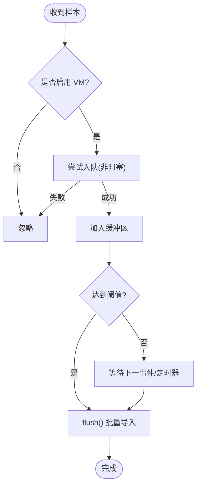
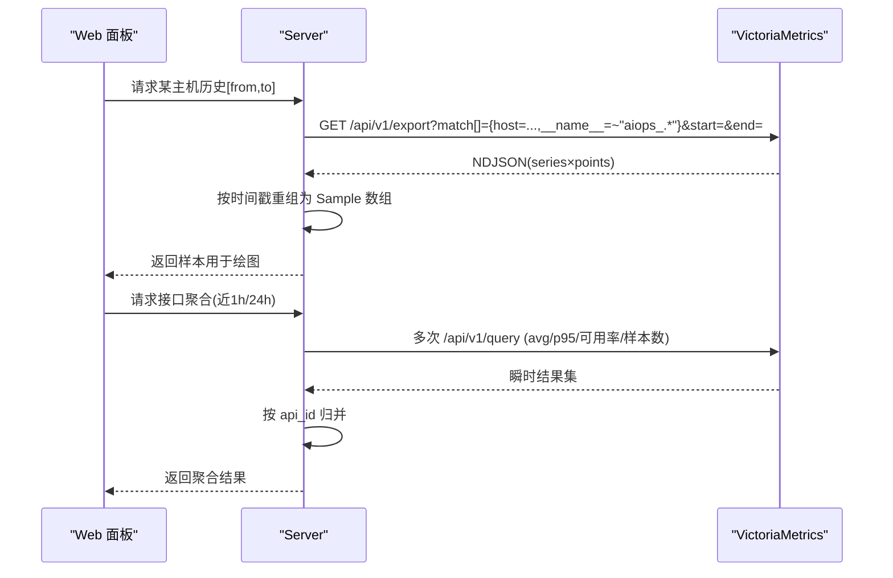
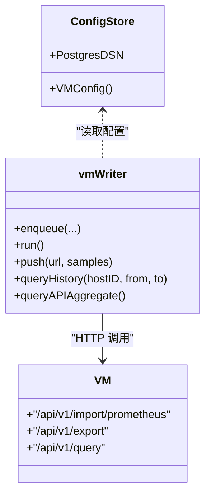

# VictoriaMetrics 优化

<cite>
**本文引用的文件**   
- [cmd/server/vm.go](file://cmd/server/vm.go)
- [cmd/server/main.go](file://cmd/server/main.go)
- [docker-compose.yml](file://docker-compose.yml)
- [README.md](file://README.md)
</cite>

## 目录
1. [简介](#简介)
2. [项目结构](#项目结构)
3. [核心组件](#核心组件)
4. [架构总览](#架构总览)
5. [详细组件分析](#详细组件分析)
6. [依赖关系分析](#依赖关系分析)
7. [性能与容量规划](#性能与容量规划)
8. [故障排查指南](#故障排查指南)
9. [结论](#结论)

## 简介
本指南聚焦于在 AIOps Monitor 中基于 VictoriaMetrics（VM）的时序数据写入、查询与存储优化。内容覆盖：
- 数据存储配置：保留期、压缩与磁盘空间管理
- 查询性能优化：时间范围限制、聚合函数使用、标签索引策略
- 写入性能调优：批量写入、采样频率、内存占用
- 高可用部署：集群模式、复制与故障转移
- 监控指标与告警：关键指标、告警规则建议
- 容量规划与成本优化：估算模型、清理策略与降本方案

说明：AIOps Server 通过环境变量 AIOPS_VM_URL 启用 VM，并以 Prometheus 文本格式批量导入到 /api/v1/import/prometheus；历史查询通过 /api/v1/export 拉取并按时间戳重组为样本。

章节来源
- [cmd/server/main.go:251-272](file://cmd/server/main.go#L251-L272)
- [cmd/server/vm.go:19-28](file://cmd/server/vm.go#L19-L28)

## 项目结构
与 VictoriaMetrics 集成相关的核心位置：
- 服务端启动校验与强制依赖：确保 AIOPS_POSTGRES_DSN 与 AIOPS_VM_URL 均配置，否则拒绝启动
- VM 写入器：批量构建 Prometheus 文本、定时 flush、非阻塞入队
- 编排文件：定义 VM 容器命令参数（如 retentionPeriod）、端口与数据卷挂载

图表来源
- [cmd/server/vm.go:125-172](file://cmd/server/vm.go#L125-L172)
- [cmd/server/main.go:251-272](file://cmd/server/main.go#L251-L272)
- [docker-compose.yml:86-98](file://docker-compose.yml#L86-L98)

章节来源
- [cmd/server/main.go:251-272](file://cmd/server/main.go#L251-L272)
- [cmd/server/vm.go:125-172](file://cmd/server/vm.go#L125-L172)
- [docker-compose.yml:86-98](file://docker-compose.yml#L86-L98)

## 核心组件
- VM 配置与开关
  - 通过环境变量 AIOPS_VM_URL 启用，并在启动时强制校验
  - vmWriter 负责将主机指标、拨测结果、API 探测结果批量写入 VM
- 写入路径
  - 主机指标：以 aiops_* 系列名 + host/instance/category 等 label 写入
  - 拨测/接口探测：aiops_check_* / aiops_api_* 系列，带 check_id/system/endpoint 等 label
- 读取路径
  - 主机历史：/api/v1/export 按 match[] 匹配 {host=...} 与 __name__=~"aiops_.*"
  - 拨测/接口历史：按对应 label 选择器导出并重组为 CheckPoint
  - 聚合计算：对 API 指标执行 PromQL 瞬时查询，得到平均/P95/可用率/样本数

章节来源
- [cmd/server/vm.go:30-40](file://cmd/server/vm.go#L30-L40)
- [cmd/server/vm.go:125-172](file://cmd/server/vm.go#L125-L172)
- [cmd/server/vm.go:225-249](file://cmd/server/vm.go#L225-L249)
- [cmd/server/vm.go:345-369](file://cmd/server/vm.go#L345-L369)
- [cmd/server/vm.go:467-498](file://cmd/server/vm.go#L467-L498)

## 架构总览
下图展示从 Agent 上报到 VM 的端到端流程，以及服务器侧的批量写入与导出逻辑。

图表来源
- [cmd/server/vm.go:125-172](file://cmd/server/vm.go#L125-L172)
- [cmd/server/vm.go:225-249](file://cmd/server/vm.go#L225-L249)
- [cmd/server/vm.go:345-369](file://cmd/server/vm.go#L345-L369)
- [cmd/server/vm.go:467-498](file://cmd/server/vm.go#L467-L498)

## 详细组件分析

### 写入路径与批处理
- 入队策略
  - 三个独立通道：主机指标、拨测、API 探测，分别有固定容量缓冲
  - 入队失败（缓冲满）直接丢弃，保证采集链路不阻塞
- 批处理与刷新
  - 定时器 5 秒触发 flush；当单类样本达到阈值（主机 512、拨测/API 256）立即 flush
  - 统一通过 HTTP POST 到 /api/v1/import/prometheus，Content-Type=text/plain
- 指标命名与标签
  - 主机指标：aiops_cpu_percent、aiops_mem_percent、aiops_disk_percent、aiops_net_conns、aiops_load1/5/15、aiops_proc_count 等
  - 附加多维标签：host、instance、category、path（分区）、gpu（显卡名）、proto+state（连接状态）
  - 拨测/接口：aiops_check_up/_latency_ms/_status_code/_loss_pct 等；aiops_api_up/_latency_ms/_status_code/_dns_ms/_tcp_ms/_tls_ms/_ttfb_ms/_cert_days/_resp_bytes

图表来源
- [cmd/server/vm.go:125-172](file://cmd/server/vm.go#L125-L172)
- [cmd/server/vm.go:505-571](file://cmd/server/vm.go#L505-L571)

章节来源
- [cmd/server/vm.go:125-172](file://cmd/server/vm.go#L125-L172)
- [cmd/server/vm.go:505-571](file://cmd/server/vm.go#L505-L571)

### 查询路径与聚合
- 历史导出
  - 主机：match[]={host="...",__name__=~"aiops_.*"}，start/end 指定时间窗
  - 拨测/接口：按对应 label 选择器导出，解析 NDJSON 后按时间戳合并
- 聚合计算
  - 对 API 指标执行多次瞬时 PromQL，汇总 avg_over_time、quantile_over_time、avg_over_time(aiops_api_up[1h])*100、count_over_time 等，返回每个 api_id 的聚合结果

图表来源
- [cmd/server/vm.go:225-249](file://cmd/server/vm.go#L225-L249)
- [cmd/server/vm.go:345-369](file://cmd/server/vm.go#L345-L369)
- [cmd/server/vm.go:467-498](file://cmd/server/vm.go#L467-L498)

章节来源
- [cmd/server/vm.go:225-249](file://cmd/server/vm.go#L225-L249)
- [cmd/server/vm.go:345-369](file://cmd/server/vm.go#L345-L369)
- [cmd/server/vm.go:467-498](file://cmd/server/vm.go#L467-L498)

### 数据模型与标签设计
- 主机维度
  - 基础指标：CPU/内存/磁盘/网络/负载/进程数
  - 扩展维度：disk_vol_*（path 标签区分分区）、gpu_*（gpu 标签区分显卡）、net_conn_count（proto+state 标签区分协议与状态）
- 拨测/接口维度
  - 拨测：check_id、check_type、name
  - 接口：api_id、system、endpoint
- 标签基数控制
  - 避免高基数字段（如 path/gpu/proto/state）无界增长，必要时进行过滤或降采样

章节来源
- [cmd/server/vm.go:505-571](file://cmd/server/vm.go#L505-L571)
- [cmd/server/vm.go:582-711](file://cmd/server/vm.go#L582-L711)

## 依赖关系分析
- 启动阶段强制依赖
  - 未配置 AIOPS_POSTGRES_DSN 或 AIOPS_VM_URL 将直接退出，确保“关系数据→PG，时序数据→VM”的统一存储策略
- 运行时依赖
  - vmWriter 依赖 HTTP 客户端访问 VM 的 import/export/query 接口
  - 前端面板依赖 Server 组装后的历史与聚合结果

图表来源
- [cmd/server/config.go:434-434](file://cmd/server/config.go#L434-L434)
- [cmd/server/vm.go:125-172](file://cmd/server/vm.go#L125-L172)
- [cmd/server/vm.go:467-498](file://cmd/server/vm.go#L467-L498)

章节来源
- [cmd/server/main.go:251-272](file://cmd/server/main.go#L251-L272)
- [cmd/server/vm.go:125-172](file://cmd/server/vm.go#L125-L172)

## 性能与容量规划

### 数据存储配置（保留期、压缩、磁盘）
- 保留期
  - 通过 VM 启动参数 -retentionPeriod 设置（示例：36 个月），可按需调整
  - 注意：保留期越长，磁盘占用越大
- 压缩与存储
  - VM 内置列式压缩，适合大规模时序；合理控制标签基数可显著降低存储膨胀
- 磁盘空间管理
  - 将 VM 数据目录映射到持久化卷，定期评估磁盘使用率
  - 结合业务需求调整保留期，平衡历史回溯与成本

章节来源
- [docker-compose.yml:90-93](file://docker-compose.yml#L90-L93)

### 查询性能优化
- 时间范围限制
  - 始终传入 start/end，缩小查询窗口，减少 I/O 与 CPU 开销
- 聚合函数使用
  - 优先使用 VM 侧聚合（avg_over_time、quantile_over_time、count_over_time），减少数据传输量
  - 对高频指标采用降采样或预聚合（例如 1min/5min 聚合）
- 标签索引优化
  - 控制高基数字段数量与取值范围（如 path、gpu、proto、state）
  - 使用稳定且低基数的分类标签（如 category、system、endpoint）

章节来源
- [cmd/server/vm.go:225-249](file://cmd/server/vm.go#L225-L249)
- [cmd/server/vm.go:467-498](file://cmd/server/vm.go#L467-L498)

### 写入性能调优
- 批量写入策略
  - 利用现有缓冲与阈值（主机 512、拨测/API 256）与 5s 定时器，提升吞吐
  - 若写入延迟偏高，可适当增大缓冲或提高阈值（需权衡内存占用）
- 采样频率调整
  - 根据规模与带宽，适当增大 Agent 上报间隔（例如 10-15s），降低整体写入压力
- 内存使用优化
  - 控制缓冲大小与并发写入次数，避免 OOM
  - 对于异常峰值场景，允许丢弃部分样本以保证主链路稳定

章节来源
- [cmd/server/vm.go:125-172](file://cmd/server/vm.go#L125-L172)
- [README_EN.md:1003-1011](file://README_EN.md#L1003-L1011)

### 高可用部署配置
- 集群模式与复制
  - 生产环境建议使用 VictoriaMetrics 集群版（VMCluster/VMStorage）实现水平扩展与副本复制
  - 通过负载均衡接入多个 VM 节点，保障写入与查询的高可用
- 故障转移机制
  - 客户端重试与退避：在应用层增加重试与超时控制
  - 健康检查与自动切换：配合服务发现与健康探针，实现故障节点剔除
- 数据一致性
  - 使用幂等写入与去重策略，避免重复导入导致的数据偏差

章节来源
- [docker-compose.yml:86-98](file://docker-compose.yml#L86-L98)

### 监控指标配置与告警规则
- 关键指标
  - 主机资源：cpu_percent、mem_percent、disk_percent、load1/5/15、proc_count
  - 网络：net_sent_rate、net_recv_rate、net_conns（含 proto+state）
  - 拨测/接口：aiops_check_up/_latency_ms/_status_code/_loss_pct；aiops_api_up/_latency_ms/_status_code
- 告警规则建议
  - 主机资源：CPU/内存/磁盘超过阈值持续 N 分钟触发
  - 网络：连接数突增/丢包率升高
  - 拨测/接口：可用性低于目标、P95 响应超阈、错误码占比上升
  - 存储：VM 磁盘使用率接近保留期上限

章节来源
- [cmd/server/vm.go:505-571](file://cmd/server/vm.go#L505-L571)
- [cmd/server/vm.go:174-223](file://cmd/server/vm.go#L174-L223)
- [cmd/server/vm.go:296-343](file://cmd/server/vm.go#L296-L343)

### 容量规划指导
- 估算模型
  - 指标数量 × 标签基数 × 采样间隔 × 保留期 ≈ 原始数据量
  - 考虑 VM 压缩比（通常 5-10x），再乘以安全系数（1.2-1.5）
- 实践建议
  - 先小步上线，观察实际写入速率与磁盘增长，逐步调整保留期与标签基数
  - 对低频但高基数字段（如 path/gpu）进行过滤或降采样

章节来源
- [docker-compose.yml:90-93](file://docker-compose.yml#L90-L93)

### 数据清理策略与存储成本优化
- 保留期裁剪
  - 根据合规与运维需求，缩短长尾数据的保留期
- 标签治理
  - 定期审计高基数字段，移除无用标签或收敛取值集合
- 冷热分层
  - 热数据（近 1-3 个月）保持高精度；冷数据（更长）降采样或归档
- 清理自动化
  - 结合 VM 的保留期与外部脚本，定期巡检磁盘使用率并预警

章节来源
- [docker-compose.yml:90-93](file://docker-compose.yml#L90-L93)

## 故障排查指南
- 启动失败
  - 现象：未配置 AIOPS_VM_URL 或 AIOPS_POSTGRES_DSN 直接退出
  - 处理：补齐环境变量并确保可达
- 写入失败
  - 现象：日志中出现“VictoriaMetrics 写入失败”
  - 处理：检查 VM 地址、网络连通性、/api/v1/import/prometheus 端口与鉴权
- 历史缺失
  - 现象：面板无法显示历史曲线
  - 处理：确认 export 查询的 match[] 选择器与 start/end 是否正确；检查 VM 保留期
- 聚合异常
  - 现象：P95/可用率为空或异常
  - 处理：核对 PromQL 表达式与指标名称；确认数据点存在且时间戳连续

章节来源
- [cmd/server/main.go:251-272](file://cmd/server/main.go#L251-L272)
- [cmd/server/vm.go:505-571](file://cmd/server/vm.go#L505-L571)
- [cmd/server/vm.go:225-249](file://cmd/server/vm.go#L225-L249)
- [cmd/server/vm.go:467-498](file://cmd/server/vm.go#L467-L498)

## 结论
通过将全部时序数据统一落盘至 VictoriaMetrics，并结合合理的保留期、标签基数控制与批量写入策略，可在保证查询性能的同时有效控制存储成本。在生产环境中，建议采用 VM 集群与副本复制实现高可用，并通过严格的查询窗口与聚合函数使用进一步提升查询效率。同时，建立容量规划与清理策略，确保系统长期稳定运行。