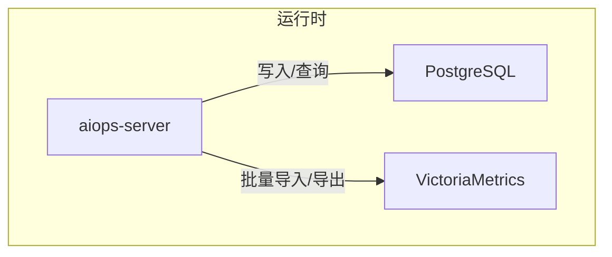
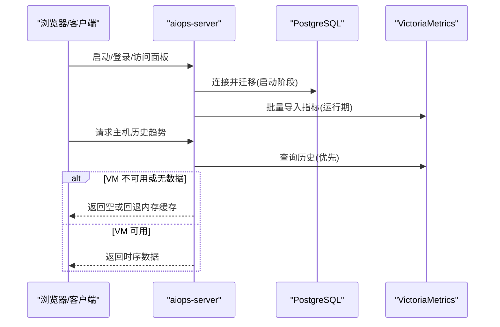
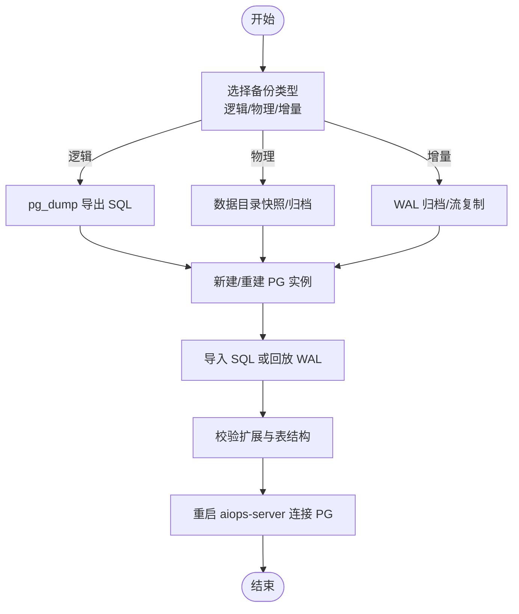
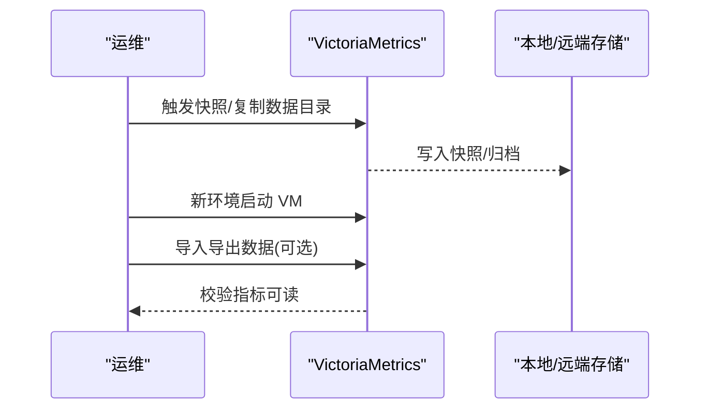
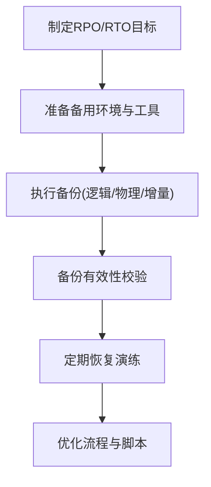
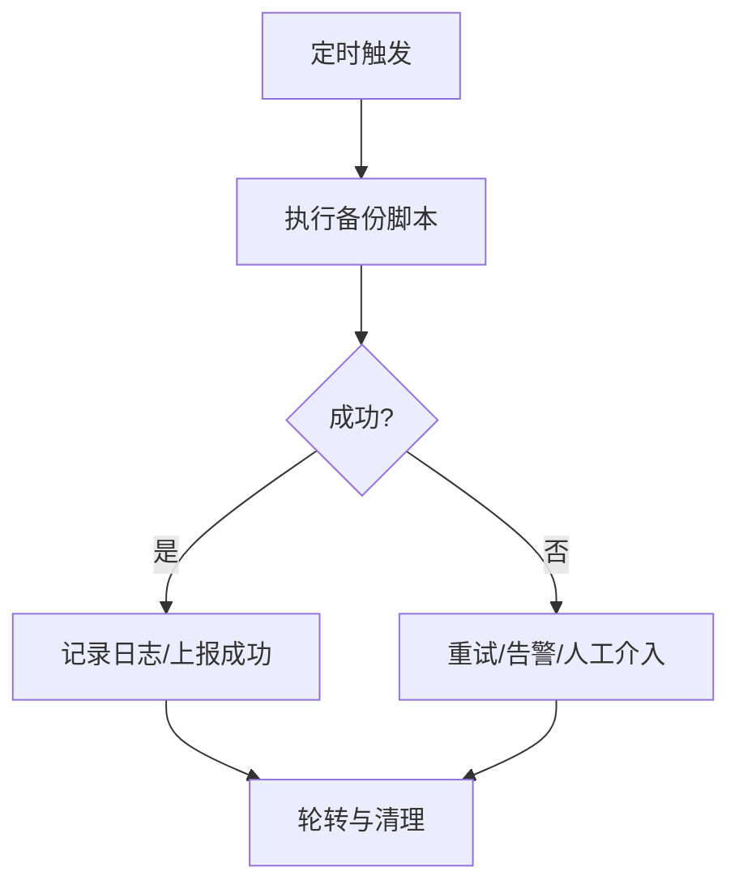
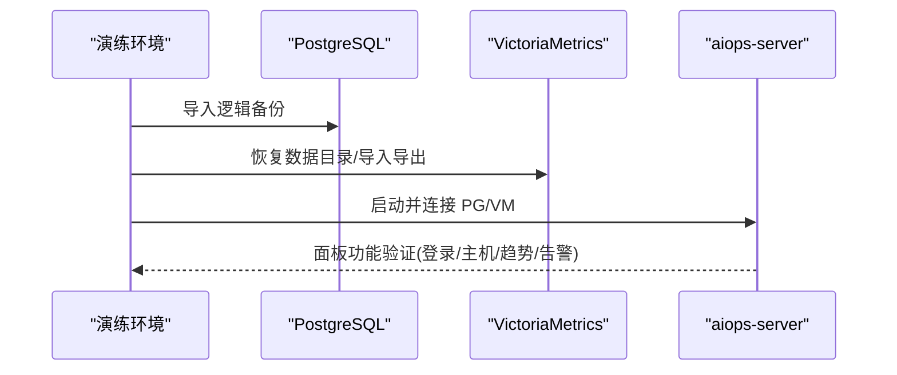
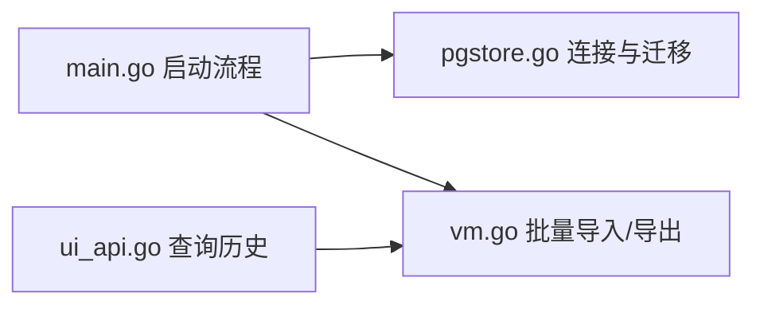

# 备份恢复策略

<cite>
**本文引用的文件**   
- [README.md](file://README.md)
- [docker-compose.yml](file://docker-compose.yml)
- [cmd/server/main.go](file://cmd/server/main.go)
- [cmd/server/pgstore.go](file://cmd/server/pgstore.go)
- [cmd/server/vm.go](file://cmd/server/vm.go)
- [cmd/server/ui_api.go](file://cmd/server/ui_api.go)
- [config.example.json](file://config.example.json)
- [server_config.example.json](file://server_config.example.json)
- [deploy.sh](file://deploy.sh)
- [scripts/secure-compose.sh](file://scripts/secure-compose.sh)
- [fresh-test-prev-backup.sql](file://fresh-test-prev-backup.sql)
- [pg-backup-vectorfix.sql](file://pg-backup-vectorfix.sql)
</cite>

## 目录
1. [引言](#引言)
2. [项目结构](#项目结构)
3. [核心组件](#核心组件)
4. [架构总览](#架构总览)
5. [详细组件分析](#详细组件分析)
6. [依赖关系分析](#依赖关系分析)
7. [性能与容量规划](#性能与容量规划)
8. [故障排查指南](#故障排查指南)
9. [结论](#结论)
10. [附录：演练与验证流程](#附录演练与验证流程)

## 引言
本指南面向 AIOps Monitor 的数据库备份与恢复，覆盖 PostgreSQL（关系数据）与 VictoriaMetrics（时序数据）两类存储的备份方案、恢复流程、自动化脚本、存储管理与异地容灾。系统采用“统一存储”设计：所有关系数据落 PostgreSQL，所有时序数据落 VictoriaMetrics；内置单文件库已停用，服务启动时强制校验二者可用性。

## 项目结构
- 服务端通过环境变量加载 PG DSN 与 VM URL，并在启动阶段建立连接与迁移。
- Docker Compose 编排了 aiops-server、postgres、victoriametrics 三容器，提供默认端口映射与数据卷挂载。
- 示例 SQL 文件展示了 pg_dump 导出的逻辑备份结构与向量扩展使用。

**图表来源** 
- [cmd/server/main.go:251-272](file://cmd/server/main.go#L251-L272)
- [docker-compose.yml:64-93](file://docker-compose.yml#L64-L93)

**章节来源**
- [README.md:159-160](file://README.md#L159-L160)
- [docker-compose.yml:1-26](file://docker-compose.yml#L1-L26)

## 核心组件
- 关系型存储（PostgreSQL）
  - 用途：配置、用户、审计日志、事件、工单、会话等结构化数据。
  - 关键入口：启动时读取 AIOPS_POSTGRES_DSN，重试连接并执行迁移。
- 时序存储（VictoriaMetrics）
  - 用途：主机指标、拨测结果、API 性能监控等时序数据。
  - 关键入口：AIOPS_VM_URL 启用后，服务端以 Prometheus 文本格式批量导入，支持按时间范围导出。

**章节来源**
- [cmd/server/main.go:251-272](file://cmd/server/main.go#L251-L272)
- [cmd/server/pgstore.go:17-75](file://cmd/server/pgstore.go#L17-L75)
- [cmd/server/vm.go:19-34](file://cmd/server/vm.go#L19-L34)

## 架构总览
AIOps Monitor 在启动阶段完成双后端初始化，运行期将关系数据持久化到 PG，时序数据批量推送到 VM。UI 查询历史趋势时优先从 VM 拉取，若不可用则回退到内存缓存。

**图表来源** 
- [cmd/server/main.go:251-272](file://cmd/server/main.go#L251-L272)
- [cmd/server/ui_api.go:87-108](file://cmd/server/ui_api.go#L87-L108)
- [cmd/server/vm.go:714-742](file://cmd/server/vm.go#L714-L742)

## 详细组件分析

### PostgreSQL 备份与恢复
- 备份方式
  - 逻辑备份（推荐用于跨版本迁移与细粒度恢复）：使用 pg_dump 导出为 SQL 脚本。仓库中提供了示例导出文件，包含 vector 扩展与多表结构。
  - 物理备份（适合快速全量恢复）：对 PG 数据目录进行快照或归档复制，结合 WAL 归档可实现时间点恢复（PITR）。
  - 增量备份：基于 WAL 流复制与归档，配合 PITR 实现近实时增量保护。
- 选择建议
  - 小库/频繁迁移：逻辑备份为主，便于审查与选择性恢复。
  - 大库/快速恢复：物理备份 + WAL 归档，缩短 RTO。
- 恢复要点
  - 先恢复 PG 实例，再导入逻辑备份或回放 WAL。
  - 注意向量扩展（vector）与表结构一致性。
  - 恢复后重启 aiops-server，确保其能正常连接 PG。

**图表来源** 
- [fresh-test-prev-backup.sql:1-70](file://fresh-test-prev-backup.sql#L1-L70)
- [pg-backup-vectorfix.sql:1-312](file://pg-backup-vectorfix.sql#L1-L312)
- [cmd/server/main.go:251-272](file://cmd/server/main.go#L251-L272)

**章节来源**
- [fresh-test-prev-backup.sql:1-70](file://fresh-test-prev-backup.sql#L1-L70)
- [pg-backup-vectorfix.sql:1-312](file://pg-backup-vectorfix.sql#L1-L312)
- [cmd/server/pgstore.go:17-75](file://cmd/server/pgstore.go#L17-L75)

### VictoriaMetrics 备份与恢复
- 备份方式
  - 快照备份：直接对 VM 数据目录做快照或复制（VM 命令参数显示 storageDataPath）。
  - 远程存储：可配置对象存储作为远端归档（需 VM 侧配置），实现异地容灾。
  - 数据迁移：通过 /api/v1/export 导出 NDJSON，再在新集群 /api/v1/import/prometheus 导入。
- 选择建议
  - 小规模/测试：快照备份即可。
  - 生产/大规模：快照 + 远程存储 + 定期导出，兼顾 RPO/RTO。
- 恢复要点
  - 停止 VM，替换数据目录或导入导出数据，启动后校验指标可见性。
  - 注意 retentionPeriod 设置与磁盘空间。

**图表来源** 
- [docker-compose.yml:86-93](file://docker-compose.yml#L86-L93)
- [cmd/server/vm.go:714-742](file://cmd/server/vm.go#L714-L742)

**章节来源**
- [docker-compose.yml:86-93](file://docker-compose.yml#L86-L93)
- [cmd/server/vm.go:714-742](file://cmd/server/vm.go#L714-L742)

### 恢复流程设计与业务连续性
- 灾难恢复预案
  - 明确 RPO/RTO 目标，区分关系与时序数据的恢复优先级。
  - 准备冷备/热备两套环境，定期演练。
- 数据一致性保证
  - 逻辑备份建议在低峰期执行，必要时暂停写入或使用只读副本。
  - 物理备份结合 WAL 归档，确保时间点一致。
- 业务连续性保障
  - 恢复顺序：先 PG，再 VM，最后重启 aiops-server。
  - 恢复后执行健康检查与最小集验证（如查看最近告警、主机在线状态）。

[本节为概念性内容，不直接分析具体文件]

### 自动化备份脚本与定时任务
- 定时任务
  - Linux：cron 调度 pg_dump、VM 快照/导出。
  - Windows：计划任务调用批处理脚本。
- 备份验证
  - 校验导出文件大小、SQL 语法、关键表记录数。
  - 在隔离环境执行一次恢复验证。
- 异常处理
  - 失败重试与告警通知。
  - 保留多份历史备份，清理过期文件。

[本节为通用实践说明，未引用具体代码文件]

### 备份存储管理
- 存储空间规划
  - 评估 PG 与 VM 的数据增长速率，预留扩容空间。
  - 根据 retentionPeriod 与压缩率估算 VM 存储需求。
- 备份轮转策略
  - 保留 N 天/周/月备份，按策略删除旧备份。
- 异地容灾
  - 将 PG 逻辑备份与 VM 快照/导出同步至远端对象存储。
  - 定期演练异地恢复。

**章节来源**
- [docker-compose.yml:86-93](file://docker-compose.yml#L86-L93)

### 恢复演练方法与测试验证流程
- 演练步骤
  - 搭建隔离环境，部署 PG 与 VM。
  - 导入 PG 逻辑备份，恢复 VM 数据目录或导入导出数据。
  - 启动 aiops-server，验证登录、主机列表、趋势图、告警与事件。
- 验证清单
  - 关键表存在且记录数合理。
  - 最近时段指标曲线完整。
  - 拨测与 API 监控历史可查。

**图表来源** 
- [cmd/server/main.go:251-272](file://cmd/server/main.go#L251-L272)
- [cmd/server/ui_api.go:87-108](file://cmd/server/ui_api.go#L87-L108)
- [cmd/server/vm.go:714-742](file://cmd/server/vm.go#L714-L742)

## 依赖关系分析
- 启动依赖
  - 必须配置 AIOPS_POSTGRES_DSN 与 AIOPS_VM_URL，否则拒绝启动。
- 运行期依赖
  - 关系数据读写依赖 PG 连接池与迁移。
  - 时序数据写入依赖 VM 的 /api/v1/import/prometheus。

**图表来源** 
- [cmd/server/main.go:251-272](file://cmd/server/main.go#L251-L272)
- [cmd/server/pgstore.go:17-75](file://cmd/server/pgstore.go#L17-L75)
- [cmd/server/vm.go:19-34](file://cmd/server/vm.go#L19-L34)
- [cmd/server/ui_api.go:87-108](file://cmd/server/ui_api.go#L87-L108)

**章节来源**
- [cmd/server/main.go:251-272](file://cmd/server/main.go#L251-L272)
- [cmd/server/pgstore.go:17-75](file://cmd/server/pgstore.go#L17-L75)
- [cmd/server/vm.go:19-34](file://cmd/server/vm.go#L19-L34)
- [cmd/server/ui_api.go:87-108](file://cmd/server/ui_api.go#L87-L108)

## 性能与容量规划
- 指标写入
  - VM 批量导入，非阻塞队列，避免影响采集链路。
- 查询路径
  - 优先从 VM 查询历史，失败回退内存缓存。
- 容量估算
  - 参考 retentionPeriod 与主机规模，规划 VM 存储。
  - PG 大小随审计、事件、工单增长，需定期清理与归档。

**章节来源**
- [cmd/server/vm.go:125-172](file://cmd/server/vm.go#L125-L172)
- [cmd/server/ui_api.go:87-108](file://cmd/server/ui_api.go#L87-L108)
- [docker-compose.yml:86-93](file://docker-compose.yml#L86-L93)

## 故障排查指南
- 启动失败
  - 检查 AIOPS_POSTGRES_DSN 与 AIOPS_VM_URL 是否配置正确。
  - 确认 PG 健康检查通过，VM 端口可达。
- 数据不一致
  - 对比 PG 关键表记录数与 VM 指标时间范围。
  - 检查向量扩展是否安装与版本匹配。
- 恢复失败
  - 校验 SQL 语法与权限，确认 PG 版本兼容。
  - 核对 VM 数据目录权限与 retentionPeriod 设置。

**章节来源**
- [cmd/server/main.go:251-272](file://cmd/server/main.go#L251-L272)
- [fresh-test-prev-backup.sql:1-70](file://fresh-test-prev-backup.sql#L1-L70)
- [pg-backup-vectorfix.sql:1-312](file://pg-backup-vectorfix.sql#L1-L312)

## 结论
AIOps Monitor 采用“PG + VM”的统一存储架构，备份恢复应围绕两类存储分别设计：PG 侧重逻辑/物理/增量组合，VM 侧重快照/远程存储/导出导入。通过自动化脚本与定期演练，确保 RPO/RTO 目标达成，保障业务连续性。

[本节为总结性内容，不直接分析具体文件]

## 附录：演练与验证流程
- 演练前准备
  - 准备隔离环境、备份介质与工具链。
  - 更新部署脚本与密钥注入脚本，确保可重复执行。
- 演练执行
  - 按恢复顺序执行：PG → VM → aiops-server。
  - 逐项验证面板功能与数据完整性。
- 演练复盘
  - 记录耗时、问题与改进项，完善脚本与文档。

**章节来源**
- [deploy.sh:1-49](file://deploy.sh#L1-L49)
- [scripts/secure-compose.sh:1-100](file://scripts/secure-compose.sh#L1-L100)
- [config.example.json:1-16](file://config.example.json#L1-L16)
- [server_config.example.json:1-36](file://server_config.example.json#L1-L36)