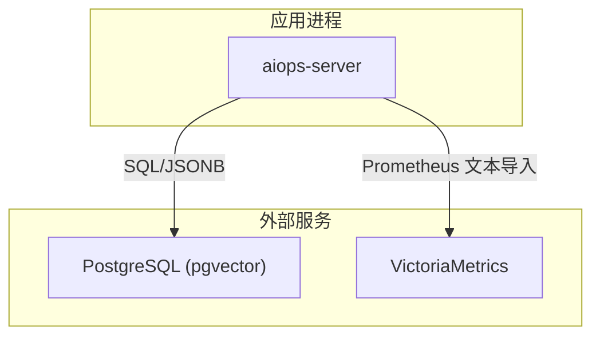
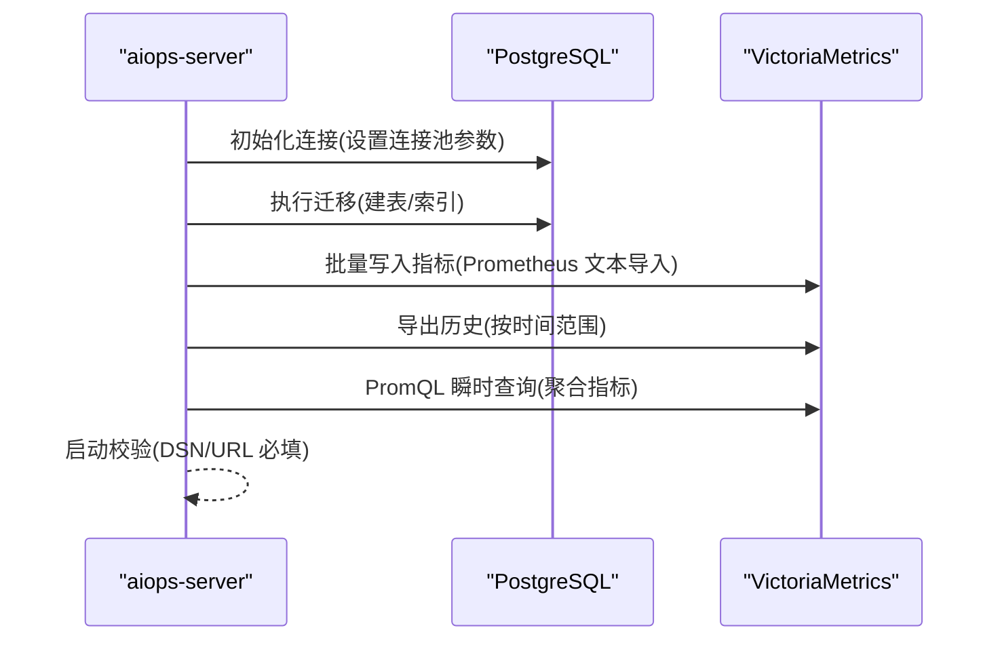
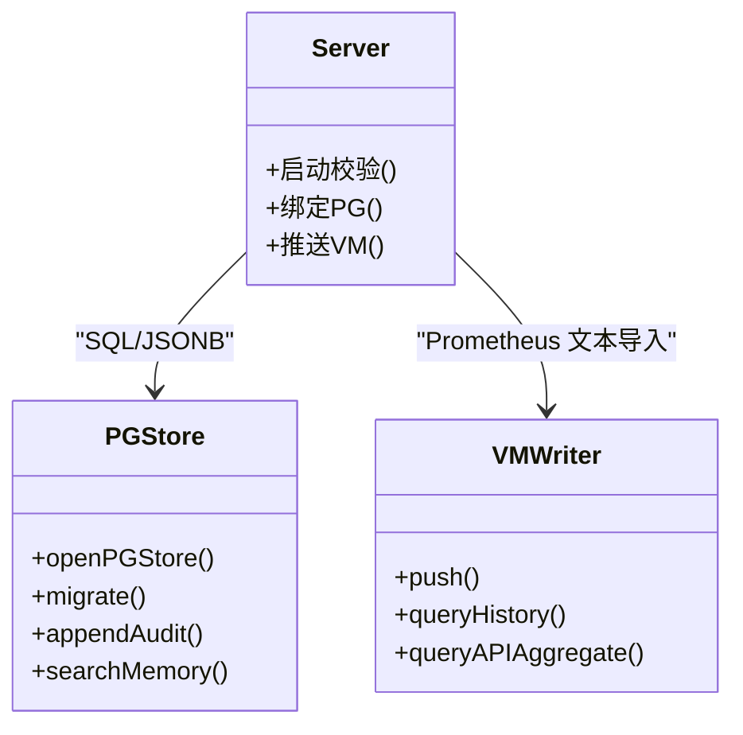

# 数据库优化

<cite>
**本文引用的文件**   
- [cmd/server/pgstore.go](file://cmd/server/pgstore.go)
- [cmd/server/main.go](file://cmd/server/main.go)
- [cmd/server/vm.go](file://cmd/server/vm.go)
- [docker-compose.yml](file://docker-compose.yml)
- [README.md](file://README.md)
- [pg-backup-vectorfix.sql](file://pg-backup-vectorfix.sql)
- [fresh-test-prev-backup.sql](file://fresh-test-prev-backup.sql)
</cite>

## 目录
1. [简介](#简介)
2. [项目结构](#项目结构)
3. [核心组件](#核心组件)
4. [架构总览](#架构总览)
5. [详细组件分析](#详细组件分析)
6. [依赖关系分析](#依赖关系分析)
7. [性能与容量规划](#性能与容量规划)
8. [故障排查指南](#故障排查指南)
9. [结论](#结论)
10. [附录](#附录)

## 简介
本指南面向使用 PostgreSQL 与 VictoriaMetrics 的 AIOps Monitor 平台，聚焦以下目标：
- PostgreSQL 连接池配置与高可用/备份恢复策略
- VictoriaMetrics 时序数据写入、保留与查询优化
- SQL 索引设计与慢查询分析方法
- 主从复制与高可用架构建议
- 容量规划与扩容方案

说明：本项目在启动时强制要求同时配置 PostgreSQL 与 VictoriaMetrics，未配置任一将拒绝启动；所有关系数据落 PG，所有时序数据落 VM。

章节来源
- [cmd/server/main.go:251-272](file://cmd/server/main.go#L251-L272)
- [README.md:556-573](file://README.md#L556-L573)

## 项目结构
围绕数据库优化的关键代码与配置集中在服务端与编排文件中：
- 服务端初始化与存储绑定：main.go
- PostgreSQL 持久化层（表结构、索引、迁移）：pgstore.go
- VictoriaMetrics 集成（写入/导出/聚合）：vm.go
- 容器编排与默认参数：docker-compose.yml
- 示例备份脚本（含 pgvector 扩展）：pg-backup-vectorfix.sql, fresh-test-prev-backup.sql

图表来源
- [cmd/server/main.go:251-272](file://cmd/server/main.go#L251-L272)
- [cmd/server/pgstore.go:77-212](file://cmd/server/pgstore.go#L77-L212)
- [cmd/server/vm.go:505-571](file://cmd/server/vm.go#L505-L571)
- [docker-compose.yml:86-98](file://docker-compose.yml#L86-L98)

章节来源
- [cmd/server/main.go:251-272](file://cmd/server/main.go#L251-L272)
- [cmd/server/pgstore.go:77-212](file://cmd/server/pgstore.go#L77-L212)
- [cmd/server/vm.go:505-571](file://cmd/server/vm.go#L505-L571)
- [docker-compose.yml:86-98](file://docker-compose.yml#L86-L98)

## 核心组件
- PostgreSQL 持久化层
  - 连接池：最大连接数、空闲连接、连接生命周期
  - 自动迁移：创建必要表与索引（审计日志、事件、主机元数据、KV 状态、终端录制索引、告警历史、诊断向量、AI 记忆等）
- VictoriaMetrics 集成
  - 批量写入：通过 Prometheus 文本导入接口
  - 历史读取：按时间范围导出并重组为样本
  - API 指标聚合：基于 PromQL 瞬时查询计算平均/P95/可用率/采样数
- 启动校验与重试
  - 强制要求 AIOPS_POSTGRES_DSN 与 AIOPS_VM_URL 环境变量
  - 对 PG 连接进行有限次重试，失败则终止

章节来源
- [cmd/server/pgstore.go:49-75](file://cmd/server/pgstore.go#L49-L75)
- [cmd/server/pgstore.go:77-212](file://cmd/server/pgstore.go#L77-L212)
- [cmd/server/vm.go:125-172](file://cmd/server/vm.go#L125-L172)
- [cmd/server/vm.go:467-498](file://cmd/server/vm.go#L467-L498)
- [cmd/server/main.go:207-225](file://cmd/server/main.go#L207-L225)
- [cmd/server/main.go:251-272](file://cmd/server/main.go#L251-L272)

## 架构总览
下图展示服务端与 PG/VM 的交互路径及关键流程。

图表来源
- [cmd/server/pgstore.go:49-75](file://cmd/server/pgstore.go#L49-L75)
- [cmd/server/pgstore.go:77-212](file://cmd/server/pgstore.go#L77-L212)
- [cmd/server/vm.go:505-571](file://cmd/server/vm.go#L505-L571)
- [cmd/server/vm.go:713-742](file://cmd/server/vm.go#L713-L742)
- [cmd/server/vm.go:467-498](file://cmd/server/vm.go#L467-L498)
- [cmd/server/main.go:251-272](file://cmd/server/main.go#L251-L272)

## 详细组件分析

### PostgreSQL 连接池与超时
- 连接池参数
  - 最大连接数：用于控制并发 SQL 请求上限
  - 空闲连接数：保持少量空闲连接以快速响应突发
  - 连接生命周期：限制单连接存活时长，避免长连接资源泄漏
- 启动阶段 Ping 检查与超时保护
  - 异步 Ping 并在限定时间内等待结果，失败则关闭连接并返回错误
- 启动重试机制
  - 针对 Docker Compose 冷启动场景，对 PG 连接进行多次重试，超过阈值后终止

优化建议
- 根据并发写读负载调整最大连接数，确保不超过 PG 的 max_connections
- 合理设置空闲连接数，避免过多空闲占用连接配额
- 连接生命周期应小于负载均衡器或代理的连接超时，避免半开连接

章节来源
- [cmd/server/pgstore.go:49-75](file://cmd/server/pgstore.go#L49-L75)
- [cmd/server/main.go:207-225](file://cmd/server/main.go#L207-L225)

### PostgreSQL 表结构与索引设计
- 已创建的表与用途
  - app_config：应用配置 JSONB
  - audit_log：审计日志（append-only），按 ts 索引
  - events：插件事件（append-only），按 ts 索引
  - hosts：主机元数据（JSONB）
  - kv_state：键值状态（JSONB）
  - terminal_recordings：终端会话录制元数据（info JSONB），按 ts 倒序索引
  - diagnosis_embeddings：诊断向量（pgvector），支持相似案例检索
  - ai_memory_embeddings：通用 AI 记忆（pgvector），支持 RAG 检索
  - experience_rules / hermes_rules / hermes_templates / hermes_sessions：Hermes Agent 相关
  - alert_history：告警历史（触发/恢复记录）
- 关键索引
  - 时间序列类：audit_log(ts)、events(ts)、terminal_recordings(ts DESC)、alert_history(fired_at DESC)
  - 状态过滤：incidents(status)、tickets(status)、hermes_rules(enabled)、hermes_templates(active)
  - 关联索引：diagnosis_embeddings(incident_id)
  - AI 记忆复合索引：ai_memory_embeddings(kind)、created_at、(kind, created_at DESC)

优化建议
- 对高频查询字段建立合适索引（如 status、ts、kind）
- 大表定期 VACUUM/ANALYZE，保证统计信息准确
- 对 JSONB 列按需建立 GIN 索引（若频繁按字段查询）

章节来源
- [cmd/server/pgstore.go:77-212](file://cmd/server/pgstore.go#L77-L212)

### VictoriaMetrics 写入与查询优化
- 写入路径
  - 批量打包为 Prometheus 文本格式，POST 到 /api/v1/import/prometheus
  - 非阻塞缓冲队列，满则丢弃，确保采集不阻塞
- 历史读取
  - 按 hostID 和时间范围导出，重组为样本数组
- API 指标聚合
  - 使用 PromQL 瞬时查询计算 avg/p95/可用率/采样数，一次查询覆盖全部 api_id

优化建议
- 调优 VM 的 retentionPeriod 以满足合规与成本需求
- 控制 label 基数，避免高基数字符串导致 TSDB 膨胀
- 使用合适的 time range 和 match[] 表达式减少扫描量

章节来源
- [cmd/server/vm.go:125-172](file://cmd/server/vm.go#L125-L172)
- [cmd/server/vm.go:505-571](file://cmd/server/vm.go#L505-L571)
- [cmd/server/vm.go:713-742](file://cmd/server/vm.go#L713-L742)
- [cmd/server/vm.go:467-498](file://cmd/server/vm.go#L467-L498)
- [docker-compose.yml:90-93](file://docker-compose.yml#L90-L93)

### 启动校验与容错
- 强制要求 AIOPS_POSTGRES_DSN 与 AIOPS_VM_URL 环境变量
- 对 PG 连接进行有限次重试，失败则终止，避免无后端运行

章节来源
- [cmd/server/main.go:251-272](file://cmd/server/main.go#L251-L272)
- [cmd/server/main.go:207-225](file://cmd/server/main.go#L207-L225)

## 依赖关系分析
- 服务端依赖
  - PostgreSQL：关系型数据持久化（配置、用户、审计、事件、工单、会话、告警历史、AI 记忆等）
  - VictoriaMetrics：时序数据持久化（指标、趋势、SLO）
- 外部依赖
  - pgvector 扩展：用于向量相似度检索（RAG）

图表来源
- [cmd/server/main.go:251-272](file://cmd/server/main.go#L251-L272)
- [cmd/server/pgstore.go:49-75](file://cmd/server/pgstore.go#L49-L75)
- [cmd/server/pgstore.go:77-212](file://cmd/server/pgstore.go#L77-L212)
- [cmd/server/vm.go:505-571](file://cmd/server/vm.go#L505-L571)
- [cmd/server/vm.go:713-742](file://cmd/server/vm.go#L713-L742)
- [cmd/server/vm.go:467-498](file://cmd/server/vm.go#L467-L498)

章节来源
- [cmd/server/pgstore.go:77-212](file://cmd/server/pgstore.go#L77-L212)
- [cmd/server/vm.go:505-571](file://cmd/server/vm.go#L505-L571)
- [cmd/server/main.go:251-272](file://cmd/server/main.go#L251-L272)

## 性能与容量规划

### PostgreSQL 连接池与超时配置
- 最大连接数
  - 建议依据并发写读峰值估算，通常设置为“应用并发度 × 每连接并发”的上限
  - 需小于 PG 实例的 max_connections，并预留系统连接余量
- 空闲连接管理
  - 空闲连接数不宜过大，避免浪费连接配额
  - 结合业务波峰波谷动态调整
- 连接超时
  - 连接生命周期应短于代理/负载均衡器的连接超时
  - 配合健康检查与重试，提升冷启动稳定性

章节来源
- [cmd/server/pgstore.go:49-75](file://cmd/server/pgstore.go#L49-L75)
- [cmd/server/main.go:207-225](file://cmd/server/main.go#L207-L225)

### VictoriaMetrics 保留与压缩
- 保留策略
  - 通过命令行参数设置保留周期（例如 36 个月），按合规与成本平衡
- 压缩与存储
  - VM 原生具备高效压缩能力，适合长期时序存储
- 查询性能
  - 控制 label 基数，避免高基数字符串
  - 使用精确的 match[] 与时间窗口，减少扫描范围

章节来源
- [docker-compose.yml:90-93](file://docker-compose.yml#L90-L93)
- [cmd/server/vm.go:505-571](file://cmd/server/vm.go#L505-L571)
- [cmd/server/vm.go:713-742](file://cmd/server/vm.go#L713-L742)

### SQL 查询优化技巧
- 索引设计
  - 时间序列类表优先按时间戳建立索引（升/降序）
  - 状态过滤字段建立 B-tree 索引
  - JSONB 列按需建立 GIN 索引（仅当频繁按字段查询）
- 慢查询分析
  - 启用 PG 慢查询日志，定位耗时语句
  - 使用 EXPLAIN/EXPLAIN ANALYZE 解读执行计划，关注全表扫描、排序、哈希连接等
- 维护
  - 定期 VACUUM/ANALYZE，更新统计信息
  - 监控索引使用率，清理无用索引

章节来源
- [cmd/server/pgstore.go:77-212](file://cmd/server/pgstore.go#L77-L212)

### 备份与恢复策略
- 逻辑备份
  - 使用 pg_dump 导出 SQL 脚本（包含 pgvector 扩展）
  - 示例脚本参考仓库中的备份文件
- 恢复流程
  - 在新实例上创建数据库与用户，导入 SQL 脚本
  - 验证关键表与索引是否完整
- 注意事项
  - 备份前确保一致性（可考虑快照或只读副本）
  - 注意权限与角色映射

章节来源
- [pg-backup-vectorfix.sql:1-74](file://pg-backup-vectorfix.sql#L1-L74)
- [fresh-test-prev-backup.sql:1-70](file://fresh-test-prev-backup.sql#L1-L70)

### 主从复制与高可用
- 主从复制
  - 基于 WAL 的物理复制，实现读写分离与灾备
  - 使用流复制或逻辑复制，根据需求选择
- 高可用
  - 结合 Patroni/Repmgr 等工具实现自动故障转移
  - 多可用区部署，降低单点风险
- 客户端侧
  - 使用连接池中间件（如 PgBouncer）提升连接复用与可用性

章节来源
- [docker-compose.yml:100-121](file://docker-compose.yml#L100-L121)

### 容量规划与扩容方案
- 关系库（PG）
  - 评估 JSONB 大小增长（审计日志、事件、告警历史）
  - 按行数与体积规划磁盘与 IOPS
- 时序库（VM）
  - 按指标数量、label 基数与保留周期估算存储
  - 结合 CPU/内存与磁盘吞吐规划节点规模
- 横向扩容
  - VM 支持分片与集群模式，按数据量与查询压力扩展
  - PG 通过读写分离与分库分表缓解热点

章节来源
- [docker-compose.yml:86-98](file://docker-compose.yml#L86-L98)
- [cmd/server/vm.go:505-571](file://cmd/server/vm.go#L505-L571)

## 故障排查指南
- 启动失败
  - 检查 AIOPS_POSTGRES_DSN 与 AIOPS_VM_URL 是否正确配置
  - 查看 PG 健康检查与重试日志
- 写入失败
  - 检查 VM 导入接口连通性与返回码
  - 观察缓冲队列是否溢出（丢弃日志）
- 查询缓慢
  - 检查 PG 索引是否命中，必要时重建或新增
  - 分析 VM 查询的 match[] 与时间窗口是否过宽

章节来源
- [cmd/server/main.go:251-272](file://cmd/server/main.go#L251-L272)
- [cmd/server/vm.go:125-172](file://cmd/server/vm.go#L125-L172)
- [cmd/server/pgstore.go:77-212](file://cmd/server/pgstore.go#L77-L212)

## 结论
- 本项目采用“PG + VM”的统一存储架构，关系数据与时间序列数据各司其职
- 通过合理的连接池配置、索引设计与 VM 保留策略，可在大规模场景下保持稳定与高性能
- 备份恢复与高可用方案需结合生产环境实际进行落地

## 附录
- 环境变量参考
  - AIOPS_POSTGRES_DSN：PostgreSQL 连接串（必填）
  - AIOPS_VM_URL：VictoriaMetrics 地址（必填）
  - AIOPS_SECRET_KEY：配置密钥主密钥（强烈建议）
- 端口与服务
  - Web/API：8529
  - VM UI/PromQL：8428（可选）
  - TCP 转发范围：10100-10300

章节来源
- [README.md:556-573](file://README.md#L556-L573)
- [docker-compose.yml:43-47](file://docker-compose.yml#L43-L47)