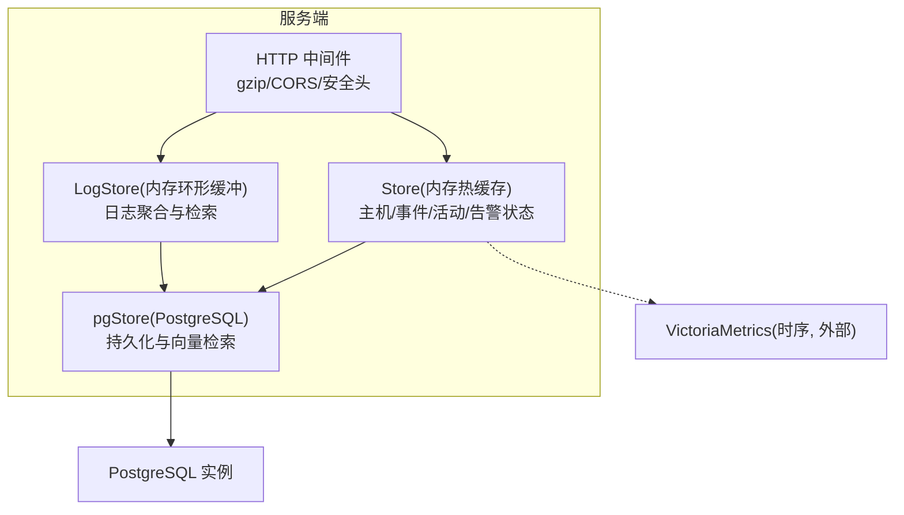
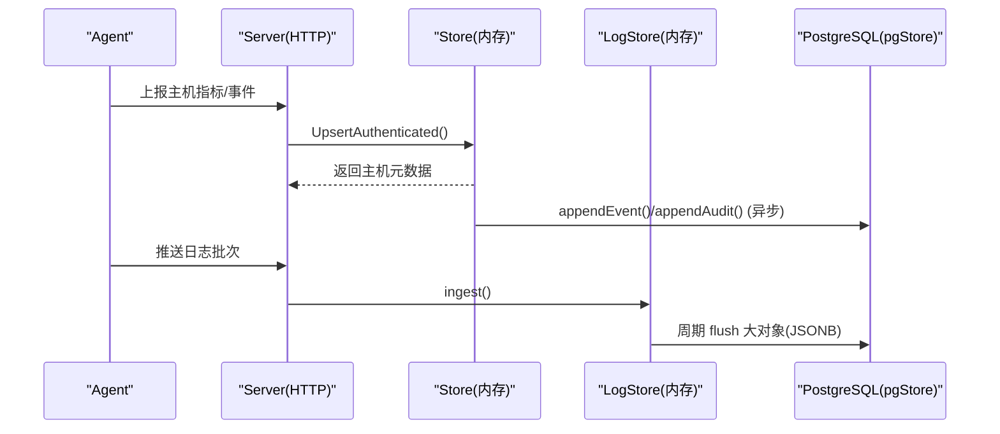
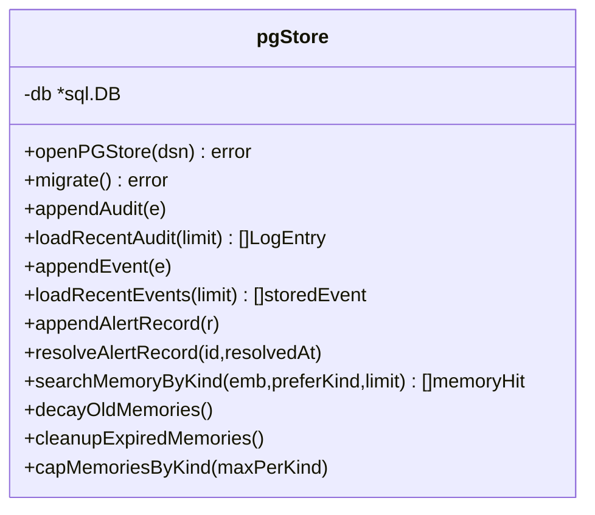
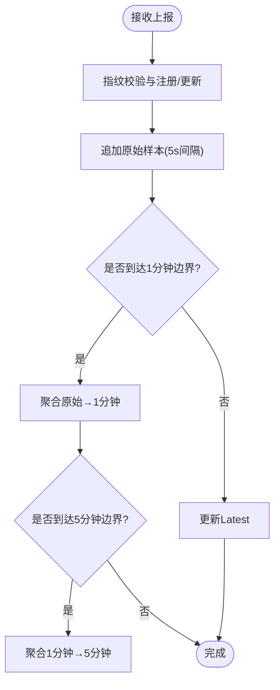
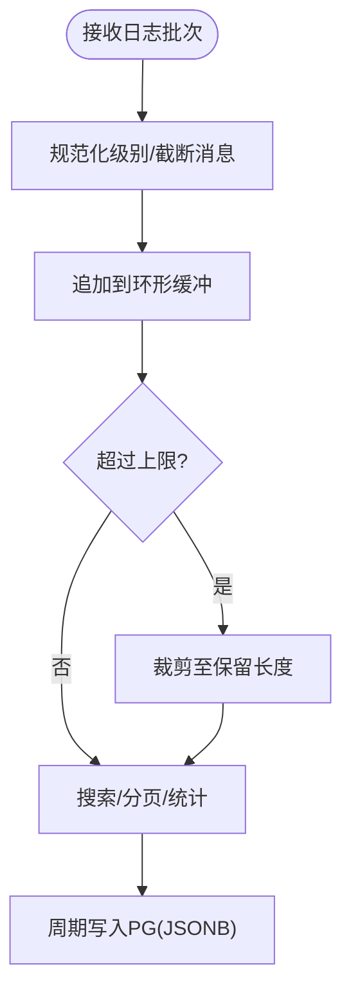
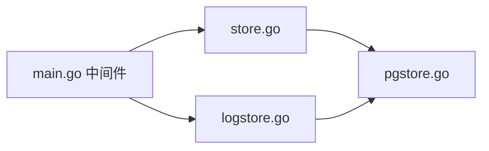

# 查询性能优化

<cite>
**本文引用的文件**   
- [cmd/server/pgstore.go](file://cmd/server/pgstore.go)
- [cmd/server/store.go](file://cmd/server/store.go)
- [cmd/server/db.go](file://cmd/server/db.go)
- [cmd/server/logstore.go](file://cmd/server/logstore.go)
- [cmd/server/main.go](file://cmd/server/main.go)
- [README.md](file://README.md)
</cite>

## 目录
1. [引言](#引言)
2. [项目结构](#项目结构)
3. [核心组件](#核心组件)
4. [架构总览](#架构总览)
5. [详细组件分析](#详细组件分析)
6. [依赖关系分析](#依赖关系分析)
7. [性能考量与优化建议](#性能考量与优化建议)
8. [故障排查指南](#故障排查指南)
9. [结论](#结论)
10. [附录](#附录)

## 引言
本指南聚焦于数据库查询性能优化，结合仓库中 PostgreSQL 存储层、内存热缓存与日志聚合的实现，系统性地给出 SQL 查询优化技巧、执行计划解读方法、索引使用检查、常见查询模式优化（分页、复杂 JOIN、子查询改写）、缓存策略设计（应用层/数据库查询/结果集）、批量操作优化（事务批处理、批量插入更新、并发控制），以及慢查询日志分析与性能监控指标、瓶颈识别方法与不同数据量级的最佳实践。

## 项目结构
本项目在服务端实现了“内存热缓存 + 可选 PostgreSQL 持久化”的混合存储：
- 内存层：主机元数据、事件环、活动日志、告警状态等以内存结构为主，提供低延迟读写。
- 持久层：PostgreSQL 用于审计日志、事件、主机元数据快照、会话、告警历史、SRE 工单/事件、AI 记忆向量等。
- 日志聚合：独立内存环形缓冲区，支持按主机/级别/关键词/时间范围检索与分页统计。

图示来源
- [cmd/server/main.go:72-200](file://cmd/server/main.go#L72-L200)
- [cmd/server/store.go:92-146](file://cmd/server/store.go#L92-L146)
- [cmd/server/logstore.go:12-41](file://cmd/server/logstore.go#L12-L41)
- [cmd/server/pgstore.go:43-75](file://cmd/server/pgstore.go#L43-L75)

章节来源
- [cmd/server/main.go:72-200](file://cmd/server/main.go#L72-L200)
- [cmd/server/store.go:92-146](file://cmd/server/store.go#L92-L146)
- [cmd/server/logstore.go:12-41](file://cmd/server/logstore.go#L12-L41)
- [cmd/server/pgstore.go:43-75](file://cmd/server/pgstore.go#L43-L75)

## 核心组件
- Store（内存热缓存）：维护主机列表、最近事件、活动日志、告警状态与历史；提供多级降采样历史窗口（原始/1分钟/5分钟）。
- LogStore（日志聚合）：内存环形缓冲，支持按条件过滤、分页与统计。
- pgStore（PostgreSQL 持久化）：连接池配置、DDL 迁移、JSONB 表、索引、向量检索、定时衰减与清理、批量写入。
- DB（内嵌快照）：已停用为持久主存，仅作为概念参考（当前统一落 PG/VM）。

章节来源
- [cmd/server/store.go:29-146](file://cmd/server/store.go#L29-L146)
- [cmd/server/logstore.go:21-41](file://cmd/server/logstore.go#L21-L41)
- [cmd/server/pgstore.go:43-75](file://cmd/server/pgstore.go#L43-L75)
- [cmd/server/db.go:14-24](file://cmd/server/db.go#L14-L24)

## 架构总览
下图展示了关键数据流：Agent 上报 → Store 内存热缓存 → 异步写入 pgStore → PostgreSQL 持久化；同时日志经 LogStore 聚合后周期性落盘到 PG。

图示来源
- [cmd/server/store.go:230-340](file://cmd/server/store.go#L230-L340)
- [cmd/server/logstore.go:59-78](file://cmd/server/logstore.go#L59-L78)
- [cmd/server/pgstore.go:304-332](file://cmd/server/pgstore.go#L304-L332)
- [cmd/server/pgstore.go:1176-1185](file://cmd/server/pgstore.go#L1176-L1185)

## 详细组件分析

### PostgreSQL 连接池与持久化层
- 连接池参数：最大打开连接数、空闲连接数、连接生命周期。
- 迁移与建表：启用 vector 扩展，创建多张 JSONB 表并建立必要索引。
- 写入路径：审计日志、事件、告警历史、终端录制元数据、AI 记忆向量等。
- 读取路径：加载最近审计/事件/告警、按 kind 优先检索 AI 记忆、相似案例余弦距离排序。

图示来源
- [cmd/server/pgstore.go:43-75](file://cmd/server/pgstore.go#L43-L75)
- [cmd/server/pgstore.go:77-212](file://cmd/server/pgstore.go#L77-L212)
- [cmd/server/pgstore.go:304-332](file://cmd/server/pgstore.go#L304-L332)
- [cmd/server/pgstore.go:381-409](file://cmd/server/pgstore.go#L381-L409)
- [cmd/server/pgstore.go:413-448](file://cmd/server/pgstore.go#L413-L448)
- [cmd/server/pgstore.go:661-723](file://cmd/server/pgstore.go#L661-L723)
- [cmd/server/pgstore.go:778-811](file://cmd/server/pgstore.go#L778-L811)
- [cmd/server/pgstore.go:815-853](file://cmd/server/pgstore.go#L815-L853)

章节来源
- [cmd/server/pgstore.go:43-75](file://cmd/server/pgstore.go#L43-L75)
- [cmd/server/pgstore.go:77-212](file://cmd/server/pgstore.go#L77-L212)
- [cmd/server/pgstore.go:304-332](file://cmd/server/pgstore.go#L304-L332)
- [cmd/server/pgstore.go:381-409](file://cmd/server/pgstore.go#L381-L409)
- [cmd/server/pgstore.go:413-448](file://cmd/server/pgstore.go#L413-L448)
- [cmd/server/pgstore.go:661-723](file://cmd/server/pgstore.go#L661-L723)
- [cmd/server/pgstore.go:778-811](file://cmd/server/pgstore.go#L778-L811)
- [cmd/server/pgstore.go:815-853](file://cmd/server/pgstore.go#L815-L853)

### 内存热缓存与多级降采样
- Store 维护主机元数据、最近事件、活动日志、告警状态与历史。
- 多级降采样：原始（约 1.5h）、1 分钟聚合（48h）、5 分钟聚合（30 天），根据时间跨度自动选择层级。
- 事件去重冷却：相同事件在冷却期内只记录一次，降低噪声。

图示来源
- [cmd/server/store.go:230-340](file://cmd/server/store.go#L230-L340)
- [cmd/server/store.go:355-573](file://cmd/server/store.go#L355-L573)
- [cmd/server/store.go:615-648](file://cmd/server/store.go#L615-L648)

章节来源
- [cmd/server/store.go:230-340](file://cmd/server/store.go#L230-L340)
- [cmd/server/store.go:355-573](file://cmd/server/store.go#L355-L573)
- [cmd/server/store.go:615-648](file://cmd/server/store.go#L615-L648)

### 日志聚合与检索
- LogStore 采用内存环形缓冲，限制容量，避免无限增长。
- 支持按主机、级别、关键词、时间范围过滤，并提供分页与统计（按级别分布、Top 主机、时间分布）。
- 周期性将聚合日志大对象写入 PG，减少 WAL 压力。

图示来源
- [cmd/server/logstore.go:59-78](file://cmd/server/logstore.go#L59-L78)
- [cmd/server/logstore.go:81-166](file://cmd/server/logstore.go#L81-L166)
- [cmd/server/logstore.go:182-200](file://cmd/server/logstore.go#L182-L200)
- [cmd/server/pgstore.go:1176-1185](file://cmd/server/pgstore.go#L1176-L1185)

章节来源
- [cmd/server/logstore.go:59-78](file://cmd/server/logstore.go#L59-L78)
- [cmd/server/logstore.go:81-166](file://cmd/server/logstore.go#L81-L166)
- [cmd/server/logstore.go:182-200](file://cmd/server/logstore.go#L182-L200)
- [cmd/server/pgstore.go:1176-1185](file://cmd/server/pgstore.go#L1176-L1185)

## 依赖关系分析
- HTTP 中间件负责压缩与安全头，提升带宽与安全性。
- Store 与 LogStore 作为内存热缓存，承担高频读写。
- pgStore 通过 sql.DB 连接池访问 PostgreSQL，提供持久化与向量检索能力。
- 启动时从 PG 加载最近审计/事件/告警/会话等，保障重启一致性。

图示来源
- [cmd/server/main.go:72-200](file://cmd/server/main.go#L72-L200)
- [cmd/server/store.go:92-146](file://cmd/server/store.go#L92-L146)
- [cmd/server/logstore.go:12-41](file://cmd/server/logstore.go#L12-L41)
- [cmd/server/pgstore.go:43-75](file://cmd/server/pgstore.go#L43-L75)

章节来源
- [cmd/server/main.go:72-200](file://cmd/server/main.go#L72-L200)
- [cmd/server/store.go:92-146](file://cmd/server/store.go#L92-L146)
- [cmd/server/logstore.go:12-41](file://cmd/server/logstore.go#L12-L41)
- [cmd/server/pgstore.go:43-75](file://cmd/server/pgstore.go#L43-L75)

## 性能考量与优化建议

### SQL 查询优化技巧
- EXPLAIN 分析
  - 使用 EXPLAIN ANALYZE 查看实际执行计划与耗时，关注全表扫描、嵌套循环、哈希连接、排序/聚合成本。
  - 针对高开销节点（Seq Scan、Hash Join、Sort）进行针对性优化。
- 执行计划解读
  - 关注 Rows Removed by Filter、Actual Time、Loops 次数，定位热点路径。
  - 对 IN/EXISTS 子查询，尽量改写为 JOIN 或物化视图，避免重复计算。
- 索引使用情况检查
  - 使用 pg_stat_user_indexes 与 pg_stat_user_tables 观察索引命中与扫描行数。
  - 关注未使用的索引与碎片率，定期 VACUUM/ANALYZE 保持统计信息准确。

章节来源
- [cmd/server/pgstore.go:77-212](file://cmd/server/pgstore.go#L77-L212)

### 常见查询模式优化
- 分页查询优化
  - 使用基于游标/键的分页（WHERE id > last_id ORDER BY id LIMIT N），避免 OFFSET 在大偏移时的性能退化。
  - 在排序列上建立合适索引，确保覆盖排序字段。
- 复杂 JOIN 优化
  - 先过滤再 JOIN，缩小驱动表规模；必要时使用物化临时表或 CTE 预聚合。
  - 合理设置 join_collapse_limit、work_mem，避免磁盘级排序/哈希。
- 子查询改写
  - 将相关子查询改写为 JOIN 或 LATERAL，减少重复执行。
  - 使用 EXISTS 替代 IN 当子查询可能返回大量行时。

章节来源
- [cmd/server/pgstore.go:304-332](file://cmd/server/pgstore.go#L304-L332)
- [cmd/server/pgstore.go:381-409](file://cmd/server/pgstore.go#L381-L409)
- [cmd/server/pgstore.go:413-448](file://cmd/server/pgstore.go#L413-L448)

### 缓存策略设计
- 应用层缓存
  - 使用内存热缓存（Store/LogStore）承载热点数据，缩短响应时间。
  - 注意并发安全与一致性，必要时引入版本号或失效策略。
- 数据库查询缓存
  - 利用 PG 的共享缓冲与索引加速，避免频繁解析与规划。
  - 对热点查询使用 Prepared Statement，减少网络往返与序列化开销。
- 结果集缓存
  - 对读多写少的报表类查询，可引入短期缓存（如内存 map + TTL）。
  - 注意缓存穿透与雪崩防护（空值缓存、随机过期、限流降级）。

章节来源
- [cmd/server/store.go:230-340](file://cmd/server/store.go#L230-L340)
- [cmd/server/logstore.go:59-78](file://cmd/server/logstore.go#L59-L78)

### 批量操作优化
- 事务批处理
  - 将多条写入合并到一个事务，减少提交开销与 WAL 压力。
  - 使用 ON CONFLICT 实现幂等写入，避免重复插入。
- 批量插入更新
  - 使用批量 INSERT/UPDATE 语句或 COPY 协议，提高吞吐。
  - 调整 work_mem、maintenance_work_mem 以支持更大内存排序/哈希。
- 并发控制
  - 合理设置连接池大小（MaxOpenConns/MaxIdleConns/ConnMaxLifetime），避免连接风暴。
  - 对热点行加锁需谨慎，考虑乐观锁或分段写入。

章节来源
- [cmd/server/pgstore.go:43-75](file://cmd/server/pgstore.go#L43-L75)
- [cmd/server/pgstore.go:237-263](file://cmd/server/pgstore.go#L237-L263)
- [cmd/server/pgstore.go:472-491](file://cmd/server/pgstore.go#L472-L491)
- [cmd/server/pgstore.go:515-534](file://cmd/server/pgstore.go#L515-L534)

### 慢查询日志分析与性能监控指标
- 慢查询日志
  - 开启 log_min_duration_statement，记录慢查询；结合 pg_stat_statements 分析热点 SQL。
  - 定期导出与分析，形成慢查询知识库与优化清单。
- 性能监控指标
  - 连接池利用率、等待事件、锁等待、WAL 生成速率、索引命中率、表膨胀率。
  - 对向量检索场景，关注相似度计算耗时与 top-N 召回质量。

章节来源
- [cmd/server/pgstore.go:77-212](file://cmd/server/pgstore.go#L77-L212)
- [cmd/server/pgstore.go:661-723](file://cmd/server/pgstore.go#L661-L723)

### 瓶颈识别方法
- 定位热点路径：通过 EXPLAIN ANALYZE 与 pg_stat_statements 找出最耗时的 SQL。
- 资源瓶颈：CPU/IO/内存/网络，结合系统监控与数据库内部统计。
- 锁与并发：观察锁等待与长事务，评估是否需要拆分事务或优化并发模型。

章节来源
- [cmd/server/pgstore.go:77-212](file://cmd/server/pgstore.go#L77-L212)

### 不同数据量级的优化建议与最佳实践
- 小规模（单机/少量主机）
  - 使用内存热缓存 + 轻量 PG 持久化，关闭不必要的索引，简化查询。
- 中等规模（数百主机）
  - 引入多级降采样与分页，优化热点查询，调整连接池与工作内存。
- 大规模（数千主机以上）
  - 时序数据外置到 VictoriaMetrics，关系数据落 PG；分库分表与归档策略；向量检索按需启用并限制 Top-K。

章节来源
- [README.md:1096-1116](file://README.md#L1096-L1116)

## 故障排查指南
- 连接失败与回落
  - 若 PG 不可用，服务回落到内存模式；检查 DSN 与网络连通性。
- 写入失败与重试
  - 审计日志/事件写入失败会记录警告；检查 PG 负载与 WAL 压力。
- 向量检索异常
  - 确认 vector 扩展已启用，embedding 维度正确；检查相似度阈值与优先级权重。

章节来源
- [cmd/server/pgstore.go:17-30](file://cmd/server/pgstore.go#L17-L30)
- [cmd/server/pgstore.go:304-332](file://cmd/server/pgstore.go#L304-L332)
- [cmd/server/pgstore.go:661-723](file://cmd/server/pgstore.go#L661-L723)

## 结论
通过内存热缓存与 PostgreSQL 持久化的协同，系统在中小规模下具备良好性能与可扩展性。结合 SQL 优化、索引策略、批量写入与连接池调优，可有效提升查询性能与稳定性。对于超大规模场景，建议将时序数据外置，并对关系数据实施分层与归档策略。

## 附录
- 关键设计与性能要点
  - gzip 压缩、多级降采样、分页渲染、统一存储（PG+VM）。
  - 单实例稳定支撑约 3000 台主机，万级建议外接时序库。

章节来源
- [README.md:1096-1116](file://README.md#L1096-L1116)