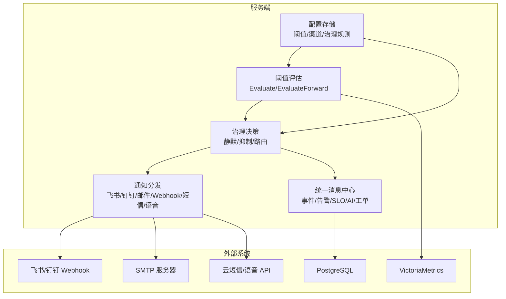
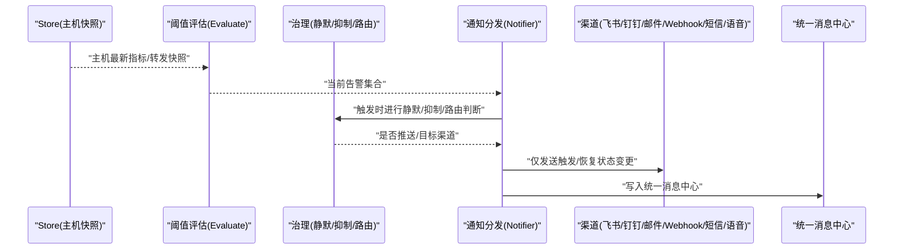
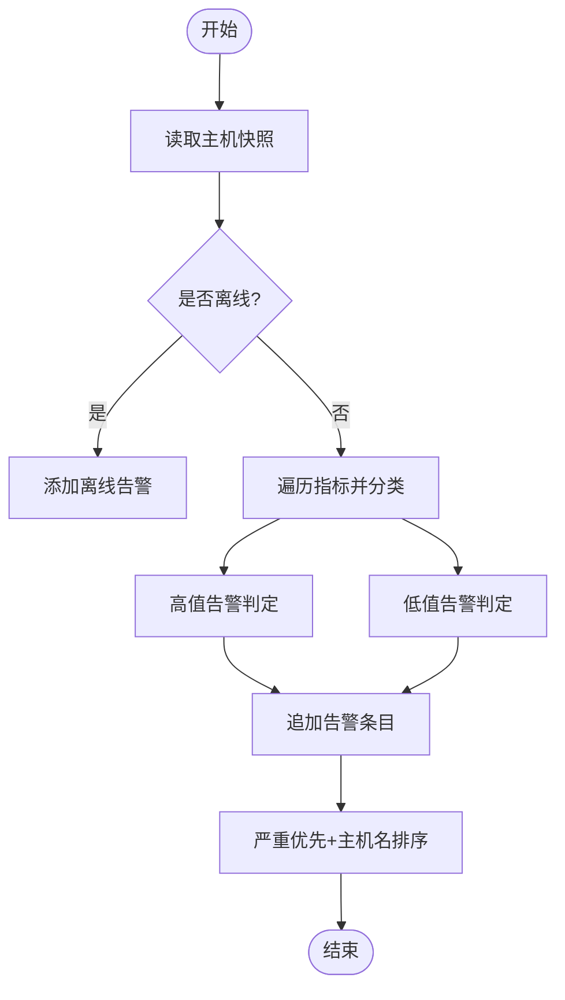
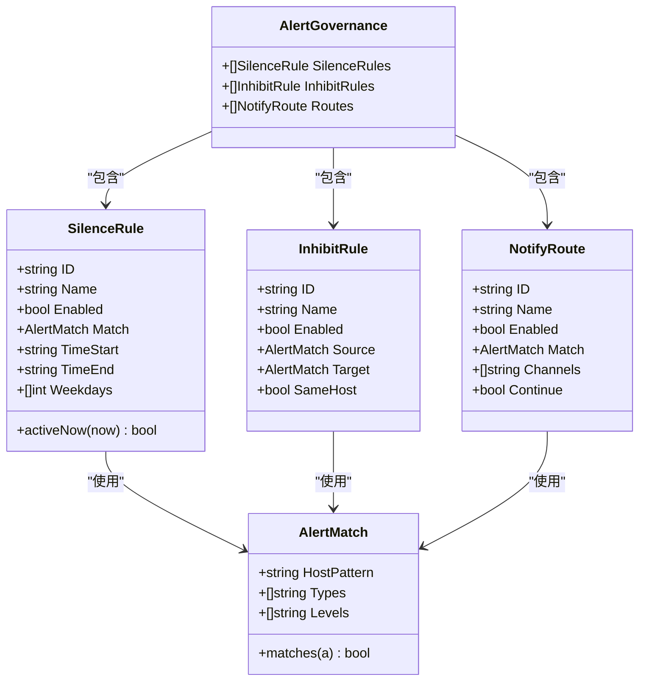
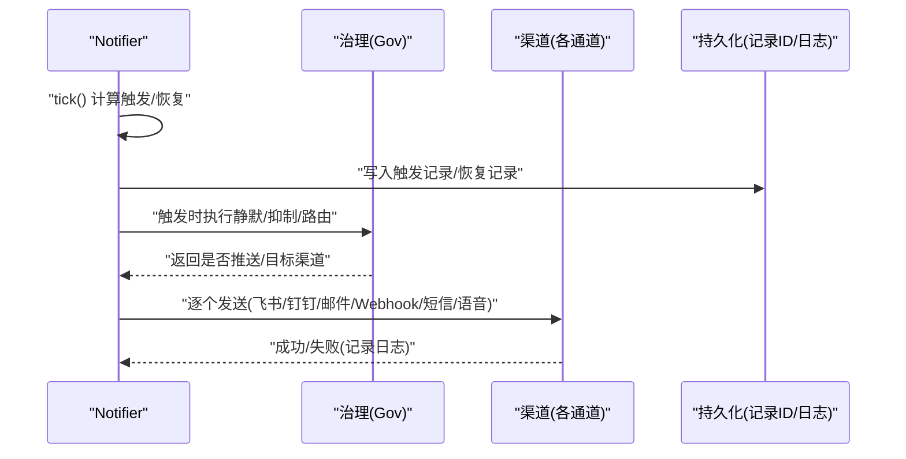
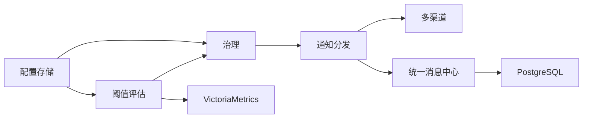

# 告警优化

<cite>
**本文引用的文件列表**
- [README.md](file://README.md)
- [alerts.go](file://cmd/server/alerts.go)
- [alertgov.go](file://cmd/server/alertgov.go)
- [notify.go](file://cmd/server/notify.go)
- [config.go](file://cmd/server/config.go)
- [message.go](file://cmd/server/message.go)
</cite>

## 目录
1. [引言](#引言)
2. [项目结构](#项目结构)
3. [核心组件](#核心组件)
4. [架构总览](#架构总览)
5. [详细组件分析](#详细组件分析)
6. [依赖关系分析](#依赖关系分析)
7. [性能考量](#性能考量)
8. [故障排查指南](#故障排查指南)
9. [结论](#结论)
10. [附录](#附录)

## 引言
本指南面向运维与 SRE 团队，围绕 AIOps Monitor 的告警体系提供“可落地”的优化策略与实践建议。内容覆盖：
- 告警规则调优：阈值动态调整、降噪技术、聚合方法
- 告警治理机制：去重、抑制、升级策略
- 根因分析方法：关联分析、趋势预测、异常检测
- 多渠道通知配置与优化：邮件、Webhook、IM 机器人、短信、语音电话
- 效果评估与持续改进

## 项目结构
本项目为 Go 单二进制服务端 + Agent 采集的监控平台。告警相关能力集中在服务端模块中，包括阈值评估、治理决策、通知分发与统一消息中心。

图表来源
- [alerts.go:204-464](file://cmd/server/alerts.go#L204-L464)
- [alertgov.go:147-194](file://cmd/server/alertgov.go#L147-L194)
- [notify.go:196-276](file://cmd/server/notify.go#L196-L276)
- [message.go:23-76](file://cmd/server/message.go#L23-L76)
- [config.go:409-491](file://cmd/server/config.go#L409-L491)

章节来源
- [README.md:138-176](file://README.md#L138-L176)

## 核心组件
- 阈值评估器：基于主机指标与转发指标计算告警集合，支持“高值告警”和“低值告警”两类判定逻辑。
- 告警治理器：在通知下发前执行静默（时段/星期）、抑制（主因抑制衍生）、路由（按级别/主机/类型分流）。
- 通知分发器：维护触发/恢复状态，仅发送状态变更；对接多通道（飞书、钉钉、邮件、自定义 Webhook、短信、语音电话）。
- 统一消息中心：汇聚事件、告警、SLO、自动修复、AI、工单等通知，持久化到数据库，支持未读计数与深链跳转。
- 配置存储：集中管理阈值、渠道、治理规则，并提供零值回退默认的安全兜底。

章节来源
- [alerts.go:165-202](file://cmd/server/alerts.go#L165-L202)
- [alertgov.go:20-89](file://cmd/server/alertgov.go#L20-L89)
- [notify.go:26-54](file://cmd/server/notify.go#L26-L54)
- [message.go:23-44](file://cmd/server/message.go#L23-L44)
- [config.go:75-137](file://cmd/server/config.go#L75-L137)

## 架构总览
下图展示了从指标采集到告警触达的关键流程，以及治理与消息中心的介入点。

图表来源
- [notify.go:102-158](file://cmd/server/notify.go#L102-L158)
- [alertgov.go:147-194](file://cmd/server/alertgov.go#L147-L194)
- [message.go:49-76](file://cmd/server/message.go#L49-L76)

## 详细组件分析

### 阈值评估与告警生成
- 评估范围：主机资源（CPU/内存/磁盘/IO/IOPS/GPU/负载/进程数变化/连接数）、拨测（Ping/TCP/HTTP/进程存活）、API 业务（可用率/平均响应/P95/吞吐）、编排任务（失败次数/超时）、端口转发（连接数/带宽/错误率/延迟）。
- 判定逻辑：
  - 高值告警：当指标 ≥ 阈值时触发（如 CPU、内存、磁盘、GPU、负载、IOPS、延迟等）。
  - 低值告警：当指标 ≤ 阈值时触发（如可用率、吞吐量）。
- 去重键：以 host_id/type/scope 作为唯一键，避免同一子目标的重复告警刷屏。
- 排序：严重优先，其次按主机名排序，便于快速定位关键问题。

图表来源
- [alerts.go:204-464](file://cmd/server/alerts.go#L204-L464)

章节来源
- [alerts.go:165-202](file://cmd/server/alerts.go#L165-L202)
- [alerts.go:204-464](file://cmd/server/alerts.go#L204-L464)

### 告警治理机制（静默/抑制/路由）
- 静默规则：支持按主机/类型/级别匹配，并可设置生效时段（支持跨天）与星期，命中后不推送通知但仍在 UI 展示。
- 抑制规则：当存在匹配的源告警活跃时，抑制目标告警的通知（例如主机离线抑制其自身 CPU/内存/磁盘告警），有效降低风暴。
- 通知路由：按匹配条件选择目标渠道（飞书/钉钉/邮件/自定义 Webhook），支持继续匹配后续规则；未命中任何路由则默认全部启用渠道。
- 恢复通知一律照发，避免“永远告警”错觉。

图表来源
- [alertgov.go:20-89](file://cmd/server/alertgov.go#L20-L89)
- [alertgov.go:147-194](file://cmd/server/alertgov.go#L147-L194)

章节来源
- [alertgov.go:147-194](file://cmd/server/alertgov.go#L147-L194)

### 通知分发与多渠道优化
- 状态机：维护 active/since/recordIDs，仅在触发或恢复时发送，避免持续刷屏。
- 治理前置：触发阶段先执行静默/抑制，再按路由选择渠道；恢复阶段跳过治理直接推送。
- 渠道实现：
  - IM 机器人：飞书文本消息、钉钉加签文本消息。
  - 邮件：HTML 模板，支持多收件人。
  - 自定义 Webhook：支持 GET/POST、JSON/文本、自定义头与模板。
  - 短信：阿里云/华为云/腾讯云，签名规范与参数注入适配。
  - 语音电话：TTS 播报告警内容，适配多云厂商。
- 安全与健壮性：出站请求受 SSRF 防护；HTTP 客户端带超时；错误日志记录与重试隔离。

图表来源
- [notify.go:102-158](file://cmd/server/notify.go#L102-L158)
- [notify.go:196-276](file://cmd/server/notify.go#L196-L276)

章节来源
- [notify.go:26-54](file://cmd/server/notify.go#L26-L54)
- [notify.go:196-276](file://cmd/server/notify.go#L196-L276)

### 统一消息中心
- 功能：将事件、告警、SLO、自动修复、AI、工单等通知汇聚为统一收件箱，支持未读计数、深链跳转、一键已读/全部已读。
- 持久化：通过 kv_state 持久化，刷新不丢。
- 入口：面板右上角铃铛图标。

章节来源
- [message.go:23-76](file://cmd/server/message.go#L23-L76)
- [README.md:790-793](file://README.md#L790-L793)

### 配置与阈值回退
- 阈值配置：支持 27 组细粒度 warn/crit 阈值，覆盖主机、拨测、API、任务、转发五大维度。
- 零值回退：任何 0 值（未配置/表单留空/旧配置缺字段）会被自动回退为标准默认值，避免误报。
- 环境变量覆盖：Docker Compose 部署可通过 AIOPS_* 环境变量覆盖配置项，无需修改 JSON。

章节来源
- [config.go:75-137](file://cmd/server/config.go#L75-L137)
- [config.go:176-280](file://cmd/server/config.go#L176-L280)
- [config.go:618-653](file://cmd/server/config.go#L618-L653)
- [README.md:514-547](file://README.md#L514-L547)

## 依赖关系分析
- 组件耦合：
  - 阈值评估依赖主机快照与转发快照，输出告警集合。
  - 治理层依赖配置中的三类规则，对触发告警做决策。
  - 通知分发依赖治理结果与渠道配置，仅发送状态变更。
  - 统一消息中心独立于通知分发，用于用户侧聚合展示。
- 外部依赖：
  - PostgreSQL：持久化消息中心、配置（可选）、告警记录。
  - VictoriaMetrics：时序数据（指标/趋势）。
  - 第三方服务：飞书/钉钉 Webhook、SMTP、云短信/语音 API。

图表来源
- [notify.go:102-158](file://cmd/server/notify.go#L102-L158)
- [alertgov.go:147-194](file://cmd/server/alertgov.go#L147-L194)
- [message.go:49-76](file://cmd/server/message.go#L49-L76)
- [config.go:409-491](file://cmd/server/config.go#L409-L491)

章节来源
- [notify.go:102-158](file://cmd/server/notify.go#L102-L158)
- [alertgov.go:147-194](file://cmd/server/alertgov.go#L147-L194)
- [message.go:49-76](file://cmd/server/message.go#L49-L76)
- [config.go:409-491](file://cmd/server/config.go#L409-L491)

## 性能考量
- 仅发送状态变更：避免持续刷屏，降低网络与下游压力。
- 锁粒度控制：在 tick 内计算转换，随后在锁外进行网络 I/O，减少阻塞。
- 排序与去重：按严重级别与主机名排序，提升可读性与处理效率；以 host/type/scope 去重，避免重复。
- 通道并行：各通道独立发送与错误记录，互不影响。

[本节为通用指导，不直接分析具体文件]

## 故障排查指南
- 通知失败：
  - 检查渠道配置（URL/密钥/端口/签名）是否正确。
  - 查看系统日志中对应通道的失败记录（如飞书/钉钉/邮件/自定义 Webhook/短信/语音）。
- 告警未推送：
  - 确认是否被静默规则命中（含生效时段与星期）。
  - 确认是否被抑制规则命中（主因告警活跃时抑制衍生告警）。
  - 确认路由是否命中且目标渠道已启用。
- 恢复未收到：
  - 恢复通知不受静默影响，若未收到需检查渠道连通性与错误日志。
- 阈值误报/漏报：
  - 检查阈值是否为 0（将被回退默认值），必要时手动调整。
  - 核对指标类型（高值/低值）与阈值方向是否一致。

章节来源
- [notify.go:196-276](file://cmd/server/notify.go#L196-L276)
- [alertgov.go:147-194](file://cmd/server/alertgov.go#L147-L194)
- [config.go:176-280](file://cmd/server/config.go#L176-L280)

## 结论
AIOps Monitor 的告警体系具备完善的阈值评估、治理决策与多渠道通知能力。通过合理的阈值调优、治理规则设计与渠道优化，可有效降低噪音、提升告警质量与处置效率。结合统一消息中心与持续改进实践，可构建稳定高效的告警闭环。

[本节为总结性内容，不直接分析具体文件]

## 附录

### 告警规则调优策略
- 阈值动态调整
  - 基于历史基线与波动区间动态调整 warn/crit，避免固定阈值的僵化。
  - 针对“低值告警”（可用率、吞吐）采用反向阈值逻辑，确保方向正确。
- 告警降噪技术
  - 利用静默规则在夜间或非工作时间屏蔽非关键告警。
  - 使用抑制规则在主因告警活跃时抑制衍生告警，避免风暴。
- 告警聚合方法
  - 以 host/type/scope 为键进行去重，避免同一子目标重复告警。
  - 对同类告警进行时间窗口聚合，合并为一条聚合告警。

章节来源
- [alerts.go:165-202](file://cmd/server/alerts.go#L165-L202)
- [alertgov.go:147-194](file://cmd/server/alertgov.go#L147-L194)

### 告警治理机制
- 去重：host_id/type/scope 组合键保证唯一性。
- 抑制：主因告警（如主机离线）抑制同主机衍生告警。
- 升级策略：严重级别优先推送至强提醒渠道（如语音电话/钉钉），警告级别走弱提醒渠道（如飞书）。

章节来源
- [notify.go:102-158](file://cmd/server/notify.go#L102-L158)
- [alertgov.go:147-194](file://cmd/server/alertgov.go#L147-L194)

### 根因分析方法
- 关联分析：结合主机离线与衍生告警的抑制规则，快速定位主因。
- 趋势预测：利用 VictoriaMetrics 时序数据进行趋势分析与异常检测。
- 异常检测：基于进程数变化、连接数突增等指标识别潜在异常。

章节来源
- [alerts.go:204-464](file://cmd/server/alerts.go#L204-L464)

### 多渠道通知配置与优化
- 邮件：配置 SMTP 服务器、端口、账号与授权码，注意 465 隐式 TLS 与 587 STARTTLS 的区别。
- Webhook：自定义 HTTP(S) 请求，支持 JSON/文本、自定义头与模板。
- IM 机器人：飞书/钉钉 Webhook，钉钉需配置加签 Secret。
- 短信/语音：选择云服务商，配置 AccessKey/SecretKey、签名/模板、接收号码，注意不同厂商的参数差异。

章节来源
- [notify.go:196-276](file://cmd/server/notify.go#L196-L276)
- [config.go:15-73](file://cmd/server/config.go#L15-L73)

### 效果评估与持续改进
- 指标：告警数量、误报率、平均恢复时间、渠道送达率。
- 改进：定期回顾静默/抑制/路由规则，调整阈值与渠道优先级，优化通知模板与深链跳转。

[本节为通用指导，不直接分析具体文件]