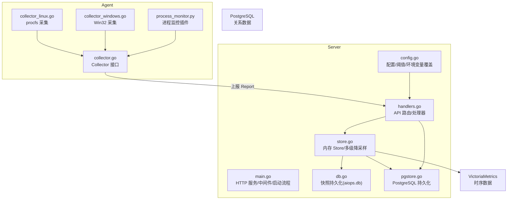
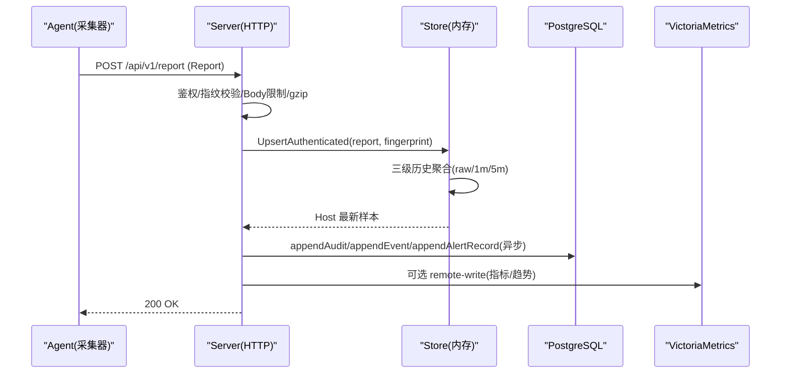
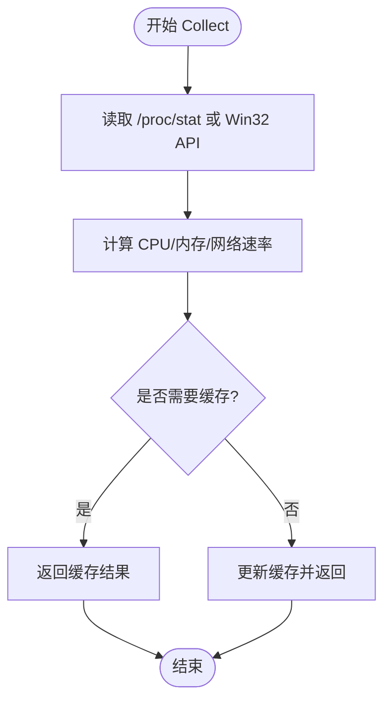
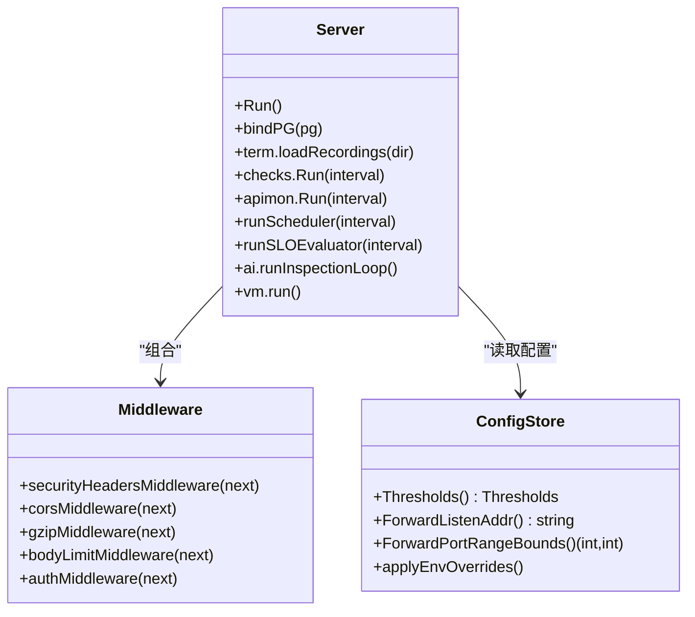
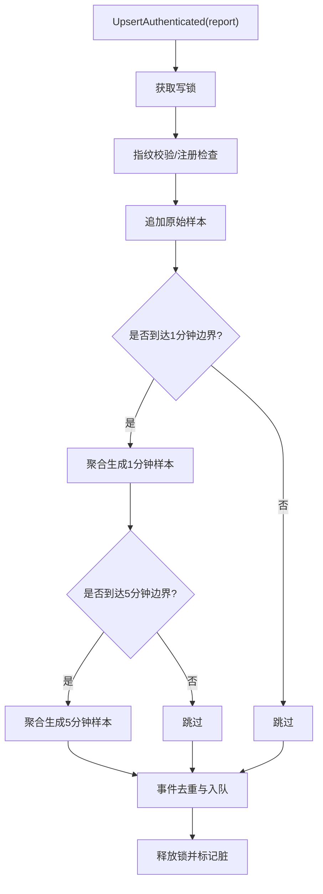
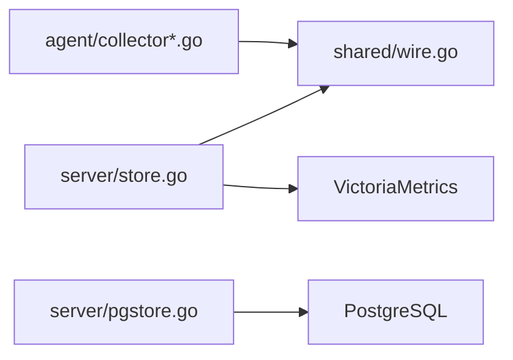

# 性能分析

<cite>
**本文引用的文件**   
- [cmd/server/main.go](file://cmd/server/main.go)
- [cmd/server/store.go](file://cmd/server/store.go)
- [cmd/server/config.go](file://cmd/server/config.go)
- [cmd/server/db.go](file://cmd/server/db.go)
- [cmd/server/handlers.go](file://cmd/server/handlers.go)
- [cmd/server/pgstore.go](file://cmd/server/pgstore.go)
- [cmd/agent/collector.go](file://cmd/agent/collector.go)
- [cmd/agent/collector_linux.go](file://cmd/agent/collector_linux.go)
- [cmd/agent/collector_windows.go](file://cmd/agent/collector_windows.go)
- [plugins/process_monitor.py](file://plugins/process_monitor.py)
- [go.mod](file://go.mod)
- [README.md](file://README.md)
</cite>

## 目录
1. [引言](#引言)
2. [项目结构](#项目结构)
3. [核心组件](#核心组件)
4. [架构总览](#架构总览)
5. [详细组件分析](#详细组件分析)
6. [依赖关系分析](#依赖关系分析)
7. [性能考量与优化](#性能考量与优化)
8. [故障排查指南](#故障排查指南)
9. [结论](#结论)
10. [附录](#附录)

## 引言
本指南面向 AIOps Monitor 的性能分析与调优，覆盖热点代码定位、慢请求分析、资源争用检测；结合 Go 生态工具（pprof、trace）与 VictoriaMetrics 时序能力，给出数据库查询优化、内存泄漏检测与 GC 调优策略；并给出分布式环境下的监控与追踪集成方案。文档中的实现细节均基于仓库源码与说明文档进行归纳。

## 项目结构
本项目采用“单二进制服务端 + 零依赖 Agent”的架构：
- 服务端：Go 编写，提供 HTTP API、WebSocket 终端、告警引擎、SLO/事件/工单、AI 巡检等能力；存储统一为 PostgreSQL（关系数据）+ VictoriaMetrics（时序数据）。
- Agent：三平台原生采集器（Linux procfs/syscall、Windows Win32 API、macOS sysctl），周期性上报基础指标与插件结果。
- 插件层：Python 脚本通过 SDK 输出指标与事件，进程级隔离执行。

图示来源
- [cmd/server/main.go:227-355](file://cmd/server/main.go#L227-L355)
- [cmd/server/store.go:230-340](file://cmd/server/store.go#L230-L340)
- [cmd/server/config.go:616-651](file://cmd/server/config.go#L616-L651)
- [cmd/agent/collector.go:1-31](file://cmd/agent/collector.go#L1-L31)
- [cmd/agent/collector_linux.go:76-92](file://cmd/agent/collector_linux.go#L76-L92)
- [cmd/agent/collector_windows.go:398-447](file://cmd/agent/collector_windows.go#L398-L447)
- [plugins/process_monitor.py:38-85](file://plugins/process_monitor.py#L38-L85)

章节来源
- [README.md:1096-1116](file://README.md#L1096-L1116)

## 核心组件
- 采集器（Agent）
  - 接口定义与通用辅助函数位于 collector.go；Linux/Windows/macOS 平台特定实现分别位于对应文件。
  - Linux 使用 /proc/stat、/proc/meminfo 等计算 CPU/内存/网络速率；Windows 使用 Win32 API 枚举进程与磁盘。
- 服务端
  - main.go 负责 HTTP 服务、中间件链（安全头、CORS、gzip、Body 限制）、优雅关闭、TLS 启动、后台协程（告警、拨测、API 监控、调度、SLO、AI 巡检、VM 写入）。
  - store.go 维护 Host 列表、三级历史缓存（原始/1分钟/5分钟聚合）、事件环、活动日志、告警状态与历史。
  - config.go 管理服务器配置、阈值回填、环境变量覆盖、端口转发范围与监听地址等。
  - db.go 提供 aiops.db 快照持久化（压缩 JSON，原子写入）。
  - pgstore.go 对接 PostgreSQL，持久化审计日志、事件、主机元数据、告警记录等。
- 插件
  - process_monitor.py 示例展示进程匹配、CPU/RSS 采样与指标输出。

章节来源
- [cmd/agent/collector.go:1-31](file://cmd/agent/collector.go#L1-L31)
- [cmd/agent/collector_linux.go:76-92](file://cmd/agent/collector_linux.go#L76-L92)
- [cmd/agent/collector_windows.go:398-447](file://cmd/agent/collector_windows.go#L398-L447)
- [cmd/server/main.go:227-355](file://cmd/server/main.go#L227-L355)
- [cmd/server/store.go:230-340](file://cmd/server/store.go#L230-L340)
- [cmd/server/config.go:616-651](file://cmd/server/config.go#L616-L651)
- [cmd/server/db.go:151-179](file://cmd/server/db.go#L151-L179)
- [plugins/process_monitor.py:38-85](file://plugins/process_monitor.py#L38-L85)

## 架构总览
下图展示了从 Agent 采集到服务端处理、存储与对外服务的整体链路，以及关键中间件与后台任务。

图示来源
- [cmd/server/main.go:227-355](file://cmd/server/main.go#L227-L355)
- [cmd/server/store.go:230-340](file://cmd/server/store.go#L230-L340)
- [cmd/server/pgstore.go:1-200](file://cmd/server/pgstore.go#L1-L200)

## 详细组件分析

### 采集器（Agent）
- 设计要点
  - Collector 接口抽象平台差异，构建期选择具体实现。
  - Linux 采集器读取 /proc/stat 计算 CPU 百分比，读取 /proc/meminfo 解析内存与 Swap，rate() 辅助函数用于计数器差值转速率。
  - Windows 采集器通过 Win32 API 枚举进程与本地磁盘，估算系统负载（EWMA）。
- 性能关注点
  - 避免频繁系统调用开销：对变化缓慢的数据（如磁盘使用率）设置缓存 TTL。
  - 进程枚举在 Windows 上动态扩容缓冲区，防止溢出。
  - 插件进程隔离，超时可杀，不影响核心。

图示来源
- [cmd/agent/collector.go:18-31](file://cmd/agent/collector.go#L18-L31)
- [cmd/agent/collector_linux.go:76-92](file://cmd/agent/collector_linux.go#L76-L92)
- [cmd/agent/collector_windows.go:398-447](file://cmd/agent/collector_windows.go#L398-L447)

章节来源
- [cmd/agent/collector.go:1-31](file://cmd/agent/collector.go#L1-L31)
- [cmd/agent/collector_linux.go:76-92](file://cmd/agent/collector_linux.go#L76-L92)
- [cmd/agent/collector_windows.go:398-447](file://cmd/agent/collector_windows.go#L398-L447)

### 服务端 HTTP 栈与中间件
- 中间件链
  - 安全头（X-Content-Type-Options、X-Frame-Options、CSP 等）
  - CORS 白名单控制
  - gzip 压缩（排除 WebSocket/代理/转发流）
  - Body 大小限制（防内存耗尽）
  - 认证中间件
- 启动流程
  - 强制要求 AIOPS_POSTGRES_DSN 与 AIOPS_VM_URL 环境变量，未配置拒绝启动。
  - 连接 PostgreSQL（带重试窗口），绑定审计与事件落库。
  - 启动后台协程：告警评估、自定义拨测、API 监控、定时任务、SLO 评估、AI 巡检、VM 写入。
  - 优雅关闭：停止接受新连接，等待活跃请求，最终刷新 PG 后退出。

图示来源
- [cmd/server/main.go:72-205](file://cmd/server/main.go#L72-L205)
- [cmd/server/main.go:227-355](file://cmd/server/main.go#L227-L355)
- [cmd/server/config.go:616-651](file://cmd/server/config.go#L616-L651)

章节来源
- [cmd/server/main.go:72-205](file://cmd/server/main.go#L72-L205)
- [cmd/server/main.go:227-355](file://cmd/server/main.go#L227-L355)
- [cmd/server/config.go:616-651](file://cmd/server/config.go#L616-L651)

### 数据存储与多级降采样
- 内存 Store
  - Host 列表与 Latest 样本；三级历史：原始（~1.5h）、1分钟聚合（48h）、5分钟聚合（30天）。
  - UpsertAuthenticated 在单一写锁下完成指纹校验、样本追加与聚合，避免 TOCTOU 与双重锁开销。
  - 事件去重：相同事件在冷却期内只记录一次。
  - 活动日志与告警状态/历史记录持久化到 PG。
- 快照持久化（aiops.db）
  - 将内存状态序列化为 gzip 压缩 JSON，原子写入（tmp + rename），支持自动保存与优雅关闭时 flush。
- PostgreSQL
  - 作为关系数据唯一事实源（配置/用户/审计/事件/工单/会话），并在启动时回填内存态。

图示来源
- [cmd/server/store.go:230-340](file://cmd/server/store.go#L230-L340)
- [cmd/server/db.go:151-179](file://cmd/server/db.go#L151-L179)

章节来源
- [cmd/server/store.go:230-340](file://cmd/server/store.go#L230-L340)
- [cmd/server/db.go:151-179](file://cmd/server/db.go#L151-L179)

### 插件与进程监控
- 插件以子进程方式运行，崩溃/超时不影响核心。
- process_monitor.py 示例：
  - 按名称匹配目标进程，建立 CPU 基线后间隔采样差值。
  - 输出进程数量、CPU 使用率、RSS 内存占用等指标；缺失进程产生 critical 事件。

章节来源
- [plugins/process_monitor.py:38-85](file://plugins/process_monitor.py#L38-L85)

## 依赖关系分析
- 外部依赖
  - go.mod 显示仅引入少量第三方库（二维码、PDF、PostgreSQL 驱动），核心功能尽量零依赖。
- 内部耦合
  - server 与 agent 共享 shared/wire.go 契约，避免协议漂移。
  - 存储后端统一为 PG + VM，aiops.db 已停用（仅保留快照逻辑用于兼容与过渡）。

图示来源
- [go.mod:1-10](file://go.mod#L1-L10)
- [README.md:1096-1104](file://README.md#L1096-L1104)

章节来源
- [go.mod:1-10](file://go.mod#L1-L10)
- [README.md:1096-1104](file://README.md#L1096-L1104)

## 性能考量与优化

### 热点代码定位
- 建议方法
  - 使用 pprof 的 CPU/Block/Mutex 分析定位热点路径与锁竞争。
  - 针对高频上报路径（UpsertAuthenticated、聚合、事件去重）进行火焰图分析。
  - 结合 trace 观察 HTTP 请求耗时分布与 goroutine 阻塞点。
- 参考实现位置
  - 上报主路径：[cmd/server/store.go:230-340](file://cmd/server/store.go#L230-L340)
  - 聚合算法：[cmd/server/store.go:355-573](file://cmd/server/store.go#L355-L573)
  - 事件去重与入队：[cmd/server/store.go:309-338](file://cmd/server/store.go#L309-L338)

章节来源
- [cmd/server/store.go:230-340](file://cmd/server/store.go#L230-L340)
- [cmd/server/store.go:355-573](file://cmd/server/store.go#L355-L573)

### 慢请求分析
- 建议方法
  - 使用 pprof 的 profile 与 trace 捕获慢请求，结合 HTTP 中间件统计各阶段耗时。
  - 关注长连接（终端/转发/代理）与批量上报场景。
- 参考实现位置
  - 中间件链与 gzip 处理：[cmd/server/main.go:72-205](file://cmd/server/main.go#L72-L205)
  - 启动与后台任务：[cmd/server/main.go:227-355](file://cmd/server/main.go#L227-L355)

章节来源
- [cmd/server/main.go:72-205](file://cmd/server/main.go#L72-L205)
- [cmd/server/main.go:227-355](file://cmd/server/main.go#L227-L355)

### 资源争用检测
- 建议方法
  - 使用 pprof 的 mutex/block 分析锁竞争与阻塞点。
  - 关注 Store 写锁持有时间、PG 写入并发、VM 写入队列。
- 参考实现位置
  - 写锁路径（UpsertAuthenticated）：[cmd/server/store.go:230-340](file://cmd/server/store.go#L230-L340)
  - 异步写入（PG appendEvent/appendAudit/appendAlertRecord）：[cmd/server/store.go:309-338](file://cmd/server/store.go#L309-L338)

章节来源
- [cmd/server/store.go:230-340](file://cmd/server/store.go#L230-L340)

### Go 语言性能分析工具使用
- pprof
  - 启用 HTTP pprof 端点（需在启动参数中暴露），抓取 CPU/Heap/Mutex/Block Profile。
  - 结合火焰图分析热点函数与锁竞争。
- trace
  - 开启 trace 收集，分析 goroutine 调度、I/O 阻塞、GC 停顿。
- memprofiler
  - 使用 pprof heap profile 分析内存增长与泄漏；结合 GC 统计观察分配热点。
- 注意
  - 生产环境需权衡安全性与可观测性，按需暴露与分析。

章节来源
- [cmd/server/main.go:227-355](file://cmd/server/main.go#L227-L355)

### 数据库查询性能优化
- 索引优化
  - 针对审计日志、事件、告警记录的常用查询字段建立合适索引（如 host_id、timestamp、level）。
- 连接池调优
  - 根据并发度调整最大空闲连接数与最大打开连接数，避免连接抖动。
- 慢查询分析
  - 启用 PG 慢查询日志，结合 EXPLAIN/EXPLAIN ANALYZE 分析执行计划。
- 参考实现位置
  - PG 初始化与重试：[cmd/server/main.go:207-225](file://cmd/server/main.go#L207-L225)
  - 审计/事件/告警写入：[cmd/server/store.go:309-338](file://cmd/server/store.go#L309-L338)

章节来源
- [cmd/server/main.go:207-225](file://cmd/server/main.go#L207-L225)
- [cmd/server/store.go:309-338](file://cmd/server/store.go#L309-L338)

### 内存泄漏检测与 GC 调优
- 内存泄漏检测
  - 定期抓取 heap profile，对比不同时间点对象增长趋势。
  - 关注大对象（Latest.ProcessNames、历史样本切片）的复制与拷贝路径。
- GC 调优
  - 观察 GC 触发频率与停顿时间，必要时调整 GOGC。
  - 减少不必要的切片拷贝与临时对象分配。
- 参考实现位置
  - 历史样本聚合与拷贝：[cmd/server/store.go:355-573](file://cmd/server/store.go#L355-L573)
  - 快照导出时的样本克隆：[cmd/server/db.go:181-190](file://cmd/server/db.go#L181-L190)

章节来源
- [cmd/server/store.go:355-573](file://cmd/server/store.go#L355-L573)
- [cmd/server/db.go:181-190](file://cmd/server/db.go#L181-L190)

### 分布式环境下的监控与追踪集成
- 指标与追踪
  - 将服务端与 Agent 的关键指标（上报吞吐、延迟、错误率）写入 VictoriaMetrics。
  - 使用 OpenTelemetry 或类似方案注入 TraceID，贯穿 Agent→Server→下游系统。
- 日志与审计
  - 审计日志与事件落 PG，便于跨节点关联分析。
- 参考实现位置
  - VM 写入与启动：[cmd/server/main.go:286-292](file://cmd/server/main.go#L286-L292)
  - 审计/事件写入 PG：[cmd/server/store.go:309-338](file://cmd/server/store.go#L309-L338)

章节来源
- [cmd/server/main.go:286-292](file://cmd/server/main.go#L286-L292)
- [cmd/server/store.go:309-338](file://cmd/server/store.go#L309-L338)

## 故障排查指南
- 常见问题
  - 启动失败：缺少 AIOPS_POSTGRES_DSN 或 AIOPS_VM_URL 环境变量。
  - 上报异常：Agent 指纹不匹配或未注册。
  - 告警风暴：事件去重冷却期不足或阈值过于敏感。
- 排查步骤
  - 查看服务端日志与审计日志，确认中间件与鉴权路径。
  - 使用 pprof/trace 定位慢请求与锁竞争。
  - 检查 PG 慢查询与索引命中情况。
- 参考实现位置
  - 启动校验与日志：[cmd/server/main.go:255-272](file://cmd/server/main.go#L255-L272)
  - 事件去重与冷却：[cmd/server/store.go:309-338](file://cmd/server/store.go#L309-L338)

章节来源
- [cmd/server/main.go:255-272](file://cmd/server/main.go#L255-L272)
- [cmd/server/store.go:309-338](file://cmd/server/store.go#L309-L338)

## 结论
通过对采集器、服务端中间件、存储与持久化的深入分析，结合 pprof/trace 与 VictoriaMetrics/PostgreSQL 的能力，可以系统性地识别与优化性能瓶颈。在生产环境中，应重点关注上报路径的锁竞争、聚合算法的开销、数据库索引与连接池配置，以及内存分配与 GC 行为。同时，借助分布式追踪与统一日志审计，提升跨节点问题定位效率。

## 附录
- 性能与规模参考
  - gzip 压缩使多主机轮询带宽显著降低；多级降采样与分页渲染提升面板性能。
  - 单实例稳定支撑约 3000 台主机，万级建议外接时序库。
- 参考实现位置
  - 性能与规模说明：[README.md:1108-1116](file://README.md#L1108-L1116)

章节来源
- [README.md:1108-1116](file://README.md#L1108-L1116)