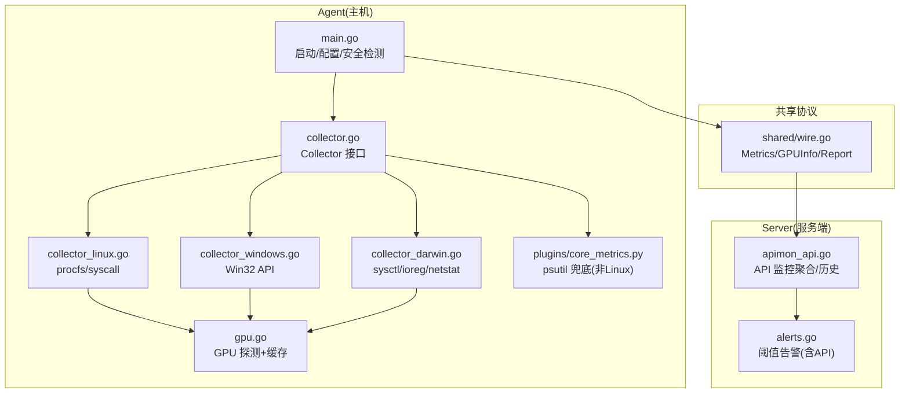
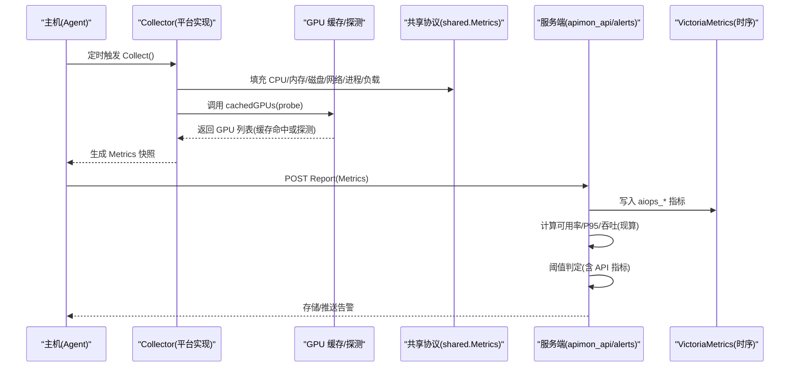
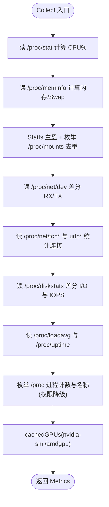
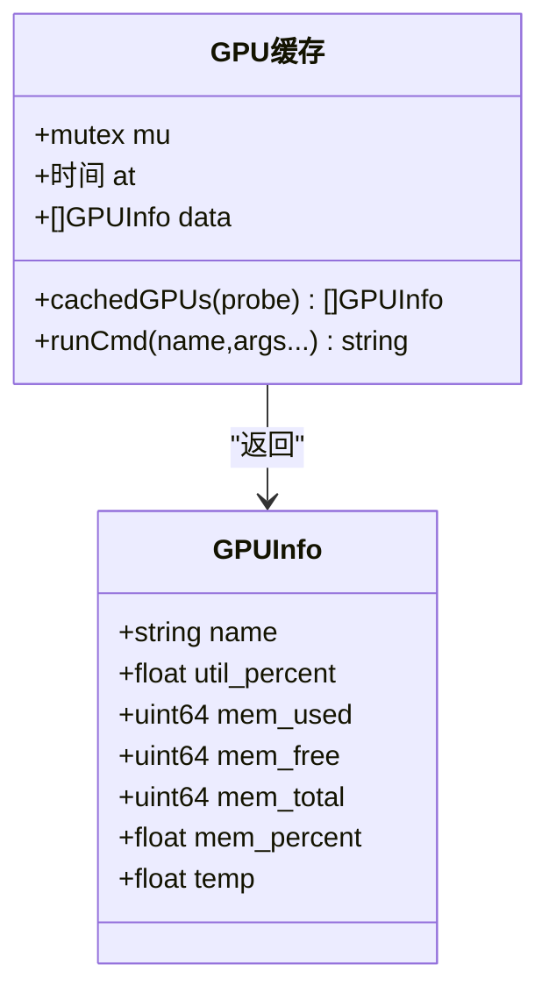
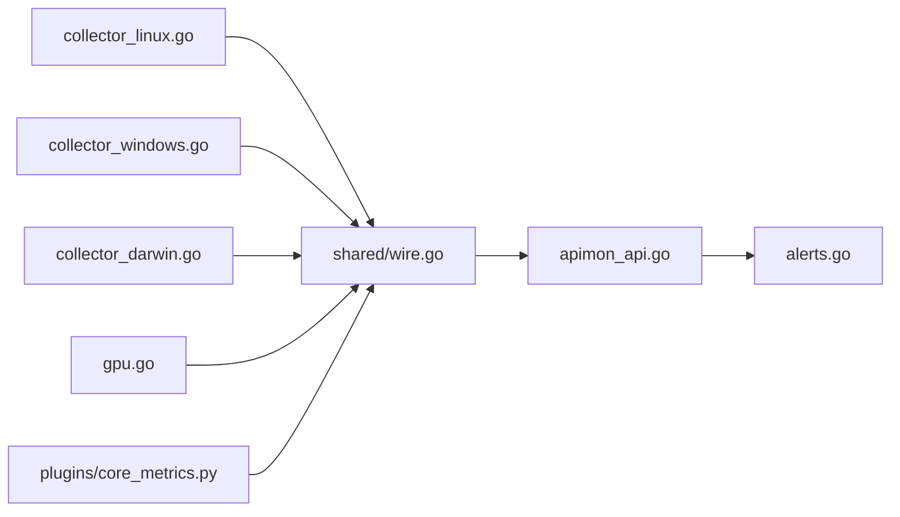

# 指标收集

<cite>
**本文引用的文件**   
- [README.md](file://README.md)
- [cmd/agent/main.go](file://cmd/agent/main.go)
- [cmd/agent/collector.go](file://cmd/agent/collector.go)
- [cmd/agent/collector_linux.go](file://cmd/agent/collector_linux.go)
- [cmd/agent/collector_windows.go](file://cmd/agent/collector_windows.go)
- [cmd/agent/collector_darwin.go](file://cmd/agent/collector_darwin.go)
- [cmd/agent/gpu.go](file://cmd/agent/gpu.go)
- [shared/wire.go](file://shared/wire.go)
- [plugins/core_metrics.py](file://plugins/core_metrics.py)
- [plugins/plugin_sdk.py](file://plugins/plugin_sdk.py)
- [cmd/server/apimon_api.go](file://cmd/server/apimon_api.go)
- [cmd/server/web/js/apimon.js](file://cmd/server/web/js/apimon.js)
- [cmd/server/alerts.go](file://cmd/server/alerts.go)
</cite>

## 目录
1. [简介](#简介)
2. [项目结构](#项目结构)
3. [核心组件](#核心组件)
4. [架构总览](#架构总览)
5. [详细组件分析](#详细组件分析)
6. [依赖关系分析](#依赖关系分析)
7. [性能与优化](#性能与优化)
8. [故障排查指南](#故障排查指南)
9. [结论](#结论)
10. [附录：API 监控使用指南](#附录api-监控使用指南)

## 简介
本文件聚焦于系统的“指标收集”能力，覆盖跨平台（Linux/Windows/macOS）的 CPU、内存、磁盘 I/O、网络流量、进程状态等基础指标采集机制；说明 GPU 监控支持（NVIDIA/AMD/Apple），并给出 API 监控功能的使用方法与最佳实践。文档同时提供架构图、时序图与流程图，帮助读者快速理解数据流与实现差异。

## 项目结构
Agent 侧采用“Go 原生采集 + Python 插件扩展”的混合架构：
- Go 原生采集器按构建标签选择平台实现（Linux procfs/syscall、Windows Win32 API、macOS sysctl/ioreg/netstat）。
- 非 Linux 平台可回退到 Python 插件（psutil）产出基础指标。
- 共享数据结构位于 shared 包，确保 Agent 与服务端契约一致。
- GPU 采集为 best-effort，带缓存与超时保护。
- API 监控由服务端调度拨测，结果写入 VictoriaMetrics，并提供前端聚合展示。

图表来源
- [cmd/agent/main.go:1-238](file://cmd/agent/main.go#L1-L238)
- [cmd/agent/collector.go:1-32](file://cmd/agent/collector.go#L1-L32)
- [cmd/agent/collector_linux.go:1-617](file://cmd/agent/collector_linux.go#L1-L617)
- [cmd/agent/collector_windows.go:1-551](file://cmd/agent/collector_windows.go#L1-L551)
- [cmd/agent/collector_darwin.go:1-548](file://cmd/agent/collector_darwin.go#L1-L548)
- [cmd/agent/gpu.go:1-126](file://cmd/agent/gpu.go#L1-L126)
- [plugins/core_metrics.py:1-65](file://plugins/core_metrics.py#L1-L65)
- [shared/wire.go:1-139](file://shared/wire.go#L1-L139)
- [cmd/server/apimon_api.go:1-134](file://cmd/server/apimon_api.go#L1-L134)
- [cmd/server/alerts.go:374-413](file://cmd/server/alerts.go#L374-L413)

章节来源
- [README.md:579-594](file://README.md#L579-L594)
- [cmd/agent/main.go:1-238](file://cmd/agent/main.go#L1-L238)
- [cmd/agent/collector.go:1-32](file://cmd/agent/collector.go#L1-L32)
- [shared/wire.go:1-139](file://shared/wire.go#L1-L139)

## 核心组件
- Collector 接口：统一抽象，平台实现通过构建标签选择。
- 平台采集器：
  - Linux：/proc/stat、/proc/meminfo、/proc/diskstats、/proc/net/dev、/proc/loadavg、/proc/uptime、/proc/mounts + syscall.Statfs、/proc/net/{tcp,udp}。
  - Windows：GetSystemTimes、GlobalMemoryStatusEx、GetDiskFreeSpaceExW、DeviceIoControl(DISK_PERFORMANCE)、GetIfTable、GetTcpTable/GetUdpTable、EnumProcesses/CreateToolhelp32Snapshot、GetTickCount64。
  - macOS：top -l 2、sysctl vm.loadavg/kern.boottime/hw.memsize、vm_stat、netstat -ibn、ioreg(IOBlockStorageDriver/IOAccelerator)、df -kP、ps -A。
- GPU 采集：
  - NVIDIA：nvidia-smi（Linux/Windows），解析 CSV 输出。
  - AMD：/sys/class/drm/card*/device（Linux）。
  - Apple：ioreg IOAccelerator（macOS）。
  - 全局缓存与命令超时保护，避免阻塞上报循环。
- 共享数据结构 Metrics/GPUInfo/Report：定义所有上报字段，包含可选的 API 业务监控指标。
- Python 插件层：plugin_sdk 提供 metric/event/base 输出约定；core_metrics.py 在非 Linux 平台作为基础指标兜底。

章节来源
- [cmd/agent/collector.go:1-32](file://cmd/agent/collector.go#L1-L32)
- [cmd/agent/collector_linux.go:76-209](file://cmd/agent/collector_linux.go#L76-L209)
- [cmd/agent/collector_windows.go:89-207](file://cmd/agent/collector_windows.go#L89-L207)
- [cmd/agent/collector_darwin.go:41-109](file://cmd/agent/collector_darwin.go#L41-L109)
- [cmd/agent/gpu.go:1-126](file://cmd/agent/gpu.go#L1-L126)
- [shared/wire.go:8-86](file://shared/wire.go#L8-L86)
- [plugins/plugin_sdk.py:1-41](file://plugins/plugin_sdk.py#L1-L41)
- [plugins/core_metrics.py:1-65](file://plugins/core_metrics.py#L1-L65)

## 架构总览
下图展示了从 Agent 采集到服务端聚合与告警的关键路径，以及 API 监控在其中的位置。

图表来源
- [cmd/agent/collector.go:1-32](file://cmd/agent/collector.go#L1-L32)
- [cmd/agent/gpu.go:1-126](file://cmd/agent/gpu.go#L1-L126)
- [shared/wire.go:8-86](file://shared/wire.go#L8-L86)
- [cmd/server/apimon_api.go:1-134](file://cmd/server/apimon_api.go#L1-L134)
- [cmd/server/alerts.go:374-413](file://cmd/server/alerts.go#L374-L413)

## 详细组件分析

### Linux 采集器（procfs/syscall）
- CPU：读取 /proc/stat，差分 idle/total 计算使用率。
- 内存/Swap：/proc/meminfo 解析 MemTotal/MemAvailable/SwapTotal/SwapFree。
- 磁盘：主盘 Statfs 快速统计；枚举 /proc/mounts 去重真实设备，跳过伪文件系统。
- 网络：/proc/net/dev 累加非 lo 接口的 RX/TX，差分得速率。
- TCP/UDP：/proc/net/tcp* 与 udp* 统计各状态数与总数。
- 负载/运行时长：/proc/loadavg、/proc/uptime。
- 进程：/proc 枚举计数与名称（兼容权限受限降级至 cmdline）。
- 磁盘 I/O：/proc/diskstats 累计字节与操作数，差分得速率与 IOPS，估算 IO 利用率。
- GPU：优先 nvidia-smi，其次 amdgpu sysfs。

图表来源
- [cmd/agent/collector_linux.go:76-209](file://cmd/agent/collector_linux.go#L76-L209)
- [cmd/agent/collector_linux.go:250-425](file://cmd/agent/collector_linux.go#L250-L425)
- [cmd/agent/collector_linux.go:507-617](file://cmd/agent/collector_linux.go#L507-L617)
- [cmd/agent/gpu.go:1-126](file://cmd/agent/gpu.go#L1-L126)

章节来源
- [cmd/agent/collector_linux.go:76-209](file://cmd/agent/collector_linux.go#L76-L209)
- [cmd/agent/collector_linux.go:250-425](file://cmd/agent/collector_linux.go#L250-L425)
- [cmd/agent/collector_linux.go:507-617](file://cmd/agent/collector_linux.go#L507-L617)

### Windows 采集器（Win32 API）
- CPU：GetSystemTimes 差分计算使用率。
- 内存/页文件：GlobalMemoryStatusEx 推导 Swap。
- 磁盘：GetDiskFreeSpaceExW 获取逻辑盘使用率。
- 网络：GetIfTable 差分 RX/TX。
- 磁盘 I/O：DeviceIoControl IOCTL_DISK_PERFORMANCE 汇总物理盘累计值差分。
- TCP/UDP：GetTcpTable/GetUdpTable 统计状态与总数。
- 进程：EnumProcesses 计数 + CreateToolhelp32Snapshot 列举名称。
- 运行时长：GetTickCount64。
- 负载：基于 CPU%×核数的 EWMA 近似。
- GPU：nvidia-smi（best-effort）。

章节来源
- [cmd/agent/collector_windows.go:89-207](file://cmd/agent/collector_windows.go#L89-L207)
- [cmd/agent/collector_windows.go:227-285](file://cmd/agent/collector_windows.go#L227-L285)
- [cmd/agent/collector_windows.go:340-396](file://cmd/agent/collector_windows.go#L340-L396)
- [cmd/agent/collector_windows.go:420-466](file://cmd/agent/collector_windows.go#L420-L466)
- [cmd/agent/collector_windows.go:515-551](file://cmd/agent/collector_windows.go#L515-L551)
- [cmd/agent/gpu.go:1-126](file://cmd/agent/gpu.go#L1-L126)

### macOS 采集器（sysctl/ioreg/netstat）
- CPU：top -l 2 解析 idle 反推使用率。
- 内存/Swap：sysctl hw.memsize + vm_stat 计算已用；vm.swapusage 解析 Swap。
- 磁盘：Statfs 主盘 + df -kP 枚举去重。
- 网络：netstat -ibn 差分 RX/TX。
- 磁盘 I/O：ioreg IOBlockStorageDriver 累计值差分。
- TCP/UDP：netstat -an -p tcp/udp 统计。
- 负载/运行时长：sysctl vm.loadavg、kern.boottime。
- 进程：ps -A 计数与名称。
- GPU：ioreg IOAccelerator 提取 Device Utilization %。

章节来源
- [cmd/agent/collector_darwin.go:41-109](file://cmd/agent/collector_darwin.go#L41-L109)
- [cmd/agent/collector_darwin.go:111-179](file://cmd/agent/collector_darwin.go#L111-L179)
- [cmd/agent/collector_darwin.go:219-329](file://cmd/agent/collector_darwin.go#L219-L329)
- [cmd/agent/collector_darwin.go:331-426](file://cmd/agent/collector_darwin.go#L331-L426)
- [cmd/agent/collector_darwin.go:428-548](file://cmd/agent/collector_darwin.go#L428-L548)

### GPU 监控（NVIDIA/AMD/Apple）
- 策略：best-effort + 缓存（约 12s）+ 命令超时（4s），避免驱动卡死拖垮上报循环。
- NVIDIA：nvidia-smi --query-gpu=name,utilization.gpu,memory.used,memory.total,temperature.gpu,memory.free --format=csv,noheader,nounits。
- AMD：/sys/class/drm/card*/device 下的 gpu_busy_percent 与 mem_info_vram_{used,total}。
- Apple：ioreg IOAccelerator 的 PerformanceStatistics 中 Device Utilization %。

图表来源
- [cmd/agent/gpu.go:1-126](file://cmd/agent/gpu.go#L1-L126)
- [shared/wire.go:55-66](file://shared/wire.go#L55-L66)

章节来源
- [cmd/agent/gpu.go:1-126](file://cmd/agent/gpu.go#L1-L126)
- [cmd/agent/collector_linux.go:211-248](file://cmd/agent/collector_linux.go#L211-L248)
- [cmd/agent/collector_darwin.go:149-197](file://cmd/agent/collector_darwin.go#L149-L197)
- [shared/wire.go:55-66](file://shared/wire.go#L55-L66)

### 自定义指标扩展（Python 插件）
- 插件 SDK：metric()/event()/emit() 输出 JSON，metrics 键建议命名空间前缀。
- 基础指标兜底：非 Linux 平台可通过 core_metrics.py（psutil）产出 base 指标。
- 执行策略：崩溃/超时不影响核心，仅记录并跳过。

章节来源
- [plugins/plugin_sdk.py:1-41](file://plugins/plugin_sdk.py#L1-L41)
- [plugins/core_metrics.py:1-65](file://plugins/core_metrics.py#L1-L65)

## 依赖关系分析
- 平台耦合：Collector 接口解耦平台差异，通过构建标签编译期选择实现。
- 外部工具：
  - Linux：/proc 与 syscall，零第三方依赖。
  - Windows：Win32 API（kernel32/psapi/iphlpapi/ntdll）。
  - macOS：系统工具 top/sysctl/vm_stat/netstat/ioreg/df/ps。
  - GPU：nvidia-smi（NVIDIA）、sysfs（AMD）、ioreg（Apple）。
- 共享协议：shared/wire.go 保证前后端一致性。
- 服务端集成：apimon_api.go 聚合实时状态与 VM 现算指标；alerts.go 对 API 指标进行阈值判定。

图表来源
- [cmd/agent/collector_linux.go:1-617](file://cmd/agent/collector_linux.go#L1-L617)
- [cmd/agent/collector_windows.go:1-551](file://cmd/agent/collector_windows.go#L1-L551)
- [cmd/agent/collector_darwin.go:1-548](file://cmd/agent/collector_darwin.go#L1-L548)
- [cmd/agent/gpu.go:1-126](file://cmd/agent/gpu.go#L1-L126)
- [plugins/core_metrics.py:1-65](file://plugins/core_metrics.py#L1-L65)
- [shared/wire.go:1-139](file://shared/wire.go#L1-L139)
- [cmd/server/apimon_api.go:1-134](file://cmd/server/apimon_api.go#L1-L134)
- [cmd/server/alerts.go:374-413](file://cmd/server/alerts.go#L374-L413)

章节来源
- [shared/wire.go:1-139](file://shared/wire.go#L1-L139)
- [cmd/server/apimon_api.go:1-134](file://cmd/server/apimon_api.go#L1-L134)
- [cmd/server/alerts.go:374-413](file://cmd/server/alerts.go#L374-L413)

## 性能与优化
- 采样与缓存
  - Linux：磁盘枚举与进程信息缓存（TTL 分别为 60s/20s），减少频繁 I/O。
  - GPU：全局缓存 TTL≈12s，避免每次上报都 fork 子进程。
- 速率计算
  - 通用 rate(cur,prev,elapsed) 处理计数器回绕与非正间隔，避免虚假尖峰。
- 超时保护
  - GPU 命令执行设置硬超时（4s），防止驱动挂起导致上报阻塞。
- 资源限制
  - Windows 网络表与磁盘 IO 使用池化缓冲，避免大分配。
  - 进程名上限（256）控制内存占用。
- 估算与归一化
  - Linux 磁盘 IO 利用率以总吞吐相对参考带宽估算并封顶 100%。
  - Windows 无 load average，使用 EWMA 近似。

章节来源
- [cmd/agent/collector_linux.go:60-64](file://cmd/agent/collector_linux.go#L60-L64)
- [cmd/agent/collector_linux.go:148-167](file://cmd/agent/collector_linux.go#L148-L167)
- [cmd/agent/collector.go:23-31](file://cmd/agent/collector.go#L23-L31)
- [cmd/agent/gpu.go:14-53](file://cmd/agent/gpu.go#L14-L53)
- [cmd/agent/collector_windows.go:287-330](file://cmd/agent/collector_windows.go#L287-L330)
- [cmd/agent/collector_windows.go:263-285](file://cmd/agent/collector_windows.go#L263-L285)

## 故障排查指南
- 数据采集权限不足（Linux）
  - 现象：部分 /proc 路径被拦截，日志提示 blocked_paths。
  - 处理：检查 kysec/SELinux/AppArmor，必要时以 root 运行或添加白名单。
- GPU 信息不显示
  - 现象：面板无 GPU 曲线。
  - 处理：确认 nvidia-smi 安装与可见性；AMD 需 sysfs 权限；macOS 仅支持 Apple Silicon GPU。
- 上报卡顿或主机离线
  - 现象：上报周期抖动或短暂离线。
  - 处理：检查 GPU 探测是否超时失败；确认网络连通与 TLS 证书信任。

章节来源
- [cmd/agent/collector_linux.go:193-205](file://cmd/agent/collector_linux.go#L193-L205)
- [README.md:873-879](file://README.md#L873-L879)
- [cmd/agent/gpu.go:39-53](file://cmd/agent/gpu.go#L39-L53)

## 结论
系统通过“Go 原生采集 + Python 插件扩展”的混合架构，在三平台上实现了稳定、低开销的基础指标采集，并以 best-effort 方式覆盖 GPU 监控。API 监控补齐了“业务可用性”维度，结合 VictoriaMetrics 的现算能力与细粒度阈值，形成从主机到业务的完整观测闭环。建议在大规模部署时关注 GPU 探测成本、网络表大小与权限策略，并结合插件体系按需扩展自定义指标。

## 附录：API 监控使用指南
- 功能概述
  - 面向“一个业务系统的一批接口”做批量健康/性能黑盒拨测，补齐业务可用性维度。
  - 复用高级 HTTP 探测引擎（DNS/TCP/TLS/TTFB 分段计时），结果写入 VictoriaMetrics（aiops_api_* 指标族）。
  - 聚合现算：平均时延、P95 时延、1h·24h 可用率、吞吐。
  - 异常按业务系统级别走统一告警。
- 前端交互
  - 页面加载后调用 GET /apimon/systems 拉取系统/接口最新状态与聚合指标。
  - 可用率着色：≥99.9 绿、≥99 黄、否则红；<0 表示暂无数据。
- 后端接口
  - GET /apimon/systems：返回系统列表与接口状态（实时+VM 聚合）。
  - POST /apimon/systems：新增/更新业务系统（含接口列表），保存后立即探测一次。
  - DELETE /apimon/systems/{id}：删除系统。
  - POST /apimon/systems/{id}/run：立即探测某系统全部接口。
  - GET /apimon/systems/{id}/history?since_min=N：查询最近 N 分钟历史点（默认 24h）。
- 告警阈值
  - 可在服务端配置项 thresholds 中设置 API 可用率、平均响应、P95 响应、吞吐量阈值（warn/crit）。
  - 服务端 alerts.go 对 API 指标进行阈值判定并生成告警事件。

章节来源
- [README.md:756-765](file://README.md#L756-L765)
- [cmd/server/web/js/apimon.js:1-24](file://cmd/server/web/js/apimon.js#L1-L24)
- [cmd/server/apimon_api.go:1-134](file://cmd/server/apimon_api.go#L1-L134)
- [cmd/server/alerts.go:374-413](file://cmd/server/alerts.go#L374-L413)