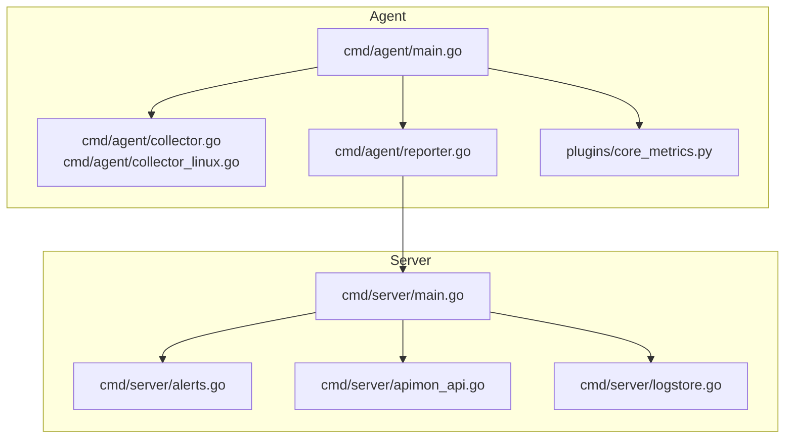
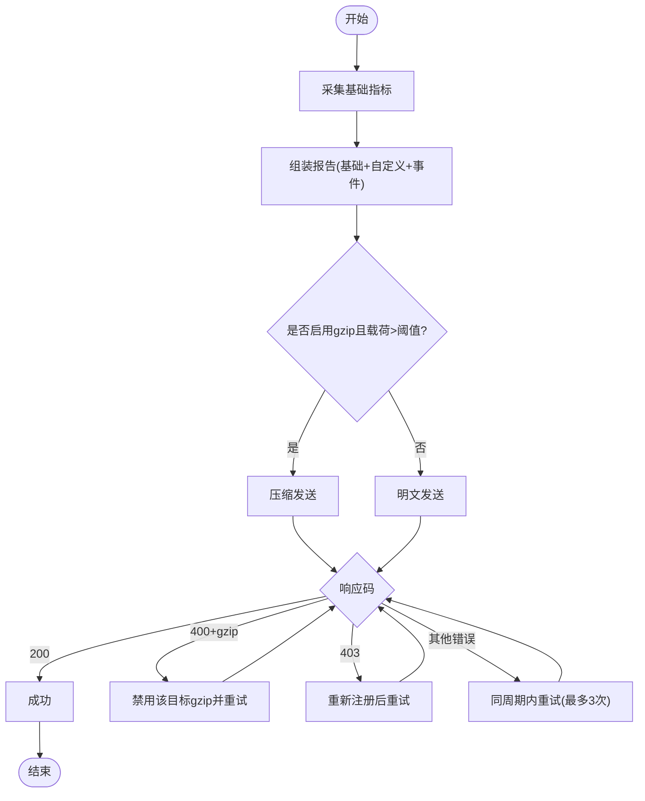
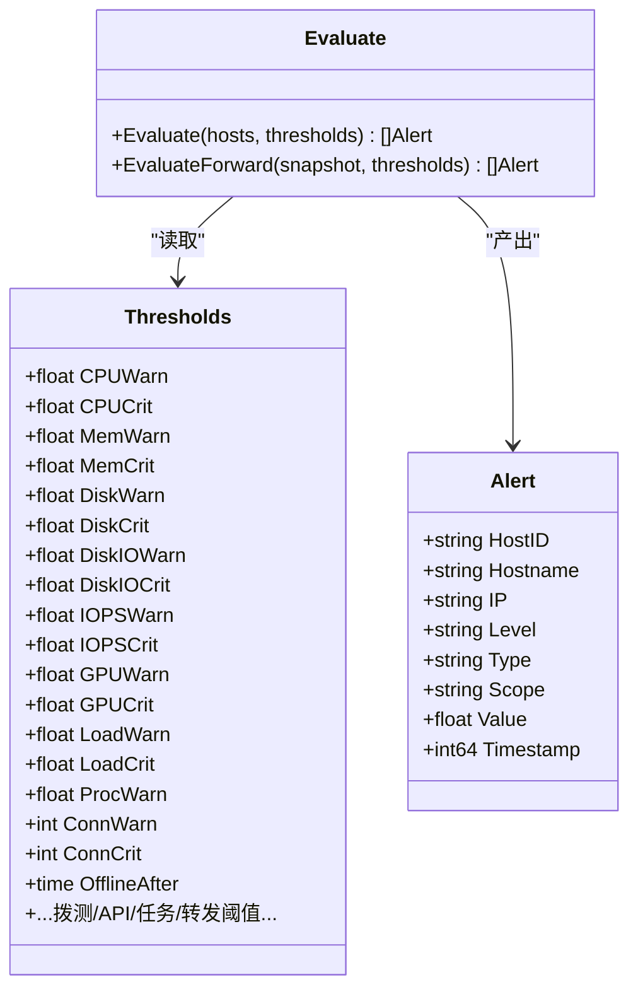
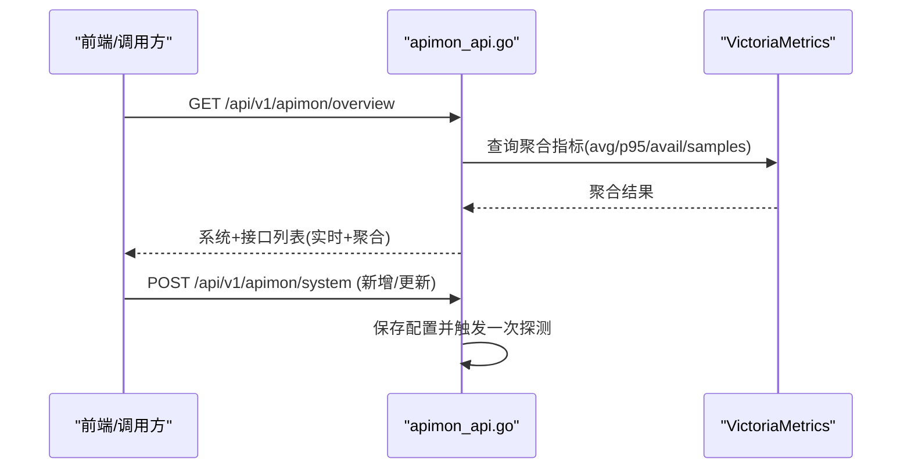
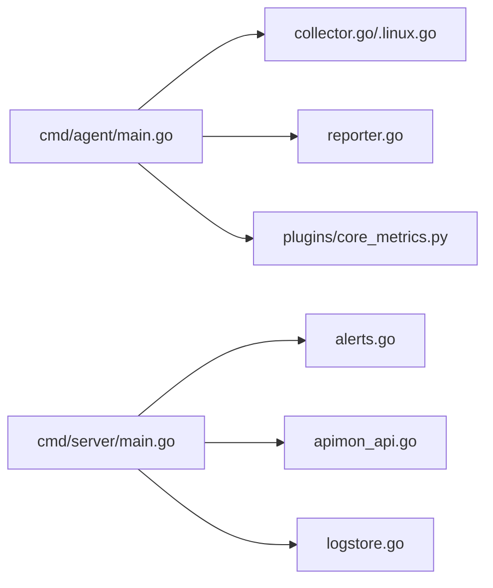

# 监控分析

<cite>
**本文引用的文件**   
- [README.md](file://README.md)
- [cmd/agent/main.go](file://cmd/agent/main.go)
- [cmd/agent/collector.go](file://cmd/agent/collector.go)
- [cmd/agent/collector_linux.go](file://cmd/agent/collector_linux.go)
- [cmd/agent/reporter.go](file://cmd/agent/reporter.go)
- [plugins/core_metrics.py](file://plugins/core_metrics.py)
- [cmd/server/main.go](file://cmd/server/main.go)
- [cmd/server/alerts.go](file://cmd/server/alerts.go)
- [cmd/server/config.go](file://cmd/server/config.go)
- [cmd/server/apimon_api.go](file://cmd/server/apimon_api.go)
- [cmd/server/logstore.go](file://cmd/server/logstore.go)
- [config.example.json](file://config.example.json)
- [server_config.example.json](file://server_config.example.json)
</cite>

## 目录
1. [引言](#引言)
2. [项目结构](#项目结构)
3. [核心组件](#核心组件)
4. [架构总览](#架构总览)
5. [详细组件分析](#详细组件分析)
6. [依赖关系分析](#依赖关系分析)
7. [性能考量](#性能考量)
8. [故障排查指南](#故障排查指南)
9. [结论](#结论)
10. [附录](#附录)

## 引言
本指南面向运维与 SRE 团队，系统化说明 AIOps Monitor 的内置监控指标采集与分析方法，覆盖 CPU、内存、磁盘 I/O、网络流量等关键指标；提供性能瓶颈识别（热点代码定位、慢请求分析、资源争用检测）；给出告警规则优化策略（阈值调优、降噪、根因分析）；并说明分布式追踪集成、日志聚合分析与 APM 工具对接思路。同时包含性能测试工具与自动化监控脚本的使用建议。

## 项目结构
系统由“服务端 + Agent + 插件”构成：
- 服务端：HTTP API、告警评估、API 拨测、日志聚合、存储（PostgreSQL + VictoriaMetrics）、前端面板
- Agent：跨平台原生采集、插件执行、上报、日志采集转发
- 插件：Python 扩展能力（如核心指标兜底、自定义业务指标）



图表来源
- [cmd/agent/main.go:1-238](file://cmd/agent/main.go#L1-L238)
- [cmd/agent/collector.go:1-32](file://cmd/agent/collector.go#L1-L32)
- [cmd/agent/collector_linux.go:1-617](file://cmd/agent/collector_linux.go#L1-L617)
- [cmd/agent/reporter.go:1-575](file://cmd/agent/reporter.go#L1-L575)
- [plugins/core_metrics.py:1-65](file://plugins/core_metrics.py#L1-L65)
- [cmd/server/main.go:1-355](file://cmd/server/main.go#L1-L355)
- [cmd/server/alerts.go:1-544](file://cmd/server/alerts.go#L1-L544)
- [cmd/server/apimon_api.go:1-134](file://cmd/server/apimon_api.go#L1-L134)
- [cmd/server/logstore.go:1-318](file://cmd/server/logstore.go#L1-L318)

章节来源
- [README.md](file://README.md)
- [cmd/agent/main.go:1-238](file://cmd/agent/main.go#L1-L238)
- [cmd/server/main.go:1-355](file://cmd/server/main.go#L1-L355)

## 核心组件
- 指标采集器（Collector）
  - Linux 通过 /proc 与 syscall 原生采集，非 Linux 平台回退到 Python 插件（core_metrics.py）
  - 输出共享数据结构 Metrics，包含 CPU、内存、磁盘、网络、连接数、负载、进程、GPU 等
- 上报器（Reporter）
  - 多服务端并发上报，带重试、熔断、gzip 降级、注册鉴权、日志加密密钥下发
- 告警引擎（Alerts）
  - 基于 Thresholds 配置对主机指标进行 warn/crit 判定，支持离线、CPU、内存、磁盘、IOPS、GPU、负载、进程异常、连接数、API 指标、任务、端口转发等
- API 监控（APIMon）
  - 批量黑盒拨测接口，计算可用率、P95、吞吐等，写入时序库
- 日志聚合（LogStore）
  - 内存环形缓冲 + 分页检索 + 统计面板，支持按主机/级别/关键字/时间筛选

章节来源
- [cmd/agent/collector.go:1-32](file://cmd/agent/collector.go#L1-L32)
- [cmd/agent/collector_linux.go:1-617](file://cmd/agent/collector_linux.go#L1-L617)
- [plugins/core_metrics.py:1-65](file://plugins/core_metrics.py#L1-L65)
- [cmd/agent/reporter.go:1-575](file://cmd/agent/reporter.go#L1-L575)
- [cmd/server/alerts.go:1-544](file://cmd/server/alerts.go#L1-L544)
- [cmd/server/apimon_api.go:1-134](file://cmd/server/apimon_api.go#L1-L134)
- [cmd/server/logstore.go:1-318](file://cmd/server/logstore.go#L1-L318)

## 架构总览
Agent 周期性采集基础指标与插件指标，合并后上报至服务端；服务端将指标持久化到时序库（VictoriaMetrics），关系数据落 PostgreSQL；告警引擎定时评估阈值，触发通知；API 监控与日志聚合作为第二观测支柱，补齐业务可用性维度与排障上下文。

```mermaid
sequenceDiagram
participant Agent as "Agent(主循环)"
participant Coll as "采集器(Collector)"
rep as "上报器(Reporter)"
participant Server as "服务端(HTTP)"
participant VM as "VictoriaMetrics"
participant PG as "PostgreSQL"
Agent->>Coll : 周期采集(Metrics)
Coll-->>Agent : 基础指标+进程/GPU
Agent->>rep : 组装Report(含自定义/事件)
rep->>Server : POST /api/v1/agent/report(gzip/重试/熔断)
Server->>VM : 写入时序指标
Server->>PG : 持久化配置/用户/审计/事件
Server->>Server : 告警评估(Evaluate)
Server-->>Agent : 返回日志加密密钥(log_key)
```

图表来源
- [cmd/agent/main.go:1-238](file://cmd/agent/main.go#L1-L238)
- [cmd/agent/collector_linux.go:1-617](file://cmd/agent/collector_linux.go#L1-L617)
- [cmd/agent/reporter.go:1-575](file://cmd/agent/reporter.go#L1-L575)
- [cmd/server/main.go:1-355](file://cmd/server/main.go#L1-L355)
- [cmd/server/alerts.go:1-544](file://cmd/server/alerts.go#L1-L544)

## 详细组件分析

### 指标采集与上报流程
- 采集路径
  - Linux：/proc/stat、/proc/meminfo、/proc/net/dev、/proc/diskstats、/proc/loadavg、/proc/uptime、/proc/mounts、/proc/net/{tcp,udp}*，以及 GPU（nvidia-smi/amdgpu sysfs）
  - 非 Linux：回退到 core_metrics.py（psutil）
- 上报路径
  - 多目标并发上报，独立连接池与超时隔离
  - 自动 gzip 压缩（小载荷跳过），遇 400 自动禁用 gzip
  - 403 触发重新注册；失败计数达到阈值打开熔断，冷却后半开探测
  - 首次注册成功时获取 log_key，后续日志上报使用 AES-GCM 加密



图表来源
- [cmd/agent/reporter.go:1-575](file://cmd/agent/reporter.go#L1-L575)
- [cmd/agent/collector_linux.go:1-617](file://cmd/agent/collector_linux.go#L1-L617)
- [plugins/core_metrics.py:1-65](file://plugins/core_metrics.py#L1-L65)

章节来源
- [cmd/agent/collector.go:1-32](file://cmd/agent/collector.go#L1-L32)
- [cmd/agent/collector_linux.go:1-617](file://cmd/agent/collector_linux.go#L1-L617)
- [cmd/agent/reporter.go:1-575](file://cmd/agent/reporter.go#L1-L575)
- [plugins/core_metrics.py:1-65](file://plugins/core_metrics.py#L1-L65)

### 告警评估与阈值体系
- 阈值模型
  - 三档预设：保守/标准/宽松，覆盖 CPU、内存、磁盘、磁盘 IO、IOPS、GPU、负载、进程变化、连接数、离线时长、拨测、API、任务、端口转发等
  - “越低越差”类指标（可用率、吞吐）采用反向判定
- 评估范围
  - 主机资源：CPU、内存、磁盘、磁盘 IO、IOPS、GPU、负载、进程异常、连接数、离线
  - 拨测：Ping/TCP/HTTP/进程存活
  - API 业务：可用率、平均/P95 响应、吞吐
  - 编排任务：失败次数、超时时长
  - 端口转发：活跃连接、带宽、错误率、延迟



图表来源
- [cmd/server/alerts.go:1-544](file://cmd/server/alerts.go#L1-L544)
- [cmd/server/config.go:75-98](file://cmd/server/config.go#L75-L98)

章节来源
- [cmd/server/alerts.go:1-544](file://cmd/server/alerts.go#L1-L544)
- [cmd/server/config.go:75-98](file://cmd/server/config.go#L75-L98)
- [server_config.example.json:1-36](file://server_config.example.json#L1-L36)

### API 监控（业务接口拨测）
- 功能要点
  - 按业务系统组织接口，支持 HTTP/TCP/Ping/进程存活等多类型拨测
  - 实时状态（最近一次探测结果）+ 聚合指标（VM 现算：平均/P95、1h/24h 可用率、吞吐）
  - 异常走统一告警通道
- 主要端点
  - 概览查询、新增/更新系统、删除、立即探测、历史曲线



图表来源
- [cmd/server/apimon_api.go:1-134](file://cmd/server/apimon_api.go#L1-L134)

章节来源
- [cmd/server/apimon_api.go:1-134](file://cmd/server/apimon_api.go#L1-L134)

### 日志聚合与检索
- 设计要点
  - 内存环形缓冲（上限固定），重启后从 PG 恢复尾部窗口
  - 支持按主机/级别/关键字/时间搜索与分页，提供统计面板（级别分布、Top 主机、时间分布）
  - AI 巡检可拉取近期 error/warn 作为诊断上下文
- 典型用法
  - 快速定位错误峰值时段与主机
  - 结合告警事件做根因关联

章节来源
- [cmd/server/logstore.go:1-318](file://cmd/server/logstore.go#L1-L318)

## 依赖关系分析
- Agent 侧
  - main.go 负责参数解析、安全环境检测、Relay 模式、启动各子循环（上报、插件、终端、转发、日志）
  - collector 接口抽象，Linux 实现直接读 /proc/syscall，非 Linux 回退 core_metrics.py
  - reporter 封装多目标上报、重试、熔断、gzip 降级、注册鉴权
- Server 侧
  - main.go 初始化存储（PG+VM）、中间件（CORS/安全头/gzip/限体）、路由、后台任务（告警、拨测、调度、SLO、AI 巡检、VM 泵）
  - alerts.go 定义阈值与评估逻辑
  - apimon_api.go 暴露 API 监控管理端点
  - logstore.go 提供日志聚合与检索



图表来源
- [cmd/agent/main.go:1-238](file://cmd/agent/main.go#L1-L238)
- [cmd/agent/collector.go:1-32](file://cmd/agent/collector.go#L1-L32)
- [cmd/agent/collector_linux.go:1-617](file://cmd/agent/collector_linux.go#L1-L617)
- [cmd/agent/reporter.go:1-575](file://cmd/agent/reporter.go#L1-L575)
- [plugins/core_metrics.py:1-65](file://plugins/core_metrics.py#L1-L65)
- [cmd/server/main.go:1-355](file://cmd/server/main.go#L1-L355)
- [cmd/server/alerts.go:1-544](file://cmd/server/alerts.go#L1-L544)
- [cmd/server/apimon_api.go:1-134](file://cmd/server/apimon_api.go#L1-L134)
- [cmd/server/logstore.go:1-318](file://cmd/server/logstore.go#L1-L318)

章节来源
- [cmd/agent/main.go:1-238](file://cmd/agent/main.go#L1-L238)
- [cmd/server/main.go:1-355](file://cmd/server/main.go#L1-L355)

## 性能考量
- 采集层
  - Linux 原生采集零依赖，低开销；磁盘枚举与进程名缓存降低频繁 I/O
  - 速率计算避免计数器回绕导致的尖峰
- 传输层
  - 连接复用与 HTTP/1.1 显式关闭 HTTP/2，提升服务重启后的恢复速度
  - gzip 压缩在多数场景下显著降低带宽占用
  - 每目标独立连接池与超时，避免单点阻塞影响全局
- 服务端
  - 响应 gzip 压缩、安全头、最大请求体限制
  - 告警评估与拨测以定时器驱动，避免轮询风暴
- 存储
  - 时序数据入 VM，关系数据入 PG，分离读写热点

[本节为通用指导，不直接分析具体文件]

## 故障排查指南
- Agent 无法上报
  - 检查 403（未注册/指纹绑定失效）→ 自动重注册；400（gzip 损坏）→ 自动禁用 gzip 重试
  - 查看熔断状态与重试日志，确认网络连通性与代理行为
- 指标缺失或不完整
  - Linux 权限不足导致 /proc 部分路径不可读 → 参考启动诊断提示调整 kysec/SELinux/AppArmor 或提权运行
  - 非 Linux 平台确保 psutil 安装正常
- 告警风暴
  - 使用静默/抑制/路由治理；优先设置合理的离线判定与抑制规则（如主机离线抑制衍生告警）
- 日志检索缓慢
  - 控制关键词与时间窗口；利用分页与级别过滤；关注 Top 主机与时间分布定位热点

章节来源
- [cmd/agent/reporter.go:1-575](file://cmd/agent/reporter.go#L1-L575)
- [cmd/agent/collector_linux.go:1-617](file://cmd/agent/collector_linux.go#L1-L617)
- [cmd/server/logstore.go:1-318](file://cmd/server/logstore.go#L1-L318)

## 结论
AIOps Monitor 以“原生采集 + 插件扩展 + 统一存储”的架构，提供全面的系统与应用级观测能力。通过细粒度阈值与告警治理，结合 API 监控与日志聚合，形成“发现—定位—处置—复盘”的闭环。生产部署建议开启 TLS、合理配置阈值与治理规则，并结合外部 APM/追踪系统进行端到端链路分析。

[本节为总结性内容，不直接分析具体文件]

## 附录

### 内置监控指标清单与采集方式
- CPU 使用率/核数：/proc/stat（Linux）、Win32 API、sysctl/top
- 内存/SWAP：/proc/meminfo、GlobalMemoryStatusEx、sysctl+vm_stat
- 磁盘（全部本地盘）：/proc/mounts+statfs、GetDiskFreeSpaceExW、syscall.Statfs+df
- 网络收发速率：/proc/net/dev、GetIfTable、netstat -ibn
- TCP 连接数：/proc/net/tcp*、GetTcpTable、netstat -an
- 负载 1/5/15：/proc/loadavg、EWMA 近似、sysctl vm.loadavg
- 进程数：/proc 枚举、EnumProcesses、ps -A
- 运行时长：/proc/uptime、GetTickCount64、sysctl kern.boottime
- GPU 使用率/显存/温度：nvidia-smi、amdgpu sysfs、ioreg（best-effort）

章节来源
- [README.md](file://README.md)

### 告警阈值配置与优化策略
- 三档预设起步：保守/标准/宽松，根据环境选择
- 零值兜底：未配置项自动回退默认值，避免误报
- 降噪策略：静默（时段/星期）、抑制（主因抑衍生）、路由（按级别分流）
- 根因分析：结合 API 监控与日志聚合，聚焦异常时段与主机

章节来源
- [cmd/server/alerts.go:1-544](file://cmd/server/alerts.go#L1-L544)
- [cmd/server/config.go:75-98](file://cmd/server/config.go#L75-L98)
- [server_config.example.json:1-36](file://server_config.example.json#L1-L36)
- [README.md](file://README.md)

### 分布式追踪与 APM 集成建议
- 现状：仓库未内置 OpenTelemetry/Zipkin/Jaeger 客户端
- 建议方案
  - 在应用层注入 SDK（如 Go OpenTelemetry），将 traceId/spanId 透传到下游
  - 将 traceId 写入日志字段，便于与 LogStore 关联检索
  - 将关键业务指标（QPS、延迟、错误率）导出到 VM 或 Prometheus，再接入 APM 可视化
  - 通过 Nginx/网关记录访问日志，补充链路上下文

[本节为概念性建议，不直接分析具体文件]

### 性能测试与自动化监控脚本
- 压测建议
  - 使用 wrk/ab/k6 对服务端 API 与代理路径进行并发压测，观察 CPU/内存/带宽与 VM 写入延迟
  - 针对 /hosts 与活动流等高频轮询接口，验证 gzip 压缩效果与浏览器渲染压力
- 自动化脚本
  - 使用 curl 定期调用 /api/v1/apimon/overview 与 /api/v1/logs/search，输出 CSV 并入库
  - 结合 cron/systemd timer 定时执行，配合告警阈值判断是否触发通知

[本节为通用实践，不直接分析具体文件]

### 配置文件参考
- Agent 配置（config.example.json）
  - server/servers、report_interval、plugin_interval、disk_path、plugins_dir、python、state_file、category、token 等
- 服务端配置（server_config.example.json）
  - alerts_enabled、飞书/钉钉推送、thresholds 各项、categories、install_token、require_token、mfa_required、forward_listen/port_range、account、checks 等

章节来源
- [config.example.json:1-16](file://config.example.json#L1-L16)
- [server_config.example.json:1-36](file://server_config.example.json#L1-L36)