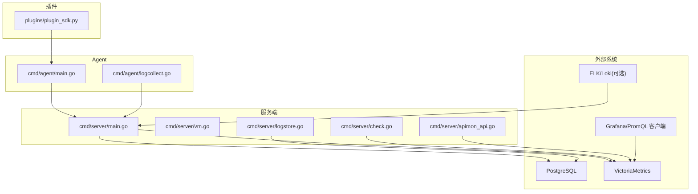
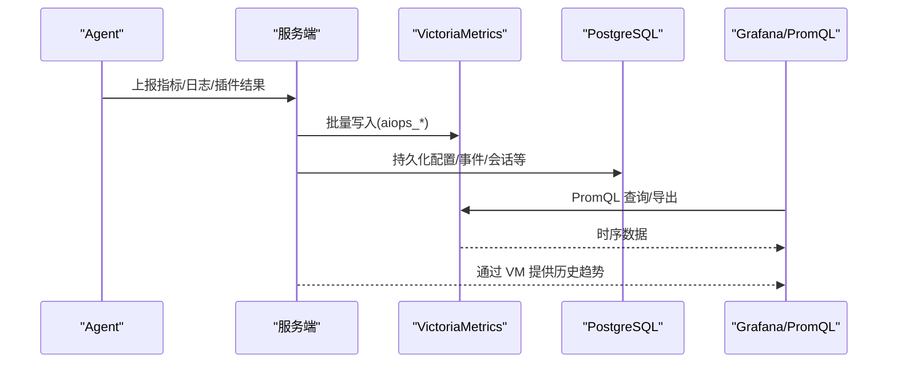
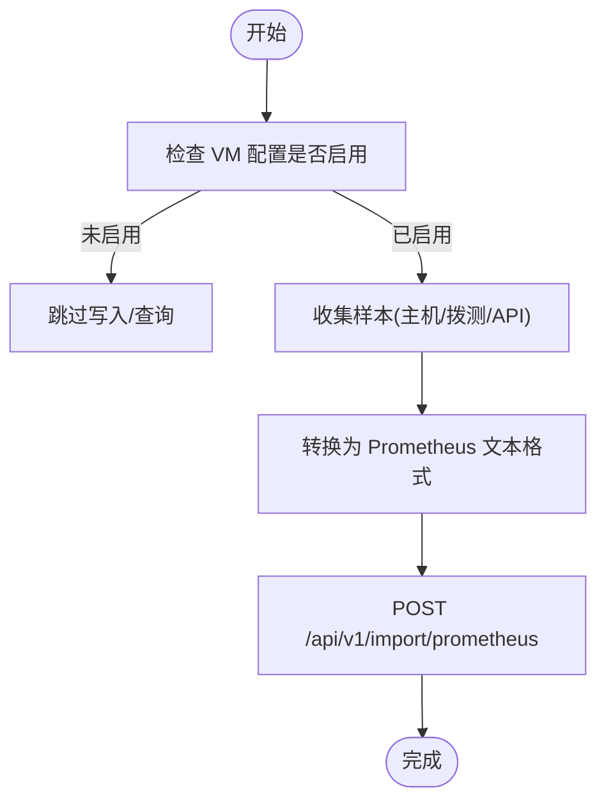
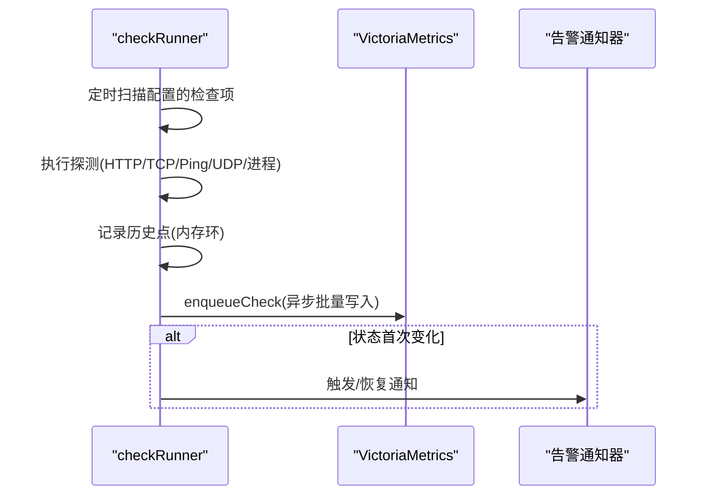
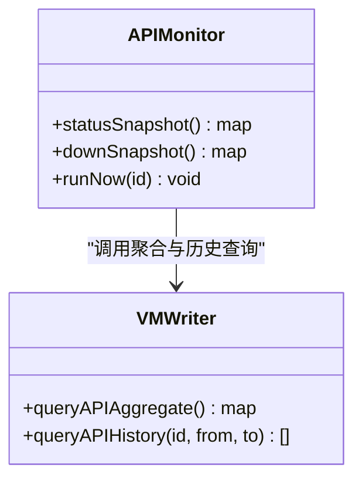
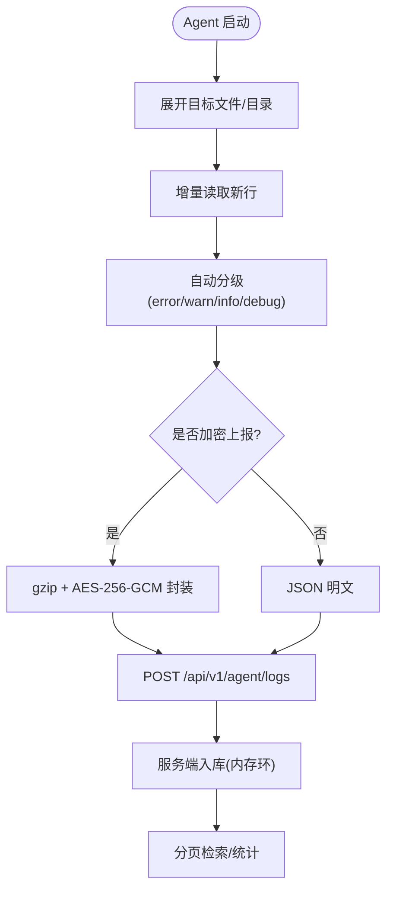
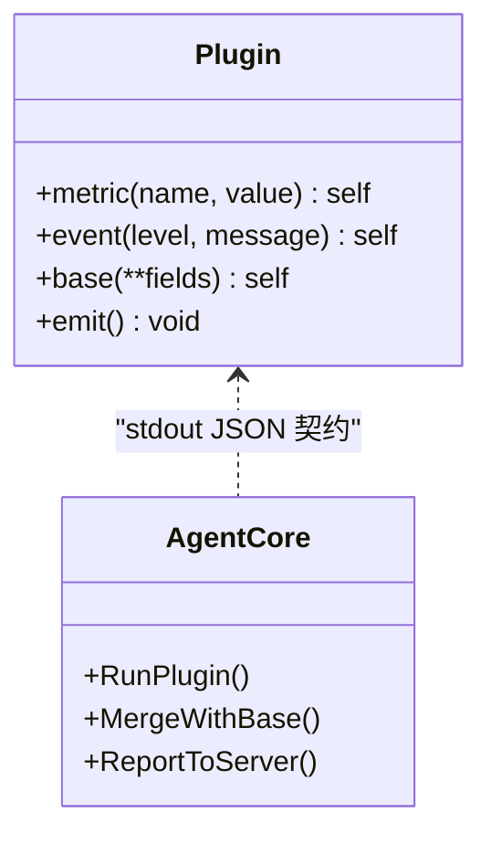
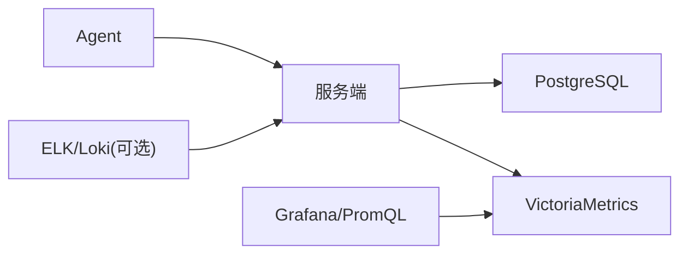

# 监控集成

<cite>
**本文引用的文件**   
- [README.md](file://README.md)
- [config.example.json](file://config.example.json)
- [server_config.example.json](file://server_config.example.json)
- [cmd/server/main.go](file://cmd/server/main.go)
- [cmd/server/vm.go](file://cmd/server/vm.go)
- [cmd/server/check.go](file://cmd/server/check.go)
- [cmd/server/apimon_api.go](file://cmd/server/apimon_api.go)
- [cmd/server/logstore.go](file://cmd/server/logstore.go)
- [cmd/agent/main.go](file://cmd/agent/main.go)
- [cmd/agent/logcollect.go](file://cmd/agent/logcollect.go)
- [plugins/plugin_sdk.py](file://plugins/plugin_sdk.py)
</cite>

## 目录
1. [简介](#简介)
2. [项目结构](#项目结构)
3. [核心组件](#核心组件)
4. [架构总览](#架构总览)
5. [详细组件分析](#详细组件分析)
6. [依赖关系分析](#依赖关系分析)
7. [性能与容量规划](#性能与容量规划)
8. [故障排查指南](#故障排查指南)
9. [结论](#结论)
10. [附录：对接方案与最佳实践](#附录：对接方案与最佳实践)

## 简介
本指南面向企业运维与 SRE 团队，提供基于 AIOps Monitor 的监控系统集成方案。内容覆盖：
- 外部监控平台对接（Prometheus、Grafana、ELK Stack）
- VictoriaMetrics 时序数据库的配置与使用（数据写入、查询优化、存储策略）
- 日志聚合与分析（结构化日志格式、全文检索、错误模式识别）
- APM 工具集成（分布式追踪、链路分析、性能剖析）
- 自定义监控插件开发与第三方系统集成最佳实践

AIOps Monitor 采用“统一存储”设计：关系数据落 PostgreSQL，时序数据落 VictoriaMetrics；内置内存窗口仅作为热缓存，历史趋势由 VM 提供。Agent 侧支持多服务端推送、中继模式、日志加密上报等能力。

## 项目结构
仓库采用 Go 单二进制服务端 + Python 插件层 + 前端内嵌的模式，关键路径如下：
- cmd/server：服务端主程序、VM 集成、拨测、API 监控、日志聚合等
- cmd/agent：采集 Agent，负责指标上报、日志采集、中继转发
- plugins：Python 插件 SDK 与示例
- 配置示例：config.example.json、server_config.example.json
- README：部署、特性、配置与环境变量说明

图表来源
- [cmd/server/main.go:227-355](file://cmd/server/main.go#L227-L355)
- [cmd/server/vm.go:1-800](file://cmd/server/vm.go#L1-L800)
- [cmd/server/check.go:1-867](file://cmd/server/check.go#L1-L867)
- [cmd/server/apimon_api.go:1-134](file://cmd/server/apimon_api.go#L1-L134)
- [cmd/server/logstore.go:1-318](file://cmd/server/logstore.go#L1-L318)
- [cmd/agent/main.go:1-238](file://cmd/agent/main.go#L1-L238)
- [cmd/agent/logcollect.go:1-231](file://cmd/agent/logcollect.go#L1-L231)
- [plugins/plugin_sdk.py:1-58](file://plugins/plugin_sdk.py#L1-L58)

章节来源
- [README.md:1-800](file://README.md#L1-L800)

## 核心组件
- 服务端主进程：加载配置、连接 PG/VM、启动 HTTP 服务、调度检查与 API 监控、持久化状态
- VictoriaMetrics 集成：批量写入 Prometheus 文本格式、按时间范围导出、PromQL 聚合查询
- 自定义拨测：HTTP/TCP/Ping/UDP/进程存活，带去抖、阈值告警、历史曲线
- API 性能监控：业务接口批量探测，实时状态 + VM 现算聚合（平均/P95/可用率/吞吐）
- 日志聚合：Agent 增量 tail → 服务端内存环形缓冲 + 分页检索 + 统计面板
- 插件体系：Python SDK 输出 metrics/events/base，Go 核心执行并合并上报

章节来源
- [cmd/server/main.go:227-355](file://cmd/server/main.go#L227-L355)
- [cmd/server/vm.go:1-800](file://cmd/server/vm.go#L1-L800)
- [cmd/server/check.go:1-867](file://cmd/server/check.go#L1-L867)
- [cmd/server/apimon_api.go:1-134](file://cmd/server/apimon_api.go#L1-L134)
- [cmd/server/logstore.go:1-318](file://cmd/server/logstore.go#L1-L318)
- [plugins/plugin_sdk.py:1-58](file://plugins/plugin_sdk.py#L1-L58)

## 架构总览
整体数据流：
- Agent 采集主机指标与日志，上报至服务端
- 服务端将指标以 Prometheus 文本格式批量写入 VictoriaMetrics，同时维护内存窗口用于热数据
- 拨测与 API 监控结果同样写入 VM，供历史曲线与聚合查询
- 日志在服务端内存中聚合，支持分页检索与统计；可结合外部日志系统（如 Loki/ELK）扩展

图表来源
- [cmd/server/main.go:227-355](file://cmd/server/main.go#L227-L355)
- [cmd/server/vm.go:1-800](file://cmd/server/vm.go#L1-L800)

## 详细组件分析

### VictoriaMetrics 集成与使用
- 启用方式：设置环境变量 AIOPS_VM_URL（或对应配置），服务端启动时校验必填
- 写入机制：将主机指标、拨测、API 监控结果转换为 Prometheus 文本格式，批量 POST 到 /api/v1/import/prometheus
- 读取机制：通过 /api/v1/export 拉取 NDJSON，按时间戳重组为样本；PromQL 瞬时查询用于聚合（平均、P95、可用率、采样数）
- 指标族：aiops_*（主机）、aiops_check_*（拨测）、aiops_api_*（API 监控）
- 查询优化：按 host/instance/category 标签过滤；对 GPU/磁盘/连接计数等复合字段按标签重建结构

图表来源
- [cmd/server/vm.go:1-800](file://cmd/server/vm.go#L1-L800)

章节来源
- [cmd/server/main.go:255-272](file://cmd/server/main.go#L255-L272)
- [cmd/server/vm.go:1-800](file://cmd/server/vm.go#L1-L800)

### 自定义拨测与阈值告警
- 类型：HTTP/TCP/Ping/UDP/进程存活
- 去抖：连续失败/成功达到阈值才切换 down/up 状态，避免抖动
- 阈值：支持 Ping 丢包率/延迟、TCP 超时、HTTP 响应时间与状态码、进程失败次数等
- 历史：内存环形缓冲区 + VM 持久化，重启后可查历史曲线

图表来源
- [cmd/server/check.go:1-867](file://cmd/server/check.go#L1-L867)
- [cmd/server/vm.go:1-800](file://cmd/server/vm.go#L1-L800)

章节来源
- [cmd/server/check.go:1-867](file://cmd/server/check.go#L1-L867)

### API 性能监控
- 功能：按业务系统批量探测接口，返回实时状态与 VM 聚合指标（平均/P95/可用率/吞吐）
- 聚合实现：通过 PromQL 在 VM 侧计算 avg_over_time、quantile_over_time、count_over_time 等
- 历史曲线：从 VM 导出 aiops_api_* 系列，重组为时间序列

图表来源
- [cmd/server/apimon_api.go:1-134](file://cmd/server/apimon_api.go#L1-L134)
- [cmd/server/vm.go:1-800](file://cmd/server/vm.go#L1-L800)

章节来源
- [cmd/server/apimon_api.go:1-134](file://cmd/server/apimon_api.go#L1-L134)
- [cmd/server/vm.go:1-800](file://cmd/server/vm.go#L1-L800)

### 日志聚合与检索
- 采集：Agent 增量 tail 指定文件或目录，自动识别轮转，压缩+AES-GCM 加密上报
- 服务端：内存环形缓冲（上限固定），支持按主机/级别/关键字/时间分页检索与统计
- 持久化：仅保留最近少量日志到 PG，重启后快速恢复热尾

图表来源
- [cmd/agent/logcollect.go:1-231](file://cmd/agent/logcollect.go#L1-L231)
- [cmd/server/logstore.go:1-318](file://cmd/server/logstore.go#L1-L318)

章节来源
- [cmd/agent/logcollect.go:1-231](file://cmd/agent/logcollect.go#L1-L231)
- [cmd/server/logstore.go:1-318](file://cmd/server/logstore.go#L1-L318)

### 插件开发（Python SDK）
- 约定：向 stdout 输出 JSON，包含 metrics/events/base
- 执行：Go 核心以子进程运行，崩溃/超时不影响核心
- 用途：自定义指标、事件上报、非 Linux 平台基础指标兜底

图表来源
- [plugins/plugin_sdk.py:1-58](file://plugins/plugin_sdk.py#L1-L58)
- [cmd/agent/main.go:1-238](file://cmd/agent/main.go#L1-L238)

章节来源
- [plugins/plugin_sdk.py:1-58](file://plugins/plugin_sdk.py#L1-L58)
- [cmd/agent/main.go:1-238](file://cmd/agent/main.go#L1-L238)

## 依赖关系分析
- 运行时依赖：PostgreSQL（关系数据）、VictoriaMetrics（时序数据）
- 网络依赖：Agent→服务端（指标/日志/终端/转发）、服务端→VM（写入/查询）
- 外部系统：Grafana/PromQL 客户端可直接查询 VM；ELK/Loki 可作为日志扩展源

图表来源
- [cmd/server/main.go:227-355](file://cmd/server/main.go#L227-L355)
- [cmd/server/vm.go:1-800](file://cmd/server/vm.go#L1-L800)

章节来源
- [cmd/server/main.go:227-355](file://cmd/server/main.go#L227-L355)

## 性能与容量规划
- 带宽：API/静态资源 gzip 压缩，多主机轮询下行显著降低带宽
- 上报吞吐：高并发 Upsert 仅短暂持锁，内存窗口作为热缓存
- 历史存储：建议将长期历史交由 VM，服务端内存窗口仅保留短期数据
- 调优：主机规模较大时增大上报间隔，减少 CPU/带宽压力

章节来源
- [README.md:1096-1124](file://README.md#L1096-L1124)

## 故障排查指南
- 启动失败：若未配置 AIOPS_POSTGRES_DSN 或 AIOPS_VM_URL，服务端拒绝启动
- VM 写入失败：查看服务端日志中的警告信息，确认 VM 地址与网络连通性
- 日志缺失：确认 Agent 已配置 --log-paths 且具备读取权限；检查加密上报开关与服务端解密逻辑
- 拨测异常：关注去抖逻辑与阈值配置，必要时调整 IntervalSec 与阈值

章节来源
- [cmd/server/main.go:255-272](file://cmd/server/main.go#L255-L272)
- [cmd/server/vm.go:1-800](file://cmd/server/vm.go#L1-L800)
- [cmd/agent/logcollect.go:1-231](file://cmd/agent/logcollect.go#L1-L231)
- [cmd/server/check.go:1-867](file://cmd/server/check.go#L1-L867)

## 结论
AIOps Monitor 提供了统一的监控与 SRE 中枢能力，结合 VictoriaMetrics 可实现高性能、可扩展的时序数据存储与查询。通过插件与日志聚合，可灵活扩展自定义指标与观测维度。对外部监控平台的对接可通过标准协议（Prometheus 文本、PromQL、Webhook）实现无缝集成。

## 附录：对接方案与最佳实践

### 与 Prometheus/Grafana 集成
- 数据源：直接使用 VictoriaMetrics 作为 Prometheus 兼容的数据源
- 查询语言：PromQL，利用 VM 的 /api/v1/query 与 /api/v1/export
- 可视化：Grafana 添加 VictoriaMetrics 数据源，构建仪表盘
- 指标命名：遵循 aiops_* 前缀，合理设置 label（host、instance、category、api_id、system、endpoint 等）

章节来源
- [cmd/server/vm.go:1-800](file://cmd/server/vm.go#L1-L800)

### 与 ELK Stack 集成
- 日志采集：Agent 增量 tail 本地日志，服务端内存聚合检索
- 扩展方案：可将服务端日志或应用日志投递至 ELK/Loki，实现全文检索与复杂分析
- 结构化日志：建议在应用层输出结构化日志（JSON），便于后续解析与关联

章节来源
- [cmd/server/logstore.go:1-318](file://cmd/server/logstore.go#L1-L318)
- [cmd/agent/logcollect.go:1-231](file://cmd/agent/logcollect.go#L1-L231)

### 与 APM 工具集成（分布式追踪/链路分析/性能剖析）
- 指标联动：将 APM 生成的关键指标（QPS、错误率、P95）以相同标签模型写入 VM，便于与主机/拨测指标同屏对比
- 链路关联：在日志中注入 trace_id/span_id，结合 ELK/Loki 进行跨系统链路分析
- 性能剖析：将热点函数耗时、GC 停顿等指标纳入 aiops_* 指标族，统一展示与告警

[本节为概念性指导，不直接分析具体代码文件]

### 自定义监控插件与第三方系统集成最佳实践
- 插件规范：遵循 plugin_sdk 约定的 JSON 输出，避免阻塞与长时间运行
- 指标命名：使用命名空间前缀（如 mysql.、nginx.），避免冲突
- 事件上报：对异常与变更及时产生事件，便于审计与诊断
- 安全传输：开启日志加密上报，生产环境启用 TLS 终止代理或直连 HTTPS

章节来源
- [plugins/plugin_sdk.py:1-58](file://plugins/plugin_sdk.py#L1-L58)
- [cmd/agent/main.go:1-238](file://cmd/agent/main.go#L1-L238)
- [cmd/server/main.go:341-351](file://cmd/server/main.go#L341-L351)