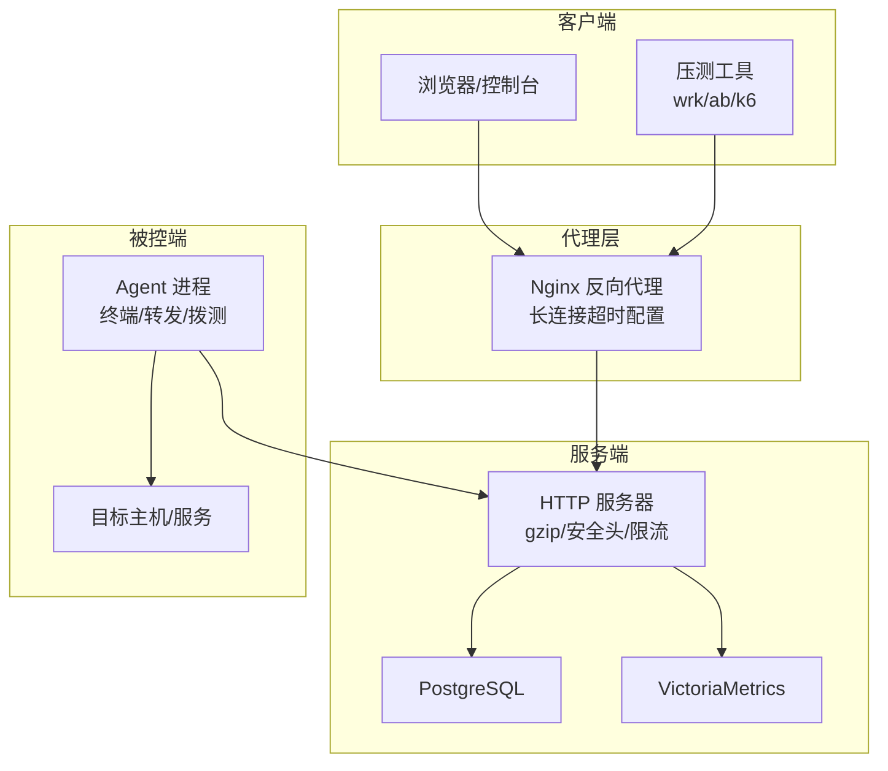
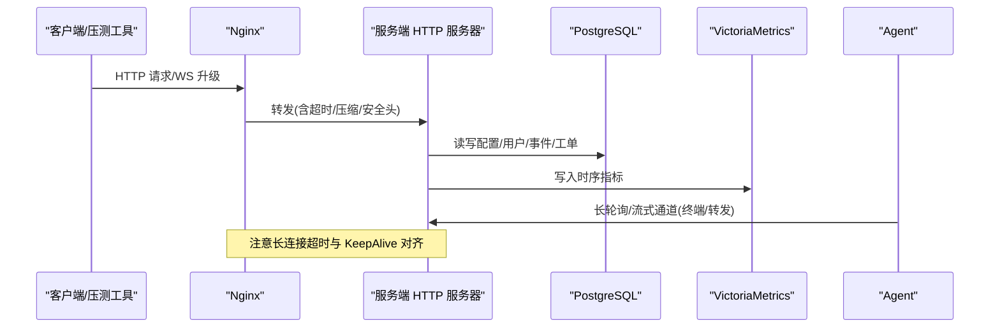
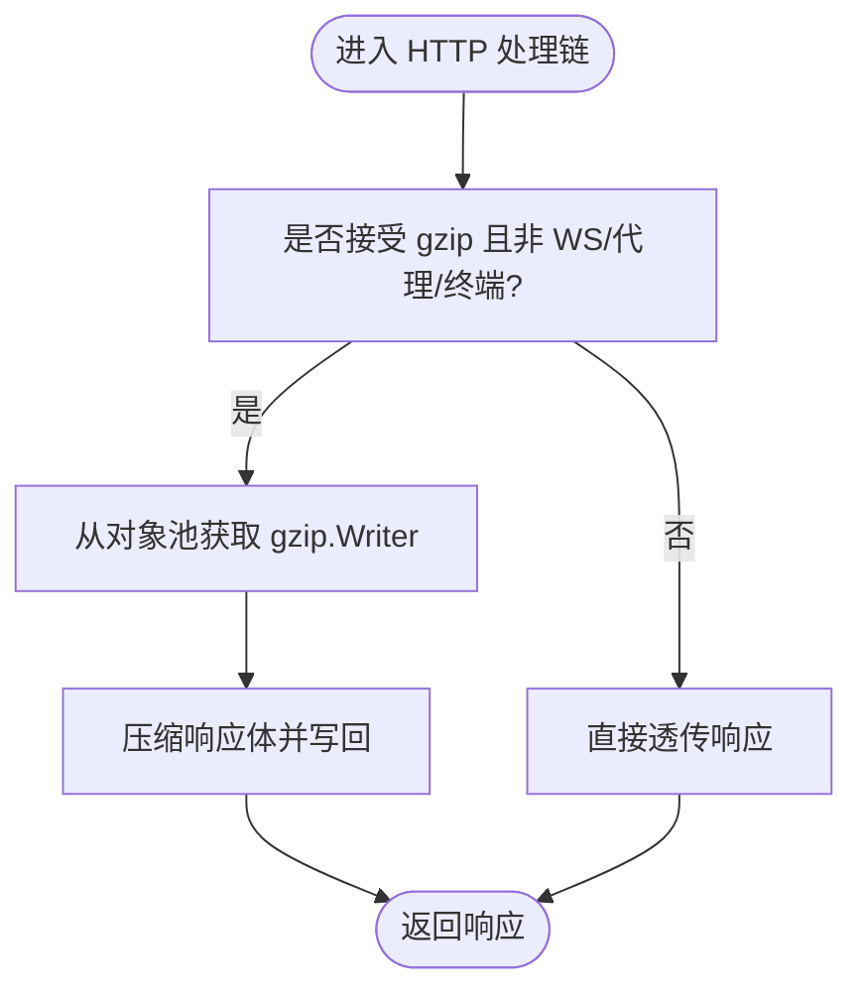
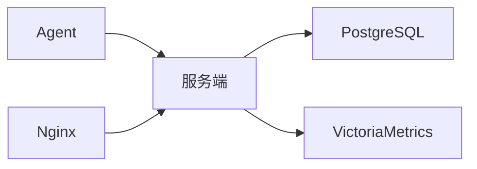

# 系统调优

<cite>
**本文引用的文件列表**
- [cmd/server/main.go](file://cmd/server/main.go)
- [cmd/agent/main.go](file://cmd/agent/main.go)
- [cmd/agent/terminal.go](file://cmd/agent/terminal.go)
- [cmd/agent/forward.go](file://cmd/agent/forward.go)
- [deploy/nginx-aiops.conf](file://deploy/nginx-aiops.conf)
- [README.md](file://README.md)
</cite>

## 目录
1. [简介](#简介)
2. [项目结构](#项目结构)
3. [核心组件](#核心组件)
4. [架构总览](#架构总览)
5. [详细组件分析](#详细组件分析)
6. [依赖关系分析](#依赖关系分析)
7. [性能考虑](#性能考虑)
8. [故障排查指南](#故障排查指南)
9. [结论](#结论)
10. [附录](#附录)

## 简介
本指南聚焦于 AIOps Monitor 在生产环境的系统级与运行时级调优，覆盖以下方面：
- Go 运行时参数优化（GOMAXPROCS、GOGC、GOMEMLIMIT）
- HTTP 服务器性能调优（连接池、超时、并发限制、压缩）
- 内存管理优化（对象池、GC 调优、内存泄漏检测）
- 文件系统 I/O 优化、网络栈调优、操作系统内核参数调整
- 不同部署规模下的基准测试方法与对比分析建议

说明：仓库中未包含现成的基准测试脚本或数据，本节提供可复用的压测方案与指标采集方法，便于在不同规模下产出对比结果。

## 项目结构
本项目为单二进制服务端 + Agent 的监控平台，Go 语言实现，后端统一使用 PostgreSQL（关系数据）+ VictoriaMetrics（时序数据）。HTTP 服务内置 gzip 压缩、安全头、请求体大小限制等中间件；Agent 侧提供终端会话、端口转发、拨测等能力。

图示来源
- [cmd/server/main.go:294-303](file://cmd/server/main.go#L294-L303)
- [deploy/nginx-aiops.conf:54-58](file://deploy/nginx-aiops.conf#L54-L58)

章节来源
- [cmd/server/main.go:227-355](file://cmd/server/main.go#L227-L355)
- [README.md:556-573](file://README.md#L556-L573)

## 核心组件
- 服务端 HTTP 服务器：负责 API、静态资源、WebSocket 终端、端口转发代理、TLS 终止等。
- Agent：负责采集、插件执行、日志上报、终端/转发通道、拨测等。
- 存储：PostgreSQL（关系数据）、VictoriaMetrics（时序数据）。
- 反向代理：Nginx 用于 TLS 终止、长连接超时、负载均衡等。

章节来源
- [cmd/server/main.go:227-355](file://cmd/server/main.go#L227-L355)
- [cmd/agent/main.go:74-238](file://cmd/agent/main.go#L74-L238)
- [deploy/nginx-aiops.conf:54-58](file://deploy/nginx-aiops.conf#L54-L58)

## 架构总览
下图展示关键请求路径与调优点：浏览器/Nginx → 服务端 HTTP 服务器 → 存储（PG/VM），以及 Agent 与服务端的长连接通道。

图示来源
- [cmd/server/main.go:294-303](file://cmd/server/main.go#L294-L303)
- [cmd/agent/terminal.go:52-73](file://cmd/agent/terminal.go#L52-L73)
- [deploy/nginx-aiops.conf:54-58](file://deploy/nginx-aiops.conf#L54-L58)

## 详细组件分析

### Go 运行时参数优化
- GOMAXPROCS
  - 建议：默认值通常为 CPU 核数，生产环境一般无需手动设置；若存在大量阻塞型 I/O（如磁盘/网络），可适当提高以利用多核并行。
  - 验证：通过 /proc/cpuinfo 或 go env GOMAXPROCS 确认实际生效值。
- GOGC
  - 作用：控制 GC 触发阈值（百分比）。默认 100，增大可降低 GC 频率但增加峰值内存，减小则更频繁回收。
  - 建议：在内存受限场景先尝试 120–150，观察 GC 暂停时间与吞吐变化；对延迟敏感且内存充足可保持默认或略降。
- GOMEMLIMIT
  - 作用：设定软上限，超过后触发更积极的 GC。适合容器化部署，避免 OOM。
  - 建议：设置为容器内存限制的 80%–90%，结合 GOGC 共同调优。
- 其他
  - GODEBUG=gctrace=1：短期定位 GC 行为。
  - runtime.SetMutexProfileFraction、runtime.SetBlockProfileRate：开启锁/阻塞采样，辅助定位热点。

章节来源
- [cmd/server/main.go:227-355](file://cmd/server/main.go#L227-L355)
- [cmd/agent/main.go:74-238](file://cmd/agent/main.go#L74-L238)

### HTTP 服务器性能调优
- 连接与超时
  - ReadHeaderTimeout：保护慢头攻击，同时不限制正文长度，适配终端/转发长连接。
  - IdleTimeout：空闲连接回收时间，需与上游代理保持一致。
  - 建议：根据业务特征调整，确保与 Nginx 的 proxy_read_timeout/proxy_send_timeout 对齐。
- 并发与连接池
  - 服务端 http.Server 使用标准库调度，并发由 GOMAXPROCS 与内核调度决定。
  - Agent 侧 HTTP 客户端显式配置 MaxIdleConns、IdleConnTimeout、KeepAlive，避免连接抖动。
- 压缩与安全
  - 内置 gzip 中间件，针对 JSON/文本响应压缩，显著降低带宽占用。
  - 安全头与 CSP 增强安全性，/proxy 路径跳过部分策略以保证目标站点正常。
- 请求体限制
  - 全局最大请求体限制，防止恶意大负载导致内存耗尽。
- 反向代理（Nginx）
  - 长连接超时拉高至 24h，匹配终端会话上限，避免误断。

图示来源
- [cmd/server/main.go:147-205](file://cmd/server/main.go#L147-L205)
- [cmd/agent/terminal.go:52-73](file://cmd/agent/terminal.go#L52-L73)
- [deploy/nginx-aiops.conf:54-58](file://deploy/nginx-aiops.conf#L54-L58)

章节来源
- [cmd/server/main.go:294-303](file://cmd/server/main.go#L294-L303)
- [cmd/server/main.go:147-205](file://cmd/server/main.go#L147-L205)
- [cmd/agent/terminal.go:52-73](file://cmd/agent/terminal.go#L52-L73)
- [deploy/nginx-aiops.conf:54-58](file://deploy/nginx-aiops.conf#L54-L58)

### 内存管理优化策略
- 对象池
  - gzip.Writer 复用：减少频繁分配带来的 GC 压力，在高并发场景尤为明显。
- GC 调优
  - 结合 GOGC 与 GOMEMLIMIT，平衡延迟与吞吐；在容器环境中优先用 GOMEMLIMIT 做软上限。
- 内存泄漏检测
  - 启用 pprof 内存 profile，定期抓取 heap profile，对比基线差异定位增长点。
  - 关注长连接（终端/转发）生命周期，确保会话结束及时释放资源。
- 日志与缓存
  - 日志聚合采用有界环形缓冲，避免无限增长；持久化仅保留尾部窗口，降低 WAL 压力。

章节来源
- [cmd/server/main.go:147-205](file://cmd/server/main.go#L147-L205)
- [cmd/server/logstore.go:1-43](file://cmd/server/logstore.go#L1-L43)

### 文件系统 I/O 优化
- 日志采集
  - 服务端内存环容量与持久化窗口可控，避免重启后全量重建。
- 磁盘 IO 采集
  - 基于 /proc/diskstats 计算速率与 IOPS，估算 IO 利用率，作为告警阈值参考。
- 建议
  - 将数据盘置于高性能 SSD，合理分区与挂载选项（如 noatime）。
  - 控制日志滚动策略，避免单文件过大影响检索与写入。

章节来源
- [cmd/server/logstore.go:1-43](file://cmd/server/logstore.go#L1-L43)
- [cmd/agent/collector_linux.go:132-167](file://cmd/agent/collector_linux.go#L132-L167)

### 网络栈调优与内核参数
- 应用层
  - 对齐 Nginx 与服务的长连接超时，避免半开连接堆积。
  - Agent 侧 HTTP 客户端设置合理的 KeepAlive 与空闲连接超时，提升复用率。
- 内核层（Linux 示例）
  - net.core.somaxconn：增大监听队列，缓解突发连接积压。
  - net.ipv4.tcp_tw_reuse/net.ipv4.tcp_fin_timeout：缩短 TIME_WAIT 回收时间，提升短连接吞吐。
  - net.ipv4.ip_local_port_range：扩大临时端口范围，避免端口耗尽。
  - vm.swappiness：降低交换倾向，保证内存优先。
- 建议
  - 在容器/云原生环境，结合 cgroup 限制与内核参数协同调优。

章节来源
- [cmd/agent/terminal.go:52-73](file://cmd/agent/terminal.go#L52-L73)
- [deploy/nginx-aiops.conf:54-58](file://deploy/nginx-aiops.conf#L54-L58)

### 不同部署规模的基准测试与对比分析
由于仓库未提供基准脚本与数据，以下为推荐方法：
- 小规模（单机/少量主机）
  - 工具：wrk/ab/k6
  - 场景：登录、查询主机列表、查看趋势图、API 拨测
  - 指标：QPS、P95/P99 时延、CPU/内存/GC 次数
- 中等规模（数十至上百主机）
  - 场景：高频轮询、批量指标写入、终端/转发长连接
  - 指标：连接数、上行带宽、PG/VM 写入延迟
- 大规模（数百主机以上）
  - 场景：并发拨测、AI 巡检、SLO 评估、Playbook 编排
  - 指标：端到端延迟、错误率、资源饱和度（CPU/内存/IO/网络）
- 对比维度
  - 不同 GOMAXPROCS/GOGC/GOMEMLIMIT 组合
  - 是否启用 gzip、是否启用 TLS
  - Nginx 长连接超时与 KeepAlive 策略
  - PG/VM 资源配置与连接池

[本节为方法论指导，不涉及具体代码文件]

## 依赖关系分析
- 服务端依赖
  - PostgreSQL：关系数据存储（配置、用户、审计、事件、工单、会话）
  - VictoriaMetrics：时序数据存储（指标、趋势）
- Agent 依赖
  - 服务端：注册、上报、终端/转发通道、拨测
  - 目标主机：本地采集与插件执行
- 反向代理
  - Nginx：TLS 终止、长连接超时、负载均衡

图示来源
- [cmd/server/main.go:227-355](file://cmd/server/main.go#L227-L355)
- [cmd/agent/main.go:74-238](file://cmd/agent/main.go#L74-L238)
- [deploy/nginx-aiops.conf:54-58](file://deploy/nginx-aiops.conf#L54-L58)

章节来源
- [cmd/server/main.go:227-355](file://cmd/server/main.go#L227-L355)
- [cmd/agent/main.go:74-238](file://cmd/agent/main.go#L74-L238)
- [deploy/nginx-aiops.conf:54-58](file://deploy/nginx-aiops.conf#L54-L58)

## 性能考虑
- 压缩与带宽
  - 启用 gzip 可显著降低 JSON 响应体积，提升面板轮询效率。
- 长连接与会话
  - 终端/转发会话需要长连接，务必对齐 Nginx 与服务端超时，避免意外断开。
- 资源隔离
  - 容器化部署下，结合 GOMEMLIMIT 与 cgroup 限制，避免内存溢出。
- 外部依赖
  - PG/VM 的性能直接影响整体吞吐，需关注连接池、索引、分片与写入批量化。

[本节为通用指导，不涉及具体代码文件]

## 故障排查指南
- 常见问题
  - 长连接中断：检查 Nginx 与服务的超时配置是否一致。
  - 内存增长：启用 pprof 抓取 heap profile，关注长连接与日志缓存。
  - GC 抖动：调整 GOGC/GOMEMLIMIT，观察 GC 暂停与吞吐变化。
  - 权限问题：Agent 采集 /proc 路径被安全模块拦截，按提示修复权限或切换宽容模式。
- 诊断步骤
  - 查看服务启动日志与告警信息。
  - 使用 pprof 进行 CPU/内存/阻塞/锁分析。
  - 核对 PG/VM 连接与写入延迟。
  - 校验 Nginx 日志与上游健康状态。

章节来源
- [cmd/agent/collector_linux.go:169-209](file://cmd/agent/collector_linux.go#L169-L209)
- [cmd/server/main.go:294-303](file://cmd/server/main.go#L294-L303)
- [deploy/nginx-aiops.conf:54-58](file://deploy/nginx-aiops.conf#L54-L58)

## 结论
通过对 Go 运行时、HTTP 服务器、内存管理、I/O 与网络栈的系统性调优，并结合不同规模的压测与对比分析，可在保障稳定性的前提下显著提升吞吐与用户体验。建议在容器化环境中优先使用 GOMEMLIMIT 控制内存上限，配合 GOGC 精细调节 GC 行为；在服务端启用 gzip 与安全头，并确保 Nginx 长连接超时与服务端一致。

[本节为总结，不涉及具体代码文件]

## 附录
- 环境变量与配置覆盖
  - AIOPS_POSTGRES_DSN、AIOPS_VM_URL、AIOPS_SECRET_KEY、AIOPS_TLS_CERT/AIOPS_TLS_KEY 等可通过环境变量覆盖配置文件，便于动态调整。
- 安全与合规
  - 启用 TLS 加密传输，严格 CSP 与请求体限制，避免安全风险。

章节来源
- [README.md:556-573](file://README.md#L556-L573)