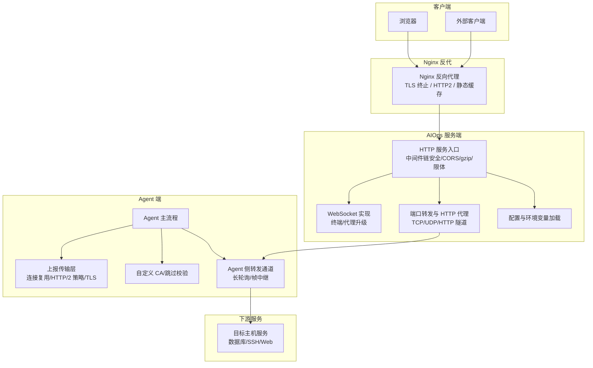
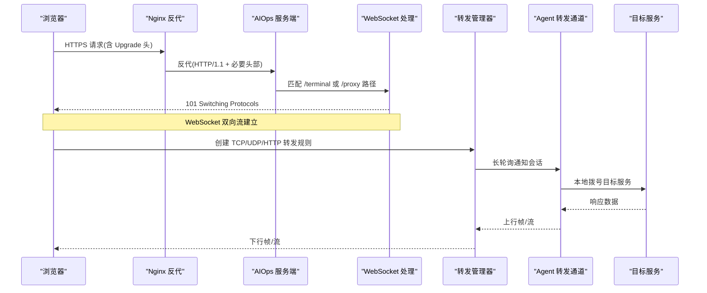
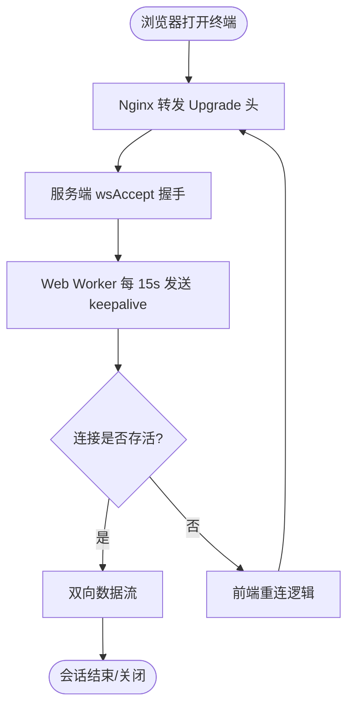
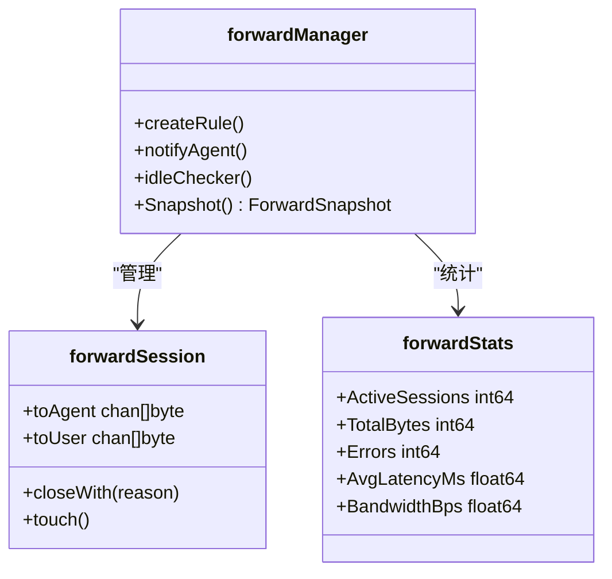
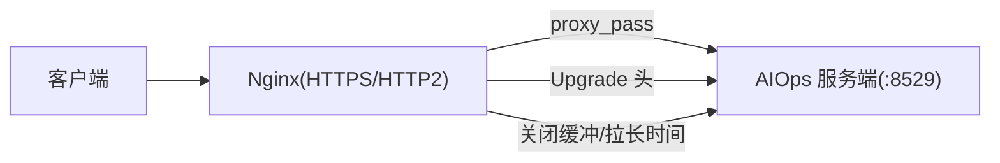
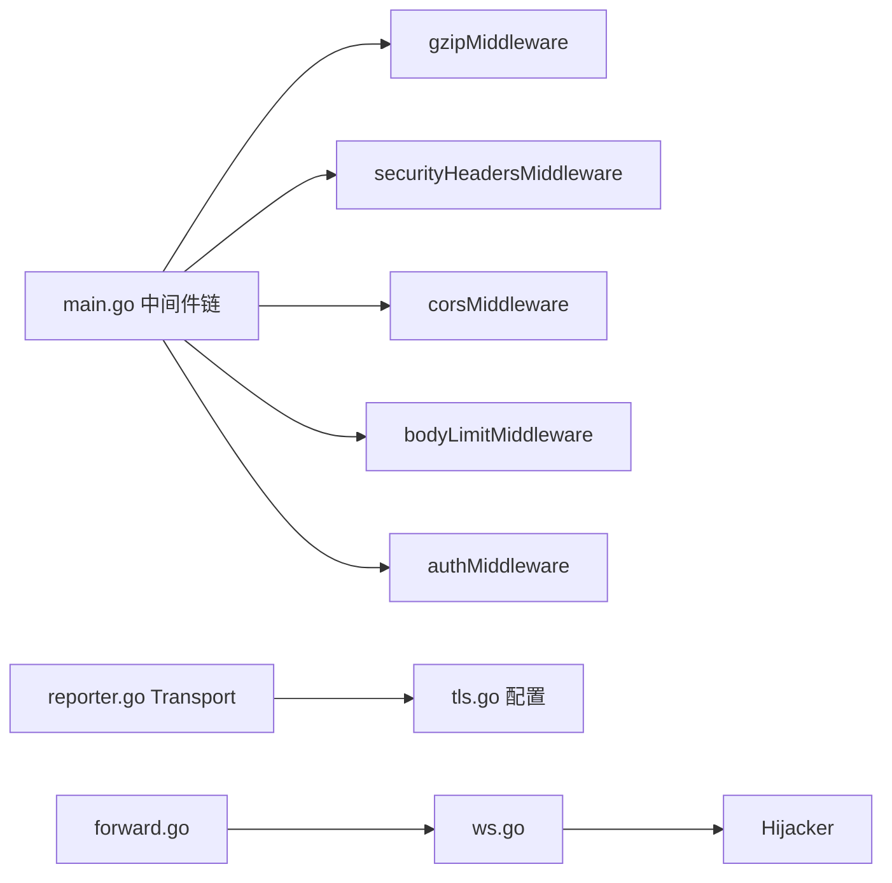

# 网络优化

<cite>
**本文引用的文件**   
- [cmd/server/main.go](file://cmd/server/main.go)
- [cmd/agent/reporter.go](file://cmd/agent/reporter.go)
- [cmd/agent/tls.go](file://cmd/agent/tls.go)
- [cmd/server/ws.go](file://cmd/server/ws.go)
- [cmd/server/forward.go](file://cmd/server/forward.go)
- [cmd/agent/forward.go](file://cmd/agent/forward.go)
- [deploy/nginx-aiops.conf](file://deploy/nginx-aiops.conf)
- [docker/nginx/nginx-frontend.conf](file://docker/nginx/nginx-frontend.conf)
- [cmd/server/config.go](file://cmd/server/config.go)
- [README.md](file://README.md)
</cite>

## 目录
1. [简介](#简介)
2. [项目结构](#项目结构)
3. [核心组件](#核心组件)
4. [架构总览](#架构总览)
5. [详细组件分析](#详细组件分析)
6. [依赖关系分析](#依赖关系分析)
7. [性能考量](#性能考量)
8. [故障诊断指南](#故障诊断指南)
9. [结论](#结论)

## 简介
本指南聚焦于 AIOps Monitor 的网络传输与代理链路优化，覆盖以下主题：
- HTTP/HTTPS 传输优化：gzip 压缩、HTTP/2 支持策略、连接复用与超时控制
- WebSocket 通信优化：心跳机制、重连策略、消息队列管理
- 端口转发性能调优：缓冲区大小、并发会话上限、带宽限制
- 代理服务器配置优化：反向代理、负载均衡、SSL 终止
- 监控指标与故障诊断方法

## 项目结构
与网络优化相关的核心代码分布在服务端与 Agent 端，以及 Nginx 反代示例配置中。下图给出关键文件与职责概览：

图示来源
- [cmd/server/main.go:1-355](file://cmd/server/main.go#L1-L355)
- [cmd/server/ws.go:1-70](file://cmd/server/ws.go#L1-L70)
- [cmd/server/forward.go:1-800](file://cmd/server/forward.go#L1-L800)
- [cmd/agent/reporter.go:1-49](file://cmd/agent/reporter.go#L1-L49)
- [cmd/agent/tls.go:1-73](file://cmd/agent/tls.go#L1-L73)
- [cmd/agent/forward.go:1-290](file://cmd/agent/forward.go#L1-L290)
- [deploy/nginx-aiops.conf:1-68](file://deploy/nginx-aiops.conf#L1-L68)

章节来源
- [cmd/server/main.go:1-355](file://cmd/server/main.go#L1-L355)
- [deploy/nginx-aiops.conf:1-68](file://deploy/nginx-aiops.conf#L1-L68)

## 核心组件
- 服务端 HTTP 中间件链与安全头、CORS、gzip 压缩、请求体限制
- Agent 上报传输层：连接池、KeepAlive、HTTP/2 策略、TLS 信任库
- WebSocket 实现：RFC 6455 最小实现，用于远程终端与代理升级
- 端口转发管理器：TCP/UDP/HTTP 隧道、会话计数、空闲清理、带宽统计
- Nginx 反代：TLS 终止、HTTP/2、WebSocket 升级、缓冲与超时

章节来源
- [cmd/server/main.go:147-205](file://cmd/server/main.go#L147-L205)
- [cmd/agent/reporter.go:21-49](file://cmd/agent/reporter.go#L21-L49)
- [cmd/server/ws.go:16-70](file://cmd/server/ws.go#L16-L70)
- [cmd/server/forward.go:32-135](file://cmd/server/forward.go#L32-L135)
- [deploy/nginx-aiops.conf:11-58](file://deploy/nginx-aiops.conf#L11-L58)

## 架构总览
下图展示从浏览器到目标服务的端到端路径，包括 Nginx 反代、服务端中间件、WebSocket 升级与端口转发隧道。

图示来源
- [deploy/nginx-aiops.conf:30-58](file://deploy/nginx-aiops.conf#L30-L58)
- [cmd/server/main.go:294-303](file://cmd/server/main.go#L294-L303)
- [cmd/server/ws.go:38-70](file://cmd/server/ws.go#L38-L70)
- [cmd/server/forward.go:500-526](file://cmd/server/forward.go#L500-L526)
- [cmd/agent/forward.go:54-95](file://cmd/agent/forward.go#L54-L95)

## 详细组件分析

### HTTP/HTTPS 传输优化
- gzip 压缩
  - 服务端通过中间件对 JSON/文本类响应启用 gzip，自动跳过 WebSocket 升级与代理/终端流式路径，避免阻塞实时流。
  - 使用 Writer 池减少分配开销，并删除 Content-Length 以避免压缩后长度不一致。
- HTTP/2 支持策略
  - Agent 上报传输层显式禁用 HTTP/2，以改善服务端重启后的恢复时间；单连接多路复用在服务重启时会导致大量并发请求同时失败，HTTP/1.1 的短连接池能更快自愈。
  - Nginx 反代示例开启 http2，适合面向浏览器的场景；Agent 到服务端仍采用 HTTP/1.1。
- 连接复用与超时
  - Agent 上报 Transport 设置 KeepAlive、MaxIdleConnsPerHost、IdleConnTimeout、TLSHandshakeTimeout 等，降低握手与建连成本。
  - 服务端 http.Server 设置 ReadHeaderTimeout 与 IdleTimeout，保护慢头攻击并合理回收空闲连接。
- TLS 与证书信任
  - 服务端支持环境变量注入证书/私钥直接提供 HTTPS；Agent 支持自定义 CA 或跳过校验（仅内网/自签临时使用）。

章节来源
- [cmd/server/main.go:147-205](file://cmd/server/main.go#L147-L205)
- [cmd/server/main.go:294-355](file://cmd/server/main.go#L294-L355)
- [cmd/agent/reporter.go:21-49](file://cmd/agent/reporter.go#L21-L49)
- [cmd/agent/tls.go:13-73](file://cmd/agent/tls.go#L13-L73)
- [deploy/nginx-aiops.conf:18-28](file://deploy/nginx-aiops.conf#L18-L28)

### WebSocket 通信优化
- 协议实现
  - 服务端基于标准库的最小 RFC 6455 实现，完成握手、文本/二进制帧、Ping/Pong、Close。
- 心跳机制
  - 前端通过 Web Worker 每 15s 发送 keepalive 帧，绕过后台标签节流，保持连接活跃。
- 重连策略
  - 前端维护多标签会话，断线后按策略重连；服务端对空闲会话有超时清理。
- 消息队列管理
  - 服务端在“等待 Agent”的长轮询未命中时，将新会话放入 pendingSessions，确保下次轮询可取回，避免丢消息导致 502。

图示来源
- [cmd/server/ws.go:38-70](file://cmd/server/ws.go#L38-L70)
- [cmd/server/web/js/terminal.js:1-33](file://cmd/server/web/js/terminal.js#L1-L33)
- [cmd/server/forward.go:500-526](file://cmd/server/forward.go#L500-L526)

章节来源
- [cmd/server/ws.go:16-70](file://cmd/server/ws.go#L16-L70)
- [cmd/server/web/js/terminal.js:1-33](file://cmd/server/web/js/terminal.js#L1-L33)
- [cmd/server/forward.go:500-526](file://cmd/server/forward.go#L500-L526)

### 端口转发性能调优
- 缓冲区大小
  - 服务端转发读缓冲为 32KB，提升吞吐；Agent 侧 UDP 分帧读取使用 64KB 缓冲。
- 并发与会话上限
  - 最大并发转发会话数限制为 300，防止资源耗尽；每个会话带超时，空闲 30 分钟强制关闭。
- 带宽限制与监控
  - 服务端维护滑动窗口（最近 60 秒）统计字节数，计算平均带宽 bps，暴露快照供告警阈值判断。
- 错误率与延迟
  - 累计错误计数与延迟采样，计算平均延迟毫秒，便于定位瓶颈。

图示来源
- [cmd/server/forward.go:32-135](file://cmd/server/forward.go#L32-L135)
- [cmd/server/forward.go:234-258](file://cmd/server/forward.go#L234-L258)
- [cmd/server/forward.go:277-310](file://cmd/server/forward.go#L277-L310)
- [cmd/agent/forward.go:187-211](file://cmd/agent/forward.go#L187-L211)

章节来源
- [cmd/server/forward.go:32-135](file://cmd/server/forward.go#L32-L135)
- [cmd/server/forward.go:277-310](file://cmd/server/forward.go#L277-L310)
- [cmd/agent/forward.go:187-211](file://cmd/agent/forward.go#L187-L211)

### 代理服务器网络配置优化
- 反向代理
  - Nginx 统一反代至后端 8529，设置必要的 X-Real-IP/X-Forwarded-* 头；如需基于真实 IP 做登录限流，需在服务端配置 trust_proxy。
- WebSocket 升级
  - 全局 map $http_upgrade → $connection_upgrade，location 下透传 Upgrade/Connection，并关闭缓冲与拉长超时。
- SSL 终止与 HTTP/2
  - Nginx 监听 443 并开启 http2，配置证书与私钥；建议将服务端置于 HTTPS 终止之后。
- 静态资源与缓存
  - 前端分离部署时可启用 proxy_cache_path 与 gzip_types，提高静态资源命中率与压缩比。

图示来源
- [deploy/nginx-aiops.conf:11-58](file://deploy/nginx-aiops.conf#L11-L58)
- [docker/nginx/nginx-frontend.conf:12-25](file://docker/nginx/nginx-frontend.conf#L12-L25)
- [cmd/server/config.go:443-463](file://cmd/server/config.go#L443-L463)

章节来源
- [deploy/nginx-aiops.conf:11-58](file://deploy/nginx-aiops.conf#L11-L58)
- [docker/nginx/nginx-frontend.conf:12-25](file://docker/nginx/nginx-frontend.conf#L12-L25)
- [cmd/server/config.go:443-463](file://cmd/server/config.go#L443-L463)

## 依赖关系分析
- 中间件耦合
  - 安全头、CORS、gzip、限体、认证中间件串联，顺序影响行为（如 gzip 需跳过代理/终端路径）。
- 传输层依赖
  - Agent 上报与转发共用 TLS 配置与 Transport 定制；服务端转发与 WebSocket 共享 hijack 能力。
- 外部依赖
  - Nginx 作为 TLS 终止与 HTTP/2 入口，负责将 Upgrade 头正确传递至后端。

图示来源
- [cmd/server/main.go:294-303](file://cmd/server/main.go#L294-L303)
- [cmd/agent/reporter.go:21-49](file://cmd/agent/reporter.go#L21-L49)
- [cmd/agent/tls.go:41-73](file://cmd/agent/tls.go#L41-L73)
- [cmd/server/ws.go:38-70](file://cmd/server/ws.go#L38-L70)
- [cmd/server/forward.go:1584-1640](file://cmd/server/forward.go#L1584-L1640)

章节来源
- [cmd/server/main.go:294-303](file://cmd/server/main.go#L294-L303)
- [cmd/agent/reporter.go:21-49](file://cmd/agent/reporter.go#L21-L49)
- [cmd/agent/tls.go:41-73](file://cmd/agent/tls.go#L41-L73)
- [cmd/server/ws.go:38-70](file://cmd/server/ws.go#L38-L70)
- [cmd/server/forward.go:1584-1640](file://cmd/server/forward.go#L1584-L1640)

## 性能考量
- 带宽与压缩
  - 多主机轮询 JSON 经 gzip 压缩后可达 8-10 倍压缩比，显著降低带宽占用。
- 连接复用与重试
  - Agent 端连接池与 KeepAlive 减少握手开销；HTTP/1.1 策略在服务端重启时具备更快的自愈能力。
- 会话与缓冲
  - 转发会话上限与空闲超时避免资源泄漏；32KB/64KB 缓冲提升吞吐。
- 代理层优化
  - Nginx 关闭缓冲、拉长超时，保障终端与代理流的低延迟。

章节来源
- [README.md:163-166](file://README.md#L163-L166)
- [cmd/agent/reporter.go:21-49](file://cmd/agent/reporter.go#L21-L49)
- [cmd/server/forward.go:32-40](file://cmd/server/forward.go#L32-L40)
- [deploy/nginx-aiops.conf:44-58](file://deploy/nginx-aiops.conf#L44-L58)

## 故障诊断指南
- 常见问题定位
  - 远程终端无法连接：检查 Nginx 是否转发 Upgrade 头、是否关闭缓冲、超时是否足够长。
  - 大文件上传被截断：确认 Nginx client_max_body_size 与服务端 maxBodyBytes 对齐。
  - 端口转发异常：查看活跃会话数、错误率、平均延迟与带宽，结合空闲超时与上限判断。
- 日志与指标
  - 服务端日志包含启动信息、存储后端状态、TLS 启用提示、dist 目录探测结果等。
  - 转发快照提供活跃会话、总字节、错误、平均延迟、带宽等指标，可用于阈值告警。

章节来源
- [cmd/server/main.go:325-355](file://cmd/server/main.go#L325-L355)
- [cmd/server/forward.go:110-135](file://cmd/server/forward.go#L110-L135)
- [deploy/nginx-aiops.conf:26-28](file://deploy/nginx-aiops.conf#L26-L28)

## 结论
通过对 HTTP/HTTPS 传输、WebSocket 通信、端口转发与 Nginx 反代的系统性优化，AIOps Monitor 在多主机规模下具备良好的带宽效率、连接稳定性与实时性。建议在生产环境：
- 启用 Nginx 进行 TLS 终止与 HTTP/2，严格配置 Upgrade 与缓冲参数
- 保持 Agent 端 HTTP/1.1 策略以获得更好的重启恢复能力
- 依据业务负载调整转发会话上限、缓冲大小与超时
- 利用转发快照与日志进行持续监控与快速排障