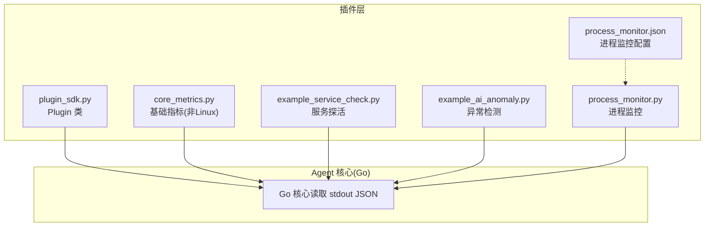
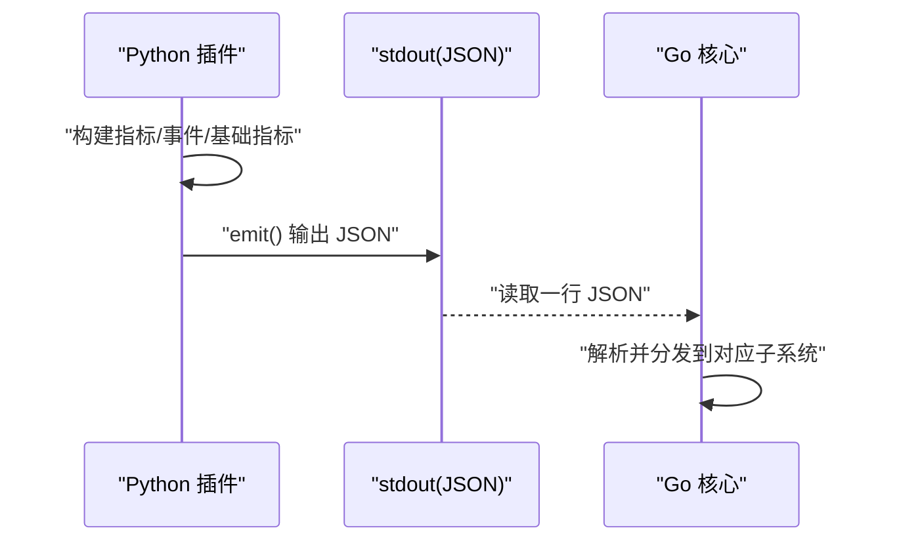
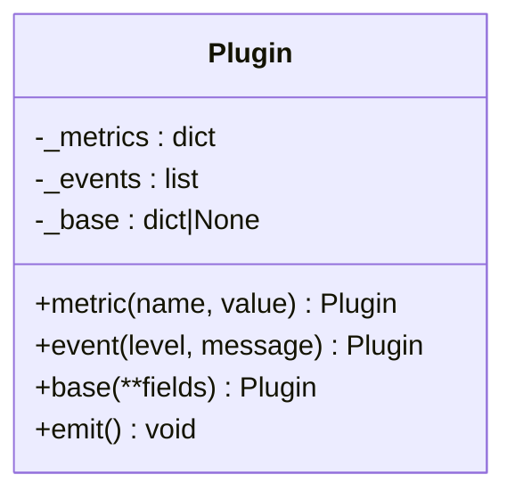
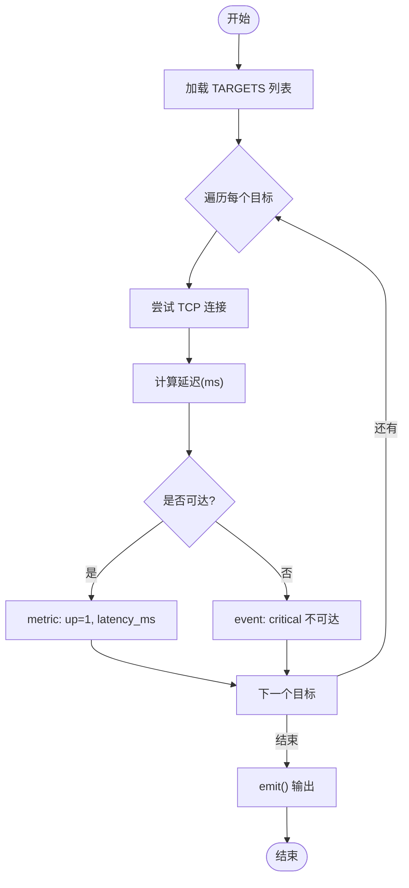
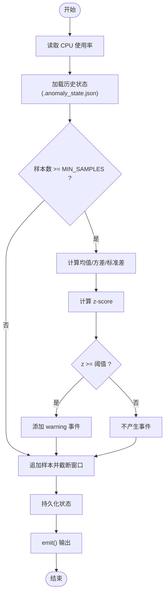
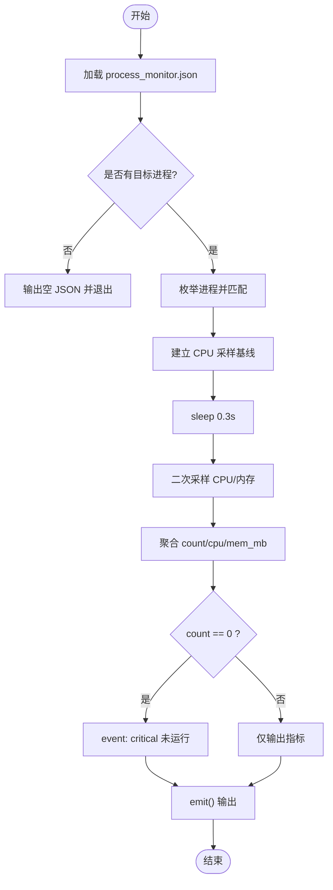
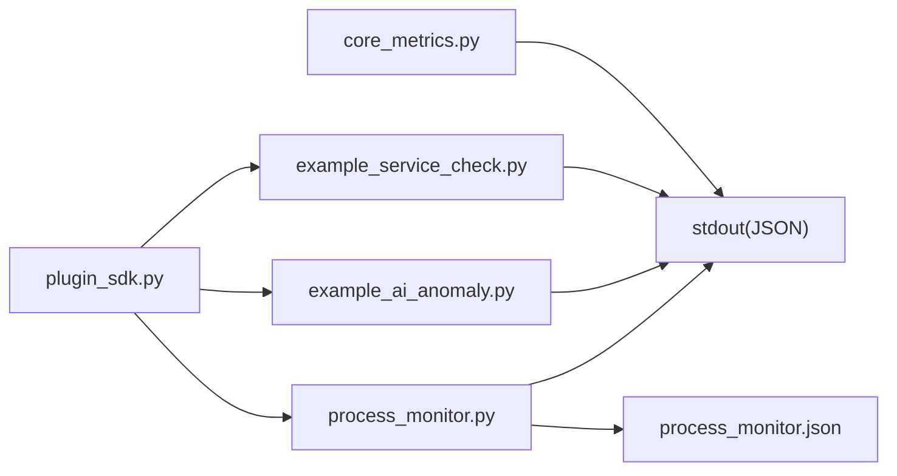

# Python SDK 使用指南

<cite>
**本文引用的文件**   
- [plugins/plugin_sdk.py](file://plugins/plugin_sdk.py)
- [plugins/core_metrics.py](file://plugins/core_metrics.py)
- [plugins/example_service_check.py](file://plugins/example_service_check.py)
- [plugins/example_ai_anomaly.py](file://plugins/example_ai_anomaly.py)
- [plugins/process_monitor.py](file://plugins/process_monitor.py)
- [plugins/process_monitor.json](file://plugins/process_monitor.json)
</cite>

## 目录
1. [简介](#简介)
2. [项目结构](#项目结构)
3. [核心组件](#核心组件)
4. [架构总览](#架构总览)
5. [详细组件分析](#详细组件分析)
6. [依赖关系分析](#依赖关系分析)
7. [性能考虑](#性能考虑)
8. [故障排查指南](#故障排查指南)
9. [结论](#结论)
10. [附录：输出格式规范与最佳实践](#附录输出格式规范与最佳实践)

## 简介
本指南面向需要基于本仓库的 Python SDK 编写插件的开发者。SDK 通过一个轻量类 Plugin，帮助插件以统一 JSON 格式向 Go Agent 核心输出三类数据：自定义指标 metrics、事件 events、基础指标 base。文档将深入解析 Plugin 的设计理念与核心方法 metric()、event()、base()、emit()，并给出完整的使用模式、命名空间约定、数据类型约束、错误处理建议以及性能优化要点。

## 项目结构
Python 插件相关代码集中在 plugins 目录下，包含 SDK 与若干示例插件：
- plugin_sdk.py：SDK 定义，提供 Plugin 类及 emit() 输出协议
- core_metrics.py：非 Linux 平台的基础指标兜底采集（仅当 psutil 可用时）
- example_service_check.py：服务健康检查示例（TCP 连通性与延迟）
- example_ai_anomaly.py：轻量异常检测示例（滚动基线 + z-score）
- process_monitor.py：进程监控示例（按名称匹配，统计 CPU/内存/数量）
- process_monitor.json：进程监控配置（目标进程名列表）



图表来源
- [plugins/plugin_sdk.py:1-58](file://plugins/plugin_sdk.py#L1-L58)
- [plugins/core_metrics.py:1-65](file://plugins/core_metrics.py#L1-L65)
- [plugins/example_service_check.py:1-42](file://plugins/example_service_check.py#L1-L42)
- [plugins/example_ai_anomaly.py:1-70](file://plugins/example_ai_anomaly.py#L1-L70)
- [plugins/process_monitor.py:1-86](file://plugins/process_monitor.py#L1-L86)
- [plugins/process_monitor.json:1-6](file://plugins/process_monitor.json#L1-L6)

章节来源
- [plugins/plugin_sdk.py:1-58](file://plugins/plugin_sdk.py#L1-L58)
- [plugins/core_metrics.py:1-65](file://plugins/core_metrics.py#L1-L65)
- [plugins/example_service_check.py:1-42](file://plugins/example_service_check.py#L1-L42)
- [plugins/example_ai_anomaly.py:1-70](file://plugins/example_ai_anomaly.py#L1-L70)
- [plugins/process_monitor.py:1-86](file://plugins/process_monitor.py#L1-L86)
- [plugins/process_monitor.json:1-6](file://plugins/process_monitor.json#L1-L6)

## 核心组件
Plugin 类是 SDK 的核心抽象，负责在插件生命周期内累积指标、事件和可选的基础指标，并在结束时一次性输出为 JSON。

- 设计理念
  - 极简 API：metric()/event()/base() 链式调用，最后 emit() 输出
  - 零外部依赖：仅使用标准库 json 与 sys
  - 健壮性：崩溃或超时不影响 Go 核心，只记录并跳过该插件
  - 跨平台兼容：base 字段用于非 Linux 平台的兜底采集

- 关键方法与行为
  - metric(name, value)：记录数值型指标；name 会被转为字符串，value 会转为浮点数
  - event(level, message)：产生一条事件；level 为 info|warning|critical；message 为字符串
  - base(**fields)：设置基础指标字典（仅非 Linux 平台兜底时使用）
  - emit()：将当前累积结果序列化为 JSON 写入 stdout；若某字段为空则省略该字段

- 输出协议
  - 顶层对象可包含三个键：metrics、events、base
  - metrics：键值对，键为字符串，值为数值（浮点）
  - events：数组，元素为对象，至少包含 level 与 message
  - base：键值对，键为字符串，值为数值（由具体实现决定）

章节来源
- [plugins/plugin_sdk.py:27-58](file://plugins/plugin_sdk.py#L27-L58)

## 架构总览
插件作为独立脚本运行，通过 stdout 向 Go 核心输出结构化 JSON。Go 核心读取后分别路由到指标存储、事件总线与基础指标聚合模块。



图表来源
- [plugins/plugin_sdk.py:48-58](file://plugins/plugin_sdk.py#L48-L58)

## 详细组件分析

### Plugin 类设计
- 内部状态
  - _metrics：dict，保存自定义指标
  - _events：list，保存事件列表
  - _base：dict 或 None，保存基础指标
- 方法语义
  - metric(name, value)：追加指标，返回 self 支持链式调用
  - event(level, message)：追加事件，返回 self 支持链式调用
  - base(**fields)：覆盖基础指标集合，返回 self 支持链式调用
  - emit()：构造输出对象，仅包含非空字段，序列化到 stdout



图表来源
- [plugins/plugin_sdk.py:27-58](file://plugins/plugin_sdk.py#L27-L58)

章节来源
- [plugins/plugin_sdk.py:27-58](file://plugins/plugin_sdk.py#L27-L58)

### 示例插件：服务健康检查
- 功能概述
  - 遍历 TARGETS 列表，尝试 TCP 连接
  - 产出 svc.<name>.up（0/1）与 svc.<name>.latency_ms（毫秒）
  - 不可达时产生 critical 事件
- 关键点
  - 使用 socket.create_connection 进行连通性探测
  - 使用 time.time() 计算耗时
  - 通过 Plugin.metric() 与 Plugin.event() 组合输出



图表来源
- [plugins/example_service_check.py:1-42](file://plugins/example_service_check.py#L1-L42)
- [plugins/plugin_sdk.py:27-58](file://plugins/plugin_sdk.py#L27-L58)

章节来源
- [plugins/example_service_check.py:1-42](file://plugins/example_service_check.py#L1-L42)

### 示例插件：轻量异常检测
- 功能概述
  - 维护滚动窗口历史（默认 30 个样本），计算均值与方差
  - 使用 z-score 判定异常，超过阈值产生 warning 事件
  - 输出 cpu.anomaly_zscore 指标
  - 状态持久化到 .anomaly_state.json，跨次运行累积基线
- 关键点
  - 优先使用 psutil.cpu_percent，回退到 /proc/loadavg
  - 最小样本数 MIN_SAMPLES 达到后才开始判定
  - 异常分数与事件同时输出，便于后续告警与可视化



图表来源
- [plugins/example_ai_anomaly.py:1-70](file://plugins/example_ai_anomaly.py#L1-L70)

章节来源
- [plugins/example_ai_anomaly.py:1-70](file://plugins/example_ai_anomaly.py#L1-L70)

### 示例插件：进程监控
- 功能概述
  - 从 process_monitor.json 读取目标进程名列表（子串匹配、不区分大小写）
  - 统计匹配进程数量、CPU 占用之和、常驻内存之和
  - 进程数为 0 时产生 critical 事件
- 关键点
  - 使用 psutil.process_iter 枚举进程
  - 两次采样间隔 0.3s 计算 CPU 百分比
  - 通过 Plugin.metric() 与 Plugin.event() 组合输出



图表来源
- [plugins/process_monitor.py:1-86](file://plugins/process_monitor.py#L1-L86)
- [plugins/process_monitor.json:1-6](file://plugins/process_monitor.json#L1-L6)

章节来源
- [plugins/process_monitor.py:1-86](file://plugins/process_monitor.py#L1-L86)
- [plugins/process_monitor.json:1-6](file://plugins/process_monitor.json#L1-L6)

### 基础指标兜底：core_metrics
- 适用场景
  - 在非 Linux 平台（Windows/macOS）上，为 Go 核心提供基础指标兜底
  - 当 psutil 不可用时，直接输出空 JSON 并退出，交由其他来源补齐
- 采集内容
  - CPU 使用率、核数
  - 内存总量/已用/百分比
  - 磁盘总量/已用/百分比
  - 网络收发速率（两次采样差值）
  - 系统负载、进程数、启动时间等

```mermaid
flowchart TD
Start(["开始"]) --> ImportPsutil{"psutil 可用?"}
ImportPsutil --> |否| EmptyOut["输出 {} 并退出"]
ImportPsutil --> |是| Collect["采集 CPU/内存/磁盘/网络/负载等"]
Collect --> BuildBase["组装 base 字典"]
BuildBase --> EmitBase["输出 {\"base\": ...}"]
EmitBase --> End(["结束"])
```

图表来源
- [plugins/core_metrics.py:1-65](file://plugins/core_metrics.py#L1-L65)

章节来源
- [plugins/core_metrics.py:1-65](file://plugins/core_metrics.py#L1-L65)

## 依赖关系分析
- 插件与 SDK
  - 所有示例插件均依赖 plugin_sdk.Plugin 来组织输出
- 第三方依赖
  - psutil：用于系统级指标采集（CPU/内存/磁盘/网络/进程）
  - socket/time：用于服务探活与延迟计算
- 配置文件
  - process_monitor.json：进程监控的目标列表



图表来源
- [plugins/plugin_sdk.py:1-58](file://plugins/plugin_sdk.py#L1-L58)
- [plugins/example_service_check.py:1-42](file://plugins/example_service_check.py#L1-L42)
- [plugins/example_ai_anomaly.py:1-70](file://plugins/example_ai_anomaly.py#L1-L70)
- [plugins/process_monitor.py:1-86](file://plugins/process_monitor.py#L1-L86)
- [plugins/process_monitor.json:1-6](file://plugins/process_monitor.json#L1-L6)
- [plugins/core_metrics.py:1-65](file://plugins/core_metrics.py#L1-L65)

章节来源
- [plugins/plugin_sdk.py:1-58](file://plugins/plugin_sdk.py#L1-L58)
- [plugins/example_service_check.py:1-42](file://plugins/example_service_check.py#L1-L42)
- [plugins/example_ai_anomaly.py:1-70](file://plugins/example_ai_anomaly.py#L1-L70)
- [plugins/process_monitor.py:1-86](file://plugins/process_monitor.py#L1-L86)
- [plugins/process_monitor.json:1-6](file://plugins/process_monitor.json#L1-L6)
- [plugins/core_metrics.py:1-65](file://plugins/core_metrics.py#L1-L65)

## 性能考虑
- 控制 I/O 与阻塞
  - 避免长时间阻塞；示例中网络探测使用短超时，CPU 采样采用短时间间隔
- 减少不必要的数据
  - 仅在必要时输出 events；空字段将被省略，避免冗余
- 合理采样频率
  - 网络速率与 CPU 百分比采用短时差值计算，平衡精度与开销
- 资源访问保护
  - 对可能失败的系统调用（如进程信息读取）增加 try/except，确保插件健壮性
- 状态持久化
  - 异常检测示例将滚动窗口状态落盘，避免每次从零开始，提升稳定性

[本节为通用指导，无需特定文件引用]

## 故障排查指南
- 插件无输出
  - 检查是否成功 import 依赖（如 psutil），若无依赖则按示例输出空 JSON 并退出
  - 确认 emit() 是否被调用，且 stdout 未被重定向或缓冲
- 指标缺失或类型错误
  - 确保 metric 的 name 为字符串、value 为数值；SDK 会自动转换，但应避免传入复杂类型
- 事件级别不正确
  - event 的 level 应为 info|warning|critical；其他值可能导致下游无法识别
- 进程监控未触发
  - 检查 process_monitor.json 中的 processes 列表是否为空或未正确填写
- 异常检测未生效
  - 确认历史样本数达到 MIN_SAMPLES；否则不会计算 z-score 也不会产生事件

章节来源
- [plugins/core_metrics.py:18-22](file://plugins/core_metrics.py#L18-L22)
- [plugins/process_monitor.py:20-24](file://plugins/process_monitor.py#L20-L24)
- [plugins/process_monitor.py:30-40](file://plugins/process_monitor.py#L30-L40)
- [plugins/example_ai_anomaly.py:43-53](file://plugins/example_ai_anomaly.py#L43-L53)

## 结论
通过 Plugin SDK，开发者可以以极低的成本编写跨平台、高可用的采集插件。SDK 提供了统一的输出协议与简洁的 API，结合示例插件可以快速上手。建议在业务侧遵循命名空间约定、严格控制事件级别与输出量，并结合性能优化策略，以获得稳定高效的监控体验。

[本节为总结性内容，无需特定文件引用]

## 附录：输出格式规范与最佳实践

### 输出字段规范
- metrics
  - 类型：对象（键值对）
  - 键：字符串，建议使用“命名空间.指标名”形式，避免冲突
  - 值：数值（整数或浮点）
- events
  - 类型：数组
  - 元素：对象，必须包含 level 与 message
  - level 取值：info | warning | critical
  - source：可选，Go 核心会自动补全为插件名
- base
  - 类型：对象（键值对）
  - 用途：基础指标，仅非 Linux 平台兜底时使用
  - 键值：字符串到数值的映射

章节来源
- [plugins/plugin_sdk.py:1-22](file://plugins/plugin_sdk.py#L1-L22)
- [plugins/plugin_sdk.py:48-58](file://plugins/plugin_sdk.py#L48-L58)

### 命名空间约定
- 指标键建议自带命名空间，例如：
  - mysql.connections
  - nginx.requests
  - svc.<name>.up
  - proc.<name>.cpu
- 目的：避免不同插件间指标名冲突，便于分组与检索

章节来源
- [plugins/plugin_sdk.py:18-21](file://plugins/plugin_sdk.py#L18-L21)
- [plugins/example_service_check.py:35-39](file://plugins/example_service_check.py#L35-L39)
- [plugins/process_monitor.py:67-83](file://plugins/process_monitor.py#L67-L83)

### 数据类型要求
- metric 的 name 会被转换为字符串
- metric 的 value 会被转换为浮点数
- event 的 level 与 message 会被转换为字符串
- base 的字段值保持为数值（由具体实现决定）

章节来源
- [plugins/plugin_sdk.py:33-46](file://plugins/plugin_sdk.py#L33-L46)

### 错误处理最佳实践
- 捕获外部依赖导入失败（如 psutil）
- 对系统调用与 I/O 操作增加 try/except，保证插件健壮性
- 在缺少必要配置或数据时，输出空 JSON 并安全退出
- 避免抛出未捕获异常导致插件崩溃

章节来源
- [plugins/core_metrics.py:18-22](file://plugins/core_metrics.py#L18-L22)
- [plugins/process_monitor.py:20-24](file://plugins/process_monitor.py#L20-L24)
- [plugins/process_monitor.py:30-40](file://plugins/process_monitor.py#L30-L40)
- [plugins/example_ai_anomaly.py:20-26](file://plugins/example_ai_anomaly.py#L20-L26)

### 常见使用模式
- 自定义指标采集
  - 使用 Plugin.metric() 记录业务指标，如服务连通性、请求延迟、队列长度等
- 事件通知
  - 使用 Plugin.event() 上报异常或告警，级别根据严重性选择 info/warning/critical
- 基础指标兜底
  - 在非 Linux 平台使用 base() 或直接输出 base 字段，补齐系统级指标

章节来源
- [plugins/example_service_check.py:24-41](file://plugins/example_service_check.py#L24-L41)
- [plugins/example_ai_anomaly.py:41-69](file://plugins/example_ai_anomaly.py#L41-L69)
- [plugins/core_metrics.py:48-64](file://plugins/core_metrics.py#L48-L64)