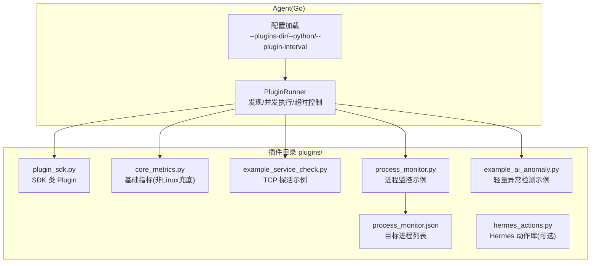
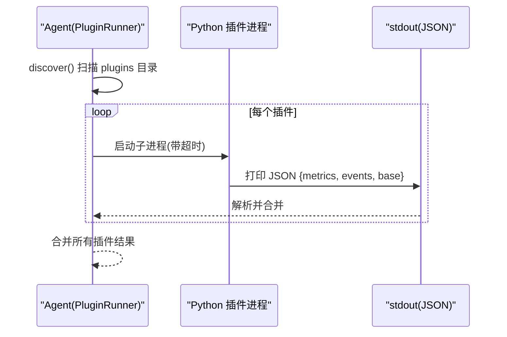
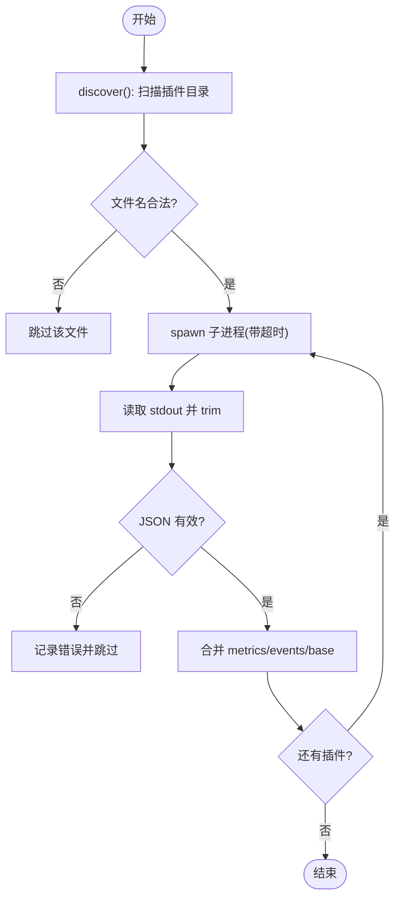
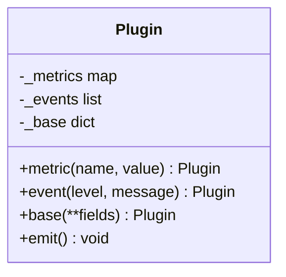
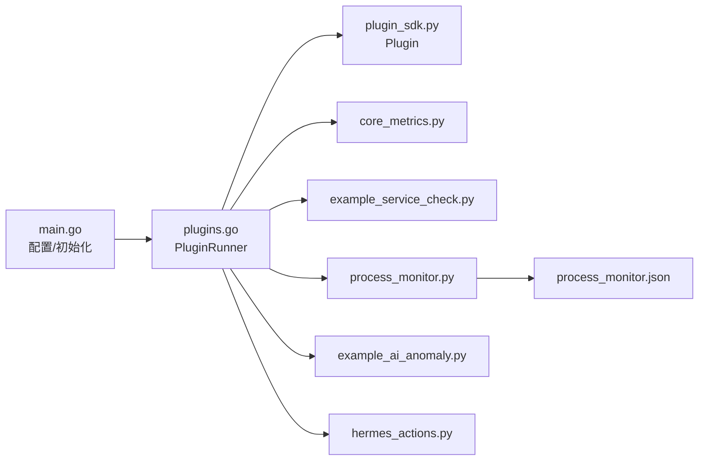

# 插件开发

<cite>
**本文引用的文件**   
- [plugins/plugin_sdk.py](file://plugins/plugin_sdk.py)
- [cmd/agent/plugins.go](file://cmd/agent/plugins.go)
- [cmd/agent/main.go](file://cmd/agent/main.go)
- [plugins/core_metrics.py](file://plugins/core_metrics.py)
- [plugins/example_service_check.py](file://plugins/example_service_check.py)
- [plugins/process_monitor.py](file://plugins/process_monitor.py)
- [plugins/process_monitor.json](file://plugins/process_monitor.json)
- [plugins/example_ai_anomaly.py](file://plugins/example_ai_anomaly.py)
- [plugins/hermes_actions.py](file://plugins/hermes_actions.py)
- [README.md](file://README.md)
</cite>

## 目录
1. [简介](#简介)
2. [项目结构](#项目结构)
3. [核心组件](#核心组件)
4. [架构总览](#架构总览)
5. [详细组件分析](#详细组件分析)
6. [依赖关系分析](#依赖关系分析)
7. [性能考虑](#性能考虑)
8. [故障排查指南](#故障排查指南)
9. [结论](#结论)
10. [附录](#附录)

## 简介
本指南面向希望为 AIOps Monitor Agent 编写 Python 插件的开发者，系统阐述插件系统的架构设计、SDK 使用方法、开发规范与最佳实践。内容覆盖插件生命周期、执行环境、数据模型、错误处理机制，并提供自定义指标采集、服务健康检查、业务监控等完整示例；同时给出打包分发、版本管理、调试测试方法、安全与性能建议，以及插件共享与“市场”化建议。

## 项目结构
Agent 侧通过 Go 进程发现并调度 plugins 目录下的可执行脚本（默认 .py），以子进程方式运行，读取其 stdout 的 JSON 输出进行合并上报。Python SDK 提供极简 API，帮助快速产出 metrics/events/base 三类数据。

图示来源
- [cmd/agent/plugins.go:1-178](file://cmd/agent/plugins.go#L1-L178)
- [cmd/agent/main.go:74-140](file://cmd/agent/main.go#L74-L140)
- [plugins/plugin_sdk.py:1-58](file://plugins/plugin_sdk.py#L1-L58)
- [plugins/core_metrics.py:1-65](file://plugins/core_metrics.py#L1-L65)
- [plugins/example_service_check.py:1-42](file://plugins/example_service_check.py#L1-L42)
- [plugins/process_monitor.py:1-86](file://plugins/process_monitor.py#L1-L86)
- [plugins/process_monitor.json:1-6](file://plugins/process_monitor.json#L1-L6)
- [plugins/example_ai_anomaly.py:1-70](file://plugins/example_ai_anomaly.py#L1-L70)
- [plugins/hermes_actions.py:1-171](file://plugins/hermes_actions.py#L1-L171)

章节来源
- [cmd/agent/main.go:74-140](file://cmd/agent/main.go#L74-L140)
- [cmd/agent/plugins.go:1-178](file://cmd/agent/plugins.go#L1-L178)
- [README.md:702-718](file://README.md#L702-L718)

## 核心组件
- 插件协议与执行器（Go）
  - 插件标准输出为 JSON，包含可选字段：base（基础指标）、metrics（自定义指标）、events（事件）。
  - 插件发现策略：仅允许已知安全扩展（如 .py/.sh），忽略隐藏文件与 SDK/requirements.txt。
  - 并发执行：限制最大并发子进程数，单个插件独立 goroutine + 超时控制，崩溃/超时不影响核心。
- Python SDK（Plugin 类）
  - 提供 metric()/event()/base()/emit() 四个方法，内部聚合后以 JSON 写入 stdout。
- 示例插件
  - core_metrics.py：在非 Linux 平台提供 CPU/内存/磁盘/网络/负载等基础指标。
  - example_service_check.py：TCP 端口连通性与时延探测，不可达产生 critical 事件。
  - process_monitor.py：按名称匹配进程，统计数量/CPU/内存，缺失则产生 critical 事件。
  - example_ai_anomaly.py：基于滚动窗口 z-score 的轻量异常检测，持久化状态到本地文件。
  - hermes_actions.py：Hermes 可调用的运维动作库（重启服务、清理缓存、K8s 扩缩容等）。

章节来源
- [cmd/agent/plugins.go:17-178](file://cmd/agent/plugins.go#L17-L178)
- [plugins/plugin_sdk.py:1-58](file://plugins/plugin_sdk.py#L1-L58)
- [plugins/core_metrics.py:1-65](file://plugins/core_metrics.py#L1-L65)
- [plugins/example_service_check.py:1-42](file://plugins/example_service_check.py#L1-L42)
- [plugins/process_monitor.py:1-86](file://plugins/process_monitor.py#L1-L86)
- [plugins/example_ai_anomaly.py:1-70](file://plugins/example_ai_anomaly.py#L1-L70)
- [plugins/hermes_actions.py:1-171](file://plugins/hermes_actions.py#L1-L171)

## 架构总览
插件作为隔离的子进程运行，通过 stdout 与 Agent 通信。Agent 负责发现、调度、超时保护、结果合并与上报。

图示来源
- [cmd/agent/plugins.go:62-178](file://cmd/agent/plugins.go#L62-L178)

## 详细组件分析

### 插件协议与执行器（Go）
- 数据结构
  - pluginOutput：定义 base/metrics/events 三个可选字段，对应 shared.Metrics 与 Event。
  - pluginResult：一次运行中所有插件结果的聚合体。
- 插件发现
  - 跳过隐藏文件、下划线前缀文件、SDK 与 requirements.txt。
  - 白名单扩展名：仅 .py/.sh，拒绝无扩展或危险扩展。
- 并发与资源控制
  - 使用信号量限制最大并发插件子进程数，避免大量 Python 进程导致资源抖动。
  - 每个插件独立 goroutine，失败只记录日志并跳过。
- 执行与超时
  - 对 .py 使用配置的 python 解释器执行；其他可执行直接 exec。
  - 使用 context.WithTimeout 控制超时，防止挂起。
- 输出合并
  - 将各插件 metrics 合并；events 若未设置 source，自动补全为插件名。

图示来源
- [cmd/agent/plugins.go:62-178](file://cmd/agent/plugins.go#L62-L178)

章节来源
- [cmd/agent/plugins.go:17-178](file://cmd/agent/plugins.go#L17-L178)

### Python SDK（Plugin 类）
- 职责
  - 收集自定义指标（数值型 gauge）、事件（info/warning/critical）、基础指标（base，仅非 Linux 兜底）。
  - emit() 将聚合结果序列化为 JSON 输出至 stdout。
- 约定
  - 指标 key 建议自带命名空间（如 mysql.、nginx.）避免冲突。
  - 插件应快速返回，不长期阻塞；崩溃/超时不会影响 Agent 核心。

图示来源
- [plugins/plugin_sdk.py:27-58](file://plugins/plugin_sdk.py#L27-L58)

章节来源
- [plugins/plugin_sdk.py:1-58](file://plugins/plugin_sdk.py#L1-L58)

### 示例插件：核心指标（非 Linux 兜底）
- 功能
  - 在 Windows/macOS 上通过 psutil 采集 CPU/内存/磁盘/网络速率/负载/进程数/运行时长等基础指标。
  - 若无 psutil，静默退出，交由原生采集器或其他来源。
- 注意
  - Linux 上由 Go 原生采集，本插件产出会被忽略。

章节来源
- [plugins/core_metrics.py:1-65](file://plugins/core_metrics.py#L1-L65)

### 示例插件：服务健康检查（TCP 拨测）
- 功能
  - 遍历 TARGETS 列表，尝试 TCP 连接，产出 up/latency_ms 指标；不可达产生 critical 事件。
- 适用场景
  - 外部依赖服务（数据库、缓存、第三方 API）的可用性与时延监控。

章节来源
- [plugins/example_service_check.py:1-42](file://plugins/example_service_check.py#L1-L42)

### 示例插件：进程监控（跨平台）
- 功能
  - 从同目录 process_monitor.json 读取目标进程名（子串匹配、不区分大小写）。
  - 产出 proc.<name>.count/cpu/mem_mb；进程数为 0 时产生 critical 事件。
- 配置
  - process_monitor.json 中的 processes 数组为空时，插件不产出任何数据。

章节来源
- [plugins/process_monitor.py:1-86](file://plugins/process_monitor.py#L1-L86)
- [plugins/process_monitor.json:1-6](file://plugins/process_monitor.json#L1-L6)

### 示例插件：轻量异常检测（AIOPS 层）
- 功能
  - 维护滚动窗口样本，计算均值/方差/z-score，超过阈值产出 warning 事件与 cpu.anomaly_zscore 指标。
  - 状态持久化到 .anomaly_state.json，跨次运行累积基线。
- 扩展点
  - 可替换为更复杂的模型或服务调用（Prophet/statsmodels/sklearn/远程模型服务）。

章节来源
- [plugins/example_ai_anomaly.py:1-70](file://plugins/example_ai_anomaly.py#L1-L70)

### Hermes 动作插件（可选）
- 功能
  - 暴露一组可被 Hermes 调用的运维动作（重启服务、清理缓存、K8s 扩缩容、查看服务状态等）。
  - 通过命令行参数选择动作名与参数，返回字符串结果供引擎读取。
- 安全
  - 内置路径白名单与工具可用性检查，避免越权与误用。

章节来源
- [plugins/hermes_actions.py:1-171](file://plugins/hermes_actions.py#L1-L171)

## 依赖关系分析
- Agent 侧
  - main.go 负责加载配置、初始化 PluginRunner、注册信号处理与运行主循环。
  - plugins.go 实现插件发现、并发执行、超时控制与结果合并。
- Python 侧
  - 示例插件依赖 psutil（可选）与 socket 等标准库；SDK 仅依赖 json/sys。
  - 配置文件 process_monitor.json 为纯数据，便于动态调整监控目标。

图示来源
- [cmd/agent/main.go:74-140](file://cmd/agent/main.go#L74-L140)
- [cmd/agent/plugins.go:1-178](file://cmd/agent/plugins.go#L1-L178)
- [plugins/plugin_sdk.py:1-58](file://plugins/plugin_sdk.py#L1-L58)
- [plugins/core_metrics.py:1-65](file://plugins/core_metrics.py#L1-L65)
- [plugins/example_service_check.py:1-42](file://plugins/example_service_check.py#L1-L42)
- [plugins/process_monitor.py:1-86](file://plugins/process_monitor.py#L1-L86)
- [plugins/process_monitor.json:1-6](file://plugins/process_monitor.json#L1-L6)
- [plugins/example_ai_anomaly.py:1-70](file://plugins/example_ai_anomaly.py#L1-L70)
- [plugins/hermes_actions.py:1-171](file://plugins/hermes_actions.py#L1-L171)

章节来源
- [cmd/agent/main.go:74-140](file://cmd/agent/main.go#L74-L140)
- [cmd/agent/plugins.go:1-178](file://cmd/agent/plugins.go#L1-L178)

## 性能考虑
- 并发与限流
  - 插件子进程并发上限固定（默认 4），避免大规模进程创建导致的 CPU/内存尖刺。
- 超时保护
  - 每个插件执行带超时上下文，挂起不会阻塞其余插件与核心。
- 采样延迟叠加
  - 多个插件各自 sleep 采样可能导致整体耗时叠加；建议将采样间隔参数化或由 Agent 注入共享时钟以减少叠加。
- 指标键命名
  - 使用命名空间前缀避免冲突，减少服务端去重/聚合成本。
- 输出体积
  - 仅在必要时输出 metrics/events/base，空对象将被忽略，降低序列化与传输开销。

章节来源
- [cmd/agent/plugins.go:102-178](file://cmd/agent/plugins.go#L102-L178)
- [plugins/core_metrics.py:27-65](file://plugins/core_metrics.py#L27-L65)
- [plugins/example_ai_anomaly.py:28-70](file://plugins/example_ai_anomaly.py#L28-L70)

## 故障排查指南
- 插件未产出数据
  - 检查是否缺少依赖（如 psutil），插件会静默退出；确认 process_monitor.json 是否配置了 targets。
- 插件崩溃/超时
  - Agent 会记录错误并跳过该插件，不影响核心；检查插件逻辑与外部依赖可达性。
- 指标未生效
  - 确认指标键命名符合约定（带命名空间）；确认插件 interval 与 report interval 配置合理。
- 事件级别不正确
  - 确保 event level 为 info/warning/critical；source 未设置时会自动填充为插件名。
- 权限与安全
  - 确保 plugins 目录权限严格（仅属主可写），避免任意代码执行风险；非 .py 可执行需谨慎启用。

章节来源
- [cmd/agent/plugins.go:62-178](file://cmd/agent/plugins.go#L62-L178)
- [plugins/process_monitor.py:28-41](file://plugins/process_monitor.py#L28-L41)
- [plugins/core_metrics.py:18-22](file://plugins/core_metrics.py#L18-L22)

## 结论
AIOps Monitor 的插件体系以“Go 调度 + Python 灵活实现”的混合架构为核心，通过严格的协议与执行器保障稳定性与安全性。借助 SDK 与示例插件，开发者可以快速完成自定义指标采集、服务健康检查与业务监控等场景。配合合理的并发、超时与命名规范，可在生产环境中稳定运行并持续演进。

## 附录

### 插件生命周期与执行环境
- 生命周期
  - 启动：Agent 启动时缓存插件清单；首次 RunAll 立即执行，后续按 plugin_interval 周期执行。
  - 执行：每个插件以独立子进程运行，带超时；stdout 必须输出合法的 JSON。
  - 合并：Agent 合并所有插件的 metrics/events/base，并为 events 补充 source。
  - 停止：收到退出信号后优雅停止。
- 执行环境
  - Python 解释器路径可通过 --python 指定；Windows 默认 python，Linux/macOS 默认 python3。
  - 插件目录通过 --plugins-dir 指定，支持绝对路径。
  - 插件可访问本机文件系统与网络，但应避免长时间阻塞与高资源占用。

章节来源
- [cmd/agent/main.go:94-108](file://cmd/agent/main.go#L94-L108)
- [cmd/agent/plugins.go:40-55](file://cmd/agent/plugins.go#L40-L55)
- [README.md:385-434](file://README.md#L385-L434)

### 数据模型与协议
- 协议字段
  - metrics：自定义指标（gauge），key 建议带命名空间。
  - events：离散事件，level 为 info/warning/critical，message 描述问题。
  - base：基础指标（仅非 Linux 兜底时使用）。
- 字段约束
  - 所有字段可选；空对象将被忽略；events.source 未设置时自动填充为插件名。

章节来源
- [cmd/agent/plugins.go:17-34](file://cmd/agent/plugins.go#L17-L34)
- [plugins/plugin_sdk.py:27-58](file://plugins/plugin_sdk.py#L27-L58)

### 开发规范与最佳实践
- 命名规范
  - 指标键使用命名空间前缀（如 svc.xxx、proc.xxx、cpu.anomaly_*）。
- 健壮性
  - 捕获异常并降级输出；依赖缺失时静默退出；避免阻塞与死锁。
- 可观测性
  - 产出关键事件（critical）用于告警；尽量附带上下文信息（主机、端口、名称等）。
- 可配置性
  - 将易变参数外置为配置文件（如 process_monitor.json），便于热更新。
- 安全
  - 避免执行用户输入命令；对外部路径做白名单校验；最小权限原则。

章节来源
- [plugins/example_service_check.py:15-42](file://plugins/example_service_check.py#L15-L42)
- [plugins/process_monitor.py:28-86](file://plugins/process_monitor.py#L28-L86)
- [plugins/hermes_actions.py:44-78](file://plugins/hermes_actions.py#L44-L78)

### 打包、分发与版本管理
- 打包
  - 将插件脚本与配置文件放入 plugins 目录；如需第三方依赖，提供 requirements.txt（不会被执行，仅供说明）。
- 分发
  - 通过安装脚本或容器镜像将 plugins 目录随 Agent 一起部署；确保目录权限受控。
- 版本管理
  - 插件脚本建议采用语义化版本注释；重大变更需配合 Agent 版本升级与兼容性说明。

章节来源
- [README.md:702-718](file://README.md#L702-L718)

### 调试与测试方法
- 本地调试
  - 直接运行插件脚本，观察 stdout 是否为合法 JSON；逐步添加 metric/event 验证。
- 集成测试
  - 在 Agent 端配置较短 plugin_interval，观察合并结果与事件；模拟外部依赖不可用以触发 critical 事件。
- 回归用例
  - 针对常见边界：空配置、依赖缺失、超时、非法 JSON 等，确保插件行为稳健。

章节来源
- [plugins/example_ai_anomaly.py:28-70](file://plugins/example_ai_anomaly.py#L28-L70)
- [plugins/example_service_check.py:24-42](file://plugins/example_service_check.py#L24-L42)

### 安全考虑
- 执行白名单
  - 仅允许 .py/.sh 等已知安全扩展；拒绝无扩展或危险扩展。
- 权限控制
  - plugins 目录仅属主可写；避免低权限用户写入可执行文件。
- 输入校验
  - 插件对路径/命令参数进行白名单与存在性检查；避免命令注入。
- 输出校验
  - Agent 侧严格 JSON 解析与字段校验，防止畸形输出影响核心。

章节来源
- [cmd/agent/plugins.go:74-98](file://cmd/agent/plugins.go#L74-L98)
- [plugins/hermes_actions.py:44-78](file://plugins/hermes_actions.py#L44-L78)

### 插件市场或共享机制建议
- 插件清单
  - 引入 manifest 清单（列出允许运行的插件名与版本），结合签名校验提升可信度。
- 仓库与索引
  - 建立内部插件仓库，提供插件元数据（名称、版本、依赖、兼容 Agent 版本、许可证）。
- 发布流程
  - CI 构建与静态检查通过后打 tag 发布；提供一键安装命令或包管理器。
- 治理与审计
  - 记录插件安装/卸载/执行历史；对高危动作（如系统命令）增加审批与审计。

[本节为概念性建议，无需源码引用]