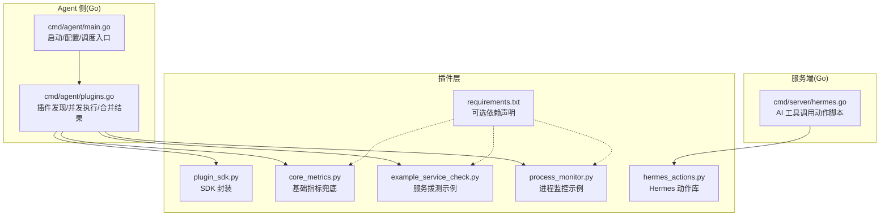
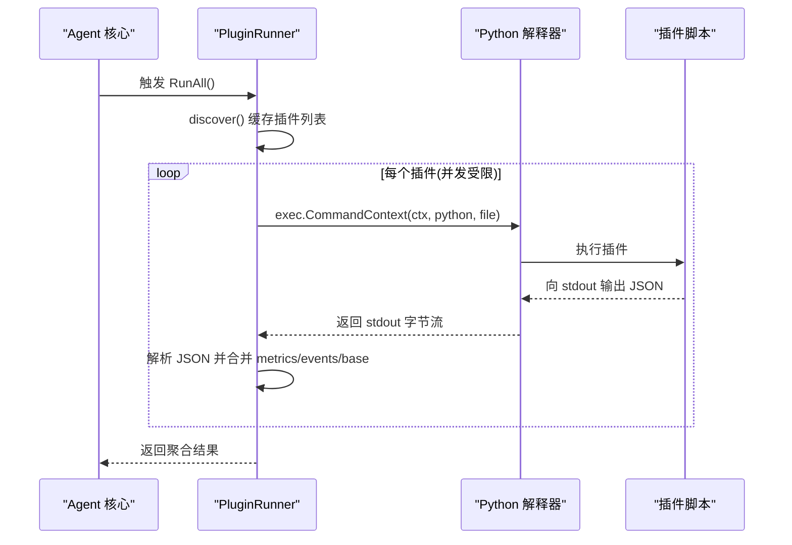
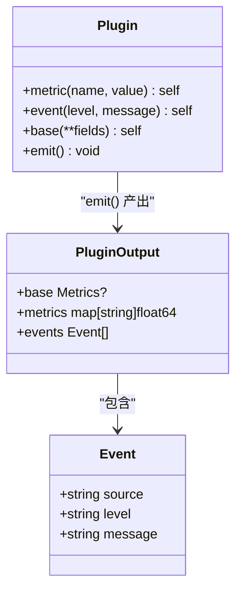
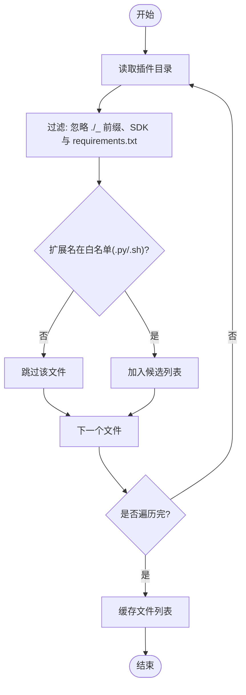
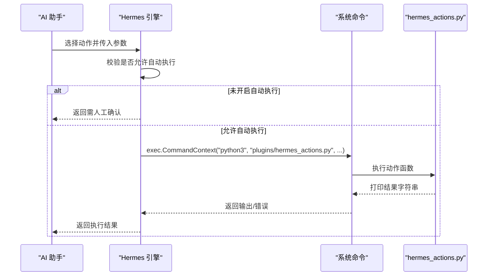

# 插件开发规范

<cite>
**本文引用的文件**   
- [plugins/plugin_sdk.py](file://plugins/plugin_sdk.py)
- [cmd/agent/plugins.go](file://cmd/agent/plugins.go)
- [cmd/agent/main.go](file://cmd/agent/main.go)
- [plugins/core_metrics.py](file://plugins/core_metrics.py)
- [plugins/example_service_check.py](file://plugins/example_service_check.py)
- [plugins/process_monitor.py](file://plugins/process_monitor.py)
- [plugins/hermes_actions.py](file://plugins/hermes_actions.py)
- [plugins/requirements.txt](file://plugins/requirements.txt)
- [cmd/server/hermes.go](file://cmd/server/hermes.go)
- [README.md](file://README.md)
</cite>

## 目录
1. [引言](#引言)
2. [项目结构](#项目结构)
3. [核心组件](#核心组件)
4. [架构总览](#架构总览)
5. [详细组件分析](#详细组件分析)
6. [依赖分析](#依赖分析)
7. [性能考虑](#性能考虑)
8. [故障排查指南](#故障排查指南)
9. [结论](#结论)
10. [附录](#附录)

## 引言
本规范面向在 AIOps Monitor Agent 侧编写与运行插件的开发者，覆盖插件文件结构、命名约定、目录组织、生命周期管理（发现、加载、执行环境、资源隔离）、接口契约（输入输出、错误码）、安全限制、版本兼容与依赖管理，以及代码质量与安全扫描等工具链配置。目标是让插件“可插拔、可观测、可治理”，在不影响 Agent 核心的前提下提供自定义采集、异常检测与自动化动作能力。

## 项目结构
插件相关代码与示例位于仓库根目录 plugins 子目录；Agent 侧插件调度由 Go 实现；服务端通过 Hermes 工具调用 Python 动作脚本。

图示来源
- [cmd/agent/main.go:74-140](file://cmd/agent/main.go#L74-L140)
- [cmd/agent/plugins.go:35-100](file://cmd/agent/plugins.go#L35-L100)
- [plugins/plugin_sdk.py:1-58](file://plugins/plugin_sdk.py#L1-L58)
- [plugins/core_metrics.py:1-65](file://plugins/core_metrics.py#L1-L65)
- [plugins/example_service_check.py:1-42](file://plugins/example_service_check.py#L1-L42)
- [plugins/process_monitor.py:1-86](file://plugins/process_monitor.py#L1-L86)
- [plugins/hermes_actions.py:1-171](file://plugins/hermes_actions.py#L1-L171)
- [plugins/requirements.txt:1-4](file://plugins/requirements.txt#L1-L4)
- [cmd/server/hermes.go:540-564](file://cmd/server/hermes.go#L540-L564)

章节来源
- [README.md:702-718](file://README.md#L702-L718)
- [cmd/agent/main.go:74-140](file://cmd/agent/main.go#L74-L140)
- [cmd/agent/plugins.go:35-100](file://cmd/agent/plugins.go#L35-L100)

## 核心组件
- 插件 SDK：提供 metric/event/base/emit 等便捷方法，统一将结果以 JSON 写入 stdout，供 Go 核心读取。
- 插件运行器：负责插件发现、并发执行、超时控制、结果合并与事件源补全。
- 示例插件：演示基础指标兜底、服务健康检查、进程监控等典型场景。
- Hermes 动作库：面向 AI 运维助手的可调用动作集合，受审批策略保护。

章节来源
- [plugins/plugin_sdk.py:1-58](file://plugins/plugin_sdk.py#L1-L58)
- [cmd/agent/plugins.go:35-100](file://cmd/agent/plugins.go#L35-L100)
- [plugins/core_metrics.py:1-65](file://plugins/core_metrics.py#L1-L65)
- [plugins/example_service_check.py:1-42](file://plugins/example_service_check.py#L1-L42)
- [plugins/process_monitor.py:1-86](file://plugins/process_monitor.py#L1-L86)
- [plugins/hermes_actions.py:1-171](file://plugins/hermes_actions.py#L1-L171)

## 架构总览
插件作为独立子进程运行，Go Agent 通过管道与其交互，严格超时与并发上限保障核心稳定。

图示来源
- [cmd/agent/plugins.go:101-172](file://cmd/agent/plugins.go#L101-L172)
- [plugins/plugin_sdk.py:48-58](file://plugins/plugin_sdk.py#L48-L58)

## 详细组件分析

### 插件接口契约与数据模型
- 输出格式：插件必须向 stdout 输出一个 JSON 对象，字段均为可选：
  - base：基础系统指标（仅非 Linux 平台兜底使用）
  - metrics：自定义指标键值对（数值型 gauge）
  - events：离散事件数组，包含 level 与 message，source 可由核心自动填充
- 事件级别：info | warning | critical
- 命名建议：metrics 的 key 建议自带命名空间（如 mysql.、nginx.），避免冲突
- 行为约束：插件应快速返回，崩溃/超时不影响 Agent 核心，只记录并跳过

图示来源
- [plugins/plugin_sdk.py:27-58](file://plugins/plugin_sdk.py#L27-L58)
- [cmd/agent/plugins.go:17-34](file://cmd/agent/plugins.go#L17-L34)

章节来源
- [plugins/plugin_sdk.py:1-58](file://plugins/plugin_sdk.py#L1-L58)
- [cmd/agent/plugins.go:17-34](file://cmd/agent/plugins.go#L17-L34)

### 插件发现与加载流程
- 发现规则：
  - 仅扫描指定目录下的文件，忽略目录
  - 忽略以 . 或 _ 开头的文件
  - 忽略 plugin_sdk.py 与 requirements.txt
  - 白名单扩展名：仅允许 .py 与 .sh；拒绝无扩展名及其他扩展（含二进制）
- 加载与执行：
  - 首次发现后缓存，运行期间不变更
  - 并发执行，最大并发数固定为 4
  - 每个插件设置上下文超时，防止挂起拖垮核心
  - 非 .py 文件直接以自身路径执行（需具备可执行权限）

图示来源
- [cmd/agent/plugins.go:62-100](file://cmd/agent/plugins.go#L62-L100)

章节来源
- [cmd/agent/plugins.go:62-100](file://cmd/agent/plugins.go#L62-L100)

### 执行环境与资源隔离
- 进程隔离：每个插件作为独立子进程运行，崩溃/超时不会影响 Agent 核心
- 并发控制：全局信号量限制同时运行的插件进程数量，避免资源抖动
- 超时控制：基于 context.WithTimeout 的进程级超时，默认 15s（可通过配置调整）
- 输出通道：仅通过 stdout 通信，禁止共享内存或网络端口暴露
- 环境变量：插件可读取宿主环境变量，但不应依赖不可控外部状态

章节来源
- [cmd/agent/plugins.go:101-172](file://cmd/agent/plugins.go#L101-L172)
- [cmd/agent/main.go:140-141](file://cmd/agent/main.go#L140-L141)

### 插件生命周期管理
- 周期调度：Agent 根据 plugin_interval 周期性触发插件执行
- 延迟启动：首次 RunAll 立即执行，后续按间隔调度，避免频繁创建子进程
- 结果合并：将各插件输出的 metrics 合并，events 追加并补全 source，base 仅在必要时使用
- 失败处理：单个插件失败仅记录日志并跳过，不影响其他插件与核心

章节来源
- [cmd/agent/plugins.go:101-172](file://cmd/agent/plugins.go#L101-L172)
- [cmd/agent/main.go:140-141](file://cmd/agent/main.go#L140-L141)

### 插件示例与最佳实践
- 基础指标兜底（非 Linux）：core_metrics.py 通过 psutil 采集 CPU/内存/磁盘/网络/负载等，输出 base 字段
- 服务健康检查：example_service_check.py 探测 TCP 连通性与时延，不可达时产生 critical 事件
- 进程监控：process_monitor.py 从同目录 JSON 配置读取目标进程名，统计 count/cpu/mem_mb，缺失时产生 critical 事件
- 推荐实践：
  - 使用 SDK 简化输出构造
  - 指标命名带命名空间，避免冲突
  - 事件信息明确、可定位
  - 避免阻塞与长耗时操作，必要时拆分任务

章节来源
- [plugins/core_metrics.py:1-65](file://plugins/core_metrics.py#L1-L65)
- [plugins/example_service_check.py:1-42](file://plugins/example_service_check.py#L1-L42)
- [plugins/process_monitor.py:1-86](file://plugins/process_monitor.py#L1-L86)
- [plugins/plugin_sdk.py:1-58](file://plugins/plugin_sdk.py#L1-L58)

### Hermes 动作插件（服务端侧）
- 作用：为 AI 运维助手提供可调用动作（如重启服务、清理缓存、K8s 扩缩容、查看服务状态）
- 调用方式：服务端通过命令行调用 hermes_actions.py，传入 action_name、host_id、args_json
- 安全护栏：写操作需在显式开启自动执行时才真正执行，否则需人工确认
- 超时控制：动作执行加 30s 超时，避免请求 goroutine 永久阻塞

图示来源
- [cmd/server/hermes.go:540-564](file://cmd/server/hermes.go#L540-L564)
- [plugins/hermes_actions.py:1-171](file://plugins/hermes_actions.py#L1-L171)

章节来源
- [cmd/server/hermes.go:540-564](file://cmd/server/hermes.go#L540-L564)
- [plugins/hermes_actions.py:1-171](file://plugins/hermes_actions.py#L1-L171)

## 依赖分析
- 运行时依赖：
  - Python 解释器：通过配置项 python 指定（Windows 默认 python，Linux/macOS 默认 python3）
  - 可选依赖：psutil（用于 core_metrics.py、example_ai_anomaly.py、process_monitor.py 等）
- 依赖声明：requirements.txt 列出可选依赖及最低版本
- 安装与部署：
  - 建议在非 Linux 平台安装 psutil 以获得完整基础指标兜底
  - Linux 上基础指标由 Go 原生采集，可不装 psutil

章节来源
- [cmd/agent/main.go:44-62](file://cmd/agent/main.go#L44-L62)
- [plugins/requirements.txt:1-4](file://plugins/requirements.txt#L1-L4)
- [plugins/core_metrics.py:1-65](file://plugins/core_metrics.py#L1-L65)
- [plugins/process_monitor.py:1-86](file://plugins/process_monitor.py#L1-L86)

## 性能考虑
- 并发上限：插件进程最大并发数为 4，避免大量 Python 进程同时创建导致 CPU/内存尖刺
- 超时控制：插件执行设置超时，防止长时间阻塞
- 结果合并：在内存中合并 metrics/events，减少 I/O 开销
- 建议：
  - 插件尽量无状态或轻量持久化（如滚动窗口文件）
  - 避免在插件中进行重型计算或长连接保持
  - 合理设置 plugin_interval，平衡实时性与资源消耗

章节来源
- [cmd/agent/plugins.go:101-172](file://cmd/agent/plugins.go#L101-L172)

## 故障排查指南
- 插件未产出：检查 stdout 是否为空或 JSON 解析失败；确保插件正确 emit
- 插件崩溃/超时：查看 Agent 日志中的“插件执行失败”记录；确认插件逻辑与超时阈值
- 指标缺失：在非 Linux 平台确认已安装 psutil；或在 Linux 平台理解基础指标由 Go 原生采集
- 事件未显示：确认事件 level 合法且 message 非空；source 可由核心自动填充
- Hermes 动作失败：检查是否开启自动执行；查看动作输出与错误信息；确认依赖工具可用（如 systemctl、kubectl）

章节来源
- [cmd/agent/plugins.go:101-172](file://cmd/agent/plugins.go#L101-L172)
- [plugins/plugin_sdk.py:1-58](file://plugins/plugin_sdk.py#L1-L58)
- [cmd/server/hermes.go:540-564](file://cmd/server/hermes.go#L540-L564)

## 结论
本规范明确了插件的结构、接口、生命周期与安全边界，结合示例与工具链建议，帮助开发者快速构建高质量、可维护的插件。遵循白名单扩展名、进程隔离、超时与并发限制、命名规范与事件语义，可在保证核心稳定的前提下灵活扩展监控与自动化能力。

## 附录

### 插件文件结构与命名约定
- 目录组织：所有插件脚本放置于 plugins 目录；SDK 与依赖声明也位于该目录
- 命名约定：
  - 文件名建议使用小写字母与下划线，避免特殊字符
  - 忽略以 . 或 _ 开头的文件
  - 禁止使用无扩展名文件
- 扩展名白名单：仅允许 .py 与 .sh；其他扩展将被拒绝

章节来源
- [cmd/agent/plugins.go:62-100](file://cmd/agent/plugins.go#L62-L100)

### 安全限制与合规要求
- 文件系统访问：插件可读写本地文件，但应避免修改关键系统路径；示例动作中对清理路径进行白名单校验
- 网络请求：插件可进行网络探测（如 TCP 连通性），但应避免对外部不可信域名发起请求
- 系统调用：插件可通过标准库或第三方库调用系统 API，但需考虑跨平台差异与权限要求
- 执行权限：非 .py 插件需具备可执行权限；建议优先使用 .py 并通过 SDK 输出
- 审计与审批：Hermes 动作涉及写操作时需人工确认或显式开启自动执行

章节来源
- [plugins/hermes_actions.py:44-78](file://plugins/hermes_actions.py#L44-L78)
- [cmd/server/hermes.go:540-564](file://cmd/server/hermes.go#L540-L564)

### 版本兼容性与依赖管理
- Python 版本：建议使用 Python 3.x；Windows 默认 python，Linux/macOS 默认 python3
- 依赖版本：requirements.txt 声明最低版本（如 psutil>=5.9）
- 平台差异：非 Linux 平台建议安装 psutil 以启用基础指标兜底；Linux 平台可省略
- 向后兼容：插件输出字段均为可选，新增字段不应破坏旧版解析

章节来源
- [plugins/requirements.txt:1-4](file://plugins/requirements.txt#L1-L4)
- [cmd/agent/main.go:44-62](file://cmd/agent/main.go#L44-L62)

### 代码质量检查与工具链配置
- 静态分析与安全检查：
  - Go 侧：go vet、race 测试、govulncheck、gosec、staticcheck（CI 门禁）
  - Python 侧：建议引入 flake8/pylint/black 进行风格与静态检查；mypy 进行类型检查
- 依赖漏洞扫描：
  - Go：govulncheck 定期扫描依赖 CVE
  - Python：pip-audit 或 safety 扫描 requirements.txt 依赖风险
- 密钥泄露检测：
  - gitleaks 在 CI 中扫描仓库敏感信息
- SBOM 生成：
  - Go：syft 生成 SBOM
  - Python：pipdeptree 或 pip-tools 辅助依赖清单

章节来源
- [.github/workflows/security.yml:1-36](file://.github/workflows/security.yml#L1-L36)