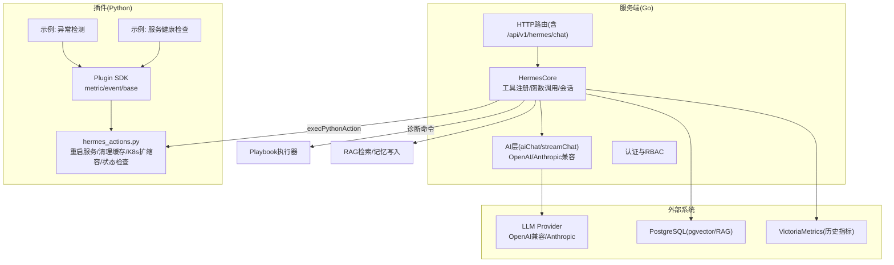
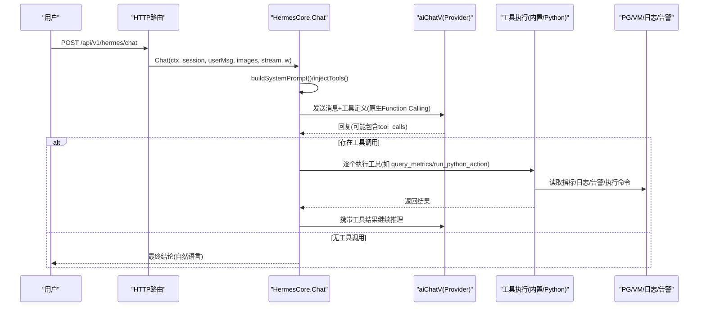
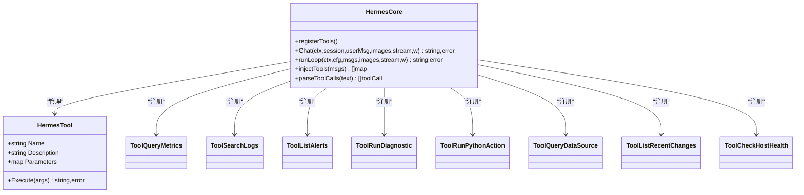
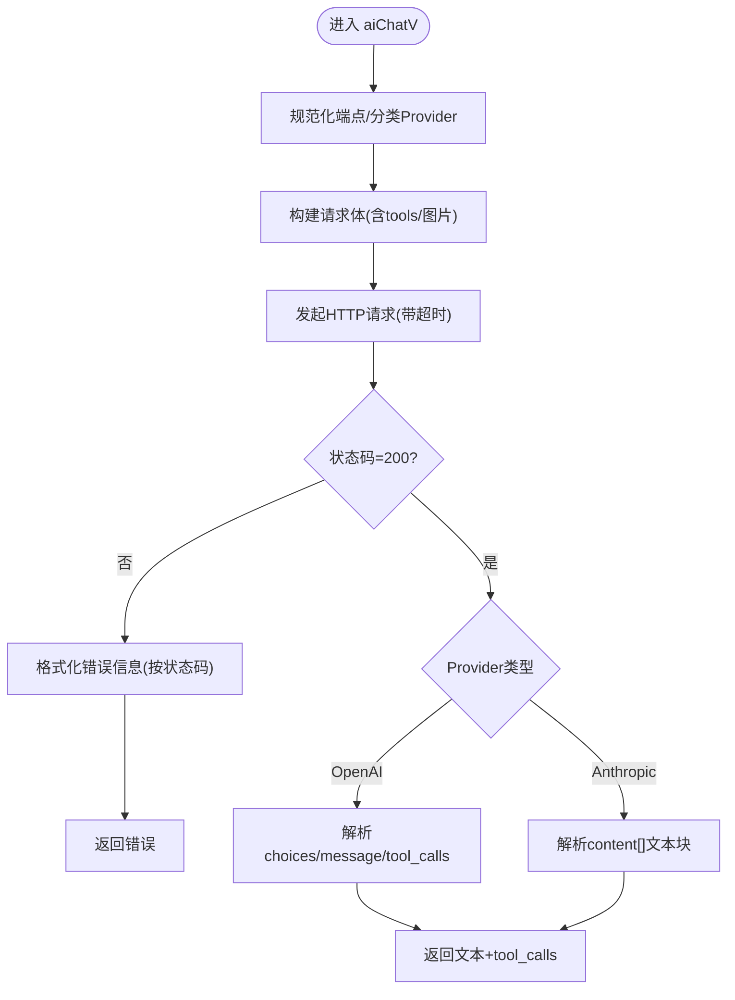
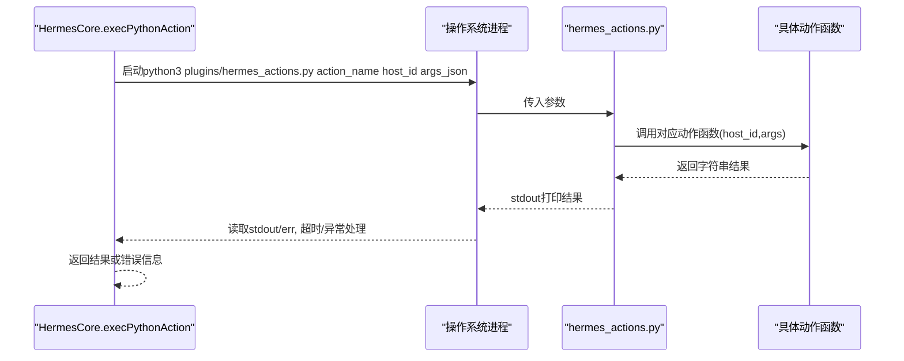
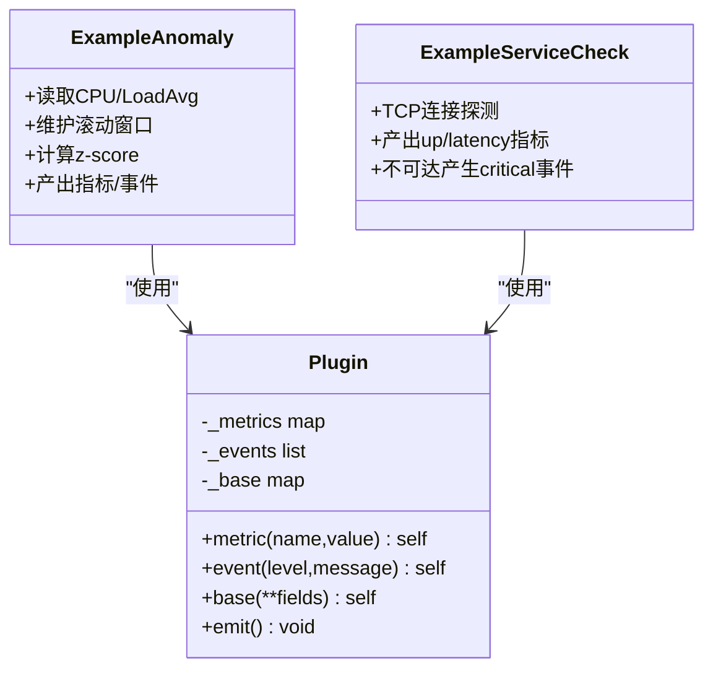
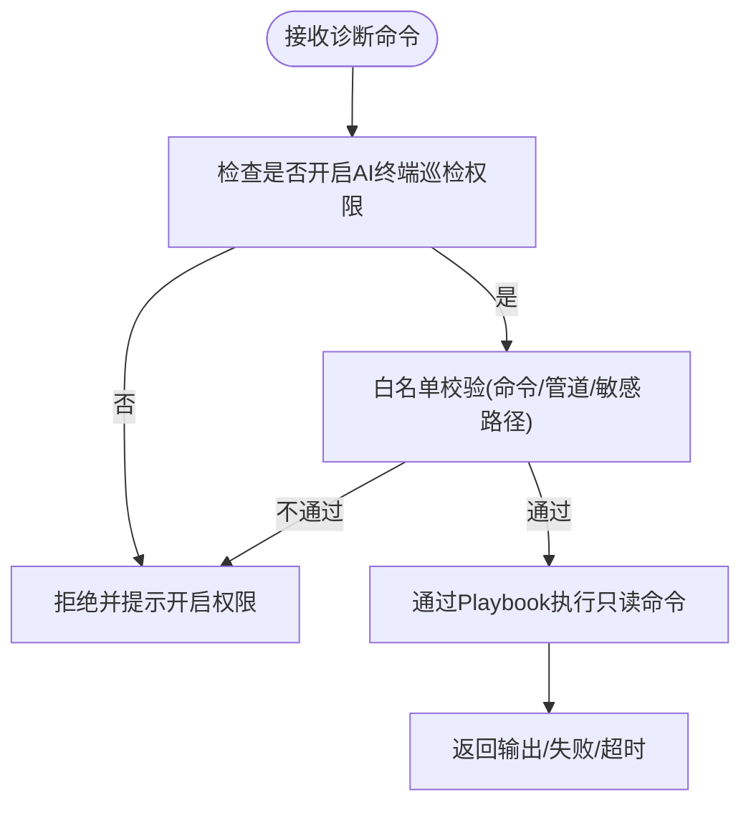
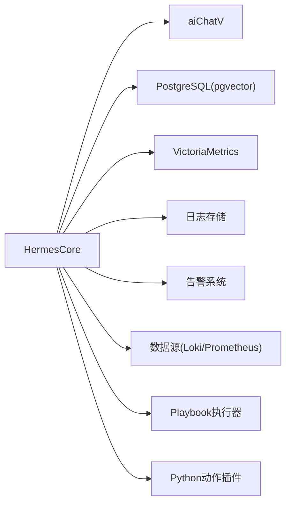
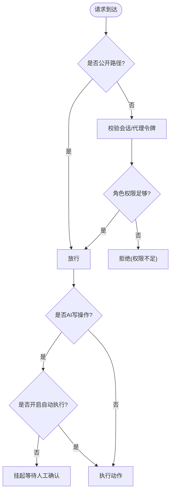
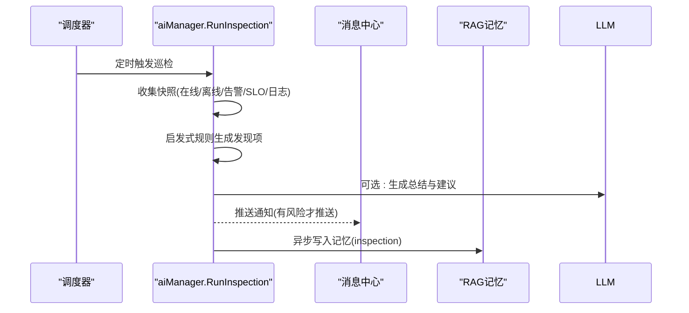

# AI动作集成插件

<cite>
**本文引用的文件列表**
- [hermes_actions.py](file://plugins/hermes_actions.py)
- [plugin_sdk.py](file://plugins/plugin_sdk.py)
- [example_ai_anomaly.py](file://plugins/example_ai_anomaly.py)
- [example_service_check.py](file://plugins/example_service_check.py)
- [hermes.go](file://cmd/server/hermes.go)
- [aiops.go](file://cmd/server/aiops.go)
- [handlers.go](file://cmd/server/handlers.go)
- [auth.go](file://cmd/server/auth.go)
- [hermes_suggest.go](file://cmd/server/hermes_suggest.go)
</cite>

## 目录
1. [引言](#引言)
2. [项目结构](#项目结构)
3. [核心组件](#核心组件)
4. [架构总览](#架构总览)
5. [详细组件分析](#详细组件分析)
6. [依赖关系分析](#依赖关系分析)
7. [性能与可扩展性](#性能与可扩展性)
8. [安全控制、权限验证与审计](#安全控制权限验证与审计)
9. [AI巡检与自动修复场景](#ai巡检与自动修复场景)
10. [模型调优与效果评估指南](#模型调优与效果评估指南)
11. [故障排查](#故障排查)
12. [结论](#结论)

## 引言
本文件围绕“AI动作集成插件”的实现进行深入解析，重点覆盖：
- hermes_actions.py 中与 Hermes AI 系统的交互逻辑（自然语言处理、意图识别、动作执行）
- AI 模型调用接口设计与错误处理机制
- 动作模板定义与执行引擎工作原理
- 将传统运维操作封装为 AI 可理解的动作指令的方法
- 安全控制、权限验证与操作审计实现细节
- AI 巡检与自动修复的实际应用场景
- 模型调优与效果评估方法指南

## 项目结构
本项目采用 Go 后端 + Python 插件的混合架构。Go 侧提供 AI 对话、工具编排、RAG 记忆、数据源查询等能力；Python 侧通过轻量 SDK 输出指标与事件，并通过独立动作脚本暴露给 Agent 执行。

图表来源
- [hermes.go:30-196](file://cmd/server/hermes.go#L30-L196)
- [aiops.go:180-361](file://cmd/server/aiops.go#L180-L361)
- [handlers.go:213-232](file://cmd/server/handlers.go#L213-L232)
- [hermes_actions.py:1-171](file://plugins/hermes_actions.py#L1-L171)
- [plugin_sdk.py:1-58](file://plugins/plugin_sdk.py#L1-L58)

章节来源
- [hermes.go:30-196](file://cmd/server/hermes.go#L30-L196)
- [aiops.go:180-361](file://cmd/server/aiops.go#L180-L361)
- [handlers.go:213-232](file://cmd/server/handlers.go#L213-L232)
- [hermes_actions.py:1-171](file://plugins/hermes_actions.py#L1-L171)
- [plugin_sdk.py:1-58](file://plugins/plugin_sdk.py#L1-L58)

## 核心组件
- Hermes 工具与执行器
  - 内置工具：查询指标、搜索日志、列出告警、相似案例检索、只读诊断命令、执行 Python 动作、数据源查询、最近变化趋势、主机健康检查等。
  - 工具以统一接口暴露，支持原生 Function Calling 或文本注入两种模式。
- AI 模型调用层
  - 支持 OpenAI 兼容与 Anthropic Messages API，自动选择请求格式，支持流式与非流式响应。
  - 对非 200 响应进行友好中文提示，区分 404/401/403/400 等错误语义。
- Python 动作插件
  - 每个函数即一个动作，接受 host_id 与参数字典，返回字符串结果。
  - 通过命令行方式被 Go 进程调用，具备超时保护与错误捕获。
- 插件 SDK
  - 提供 metric/event/base 三类输出，便于自定义采集与异常事件上报。

章节来源
- [hermes.go:30-196](file://cmd/server/hermes.go#L30-L196)
- [aiops.go:180-361](file://cmd/server/aiops.go#L180-L361)
- [hermes_actions.py:1-171](file://plugins/hermes_actions.py#L1-L171)
- [plugin_sdk.py:1-58](file://plugins/plugin_sdk.py#L1-L58)

## 架构总览
Hermes 采用三层解耦架构：
- 第一层（引擎核心）：观察→推理→行动循环 + Function Calling
- 第二层（规则与模板）：从数据库热加载规则与提示模板
- 第三层（Python 动作插件）：动态加载，上传即生效

图表来源
- [hermes.go:789-1018](file://cmd/server/hermes.go#L789-L1018)
- [aiops.go:196-361](file://cmd/server/aiops.go#L196-L361)
- [handlers.go:213-232](file://cmd/server/handlers.go#L213-L232)

## 详细组件分析

### 组件A：Hermes 工具与执行引擎
- 工具注册
  - 在初始化时集中注册所有可用工具，包括查询指标、日志、告警、诊断命令、Python 动作、数据源查询、趋势与健康检查等。
- 工具调用流程
  - 优先使用原生 Function Calling（OpenAI 兼容），否则回退到文本注入。
  - 每轮最多 5 次工具调用，避免无限循环；达到上限后强制收敛为自然语言结论。
  - 工具执行结果会被截断并追加到上下文，供下一轮推理。
- 关键实现要点
  - 工具定义 JSON 缓存，避免每轮重建。
  - 会话历史裁剪与摘要，控制 token 预算。
  - RAG 记忆注入 system prompt，跨会话复用知识。

图表来源
- [hermes.go:30-196](file://cmd/server/hermes.go#L30-L196)
- [hermes.go:789-1018](file://cmd/server/hermes.go#L789-L1018)

章节来源
- [hermes.go:30-196](file://cmd/server/hermes.go#L30-L196)
- [hermes.go:789-1018](file://cmd/server/hermes.go#L789-L1018)

### 组件B：AI 模型调用接口与错误处理
- 端点适配
  - 自动识别 Anthropic 与 OpenAI 兼容端点，补齐路径与头部。
- 请求构建
  - 支持多模态图片输入（最后一条 user 消息附加图片）。
  - 原生 Function Calling 时附带 tools/tool_choice。
- 响应解析
  - 支持 OpenAI choices[0].message.content 与 tool_calls。
  - 支持 Anthropic content[] 文本块拼接。
- 错误处理
  - 针对 404/401/403/400 给出明确中文提示，区分模型不存在、未授权、参数错误等。
  - 网络超时与客户端取消有清晰提示。

图表来源
- [aiops.go:180-361](file://cmd/server/aiops.go#L180-L361)

章节来源
- [aiops.go:180-361](file://cmd/server/aiops.go#L180-L361)

### 组件C：Python 动作插件与执行引擎
- 动作定义
  - 每个函数即一个动作，签名 (host_id: str, args: dict) -> str。
  - 通过命令行 python hermes_actions.py <action_name> [host_id] [args_json] 执行。
- 内置动作
  - 重启服务、清理缓存、Kubernetes Pod 扩缩容、检查服务状态、列出动作清单。
- 执行引擎
  - Go 侧通过 exec.CommandContext 启动 Python 进程，设置 30s 超时。
  - 写操作默认需人工确认（除非开启自动执行开关），防止未经批准的变更。
  - 异常与超时被捕获并返回给用户。

图表来源
- [hermes.go:551-581](file://cmd/server/hermes.go#L551-L581)
- [hermes_actions.py:147-171](file://plugins/hermes_actions.py#L147-L171)

章节来源
- [hermes.go:551-581](file://cmd/server/hermes.go#L551-L581)
- [hermes_actions.py:1-171](file://plugins/hermes_actions.py#L1-L171)

### 组件D：插件 SDK 与示例插件
- Plugin SDK
  - 提供 metric(event)、event(level,message)、base(**fields) 三个接口，最终 emit() 输出 JSON。
- 示例插件
  - 异常检测：维护滚动基线，计算 z-score，超过阈值产出 warning 事件与指标。
  - 服务健康检查：探测 TCP 端口连通性与延迟，不可达产生 critical 事件。

图表来源
- [plugin_sdk.py:27-58](file://plugins/plugin_sdk.py#L27-L58)
- [example_ai_anomaly.py:1-70](file://plugins/example_ai_anomaly.py#L1-L70)
- [example_service_check.py:1-42](file://plugins/example_service_check.py#L1-L42)

章节来源
- [plugin_sdk.py:1-58](file://plugins/plugin_sdk.py#L1-L58)
- [example_ai_anomaly.py:1-70](file://plugins/example_ai_anomaly.py#L1-L70)
- [example_service_check.py:1-42](file://plugins/example_service_check.py#L1-L42)

### 组件E：只读诊断命令与安全白名单
- 命令白名单
  - 仅允许只读命令与管道过滤，拒绝注入字符与敏感路径。
- 执行路径
  - 通过 Playbook 机制在目标主机执行一次性只读命令，限制超时与输出长度。
- 权限门控
  - 需要显式开启“AI 终端只读巡检”权限，并在 AI 设置中校验终端密码。

图表来源
- [hermes.go:498-549](file://cmd/server/hermes.go#L498-L549)

章节来源
- [hermes.go:498-549](file://cmd/server/hermes.go#L498-L549)

## 依赖关系分析
- 模块耦合
  - HermesCore 依赖 AI 层、存储（PG/VM）、日志、告警、数据源、Playbook 执行器。
  - Python 动作插件与 Go 进程通过标准输入输出通信，松耦合。
- 外部依赖
  - LLM Provider（OpenAI 兼容/Anthropic）
  - PostgreSQL（pgvector 用于 RAG）
  - VictoriaMetrics（历史指标查询）
- 潜在风险
  - 工具定义过大导致 prompt 过长，已做缓存与裁剪。
  - 插件执行阻塞，已加 30s 超时。
  - 诊断命令注入，已通过白名单与路径黑名单防护。

图表来源
- [hermes.go:30-196](file://cmd/server/hermes.go#L30-L196)
- [aiops.go:180-361](file://cmd/server/aiops.go#L180-L361)

章节来源
- [hermes.go:30-196](file://cmd/server/hermes.go#L30-L196)
- [aiops.go:180-361](file://cmd/server/aiops.go#L180-L361)

## 性能与可扩展性
- 工具定义缓存：避免每轮重建，降低 LLM 请求体积。
- 会话历史裁剪：保留最近若干轮，旧轮用摘要替代，控制 token 预算。
- 插件执行超时：30s 上限，避免 goroutine 永久阻塞。
- 流式输出：SSE 推送 delta 与工具状态，提升用户体验。
- 可扩展点
  - 新增内置工具：在 registerTools 中注册即可。
  - 新增 Python 动作：在 hermes_actions.py 中添加函数并加入 ACTIONS 映射。
  - 扩展数据源：在 resolveDataSource 与相关查询函数中扩展。

章节来源
- [hermes.go:1026-1068](file://cmd/server/hermes.go#L1026-L1068)
- [hermes.go:551-581](file://cmd/server/hermes.go#L551-L581)
- [hermes.go:820-868](file://cmd/server/hermes.go#L820-L868)

## 安全控制、权限验证与审计
- 认证与 RBAC
  - 所有非公开路径需登录与会话校验，按角色限制读写与高危操作。
  - 代理令牌二次校验当前角色，防止降权越权。
- AI 终端巡检权限
  - 独立开关，开启需校验终端密码；仅允许只读诊断命令。
- 诊断命令白名单
  - 严格白名单 + 敏感路径黑名单，禁止注入字符与危险操作。
- 写操作审批
  - run_python_action 属于高风险写操作，默认需人工确认；仅在开启自动执行时才真正执行。
- 审计与记录
  - 工具调用与执行结果会记录日志，便于追踪与复盘。

图表来源
- [auth.go:112-172](file://cmd/server/auth.go#L112-L172)
- [hermes.go:551-581](file://cmd/server/hermes.go#L551-L581)
- [hermes.go:498-549](file://cmd/server/hermes.go#L498-L549)

章节来源
- [auth.go:112-172](file://cmd/server/auth.go#L112-L172)
- [hermes.go:551-581](file://cmd/server/hermes.go#L551-L581)
- [hermes.go:498-549](file://cmd/server/hermes.go#L498-L549)

## AI巡检与自动修复场景
- 自动巡检
  - 定时任务触发巡检，结合启发式规则与 AI 生成总结与发现项。
  - 巡检报告持久化并可作为 RAG 记忆，供后续对话复用。
- 自动修复
  - 基于告警与 SLO 突破，结合 playbook 与审核流程实现闭环修复。
  - AI 建议与人类审批相结合，确保变更可控。

图表来源
- [aiops.go:696-733](file://cmd/server/aiops.go#L696-L733)
- [sre_api.go:62-85](file://cmd/server/sre_api.go#L62-L85)

章节来源
- [aiops.go:696-733](file://cmd/server/aiops.go#L696-L733)
- [sre_api.go:62-85](file://cmd/server/sre_api.go#L62-L85)

## 模型调优与效果评估指南
- 模型选择与配置
  - 对话模型：OpenAI 兼容或 Anthropic，按需选择成本与质量平衡的模型。
  - 嵌入模型：与对话模型解耦，可使用轻量嵌入模型降低成本。
- 提示工程
  - 系统提示词固定安全原则，注入主机清单、规则与模板，约束行为与输出格式。
  - 工具定义稳定排序，利于 Provider 缓存与可复现。
- 效果评估
  - 关注工具调用成功率、最终结论准确率、幻觉率、平均轮次与 token 消耗。
  - 利用 RAG 记忆与历史案例相似度评分辅助评估。
- 调优策略
  - 调整温度与 max_tokens，控制创造性与输出长度。
  - 优化工具描述与参数说明，提高模型意图识别准确性。
  - 定期更新规则与模板，沉淀最佳实践。

章节来源
- [aiops.go:27-45](file://cmd/server/aiops.go#L27-L45)
- [hermes.go:1227-1265](file://cmd/server/hermes.go#L1227-L1265)
- [hermes.go:1026-1068](file://cmd/server/hermes.go#L1026-L1068)

## 故障排查
- 常见错误
  - AI 未配置或未启用：检查 Endpoint、Model、API Key。
  - 404/401/403：模型不存在或未授权，确认模型名与权限。
  - 插件执行失败：检查 Python 环境、依赖、动作名称与参数。
  - 诊断命令被拒：检查白名单与敏感路径。
- 定位方法
  - 查看服务端日志（工具调用与执行结果）。
  - 使用“测试 AI 配置”与“测试向量化配置”自检连通性。
  - 通过“推荐问题”快速验证各能力可用性。

章节来源
- [aiops.go:82-116](file://cmd/server/aiops.go#L82-L116)
- [hermes.go:551-581](file://cmd/server/hermes.go#L551-L581)
- [hermes.go:498-549](file://cmd/server/hermes.go#L498-L549)
- [hermes_suggest.go:1-39](file://cmd/server/hermes_suggest.go#L1-L39)

## 结论
本方案通过“Go 引擎 + Python 插件”的松耦合设计，实现了强大的 AI 动作集成能力。Hermes 工具链与 Function Calling 让模型能可靠地获取真实数据并执行受控操作；严格的白名单与权限门控保障安全性；RAG 与巡检机制使系统具备持续学习与自我进化的能力。通过合理的提示工程与模型调优，可在保证安全的前提下显著提升运维效率与稳定性。