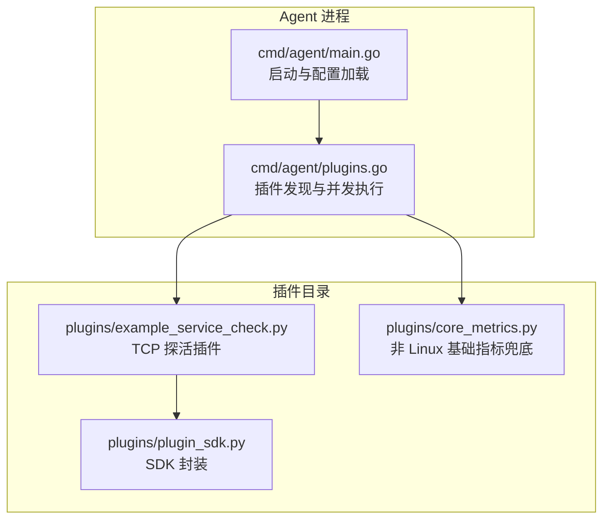
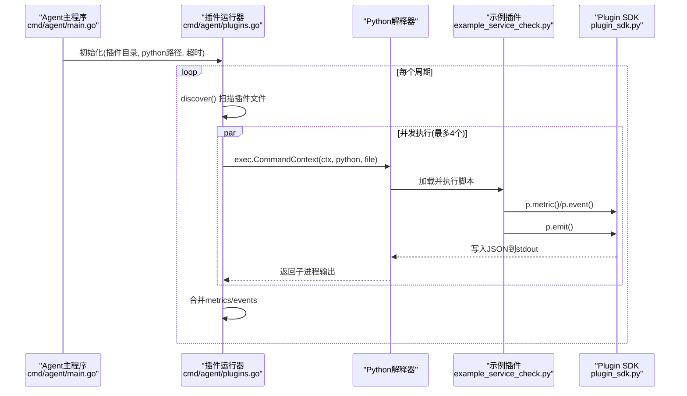
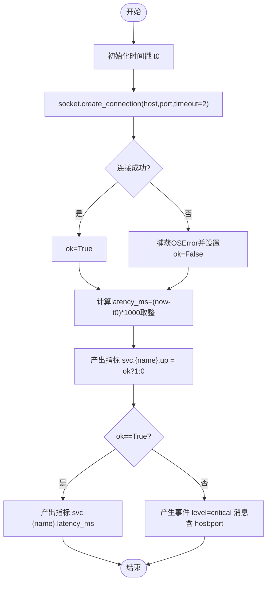
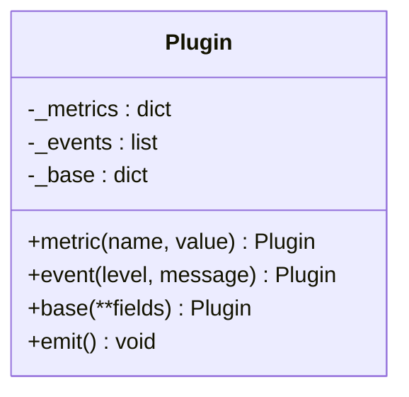
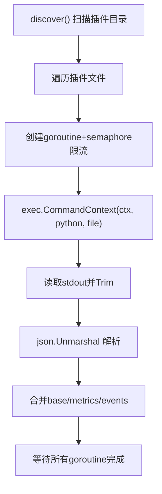
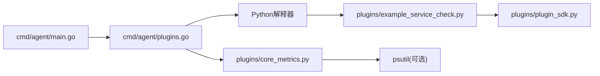

# 服务健康检查插件

<cite>
**本文引用的文件**
- [example_service_check.py](file://plugins/example_service_check.py)
- [plugin_sdk.py](file://plugins/plugin_sdk.py)
- [core_metrics.py](file://plugins/core_metrics.py)
- [plugins.go](file://cmd/agent/plugins.go)
- [main.go](file://cmd/agent/main.go)
- [config.example.json](file://config.example.json)
- [README.md](file://README.md)
</cite>

## 目录
1. [简介](#简介)
2. [项目结构](#项目结构)
3. [核心组件](#核心组件)
4. [架构总览](#架构总览)
5. [详细组件分析](#详细组件分析)
6. [依赖关系分析](#依赖关系分析)
7. [性能与可扩展性](#性能与可扩展性)
8. [部署示例](#部署示例)
9. [故障排查指南](#故障排查指南)
10. [结论](#结论)

## 简介
本文件聚焦于“服务健康检查插件”的实现与使用，围绕 example_service_check.py 的 TCP 端口连通性检测逻辑展开，深入解析 socket.create_connection 的使用、超时处理、延迟计算、指标命名规范（svc.{name}.up 与 svc.{name}.latency_ms）、以及不可达时生成 critical 级别事件告警的流程。同时说明如何配置 TARGETS 列表以监控数据库、缓存、外部 API 等外部依赖，并给出与 Plugin SDK 的集成模式、最佳实践、部署示例与故障排查建议。

## 项目结构
该仓库采用 Go 核心 + Python 插件层的混合架构：Go Agent 负责进程发现、并发执行插件、合并输出；Python 插件通过标准输出 JSON 上报自定义指标与事件。示例服务健康检查插件位于 plugins 目录，配合 plugin_sdk.py 提供的轻量 SDK 快速产出结果。

图表来源
- [main.go:74-140](file://cmd/agent/main.go#L74-L140)
- [plugins.go:53-100](file://cmd/agent/plugins.go#L53-L100)
- [example_service_check.py:1-42](file://plugins/example_service_check.py#L1-L42)
- [plugin_sdk.py:27-58](file://plugins/plugin_sdk.py#L27-L58)
- [core_metrics.py:1-65](file://plugins/core_metrics.py#L1-L65)

章节来源
- [main.go:74-140](file://cmd/agent/main.go#L74-L140)
- [plugins.go:53-100](file://cmd/agent/plugins.go#L53-L100)

## 核心组件
- 示例服务健康检查插件：实现 TCP 端口连通性探测，产出 up 与 latency 指标，并在不可达时产生 critical 事件。
- Plugin SDK：提供 metric/event/base 三个接口，最终 emit() 将结果序列化为 JSON 输出到 stdout。
- Agent 插件运行器：按扩展名白名单发现插件，并发执行，限制最大并行度，统一超时控制，合并 metrics 与 events。

章节来源
- [example_service_check.py:1-42](file://plugins/example_service_check.py#L1-L42)
- [plugin_sdk.py:27-58](file://plugins/plugin_sdk.py#L27-L58)
- [plugins.go:102-172](file://cmd/agent/plugins.go#L102-L172)

## 架构总览
从 Agent 启动到插件执行与结果聚合的关键流程如下：

图表来源
- [main.go:138-141](file://cmd/agent/main.go#L138-L141)
- [plugins.go:102-172](file://cmd/agent/plugins.go#L102-L172)
- [example_service_check.py:24-41](file://plugins/example_service_check.py#L24-L41)
- [plugin_sdk.py:48-58](file://plugins/plugin_sdk.py#L48-L58)

## 详细组件分析

### 示例服务健康检查插件（TCP 连通性）
- 目标定义：TARGETS 为元组列表，每项包含 (host, port, name)。注释明确不要探测本机监控 API，应监控外部依赖（数据库、缓存、第三方 API）。
- 连接建立：使用 socket.create_connection((host, port), timeout=2) 发起 TCP 握手，timeout 单位为秒，避免阻塞过久。
- 异常处理：捕获 OSError（网络不可达、拒绝连接、DNS 失败等），将 ok 置为 False。
- 延迟计算：记录 t0 = time.time()，在连接成功后计算 latency_ms = round((time.time() - t0) * 1000, 1)，保留一位小数毫秒值。
- 指标产出：
  - svc.{name}.up：布尔型指标，可达为 1，不可达为 0。
  - svc.{name}.latency_ms：仅在可达时产出，表示一次 TCP 握手的耗时。
- 事件告警：当不可达时，调用 p.event("critical", "...") 产生严重级别事件，便于后续告警治理与闭环。
- 输出：最后调用 p.emit() 将 metrics 与 events 序列化输出给 Agent。

图表来源
- [example_service_check.py:24-41](file://plugins/example_service_check.py#L24-L41)

章节来源
- [example_service_check.py:1-42](file://plugins/example_service_check.py#L1-L42)

### Plugin SDK 集成模式
- 类与方法：
  - Plugin.metric(name, value)：记录数值型指标（gauge），内部转为 float。
  - Plugin.event(level, message)：记录事件，level 支持 info/warning/critical。
  - Plugin.base(**fields)：高级用法，用于非 Linux 平台的基础指标兜底。
  - Plugin.emit()：将当前累积的 metrics、events、base 序列化为 JSON 输出到 stdout。
- 约定：
  - 指标键建议带命名空间，避免冲突。
  - 插件应快速返回，崩溃/超时不影响 Agent 核心。
  - events.source 可省略，由 Go 侧自动补全为插件名。

图表来源
- [plugin_sdk.py:27-58](file://plugins/plugin_sdk.py#L27-L58)

章节来源
- [plugin_sdk.py:1-58](file://plugins/plugin_sdk.py#L1-L58)

### Agent 插件运行器（并发与超时）
- 插件发现：仅允许 .py/.sh 扩展名，忽略 dotfiles、下划线前缀、plugin_sdk.py 与 requirements.txt。
- 并发执行：使用信号量限制最大并发数（默认 4），每个插件独立 goroutine 与 context.WithTimeout 超时控制。
- 输出合并：分别合并 base、metrics、events；若事件未指定 source，则填充为插件文件名（不含扩展）。
- 错误处理：单个插件失败或超时会被记录日志并跳过，不影响其他插件与核心。

图表来源
- [plugins.go:62-100](file://cmd/agent/plugins.go#L62-L100)
- [plugins.go:102-172](file://cmd/agent/plugins.go#L102-L172)

章节来源
- [plugins.go:53-172](file://cmd/agent/plugins.go#L53-L172)

### 指标命名规范与设计思路
- svc.{name}.up：表示某服务的可用性状态，取值 0/1，便于面板直接展示“是否可用”。
- svc.{name}.latency_ms：表示一次 TCP 连接的耗时（毫秒），仅在可达时产出，反映链路质量。
- 设计优势：
  - 统一的命名空间 svc.*，便于按服务维度聚合与筛选。
  - up 与 latency 分离，既可用于可用性告警，也可用于性能趋势分析。
  - 名称简洁直观，易于在告警规则与看板中复用。

章节来源
- [example_service_check.py:34-39](file://plugins/example_service_check.py#L34-L39)

### 事件告警（critical 级别）
- 触发条件：TCP 连接失败（OSError）时，插件立即产生一条 critical 事件，消息中包含服务名与 host:port，便于定位。
- 事件传播：Agent 合并所有插件的事件后上报至服务端，进入 SRE 中枢进行告警治理（静默/抑制/路由）与通知推送。
- 最佳实践：
  - 事件消息尽量包含关键上下文（服务名、目标地址、端口）。
  - 结合阈值与窗口策略，避免瞬时抖动导致告警风暴。

章节来源
- [example_service_check.py:38-39](file://plugins/example_service_check.py#L38-L39)
- [plugins.go:137-142](file://cmd/agent/plugins.go#L137-L142)

## 依赖关系分析
- 插件层依赖：
  - example_service_check.py 依赖标准库 socket、time 与自定义 plugin_sdk.py。
  - core_metrics.py 可选依赖 psutil（requirements.txt 声明），在非 Linux 平台作为基础指标兜底。
- Agent 层依赖：
  - main.go 负责加载配置、初始化插件运行器（包含插件目录、python 解释器路径、超时）。
  - plugins.go 负责插件发现、并发执行、超时控制与结果合并。

图表来源
- [main.go:138-141](file://cmd/agent/main.go#L138-L141)
- [plugins.go:102-172](file://cmd/agent/plugins.go#L102-L172)
- [core_metrics.py:18-22](file://plugins/core_metrics.py#L18-L22)

章节来源
- [main.go:138-141](file://cmd/agent/main.go#L138-L141)
- [plugins.go:102-172](file://cmd/agent/plugins.go#L102-L172)
- [core_metrics.py:1-65](file://plugins/core_metrics.py#L1-L65)

## 性能与可扩展性
- 并发控制：插件运行器限制最大并发数为 4，避免大量 Python 进程同时启动造成 CPU/内存尖峰。
- 超时保护：每个插件执行受 context.WithTimeout 控制，防止挂起影响整体采集周期。
- 指标粒度：示例插件对每个目标进行一次 TCP 握手，开销较小；如需更细粒度（如多次采样取均值/分位数），可在插件内自行实现。
- 可扩展方向：
  - 将 TARGETS 改为从配置文件或服务发现动态读取，减少硬编码。
  - 扩展为 HTTP 探活、SQL 探活、DNS 查询等更多协议。
  - 增加重试与指数退避，降低偶发抖动导致的误报。

[本节为通用指导，不直接分析具体文件]

## 部署示例
- 基本步骤：
  - 确保 Agent 已安装并运行，且 plugins_dir 指向包含 example_service_check.py 的目录。
  - 在 config.json 中配置 server、report_interval、plugin_interval、plugins_dir、python 等字段。
  - 编辑 example_service_check.py 中的 TARGETS 列表，添加需要监控的外部服务（数据库、缓存、API 等）。
  - 重启 Agent，观察面板中对应指标的 up 与 latency 曲线，以及事件中心是否出现 critical 事件。
- 配置参考：
  - 参考 config.example.json 中的字段含义与默认值。
  - 多服务端推送可通过 servers 数组配置多个 server+token。

章节来源
- [config.example.json:1-16](file://config.example.json#L1-L16)
- [README.md:124-134](file://README.md#L124-L134)

## 故障排查指南
- 插件未执行或无输出：
  - 确认 plugins_dir 正确，且 example_service_check.py 具备可执行权限。
  - 检查 python 解释器路径是否正确（Windows 下通常为 python，Linux/macOS 为 python3）。
  - 查看 Agent 日志中是否有“插件执行失败”的记录。
- 指标未更新：
  - 确认 report_interval 与 plugin_interval 配置合理，插件执行周期不应短于系统期望。
  - 检查 TARGETS 中的 host/port/name 是否正确，尤其是 DNS 解析与防火墙策略。
- 频繁 critical 事件：
  - 评估网络抖动与目标服务稳定性，必要时在插件内增加重试与去抖逻辑。
  - 在服务端配置告警治理（静默/抑制/路由），避免告警风暴。
- 超时问题：
  - 调整 Agent 插件超时（在初始化插件运行器处）与插件内部 socket.timeout，平衡可靠性与时效性。
- 依赖缺失：
  - 若使用 core_metrics.py，请确保安装 psutil（见 requirements.txt）。

章节来源
- [plugins.go:102-172](file://cmd/agent/plugins.go#L102-L172)
- [plugins/requirements.txt:1-4](file://plugins/requirements.txt#L1-L4)

## 结论
示例服务健康检查插件通过简单的 TCP 探针实现了对外部依赖的快速可用性与时延观测，结合 Plugin SDK 的标准化输出与 Agent 的并发执行框架，形成了低耦合、高扩展的自定义监控方案。遵循统一的指标命名规范与事件级别约定，可有效支撑告警治理与可视化分析。实际部署中，建议将 TARGETS 动态化、增强容错与重试机制，并结合服务端告警治理策略，构建稳定可靠的业务可用性监控体系。