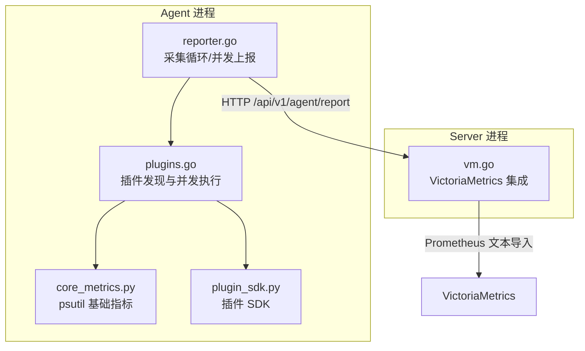
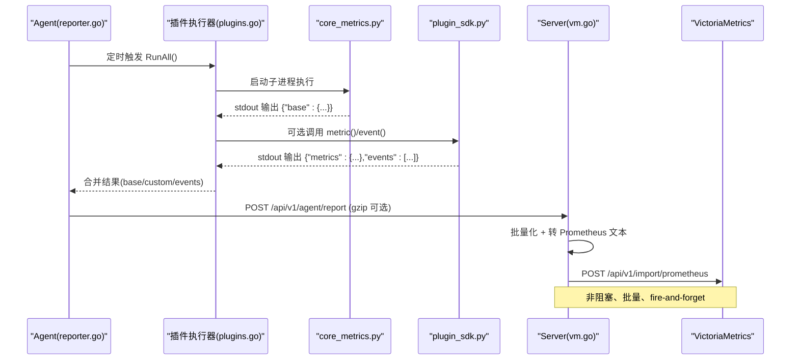
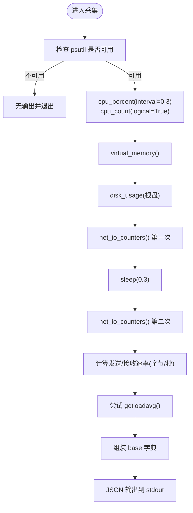
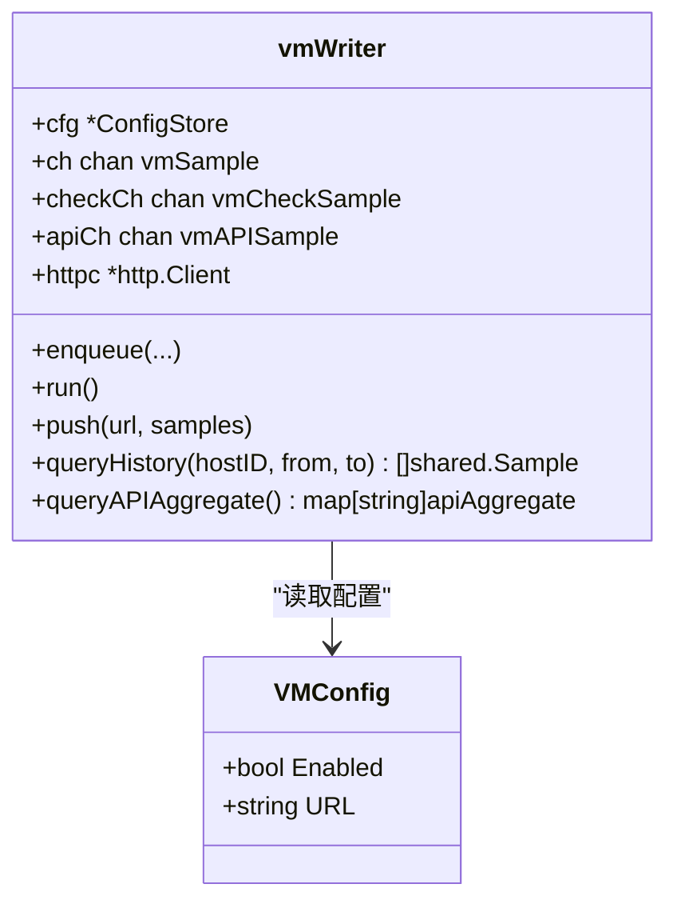
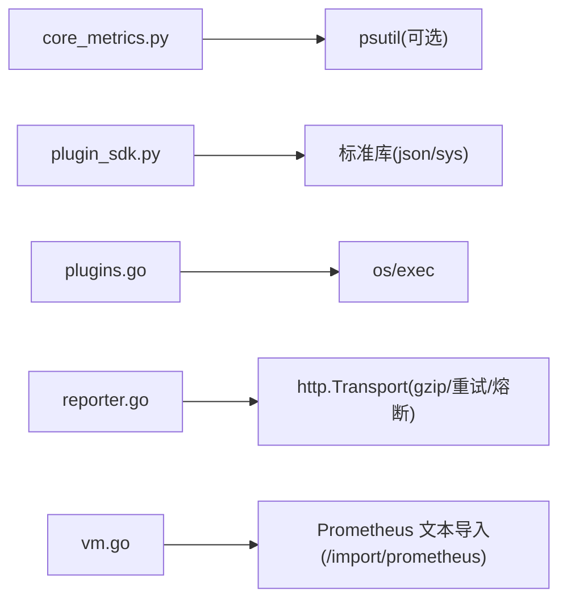

# 核心指标采集插件

<cite>
**本文引用的文件**
- [plugins/core_metrics.py](file://plugins/core_metrics.py)
- [plugins/plugin_sdk.py](file://plugins/plugin_sdk.py)
- [cmd/agent/plugins.go](file://cmd/agent/plugins.go)
- [cmd/agent/reporter.go](file://cmd/agent/reporter.go)
- [cmd/server/vm.go](file://cmd/server/vm.go)
- [README.md](file://README.md)
- [README_EN.md](file://README_EN.md)
</cite>

## 目录
1. [简介](#简介)
2. [项目结构](#项目结构)
3. [核心组件](#核心组件)
4. [架构总览](#架构总览)
5. [详细组件分析](#详细组件分析)
6. [依赖关系分析](#依赖关系分析)
7. [性能与扩展性](#性能与扩展性)
8. [故障排查指南](#故障排查指南)
9. [结论](#结论)
10. [附录：查询与分析示例](#附录查询与分析示例)

## 简介
本文件聚焦“核心指标采集插件”的实现原理，围绕以下目标展开：
- 深入解读 core_metrics.py 在 Windows/macOS 上对 CPU、内存、磁盘、网络等基础资源的采集逻辑
- 说明指标数据的结构化组织与时间序列化处理路径
- 解释插件如何与 VictoriaMetrics 时序数据库交互（服务端侧），以及数据压缩与传输优化策略
- 展示自定义业务指标的扩展方法
- 提供性能调优建议与大规模部署最佳实践
- 给出指标查询与分析的实际案例

## 项目结构
与核心指标采集插件相关的代码分布在 Agent 端与 Server 端：
- Agent 端负责发现并执行 Python 插件，合并输出，并通过 HTTP 上报给 Server
- Server 端可选将指标以 Prometheus 文本格式批量写入 VictoriaMetrics，并提供历史查询与聚合能力

图表来源
- [cmd/agent/reporter.go:423-460](file://cmd/agent/reporter.go#L423-L460)
- [cmd/agent/plugins.go:102-147](file://cmd/agent/plugins.go#L102-L147)
- [plugins/core_metrics.py:1-65](file://plugins/core_metrics.py#L1-L65)
- [plugins/plugin_sdk.py:1-58](file://plugins/plugin_sdk.py#L1-L58)
- [cmd/server/vm.go:505-571](file://cmd/server/vm.go#L505-L571)

章节来源
- [cmd/agent/reporter.go:423-460](file://cmd/agent/reporter.go#L423-L460)
- [cmd/agent/plugins.go:102-147](file://cmd/agent/plugins.go#L102-L147)
- [plugins/core_metrics.py:1-65](file://plugins/core_metrics.py#L1-L65)
- [plugins/plugin_sdk.py:1-58](file://plugins/plugin_sdk.py#L1-L58)
- [cmd/server/vm.go:505-571](file://cmd/server/vm.go#L505-L571)

## 核心组件
- 核心指标采集插件（core_metrics.py）
  - 在非 Linux 平台作为原生采集器的兜底，使用 psutil 采集 CPU、内存、磁盘、网络速率、负载、进程数、运行时长等基础指标，并以 JSON 输出 base 字段
- 插件 SDK（plugin_sdk.py）
  - 提供轻量 API，便于编写自定义指标与事件；最终通过 stdout 输出 JSON
- Agent 插件执行器（plugins.go）
  - 发现并并发执行插件，限制并发度，超时保护，解析 JSON 输出并合并
- Agent 上报器（reporter.go）
  - 定时触发采集与上报，处理 gzip 压缩降级、重试与熔断，广播到多个后端
- Server 端 VictoriaMetrics 集成（vm.go）
  - 将主机样本转换为 Prometheus 文本格式，批量写入 /api/v1/import/prometheus，并提供导出与 PromQL 聚合查询

章节来源
- [plugins/core_metrics.py:1-65](file://plugins/core_metrics.py#L1-L65)
- [plugins/plugin_sdk.py:1-58](file://plugins/plugin_sdk.py#L1-L58)
- [cmd/agent/plugins.go:102-147](file://cmd/agent/plugins.go#L102-L147)
- [cmd/agent/reporter.go:139-200](file://cmd/agent/reporter.go#L139-L200)
- [cmd/server/vm.go:505-571](file://cmd/server/vm.go#L505-L571)

## 架构总览
从采集到落库的端到端流程如下：

图表来源
- [cmd/agent/reporter.go:423-460](file://cmd/agent/reporter.go#L423-L460)
- [cmd/agent/plugins.go:102-147](file://cmd/agent/plugins.go#L102-L147)
- [plugins/core_metrics.py:1-65](file://plugins/core_metrics.py#L1-L65)
- [plugins/plugin_sdk.py:1-58](file://plugins/plugin_sdk.py#L1-L58)
- [cmd/server/vm.go:505-571](file://cmd/server/vm.go#L505-L571)

## 详细组件分析

### 核心指标采集插件（core_metrics.py）
- 设计定位
  - 在 Linux 以外平台作为基础指标兜底；Linux 下由 Go 原生采集器直接读取系统接口，该插件产出会被忽略
- 采集项与实现要点
  - CPU：一次性采样 cpu_percent(interval=0.3)，返回百分比与逻辑核数
  - 内存：virtual_memory 获取总量、已用、占用率
  - 磁盘：根据平台选择根盘，disk_usage 获取总量、已用、百分比
  - 网络：两次 net_io_counters 间隔 0.3s，计算发送/接收速率（字节/秒）
  - 负载：尝试 getloadavg，失败时回退为 0
  - 其他：进程数量、系统运行时长
- 数据结构
  - 输出 JSON 对象包含 base 字段，键名如 cpu_percent、mem_total、net_sent_rate 等，均为数值型
- 错误与健壮性
  - 未安装 psutil 时直接退出，不产生输出，避免影响主流程
  - 磁盘信息异常时回退为 0，保证整体输出稳定
- 复杂度与开销
  - 单次采集涉及少量系统调用与一次短睡眠（0.3s），CPU/IO 开销极低，适合高频轮询

图表来源
- [plugins/core_metrics.py:17-65](file://plugins/core_metrics.py#L17-L65)

章节来源
- [plugins/core_metrics.py:1-65](file://plugins/core_metrics.py#L1-L65)

### 插件 SDK（plugin_sdk.py）
- 作用
  - 简化自定义指标与事件的编写，统一输出 JSON 契约
- 关键 API
  - metric(name, value)：记录一个数值型指标
  - event(level, message)：产生一条事件（info/warning/critical）
  - base(**fields)：高级用法，提供基础指标（仅非 Linux 兜底场景）
  - emit()：将 metrics/events/base 合并后 JSON 输出到 stdout
- 约定
  - 指标命名建议带命名空间，避免冲突
  - 插件应快速返回，崩溃或超时不影响 Agent 核心

章节来源
- [plugins/plugin_sdk.py:1-58](file://plugins/plugin_sdk.py#L1-L58)

### Agent 插件执行器（plugins.go）
- 插件发现
  - 启动时缓存插件列表，跳过 SDK 与配置文件，仅允许 .py/.sh 扩展名，拒绝无扩展名与潜在二进制
- 并发执行
  - 并发上限固定为 4，避免同时拉起过多 Python 进程导致资源抖动
  - 每个插件独立 goroutine，设置超时上下文，挂起或崩溃不会拖垮核心
- 输出合并
  - 解析 stdout JSON，合并 base/metrics/events；若 events 缺少 source，自动补全为插件名

章节来源
- [cmd/agent/plugins.go:62-100](file://cmd/agent/plugins.go#L62-L100)
- [cmd/agent/plugins.go:102-147](file://cmd/agent/plugins.go#L102-L147)
- [cmd/agent/plugins.go:149-172](file://cmd/agent/plugins.go#L149-L172)

### Agent 上报器（reporter.go）
- 采集与合并
  - 优先使用原生采集器；不支持时使用 core 插件产出的 base 作为兜底
  - 合并最新 custom 指标与 pending 事件
- 上报策略
  - 多后端并发上报，互不影响
  - gzip 压缩阈值与自适应降级：当服务端返回 400 且携带 gzip 头时，禁用压缩并重试
  - 重试与熔断：单目标最多 3 次重试，连续失败打开断路器，冷却期后恢复
- 事件可靠性
  - 只要任一后端成功即认为事件已投递；全部失败才重新入队

章节来源
- [cmd/agent/reporter.go:423-460](file://cmd/agent/reporter.go#L423-L460)
- [cmd/agent/reporter.go:139-200](file://cmd/agent/reporter.go#L139-L200)
- [cmd/agent/reporter.go:213-253](file://cmd/agent/reporter.go#L213-L253)

### Server 端 VictoriaMetrics 集成（vm.go）
- 写入路径
  - 将主机样本转为 Prometheus 文本格式，批量写入 /api/v1/import/prometheus
  - 指标族以 aiops_ 前缀命名，标签包含 host、instance、category、path、gpu、proto、state 等
- 批量与异步
  - 内部缓冲队列，定时 flush，fire-and-forget，确保 Agent 摄入不被阻塞
- 历史查询与聚合
  - 支持 /api/v1/export 拉取 NDJSON 并按时间戳重组为样本数组
  - 支持 PromQL 瞬时查询，按 api_id 聚合平均/P95/可用率/采样数等

图表来源
- [cmd/server/vm.go:31-40](file://cmd/server/vm.go#L31-L40)
- [cmd/server/vm.go:67-77](file://cmd/server/vm.go#L67-L77)
- [cmd/server/vm.go:505-571](file://cmd/server/vm.go#L505-L571)
- [cmd/server/vm.go:715-742](file://cmd/server/vm.go#L715-L742)
- [cmd/server/vm.go:469-498](file://cmd/server/vm.go#L469-L498)

章节来源
- [cmd/server/vm.go:505-571](file://cmd/server/vm.go#L505-L571)
- [cmd/server/vm.go:715-742](file://cmd/server/vm.go#L715-L742)
- [cmd/server/vm.go:469-498](file://cmd/server/vm.go#L469-L498)

## 依赖关系分析
- 插件层依赖
  - core_metrics.py 依赖 psutil；未安装则优雅退出
  - plugin_sdk.py 为标准库 json/sys，零外部依赖
- Agent 层依赖
  - plugins.go 依赖 os/exec 启动子进程，并发控制与超时保护
  - reporter.go 依赖 http.Transport 复用连接，gzip 压缩与自适应降级
- Server 层依赖
  - vm.go 依赖标准库 http 与 encoding/json，对接 VictoriaMetrics 的 Prometheus 文本导入接口

图表来源
- [plugins/core_metrics.py:17-22](file://plugins/core_metrics.py#L17-L22)
- [plugins/plugin_sdk.py:23-58](file://plugins/plugin_sdk.py#L23-L58)
- [cmd/agent/plugins.go:149-172](file://cmd/agent/plugins.go#L149-L172)
- [cmd/agent/reporter.go:33-49](file://cmd/agent/reporter.go#L33-L49)
- [cmd/server/vm.go:505-571](file://cmd/server/vm.go#L505-L571)

章节来源
- [plugins/core_metrics.py:17-22](file://plugins/core_metrics.py#L17-L22)
- [plugins/plugin_sdk.py:23-58](file://plugins/plugin_sdk.py#L23-L58)
- [cmd/agent/plugins.go:149-172](file://cmd/agent/plugins.go#L149-L172)
- [cmd/agent/reporter.go:33-49](file://cmd/agent/reporter.go#L33-L49)
- [cmd/server/vm.go:505-571](file://cmd/server/vm.go#L505-L571)

## 性能与扩展性
- 采集端优化
  - 插件并发上限 4，避免进程风暴
  - 插件超时保护，崩溃隔离
  - core_metrics.py 单次采集含 0.3s 睡眠，尽量降低系统调用频率
- 传输端优化
  - gzip 压缩阈值 512 字节，低于阈值不压缩，减少 CPU 开销
  - 自适应降级：遇到 400 且携带 gzip 头时禁用压缩并重试
  - 连接池复用，HTTP/2 显式禁用以提升重启恢复速度
- 服务端优化
  - 批量写入 VM，定时器 flush，非阻塞 fire-and-forget
  - 历史查询与 PromQL 聚合在服务端现算，减轻前端压力
- 大规模部署建议
  - 合理设置 reportInterval 与 pluginInterval，降低带宽与 CPU 消耗
  - 启用 VictoriaMetrics 作为长期存储，内嵌时序窗口仅做热缓存
  - 多后端冗余上报，结合熔断与重试提升可用性

章节来源
- [cmd/agent/plugins.go:116-122](file://cmd/agent/plugins.go#L116-L122)
- [cmd/agent/reporter.go:55-57](file://cmd/agent/reporter.go#L55-L57)
- [cmd/agent/reporter.go:139-200](file://cmd/agent/reporter.go#L139-L200)
- [cmd/server/vm.go:125-172](file://cmd/server/vm.go#L125-L172)
- [README_EN.md:991-1011](file://README_EN.md#L991-L1011)

## 故障排查指南
- 插件未产出
  - 检查是否安装 psutil；未安装会直接退出且不产生输出
  - 查看插件日志与 Agent 日志中“插件执行失败”提示
- 指标缺失或不完整
  - 确认 core_metrics.py 所在平台是否为非 Linux；Linux 下由原生采集器覆盖
  - 检查磁盘权限与根盘环境变量是否正确
- 上报失败或频繁重试
  - 关注 403（需重新注册）、400（可能 gzip 被代理损坏，会自动禁用压缩）
  - 观察熔断状态与冷却期，确认网络抖动导致的瞬态失败
- VM 写入失败
  - 检查 VM URL 与 enabled 配置
  - 查看服务端日志中的“VictoriaMetrics 写入失败”警告

章节来源
- [plugins/core_metrics.py:17-22](file://plugins/core_metrics.py#L17-L22)
- [cmd/agent/plugins.go:124-128](file://cmd/agent/plugins.go#L124-L128)
- [cmd/agent/reporter.go:184-198](file://cmd/agent/reporter.go#L184-L198)
- [cmd/server/vm.go:565-571](file://cmd/server/vm.go#L565-L571)

## 结论
- core_metrics.py 为非 Linux 平台的基础指标兜底方案，基于 psutil 实现低开销的系统级监控
- Agent 通过插件执行器与上报器完成采集、合并、压缩与可靠上报
- Server 端将指标标准化为 Prometheus 文本格式，批量写入 VictoriaMetrics，并提供高效的历史查询与聚合能力
- 通过并发控制、超时保护、gzip 自适应降级与熔断机制，系统在大规模环境下具备良好稳定性与可扩展性

## 附录：查询与分析示例
以下为面向 VictoriaMetrics 的常见查询思路（PromQL），用于分析与可视化：
- 主机 CPU 使用率趋势
  - 示例：aiops_cpu_percent{host="your-host-id"}
- 内存使用率与总量
  - 示例：aiops_mem_percent{host="your-host-id"}
  - 示例：aiops_mem_used_bytes{host="your-host-id"}
- 磁盘分区使用率（按 path 标签区分）
  - 示例：aiops_disk_vol_percent{host="your-host-id", path="/data"}
- 网络收发速率
  - 示例：aiops_net_sent_rate{host="your-host-id"}
  - 示例：aiops_net_recv_rate{host="your-host-id"}
- 连接数分布（按 proto+state 标签）
  - 示例：aiops_net_conn_count{host="your-host-id", proto="tcp", state="ESTABLISHED"}
- GPU 指标（按 gpu 标签区分显卡）
  - 示例：aiops_gpu_util_percent{host="your-host-id", gpu="GPU0"}
- 拨测与 API 性能（aiops_check_* / aiops_api_*）
  - 示例：avg_over_time(aiops_api_latency_ms[1h])
  - 示例：quantile_over_time(0.95, aiops_api_latency_ms[1h])

章节来源
- [cmd/server/vm.go:505-571](file://cmd/server/vm.go#L505-L571)
- [cmd/server/vm.go:469-498](file://cmd/server/vm.go#L469-L498)
- [README.md:574-606](file://README.md#L574-L606)
- [README_EN.md:499-526](file://README_EN.md#L499-L526)